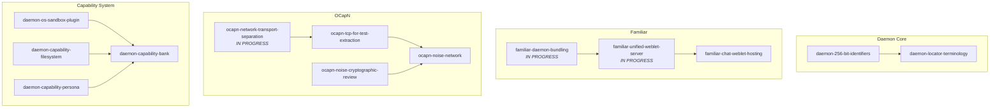

# Endo Design Documents

*Last updated: 2026-02-24*

## Summary

| Design | Date | Status |
|--------|------|--------|
| [chat-reply-chain-visualization](chat-reply-chain-visualization.md) | 2026-02-23 | Not Started |
| [chat-spaces-gutter](chat-spaces-gutter.md) | 2026-02-21 | **Complete** |
| [chat-spaces-inbox](chat-spaces-inbox.md) | 2026-02-21 | **Complete** |
| [daemon-256-bit-identifiers](daemon-256-bit-identifiers.md) | 2026-02-24 | Not Started |
| [daemon-capability-bank](daemon-capability-bank.md) | 2026-02-15 | Not Started |
| [daemon-capability-filesystem](daemon-capability-filesystem.md) | 2026-02-15 | Not Started |
| [daemon-capability-persona](daemon-capability-persona.md) | 2026-02-16 | Not Started |
| [daemon-locator-terminology](daemon-locator-terminology.md) | 2026-02-24 | Not Started |
| [daemon-os-sandbox-plugin](daemon-os-sandbox-plugin.md) | 2026-02-15 | Not Started |
| [familiar-chat-weblet-hosting](familiar-chat-weblet-hosting.md) | 2026-02-14 | Not Started |
| [familiar-daemon-bundling](familiar-daemon-bundling.md) | 2026-02-14 | In Progress |
| [familiar-electron-shell](familiar-electron-shell.md) | 2026-02-14 | **Complete** |
| [familiar-gateway-migration](familiar-gateway-migration.md) | 2026-02-14 | **Complete** |
| [familiar-unified-weblet-server](familiar-unified-weblet-server.md) | 2026-02-14 | In Progress |
| [formula-inspector](formula-inspector.md) | 2026-02-14 | Not Started |
| [inventory-drag-and-drop](inventory-drag-and-drop.md) | 2026-02-14 | Not Started |
| [inventory-grouping-by-type](inventory-grouping-by-type.md) | 2026-02-14 | Not Started |
| [live-reference-indicator](live-reference-indicator.md) | 2026-02-14 | Not Started |
| [ocapn-network-transport-separation](ocapn-network-transport-separation.md) | 2026-02-14 | In Progress |
| [ocapn-noise-cryptographic-review](ocapn-noise-cryptographic-review.md) | 2026-02-14 | Not Started |
| [ocapn-noise-network](ocapn-noise-network.md) | 2026-02-14 | Not Started |
| [ocapn-tcp-for-test-extraction](ocapn-tcp-for-test-extraction.md) | 2026-02-14 | Not Started |
| [workers-panel](workers-panel.md) | 2026-02-14 | Not Started |

**Totals:** 4 Complete, 3 In Progress, 15 Not Started

## Roadmap

### Dependency Graph

### Prioritized Tiers

#### Tier 1 — Critical Path (High Urgency)

These block distribution or foundational work.

| Design | Urgency | Rationale |
|--------|---------|-----------|
| daemon-256-bit-identifiers | High | Foundation for locator terminology; aligns with OCapN-Noise |
| familiar-daemon-bundling | High | Blocks Familiar distribution; in progress |

#### Tier 2 — Enabling Infrastructure (High-Medium Urgency)

Unblock downstream features and networking.

| Design | Urgency | Depends On | Rationale |
|--------|---------|------------|-----------|
| daemon-locator-terminology | High | daemon-256-bit-identifiers | Clean API for locators; late materialization |
| familiar-unified-weblet-server | High | familiar-daemon-bundling | Required for weblet hosting in Familiar |
| ocapn-network-transport-separation | Medium | — | Foundation for OCapN-Noise; in progress |

#### Tier 3 — Near-term Features (Medium Urgency)

Enable new capabilities once infrastructure is ready.

| Design | Urgency | Depends On | Rationale |
|--------|---------|------------|-----------|
| ocapn-tcp-for-test-extraction | Medium | ocapn-network-transport-separation | Clean separation before adding Noise |
| familiar-chat-weblet-hosting | Medium | familiar-unified-weblet-server | Core Familiar feature |
| ocapn-noise-cryptographic-review | Medium | — | Should complete before stabilizing Noise |

#### Tier 4 — User Experience (Medium-Low Urgency)

Improve Chat UI; independent of core infrastructure.

| Design | Urgency | Depends On | Rationale |
|--------|---------|------------|-----------|
| chat-reply-chain-visualization | Low | — | Visual improvement; no blockers |
| inventory-grouping-by-type | Low | — | UX polish |
| inventory-drag-and-drop | Low | — | UX polish |
| formula-inspector | Low | — | Power-user feature |
| workers-panel | Low | — | Observability feature |
| live-reference-indicator | Low | — | Requires daemon incarnation status API |

#### Tier 5 — Networking Completion (Medium Urgency, Gated)

| Design | Urgency | Depends On | Rationale |
|--------|---------|------------|-----------|
| ocapn-noise-network | Medium | ocapn-tcp-for-test-extraction, ocapn-noise-cryptographic-review | Secure peer networking |

#### Tier 6 — Long-term / Research (Low Urgency)

Security and capability research; no immediate blockers.

| Design | Urgency | Depends On | Rationale |
|--------|---------|------------|-----------|
| daemon-os-sandbox-plugin | Low | — | Foundational for native process confinement |
| daemon-capability-filesystem | Low | — | Exploratory; informs capability bank |
| daemon-capability-persona | Low | — | Exploratory; epithets and delegation |
| daemon-capability-bank | Low | daemon-os-sandbox-plugin, daemon-capability-filesystem | Long-term vision for AI agent confinement |

### Suggested Execution Order

1. **Now:** Complete `familiar-daemon-bundling`, continue `ocapn-network-transport-separation`
2. **Next:** `daemon-256-bit-identifiers` → `daemon-locator-terminology`
3. **Then:** `familiar-unified-weblet-server` → `familiar-chat-weblet-hosting`
4. **Parallel:** `ocapn-tcp-for-test-extraction`, `ocapn-noise-cryptographic-review`
5. **After review:** `ocapn-noise-network`
6. **Ongoing:** Chat UI improvements (Tier 4) as bandwidth permits
7. **Research:** Capability system designs (Tier 6) inform future direction
