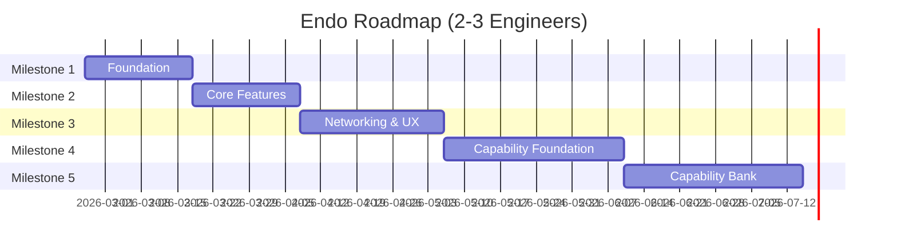

# Endo Design Documents

*Last updated: 2026-02-24*

## Summary

| Design | Date | Status |
|--------|------|--------|
| [chat-reply-chain-visualization](chat-reply-chain-visualization.md) | 2026-02-23 | Not Started |
| [chat-spaces-gutter](chat-spaces-gutter.md) | 2026-02-21 | **Complete** |
| [chat-spaces-inbox](chat-spaces-inbox.md) | 2026-02-21 | **Complete** |
| [daemon-256-bit-identifiers](daemon-256-bit-identifiers.md) | 2026-02-24 | Not Started |
| [daemon-capability-bank](daemon-capability-bank.md) | 2026-02-15 | Not Started |
| [daemon-capability-filesystem](daemon-capability-filesystem.md) | 2026-02-15 | Not Started |
| [daemon-capability-persona](daemon-capability-persona.md) | 2026-02-16 | Not Started |
| [daemon-locator-terminology](daemon-locator-terminology.md) | 2026-02-24 | Not Started |
| [daemon-weblet-application](daemon-weblet-application.md) | 2026-02-24 | Not Started |
| [daemon-os-sandbox-plugin](daemon-os-sandbox-plugin.md) | 2026-02-15 | Not Started |
| [familiar-chat-weblet-hosting](familiar-chat-weblet-hosting.md) | 2026-02-14 | Not Started |
| [familiar-daemon-bundling](familiar-daemon-bundling.md) | 2026-02-14 | In Progress |
| [familiar-electron-shell](familiar-electron-shell.md) | 2026-02-14 | **Complete** |
| [familiar-gateway-migration](familiar-gateway-migration.md) | 2026-02-14 | **Complete** |
| [familiar-unified-weblet-server](familiar-unified-weblet-server.md) | 2026-02-14 | In Progress |
| [formula-inspector](formula-inspector.md) | 2026-02-14 | Not Started |
| [inventory-drag-and-drop](inventory-drag-and-drop.md) | 2026-02-14 | Not Started |
| [inventory-grouping-by-type](inventory-grouping-by-type.md) | 2026-02-14 | Not Started |
| [live-reference-indicator](live-reference-indicator.md) | 2026-02-14 | Not Started |
| [ocapn-network-transport-separation](ocapn-network-transport-separation.md) | 2026-02-14 | In Progress |
| [ocapn-noise-cryptographic-review](ocapn-noise-cryptographic-review.md) | 2026-02-14 | Not Started |
| [ocapn-noise-network](ocapn-noise-network.md) | 2026-02-14 | Not Started |
| [ocapn-tcp-for-test-extraction](ocapn-tcp-for-test-extraction.md) | 2026-02-14 | Not Started |
| [workers-panel](workers-panel.md) | 2026-02-14 | Not Started |

**Totals:** 4 Complete, 3 In Progress, 16 Not Started

## Roadmap

### Dependency Graph

```mermaid
flowchart TD
    subgraph Daemon Core
        d256[daemon-256-bit-identifiers]
        dloc[daemon-locator-terminology]
        d256 --> dloc
    end

    subgraph Familiar
        fbund[familiar-daemon-bundling<br/><i>IN PROGRESS</i>]
        fweb[familiar-unified-weblet-server<br/><i>IN PROGRESS</i>]
        fchat[familiar-chat-weblet-hosting]
        dapp[daemon-weblet-application]
        fbund --> fweb --> fchat
        fweb --> dapp
        fchat --> dapp
    end

    subgraph OCapN
        onet[ocapn-network-transport-separation<br/><i>IN PROGRESS</i>]
        otcp[ocapn-tcp-for-test-extraction]
        orev[ocapn-noise-cryptographic-review]
        onoise[ocapn-noise-network]
        onet --> otcp --> onoise
        orev --> onoise
    end

    subgraph Capability System
        dsand[daemon-os-sandbox-plugin]
        dfs[daemon-capability-filesystem]
        dpers[daemon-capability-persona]
        dbank[daemon-capability-bank]
        dsand --> dbank
        dfs --> dbank
        dpers --> dbank
    end
```

### Prioritized Tiers

#### Tier 1 — Critical Path (High Urgency)

These block distribution or foundational work.

| Design | Urgency | Rationale |
|--------|---------|-----------|
| daemon-256-bit-identifiers | High | Foundation for locator terminology; aligns with OCapN-Noise |
| familiar-daemon-bundling | High | Blocks Familiar distribution; in progress |

#### Tier 2 — Enabling Infrastructure (High-Medium Urgency)

Unblock downstream features and networking.

| Design | Urgency | Depends On | Rationale |
|--------|---------|------------|-----------|
| daemon-locator-terminology | High | daemon-256-bit-identifiers | Clean API for locators; late materialization |
| familiar-unified-weblet-server | High | familiar-daemon-bundling | Required for weblet hosting in Familiar |
| ocapn-network-transport-separation | Medium | — | Foundation for OCapN-Noise; in progress |

#### Tier 3 — Near-term Features (Medium Urgency)

Enable new capabilities once infrastructure is ready.

| Design | Urgency | Depends On | Rationale |
|--------|---------|------------|-----------|
| ocapn-tcp-for-test-extraction | Medium | ocapn-network-transport-separation | Clean separation before adding Noise |
| familiar-chat-weblet-hosting | Medium | familiar-unified-weblet-server | Core Familiar feature |
| daemon-weblet-application | Medium | familiar-unified-weblet-server, familiar-chat-weblet-hosting | Readable trees and weblets from zip archives |
| ocapn-noise-cryptographic-review | Medium | — | Should complete before stabilizing Noise |

#### Tier 4 — User Experience (Medium-Low Urgency)

Improve Chat UI; independent of core infrastructure.

| Design | Urgency | Depends On | Rationale |
|--------|---------|------------|-----------|
| chat-reply-chain-visualization | Low | — | Visual improvement; no blockers |
| inventory-grouping-by-type | Low | — | UX polish |
| inventory-drag-and-drop | Low | — | UX polish |
| formula-inspector | Low | — | Power-user feature |
| workers-panel | Low | — | Observability feature |
| live-reference-indicator | Low | — | Requires daemon incarnation status API |

#### Tier 5 — Networking Completion (Medium Urgency, Gated)

| Design | Urgency | Depends On | Rationale |
|--------|---------|------------|-----------|
| ocapn-noise-network | Medium | ocapn-tcp-for-test-extraction, ocapn-noise-cryptographic-review | Secure peer networking |

#### Tier 6 — Long-term / Research (Low Urgency)

Security and capability research; no immediate blockers.

| Design | Urgency | Depends On | Rationale |
|--------|---------|------------|-----------|
| daemon-os-sandbox-plugin | Low | — | Foundational for native process confinement |
| daemon-capability-filesystem | Low | — | Exploratory; informs capability bank |
| daemon-capability-persona | Low | — | Exploratory; epithets and delegation |
| daemon-capability-bank | Low | daemon-os-sandbox-plugin, daemon-capability-filesystem | Long-term vision for AI agent confinement |

### Suggested Execution Order

1. **Now:** Complete `familiar-daemon-bundling`, continue `ocapn-network-transport-separation`
2. **Next:** `daemon-256-bit-identifiers` → `daemon-locator-terminology`
3. **Then:** `familiar-unified-weblet-server` → `familiar-chat-weblet-hosting`
4. **Parallel:** `ocapn-tcp-for-test-extraction`, `ocapn-noise-cryptographic-review`
5. **After review:** `ocapn-noise-network`
6. **Ongoing:** Chat UI improvements (Tier 4) as bandwidth permits
7. **Research:** Capability system designs (Tier 6) inform future direction

### Size and Time Estimates

#### Estimation Methodology

These estimates were derived on 2026-02-24 using the following approach:

1. **Velocity calibration:** Analyzed git history on the `llm` branch from 2026-02-14
   to 2026-02-24 to measure actual throughput:
   - Commit frequency: ~6-7 commits per active work day
   - LOC throughput: ~200-300 lines of focused implementation per day
   - Active work days in period: 11 days with commits

2. **Reference point extraction:** Measured completed designs to establish baselines:
   - `chat-spaces-gutter` + `chat-spaces-inbox`: 601 LOC (`spaces-gutter.js`),
     designed and implemented same day (2026-02-21)
   - `familiar-electron-shell`: ~518 LOC (`electron-main.js` + `daemon-manager.js`),
     designed 2026-02-14, implemented 2026-02-21 (~2 days focused work)
   - `familiar-gateway-migration`: ~200 LOC changes, designed 2026-02-14,
     implemented 2026-02-20 (~1-2 days focused work)

3. **Complexity assessment:** For each incomplete design, estimated LOC impact by:
   - Reading the design document to understand scope
   - Identifying affected source files and measuring current sizes
   - Comparing to similar completed work

4. **Size bucketing:** Mapped LOC estimates to duration using observed velocity,
   with multipliers for:
   - Architectural complexity (new subsystems, cross-package changes)
   - Platform-specific code (sandboxing, native modules)
   - External dependencies (cryptographic review, API design)

5. **Uncertainty ranges:** All estimates given as ranges to reflect inherent
   uncertainty. Lower bound assumes smooth execution; upper bound accounts for
   discovery, debugging, and iteration.

#### Observed Velocity

- **Completed reference points:**
  - `chat-spaces-gutter` + `chat-spaces-inbox`: ~600 LOC, 1 day
  - `familiar-electron-shell`: ~500 LOC, 2 days
  - `familiar-gateway-migration`: ~200 LOC, 1-2 days
- **Throughput:** ~6-7 commits per active work day, ~200-300 LOC/day for focused work

#### Size Categories

| Size | LOC Impact | Duration | Description |
|------|------------|----------|-------------|
| S | < 200 | 1-2 days | Localized changes, single file focus |
| M | 200-500 | 3-5 days | Multiple files, moderate complexity |
| L | 500-1000 | 1-2 weeks | Architectural changes, new subsystems |
| XL | > 1000 | 3-4 weeks | Cross-cutting, platform-specific, or research-heavy |

#### Project Estimates

| Design | Size | Estimate | Notes |
|--------|------|----------|-------|
| **Tier 1** |
| daemon-256-bit-identifiers | M | 3-5 days | formula-identifier.js, locator.js, daemon.js patterns, tests |
| familiar-daemon-bundling | M | 3-5 days | Remaining: esbuild config, worker bundling |
| **Tier 2** |
| daemon-locator-terminology | S-M | 2-3 days | After 256-bit; locator.js + host.js changes |
| familiar-unified-weblet-server | M | 3-5 days | web-server restructuring, routing |
| ocapn-network-transport-separation | L | 1-2 weeks | Architectural refactor across ocapn packages |
| **Tier 3** |
| ocapn-tcp-for-test-extraction | M | 3-5 days | Code relocation, interface cleanup |
| familiar-chat-weblet-hosting | M | 5-7 days | Iframe hosting, panel UI, guest profiles |
| daemon-weblet-application | M | 5-7 days | Two formula types, gateway serving, CLI/chat verbs, MessagePort CapTP |
| ocapn-noise-cryptographic-review | S | 1-2 days | Coordination work + external review wait time |
| **Tier 4** |
| chat-reply-chain-visualization | M | 5-7 days | Layout algorithm, SVG/CSS connector lines |
| inventory-grouping-by-type | S | 2-3 days | UI grouping, collapsible sections |
| inventory-drag-and-drop | M | 3-5 days | HTML5 DnD handlers, drop targets |
| formula-inspector | M | 5-7 days | New panel, daemon InspectorHub API exposure |
| workers-panel | M-L | 1-2 weeks | New panel, daemon metrics API, sparklines |
| live-reference-indicator | M | 5-7 days | Daemon incarnation status API + UI indicators |
| **Tier 5** |
| ocapn-noise-network | L | 2-3 weeks | Full network + transport implementations |
| **Tier 6** |
| daemon-os-sandbox-plugin | XL | 3-4 weeks | Platform-specific (macOS sandbox-exec, Linux namespaces) |
| daemon-capability-filesystem | L | 2-3 weeks | New capability type, VFS interface |
| daemon-capability-persona | M | 1 week | Handle extension, epithet tracking |
| daemon-capability-bank | XL | 4-6 weeks | Integrates sandbox, filesystem, persona |

#### Summary

| Category | Items | Total Estimate |
|----------|-------|----------------|
| Tier 1 (Critical) | 2 | 1-2 weeks |
| Tier 2 (Infrastructure) | 3 | 2-4 weeks |
| Tier 3 (Near-term) | 3 | 2-3 weeks |
| Tier 4 (UX) | 6 | 4-7 weeks |
| Tier 5 (Networking) | 1 | 2-3 weeks |
| Tier 6 (Research) | 4 | 10-14 weeks |
| **Total remaining** | **19** | **~21-33 weeks** |

*Note: Estimates assume serial execution. Parallelization across contributors would reduce calendar time.*

### Milestones (2-3 Engineers)

Assuming 2-3 engineers with the following focus areas:
- **Engineer A (Daemon/Core):** Identifier system, daemon APIs, capability system
- **Engineer B (Familiar/Chat):** Electron app, Chat UI, weblet hosting
- **Engineer C (OCapN/Networking):** Transport separation, Noise protocol, peer networking

With 2 engineers, combine A+C or B+C based on skill fit.

---

#### Milestone 1: Foundation
**Duration:** 3 weeks | **Goal:** Unblock all downstream work

| Engineer | Projects | Duration |
|----------|----------|----------|
| A | daemon-256-bit-identifiers → daemon-locator-terminology | 1.5 weeks |
| B | familiar-daemon-bundling → familiar-unified-weblet-server | 1.5 weeks |
| C | ocapn-network-transport-separation | 2 weeks |

**Deliverables:**
- 256-bit identifiers and new locator format landed
- Familiar app distributable with bundled daemon
- OCapN transport abstraction complete

**Exit criteria:** Familiar can be packaged and distributed; locator APIs stable

---

#### Milestone 2: Core Features
**Duration:** 3 weeks | **Goal:** Enable weblet hosting and prepare for secure networking

| Engineer | Projects | Duration |
|----------|----------|----------|
| A | formula-inspector | 1 week |
| A | live-reference-indicator (daemon API) | 1 week |
| B | familiar-chat-weblet-hosting | 1.5 weeks |
| B | inventory-grouping-by-type | 0.5 weeks |
| C | ocapn-tcp-for-test-extraction | 1 week |
| C | ocapn-noise-cryptographic-review (coordinate) | 0.5 weeks |
| C | Begin ocapn-noise-network | 1.5 weeks |

**Deliverables:**
- Weblets hosted inside Familiar Chat UI
- Formula inspector panel available
- TCP-for-test extracted; crypto review initiated

**Exit criteria:** Users can install and interact with weblets in Familiar

---

#### Milestone 3: Networking & UX Polish
**Duration:** 4 weeks | **Goal:** Secure peer networking; polished Chat experience

| Engineer | Projects | Duration |
|----------|----------|----------|
| A | workers-panel | 2 weeks |
| A | Support B with daemon APIs as needed | — |
| B | chat-reply-chain-visualization | 1.5 weeks |
| B | inventory-drag-and-drop | 1 week |
| B | live-reference-indicator (UI) | 1 week |
| C | ocapn-noise-network (complete) | 2.5 weeks |

**Deliverables:**
- OCapN-Noise network operational for secure peer connections
- Workers panel with metrics and observability
- Reply chain visualization in Chat
- Drag-and-drop capability management

**Exit criteria:** Two Familiar instances can connect securely over OCapN-Noise

---

#### Milestone 4: Capability Foundation
**Duration:** 5 weeks | **Goal:** Lay groundwork for AI agent confinement

| Engineer | Projects | Duration |
|----------|----------|----------|
| A | daemon-capability-persona | 1 week |
| A | daemon-os-sandbox-plugin | 3.5 weeks |
| B | Stabilization, bug fixes, documentation | 2 weeks |
| B | Support A with integration testing | — |
| C | daemon-capability-filesystem | 2.5 weeks |
| C | Support A with sandbox plugin | 1.5 weeks |

**Deliverables:**
- Persona/epithet system for delegate identity
- OS sandbox plugin for macOS (Linux stretch goal)
- Filesystem capability prototype

**Exit criteria:** Native processes can be sandboxed with specified capabilities

---

#### Milestone 5: Capability Bank
**Duration:** 5 weeks | **Goal:** Integrated capability management for AI agents

| Engineer | Projects | Duration |
|----------|----------|----------|
| A, B, C | daemon-capability-bank (collaborative) | 5 weeks |

**Deliverables:**
- Unified capability bank integrating sandbox, filesystem, and persona
- AI agent confinement demonstration
- Documentation and security review

**Exit criteria:** AI coding agent runs with principle of least authority enforced

---

#### Timeline Summary

| Milestone | Duration | Cumulative | Target Date |
|-----------|----------|------------|-------------|
| M1: Foundation | 3 weeks | 3 weeks | Mid-March 2026 |
| M2: Core Features | 3 weeks | 6 weeks | Early April 2026 |
| M3: Networking & UX | 4 weeks | 10 weeks | Early May 2026 |
| M4: Capability Foundation | 5 weeks | 15 weeks | Mid-June 2026 |
| M5: Capability Bank | 5 weeks | 20 weeks | Late July 2026 |

**Total calendar time:** ~20 weeks (5 months) with 2-3 engineers working in parallel

*Compared to ~21-33 weeks serial estimate, parallelization achieves ~1.5-2x speedup.*
