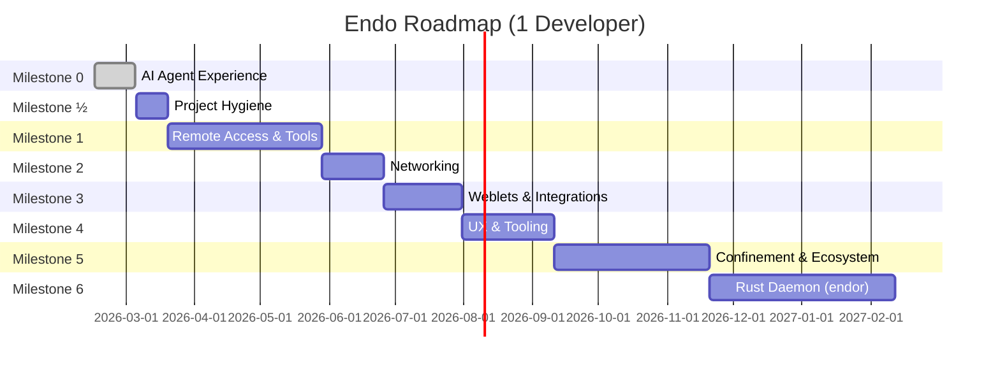

# Endo Design Documents

*Last updated: 2026-05-19 (status-only sweep reconciled Status fields with shipped state on `llm`; M½ project-hygiene milestone extracted from M1; endopi raft added; PR #302 consolidation absorbed; patterns-diagnostic-feedback proposed)*

*Recently added or revised:
[patterns-diagnostic-feedback](patterns-diagnostic-feedback.md) (added
2026-05-19; tree-path accumulation, per-combinator reason renderers, and a
text-source parse path for `@endo/patterns` mismatch diagnostics),
[endopi](endopi.md) (added 2026-05-15;
comparative analysis of the pi agent harness against endo's daemon +
chat + familiar + cli; sibling of `endoclaw.md`; spins out eight
gap-closing designs prefixed `endopi-*`),
[hardened-text-codecs-shim](hardened-text-codecs-shim.md)
(added 2026-05-06; permits `TextEncoder`/`TextDecoder` in SES intrinsics),
[hardened-url-shim](hardened-url-shim.md) (added 2026-05-06; vetted-shim
treatment for the `URL` constructor and `URLSearchParams`).*

*Earlier additions: [daemon-make-archive](daemon-make-archive.md) (added
2026-04-23), [filesystem-watchers](filesystem-watchers.md) (added
2026-05-07), [endo-posix-sandbox](endo-posix-sandbox.md) (added
2026-05-07; mirrors `PLAN/endo_posix_sandbox.md` for roadmap calibration),
[exo-zip-package](exo-zip-package.md) (added 2026-05-08; PR #128 reshape
blocker), [trust-on-first-bind](trust-on-first-bind.md) (added 2026-05-08;
shared capability-policy adapter referenced by HTTP client and browser
controller designs; addendum to PR #144 HttpClient),
[break-dev-dependency-cycles](break-dev-dependency-cycles.md) (added
2026-05-11; synthetic test-package factoring to retire the workspace
devDep SCC; follow-up to PR #121; Cuts 2-4 merged via PRs #209, #210,
#211 with Cut 5 open as PR #247),
[cli-http-client](cli-http-client.md) (added 2026-05-09; PR #144 design
revision under `endo http` subcommand tree),
[endo-gateway](endo-gateway.md) (added 2026-05-10; per-host system-service
HTTP virtual host for OCapN, lifts hosting out of per-user Daemon; closes
issue #173, unblocks PR #134; raised to M1 per `#134` directive
2026-05-13),
[retention-path-notation](retention-path-notation.md) (added 2026-05-10;
PR #151 row-format unblocker; sibling of
[daemon-retention-paths](daemon-retention-paths.md)),
[cli-store-verb-text-modes](cli-store-verb-text-modes.md) (added
2026-05-08; reshape blocker for PR #128),
[unhandled-rejection-display](unhandled-rejection-display.md) (added
2026-05-10; impl landed via PR #187 closing issue #171),
[cli-edit-verb](cli-edit-verb.md) (added 2026-05-08; sibling of PR #153
`cli-store-verb-text-modes`; hashline patches for AI agents).*

## Summary

| Design | Created | Updated | Status |
|--------|---------|---------|--------|
| [chat-color-schemes](chat-color-schemes.md) | 2026-02-26 | 2026-02-26 | **Complete** |
| [cli-store-verb-text-modes](cli-store-verb-text-modes.md) | 2026-05-08 | 2026-05-08 | Proposed |
| [cli-edit-verb](cli-edit-verb.md) | 2026-05-08 | 2026-05-08 | Proposed |
| [chat-command-bar](chat-command-bar.md) | 2026-03-02 | 2026-03-02 | **Complete** |
| [chat-components](chat-components.md) | 2026-03-02 | 2026-03-02 | **Complete** |
| [chat-high-contrast-mode](chat-high-contrast-mode.md) | 2026-02-26 | 2026-02-26 | **Complete** |
| [chat-invariants](chat-invariants.md) | 2026-03-02 | 2026-03-02 | **Complete** |
| [chat-per-space-color-scheme](chat-per-space-color-scheme.md) | 2026-02-26 | 2026-02-26 | **Complete** |
| [chat-focus-message](chat-focus-message.md) | 2026-03-04 | 2026-05-19 | **Complete** |
| [chat-markdown-render](chat-markdown-render.md) | 2026-03-03 | 2026-05-19 | **Complete** |
| [chat-pending-commands](chat-pending-commands.md) | 2026-03-11 | 2026-05-19 | In Progress (PR #133) |
| [chat-playwright-smoke](chat-playwright-smoke.md) | 2026-05-06 | 2026-05-18 | **Complete** |
| [chat-rename-dismiss-to-clear](chat-rename-dismiss-to-clear.md) | 2026-03-03 | 2026-05-19 | **Complete** |
| [chat-slot-slash-commands](chat-slot-slash-commands.md) | 2026-04-23 | 2026-05-06 | Proposed |
| [chat-view-edit-commands](chat-view-edit-commands.md) | 2026-03-21 | 2026-05-19 | **Complete** |
| [chat-edit-message-ui](chat-edit-message-ui.md) | 2026-05-05 | 2026-05-05 | Not Started |
| [chat-reply-chain-visualization](chat-reply-chain-visualization.md) | 2026-02-23 | 2026-02-28 | Deprecated |
| [chat-spaces-home](chat-spaces-home.md) | 2026-03-02 | 2026-03-02 | **Complete** |
| [chat-spaces-gutter](chat-spaces-gutter.md) | 2026-02-21 | 2026-02-26 | **Complete** |
| [chat-spaces-inbox](chat-spaces-inbox.md) | 2026-02-21 | 2026-02-24 | **Complete** |
| [chat-test-coverage](chat-test-coverage.md) | 2026-03-02 | 2026-03-02 | **Complete** |
| [daemon-256-bit-identifiers](daemon-256-bit-identifiers.md) | 2026-02-24 | 2026-03-02 | **Complete** |
| [daemon-agent-network-identity](daemon-agent-network-identity.md) | 2026-03-02 | 2026-03-02 | Not Started |
| [daemon-agent-tools](daemon-agent-tools.md) | 2026-03-02 | 2026-03-02 | Not Started |
| [daemon-commands-as-messages](daemon-commands-as-messages.md) | 2026-03-11 | 2026-03-11 | Not Started |
| [daemon-capability-bank](daemon-capability-bank.md) | 2026-02-15 | 2026-02-24 | Not Started |
| [daemon-checkin-checkout](daemon-checkin-checkout.md) | 2026-03-17 | 2026-05-19 | **Complete** |
| [daemon-capability-filesystem](daemon-capability-filesystem.md) | 2026-02-15 | 2026-05-19 | Reference |
| [daemon-content-store-gc](daemon-content-store-gc.md) | 2026-03-20 | 2026-05-08 | **Complete** |
| [daemon-message-streaming](daemon-message-streaming.md) | 2026-03-26 | 2026-05-19 | In Progress (PR #287) |
| [daemon-mount](daemon-mount.md) | 2026-03-20 | 2026-05-19 | In Progress |
| [filesystem-watchers](filesystem-watchers.md) | 2026-05-07 | 2026-05-07 | Not Started |
| [platform-fs](platform-fs.md) | 2026-03-18 | 2026-05-19 | **Complete** |
| [daemon-capability-persona](daemon-capability-persona.md) | 2026-02-16 | 2026-02-24 | Not Started |
| [daemon-cross-peer-gc](daemon-cross-peer-gc.md) | 2026-03-07 | 2026-04-29 | **Complete** |
| [daemon-retention-paths](daemon-retention-paths.md) | 2026-04-30 | 2026-05-19 | In Progress (PR #284) |
| [retention-path-notation](retention-path-notation.md) | 2026-05-10 | 2026-05-19 | Reference |
| [daemon-rename-to-manager](daemon-rename-to-manager.md) | 2026-05-04 | 2026-05-05 | Not Started |
| [daemon-guest-eval-simplification](daemon-guest-eval-simplification.md) | 2026-03-21 | 2026-05-04 | **Implemented** |
| [daemon-docker-selfhost](daemon-docker-selfhost.md) | 2026-03-02 | 2026-03-02 | Not Started |
| [daemon-capability-bus](daemon-capability-bus.md) | 2026-02-25 | 2026-04-11 | In Progress |
| [daemon-endo-rust-sqlite](daemon-endo-rust-sqlite.md) | 2026-04-14 | 2026-04-16 | **Complete** |
| [daemon-xs-worker-debugger](daemon-xs-worker-debugger.md) | 2026-04-14 | 2026-04-15 | In Progress |
| [daemon-endor-architecture](daemon-endor-architecture.md) | 2026-04-16 | 2026-04-16 | Active |
| [daemon-xs-worker-snapshot](daemon-xs-worker-snapshot.md) | 2026-04-15 | 2026-04-16 | In Progress |
| [daemon-rust-xs-performance](daemon-rust-xs-performance.md) | 2026-04-16 | 2026-04-16 | Active |
| [daemon-xs-worker-metering](daemon-xs-worker-metering.md) | 2026-04-17 | 2026-04-17 | **Complete** |
| [daemon-debug-worker-restart](daemon-debug-worker-restart.md) | 2026-04-17 | 2026-04-17 | Not Started |
| [daemon-cas-management](daemon-cas-management.md) | 2026-04-17 | 2026-04-17 | In Progress |
| [endor-run-expanded](endor-run-expanded.md) | 2026-04-17 | 2026-04-17 | In Progress |
| [endor-npm-registry-proxy](endor-npm-registry-proxy.md) | 2026-04-17 | 2026-04-17 | In Progress |
| [daemon-make-archive](daemon-make-archive.md) | 2026-04-23 | 2026-04-24 | In Progress |
| [daemon-form-request](daemon-form-request.md) | 2026-02-25 | 2026-03-02 | **Complete** |
| [endoclaw](endoclaw.md) | 2026-03-03 | 2026-03-03 | Reference |
| [endopi](endopi.md) | 2026-05-15 | 2026-05-15 | Reference |
| [endopi-edit-tool](endopi-edit-tool.md) | 2026-05-15 | 2026-05-15 | Proposed |
| [endopi-jsonl-transcript-format](endopi-jsonl-transcript-format.md) | 2026-05-15 | 2026-05-15 | Proposed |
| [endopi-provider-registry-and-oauth](endopi-provider-registry-and-oauth.md) | 2026-05-15 | 2026-05-15 | Proposed (partially satisfied by `packages/genie`) |
| [endopi-skills-markdown-format](endopi-skills-markdown-format.md) | 2026-05-15 | 2026-05-15 | Proposed |
| [endopi-prompt-templates](endopi-prompt-templates.md) | 2026-05-15 | 2026-05-15 | Proposed |
| [endopi-iterative-compaction](endopi-iterative-compaction.md) | 2026-05-15 | 2026-05-15 | Proposed (partially satisfied by `packages/genie`) |
| [endopi-stdio-rpc-bridge](endopi-stdio-rpc-bridge.md) | 2026-05-15 | 2026-05-15 | Proposed |
| [endopi-extension-package-manifest](endopi-extension-package-manifest.md) | 2026-05-15 | 2026-05-15 | Proposed |
| [endoclaw-browser](endoclaw-browser.md) | 2026-03-03 | 2026-03-03 | Not Started |
| [endoclaw-channel-bridges](endoclaw-channel-bridges.md) | 2026-03-03 | 2026-03-03 | Not Started |
| [endoclaw-network-fetch](endoclaw-network-fetch.md) | 2026-03-03 | 2026-03-03 | Not Started |
| [endoclaw-notifications](endoclaw-notifications.md) | 2026-03-03 | 2026-03-03 | Not Started |
| [endoclaw-oauth](endoclaw-oauth.md) | 2026-03-03 | 2026-03-03 | Not Started |
| [endoclaw-proactive-messages](endoclaw-proactive-messages.md) | 2026-03-03 | 2026-03-03 | Not Started |
| [endoclaw-skill-registry](endoclaw-skill-registry.md) | 2026-03-03 | 2026-03-03 | Not Started |
| [endoclaw-timer](endoclaw-timer.md) | 2026-03-03 | 2026-03-18 | In Progress |
| [endoclaw-voice](endoclaw-voice.md) | 2026-03-03 | 2026-03-03 | Not Started |
| [endoclaw-webhooks](endoclaw-webhooks.md) | 2026-03-03 | 2026-03-03 | Not Started |
| [daemon-locator-terminology](daemon-locator-terminology.md) | 2026-02-24 | 2026-02-24 | Not Started |
| [daemon-os-sandbox-plugin](daemon-os-sandbox-plugin.md) | 2026-02-15 | 2026-03-19 | Superseded by [endo-posix-sandbox](endo-posix-sandbox.md) |
| [endo-posix-sandbox](endo-posix-sandbox.md) | 2026-05-07 | 2026-05-07 | In Progress (Phase 3) |
| [daemon-value-message](daemon-value-message.md) | 2026-03-02 | 2026-03-03 | **Complete** |
| [daemon-web-gateway](daemon-web-gateway.md) | 2026-03-11 | 2026-03-11 | **Complete** |
| [daemon-weblet-application](daemon-weblet-application.md) | 2026-02-24 | 2026-02-25 | Not Started |
| [exo-zip-package](exo-zip-package.md) | 2026-05-08 | 2026-05-08 | Proposed (PR #154 open questions resolved) |
| [familiar-bundled-agents](familiar-bundled-agents.md) | 2026-03-02 | 2026-03-05 | **Complete** |
| [familiar-chat-weblet-hosting](familiar-chat-weblet-hosting.md) | 2026-02-14 | 2026-02-26 | Not Started |
| [familiar-daemon-bundling](familiar-daemon-bundling.md) | 2026-02-14 | 2026-03-05 | **Complete** |
| [familiar-electron-shell](familiar-electron-shell.md) | 2026-02-14 | 2026-02-26 | **Complete** |
| [familiar-gateway-migration](familiar-gateway-migration.md) | 2026-02-14 | 2026-02-26 | **Complete** |
| [familiar-localhttp-protocol](familiar-localhttp-protocol.md) | 2026-02-24 | 2026-02-25 | In Progress (partially implemented) |
| [familiar-unified-weblet-server](familiar-unified-weblet-server.md) | 2026-02-14 | 2026-05-06 | In Progress |
| [formula-inspector](formula-inspector.md) | 2026-02-14 | 2026-02-24 | Not Started |
| [gateway-bearer-token-auth](gateway-bearer-token-auth.md) | 2026-03-02 | 2026-03-06 | **Implemented** |
| [hardened-text-codecs-shim](hardened-text-codecs-shim.md) | 2026-05-04 | 2026-05-04 | Not Started |
| [hardened-url-shim](hardened-url-shim.md) | 2026-05-04 | 2026-05-04 | Not Started |
| [inventory-cancel-and-liveness](inventory-cancel-and-liveness.md) | 2026-02-14 | 2026-03-13 | Not Started |
| [inventory-drag-and-drop](inventory-drag-and-drop.md) | 2026-02-14 | 2026-02-24 | Not Started |
| [inventory-grouping-by-type](inventory-grouping-by-type.md) | 2026-02-14 | 2026-02-24 | Not Started |
| [lal-fae-form-provisioning](lal-fae-form-provisioning.md) | 2026-03-02 | 2026-03-05 | **Complete** |
| [lal-reply-chain-transcripts](lal-reply-chain-transcripts.md) | 2026-02-26 | 2026-03-05 | **Complete** |
| [lal-transcript-memory-management](lal-transcript-memory-management.md) | 2026-03-05 | 2026-03-05 | Not Started |
| [ocapn-network-transport-separation](ocapn-network-transport-separation.md) | 2026-02-14 | 2026-02-24 | In Progress |
| [ocapn-noise-cryptographic-review](ocapn-noise-cryptographic-review.md) | 2026-02-14 | 2026-02-24 | Not Started |
| [ocapn-noise-network](ocapn-noise-network.md) | 2026-02-14 | 2026-05-18 | **Complete** |
| [ocapn-tcp-for-test-extraction](ocapn-tcp-for-test-extraction.md) | 2026-02-14 | 2026-02-24 | Not Started |
| [ocapn-tcp-syrups-framing](ocapn-tcp-syrups-framing.md) | 2026-04-23 | 2026-05-06 | Not Started |
| [syrups](syrups.md) | 2026-05-04 | 2026-05-06 | Deprecated |
| [cbors](cbors.md) | 2026-05-04 | 2026-05-05 | Not Started |
| [trust-on-first-bind](trust-on-first-bind.md) | 2026-05-08 | 2026-05-10 | Reference |
| [outliner-design-doc](outliner-design-doc.md) | 2026-03-17 | 2026-03-18 | In Progress |
| [patterns-diagnostic-feedback](patterns-diagnostic-feedback.md) | 2026-05-19 | 2026-05-19 | Proposed |
| [base64-native-fallthrough](base64-native-fallthrough.md) | 2026-04-23 | 2026-05-18 | **Complete** |
| [ci-no-npm-lifecycle](ci-no-npm-lifecycle.md) | 2026-04-23 | 2026-05-18 | **Complete** |
| [break-dev-dependency-cycles](break-dev-dependency-cycles.md) | 2026-05-11 | 2026-05-18 | In Progress |
| [cli-http-client](cli-http-client.md) | 2026-05-09 | 2026-05-09 | Proposed (PR #144 design revision) |
| [endor-bus-tui](endor-bus-tui.md) | 2026-04-23 | 2026-04-23 | Not Started |
| [endor-tui](endor-tui.md) | 2026-04-23 | 2026-04-23 | Not Started |
| [hex-package](hex-package.md) | 2026-04-23 | 2026-05-18 | **Complete** |
| [endo-bytes](endo-bytes.md) | 2026-05-08 | 2026-05-10 | Implemented |
| [endo-gateway](endo-gateway.md) | 2026-05-10 | 2026-05-10 | Proposed |
| [unhandled-rejection-display](unhandled-rejection-display.md) | 2026-05-10 | 2026-05-18 | **Complete** |
| [weblet-next](weblet-next.md) | 2026-03-24 | 2026-03-24 | Reference |
| [workers-panel](workers-panel.md) | 2026-02-14 | 2026-02-24 | Not Started |

**Totals:** 39 Complete/Implemented, 18 In Progress, 36 Not Started, 15 Proposed, 2 Active, 6 Reference, 2 Deprecated, 1 Superseded (119 designs). Refreshed 2026-05-19 by a status-only sweep (consolidating the 2026-05-18 sweep with the 2026-05-19 batch update for 11 additional designs from closed PR #302) plus the patterns-diagnostic-feedback Proposed entry; the 12-design jump in Complete/Implemented over the 2026-05-08 snapshot reflects shipped work whose Status field had not previously been updated, not new completions in this pass; see the corresponding "## Status" sections in each design file for evidence pointers (commit SHA or PR number). Totals reflect the 11 design files added on `llm` since the sweep's branch point (the endopi raft of `endopi` + 8 `endopi-*` gap-closing designs plus `hardened-text-codecs-shim` and `hardened-url-shim`).

## Roadmap

### Dependency Graph

```mermaid
flowchart TD
    subgraph Daemon Core
        d256[daemon-256-bit-identifiers<br/><i>COMPLETE</i>]
        dloc[daemon-locator-terminology]
        dnet[daemon-agent-network-identity]
        d256 --> dloc
        d256 --> dnet
    end

    subgraph Daemon Messaging
        dform[daemon-form-request<br/><i>COMPLETE</i>]
        dval[daemon-value-message<br/><i>COMPLETE</i>]
        dcmd[daemon-commands-as-messages]
        dform --> dval
        dform --> dcmd
        dval --> dcmd
    end

    subgraph LLM Agents
        laltx[lal-reply-chain-transcripts<br/><i>COMPLETE</i>]
        lalfp[lal-fae-form-provisioning<br/><i>COMPLETE</i>]
        fagent[familiar-bundled-agents<br/><i>COMPLETE</i>]
        dtools[daemon-agent-tools]
        deval[daemon-guest-eval-simplification<br/><i>IMPLEMENTED</i>]
        dform --> lalfp
        dval --> lalfp
        laltx --> lalfp
        lalfp --> fagent
        fbund --> fagent
        dfs --> dtools
        dtools --> fagent
        dtools --> deval
        dbank --> deval
        lalfp --> deval
    end

    subgraph Familiar
        fbund[familiar-daemon-bundling<br/><i>COMPLETE</i>]
        fweb[familiar-unified-weblet-server<br/><i>IN PROGRESS</i>]
        flhttp[familiar-localhttp-protocol<br/><i>IN PROGRESS</i>]
        fchat[familiar-chat-weblet-hosting]
        dci[daemon-checkin-checkout<br/><i>COMPLETE</i>]
        dapp[daemon-weblet-application]
        exozip[exo-zip-package]
        fbund --> fweb --> fchat
        fweb --> dapp
        fchat --> dapp
        flhttp --> fchat
        dci --> dapp
        exozip --> dci
        exozip --> dapp
    end

    subgraph Remote Access
        gauth[gateway-bearer-token-auth]
        egate[endo-gateway]
        ddock[daemon-docker-selfhost]
        ewebhook[endoclaw-webhooks]
        gauth --> egate
        egate --> ddock
        fbund --> ddock
        gauth --> ewebhook
    end

    subgraph Agent Capabilities
        etimer[endoclaw-timer]
        enetfetch[endoclaw-network-fetch]
        eoauth[endoclaw-oauth]
        enotify[endoclaw-notifications]
        eproactive[endoclaw-proactive-messages]
        ebrowser[endoclaw-browser]
        ebridge[endoclaw-channel-bridges]
        eskill[endoclaw-skill-registry]
        evoice[endoclaw-voice]
        enetfetch --> eoauth
        etimer --> eproactive
        eoauth --> ebridge
        eoauth --> eproactive
    end

    subgraph OCapN
        onet[ocapn-network-transport-separation<br/><i>IN PROGRESS</i>]
        otcp[ocapn-tcp-for-test-extraction]
        orev[ocapn-noise-cryptographic-review]
        onoise[ocapn-noise-network<br/><i>COMPLETE</i>]
        onet --> otcp --> onoise
        orev --> onoise
        dnet --> onoise
    end

    subgraph Chat UX
        cpend[chat-pending-commands<br/><i>IN PROGRESS</i>]
        cvedit[chat-view-edit-commands<br/><i>COMPLETE</i>]
        cemui[chat-edit-message-ui]
        cliedit[cli-edit-verb]
        dcmd --> cpend
        dmount --> cvedit
        dmount --> cliedit
        dmstream[daemon-message-streaming<br/><i>IN PROGRESS</i>] --> cemui
        cscheme[chat-color-schemes<br/><i>COMPLETE</i>]
        cspace[chat-per-space-color-scheme<br/><i>COMPLETE</i>]
        chc[chat-high-contrast-mode<br/><i>COMPLETE</i>]
        cscheme --> cspace --> chc
        cscheme --> chc
    end

    subgraph Capability System
        dsand[endo-posix-sandbox<br/><i>IN PROGRESS</i>]
        pfs[platform-fs<br/><i>COMPLETE</i>]
        dfs[daemon-capability-filesystem<br/><i>REFERENCE</i>]
        dmount[daemon-mount<br/><i>IN PROGRESS</i>]
        dfsw[filesystem-watchers]
        dcsgc[daemon-content-store-gc]
        dpers[daemon-capability-persona]
        dbank[daemon-capability-bank]
        icancel[inventory-cancel-and-liveness]
        pfs --> dfs
        pfs --> dmount
        pfs --> dci
        pfs --> dfsw
        dmount --> dfsw
        dmount --> dtools
        dmount --> dcsgc
        dsand --> dbank
        dfs --> dbank
        dpers --> dbank
        dbank --> icancel
    end
```

### Milestones

#### Milestone 0: Downloadable AI Agent Experience

**Goal:** A Familiar application suitable for use on at least one
platform that folks can download and use to interact with an agent using
their own API key and local capabilities.

| Design | Status | Notes |
|--------|--------|-------|
| ~~daemon-256-bit-identifiers~~ | **Complete** | Core migration done |
| ~~daemon-form-request~~ | **Complete** | Fields as ordered array, CLI, Chat UI |
| ~~daemon-value-message~~ | **Complete** | `value` type, persistence, `submit()` delivery, Chat rendering, standalone `sendValue`, `send-value` CLI, daemon tests all done |
| ~~lal-reply-chain-transcripts~~ | **Complete** | Phases 1-4 implemented; Phase 5 (memory management) deferred as out-of-scope |
| ~~familiar-daemon-bundling~~ | **Complete** | esbuild bundles, Node download, Forge integration |
| ~~lal-fae-form-provisioning~~ | **Complete** | Manager/worker split, form-based config, inbox-replay recovery |
| ~~familiar-bundled-agents~~ | **Complete** | esbuild bundles, resource paths, env vars, daemon-node.js provisioning |

**Exit criterion:** There is a Familiar application suitable for use on
at least one platform that folks can download and use to interact with an
agent using their own API key and local capabilities.

**Actual duration:** 18 active work days (Feb 15 – Mar 5), primarily 1
developer (128 of 201 commits). 7 designs completed. Original estimate
was 3-4 days for the final item; revised to 0 remaining.

---

#### Milestone ½: Project Hygiene

**Goal:** Build-system and shared-library hygiene that does not deliver
user-facing capability on its own but unblocks (or cleans the substrate
for) the capability work in Milestone 1. Extracted from M1 on 2026-05-14
once it became clear that several rows in M1's table satisfied the
two-question criterion: (a) not user-facing capability, and (b) prereq
or substrate-cleanup for M1 capability work. Surfacing them as a
separate bucket lets M1's "Remote Access and Coding Capabilities"
exit-criterion remain readable as a capability list rather than a
capability-plus-hygiene mix.

| Design | Status | Notes |
|--------|--------|-------|
| ~~endo-bytes~~ | **Implemented** | New `@endo/bytes` package for portable `Uint8Array` helpers (`concatBytes`, `bytesEqual`, `bytesFromText`, `bytesToText`); retires duplicates in `cli`, `ocapn`, and `daemon` (PR #142); follow-up `bytesToImmutable`/`bytesFromImmutable` in 94ffbd401; ocapn refactor in PR #223; buffer-utils inlining in PR #227 |
| ~~chat-playwright-smoke~~ | **Complete** | Build-and-load smoke for the Chat bundle in the `browser-tests` job; PRs #91 (design), #94 (impl), #95+#104 (harden/import fixes) |
| ~~hex-package~~ | **Complete** | `@endo/hex` ponyfill shipped; consumer migration landed via `kriskowal-hex` follow-ups; synthetic `@endo/hex-test` lands Cut 2 of break-dev-dependency-cycles (PR #211) |
| break-dev-dependency-cycles | In Progress | Synthetic test-package factoring to retire the workspace devDep SCC; Cut 2 (`@endo/hex-test`, PR #211), Cut 3 (`@endo/zip` devDep delete, PR #209) and Cut 4 (`@endo/harden-test`, PR #210) merged; Cut 5 (`@endo/eventual-send-test`, PR #247) open; Cut 1 (`@endo/ses-test`, the largest, PR #235) open against master |
| ~~ci-no-npm-lifecycle~~ | **Complete** | `.yarnrc.yml` pins `enableScripts: false` and CI installs with `yarn install --immutable`; PR #126 merged 2026-05-15 (master-base mirror staged as PR #250) |
| ~~base64-native-fallthrough~~ | **Complete** | `@endo/base64` dispatches to `Uint8Array.fromBase64` / `toBase64` when available; landed on `llm` via `actual/master` merge (commit `7325bbe15`, from `endojs/endo#3216`) |

**Exit criterion:** The shared byte/encoding/test-helper libraries are
factored out of per-package duplicates (`@endo/bytes`, `@endo/hex` fully
migrated, `@endo/base64` native fast paths). The workspace devDep cycle
is dissolved so turbo's `^build` form prints no cycle warning. The CI
posture is hardened against npm lifecycle scripts. The Chat bundle has
a build-and-load smoke gate. None of these are user-visible features
on their own; together they remove substrate noise that otherwise
accompanies every M1 capability commit.

**Estimated duration (1 dev):** ~3-5 days remaining (the 2026-05-19
status sweep moved `ci-no-npm-lifecycle`, `hex-package`, and
`base64-native-fallthrough` to Complete; only Cut 1 (`@endo/ses-test`,
PR #235) and Cut 5 (`@endo/eventual-send-test`, PR #247) of
`break-dev-dependency-cycles` remain).

---

#### Milestone 1: Remote Access and Coding Capabilities

**Goal:** Self-host a daemon with Docker, remote control it via local
Familiar or hosted Chat with bearer token auth. Claw-like coding
capabilities available to agents.

| Design | Status | Notes |
|--------|--------|-------|
| ~~gateway-bearer-token-auth~~ | **Implemented** | Agent ID as bearer token, rate limiting, CIDR filtering |
| endo-gateway | Proposed | Per-host system-service HTTP virtual host for OCapN; lifts hosting out of per-user Daemon; closes issue #173, unblocks PR #134. Raised to M1 per kriskowal directive on `#134#issuecomment-4444987124` (2026-05-13) |
| daemon-docker-selfhost | Not Started | Dockerfile, state persistence, network exposure, Chat hosting |
| daemon-agent-tools | Not Started | Filesystem, shell, git tools backed by capabilities |
| ~~platform-fs~~ | **Complete** | `@endo/platform/fs` — shared types, content store, tree adapters; landed on `llm` (initial commit `e0dda06fb` + PR #122 review cycle fixups) |
| daemon-capability-filesystem | Reference | `Dir`/`File` capabilities sketch retained as reference; narrower mount slice ships via daemon-mount |
| ~~daemon-content-store-gc~~ | **Complete** | Content-store pruning and scratch-mount directory cleanup at GC time; landed in PR #99 |
| daemon-mount | In Progress | Phases 1-3, 5 on `llm` (commit `e22f71327`); symlink confinement, 20 integration tests; Phase 4 (sub-mounts, snapshot) in PR #135 open, mount extensions in PR #127 open, `followNameChanges` in PR #277 open |
| filesystem-watchers | Not Started | `EndoMount.followNameChanges` parity with `EndoDirectory`; Node `fs.watch` adapter on `FilePowers` |
| daemon-locator-terminology | Not Started | Clean locator API; unblocked |
| daemon-rename-to-manager | Not Started | Rename `daemon.js`/`Daemon`/`MignonicPowers` to `manager.js`/`Manager`/`WorkerPowers` to align JS with Rust `endor` nomenclature |
| daemon-xs-worker-snapshot | In Progress | XS heap snapshot/restore; Phases 1-2 implemented — streaming CAS write/read, suspend/resume supervisor integration, CBOR control verbs; 12 passing tests; Phase 2 integration test and ephemeral GC roots remaining |
| endoclaw-timer | In Progress | **Strategic:** Core capability concern — SES removes `setTimeout`/`setInterval`; Timer is the only way agents get scheduled execution. Prerequisite for proactive behavior. First implementation in `@endo/genie`. |
| endoclaw-network-fetch | Not Started | **Strategic:** `HttpClient` with origin allowlist. Self-hosted agents need outbound HTTP; foundation for OAuth and all external integrations. Reference: [`trust-on-first-bind`](trust-on-first-bind.md) (TOFU-style prompt-and-pin for allowlist-bearing caps). |
| ~~daemon-cross-peer-gc~~ | **Complete** | Replaced the proposed CRDT-of-pet-stores with a one-way retention-set sync per peer connection (`retention-accumulator.js`, `EndoGateway.followRetentionSet`, SQLite `retention` table). Solves the GC gap; bidirectional shared namespace deferred as YAGNI. |
| ~~daemon-guest-eval-simplification~~ | **Implemented** | Eval-proposal handshake removed; guest eval delegates directly to `formulateEval`. Type-system cleanup and regression test in PR #92. |

**Exit criterion:** Someone can self-host a daemon with our Docker image
and remote control it, by whatever means, using a local Familiar or a
Chat interface hosted by the Daemon itself online. If using Chat, the
user must be able to present their bearer token (the id of their root
agent) in the URL anchor, so that the Chat UI can submit this over
WebSocket to the Daemon's Gateway, in order to establish the root or
home profile. Agents have scheduled execution and confined outbound HTTP.

**Estimated duration (1 dev):** 4-5 weeks

---

#### Milestone 2: Networking

**Goal:** Secure peer connections via OCapN-Noise, locator format
finalized.

| Design | Status | Notes |
|--------|--------|-------|
| ocapn-network-transport-separation | In Progress | Foundation for transport abstraction |
| ocapn-tcp-for-test-extraction | Not Started | Clean separation before Noise |
| ocapn-tcp-syrups-framing | Not Started | Comma-less netstring variant (`@endo/syrups`) on a distinct `tcp+syrups` netlayer identifier |
| syrups | Deprecated | Consolidated with PR 29's `@endo/syrups` (same shape: `Uint8Array` chunks in, `Uint8Array`-delimited messages out); see [`ocapn-tcp-syrups-framing.md`](ocapn-tcp-syrups-framing.md) |
| cbors | Not Started | `@endo/cbors` reader/writer for length-prefixed CBOR byte strings; peer of `@endo/syrups` and `@endo/netstring` |
| ocapn-noise-cryptographic-review | Not Started | External review coordination |
| daemon-agent-network-identity | Not Started | Per-agent keypairs for network identity |
| ~~ocapn-noise-network~~ | **Complete** | Noise IK netlayer for OCapN landed via PR #137 (merged 2026-05-08), consolidating the stacked PRs #111 (CBOR codec) + #112 (Noise IK netlayer) + #113 (transport tests) |

**Exit criterion:** Two Endo daemons can connect securely over
OCapN-Noise. Locator format supports node identification via agent
keypairs.

**Estimated duration (1 dev):** 3-4 weeks

---

#### Milestone 3: Weblets and Integrations

**Goal:** Weblet hosting in Familiar and daemon. OAuth-based external
service integrations. Proactive agent behavior. Webhooks for event-driven
automation.

| Design | Status | Notes |
|--------|--------|-------|
| familiar-unified-weblet-server | In Progress | Web-server restructuring |
| familiar-chat-weblet-hosting | Not Started | Iframe hosting, guest profiles |
| ~~daemon-checkin-checkout~~ | **Complete** | `endo ci` / `endo checkin` and `endo co` / `endo checkout` verbs ship in `packages/cli/src/endo.js`; readable-tree ↔ filesystem round-trips work. Zip-archive interchange tracked separately under [exo-zip-package](exo-zip-package.md) |
| cli-store-verb-text-modes | Proposed | Reshape blocker for PR #128: unify `endo store` flag scheme across source/sink/representation axes; subsume `write-text`/`read-text` |
| cli-edit-verb | Proposed | `endo edit` with hashline patches for AI agents; sibling of `cli-store-verb-text-modes` (PR #153) |
| daemon-weblet-application | Not Started | Readable trees, zip archives |
| exo-zip-package | Proposed | `@endo/exo-zip` adapter: in-memory ZIP as `ReadableTree` exo; PR #128 reshape blocker |
| endoclaw-oauth | Not Started | Credential capability — agent uses service without seeing token |
| endoclaw-proactive-messages | Not Started | Composes Timer + data caps + send() for briefings/reminders |
| endoclaw-notifications | Not Started | `Notify` exo → Electron `Notification`; needs daemon↔Electron bridge |
| endoclaw-webhooks | Not Started | Gateway webhook endpoints → agent inbox as messages |
| endoclaw-voice | Not Started | Web Speech API or Whisper in Chat UI; UI feature only |

**Exit criterion:** Users can install and interact with weblets. Agents
can authenticate to external services (Gmail, Calendar, etc.) via OAuth
capabilities, send proactive briefings on a schedule, and receive
webhook events.

**Estimated duration (1 dev):** 4-6 weeks

---

#### Milestone 4: UX Polish and Agent Tooling

**Goal:** Polished Chat experience, developer observability.

| Design | Status | Notes |
|--------|--------|-------|
| ~~chat-reply-chain-visualization~~ | Deprecated | Superseded by chat-focus-message |
| chat-pending-commands | In Progress | Pending commands region, unlocked command bar; PR #133 open (re-opened from #43) |
| chat-slot-slash-commands | Not Started | Slash commands (e.g. `/js`) inside slot inputs; daemon-side transient pinning until retained by the outer formula |
| daemon-commands-as-messages | Not Started | Commands as self-addressed messages with reply results; subsumes pending region |
| inventory-cancel-and-liveness | Not Started | Cancel button with liveness indicator, coalesced watcher protocol |
| inventory-grouping-by-type | Not Started | UI grouping, collapsible sections |
| inventory-drag-and-drop | Not Started | HTML5 DnD handlers |
| formula-inspector | Not Started | New panel, daemon API exposure (retention-paths surface factored out into `daemon-retention-paths`) |
| workers-panel | Not Started | Metrics, sparklines (retention-paths section factored out into `daemon-retention-paths`) |
| daemon-retention-paths | In Progress | Host-only `listRetentionPaths` / `followRetentionPaths`, `endo paths` CLI, Chat paths panel; Phase 1 forwarded as PR #284 (open) |
| retention-path-notation | Reference | Notation + bulk-collection sketch captured for reference; not a forward-looking proposal |
| ~~chat-view-edit-commands~~ | **Complete** | `/view` (alias `/cat`) and `/edit` blob commands shipped in `packages/chat/command-registry.js` with the Monaco-backed viewer/editor at `packages/chat/blob-viewer.js`; landed via direct-to-`llm` commit `ae2b074ac` plus typography / language-mode refinements |
| chat-edit-message-ui | Not Started | `/edit` slash command, `e` focus shortcut, hover pencil for editing previously sent messages; revision-history panel |
| lal-transcript-memory-management | Not Started | Durable transcript nodes outliving dismissed messages |
| patterns-diagnostic-feedback | Proposed | Three independent axes (A: tree-path accumulation, B: per-combinator reason renderers, C: text-source parse with line and column) for `@endo/patterns` mismatch diagnostics |

**Exit criterion:** Chat UI feature-complete for current design scope.
Commands are non-blocking with visible pending state. Developer tools
(inspector, workers panel) available. Inventory shows liveness with
inline cancel. Agent transcript memory is bounded.

**Estimated duration (1 dev):** 5-7 weeks

---

#### Milestone 5: Capability Confinement and Ecosystem

**Goal:** Full capability bank for AI agent confinement. Browser
automation. Channel bridges to external messaging platforms. Plugin
ecosystem.

| Design | Status | Notes |
|--------|--------|-------|
| ~~daemon-os-sandbox-plugin~~ | Superseded | Replaced by `endo-posix-sandbox`; retained as historical proposal |
| endo-posix-sandbox | In Progress | Phases 0-1 shipped, Phases 2 + 3 in flight on `bots-ssh/jcorbin-sandbox-paths`; Phase 4 (macOS via lima + Apple Containerization) and Phase 6 (Windows via WSL2) compose the same in-guest backend pattern |
| daemon-capability-persona | Not Started | Epithets and delegation |
| daemon-capability-bank | Not Started | Integrates all capability categories |
| endoclaw-browser | Not Started | Playwright-backed `Browser` exo with origin allowlist |
| endoclaw-channel-bridges | Not Started | `chat` SDK (Vercel) adapters for Slack, Telegram, Discord, etc. |
| endoclaw-skill-registry | Not Started | Skills directory — capability-aware plugin index |

**Exit criterion:** AI coding agent runs with principle of least
authority enforced — sandboxed processes, confined filesystem, auditable
identity. Browser automation available for web research and form filling.
Agents reachable from external messaging platforms via channel bridges.

**Estimated duration (1 dev):** 8-12 weeks

---

#### Milestone 6: Rust Daemon (`endor`)

**Goal:** Begin the Rust re-implementation of the Endo daemon, targeting
a terminal-first experience.
Workers are still XS-based, but the host daemon, its bus, and its primary
user interface move to Rust.

| Design | Status | Notes |
|--------|--------|-------|
| endor-tui | Not Started | TUI entry point for `endor`: Chat UI in terminal idiom, and an integrated stepping debugger for XS workers (XS `mxDebug` protocol) |
| endor-bus-tui | Not Started | Bus-protocol verbs for worker-owned TUI regions, XS handle API, Exo/CapTP wrapper |

**Exit criterion:** `endor` runs as a second-seat daemon against the same
state directory as the Node daemon, exposes a fully functional Chat TUI
over its bus, and can attach to an XS worker's debugger.
Worker-authored TUI regions compose into the same layout.

**Estimated duration (1 dev):** 10-14 weeks (research-heavy; Rust port
includes codec, mailbox, supervisor, and terminal rendering substrates)

---

### Size and Time Estimates

#### Calibration round 2026-05-14

Recalibrated against observed PR-merge velocity over the seven days since
the 2026-05-08 round.

**Sample.**
N = 13 new S-sized implementation PRs merged on `endojs/endo-but-for-bots`
since 2026-05-08 (`#142`, `#146`, `#159`, `#161`, `#167`, `#187`, `#209`,
`#210`, `#211`, `#221`, `#225`, `#232`, `#245`) plus 3 new M-sized
(`#214`, `#227`, `#121`) and 1 new L-sized (`#148`).
The prior round's 14 reference points carry forward; the cumulative S
bucket now has 18 observations, M has 10, L has 2.
PRs were matched to designs via branch slug, the design-doc-to-impl
`Refs:` body convention, and (for the recreated-under-bot pattern)
the "Forwarded from #N" body line that points back at the original.

**Headline ratio.**
Median actual / estimate ratio across the post-2026-05-08 batch: **0.9**.
The smaller S-bucket fixes (CI bumps, SECURITY.md uniformity, single-file
adapters) merged within 1-2 days; the M cross-package refactors
(`#214` Familiar bundle, `#227` buffer-utils inlining, `#121` turborepo)
ran 2-6 days; the single L (`#148` `@endo/sandbox` confining `@endo/genie`
tools) ran 6 days at ~15K LOC.
S-sized work continues to undershoot estimates; M and L stay near the
prior multipliers.

**Per-size velocity (completed implementation PRs, cumulative through
2026-05-14).**

| Size | N  | Median estimate | Median actual | Ratio |
|------|----|-----------------|---------------|-------|
| S    | 18 | 1.0 d           | 0.7 d         | 0.70  |
| M    | 10 | 2.5 d           | 3.0 d         | 1.20  |
| L    | 2  | 7.0 d           | 8.5 d         | 1.21  |
| XL   | 0  | n/a             | n/a           | n/a   |

S-sized designs continue to land faster than estimated; the median rose
slightly (0.6 → 0.7 d) because the post-2026-05-08 batch includes several
multi-package S items that ran 1-2 days.
M-sized designs hold at ~20% over.
The L bucket now has two points (`daemon-make-archive` at ~11 days and
`@endo/sandbox` confining `@endo/genie` tools at ~6 days); the median
falls from 10.7 d to 8.5 d.
XL has no completed sample yet.

**Per-milestone aggregate.**

| Milestone | Completed designs | Median actual | Median estimate | Ratio |
|-----------|-------------------|---------------|-----------------|-------|
| M0        | 7                 | 3.0 d         | 2.5 d           | 1.20  |
| M½        | 2 (endo-bytes, chat-playwright-smoke) | 1.0 d | 1.0 d | 1.00 |
| M1        | 8 (impl, post-M½ extraction)          | 1.0 d | 1.0 d | 1.00 |

**Review-queue latency (the binding constraint, updated).**
The 14 impl PRs forwarded under the bot in the 2026-04-23/04-24 batch
(`#122`–`#135`) remained open as of 2026-05-14, now at a median
elapsed-since-original-branch of **21 days**.
Two members of that batch (`#127` mount extensions, `#125` editMessage)
have had review activity in the past week; the rest remain unreviewed.
For a queue this deep, additive review-queue weeks remain a more honest
correction than multiplying per-design estimates.
The post-2026-05-08 PRs that merged quickly (S and M batch) were
out-of-band cleanups and design-only PRs that did not enter the review
queue tail.

**Recalibration applied.**

- S-sized estimates left at 1 day (still mildly conservative; observed
  median 0.7 d).
- M-sized estimates kept at the 1.2x bump (observed ratio 1.20 unchanged).
- L-sized estimates relaxed from 1.5x to 1.3x (observed ratio 1.21 with
  N=2; the new `@endo/sandbox` confining point pulled the median
  inward).
- XL estimates left at 1.3x for lack of data.
- Per-milestone totals: review-queue carry kept at 2 weeks since the
  in-flight backlog has not drained.

#### Estimation Methodology

Recalibrated on 2026-03-02 using observed velocity from 15 active work days
(Feb 15 – Mar 2) by one full-time developer.

1. **Velocity measurement:** Analyzed git history on the `llm` branch from
   2026-02-15 to 2026-03-02:
   - Active work days with commits: 15 out of 16 calendar days
   - Commit frequency: ~9 commits per active work day (138 commits / 15 days)
   - LOC throughput: ~500-2500 lines per day depending on feature type
   - Completed designs in period: 14 (from 0 to 14 complete)

2. **Completed reference points** (actuals, one developer):

   | Feature | LOC | Days | LOC/day |
   |---------|-----|------|---------|
   | `chat-spaces-gutter` + `chat-spaces-inbox` | ~2500 | 1 | 2500 |
   | `familiar-electron-shell` + `familiar-gateway-migration` | ~6700 | 2 | 3350 |
   | `chat-color-schemes` + `per-space` + `high-contrast` | ~1300 | 1 | 1300 |
   | `daemon-256-bit-identifiers` | ~390 | 1 | 390 |
   | `daemon-form-request` (full pipeline: types, daemon, CLI, Chat UI, tests) | ~3400 | 5 | 680 |
   | `lal-reply-chain-transcripts` (phases 1-4) | ~800 | 2 | 400 |

3. **Key observations:**
   - **UI-heavy features** (Chat components, spaces) have the highest LOC/day
     because the code is relatively straightforward DOM manipulation.
   - **Cross-cutting daemon features** (forms, value messages) are slower per
     LOC because they touch types, interfaces, mail, host, guest, CLI, and
     Chat — many files with small coordinated changes. ~500-700 LOC/day.
   - **Architectural refactors** (256-bit identifiers) are fast when the scope
     is well-defined. ~400 LOC/day but only 1 day total.
   - The original Feb 24 estimates assumed ~200-300 LOC/day. Actual velocity
     is 2-3x higher. The original estimates significantly overstated duration.

4. **Recalibrated size categories:**

   | Size | LOC Impact | Duration (1 dev) | Description |
   |------|------------|-------------------|-------------|
   | S | < 500 | 1 day | Localized changes, single subsystem |
   | M | 500-1500 | 2-3 days | Multiple files, moderate complexity |
   | L | 1500-3000 | 1-1.5 weeks | Architectural changes, new subsystems |
   | XL | > 3000 | 2-3 weeks | Cross-cutting, platform-specific, or research-heavy |

#### Per-Design Estimates

| Design | Size | Estimate | Milestone | Notes |
|--------|------|----------|-----------|-------|
| ~~daemon-256-bit-identifiers~~ | — | — | 0 | ✅ Complete (1 day actual) |
| ~~daemon-form-request~~ | — | — | 0 | ✅ Complete (5 days actual) |
| ~~daemon-value-message~~ | — | — | 0 | ✅ Complete |
| ~~lal-reply-chain-transcripts~~ | — | — | 0 | ✅ Complete (phases 1-4; phase 5 deferred) |
| ~~familiar-daemon-bundling~~ | — | — | 0 | ✅ Complete |
| ~~lal-fae-form-provisioning~~ | — | — | 0 | ✅ Complete (inbox replay handles restart) |
| ~~familiar-bundled-agents~~ | — | — | 0 | ✅ Complete (inline provisioning in daemon-node.js) |
| ~~gateway-bearer-token-auth~~ | — | — | 1 | ✅ Implemented |
| endo-gateway | L | 1.5-3 weeks | 1 | Per-host system-service HTTP virtual host for OCapN; lifts hosting out of per-user Daemon. Raised to M1 per kriskowal directive on `#134#issuecomment-4444987124` (2026-05-13). Size set at L pending per-phase backfill |
| daemon-docker-selfhost | S-M | 3 days | 1 | Dockerfile, entrypoint, compose; PR #134 forwarded under bot, awaiting review |
| daemon-agent-tools | M-L | 1.5 weeks | 1 | Shell, git, fs tool wrappers; PR #130 forwarded under bot |
| ~~platform-fs~~ | S-M | — | 1 | ✅ Complete; `@endo/platform` package landed on `llm` (commit `e0dda06fb`); PR #122 carried review-cycle fixups |
| daemon-capability-filesystem | L | — | 1 | Reference sketch; narrower mount slice ships via daemon-mount |
| ~~daemon-content-store-gc~~ | S | — | 1 | ✅ Complete (PR #99, ~2 days actual vs 1 day estimate) |
| daemon-mount | M-L | 1.5 weeks | 1 | Mount exo, symlink confinement; Phase 4 in PR #135 forwarded under bot |
| ~~filesystem-watchers~~ (design) | S | — | 1 | ✅ Design merged (PR #115); implementation TBD |
| daemon-locator-terminology | S | 1 day | 1 | locator.js + host.js changes |
| daemon-rename-to-manager | S | 1 day | 1 | Mechanical rename; design merged (PR #85); implementation TBD |
| endoclaw-timer | S-M | 3 days | 1 | IntervalScheduler with tick delivery, durable formulas, host-controlled limits |
| ~~daemon-guest-eval-simplification~~ | — | — | 1 | ✅ Implemented (PR #92, ~2 hours actual; well under 1-day estimate) |
| endoclaw-network-fetch | S-M | 3 days | 1 | HttpClient with origin allowlist, rate/size limits; references [`trust-on-first-bind`](trust-on-first-bind.md) for the TOFU policy adapter |
| ~~ci-no-npm-lifecycle~~ | S | — | ½ | ✅ Complete (PR #126 merged 2026-05-15) |
| ~~chat-playwright-smoke~~ | S | — | ½ | ✅ Complete (PRs #91 design, #94 impl, #95+#104 fix; ~16 hours total) |
| ~~base64-native-fallthrough~~ | S | — | ½ | ✅ Complete (via `actual/master` merge, commit `7325bbe15` from `endojs/endo#3216`) |
| ~~hex-package~~ | S-M | — | ½ | ✅ Complete (`@endo/hex` shipped; synthetic `@endo/hex-test` lands as Cut 2 of break-dev-dependency-cycles, PR #211) |
| ~~endo-bytes~~ | S | — | ½ | ✅ Implemented (PR #142): `@endo/bytes` with `concatBytes`, `bytesEqual`, `bytesFromText`, `bytesToText`; follow-up `bytesToImmutable`/`bytesFromImmutable` and ocapn buffer-utils consolidation (PR #227) |
| break-dev-dependency-cycles | M | 3 days | ½ | Synthetic test-package factoring to retire workspace devDep SCC; Cuts 2-4 merged (PRs #209, #210, #211); Cut 5 (PR #247) and Cut 1 (largest, PR #235) open |
| ~~unhandled-rejection-display~~ | S | — | — | ✅ Complete (out-of-milestone diagnostic; PR #187 closes #171). CapTP `CTP_DISCONNECT.reason` now renders structured Error reasons rather than empty `{}` |
| ocapn-network-transport-separation | M-L | 1.5 weeks | 2 | Architectural refactor (M-L bumped 1.2x) |
| ocapn-tcp-for-test-extraction | S-M | 3 days | 2 | Code relocation |
| ocapn-tcp-syrups-framing | S-M | 3 days | 2 | `@endo/syrups` package, new `tcp+syrups` netlayer; design merged (PR #108); impl PR #109 open |
| ~~syrups~~ | — | — | 2 | Consolidated into `ocapn-tcp-syrups-framing` (PR 29); see [`syrups.md`](syrups.md) |
| cbors | S-M | 3 days | 2 | New `@endo/cbors` package; design merged with syrups in PR #86 |
| ocapn-noise-cryptographic-review | S | 1 day | 2 | External review coordination |
| daemon-agent-network-identity | S-M | 3 days | 2 | Network registration, locator construction |
| ~~ocapn-noise-network~~ | L | — | 2 | ✅ Complete (PR #137 consolidates stacked PRs #111/#112/#113; merged 2026-05-08) |
| familiar-unified-weblet-server | M | 3 days | 3 | Web-server restructuring; design revised in PR #100 |
| familiar-chat-weblet-hosting | M | 4-5 days | 3 | Iframe hosting, guest profiles (1.2x bump) |
| ~~daemon-checkin-checkout~~ | S-M | — | 3 | ✅ Complete (`endo ci`/`co` shipped on llm; zip-archive interchange tracked separately under exo-zip-package) |
| cli-edit-verb | S-M | 3 days | 3 | `endo edit` with hashline parser, anchor validator, splice; CLI-side, no daemon surface change |
| daemon-weblet-application | M | 4-5 days | 3 | Formula types, gateway serving (1.2x bump) |
| exo-zip-package | S | 1-2 days | 3 | `@endo/exo-zip` adapter: in-memory ZIP as `ReadableTree` exo; PR #128 reshape blocker |
| endoclaw-oauth | S-M | 3 days | 3 | Credential proxy exo, token injection |
| endoclaw-proactive-messages | S | 1 day | 3 | Pattern doc: Timer + data caps + send() |
| endoclaw-notifications | S | 1 day | 3 | Electron Notification API, rate-limited exo; needs daemon↔Electron bridge |
| endoclaw-webhooks | S-M | 3 days | 3 | Gateway webhook routes → inbox messages |
| endoclaw-voice | S | 1-2 days | 3 | Web Speech API in Chat UI |
| ~~chat-reply-chain-visualization~~ | — | — | 4 | Deprecated (superseded by chat-focus-message) |
| chat-pending-commands | S-M | 3 days | 4 | Pending region, unlocked command bar (UI only); PR #133 forwarded under bot |
| chat-slot-slash-commands | M | 4-5 days | 4 | Slot-level verb registry, transient-pin extension of `formulateEval`, shared slot-input component (1.2x bump) |
| daemon-commands-as-messages | M-L | 1.5 weeks | 4 | New message type, self-delivery, result replies, Chat rendering |
| inventory-cancel-and-liveness | M | 4-5 days | 4 | Cancel button, indicator states, coalesced watcher exo + daemon hooks |
| inventory-grouping-by-type | S | 1-2 days | 4 | UI grouping |
| inventory-drag-and-drop | S-M | 3 days | 4 | HTML5 DnD; PR #131 forwarded under bot |
| formula-inspector | M | 4-5 days | 4 | New panel, daemon API |
| workers-panel | M | 4-6 days | 4 | Metrics, sparklines |
| daemon-retention-paths | M-L | 1.5 weeks | 4 | Snapshot + subscription daemon API, CLI verb, Chat paths panel; Phase 1 in PR #284 (open) |
| retention-path-notation | — | — | 4 | Reference; notation + bulk-collection sketch captured for future reference |
| ~~chat-view-edit-commands~~ | M | — | 4 | ✅ Complete (direct-to-`llm` commit `ae2b074ac` "Blob view and edit" + refinements; `/view` (alias `/cat`) and `/edit` shipped) |
| chat-edit-message-ui | S-M | 3 days | 4 | `/edit` command, `e` focus shortcut, hover pencil; design merged (PR #88); daemon impl in PR #125 forwarded under bot |
| lal-transcript-memory-management | S | 1 day | 4 | Durable message-to-node mapping, broken chain detection |
| patterns-diagnostic-feedback | M | 4-5 days | 4 | Three independently mergeable axes for `@endo/patterns` diagnostics: A (path-step accumulator + sweep, S), B (combinator renderer registry + 5 renderers, M), C (text-source lexer/parser/source-map + mustMatch integration, M-L). |
| ~~daemon-os-sandbox-plugin~~ | — | — | 5 | Superseded by `endo-posix-sandbox` |
| endo-posix-sandbox | L-XL | 6-10 weeks remaining | 5 | Phases 0-1 shipped (bwrap on Linux); Phase 2 (podman) and Phase 3 (nested slices) in flight; Phases 1.5, 4, 6 ahead. Per-phase estimates pending PLAN backfill |
| daemon-capability-persona | S-M | 3 days | 5 | Handle extension, epithet tracking |
| daemon-capability-bank | XL | 4-6 weeks | 5 | Integrates all capabilities (XL bumped 1.3x as conservative pending data) |
| endoclaw-browser | M-L | 1.5 weeks | 5 | Playwright-backed, origin-confined; smallest cut in PR #106 |
| endoclaw-channel-bridges | M | 4-5 days | 5 | Vercel `chat` SDK adapters |
| endoclaw-skill-registry | S-M | 3 days | 5 | Skills directory with capability declarations; PR #105 open |
| endor-tui | XL | 5-8 weeks | 6 | Rust TUI: ratatui/crossterm, concept-map of every Chat component, XS `mxDebug` debugger integration (XL bumped 1.3x) |
| endor-bus-tui | XL | 4-7 weeks | 6 | Bus-verb spec, XS handle API, Exo/CapTP wrapper; cross-worker layout composition (XL bumped 1.3x) |
| endopi | Reference | — | — | Comparative analysis of the pi agent harness against endo; spins out the endopi-* gap-closing designs below |
| endopi-edit-tool | S-M | 3 days | 1 | LLM-friendly oldText/newText edit primitive on `File` capability; reuses [cli-edit-verb](cli-edit-verb.md)'s diff helpers |
| endopi-jsonl-transcript-format | S-M | 3 days | 1 | On-disk JSONL projection of the Lal transcript graph; satisfies endoclaw § *Persistence and Memory*'s "Pi-compatible jsonl files" directive |
| endopi-provider-registry-and-oauth | M | 4-5 days | 1 | Registry shape for LLM providers; subscription OAuth (Claude Pro, ChatGPT Plus, Copilot); cross-provider handoff. Partially satisfied today: `packages/genie` ships `pi-ai`'s full registry plus an ollama adaptor; remaining scope is OAuth + cross-provider handoff + Lal-vs-Genie consolidation. |
| endopi-iterative-compaction | S-M | 3 days | 4 | Auto-compaction algorithm matching Pi's released shape; substrate for [lal-transcript-memory-management](lal-transcript-memory-management.md). Partially satisfied today: `packages/genie`'s observer/reflector subagent pair is a working iterative compactor. |
| endopi-skills-markdown-format | S-M | 3 days | 5 | On-disk SKILL.md format (agentskills.io); paired with [endoclaw-skill-registry](endoclaw-skill-registry.md) |
| endopi-prompt-templates | S | 1-2 days | 4 | Reusable user-prompt scaffolds with `{{var}}` expansion; shares skills' discovery walker |
| endopi-stdio-rpc-bridge | M | 4-5 days | 1 | LF-delimited JSONL RPC for embedding the Lal/Fae agent in another process; short-term shape before `endor-bus-tui` |
| endopi-extension-package-manifest | S-M | 3 days | 5 | `package.json` `endo` keyword bundling guests + skills + prompts + providers in one install |

#### Summary by Milestone

Recalibrated 2026-05-14 by applying per-size median ratios from observed
PR-merge velocity (S: 0.7, M: 1.2, L: 1.3, XL: 1.3 conservative).
"Plus review queue" reflects the observed 2-week median wait between
ready-to-merge and actually-merged for the in-flight backlog.

| Milestone | Items | Effort Estimate | Plus Review Queue (current rate) |
|-----------|-------|-----------------|----------------------------------|
| M0: AI Agent Experience | 0 remaining | **Complete** | — |
| M½: Project Hygiene | 1 remaining (after 2026-05-19 sweep moved `ci-no-npm-lifecycle`, `hex-package`, `base64-native-fallthrough` to Complete; `break-dev-dependency-cycles` In Progress is what remains) | 3-5 days | 2-3 weeks |
| M1: Remote Access & Tools | 8 remaining (after M½ extraction and 2026-05-19 batch moved `platform-fs` (Complete) and `daemon-capability-filesystem` (Reference) out of active backlog) | 8-10 weeks (effort not re-projected — see sweep note) | 10-12 weeks |
| M2: Networking | 6 remaining (after sweep moved `ocapn-noise-network` to Complete) | 4-5 weeks | 5-7 weeks |
| M3: Weblets & Integrations | 8 remaining (after sweep moved `daemon-checkin-checkout` to Complete) | 5-7 weeks | 6-9 weeks |
| M4: UX & Tooling | 10 remaining (after sweeps moved `chat-view-edit-commands` to Complete and `retention-path-notation` to Reference) | 8-11 weeks | 10-13 weeks |
| M5: Confinement & Ecosystem | 6 active (1 superseded) | 14-20 weeks | 16-22 weeks |
| M6: Rust Daemon (`endor`) | 2 | 12-17 weeks | 14-19 weeks |
| **Total remaining** | **41** (M½+1+2 forward) | **~50-68 weeks** | **~62-81 weeks** |

The 2026-05-14 extraction of M½ pulled six hygiene-shaped rows out of
M1 (`endo-bytes` and `chat-playwright-smoke` already shipped;
`hex-package`, `break-dev-dependency-cycles`, `ci-no-npm-lifecycle`,
`base64-native-fallthrough` still in flight or unstarted at that point).
M1's remaining count drops from 14 to 10, and its effort from 10-13 weeks
to 8-10 weeks. M½ initially absorbed ~1-2 weeks of remaining effort on
top. The total-remaining count was invariant (52); only the bucketing
changed. M2, M3, M4 counts unchanged at that point.

The 2026-05-18 / 2026-05-19 status-only sweep then moved shipped or
reclassified designs into the appropriate buckets. From the original
2026-05-18 sweep: three M½ rows
(`base64-native-fallthrough`, `ci-no-npm-lifecycle`, `hex-package`) to
Complete, `ocapn-noise-network` under M2 to Complete,
`daemon-checkin-checkout` under M3 to Complete, and
`chat-view-edit-commands` under M4 to Complete. From the 2026-05-19
batch update for the 11 designs in closed PR #302: `platform-fs`
(Complete) and `daemon-capability-filesystem` (Reference) under M1
(both leave the active backlog); `retention-path-notation` (Reference)
under M4 (also leaves active backlog). The 2026-05-19 batch also moved
`chat-pending-commands` and `daemon-retention-paths` to In Progress
(still in their milestone backlogs), reframed `daemon-message-streaming`
from Draft to In Progress (not in any milestone table), and moved
`chat-focus-message` and `chat-markdown-render` to Complete (also not in
milestone tables). `unhandled-rejection-display` from the 2026-05-18
sweep is likewise not in any milestone table. The Items columns above
were mechanically decremented for the milestone-bound subset (M½ 4→1,
M1 10→8, M2 7→6, M3 9→8, M4 12→10, total 52→41). Effort estimates and
review-queue projections are not re-projected here — that requires a
full velocity recalibration which is out of scope for the status-only
sweep.

### Timeline

```mermaid
gantt
    title Endo Roadmap (1 Developer)
    dateFormat YYYY-MM-DD

    section Milestone 0
    AI Agent Experience           :done, m0, 2026-02-15, 2026-03-05

    section Milestone ½
    Project Hygiene               :mhalf, 2026-03-06, 2w

    section Milestone 1
    Remote Access & Tools         :m1, after mhalf, 10w

    section Milestone 2
    Networking                    :m2, after m1, 4w

    section Milestone 3
    Weblets & Integrations        :m3, after m2, 5w

    section Milestone 4
    UX & Tooling                  :m4, after m3, 6w

    section Milestone 5
    Confinement & Ecosystem       :m5, after m4, 10w

    section Milestone 6
    Rust Daemon (endor)           :m6, after m5, 12w
```

Durations below are the recalibrated effort-side ranges (multiplying by
the per-size ratios from the 2026-05-14 calibration round).
Add ~2 weeks per milestone if the current review-queue depth persists.
M½ runs in parallel with the early phase of M1 in practice (it is build-
system and library substrate); the table treats it as a separate row
for accounting, but the calendar overlap means M1's target date does
not shift materially once M½'s remaining items land.

| Milestone | Duration | Cumulative | Target Date |
|-----------|----------|------------|-------------|
| M0: AI Agent Experience | 18 days (actual) | **Complete** | March 5, 2026 |
| M½: Project Hygiene | 1-2 weeks remaining | 1-2 weeks | Late May to early June 2026 |
| M1: Remote Access & Tools | 8-10 weeks | 9-12 weeks | Mid July to early August 2026 |
| M2: Networking | 4-5 weeks | 13-17 weeks | Mid August to early September 2026 |
| M3: Weblets & Integrations | 5-7 weeks | 18-24 weeks | Late September to late October 2026 |
| M4: UX & Tooling | 8-11 weeks | 26-35 weeks | Early December 2026 to late December 2026 |
| M5: Confinement & Ecosystem | 14-20 weeks | 40-55 weeks | Mid March to early May 2027 |
| M6: Rust Daemon (`endor`) | 12-17 weeks | 52-72 weeks | Q3 2027 |

*Milestones 3 and 4 are less order-dependent and can be interleaved.
Milestones 0, ½, 1, and 2 form the critical path. Weblets prioritized
over UX polish (swapped 2026-03-06).
M6 (Rust `endor`) is research-heavy and may run in parallel to later
chat/UX milestones once basic host scaffolding is in place.*

### Strategic Early Items

Two EndoClaw capabilities are surfaced before the last two milestones
because they are foundational rather than features:

| Design | Milestone | Rationale |
|--------|-----------|-----------|
| endoclaw-timer | M1 | **Core capability concern.** SES lockdown removes `setTimeout` and `setInterval`. Timer is the *only* mechanism for scheduled agent execution. Prerequisite for proactive messages, monitoring, reminders. Without it, agents are purely reactive. |
| endoclaw-network-fetch | M1 | **Foundation for all external access.** M1 already does Docker/remote access. A self-hosted agent that cannot reach external APIs is inert. HttpClient with origin allowlist is the minimal network capability. OAuth, channel bridges, and all integrations depend on it. |

**Progress as of 2026-05-19 (consolidated status sweep):** 39 of 118
designs complete/implemented, 18 in progress. M0 complete. Consolidates
the 2026-05-18 status-only sweep with the 2026-05-19 batch update for
11 additional designs from closed PR #302 (`chat-focus-message`,
`chat-markdown-render`, `chat-pending-commands`, `chat-view-edit-commands`,
`daemon-checkin-checkout`, `daemon-capability-filesystem`,
`daemon-message-streaming`, `daemon-mount`, `platform-fs`,
`daemon-retention-paths`, `retention-path-notation`). The 12-design jump
in Complete/Implemented over the 2026-05-08 snapshot reflects shipped
work whose Status field had not previously been updated; see the
per-file `## Status` sections for evidence pointers (commit SHA or PR
number). No velocity recalibration, no roadmap re-projection: this
sweep only reconciles the Status field with the implementation state
on `llm`. The total-design count grew from 106 to 118 between the
2026-05-14 snapshot and this sweep because of the endopi raft (`endopi`
+ 8 `endopi-*` gap-closing designs) and the two hardened-shim designs
(`hardened-text-codecs-shim`, `hardened-url-shim`).

**Progress as of 2026-05-14:** 28 of 106 designs complete/implemented, 17 in progress. M0 complete.
The week of 2026-05-08 through 2026-05-14 saw heavy activity on `llm`:
17 implementation PRs merged (`#121` turborepo adoption, `#142`/`#227` `@endo/bytes`
+ buffer-utils consolidation, `#187` CapTP rejection diagnostics closing `#171`,
`#208`/`#214` formula-GC defaults + Familiar bundle unbreak, `#209`/`#210`/`#211`
break-dev-dep-cycles Cuts 2-4, `#225` daemon GC multi-agent test coverage, `#228`/`#245`
SECURITY.md uniformity, `#232` Node 18 drop, `#148` `@endo/sandbox` confining `@endo/genie`
tools), plus 8 design-only PRs merged (`#140` endo-bytes design, `#153` cli-store-verb-text-modes,
`#162` cli-edit-verb, `#163` cli-http-client, `#164` trust-on-first-bind, `#176` unhandled-rejection-display
design, `#181` retention-path-notation, `#199` endo-gateway, `#206` break-dev-dep-cycles).
Recalibration round 2026-05-14 (see Calibration round section above): per-size median actual /
estimate ratios are S 0.7, M 1.2, L 1.3 (relaxed from 1.5 with N=2 now).
**M½ extracted from M1 on 2026-05-14.**
The two new M1 additions from the prior round (`endo-gateway`, `break-dev-dependency-cycles`)
plus four older M1 hygiene rows (`endo-bytes`, `chat-playwright-smoke`, `hex-package`,
`ci-no-npm-lifecycle`, `base64-native-fallthrough`) prompted the question
"is M1 the right home for build-system hygiene?" raised in the prior groom's self-improvement note.
On the two-question criterion (not user-facing capability AND substrate/prereq for M1 capability
work), six rows moved to M½: `endo-bytes` (Implemented), `chat-playwright-smoke` (Complete),
`hex-package`, `break-dev-dependency-cycles`, `ci-no-npm-lifecycle`, `base64-native-fallthrough`.
`endo-gateway` stays in M1 because it is a user-facing capability (per-host HTTP virtual host).
M1's remaining count drops from 14 to 10; M½ holds 4 remaining items (~1-2 weeks effort).
The 14 implementation PRs forwarded under the bot in the 2026-04-23/04-24 batch sit at a median
~21 days open (up from 13.9 days at the prior calibration), so review-queue latency remains the
binding constraint on M1 completion.
18 active work days elapsed (Feb 15 – Mar 5), primarily 1 developer
(128 of 201 commits). Observed throughput: ~9 commits/day, ~500-2500 LOC/day.
`daemon-form-request` and `daemon-value-message` complete (value type,
persistence, `submit()` delivery, standalone `sendValue`, CLI, tests).
`familiar-daemon-bundling` complete (esbuild bundles, Node download,
Forge integration, dev/packaged path resolution all implemented).
`lal-reply-chain-transcripts` complete (phases 1-4 implemented; phase 5
memory management deferred as out-of-scope future work).
`lal-fae-form-provisioning` complete (manager/worker split, form-based
config, restart recovery via inbox replay — no explicit config persistence
needed since `followMessages()` replays all historical submissions).
`familiar-bundled-agents` complete (esbuild bundles for Lal/Fae, resource
paths, env var passthrough, inline guest provisioning in daemon-node.js
using setup.js pattern — Option C instead of Option A from the design doc).
