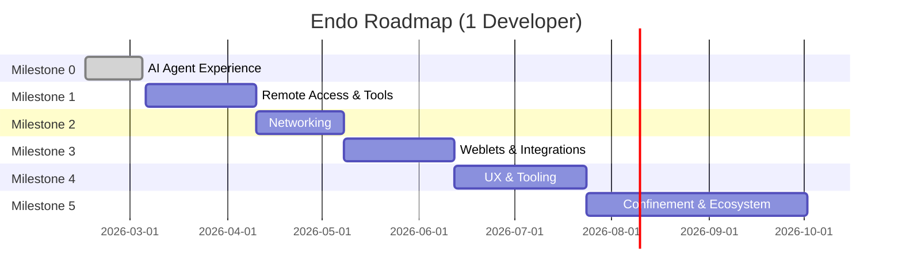

# Endo Design Documents

*Last updated: 2026-03-27*

## Summary

| Design | Created | Updated | Status |
|--------|---------|---------|--------|
| [chat-color-schemes](chat-color-schemes.md) | 2026-02-26 | 2026-02-26 | **Complete** |
| [chat-command-bar](chat-command-bar.md) | 2026-03-02 | 2026-03-02 | **Complete** |
| [chat-components](chat-components.md) | 2026-03-02 | 2026-03-02 | **Complete** |
| [chat-high-contrast-mode](chat-high-contrast-mode.md) | 2026-02-26 | 2026-02-26 | **Complete** |
| [chat-invariants](chat-invariants.md) | 2026-03-02 | 2026-03-02 | **Complete** |
| [chat-per-space-color-scheme](chat-per-space-color-scheme.md) | 2026-02-26 | 2026-02-26 | **Complete** |
| [chat-focus-message](chat-focus-message.md) | 2026-03-04 | 2026-03-04 | Active |
| [chat-markdown-render](chat-markdown-render.md) | 2026-03-03 | 2026-03-27 | Proposed |
| [chat-pending-commands](chat-pending-commands.md) | 2026-03-11 | 2026-03-11 | Not Started |
| [chat-rename-dismiss-to-clear](chat-rename-dismiss-to-clear.md) | 2026-03-03 | 2026-03-03 | Proposed |
| [chat-view-edit-commands](chat-view-edit-commands.md) | 2026-03-21 | 2026-03-21 | Not Started |
| [chat-reply-chain-visualization](chat-reply-chain-visualization.md) | 2026-02-23 | 2026-02-28 | Deprecated |
| [chat-spaces-home](chat-spaces-home.md) | 2026-03-02 | 2026-03-02 | **Complete** |
| [chat-spaces-gutter](chat-spaces-gutter.md) | 2026-02-21 | 2026-02-26 | **Complete** |
| [chat-spaces-inbox](chat-spaces-inbox.md) | 2026-02-21 | 2026-02-24 | **Complete** |
| [chat-test-coverage](chat-test-coverage.md) | 2026-03-02 | 2026-03-02 | **Complete** |
| [daemon-256-bit-identifiers](daemon-256-bit-identifiers.md) | 2026-02-24 | 2026-03-02 | **Complete** |
| [daemon-agent-network-identity](daemon-agent-network-identity.md) | 2026-03-02 | 2026-03-02 | Not Started |
| [daemon-agent-tools](daemon-agent-tools.md) | 2026-03-02 | 2026-03-02 | Not Started |
| [daemon-commands-as-messages](daemon-commands-as-messages.md) | 2026-03-11 | 2026-03-11 | Not Started |
| [daemon-capability-bank](daemon-capability-bank.md) | 2026-02-15 | 2026-02-24 | Not Started |
| [daemon-checkin-checkout](daemon-checkin-checkout.md) | 2026-03-17 | 2026-03-17 | Not Started |
| [daemon-capability-filesystem](daemon-capability-filesystem.md) | 2026-02-15 | 2026-02-24 | Not Started |
| [daemon-content-store-gc](daemon-content-store-gc.md) | 2026-03-20 | 2026-03-20 | Not Started |
| [daemon-message-streaming](daemon-message-streaming.md) | 2026-03-26 | 2026-03-26 | Draft |
| [daemon-mount](daemon-mount.md) | 2026-03-20 | 2026-03-20 | In Progress |
| [platform-fs](platform-fs.md) | 2026-03-18 | 2026-03-18 | In Progress |
| [daemon-capability-persona](daemon-capability-persona.md) | 2026-02-16 | 2026-02-24 | Not Started |
| [daemon-cross-peer-gc](daemon-cross-peer-gc.md) | 2026-03-07 | 2026-03-07 | Not Started |
| [daemon-guest-eval-simplification](daemon-guest-eval-simplification.md) | 2026-03-21 | 2026-03-21 | Not Started |
| [daemon-docker-selfhost](daemon-docker-selfhost.md) | 2026-03-02 | 2026-03-02 | Not Started |
| [daemon-capability-bus](daemon-capability-bus.md) | 2026-02-25 | 2026-04-11 | In Progress |
| [daemon-form-request](daemon-form-request.md) | 2026-02-25 | 2026-03-02 | **Complete** |
| [endoclaw](endoclaw.md) | 2026-03-03 | 2026-03-03 | Reference |
| [endoclaw-browser](endoclaw-browser.md) | 2026-03-03 | 2026-03-03 | Not Started |
| [endoclaw-channel-bridges](endoclaw-channel-bridges.md) | 2026-03-03 | 2026-03-03 | Not Started |
| [endoclaw-network-fetch](endoclaw-network-fetch.md) | 2026-03-03 | 2026-03-03 | Not Started |
| [endoclaw-notifications](endoclaw-notifications.md) | 2026-03-03 | 2026-03-03 | Not Started |
| [endoclaw-oauth](endoclaw-oauth.md) | 2026-03-03 | 2026-03-03 | Not Started |
| [endoclaw-proactive-messages](endoclaw-proactive-messages.md) | 2026-03-03 | 2026-03-03 | Not Started |
| [endoclaw-skill-registry](endoclaw-skill-registry.md) | 2026-03-03 | 2026-03-03 | Not Started |
| [endoclaw-timer](endoclaw-timer.md) | 2026-03-03 | 2026-03-18 | Not Started |
| [endoclaw-voice](endoclaw-voice.md) | 2026-03-03 | 2026-03-03 | Not Started |
| [endoclaw-webhooks](endoclaw-webhooks.md) | 2026-03-03 | 2026-03-03 | Not Started |
| [daemon-locator-terminology](daemon-locator-terminology.md) | 2026-02-24 | 2026-02-24 | Not Started |
| [daemon-os-sandbox-plugin](daemon-os-sandbox-plugin.md) | 2026-02-15 | 2026-03-19 | Not Started |
| [daemon-value-message](daemon-value-message.md) | 2026-03-02 | 2026-03-03 | **Complete** |
| [daemon-web-gateway](daemon-web-gateway.md) | 2026-03-11 | 2026-03-11 | **Complete** |
| [daemon-weblet-application](daemon-weblet-application.md) | 2026-02-24 | 2026-02-25 | Not Started |
| [familiar-bundled-agents](familiar-bundled-agents.md) | 2026-03-02 | 2026-03-05 | **Complete** |
| [familiar-chat-weblet-hosting](familiar-chat-weblet-hosting.md) | 2026-02-14 | 2026-02-26 | Not Started |
| [familiar-daemon-bundling](familiar-daemon-bundling.md) | 2026-02-14 | 2026-03-05 | **Complete** |
| [familiar-electron-shell](familiar-electron-shell.md) | 2026-02-14 | 2026-02-26 | **Complete** |
| [familiar-gateway-migration](familiar-gateway-migration.md) | 2026-02-14 | 2026-02-26 | **Complete** |
| [familiar-localhttp-protocol](familiar-localhttp-protocol.md) | 2026-02-24 | 2026-02-25 | In Progress (partially implemented) |
| [familiar-unified-weblet-server](familiar-unified-weblet-server.md) | 2026-02-14 | 2026-02-26 | In Progress |
| [formula-inspector](formula-inspector.md) | 2026-02-14 | 2026-02-24 | Not Started |
| [gateway-bearer-token-auth](gateway-bearer-token-auth.md) | 2026-03-02 | 2026-03-06 | **Implemented** |
| [inventory-cancel-and-liveness](inventory-cancel-and-liveness.md) | 2026-02-14 | 2026-03-13 | Not Started |
| [inventory-drag-and-drop](inventory-drag-and-drop.md) | 2026-02-14 | 2026-02-24 | Not Started |
| [inventory-grouping-by-type](inventory-grouping-by-type.md) | 2026-02-14 | 2026-02-24 | Not Started |
| [lal-fae-form-provisioning](lal-fae-form-provisioning.md) | 2026-03-02 | 2026-03-05 | **Complete** |
| [lal-reply-chain-transcripts](lal-reply-chain-transcripts.md) | 2026-02-26 | 2026-03-05 | **Complete** |
| [lal-transcript-memory-management](lal-transcript-memory-management.md) | 2026-03-05 | 2026-03-05 | Not Started |
| [ocapn-network-transport-separation](ocapn-network-transport-separation.md) | 2026-02-14 | 2026-02-24 | In Progress |
| [ocapn-noise-cryptographic-review](ocapn-noise-cryptographic-review.md) | 2026-02-14 | 2026-02-24 | Not Started |
| [ocapn-noise-network](ocapn-noise-network.md) | 2026-02-14 | 2026-02-24 | Not Started |
| [ocapn-tcp-for-test-extraction](ocapn-tcp-for-test-extraction.md) | 2026-02-14 | 2026-02-24 | Not Started |
| [outliner-design-doc](outliner-design-doc.md) | 2026-03-17 | 2026-03-18 | In Progress |
| [weblet-next](weblet-next.md) | 2026-03-24 | 2026-03-24 | Reference |
| [workers-panel](workers-panel.md) | 2026-02-14 | 2026-02-24 | Not Started |

**Totals:** 21 Complete/Implemented, 5 In Progress, 38 Not Started, 2 Proposed, 1 Active, 1 Reference, 1 Deprecated

## Roadmap

### Dependency Graph

```mermaid
flowchart TD
    subgraph Daemon Core
        d256[daemon-256-bit-identifiers<br/><i>COMPLETE</i>]
        dloc[daemon-locator-terminology]
        dnet[daemon-agent-network-identity]
        d256 --> dloc
        d256 --> dnet
    end

    subgraph Daemon Messaging
        dform[daemon-form-request<br/><i>COMPLETE</i>]
        dval[daemon-value-message<br/><i>COMPLETE</i>]
        dcmd[daemon-commands-as-messages]
        dform --> dval
        dform --> dcmd
        dval --> dcmd
    end

    subgraph LLM Agents
        laltx[lal-reply-chain-transcripts<br/><i>COMPLETE</i>]
        lalfp[lal-fae-form-provisioning<br/><i>COMPLETE</i>]
        fagent[familiar-bundled-agents<br/><i>COMPLETE</i>]
        dtools[daemon-agent-tools]
        deval[daemon-guest-eval-simplification]
        dform --> lalfp
        dval --> lalfp
        laltx --> lalfp
        lalfp --> fagent
        fbund --> fagent
        dfs --> dtools
        dtools --> fagent
        dtools --> deval
        dbank --> deval
        lalfp --> deval
    end

    subgraph Familiar
        fbund[familiar-daemon-bundling<br/><i>COMPLETE</i>]
        fweb[familiar-unified-weblet-server<br/><i>IN PROGRESS</i>]
        flhttp[familiar-localhttp-protocol<br/><i>IN PROGRESS</i>]
        fchat[familiar-chat-weblet-hosting]
        dci[daemon-checkin-checkout]
        dapp[daemon-weblet-application]
        fbund --> fweb --> fchat
        fweb --> dapp
        fchat --> dapp
        flhttp --> fchat
        dci --> dapp
    end

    subgraph Remote Access
        gauth[gateway-bearer-token-auth]
        ddock[daemon-docker-selfhost]
        ewebhook[endoclaw-webhooks]
        gauth --> ddock
        fbund --> ddock
        gauth --> ewebhook
    end

    subgraph Agent Capabilities
        etimer[endoclaw-timer]
        enetfetch[endoclaw-network-fetch]
        eoauth[endoclaw-oauth]
        enotify[endoclaw-notifications]
        eproactive[endoclaw-proactive-messages]
        ebrowser[endoclaw-browser]
        ebridge[endoclaw-channel-bridges]
        eskill[endoclaw-skill-registry]
        evoice[endoclaw-voice]
        enetfetch --> eoauth
        etimer --> eproactive
        eoauth --> ebridge
        eoauth --> eproactive
    end

    subgraph OCapN
        onet[ocapn-network-transport-separation<br/><i>IN PROGRESS</i>]
        otcp[ocapn-tcp-for-test-extraction]
        orev[ocapn-noise-cryptographic-review]
        onoise[ocapn-noise-network]
        onet --> otcp --> onoise
        orev --> onoise
        dnet --> onoise
    end

    subgraph Chat UX
        cpend[chat-pending-commands]
        cvedit[chat-view-edit-commands]
        dcmd --> cpend
        dmount --> cvedit
        cscheme[chat-color-schemes<br/><i>COMPLETE</i>]
        cspace[chat-per-space-color-scheme<br/><i>COMPLETE</i>]
        chc[chat-high-contrast-mode<br/><i>COMPLETE</i>]
        cscheme --> cspace --> chc
        cscheme --> chc
    end

    subgraph Capability System
        dsand[daemon-os-sandbox-plugin]
        pfs[platform-fs]
        dfs[daemon-capability-filesystem]
        dmount[daemon-mount<br/><i>IN PROGRESS</i>]
        dcsgc[daemon-content-store-gc]
        dpers[daemon-capability-persona]
        dbank[daemon-capability-bank]
        icancel[inventory-cancel-and-liveness]
        pfs --> dfs
        pfs --> dmount
        pfs --> dci
        dmount --> dtools
        dmount --> dcsgc
        dsand --> dbank
        dfs --> dbank
        dpers --> dbank
        dbank --> icancel
    end
```

### Milestones

#### Milestone 0: Downloadable AI Agent Experience

**Goal:** A Familiar application suitable for use on at least one
platform that folks can download and use to interact with an agent using
their own API key and local capabilities.

| Design | Status | Notes |
|--------|--------|-------|
| ~~daemon-256-bit-identifiers~~ | **Complete** | Core migration done |
| ~~daemon-form-request~~ | **Complete** | Fields as ordered array, CLI, Chat UI |
| ~~daemon-value-message~~ | **Complete** | `value` type, persistence, `submit()` delivery, Chat rendering, standalone `sendValue`, `send-value` CLI, daemon tests all done |
| ~~lal-reply-chain-transcripts~~ | **Complete** | Phases 1-4 implemented; Phase 5 (memory management) deferred as out-of-scope |
| ~~familiar-daemon-bundling~~ | **Complete** | esbuild bundles, Node download, Forge integration |
| ~~lal-fae-form-provisioning~~ | **Complete** | Manager/worker split, form-based config, inbox-replay recovery |
| ~~familiar-bundled-agents~~ | **Complete** | esbuild bundles, resource paths, env vars, daemon-node.js provisioning |

**Exit criterion:** There is a Familiar application suitable for use on
at least one platform that folks can download and use to interact with an
agent using their own API key and local capabilities.

**Actual duration:** 18 active work days (Feb 15 – Mar 5), primarily 1
developer (128 of 201 commits). 7 designs completed. Original estimate
was 3-4 days for the final item; revised to 0 remaining.

---

#### Milestone 1: Remote Access and Coding Capabilities

**Goal:** Self-host a daemon with Docker, remote control it via local
Familiar or hosted Chat with bearer token auth. Claw-like coding
capabilities available to agents.

| Design | Status | Notes |
|--------|--------|-------|
| ~~gateway-bearer-token-auth~~ | **Implemented** | Agent ID as bearer token, rate limiting, CIDR filtering |
| daemon-docker-selfhost | Not Started | Dockerfile, state persistence, network exposure, Chat hosting |
| daemon-agent-tools | Not Started | Filesystem, shell, git tools backed by capabilities |
| platform-fs | In Progress | `@endo/platform/fs` — shared types, content store, tree adapters |
| daemon-capability-filesystem | Not Started | `Dir`/`File` capabilities for structural filesystem confinement |
| daemon-content-store-gc | Not Started | Content-store pruning and scratch-mount directory cleanup at GC time |
| daemon-mount | In Progress | Phases 1-3, 5 implemented; symlink confinement, 20 integration tests; Phase 4 (sub-mounts, snapshot) and Phase 6 (CLI) remaining |
| daemon-locator-terminology | Not Started | Clean locator API; unblocked |
| endoclaw-timer | Not Started | **Strategic:** Core capability concern — SES removes `setTimeout`/`setInterval`; Timer is the only way agents get scheduled execution. Prerequisite for proactive behavior. |
| endoclaw-network-fetch | Not Started | **Strategic:** `HttpClient` with origin allowlist. Self-hosted agents need outbound HTTP; foundation for OAuth and all external integrations. |
| daemon-cross-peer-gc | Not Started | **Urgent:** Synced pet store CRDT for cross-peer GC, revocation propagation, offline progress |
| daemon-guest-eval-simplification | Not Started | Remove eval-proposal handshake; guest eval delegates directly to `formulateEval` |

**Exit criterion:** Someone can self-host a daemon with our Docker image
and remote control it, by whatever means, using a local Familiar or a
Chat interface hosted by the Daemon itself online. If using Chat, the
user must be able to present their bearer token (the id of their root
agent) in the URL anchor, so that the Chat UI can submit this over
WebSocket to the Daemon's Gateway, in order to establish the root or
home profile. Agents have scheduled execution and confined outbound HTTP.

**Estimated duration (1 dev):** 4-5 weeks

---

#### Milestone 2: Networking

**Goal:** Secure peer connections via OCapN-Noise, locator format
finalized.

| Design | Status | Notes |
|--------|--------|-------|
| ocapn-network-transport-separation | In Progress | Foundation for transport abstraction |
| ocapn-tcp-for-test-extraction | Not Started | Clean separation before Noise |
| ocapn-noise-cryptographic-review | Not Started | External review coordination |
| daemon-agent-network-identity | Not Started | Per-agent keypairs for network identity |
| ocapn-noise-network | Not Started | Full Noise protocol network layer |

**Exit criterion:** Two Endo daemons can connect securely over
OCapN-Noise. Locator format supports node identification via agent
keypairs.

**Estimated duration (1 dev):** 3-4 weeks

---

#### Milestone 3: Weblets and Integrations

**Goal:** Weblet hosting in Familiar and daemon. OAuth-based external
service integrations. Proactive agent behavior. Webhooks for event-driven
automation.

| Design | Status | Notes |
|--------|--------|-------|
| familiar-unified-weblet-server | In Progress | Web-server restructuring |
| familiar-chat-weblet-hosting | Not Started | Iframe hosting, guest profiles |
| daemon-checkin-checkout | Not Started | `endo ci` / `endo co` for readable-tree ↔ filesystem |
| daemon-weblet-application | Not Started | Readable trees, zip archives |
| endoclaw-oauth | Not Started | Credential capability — agent uses service without seeing token |
| endoclaw-proactive-messages | Not Started | Composes Timer + data caps + send() for briefings/reminders |
| endoclaw-notifications | Not Started | `Notify` exo → Electron `Notification`; needs daemon↔Electron bridge |
| endoclaw-webhooks | Not Started | Gateway webhook endpoints → agent inbox as messages |
| endoclaw-voice | Not Started | Web Speech API or Whisper in Chat UI; UI feature only |

**Exit criterion:** Users can install and interact with weblets. Agents
can authenticate to external services (Gmail, Calendar, etc.) via OAuth
capabilities, send proactive briefings on a schedule, and receive
webhook events.

**Estimated duration (1 dev):** 4-6 weeks

---

#### Milestone 4: UX Polish and Agent Tooling

**Goal:** Polished Chat experience, developer observability.

| Design | Status | Notes |
|--------|--------|-------|
| ~~chat-reply-chain-visualization~~ | Deprecated | Superseded by chat-focus-message |
| chat-pending-commands | Not Started | Pending commands region, unlocked command bar |
| daemon-commands-as-messages | Not Started | Commands as self-addressed messages with reply results; subsumes pending region |
| inventory-cancel-and-liveness | Not Started | Cancel button with liveness indicator, coalesced watcher protocol |
| inventory-grouping-by-type | Not Started | UI grouping, collapsible sections |
| inventory-drag-and-drop | Not Started | HTML5 DnD handlers |
| formula-inspector | Not Started | New panel, daemon API exposure |
| workers-panel | Not Started | Metrics, sparklines |
| chat-view-edit-commands | Not Started | `/view` and `/edit` for blobs; Monaco editor, Markdown split preview |
| lal-transcript-memory-management | Not Started | Durable transcript nodes outliving dismissed messages |

**Exit criterion:** Chat UI feature-complete for current design scope.
Commands are non-blocking with visible pending state. Developer tools
(inspector, workers panel) available. Inventory shows liveness with
inline cancel. Agent transcript memory is bounded.

**Estimated duration (1 dev):** 5-7 weeks

---

#### Milestone 5: Capability Confinement and Ecosystem

**Goal:** Full capability bank for AI agent confinement. Browser
automation. Channel bridges to external messaging platforms. Plugin
ecosystem.

| Design | Status | Notes |
|--------|--------|-------|
| daemon-os-sandbox-plugin | Not Started | Platform-specific process confinement |
| daemon-capability-persona | Not Started | Epithets and delegation |
| daemon-capability-bank | Not Started | Integrates all capability categories |
| endoclaw-browser | Not Started | Playwright-backed `Browser` exo with origin allowlist |
| endoclaw-channel-bridges | Not Started | `chat` SDK (Vercel) adapters for Slack, Telegram, Discord, etc. |
| endoclaw-skill-registry | Not Started | Skills directory — capability-aware plugin index |

**Exit criterion:** AI coding agent runs with principle of least
authority enforced — sandboxed processes, confined filesystem, auditable
identity. Browser automation available for web research and form filling.
Agents reachable from external messaging platforms via channel bridges.

**Estimated duration (1 dev):** 8-12 weeks

---

### Size and Time Estimates

#### Estimation Methodology

Recalibrated on 2026-03-02 using observed velocity from 15 active work days
(Feb 15 – Mar 2) by one full-time developer.

1. **Velocity measurement:** Analyzed git history on the `llm` branch from
   2026-02-15 to 2026-03-02:
   - Active work days with commits: 15 out of 16 calendar days
   - Commit frequency: ~9 commits per active work day (138 commits / 15 days)
   - LOC throughput: ~500-2500 lines per day depending on feature type
   - Completed designs in period: 14 (from 0 to 14 complete)

2. **Completed reference points** (actuals, one developer):

   | Feature | LOC | Days | LOC/day |
   |---------|-----|------|---------|
   | `chat-spaces-gutter` + `chat-spaces-inbox` | ~2500 | 1 | 2500 |
   | `familiar-electron-shell` + `familiar-gateway-migration` | ~6700 | 2 | 3350 |
   | `chat-color-schemes` + `per-space` + `high-contrast` | ~1300 | 1 | 1300 |
   | `daemon-256-bit-identifiers` | ~390 | 1 | 390 |
   | `daemon-form-request` (full pipeline: types, daemon, CLI, Chat UI, tests) | ~3400 | 5 | 680 |
   | `lal-reply-chain-transcripts` (phases 1-4) | ~800 | 2 | 400 |

3. **Key observations:**
   - **UI-heavy features** (Chat components, spaces) have the highest LOC/day
     because the code is relatively straightforward DOM manipulation.
   - **Cross-cutting daemon features** (forms, value messages) are slower per
     LOC because they touch types, interfaces, mail, host, guest, CLI, and
     Chat — many files with small coordinated changes. ~500-700 LOC/day.
   - **Architectural refactors** (256-bit identifiers) are fast when the scope
     is well-defined. ~400 LOC/day but only 1 day total.
   - The original Feb 24 estimates assumed ~200-300 LOC/day. Actual velocity
     is 2-3x higher. The original estimates significantly overstated duration.

4. **Recalibrated size categories:**

   | Size | LOC Impact | Duration (1 dev) | Description |
   |------|------------|-------------------|-------------|
   | S | < 500 | 1 day | Localized changes, single subsystem |
   | M | 500-1500 | 2-3 days | Multiple files, moderate complexity |
   | L | 1500-3000 | 1-1.5 weeks | Architectural changes, new subsystems |
   | XL | > 3000 | 2-3 weeks | Cross-cutting, platform-specific, or research-heavy |

#### Per-Design Estimates

| Design | Size | Estimate | Milestone | Notes |
|--------|------|----------|-----------|-------|
| ~~daemon-256-bit-identifiers~~ | — | — | 0 | ✅ Complete (1 day actual) |
| ~~daemon-form-request~~ | — | — | 0 | ✅ Complete (5 days actual) |
| ~~daemon-value-message~~ | — | — | 0 | ✅ Complete |
| ~~lal-reply-chain-transcripts~~ | — | — | 0 | ✅ Complete (phases 1-4; phase 5 deferred) |
| ~~familiar-daemon-bundling~~ | — | — | 0 | ✅ Complete |
| ~~lal-fae-form-provisioning~~ | — | — | 0 | ✅ Complete (inbox replay handles restart) |
| ~~familiar-bundled-agents~~ | — | — | 0 | ✅ Complete (inline provisioning in daemon-node.js) |
| ~~gateway-bearer-token-auth~~ | — | — | 1 | ✅ Implemented |
| daemon-docker-selfhost | S-M | 2-3 days | 1 | Dockerfile, entrypoint, compose |
| daemon-agent-tools | M-L | 1-1.5 weeks | 1 | Shell, git, fs tool wrappers |
| platform-fs | S-M | 2-3 days | 1 | Shared types, content store extraction, tree adapters |
| daemon-capability-filesystem | L | 1-2 weeks | 1 | Dir/File exos, physical backend |
| daemon-content-store-gc | S | 1 day | 1 | Sweep-time ref count for store-sha256, scratch-mount dir removal |
| daemon-mount | M-L | 1-1.5 weeks | 1 | Mount exo, symlink confinement, scratch lifecycle, host methods |
| daemon-locator-terminology | S | 1 day | 1 | locator.js + host.js changes |
| endoclaw-timer | S-M | 2-3 days | 1 | IntervalScheduler with tick delivery, durable formulas, host-controlled limits |
| daemon-guest-eval-simplification | S | 1 day | 1 | Remove eval-proposal flow, guest eval delegates to `formulateEval` |
| endoclaw-network-fetch | S-M | 2-3 days | 1 | HttpClient with origin allowlist, rate/size limits |
| ocapn-network-transport-separation | M-L | 1-1.5 weeks | 2 | Architectural refactor |
| ocapn-tcp-for-test-extraction | S-M | 2-3 days | 2 | Code relocation |
| ocapn-noise-cryptographic-review | S | 1 day | 2 | External review coordination |
| daemon-agent-network-identity | S-M | 2-3 days | 2 | Network registration, locator construction |
| ocapn-noise-network | L | 1.5-2 weeks | 2 | Full network + transport |
| familiar-unified-weblet-server | M | 2-3 days | 3 | Web-server restructuring |
| familiar-chat-weblet-hosting | M | 3-4 days | 3 | Iframe hosting, guest profiles |
| daemon-checkin-checkout | S-M | 2-3 days | 3 | `endo ci`/`co`, readable-tree formula, zip support |
| daemon-weblet-application | M | 3-4 days | 3 | Formula types, gateway serving |
| endoclaw-oauth | S-M | 2-3 days | 3 | Credential proxy exo, token injection |
| endoclaw-proactive-messages | S | 1 day | 3 | Pattern doc: Timer + data caps + send() |
| endoclaw-notifications | S | 1 day | 3 | Electron Notification API, rate-limited exo; needs daemon↔Electron bridge |
| endoclaw-webhooks | S-M | 2-3 days | 3 | Gateway webhook routes → inbox messages |
| endoclaw-voice | S | 1-2 days | 3 | Web Speech API in Chat UI |
| ~~chat-reply-chain-visualization~~ | — | — | 4 | Deprecated (superseded by chat-focus-message) |
| chat-pending-commands | S-M | 2-3 days | 4 | Pending region, unlocked command bar (UI only) |
| daemon-commands-as-messages | M-L | 1-1.5 weeks | 4 | New message type, self-delivery, result replies, Chat rendering |
| inventory-cancel-and-liveness | M | 3-4 days | 4 | Cancel button, indicator states, coalesced watcher exo + daemon hooks |
| inventory-grouping-by-type | S | 1-2 days | 4 | UI grouping |
| inventory-drag-and-drop | S-M | 2-3 days | 4 | HTML5 DnD |
| formula-inspector | M | 3-4 days | 4 | New panel, daemon API |
| workers-panel | M | 3-5 days | 4 | Metrics, sparklines |
| chat-view-edit-commands | M | 3-5 days | 4 | `/view`, `/edit` modal, Monaco reuse, Markdown split preview (Phase 4) |
| lal-transcript-memory-management | S | 1 day | 4 | Durable message-to-node mapping, broken chain detection |
| daemon-os-sandbox-plugin | L-XL | 2-3 weeks | 5 | Platform-specific |
| daemon-capability-persona | S-M | 2-3 days | 5 | Handle extension, epithet tracking |
| daemon-capability-bank | XL | 3-4 weeks | 5 | Integrates all capabilities |
| endoclaw-browser | M-L | 1-1.5 weeks | 5 | Playwright-backed, origin-confined |
| endoclaw-channel-bridges | M | 3-4 days | 5 | Vercel `chat` SDK adapters |
| endoclaw-skill-registry | S-M | 2-3 days | 5 | Skills directory with capability declarations |

#### Summary by Milestone

| Milestone | Items | Total Estimate (1 dev, serial) |
|-----------|-------|-------------------------------|
| M0: AI Agent Experience | 0 remaining | **Complete** |
| M1: Remote Access & Tools | 11 remaining | 6-7 weeks |
| M2: Networking | 5 | 3-4 weeks |
| M3: Weblets & Integrations | 8 | 4-6 weeks |
| M4: UX & Tooling | 9 | 5-7 weeks |
| M5: Confinement & Ecosystem | 6 | 8-12 weeks |
| **Total remaining** | **38** | **~26-36 weeks** |

### Timeline

```mermaid
gantt
    title Endo Roadmap (1 Developer)
    dateFormat YYYY-MM-DD

    section Milestone 0
    AI Agent Experience           :done, m0, 2026-02-15, 2026-03-05

    section Milestone 1
    Remote Access & Tools         :m1, 2026-03-06, 5w

    section Milestone 2
    Networking                    :m2, after m1, 4w

    section Milestone 3
    Weblets & Integrations        :m3, after m2, 5w

    section Milestone 4
    UX & Tooling                  :m4, after m3, 6w

    section Milestone 5
    Confinement & Ecosystem       :m5, after m4, 10w
```

| Milestone | Duration | Cumulative | Target Date |
|-----------|----------|------------|-------------|
| M0: AI Agent Experience | 18 days (actual) | **Complete** | March 5, 2026 |
| M1: Remote Access & Tools | 4-5 weeks | 6-8 weeks | Late April 2026 |
| M2: Networking | 3-4 weeks | 9-12 weeks | Late May 2026 |
| M3: Weblets & Integrations | 4-6 weeks | 12-17 weeks | Late June 2026 |
| M4: UX & Tooling | 5-7 weeks | 16-23 weeks | Late August 2026 |
| M5: Confinement & Ecosystem | 8-12 weeks | 24-35 weeks | Late October 2026 |

*Milestones 3 and 4 are less order-dependent and can be interleaved.
Milestones 0, 1, and 2 form the critical path. Weblets prioritized over
UX polish (swapped 2026-03-06).*

### Strategic Early Items

Two EndoClaw capabilities are surfaced before the last two milestones
because they are foundational rather than features:

| Design | Milestone | Rationale |
|--------|-----------|-----------|
| endoclaw-timer | M1 | **Core capability concern.** SES lockdown removes `setTimeout` and `setInterval`. Timer is the *only* mechanism for scheduled agent execution. Prerequisite for proactive messages, monitoring, reminders. Without it, agents are purely reactive. |
| endoclaw-network-fetch | M1 | **Foundation for all external access.** M1 already does Docker/remote access. A self-hosted agent that cannot reach external APIs is inert. HttpClient with origin allowlist is the minimal network capability. OAuth, channel bridges, and all integrations depend on it. |

**Progress as of 2026-03-21:** 21 of 69 designs complete/implemented, 5 in progress. M0 complete.
18 active work days elapsed (Feb 15 – Mar 5), primarily 1 developer
(128 of 201 commits). Observed throughput: ~9 commits/day, ~500-2500 LOC/day.
`daemon-form-request` and `daemon-value-message` complete (value type,
persistence, `submit()` delivery, standalone `sendValue`, CLI, tests).
`familiar-daemon-bundling` complete (esbuild bundles, Node download,
Forge integration, dev/packaged path resolution all implemented).
`lal-reply-chain-transcripts` complete (phases 1-4 implemented; phase 5
memory management deferred as out-of-scope future work).
`lal-fae-form-provisioning` complete (manager/worker split, form-based
config, restart recovery via inbox replay — no explicit config persistence
needed since `followMessages()` replays all historical submissions).
`familiar-bundled-agents` complete (esbuild bundles for Lal/Fae, resource
paths, env var passthrough, inline guest provisioning in daemon-node.js
using setup.js pattern — Option C instead of Option A from the design doc).
