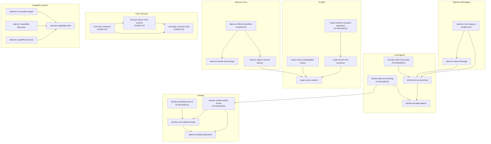
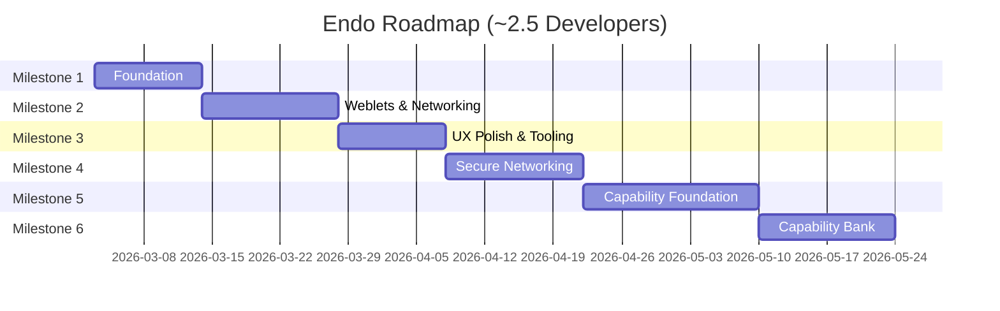

# Endo Design Documents

*Last updated: 2026-03-02*

## Summary

| Design | Created | Updated | Status |
|--------|---------|---------|--------|
| [chat-color-schemes](chat-color-schemes.md) | 2026-02-26 | 2026-02-26 | **Complete** |
| [chat-command-bar](chat-command-bar.md) | 2026-03-02 | 2026-03-02 | **Complete** |
| [chat-components](chat-components.md) | 2026-03-02 | 2026-03-02 | **Complete** |
| [chat-high-contrast-mode](chat-high-contrast-mode.md) | 2026-02-26 | 2026-02-26 | **Complete** |
| [chat-invariants](chat-invariants.md) | 2026-03-02 | 2026-03-02 | **Complete** |
| [chat-per-space-color-scheme](chat-per-space-color-scheme.md) | 2026-02-26 | 2026-02-26 | **Complete** |
| [chat-reply-chain-visualization](chat-reply-chain-visualization.md) | 2026-02-23 | 2026-02-28 | In Progress |
| [chat-spaces-home](chat-spaces-home.md) | 2026-03-02 | 2026-03-02 | **Complete** |
| [chat-spaces-gutter](chat-spaces-gutter.md) | 2026-02-21 | 2026-02-26 | **Complete** |
| [chat-spaces-inbox](chat-spaces-inbox.md) | 2026-02-21 | 2026-02-24 | **Complete** |
| [chat-test-coverage](chat-test-coverage.md) | 2026-03-02 | 2026-03-02 | **Complete** |
| [daemon-256-bit-identifiers](daemon-256-bit-identifiers.md) | 2026-02-24 | 2026-03-02 | **Complete** |
| [daemon-agent-network-identity](daemon-agent-network-identity.md) | 2026-03-02 | 2026-03-02 | Not Started |
| [daemon-capability-bank](daemon-capability-bank.md) | 2026-02-15 | 2026-02-24 | Not Started |
| [daemon-capability-filesystem](daemon-capability-filesystem.md) | 2026-02-15 | 2026-02-24 | Not Started |
| [daemon-capability-persona](daemon-capability-persona.md) | 2026-02-16 | 2026-02-24 | Not Started |
| [daemon-form-request](daemon-form-request.md) | 2026-02-25 | 2026-03-02 | **Complete** |
| [daemon-locator-terminology](daemon-locator-terminology.md) | 2026-02-24 | 2026-02-24 | Not Started |
| [daemon-os-sandbox-plugin](daemon-os-sandbox-plugin.md) | 2026-02-15 | 2026-02-24 | Not Started |
| [daemon-value-message](daemon-value-message.md) | 2026-03-02 | 2026-03-02 | Not Started |
| [daemon-weblet-application](daemon-weblet-application.md) | 2026-02-24 | 2026-02-25 | Not Started |
| [familiar-bundled-agents](familiar-bundled-agents.md) | 2026-03-02 | 2026-03-02 | Not Started |
| [familiar-chat-weblet-hosting](familiar-chat-weblet-hosting.md) | 2026-02-14 | 2026-02-26 | Not Started |
| [familiar-daemon-bundling](familiar-daemon-bundling.md) | 2026-02-14 | 2026-02-24 | In Progress |
| [familiar-electron-shell](familiar-electron-shell.md) | 2026-02-14 | 2026-02-26 | **Complete** |
| [familiar-gateway-migration](familiar-gateway-migration.md) | 2026-02-14 | 2026-02-26 | **Complete** |
| [familiar-localhttp-protocol](familiar-localhttp-protocol.md) | — | — | In Progress (partially implemented) |
| [familiar-unified-weblet-server](familiar-unified-weblet-server.md) | 2026-02-14 | 2026-02-26 | In Progress |
| [formula-inspector](formula-inspector.md) | 2026-02-14 | 2026-02-24 | Not Started |
| [inventory-drag-and-drop](inventory-drag-and-drop.md) | 2026-02-14 | 2026-02-24 | Not Started |
| [inventory-grouping-by-type](inventory-grouping-by-type.md) | 2026-02-14 | 2026-02-24 | Not Started |
| [lal-fae-form-provisioning](lal-fae-form-provisioning.md) | 2026-03-02 | 2026-03-02 | Not Started |
| [lal-reply-chain-transcripts](lal-reply-chain-transcripts.md) | 2026-02-26 | 2026-02-28 | In Progress (phases 1-4 complete) |
| [live-reference-indicator](live-reference-indicator.md) | 2026-02-14 | 2026-02-24 | Not Started |
| [ocapn-network-transport-separation](ocapn-network-transport-separation.md) | 2026-02-14 | 2026-02-24 | In Progress |
| [ocapn-noise-cryptographic-review](ocapn-noise-cryptographic-review.md) | 2026-02-14 | 2026-02-24 | Not Started |
| [ocapn-noise-network](ocapn-noise-network.md) | 2026-02-14 | 2026-02-24 | Not Started |
| [ocapn-tcp-for-test-extraction](ocapn-tcp-for-test-extraction.md) | 2026-02-14 | 2026-02-24 | Not Started |
| [workers-panel](workers-panel.md) | 2026-02-14 | 2026-02-24 | Not Started |

**Totals:** 14 Complete, 6 In Progress, 19 Not Started

## Roadmap

### Dependency Graph

```mermaid
flowchart TD
    subgraph Daemon Core
        d256[daemon-256-bit-identifiers<br/><i>COMPLETE</i>]
        dloc[daemon-locator-terminology]
        dnet[daemon-agent-network-identity]
        d256 --> dloc
        d256 --> dnet
    end

    subgraph Daemon Messaging
        dform[daemon-form-request<br/><i>COMPLETE</i>]
        dval[daemon-value-message]
        dform --> dval
    end

    subgraph LLM Agents
        laltx[lal-reply-chain-transcripts<br/><i>IN PROGRESS</i>]
        lalfp[lal-fae-form-provisioning]
        fagent[familiar-bundled-agents]
        dform --> lalfp
        dval --> lalfp
        laltx --> lalfp
        lalfp --> fagent
        fbund --> fagent
    end

    subgraph Familiar
        fbund[familiar-daemon-bundling<br/><i>IN PROGRESS</i>]
        fweb[familiar-unified-weblet-server<br/><i>IN PROGRESS</i>]
        flhttp[familiar-localhttp-protocol<br/><i>IN PROGRESS</i>]
        fchat[familiar-chat-weblet-hosting]
        dapp[daemon-weblet-application]
        fbund --> fweb --> fchat
        fweb --> dapp
        fchat --> dapp
        flhttp --> fchat
    end

    subgraph OCapN
        onet[ocapn-network-transport-separation<br/><i>IN PROGRESS</i>]
        otcp[ocapn-tcp-for-test-extraction]
        orev[ocapn-noise-cryptographic-review]
        onoise[ocapn-noise-network]
        onet --> otcp --> onoise
        orev --> onoise
        dnet --> onoise
    end

    subgraph Chat Theming
        cscheme[chat-color-schemes<br/><i>COMPLETE</i>]
        cspace[chat-per-space-color-scheme<br/><i>COMPLETE</i>]
        chc[chat-high-contrast-mode<br/><i>COMPLETE</i>]
        cscheme --> cspace --> chc
        cscheme --> chc
    end

    subgraph Capability System
        dsand[daemon-os-sandbox-plugin]
        dfs[daemon-capability-filesystem]
        dpers[daemon-capability-persona]
        dbank[daemon-capability-bank]
        dsand --> dbank
        dfs --> dbank
        dpers --> dbank
    end
```

### Prioritized Tiers

#### Tier 1 — Critical Path (High Urgency)

These block distribution or foundational work.

| Design | Urgency | Rationale |
|--------|---------|-----------|
| ~~daemon-256-bit-identifiers~~ | — | ✅ Complete |
| familiar-daemon-bundling | High | Blocks Familiar distribution; in progress |

#### Tier 2 — Enabling Infrastructure (High-Medium Urgency)

Unblock downstream features and networking.

| Design | Urgency | Depends On | Rationale |
|--------|---------|------------|-----------|
| ~~daemon-form-request~~ | — | — | ✅ Complete (fields as ordered array, CLI, Chat UI) |
| daemon-locator-terminology | High | ~~daemon-256-bit-identifiers~~ | Clean API for locators; unblocked |
| daemon-value-message | High | ~~daemon-form-request~~ | Reply mechanism for forms; blocks agent provisioning. Form `submit()` already sends value messages; standalone `sendValue` not yet built |
| familiar-unified-weblet-server | High | familiar-daemon-bundling | Required for weblet hosting in Familiar |
| ocapn-network-transport-separation | Medium | — | Foundation for OCapN-Noise; in progress |

#### Tier 3 — Near-term Features (Medium Urgency)

Enable new capabilities once infrastructure is ready.

| Design | Urgency | Depends On | Rationale |
|--------|---------|------------|-----------|
| lal-fae-form-provisioning | Medium | ~~daemon-form-request~~, daemon-value-message, lal-reply-chain-transcripts | Form-based multi-agent provisioning for Lal and Fae; form primitives complete |
| familiar-bundled-agents | Medium | familiar-daemon-bundling, lal-fae-form-provisioning | Bundle Lal/Fae into Familiar for out-of-the-box AI agent experience |
| ocapn-tcp-for-test-extraction | Medium | ocapn-network-transport-separation | Clean separation before adding Noise |
| familiar-chat-weblet-hosting | Medium | familiar-unified-weblet-server, familiar-localhttp-protocol | Core Familiar feature |
| daemon-weblet-application | Medium | familiar-unified-weblet-server, familiar-chat-weblet-hosting | Readable trees and weblets from zip archives |
| ocapn-noise-cryptographic-review | Medium | — | Should complete before stabilizing Noise |

#### Tier 4 — User Experience (Medium-Low Urgency)

Improve Chat UI; independent of core infrastructure.

| Design | Urgency | Depends On | Rationale |
|--------|---------|------------|-----------|
| ~~chat-color-schemes~~ | — | — | ✅ Complete |
| ~~chat-per-space-color-scheme~~ | — | — | ✅ Complete |
| ~~chat-high-contrast-mode~~ | — | — | ✅ Complete |
| chat-reply-chain-visualization | Low | — | Visual improvement; no blockers |
| inventory-grouping-by-type | Low | — | UX polish |
| inventory-drag-and-drop | Low | — | UX polish |
| formula-inspector | Low | — | Power-user feature |
| workers-panel | Low | — | Observability feature |
| live-reference-indicator | Low | — | Requires daemon incarnation status API |

#### Tier 5 — Networking Completion (Medium Urgency, Gated)

| Design | Urgency | Depends On | Rationale |
|--------|---------|------------|-----------|
| daemon-agent-network-identity | Medium | ~~daemon-256-bit-identifiers~~, ocapn-network-transport-separation | Per-agent keypairs used for network identity |
| ocapn-noise-network | Medium | ocapn-tcp-for-test-extraction, ocapn-noise-cryptographic-review, daemon-agent-network-identity | Secure peer networking |

#### Tier 6 — Long-term / Research (Low Urgency)

Security and capability research; no immediate blockers.

| Design | Urgency | Depends On | Rationale |
|--------|---------|------------|-----------|
| daemon-os-sandbox-plugin | Low | — | Foundational for native process confinement |
| daemon-capability-filesystem | Low | — | Exploratory; informs capability bank |
| daemon-capability-persona | Low | — | Exploratory; epithets and delegation |
| daemon-capability-bank | Low | daemon-os-sandbox-plugin, daemon-capability-filesystem | Long-term vision for AI agent confinement |

### Suggested Execution Order

1. **Now:** Complete `daemon-value-message` (standalone `sendValue`; form `submit` already works), continue `familiar-daemon-bundling`, continue `ocapn-network-transport-separation`
2. **Next:** `lal-fae-form-provisioning` (all daemon dependencies nearly complete), `daemon-locator-terminology` (unblocked)
3. **Then:** `familiar-unified-weblet-server` → `familiar-chat-weblet-hosting`
4. **Parallel:** `ocapn-tcp-for-test-extraction`, `ocapn-noise-cryptographic-review`
5. **After review:** `ocapn-noise-network`
6. **Ongoing:** Chat UI improvements (Tier 4) as bandwidth permits
7. **Research:** Capability system designs (Tier 6) inform future direction

### Size and Time Estimates

#### Estimation Methodology

Recalibrated on 2026-03-02 using observed velocity from 15 active work days
(Feb 15 – Mar 2) by one full-time developer.

1. **Velocity measurement:** Analyzed git history on the `llm` branch from
   2026-02-15 to 2026-03-02:
   - Active work days with commits: 15 out of 16 calendar days
   - Commit frequency: ~9 commits per active work day (138 commits / 15 days)
   - LOC throughput: ~500-2500 lines per day depending on feature type
   - Completed designs in period: 14 (from 0 to 14 complete)

2. **Completed reference points** (actuals, one developer):

   | Feature | LOC | Days | LOC/day |
   |---------|-----|------|---------|
   | `chat-spaces-gutter` + `chat-spaces-inbox` | ~2500 | 1 | 2500 |
   | `familiar-electron-shell` + `familiar-gateway-migration` | ~6700 | 2 | 3350 |
   | `chat-color-schemes` + `per-space` + `high-contrast` | ~1300 | 1 | 1300 |
   | `daemon-256-bit-identifiers` | ~390 | 1 | 390 |
   | `daemon-form-request` (full pipeline: types, daemon, CLI, Chat UI, tests) | ~3400 | 5 | 680 |
   | `lal-reply-chain-transcripts` (phases 1-4) | ~800 | 2 | 400 |

3. **Key observations:**
   - **UI-heavy features** (Chat components, spaces) have the highest LOC/day
     because the code is relatively straightforward DOM manipulation.
   - **Cross-cutting daemon features** (forms, value messages) are slower per
     LOC because they touch types, interfaces, mail, host, guest, CLI, and
     Chat — many files with small coordinated changes. ~500-700 LOC/day.
   - **Architectural refactors** (256-bit identifiers) are fast when the scope
     is well-defined. ~400 LOC/day but only 1 day total.
   - The original Feb 24 estimates assumed ~200-300 LOC/day. Actual velocity
     is 2-3x higher. The original estimates significantly overstated duration.

4. **Recalibrated size categories:**

   | Size | LOC Impact | Duration (1 dev) | Description |
   |------|------------|-------------------|-------------|
   | S | < 500 | 1 day | Localized changes, single subsystem |
   | M | 500-1500 | 2-3 days | Multiple files, moderate complexity |
   | L | 1500-3000 | 1-1.5 weeks | Architectural changes, new subsystems |
   | XL | > 3000 | 2-3 weeks | Cross-cutting, platform-specific, or research-heavy |

#### Project Estimates (1 Developer, Serial)

| Design | Size | Estimate | Notes |
|--------|------|----------|-------|
| **Tier 1** |
| ~~daemon-256-bit-identifiers~~ | — | — | ✅ Complete (1 day actual) |
| ~~daemon-form-request~~ | — | — | ✅ Complete (5 days actual) |
| familiar-daemon-bundling | S-M | 2-3 days | Remaining: esbuild config, worker bundling |
| **Tier 2** |
| daemon-locator-terminology | S | 1 day | Unblocked; locator.js + host.js changes |
| daemon-value-message | S | 1-2 days | Form `submit()` already sends value messages; remaining: standalone `sendValue`, CLI, Chat UI |
| familiar-unified-weblet-server | M | 2-3 days | Web-server restructuring, routing |
| ocapn-network-transport-separation | M-L | 1-1.5 weeks | Architectural refactor across ocapn packages |
| **Tier 3** |
| lal-fae-form-provisioning | M | 3-4 days | Manager/worker refactor, 4 phases; form primitives complete |
| familiar-bundled-agents | S-M | 2-3 days | esbuild entries, resource paths, special formulas, self-provisioning; no native deps |
| ocapn-tcp-for-test-extraction | S-M | 2-3 days | Code relocation, interface cleanup |
| familiar-chat-weblet-hosting | M | 3-4 days | Iframe hosting, panel UI, guest profiles |
| daemon-weblet-application | M | 3-4 days | Two formula types, gateway serving, CLI/chat verbs |
| ocapn-noise-cryptographic-review | S | 1 day | Coordination work + external review wait time |
| **Tier 4** |
| chat-reply-chain-visualization | M | 3-4 days | Layout algorithm, SVG/CSS connector lines |
| inventory-grouping-by-type | S | 1-2 days | UI grouping, collapsible sections |
| inventory-drag-and-drop | S-M | 2-3 days | HTML5 DnD handlers, drop targets |
| formula-inspector | M | 3-4 days | New panel, daemon InspectorHub API exposure |
| workers-panel | M | 3-5 days | New panel, daemon metrics API, sparklines |
| live-reference-indicator | M | 3-4 days | Daemon incarnation status API + UI indicators |
| **Tier 5** |
| daemon-agent-network-identity | S-M | 2-3 days | Network registration, null-node, locator construction |
| ocapn-noise-network | L | 1.5-2 weeks | Full network + transport implementations |
| **Tier 6** |
| daemon-os-sandbox-plugin | L-XL | 2-3 weeks | Platform-specific (macOS sandbox-exec, Linux namespaces) |
| daemon-capability-filesystem | L | 1-2 weeks | New capability type, VFS interface |
| daemon-capability-persona | S-M | 2-3 days | Handle extension, epithet tracking |
| daemon-capability-bank | XL | 3-4 weeks | Integrates sandbox, filesystem, persona |

#### Summary

| Category | Items | Total Estimate (1 dev, serial) |
|----------|-------|-------------------------------|
| Tier 1 (Critical) | 1 | 2-3 days |
| Tier 2 (Infrastructure) | 4 | 1.5-3 weeks |
| Tier 3 (Near-term) | 5 | 2.5-3.5 weeks |
| Tier 4 (UX) | 6 | 3-4.5 weeks |
| Tier 5 (Networking) | 2 | 2-2.5 weeks |
| Tier 6 (Research) | 4 | 6.5-9.5 weeks |
| **Total remaining** | **22** | **~16-23 weeks** |

*Per-project estimates assume one developer. Milestone durations below
reflect ~2.5 developers working in parallel, with ~10-15% overhead for
coordination and code review.*

### Milestones (~2.5 Developers)

Approximately 2.5 developers working full-time, each at the observed
velocity (~9 commits/day, ~500-2500 LOC/day). Developer focus areas:

- **Dev A (Daemon/Core):** Messaging, agent provisioning, capability system
- **Dev B (Familiar/Chat):** Electron app, Chat UI, weblet hosting, UX
- **Dev C (OCapN/Networking, ~half-time):** Transport separation, Noise
  protocol, peer networking; supports A or B when not on networking

---

#### Milestone 1: Foundation
**Duration:** 1.5 weeks | **Goal:** Complete messaging infrastructure, unblock agent provisioning

| Dev | Projects | Est. (1-dev) |
|-----|----------|--------------|
| A | daemon-value-message (remaining), daemon-locator-terminology | 2 days |
| A | lal-fae-form-provisioning (all 4 phases) | 3-4 days |
| B | familiar-daemon-bundling | 2-3 days |
| B | chat-reply-chain-visualization (start) | 2 days |
| C | ocapn-network-transport-separation (start) | 3 days |

**Deliverables:**
- ~~256-bit identifiers~~ ✅ Complete
- ~~daemon-form-request~~ ✅ Complete (fields as ordered array, CLI, Chat UI)
- Standalone `sendValue` method and CLI `send-value` command
- New locator format
- LLM agents provisioned via form submission (no environment variables)
- Multiple agent personas per install via form resubmission
- Familiar app distributable with bundled daemon

**Exit criteria:** `endo form` + `endo submit` creates named Lal/Fae agent personas; Familiar can be packaged

---

#### Milestone 2: Weblets & Networking Groundwork
**Duration:** 2 weeks | **Goal:** Weblet hosting in Familiar, OCapN transport separation

| Dev | Projects | Est. (1-dev) |
|-----|----------|--------------|
| A | daemon-weblet-application | 3-4 days |
| A | formula-inspector | 3-4 days |
| B | familiar-unified-weblet-server → familiar-chat-weblet-hosting | 5-7 days |
| C | ocapn-network-transport-separation (complete) | 4-5 days |
| C | ocapn-tcp-for-test-extraction | 2-3 days |

**Deliverables:**
- Weblets hosted inside Familiar Chat UI
- Weblet application formula type working
- OCapN transport abstraction complete
- TCP-for-test extracted into standalone package
- Formula inspector panel available

**Exit criteria:** Users can install and interact with weblets in Familiar

---

#### Milestone 3: UX Polish & Agent Tooling
**Duration:** 1.5 weeks | **Goal:** Polished Chat experience, developer tooling

| Dev | Projects | Est. (1-dev) |
|-----|----------|--------------|
| A | workers-panel | 3-5 days |
| A | live-reference-indicator (daemon API) | 2 days |
| B | chat-reply-chain-visualization (complete) | 2-3 days |
| B | inventory-grouping-by-type, inventory-drag-and-drop | 3-5 days |
| C | live-reference-indicator (UI) | 2 days |
| C | ocapn-noise-cryptographic-review (coordinate) | 1 day |

**Deliverables:**
- Reply chain visualization in Chat
- Workers panel with metrics and observability
- Inventory grouping and drag-and-drop
- Live reference indicators
- Crypto review initiated

**Exit criteria:** Chat UI feature-complete for current design scope

---

#### Milestone 4: Secure Networking
**Duration:** 2 weeks | **Goal:** Secure peer connections

| Dev | Projects | Est. (1-dev) |
|-----|----------|--------------|
| A | daemon-agent-network-identity | 2-3 days |
| A | Support C on ocapn-noise-network | — |
| B | Stabilization, bug fixes, integration testing | — |
| C | ocapn-noise-network | 1.5-2 weeks |

**Deliverables:**
- Per-agent network identity with keypairs
- OCapN-Noise network operational for secure peer connections

**Exit criteria:** Two Familiar instances can connect securely over OCapN-Noise

---

#### Milestone 5: Capability Foundation
**Duration:** 2.5 weeks | **Goal:** Lay groundwork for AI agent confinement

| Dev | Projects | Est. (1-dev) |
|-----|----------|--------------|
| A | daemon-capability-persona | 2-3 days |
| A | daemon-os-sandbox-plugin | 2-3 weeks |
| B | daemon-capability-filesystem | 1-2 weeks |
| C | Support A on sandbox plugin | — |
| C | Documentation, stabilization | — |

**Deliverables:**
- Persona/epithet system for delegate identity
- OS sandbox plugin for macOS (Linux stretch goal)
- Filesystem capability prototype

**Exit criteria:** Native processes can be sandboxed with specified capabilities

---

#### Milestone 6: Capability Bank
**Duration:** 2 weeks | **Goal:** Integrated capability management

| Dev | Projects | Est. (1-dev) |
|-----|----------|--------------|
| A, B, C | daemon-capability-bank (collaborative) | 3-4 weeks 1-dev; ~2 weeks with team |

**Deliverables:**
- Unified capability bank integrating sandbox, filesystem, and persona
- AI agent confinement demonstration
- Documentation and security review

**Exit criteria:** AI coding agent runs with principle of least authority enforced

---

#### Timeline Summary

```mermaid
gantt
    title Endo Roadmap (~2.5 Developers)
    dateFormat YYYY-MM-DD

    section Milestone 1
    Foundation                    :m1, 2026-03-03, 1.5w

    section Milestone 2
    Weblets & Networking          :m2, after m1, 2w

    section Milestone 3
    UX Polish & Tooling           :m3, after m2, 1.5w

    section Milestone 4
    Secure Networking             :m4, after m3, 2w

    section Milestone 5
    Capability Foundation         :m5, after m4, 2.5w

    section Milestone 6
    Capability Bank               :m6, after m5, 2w
```

| Milestone | Duration | Cumulative | Target Date |
|-----------|----------|------------|-------------|
| M1: Foundation | 1.5 weeks | 1.5 weeks | Mid-March 2026 |
| M2: Weblets & Networking | 2 weeks | 3.5 weeks | Late March 2026 |
| M3: UX Polish & Tooling | 1.5 weeks | 5 weeks | Early April 2026 |
| M4: Secure Networking | 2 weeks | 7 weeks | Mid-April 2026 |
| M5: Capability Foundation | 2.5 weeks | 9.5 weeks | Early May 2026 |
| M6: Capability Bank | 2 weeks | 11.5 weeks | Mid-May 2026 |

**Total calendar time:** ~11.5 weeks (~3 months) with ~2.5 developers

*Compared to ~16-23 weeks serial (1 dev), parallelization achieves ~1.5-2x
calendar speedup. The limiting factor is the longest critical path through
dependent work (daemon messaging → agent provisioning → capability bank),
not total effort.*

**Progress as of 2026-03-02:** 14 of 38 designs complete. 15 active work days
elapsed (Feb 15 – Mar 2) with 1 developer. Observed throughput: ~9
commits/day, ~500-2500 LOC/day. `daemon-form-request` complete.
`daemon-value-message` partially implemented. `lal-fae-form-provisioning`
designed and ready for implementation.
