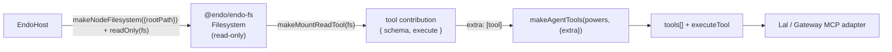

# Agent Tools: `@endo/endo-fs` `Filesystem`-backed Tool Group

| | |
|---|---|
| **Created** | 2026-06-01 |
| **Author** | 0xPatrick (prompted) |
| **Status** | Not Started |

## What is the Problem Being Solved?

[endo-gateway-mcp](endo-gateway-mcp.md) proposes `@endo/agent-tools`, a
provider-independent package that lifts Lal's tool catalog out of
`packages/lal/agent.js` into `makeAgentTools(powers, { extra } = {})`
returning `{ tools, executeTool, processToolCalls }`.
It leaves an explicit seam — the `extra` option — where capability-scoped
filesystem, shell, and git tools plug in "as `Dir` / `Shell` / `Git` come
online".
[daemon-agent-tools](daemon-agent-tools.md) is the conceptual parent for
that capability-tool model; its 2026-05-18 revision routes local
filesystem and git authority through a confined filesystem capability.

Neither design says *how* a capability-filesystem tool group is
constructed, what its `schema` / `execute` records look like, how it
slots into the `extra` array, or what happens when the underlying
filesystem capability is revoked mid-session.
This design fills that gap.
It does **not** re-spec `@endo/agent-tools`; it builds on the package's
`extra` seam and on the `@endo/endo-fs` `Filesystem` capability
(`packages/endo-fs/`), the structural, confined, ocap-shaped filesystem
surface the daemon's local-filesystem authority is converging on.

The mount-backed tool group is designed around least authority. It closes
over a `Filesystem` capability for a single subtree, walks it by
`lookup`, cannot name a path outside that capability, and observes
revocation as a rejected tool call.

## Background

Three pieces of landed and in-flight code frame the design.

**`@endo/endo-fs` `Filesystem` (landed).**
`packages/endo-fs/` exposes a structural, confined filesystem capability.
A `Filesystem` is not a flat path-keyed surface: it has no `readText`.
`E(fs).root()` returns a `Directory`; `E(dir).lookup(name)` returns a
child `Directory` or `File` eref; `E(file).open({ read: true })` returns
an `OpenFile`, whose `read(offset, length)` yields a
`PassableBytesReader` over the requested slice (Uint8Array can't cross
CapTP directly, so bytes arrive base64-streamed). A read therefore *walks*
the tree segment-by-segment rather than naming a whole path in one call.
The package ships porcelain helpers for exactly this: `walk(root, segments)`
chains the per-segment `lookup`s into one pipelined CapTP batch, and
`collectBytes(reader)` drains a `PassableBytesReader` into one `Uint8Array`.
Confinement is structural and enforced at two layers: `Directory.lookup`
rejects the reserved names `.` and `..` (a `..` segment is *not* a parent
traversal — it is an invalid name), and the disk backend's `realpath`
containment check rejects any path — including one reached through a
symlink — whose physical target escapes the filesystem root.
`readOnly(fs)` returns a `Filesystem` whose mutating methods (`create`,
`mkdir`, `unlink`, `setAttrs`, write-mode `open`, …) reject with `EACCES`
while the read path passes through; `chroot(fs, subPath)` presents a
subtree as the new root, so a tool over it cannot name anything above the
subtree. Both attenuations return a `Filesystem` indistinguishable from a
primitive one — a subtree or read-only handle is itself an attenuated
capability.

A daemon-hosted `Filesystem` is constructed over a disk root by
`makeNodeFilesystem({ rootPath })` (or `mountAsFilesystem` over an
`EndoMount`, for callers bridging the legacy mount surface); the daemon
mints and revokes it as a formula like any other capability.

**`@endo/agent-tools` (proposed, not yet landed).**
Per [endo-gateway-mcp](endo-gateway-mcp.md) §"Package shape", the
package exports `makeAgentTools(powers, { extra } = {})`.
`tools` is an array of OpenAI-format tool schemas (`{ type: 'function',
function: { name, description, parameters } }`), `executeTool(name,
args)` is the dispatcher, and `extra` is an array of additional tool
contributions composed in alongside the built-ins.

## Design

### What a mount-backed tool group is

A *tool group* is a function that takes a capability and returns one or
more tool contributions shaped to drop into `makeAgentTools`' `extra`
array.
A single contribution is the same record shape `@endo/agent-tools`
already uses internally and that the existing tool makers use today
(`schema()` returning an OpenAI-format schema, `execute(args)` returning
a result), so no new wire contract is introduced.



The group's `execute` closes over the `Filesystem` capability, not a path
string.
Every read is a walk of eventual-sends — `E(fs).root()`, then a `lookup`
per path segment, then `open` / `read` — assembled by the `@endo/endo-fs`
`walk` / `collectBytes` helpers.
The tool never holds `fs` (the Node module), never resolves an absolute
path, and cannot construct a reference to anything the `Filesystem` does
not already reach.

### Composition into the `extra` seam

`makeAgentTools` composes built-in tools with the `extra` array.
A mount-backed group is one entry (or a small flat set of entries) in
that array:

```js
import { makeMountReadTool } from '@endo/agent-tools/mount-fs.js';
import { readOnly } from '@endo/endo-fs';

const projectFs = await E(powers).lookup('project'); // a Filesystem
const { tools, executeTool } = makeAgentTools(powers, {
  extra: [makeMountReadTool(readOnly(projectFs))],
});
```

The contribution participates in `tools` (its `schema()` is projected
into the catalog) and in `executeTool` (a call with its tool name routes
to its `execute`).
The capability-scoped tools and the built-in namespace / mail tools are
peers in the same flat catalog; the LLM sees one tool list.

Two seam questions [endo-gateway-mcp](endo-gateway-mcp.md) §Open
Questions §1 explicitly left open are answered narrowly here for the
filesystem group and surfaced for the maintainer in Open Questions:

- **Name collisions.** The mount-read tool is named `mountReadText`
  (not `readText`) so it does not collide with Lal's built-in `readText`
  (which reads from the *petname* namespace, a different surface). The
  built-in keeps its name; the capability tool takes a distinct one.
- **Absent capability.** A filesystem-backed group is only added to
  `extra` when the caller already holds the `Filesystem`. There is no
  "always-fail hidden tool" — if no `Filesystem` is granted, the group is
  not in `extra` and the tool does not appear in the catalog (the
  same conditional-registration shape `daemon-agent-tools` §"Agent tool
  discovery" describes).

### The thinnest first slice: `makeMountReadTool`

The first contribution is read-only and single-method: a text-file read
tool with the same top-level contribution shape as the rest of the tool
catalog.

```js
// packages/agent-tools/mount-fs.js
// @ts-check
import { E } from '@endo/far';
import { walk, collectBytes } from '@endo/endo-fs';

const MAX_TEXT_CHARS = 50_000;

/**
 * A read-only filesystem tool bound to an `@endo/endo-fs` `Filesystem`.
 * Reads a single text file by root-relative path. Confinement,
 * symlink-escape rejection, and revocation are the Filesystem's job, not
 * this tool's.
 *
 * @param {import('@endo/far').ERef<{ root: () => Promise<object> }>} fs
 * @returns {{
 *   schema: () => object,
 *   execute: (args: Record<string, unknown>) => Promise<string>,
 *   help: () => string,
 * }}
 */
export const makeMountReadTool = fs => {
  const schema = harden({
    type: 'function',
    function: {
      name: 'mountReadText',
      description:
        'Read a UTF-8 text file from the mounted project directory. ' +
        'Path is relative to the mount root; "../" escapes are rejected.',
      parameters: {
        type: 'object',
        properties: {
          path: {
            type: 'string',
            description: 'Mount-relative path to the file to read.',
          },
        },
        required: ['path'],
      },
    },
  });
  return harden({
    schema: () => schema,
    async execute(args) {
      const { path } = /** @type {{ path: string }} */ (args);
      if (!path) {
        throw new Error('path is required');
      }
      // One lookup per path segment; '.' steps are dropped, and a '..'
      // segment is rejected by Directory.lookup (reserved name).
      const segments = path
        .split('/')
        .map(segment => segment || '.')
        .filter(segment => segment !== '.');
      const root = await E(fs).root();
      const file = await walk(root, segments);
      const openFile = await E(file).open({ read: true });
      const bytes = await collectBytes(await E(openFile).read(0n));
      const content = new TextDecoder().decode(bytes);
      if (content.length > MAX_TEXT_CHARS) {
        return `${content.slice(0, MAX_TEXT_CHARS)}\n\n... (truncated, ${content.length} chars total)`;
      }
      return content;
    },
    help: () =>
      'Read a text file from the mounted project directory (read-only).',
  });
};
harden(makeMountReadTool);
```

What it needs that **already ships**: the `@endo/endo-fs` `Filesystem`
surface (`root` / `lookup` / `open` / `read`) and the `walk` /
`collectBytes` porcelain, plus the `readOnly` / `chroot` attenuators, all
live in `packages/endo-fs/`. The confinement (the backend's `realpath`
containment check, following symlinks) and the `..`-segment rejection
(`Directory.lookup`'s reserved-name validator) are enforced inside the
`Filesystem` exos, so the tool carries *no* path-safety logic of its
own.
What it needs that does **not** yet ship: `@endo/agent-tools` itself
(its Phase-1 extraction) and the post-#290 tool seam (below).

The truncation cap keeps large reads bounded at 50 000 chars.

### Attenuation model

Authority on a filesystem tool is shaped by attenuating the *`Filesystem`*
handed to the maker, never by the tool gating itself:

- **Read-only.** Pass `readOnly(fs)`. The returned `Filesystem` passes
  reads through but rejects every mutating method (`create`, `mkdir`,
  `unlink`, `setAttrs`, write-mode `open`, …) with `EACCES`. The tool's
  read walk (`root` → `lookup` → `open({ read: true })` → `read`) is
  entirely on the read path, so it works unchanged over the read-only
  view; a write attempted through the same handle fails closed.
- **Subtree scoping.** Pass `chroot(fs, subPath)` to hand the tool a
  `Filesystem` whose root *is* the named subtree. A tool over it resolves
  every path relative to the subtree and cannot name anything above it —
  a path that walks off the top is an `ENOENT`, not an escape.
- **Destructive-op gating.** Write / move / remove tools are deferred
  past the first slice. When they land they are *separate* makers
  (`makeMountWriteTool`, etc.) added to `extra` only when a writable
  `Filesystem` is granted; a read-only deployment does not include
  them. Gating is by which makers the caller composes, not by a runtime
  flag inside a single omnibus tool. This keeps the authority of the tool
  set legible from the `extra` array alone.

### Revocation: fail closed, no restart

A `Filesystem` is a daemon formula. When the formula is cancelled
(`E(host).cancel(petName)`) or garbage-collected (the `Filesystem`
becomes unreachable from any retained formula), the daemon tears down the
exo. The tool holds an `ERef` to that exo, so the *next* `E(fs).root()`
(or any deeper send in the walk) after revocation rejects — the
eventual-send resolves to a rejection because the target no longer
resolves.

Three operational properties follow:

1. **No process filesystem fallback.** The tool does not retain the
   Node `fs` module or a host-path string. A revoked filesystem tool
   cannot perform a read through another path; the call rejects.
2. **No restart needed.** Revocation is observed at call time as a
   rejected promise; the agent loop sees a failed tool call and reports
   it like any other error. The harness does not need to be restarted to
   drop the authority.
3. **Stale handles do not re-acquire authority.** Because the tool
   closes over the capability reference (not a path), a re-minted
   `Filesystem` at the same path under a new formula id is a *different*
   capability; the old tool's reference does not silently start working
   again. Re-granting is an explicit re-composition of `extra` with the
   new `Filesystem`.

The tool maker itself does nothing special for revocation — it neither
catches nor retries. Failing closed is the default behavior of an
eventual-send to a revoked target; the maker does not cache reads or
hold a host-path string alongside the capability.

### Package placement

The mount-fs group lives in `@endo/agent-tools` as a sibling module to
the built-in catalog, since it is the canonical first `extra`
contribution and the package is the agreed home for the tool-catalog
shape:

```
packages/agent-tools/
  mount-fs.js        # makeMountReadTool (this design); write/list/stat siblings later
  test/
    mount-fs.test.js
```

It depends on `@endo/far` (`E`) and `@endo/endo-fs` (the `walk` /
`collectBytes` porcelain and, for callers, the `readOnly` / `chroot`
attenuators); it is handed a `Filesystem` capability reference at call
time and does not import `packages/daemon`, keeping `@endo/agent-tools`
free of a daemon dependency, consistent with the package's
provider-independent intent.

## Test plan

`packages/agent-tools/test/mount-fs.test.js`. The `Filesystem` under test
is a real `makeNodeFilesystem({ rootPath })` over a `mkdtemp` directory
(teardown registered per the project AVA conventions), attenuated with
`readOnly` (and `chroot` for the subtree analog), so the tests exercise
the actual confinement and revocation behavior, not a stub.

1. **Happy path.** Build a temp-dir `Filesystem` containing `a.txt`;
   assert `execute({ path: 'a.txt' })` returns its contents, a
   subdirectory file by relative path, an empty file as the empty string,
   and the >50 000-char truncation branch on a large file. A `chroot`
   case asserts a subtree-scoped read works and that a path above the
   subtree is `ENOENT`.
2. **Structural out-of-root access failure.** Assert
   `t.throwsAsync(() => execute({ path: '../secret' }), { message:
   /reserved|EINVAL|ENOENT/ })` — the `..` segment is rejected by
   `Directory.lookup` (reserved name), not by the tool. Add a symlink
   inside the root pointing outside it and assert reading through it
   rejects (`/escapes filesystem root|EACCES|ENOENT/`), proving the guard
   is the backend's `realpath` containment check rather than tool-local
   path string handling.
3. **Revoke-then-call fails closed.** Construct the tool over a
   `Filesystem`, confirm one successful read, then revoke it (cancel its
   formula in a daemon-backed test, or in a unit test wrap it in a
   forwarder whose `root()` rejects once revoked) and assert the next
   `execute` rejects rather than returning stale content. Assert the
   rejection is not satisfied through cached content or a process
   filesystem fallback.
4. **`extra`-seam integration.** Once `@endo/agent-tools` Phase 1 is
   landed: assert `makeAgentTools(powers, { extra: [makeMountReadTool(
   mount)] })` surfaces `mountReadText` in `tools` and that
   `executeTool('mountReadText', { path })` routes to the group's
   `execute`. This test is gated on Phase 1 and may land with the
   integration, not the first slice.

## Sequencing and dependencies

This work has two hard predecessors, stated plainly:

1. **#290 must merge first.** PR #290 (`feat/lal-pi-harness`) swaps Lal's
   harness for `@endo/genie`'s pi-based one while preserving the tool
   surface by name and cleanly separating the LLM loop from the tools.
   Until it lands, Lal's tool catalog and `executeTool` switch are still
   entangled with the pre-pi harness in `packages/lal/agent.js`. Building
   the `extra`-seam consumer against the pre-#290 file would mean writing
   against a tool seam that #290 reshapes. The mount-fs maker itself does
   not import Lal, so it can be *written* independently, but its
   integration test (test 4) and the Lal-side composition example assume
   the post-#290 separated seam.

2. **`@endo/agent-tools` Phase 1 must land.** Per
   [endo-gateway-mcp](endo-gateway-mcp.md) §"Phase 1: extract
   `@endo/agent-tools`", the tool catalog, SmallCaps decoder,
   `executeTool`, and `processToolCalls` move out of `packages/lal/agent.js`
   into the new package, and `makeAgentTools(powers, { extra })` becomes
   the construction point. The `extra` array is the slot this group
   plugs into; without it there is no seam to target. Phase 1 is the
   refactor; this design is the first thing that uses the seam Phase 1
   opens.

Ordering: **#290 → `@endo/agent-tools` Phase 1 → this design's
`makeMountReadTool`**. The maker module and its unit tests (tests 1–3)
can be drafted in parallel with Phase 1 because they depend only on the
landed `@endo/endo-fs` `Filesystem`; the integration test (test 4) and
the catalog wiring wait for Phase 1.

The capability itself (`@endo/endo-fs`, `makeNodeFilesystem`,
`readOnly` / `chroot`) is **already landed** and is not a blocker.

## Dependencies

| Design | Relationship |
|--------|--------------|
| [endo-gateway-mcp](endo-gateway-mcp.md) | Defines `@endo/agent-tools` and the `extra` seam this group plugs into. This design does not re-spec the package; it fills the "compose via `extra`" gap that design's Open Questions §1 leaves open for filesystem tools. |
| [daemon-agent-tools](daemon-agent-tools.md) | Conceptual parent: the `Dir` / `Shell` / `Git` capability-tool model. Its 2026-05-18 revision routes fs authority through a confined filesystem capability; this design is the concrete first realization (Phase 1, filesystem, read slice) of that revised model over the `@endo/endo-fs` `Filesystem`. |
| [daemon-mount-capabilities](daemon-mount-capabilities.md) | The legacy `EndoMount` capability and the `Filesystem` it bridges to via `mountAsFilesystem`. This group binds the `@endo/endo-fs` `Filesystem` surface directly; it deliberately uses no host-path accessor — the tool holds the capability, not a path. |

## Design Decisions

1. **The tool holds a capability, not a path.** `execute` closes over a
   `Filesystem` `ERef` and does every read as a walk of `E(...)`
   eventual-sends (`root` → per-segment `lookup` → `open` → `read`). This
   delegates confinement, symlink-escape rejection, and revocation
   behavior to the filesystem capability.

2. **Attenuate the `Filesystem`, not the tool.** Read-only and subtree
   scoping are expressed by handing the maker an already-attenuated
   `Filesystem` (`readOnly(fs)`, `chroot(fs, subPath)`), and destructive
   operations are separate makers added to `extra` conditionally. The
   authority of a tool set is legible from its `extra` array; there is no
   per-tool runtime flag to audit.

3. **Distinct tool name to avoid collision.** `mountReadText` does not
   shadow Lal's built-in `readText` (which reads the petname namespace).
   This is the narrow, filesystem-group answer to the name-collision
   open question [endo-gateway-mcp](endo-gateway-mcp.md) §Open Questions
   §1 deferred.

4. **Read-only first slice.** The first contribution is one read method
   that exercises the `extra` seam and the filesystem capability's
   confinement/revocation behavior before any destructive operation is
   exposed. Considered and rejected: shipping a full `Dir` tool group
   (read + write + list + stat + glob) in one slice. Reason: the
   read-only slice is enough to review text-read composition end to end,
   and write/move/remove each carry
   their own destructive-op gating decisions better made once the read
   slice is in review.

5. **No daemon dependency in `@endo/agent-tools`.** The maker imports
   only `@endo/far` and the `@endo/endo-fs` porcelain (`walk` /
   `collectBytes`) and is handed the `Filesystem` capability at call
   time, so the package stays provider- and daemon-independent, matching
   the package's stated intent.

## Open Questions

1. **Does the read walk go through `OpenFile.read` or `File.snapshot`?**
   The slice binds to the `@endo/endo-fs` `Filesystem`, walking
   `root` → `lookup` → `open({ read: true })` → `read(0n)` and draining
   the reader with `collectBytes`. An alternative one-call read is
   `File.snapshot()`, which returns a `BlobRef` over the whole file's
   bytes — fewer sends for a small file, but it materializes the entire
   file server-side before fetch and carries blob semantics this read
   tool does not need. The design uses the `open` / `read` walk (the same
   path the `@endo/endo-fs` read tests exercise); the maintainer can
   route the slice to `snapshot` if the blob path proves cheaper for the
   expected file sizes.

2. **Where does the granted `Filesystem` come from in the Lal
   integration — a fixed petname (e.g. `project`) the host grants, or the
   form-based provisioning of
   [daemon-agent-tools](daemon-agent-tools.md) §"Form-based capability
   provisioning"?** This design assumes the caller already holds the
   `Filesystem` and is concerned only with turning it into a tool; the
   grant mechanism (petname lookup vs. provisioning form) is a separate
   integration decision the maintainer can route to the agent-tools
   integration PR.
