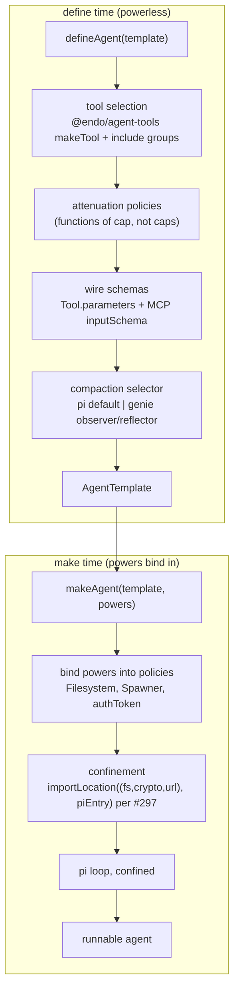

# `@endo/agentry`: the `defineAgent` agent-builder

| | |
|---|---|
| **Created** | 2026-06-03 |
| **Updated** | 2026-06-25 |
| **Author** | 0xpatrickdev (prompted) |
| **Status** | Not Started |

## What is the Problem Being Solved?

The repository's five agent-tool surfaces (fae, lal-on-`llm`, lal as
proposed for the eval harness, genie, and the pi-agent-core `AgentTool`
contract) each hand-assemble their own harness: each selects a tool set,
hard-codes an attenuation policy, binds a provider loop, and decides how
the model learns each tool's shape.
No two do it the same way, and the wiring is buried in each harness's
`agent.js` rather than expressed as configuration.

The maintainer's goal is to take the best of each harness and make agent
**builders** in `agentry`, so each harness can still customize as it
pleases (tool discovery, tool selection, system and steering prompts) and
current lal, fae, and genie can be recreated from the package.
The sharpened goal: **`defineAgent` lets someone build their own lal.**
`@endo/agentry` is not a single fixed harness; it is the agent builder an
operator reaches for to assemble a coding agent of their own shape.
The **dogfood** that proves the builder is rich enough is reconstructing
**lal itself** from it: if `defineAgent` can rebuild lal, it can build
anyone's lal, so the lal reconstruction is the design's own acceptance
test.

The sibling [endo-agent-tools](endo-agent-tools.md) specifies the tool
half (the method-guard `makeTool` record, the `Filesystem`-targeted file
tools, the wire-schema contract).
This design specifies the consuming half: a declarative `defineAgent`
builder whose configuration surface is wide enough that lal and genie each
`defineAgent(...)` into their existing behavior rather than
hand-assembling a harness.

## `defineAgent` (powerless template) vs `makeAgent` (instance with powers)

The builder splits into two surfaces by the exo `define*` / `make*`
convention ([exo-taxonomy](https://github.com/endojs/endo/blob/master/packages/exo/docs/exo-taxonomy.md)):
every `define*` describes what all instances of a category share and
returns a maker; every `make*` binds an instance to its specific state.

| Call | Returns | Holds | Carries no |
|---|---|---|---|
| `defineAgent(template)` | `AgentTemplate` (powerless) | tool method guards, derived wire schemas, attenuation **policies** as functions-of-cap, prompts, compaction selector, `prepareArguments` pipeline, the pi entry point | caps (no `Filesystem`, no `Spawner`, no `authToken`, no confinement powers) |
| `makeAgent(template, powers)` | runnable agent | the template **plus** the granted powers: the cap-backed `Filesystem`, the `Spawner`, the provider `authToken`, the `(fs, crypto, url)` read powers the loop loads pi through, and per-instance overrides | (nothing: this is the powerful surface) |

So `defineAgent` is agent *definition*: a powerless template safe to
share, persist, and re-instantiate.
`makeAgent` is agent *creation*: it empowers that template into a runnable
instance for one operator, one workspace, one provider key.
A template can be `make`-d many times without re-deriving wire schemas,
because everything that does not depend on powers is fixed at define time.

`defineAgent` is where the wire schema becomes real **at define time**, so
the schema does not depend on which `Filesystem` cap an instance will
hold.
Today genie and the eval-harness lal author matchers for runtime
validation but punt the wire schema to
`{ type: 'object', additionalProperties: true }`, so the model never sees
the contract the harness enforces.
The builder closes that punt at define time, and the derivation never has
to re-run at instantiation.
`makeAgent` is where the powers arrive: the granted `Filesystem` is
threaded into the file tools through the attenuation policies, the
`Spawner` into the command tools, the `authToken` into the provider, and
the `(fs, crypto, url)` powers into the call that confines the pi loop.

## Background

**`@endo/agentry` already exists as the optimizer and eval package.**
PR #308 ships `@endo/agentry` carrying `src/optimizer/*` and the narrow
`coerceBigintArgs` bigint coercion that replaced lal-on-`llm`'s full
SmallCaps marshal.
This design **grows** that package with a new `defineAgent` module; it
does not create a new package.
The synergy is direct: the builder's agents are exactly what the optimizer
and eval harness exercise (see *Relationship to the eval and optimizer
package* below).

**The pi harness contract** (verified against `@earendil-works/pi-ai`
v0.78.0).
The project was renamed from `@mariozechner/pi-ai` to
`@earendil-works/pi-ai` plus `@earendil-works/pi-agent-core`.
`@endo/agentry` targets the latest from the start; migrating genie off the
stale `@mariozechner/pi-ai@^0.73.1` pin is a separate PR.
The contract the builder binds to:

```ts
// @earendil-works/pi-ai
Tool<TParameters extends TSchema = TSchema> = {
  name: string;
  description: string;
  parameters: TSchema;     // TSchema = TypeBox = JSON Schema
};

// @earendil-works/pi-agent-core
AgentTool extends Tool = {
  label: string;
  prepareArguments?(args: unknown): Static<TParameters>;
  execute(toolCallId, params, signal?, onUpdate?): Promise<AgentToolResult>;
  // per-tool queue mode
};
AgentToolResult = { content: (Text | Image)[]; details; terminate? };
```

The builder produces `AgentTool` records in two phases.
`defineAgent` fills `parameters` from the schema (at define time) and
stages the `prepareArguments` pipeline on the recipe; `makeAgent` closes
each tool's `execute` over the granted powers and binds the record to the
confined pi loop.

## Interaction mode: code mode is primary

The **primary interaction mode is code mode**: the agent drives the
workspace through a single `execute(js)` that runs in a confined
`Compartment` over a set of petname-bound endowments, not through a wide
fan of discrete function-call tools.
The builder is **not** aiming to export the agent across a CLI, an SDK,
and a web endpoint as rival interaction modes; that multi-interface export
framing is out of scope.

Discrete `arg0`-style tools (the method-guard `makeTool` records the
sibling design specifies) are **still kept** as a *distinct second mode*:
the surface an MCP client consumes and the fallback for a model that
cannot or should not write code.
This is a different concern from the multi-interface export idea above.
Both modes resolve caps through the one guest petstore at different
granularities (per-session for code mode, per-call for discrete tools; see
[endo-agent-tools](endo-agent-tools.md) § Capability arguments are
petnames).

## What `defineAgent` and `makeAgent` compose

The pipeline runs in two phases, separated at the moment powers arrive.



1. **The loop is the pi loop, confined by construction** *(make time)*.
   There is no `harness` abstraction: the only loop is
   `@earendil-works/pi-agent-core`, so the builder binds it directly.
   What the builder adds is confinement.
   Per [PR #297](https://github.com/endojs/endo-but-for-bots/pull/297)
   `makeAgent` loads the pi loop into a fresh Endo `Compartment` via
   `importLocation(makeReadPowers({ fs, crypto, url }), piEntry,
   { globals })`, not via a top-level `import` into the surrounding worker
   realm, so the loop runs confined rather than unconfined (the bar
   `packages/genie/test/pi-confined-compat.test.js` pins).
   `defineAgent` carries the pi entry point and the compartment-mapper
   plumbing as a recipe; `makeAgent` supplies the powers and runs
   `importLocation`.

2. **Tool selection, at define time, from method guards alone**
   *(method guards are powerless)*.
   `@endo/agent-tools` tools are chosen by **include groups** lifted from
   genie's registry (for example `['files', 'git', 'memory']`).
   The selected tools are stored in the template by their method guards and
   their behavior thunks-of-cap; the caps arrive at `makeAgent`.

3. **Attenuation policies, declared at define time, applied at make time.**
   Each policy in the template is a **function-of-cap**; `makeAgent`
   applies it to the granted power:
   read-only is `fs => readOnly(fs)`; subtree is
   `(fs, path) => fs.subroot(path)`; git-only is a command tool with a
   network-git policy closure; exec is a command tool with
   `rejectPatterns(DANGEROUS_PATTERNS)` whose `Spawner` routes through a
   sandbox slice at make time.

4. **Wire schemas, at define time, once per template.**
   `defineAgent` fills each selected tool's `Tool.parameters` (TypeBox
   `TSchema`) and MCP `inputSchema`.
   This is the one thing no current surface does: closing the
   `additionalProperties: true` punt so the model sees the enforced
   contract.
   The schemas sit in the template; `makeAgent` does not re-derive per
   instance.

5. **Compaction, a config option, not a harness.**
   pi-agent-core has its own default transcript compaction; genie layers an
   **observer / reflector** pair on top, its one real loop-shaping
   deviation from a bare pi loop.
   This is a `compaction` config option (`'pi-default'` |
   `'genie-observer-reflector'` | a custom compactor record), not a
   selectable harness.
   The `compaction` name is provisional: a more generic "mixins" framing
   (one axis admitting any loop-shaping hook) is a future consideration,
   kept as `compaction` for now to avoid churning a rename.

6. **Builder-exported presets per package.**
   The harnesses are reconstructed from `defineAgent` plus `makeAgent`,
   each in its own package.
   `lal` and `genie` each export a `define(Lal|Genie)Agent` that wraps
   `defineAgent` with that harness's defaults (a powerless template) **and**
   a `make(Lal|Genie)Agent(template, powers)` that wraps `makeAgent` with
   its instantiation conventions.
   `defineFaeAgent` is **deprioritized out of the first pass**: the
   foreseeable path is not basing fae on pi (fae keeps its own loop; see
   *fae vs pi* below).
   `@endo/agentry` ships `defineAgent` / `makeAgent` and the building
   blocks but no preset bundles; `familiar` (or the #404 wizard) names the
   presets when it offers them to an operator.

## Mapping pi's session tree to the daemon mail model

Once `makeAgent` composes a pi loop (and lal already drives one since
the pi harness merged in
[#290](https://github.com/endojs/endo-but-for-bots/pull/290)), two
encodings of conversation history coexist in one stack: pi's session
tree is the agent's working memory, and the daemon mail model is the
delivery and persistence layer.
They map cleanly today, but nothing pinned the correspondence, so they
could drift as the harness lands.
This design pins it.

| pi session tree | daemon mail model | the correspondence |
|---|---|---|
| `parentId` | `replyTo` (`packages/daemon/src/mail.js`) | the sole branch axis |
| active leaf | a message's latest revision: `done: true` is settled, the last entry of `revisionsByNumber.get(messageNumber)` is the current envelope | which node is live |
| `/fork`, `/clone` | `reply(messageNumber, ...)`, producing a sibling subtree, never `editMessage` | how a branch grows |

The reply-to tree carried `messageId` / `replyTo` from the start, and
the conversation-tree adapter (`packages/conversation-tree`) already
bridges daemon `replyTo` to a tree node's `parentId`.
What [#125](https://github.com/endojs/endo-but-for-bots/pull/125) added
(`editMessage`, `messageHistory`, and the `done` flag, stored per
message number in `revisionsByNumber`) is a *second, orthogonal* history
axis: linear, per-message-number, layered on top of the reply-to tree.
Nothing in the harness reconciled which revision was current when a
reply branched off a node, which is exactly where the two axes could
drift.

**Invariant (the harness pins it).**
The reply-to tree is the sole branch axis; the per-message revision log
is strictly intra-node and never forks.
`editMessage` settles a node in place (a streamed completion, an
amendment): it keeps the message number, the `replyTo` linkage, and the
dismissal state, and only appends a revision to `revisionsByNumber`.
`reply` grows the tree (an alternative continuation, or the pi `/tree`
edit-a-user-message case): it produces a sibling subtree under the
chosen parent.
A pi `/fork` or `/clone` is therefore always a `reply`, never an
`editMessage`; a model amending its own streamed output is always an
`editMessage`, never a `reply`.
The corresponding UI decision (branch a user's edit rather than
overwrite it) is tracked on #305.

## The `defineAgent` and `makeAgent` shapes

```ts
// 1. define time: powerless template.
const lalTemplate = defineAgent({
  provider: { source, model },            // forwarded to pi's provider abstraction
  tools: selectTools({
    from: agentTools,                     // @endo/agent-tools
    include: ['files', 'git', 'memory'],
    attenuate: {
      files: { readOnly: true },          // policy: fs => readOnly(fs)
      git:   { policies: [noNetworkGit] },
      exec:  { rejectPatterns: DANGEROUS_PATTERNS },
    },
  }),
  wire: deriveWireSchemas(tools, descriptions),  // Tool.parameters + MCP inputSchema, once
  prepareArguments: 'agentry/smallcaps',         // the symmetric SmallCaps decode pass
  compaction: 'pi-default',                       // | 'genie-observer-reflector' | <record>
  prompts: { system, steering },
  discovery: 'static',                            // | 'petname-dir' (future)
});

// 2. make time: instantiate against an operator's powers. The same
//    template can be `make`d many times without re-running the schemas.
const agent = makeAgent(lalTemplate, {
  workspace: workspaceFilesystemCap,      // applied through files.readOnly
  spawner:   sandboxSpawner,              // applied through git.policies / exec
  provider:  { authToken },               // threaded into the provider
  confine:   { fs, crypto, url },         // makeReadPowers; used by importLocation
});
await agent.run({ task });
```

There is no `preset` field on `defineAgent` and no `harness` field (the
loop is always the confined pi loop).
Each harness package exports two wrappers (one per phase) so the harness's
name covers both define and make.
`familiar` calls `define<Name>Agent` once at module load to produce the
template, then `make<Name>Agent(template, powers)` per instance.

## The SmallCaps wire contract

SmallCaps (`@endo/marshal`'s wire format) is a **Hilbert Hotel encoding
over the full space of string values**: any JSON string position is a
literal string when its first character lies outside the reserved sigil
range, or a tagged value when the first character is a sigil (`!` escape,
`+` / `-` bigint, `#` constant or tag, `%` symbol, `$` remotable, `&`
promise).
A literal string whose first character would collide with the reserved
range is escaped on encode by prefixing `!`, and the `!` is consumed on
decode.

The contract this design honors is therefore **symmetric and broader than
bigints alone**, with the wire-shape naming in `@endo/agent-tools` and
`prepareArguments` here as the two halves:

| Direction | What it does |
|---|---|
| **encode** (tool result outbound) | A bigint is named `{ type: 'string', pattern: '^[+-]?\\d+$' }`, never `{ type: 'integer' }`. A plain string whose first character is in the reserved range is escaped by prefixing `!` (a phone-number literal `"+15551234567"` goes over as `"!+15551234567"`). The description tells the model to emit values in this form. |
| **decode** (model-emitted call inbound, before `mustMatch`) | `coerceBigintArgs` coerces a `^[+-]?\d+$` string into a `BigInt` (narrow: only declared `bigintArgs` fields); `unescapeHilbertHotel` drops a leading `!` whose second character is in the reserved range; the LLM-JSON fixups (null to undefined, one JSON-string-parse retry) run in the same pass. |

The bigint half closes the JSON-number ambiguity the review flagged: the
full SmallCaps marshal would silently reinterpret any LLM string with a
SmallCaps prefix, so `coerceBigintArgs` decodes only declared bigint
fields and copies everything else verbatim.
The un-escape half closes the remainder of the type-introducer ambiguity
for any plain-string field whose value happens to start with a sigil.
Neither half stands alone.
The detailed wire-shape contract lives in
[endo-agent-tools](endo-agent-tools.md) § Wire schemas; this design
references it.

### Code-mode result rendering uses the real SmallCaps marshaller

The decode contract above is the inbound (model to args) half.
The outbound half (rendering a code-mode `execute` result back to the
model) uses lal's **real SmallCaps marshaller** for plain-data results,
not `JSON.stringify`.
lal already constructs one: `packages/lal/agent.js` builds a
`makeMarshal(undefined, undefined, { serializeBodyFormat: 'smallcaps' })`
and uses its `serialize` / `unserialize` for tool-call data.
The same marshaller round-trips bigints, `undefined`, symbols, and
reserved-range strings through the Hilbert-Hotel encoding the inbound
`prepareArguments` decodes, so a result the model reads back is in the same
encoding the model emits.
`JSON.stringify` cannot: it throws on a bigint and mangles the
reserved-range and `undefined` cases, re-opening on the display side the
ambiguity the inbound contract closes on the args side.
Live caps in a result are *named* (a petname via `storeValue`), not
marshalled.

## The deriver call site (at define time)

For each selected tool, at define time, `defineAgent` records a partial
`AgentTool` recipe in the template (everything that does not depend on
powers) and stores the `execute` thunk that closes over the powers
`makeAgent` will supply.

```ts
// inside defineAgent: once per template per selected tool.
const agentToolRecipe = {
  name: tool.name,
  label: tool.name,
  description: tool.summary,
  parameters: tool.parameters,          // the wire schema: TypeBox TSchema = MCP inputSchema
  prepareArguments(args) {              // the symmetric SmallCaps decode, before mustMatch
    const a = coerceBigintArgs(args, tool.bigintArgs);
    const b = unescapeHilbertHotel(a, tool.stringArgs);
    return fixupLlmJson(b);
  },
  execute: powersBoundExecute(tool, /* makeAgent fills in: */ undefined),
};
// inside makeAgent: closes execute over the granted Filesystem, Spawner, ...
const agentTool = { ...agentToolRecipe, execute: powersBoundExecute(tool, powers) };
```

`parameters` is both wire targets at once (the TypeBox `TSchema` pi sends
the provider and the MCP `inputSchema` an MCP client renders).
`prepareArguments` is the home for the full inbound decode, which
pi-agent-core runs before `execute` so the decode lands before `mustMatch`
ever sees the args.

## fae vs pi: tool model divergence

fae and the pi loop differ on **how the tool set is allowed to change
during a conversation**, which is why **fae is not based on pi in the first
pass**.

1. **fae mutates its tool set live; pi's is a fixed harness.**
   fae rebuilds the full schema array from its `tools/` petstore dir on
   every message and swaps `currentSchemas` mid-conversation on a live
   `adoptTool`.
   The pi loop builds a fixed `AgentTool[]` at construction and never
   mutates it.

2. **fae's live adoption busts the cached prompt prefix.**
   The lal providers serialize the tools block with no `cache_control`, so
   every mid-conversation swap invalidates the cached prefix for the rest
   of the conversation.

3. **pi has no dynamic-tool-add path at all.**
   Reconstructing fae on pi would mean either adding such a mutate path
   (re-importing the cache penalty) or accepting a static set, which is not
   fae.

4. **`adoptableTools` is the cache-friendly forward path.**
   Adoption in fae grants an *already-existing* capability whose interface
   exists before adoption.
   Declaring the **adoptable set at define time** lets the schemas sit
   latent in the prefix from turn 1, so adoption flips a tool from
   advertised-but-ungranted to granted **without mutating the tools array**
   and the cached prefix stays intact.
   This covers progressive adoption of capabilities known at build time.
   It does **not** cover a capability another agent mails in at runtime
   that was never declared; that fully-novel case still needs the mutate
   path or a separate escape hatch (Open Question 2).

**Decision.** First pass reconstructs lal and genie; fae keeps its own
loop and `defineFaeAgent` is deprioritized.

## Relationship to the eval and optimizer package, and where this design stops

`defineAgent` is a new module in the same package PR #308 introduced, and
the builder's agents are what that package's eval and optimizer halves
exercise.
The eval harness can construct many agent variants (different attenuation,
different descriptions, different prompts) from config without
hand-writing a harness per variant, and the descriptions the schemas fold
in are exactly what the optimizer perturbs.

The forward edge this design names and stops at is the **eval-vs-optimize**
distinction, drawn by the git code-mode eval harness
(`packages/agentry/src/eval/README.md`):

- **Eval** measures a *fixed* agent by **outcome assertion**: run a
  scenario, then judge pass or fail by reading the repository's actual
  final state through the live `git` capability and checking it against the
  target.
  It answers "did it work?" for one model and one prompt, needs no
  in-compartment instrumentation (a code-mode agent's only tool is
  `execute`, so the pi-agent trace sees one opaque call, not the individual
  git operations), and accepts any alternate-but-correct path.
  Eval **ships first**.
- **Optimize** searches for a *better* agent: GEPA or `ax`-style
  prompt-tuning loops that mutate the system prompt and select on a score.
  It answers "what prompt works best?", consumes an eval as its objective,
  and is **deferred**.

This is the line the builder is built up to: `defineAgent` produces the
fixed agent an eval measures, and an optimizer (later) searches the space
of templates with an eval as its objective.
Everything past that line (the prompt-search loop) is out of scope here.

## Connection to #404 and #370

The #404 agent-creation wizard's three panes map onto the template and the
powers: Pane 1 picks which harness's *template* is in play, Pane 2 supplies
the provider *power* (authToken), Pane 3 supplies the endowment *powers*
(workspace `Filesystem`, sandbox `Spawner`).
The wizard holds the per-harness template from module load and its
**Submit drives `makeAgent`**, not `defineAgent`.
Because the schemas live in the template, the wizard can preview the exact
tool schemas the agent will see before Submit, without empowering any caps.

For #370, the version-controlled-filesystem loop, the substrate already
reads the live worktree and history through the same `Filesystem` surface.
The builder wires that substrate into a harness: a read-only-history agent
is `makeAgent(template, { workspace: Git.filesystemAt(ref) })` with the
template's `files.readOnly` policy; a live-worktree editing agent is
`makeAgent(template, { workspace: mountAsFilesystem(mount) })` without it.
The same file tools, the same template, a different cap.

## Design Decisions

1. **`defineAgent` is a declarative builder, not a per-harness `agent.js`.**
   Tool selection, attenuation policies, wire-derivation, and the recipe
   for loop-binding are config, not hand-assembled wiring.

2. **`defineAgent` is the powerless template; `makeAgent` is the powerful
   instantiation.**
   Following the exo `define*` / `make*` factorization.
   The template carries only what all instances share and no powers;
   `makeAgent(template, powers)` binds one operator's powers.
   One template makes many instances cheaply.

3. **The builder is where the wire schema becomes real.**
   `defineAgent` fills `Tool.parameters` and MCP `inputSchema` at define
   time, closing the `additionalProperties: true` punt; the schemas are
   baked into the template, not re-derived at make time.

4. **`prepareArguments` hosts the symmetric SmallCaps decode plus LLM-JSON
   fixups.**
   SmallCaps is a Hilbert Hotel over all string values, so the wire
   contract has symmetric halves: the schema names the wire shape
   (string-encoded bigint plus escape on outbound collisions) and
   `prepareArguments` runs `coerceBigintArgs` plus `unescapeHilbertHotel`
   plus the fixups.
   Neither half stands alone.

5. **A new module in the #308 package, not a new package.**
   `@endo/agentry` already exists as the optimizer and eval package;
   `defineAgent` plus `makeAgent` grow it.

6. **Each harness exports its own `define<Name>Agent` / `make<Name>Agent`
   pair.**
   lal and genie are reconstructed from the builder in the first pass;
   `@endo/agentry` ships no preset bundles; `familiar` names the presets.
   `defineFaeAgent` is deferred (Design Decision 10).

7. **Attenuation policies declared here; primitives in `agent-tools`;
   applied to caps in `makeAgent`.**

8. **No `harness` abstraction; the genie loop is the `compaction` option.**
   One loop (the confined pi loop), so no `harness` enum; genie's
   observer/reflector pair is a `compaction` config option.

9. **The pi loop is confined by construction (per #297), at make time.**
   `makeAgent` loads pi into a fresh Endo `Compartment` via
   `importLocation` using the `(fs, crypto, url)` powers supplied at
   instantiation, so the loop runs confined, not unconfined.

10. **fae is not based on pi in the first pass; `defineFaeAgent` is
    deprioritized.**
    fae keeps its own loop because of the fae-vs-pi tool-model divergence.
    The cache-friendly `adoptableTools` build-time latent set is the
    forward path for progressive adoption when fae-on-pi is revisited; the
    fully-novel mailed-in-runtime case stays open (Open Question 2).

11. **`AgentToolResult.terminate` and per-tool queue mode are config.**
    A tool may request loop termination via `terminate?` and declare its
    queue mode, referencing pi's exact types, rather than being left at pi
    defaults.

12. **The reply-to tree is the sole branch axis; the per-message revision
    log never forks.**
    pi's session tree and the daemon mail model are two encodings of one
    conversation history, so the harness pins `parentId` to `replyTo` as
    the only branch axis.
    `reply` grows the tree (pi `/fork` / `/clone`); `editMessage` settles
    a node in place (the #125 `revisionsByNumber` log), strictly
    intra-node.
    See § Mapping pi's session tree to the daemon mail model.

## Dependencies

| Design | Relationship |
|--------|--------------|
| [endo-agent-tools](endo-agent-tools.md) | **Consumed.** Sibling. `defineAgent` selects its `makeTool` tools, uses its wire schemas, attenuates with its primitives, and runs its `coerceBigintArgs` (re-exported from `@endo/agentry/smallcaps`) via `prepareArguments`. |
| [PR #297](https://github.com/endojs/endo-but-for-bots/pull/297) | **Confinement enabler.** Fixes the module-resolution bugs that prevented pi from loading through `@endo/compartment-mapper`'s `importLocation`, so `makeAgent` loads pi into a confined Endo `Compartment`. |
| [PR #290](https://github.com/endojs/endo-but-for-bots/pull/290) | **The merged pi harness.** lal's loop now drives `@earendil-works/pi-agent-core`; `makeAgent` composes the same loop. The session-tree to mail mapping pins their correspondence (§ Mapping pi's session tree to the daemon mail model). |
| [PR #125](https://github.com/endojs/endo-but-for-bots/pull/125) | **The revision-log axis.** Added `editMessage` / `messageHistory` / `done` (`revisionsByNumber` in `packages/daemon/src/mail.js`), the intra-node history axis the mapping invariant keeps from forking. |
| [endo-gateway-mcp](endo-gateway-mcp.md) | The Gateway's MCP termination forwards the MCP `inputSchema` the builder fills to an external MCP client. |
| [daemon-agent-tools](daemon-agent-tools.md) | The capability-scoped tool model. `defineAgent`'s `attenuate` config realizes the capability-scoping half; the dynamic-discovery half is deferred with fae-on-pi (Design Decision 10, Open Question 2). |
| [endo-fs-backend-seam](endo-fs-backend-seam.md), [endo-fs-from-git](endo-fs-from-git.md) | The `Filesystem` substrate the builder wires into a harness for the #370 loop. |
| `chat-inventory-create-menu` (PR #404, forward-ref) | The agent-creation wizard whose three panes map onto the template and the powers; Submit drives `makeAgent`. |
| PR #370 (forward-ref) | The version-controlled-filesystem loop the builder wires the file tools and Git adapters into. |

## Open Questions

1. **Description sourcing for the wire schema.**
   Matchers carry no prose.
   The candidate direction is to lift JSDoc comments from the ts-in-js
   types (sometimes derived from the typeguards), and to investigate adding
   JSDoc to the typeguards themselves; until that is proven, fall back to
   `help()` prose, a sidecar map, or the optimizer's tuned descriptions.
   This is the seam between the builder and the optimizer.
   (Mirrors [endo-agent-tools](endo-agent-tools.md) Open Questions.)

2. **Fully-novel runtime tool adoption.**
   `adoptableTools` keeps progressive adoption cache-friendly by declaring
   latent capabilities up front (the invariant to test: the derived schemas
   sit latent in the prompt prefix from turn 1 and adoption never mutates
   the `tools` array, so the cached prefix is never invalidated).
   What stays open is a capability another agent mails in at runtime that
   was never declared, which still needs the mutate path or a separate
   escape hatch.
   Settling this is a prerequisite to revisiting basing fae on pi.

3. **`selectTools` and `attenuate` ergonomics vs the #404 grant shape.**
   Should `defineAgent`'s `attenuate` config be exactly the #404 endowment
   grant shape (so Submit forwards it verbatim), or is there a translation
   layer?
   Left open pending the #404 grant-shape settling.

## Prompt

> Author a design for the `defineAgent` builder in `@endo/agentry`.
> Cover what it composes: the confined pi loop
> (`@earendil-works/pi-agent-core` per #297), tool selection
> (`@endo/agent-tools` method-guard tools plus include groups),
> attenuation policies (genie's read-only / subtree / git-only / exec
> registry as functions-of-cap), wire schemas (`Tool.parameters` plus MCP
> `inputSchema`), and per-harness presets for lal and genie.
> Split it into `defineAgent` (powerless template) and `makeAgent`
> (instance with powers) by the exo `define*` / `make*` convention.
> Make code-mode `execute` the primary interaction mode; keep discrete
> tools as a distinct second mode.
> Wire `prepareArguments` (the symmetric SmallCaps decode) and the
> code-mode result marshaller explicitly.
> Name the synergy with #308's optimizer and eval `@endo/agentry`, and cap
> the design at the eval-vs-optimize distinction.
> Connect to #404 (the wizard's Submit drives `makeAgent`) and #370 (the
> builder wires the `Filesystem` tools into the loop).
> Park every uncertainty in Open Questions.
