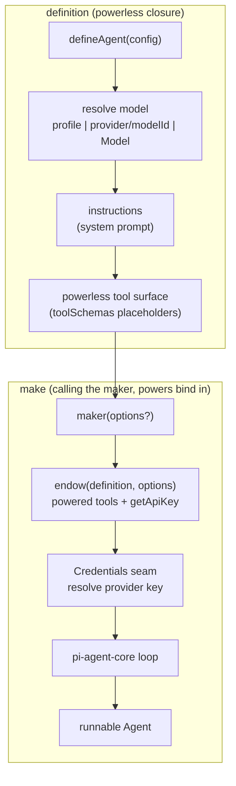

# `@endo/agentry`: the `defineAgent` agent-builder

| | |
|---|---|
| **Created** | 2026-06-03 |
| **Updated** | 2026-06-25 |
| **Author** | 0xpatrickdev (prompted) |
| **Status** | In Progress |

## Status

The core of this builder shipped in
[#517](https://github.com/endojs/endo-but-for-bots/pull/517).
`@endo/agentry` exports `defineAgent` and the code-mode presets
(`makeCodeModeAgent`, `makeCodeModeGitLoopAgent`).
The shipped shape differs from this design's first draft in two ways worth
naming up front, because the rest of the document has been reconciled to the
shipped surface:

- **`defineAgent` is a single call, not the `defineAgent` / `makeAgent` pair
  this design first proposed.** `defineAgent(config)` returns a **maker
  function**; the powerless definition is the maker's closure, and calling the
  maker with a powers handle is the powered stage. There is no separate
  `makeAgent(template, powers)` export. See § The `defineAgent` shape.
- **Provider selection folded into `model`, and the system prompt is
  `instructions`.** The first draft's `provider: { source, model }` block and
  `prompts: { system, steering }` are not the shipped config. The shipped config
  is `{ model, instructions, tools, endow }`. See § The `defineAgent` shape.

Several surfaces this design describes are **aspirational**: they are proposed,
not in #517. They are collected in § Aspirational surface (not yet built) and
are not described as shipped anywhere above that section.

## What is the Problem Being Solved?

The repository's five agent-tool surfaces (fae, lal-on-`llm`, lal as
proposed for the eval harness, genie, and the pi-agent-core `AgentTool`
contract) each hand-assemble their own harness: each selects a tool set,
hard-codes an attenuation policy, binds a provider loop, and decides how
the model learns each tool's shape.
No two do it the same way, and the wiring is buried in each harness's
`agent.js` rather than expressed as configuration.

The maintainer's goal is to take the best of each harness and make agent
**builders** in `agentry`, so each harness can still customize as it
pleases (tool discovery, tool selection, system and steering prompts) and
current lal, fae, and genie can be recreated from the package.
The sharpened goal: **`defineAgent` lets someone build their own lal.**
`@endo/agentry` is not a single fixed harness; it is the agent builder an
operator reaches for to assemble a coding agent of their own shape.
The **dogfood** that proves the builder is rich enough is reconstructing
**lal itself** from it: if `defineAgent` can rebuild lal, it can build
anyone's lal, so the lal reconstruction is the design's own acceptance
test.

The sibling [endo-agent-tools](endo-agent-tools.md) specifies the tool
half (the method-guard `makeTool` record, the `Filesystem`-targeted file
tools, the wire-schema contract).
This design specifies the consuming half: a declarative `defineAgent`
builder whose configuration surface is wide enough that lal and genie each
`defineAgent(...)` into their existing behavior rather than
hand-assembling a harness.

## `defineAgent`: one call, two stages

The builder follows the exo `define*` / `make*` spirit
([exo-taxonomy](https://github.com/endojs/endo/blob/master/packages/exo/docs/exo-taxonomy.md)):
a powerless *definition* describes what all instances share, and a powered
*make* binds an instance to its specific powers.
As shipped in #517 the two stages live in **one call**, not two exports.

`defineAgent(config)` returns a **maker function**.
The powerless definition (the resolved model, the system instructions, and the
model-facing tool surface) is captured in the maker's closure and holds no
caps.
Calling the returned maker with a powers handle is the powered stage: it binds
the granted `Filesystem`, the credential resolver, and the powered tool surface,
and constructs the live pi-agent-core `Agent`.

| Stage | Where it lives | Holds | Carries no |
|---|---|---|---|
| definition (powerless) | the maker's closure, produced by `defineAgent(config)` | the resolved `Model`, the `instructions` system prompt, and the powerless model-facing `toolSchemas` | caps (no `Filesystem`, no credential, no powered tool closure) |
| make (powered) | calling the returned maker `(options?) => Agent` | the definition **plus** the granted powers: the powered tool closures, the `Credentials` seam, and the per-construction overrides | (nothing: this is the powerful stage) |

So `defineAgent(config)` is agent *definition*: a powerless closure safe to
hold and call many times.
Calling its maker is agent *creation*: it empowers that definition into a
runnable agent for one operator, one workspace, one credential set.
A maker can be called many times to build many agents.

The model-facing tool surface (`toolSchemas`) is built from powerless
placeholders, so a definition can advertise its tools before any power is
granted.
When the maker runs, the `endow` hook (when configured) derives the **powered**
tool surface (closures bound to live powers) and a credential resolver from the
powers handle, without the powerless stage ever holding a capability.
The powered tools, the maker's optional `tools` override, or the powerless
`toolSchemas` are then handed to the pi loop in that precedence order.

## Background

**`@endo/agentry` already exists as the optimizer and eval package.**
PR #308 ships `@endo/agentry` carrying `src/optimizer/*` and the narrow
`coerceBigintArgs` bigint coercion that replaced lal-on-`llm`'s full
SmallCaps marshal.
This design **grows** that package with a new `defineAgent` module; it
does not create a new package.
The synergy is direct: the builder's agents are exactly what the optimizer
and eval harness exercise (see *Relationship to the eval and optimizer
package* below).

**The pi harness contract** (verified against `@earendil-works/pi-ai`
v0.79.0, the version `packages/agentry/package.json` pins as `^0.79.0` after
[#422](https://github.com/endojs/endo-but-for-bots/pull/422)).
The project was renamed from `@mariozechner/pi-ai` to
`@earendil-works/pi-ai` plus `@earendil-works/pi-agent-core`.
`@endo/agentry` targets the latest from the start; migrating genie off the
stale `@mariozechner/pi-ai@^0.73.1` pin is a separate PR.
The contract the builder binds to:

```ts
// @earendil-works/pi-ai
Tool<TParameters extends TSchema = TSchema> = {
  name: string;
  description: string;
  parameters: TSchema;     // TSchema = TypeBox = JSON Schema
};

// @earendil-works/pi-agent-core
AgentTool extends Tool = {
  label: string;
  prepareArguments?(args: unknown): Static<TParameters>;
  execute(toolCallId, params, signal?, onUpdate?): Promise<AgentToolResult>;
  // per-tool queue mode
};
AgentToolResult = { content: (Text | Image)[]; details; terminate? };
```

The builder produces `AgentTool` records in two stages.
The definition fills `parameters` from the schema and stages the
`prepareArguments` pipeline on the powerless tool surface; calling the maker
closes each tool's `execute` over the granted powers (via the `endow` hook) and
binds the record to the pi loop.

## Interaction mode: code mode is primary

The **primary interaction mode is code mode**: the agent drives the
workspace through a single `execute(js)` that runs in a confined
`Compartment` over a set of petname-bound endowments, not through a wide
fan of discrete function-call tools.
The builder is **not** aiming to export the agent across a CLI, an SDK,
and a web endpoint as rival interaction modes; that multi-interface export
framing is out of scope.

Discrete `arg0`-style tools (the method-guard `makeTool` records the
sibling design specifies) are **still kept** as a *distinct second mode*:
the surface an MCP client consumes and the fallback for a model that
cannot or should not write code.
This is a different concern from the multi-interface export idea above.
Both modes resolve caps through the one guest petstore at different
granularities (per-session for code mode, per-call for discrete tools; see
[endo-agent-tools](endo-agent-tools.md) § Capability arguments are
petnames).

## What `defineAgent` composes

The pipeline runs in two stages, separated at the moment powers arrive.
The shipped composition (#517) is the model resolution, the system
instructions, the model-facing tool surface, and the powered make call.
The richer composers this design first sketched (declarative tool selection,
attenuation policies, define-time wire-schema derivation, a `compaction`
selector, per-package preset bundles) did **not** ship in #517 and are
described in § Aspirational surface (not yet built).



1. **The loop is the pi-agent-core loop.**
   There is no `harness` abstraction: the only loop is
   `@earendil-works/pi-agent-core`, so the builder binds it directly through
   `makePiAgent` and the maker returns the live `Agent`.
   Confinement (loading pi into a fresh Endo `Compartment` via
   `importLocation` per
   [PR #297](https://github.com/endojs/endo-but-for-bots/pull/297)) is the
   path the code-mode `execute` tool follows for the **guest code** it runs,
   not a wrapper `defineAgent` puts around the pi loop itself.

2. **Model resolution, in the definition.**
   `defineAgent` resolves the `model` config into a concrete pi-ai `Model`:
   a bare profile string (`'sonnet'`), a `"provider/modelId"` string
   (`'anthropic/claude-...'`), a `{ provider, model, baseUrl, reasoning }`
   profile object, or a concrete `Model` passed straight through.
   Model resolution self-registers pi-ai's built-in providers on first use,
   so a registry model resolves without any caller-side setup hook.

3. **Instructions, in the definition.**
   The `instructions` config string is the system prompt; the definition
   threads it into the pi loop as `systemPrompt`.

4. **Tool surface, powerless in the definition, powered at make.**
   The definition captures the `tools` config as the powerless `toolSchemas`,
   built from placeholders so a definition can advertise its tools before any
   power is granted.
   When the maker runs, the `endow(definition, options)` hook (when
   configured) returns the **powered** tool closures bound to live powers,
   plus an optional `getApiKey` resolver.
   Tool precedence at make is explicit: a caller's `options.tools` override,
   then the `endow` hook's tools, then the powerless `toolSchemas`.

5. **Credentials, resolved at make.**
   The provider API key is resolved through a `Credentials` seam, not a config
   field.
   The maker derives a pi-agent-core `getApiKey` hook from the supplied
   `credentials` (or the `endow` hook's, or an explicit `getApiKey`), so the
   powerless definition never holds a secret.
   `makeEnvCredentials` is the default env-backed provider; swapping it for a
   capability-scoped secret store is a local change at the seam.

## Mapping pi's session tree to the daemon mail model

Once the maker composes a pi loop (and lal already drives one since
the pi harness merged in
[#290](https://github.com/endojs/endo-but-for-bots/pull/290)), two
encodings of conversation history coexist in one stack: pi's session
tree is the agent's working memory, and the daemon mail model is the
delivery and persistence layer.
They map cleanly today, but nothing pinned the correspondence, so they
could drift as the harness lands.
This design pins it.

| pi session tree | daemon mail model | the correspondence |
|---|---|---|
| `parentId` | `replyTo` (`packages/daemon/src/mail.js`) | the sole branch axis |
| active leaf | a message's latest revision: `done: true` is settled, the last entry of `revisionsByNumber.get(messageNumber)` is the current envelope | which node is live |
| `/fork`, `/clone` | `reply(messageNumber, ...)`, producing a sibling subtree, never `editMessage` | how a branch grows |

The reply-to tree carried `messageId` / `replyTo` from the start, and
the conversation-tree adapter (`packages/conversation-tree`) already
bridges daemon `replyTo` to a tree node's `parentId`.
What [#125](https://github.com/endojs/endo-but-for-bots/pull/125) added
(`editMessage`, `messageHistory`, and the `done` flag, stored per
message number in `revisionsByNumber`) is a *second, orthogonal* history
axis: linear, per-message-number, layered on top of the reply-to tree.
Nothing in the harness reconciled which revision was current when a
reply branched off a node, which is exactly where the two axes could
drift.

**Invariant (the harness pins it).**
The reply-to tree is the sole branch axis; the per-message revision log
is strictly intra-node and never forks.
`editMessage` settles a node in place (a streamed completion, an
amendment): it keeps the message number, the `replyTo` linkage, and the
dismissal state, and only appends a revision to `revisionsByNumber`.
`reply` grows the tree (an alternative continuation, or the pi `/tree`
edit-a-user-message case): it produces a sibling subtree under the
chosen parent.
A pi `/fork` or `/clone` is therefore always a `reply`, never an
`editMessage`; a model amending its own streamed output is always an
`editMessage`, never a `reply`.
The corresponding UI decision (branch a user's edit rather than
overwrite it) is tracked on #305.

## The `defineAgent` shape

The shipped config is `{ model, instructions, tools, endow }`.
`defineAgent(config)` returns a maker; calling the maker with a powers handle
builds the live pi-agent-core `Agent`.

```ts
import { defineAgent } from '@endo/agentry';

// 1. definition: powerless closure. No provider block, no prompts.system;
//    the model carries the provider and `instructions` is the system prompt.
const makeMyAgent = defineAgent({
  model: 'sonnet',                        // profile id | "provider/modelId" | concrete pi-ai Model
  instructions: 'You are a helpful agent.',
  tools: [/* powerless model-facing AgentTools */],
  endow(definition, options) {            // optional: derive powered tools + key from live powers
    return { tools: powerBoundTools(options.powers), getApiKey };
  },
});

// 2. make: call the maker with powers. The maker returns a pi-agent-core
//    Agent directly; drive it with pi's Agent API. The same maker can be
//    called many times to build many agents.
const agent = makeMyAgent({ powers, credentials });
await agent.prompt('Hello.');
await agent.waitForIdle();
```

The maker's options are `{ powers, credentials, tools, getApiKey, messages,
streamFn, convertToLlm, thinkingLevel }`.
There is no agentry-defined `agent.run({ task })` facade: the maker hands back
pi-agent-core's `Agent`, so you use pi's run API (`prompt` / `waitForIdle`)
directly.
There is no `preset` field and no `harness` field (the loop is always
pi-agent-core).
There is no separate `makeAgent(template, powers)` export; the maker the
definition returns is the make stage.

### Code-mode presets

Code mode is the primary interaction mode (§ Interaction mode: code mode is
primary), and #517 ships it as two concrete presets exported from
`@endo/agentry/execute`, each a thin specialization of `defineAgent`:

```ts
import { makeCodeModeAgent, makeCodeModeGitLoopAgent } from '@endo/agentry/execute';

// makeCodeModeAgent: an agent whose sole tool is execute(js), evaluated in a
// Compartment endowed with the configured lexical powers.
const { agent } = makeCodeModeAgent({
  model,
  powers: { workspace, git, gitMode: 'readOnly' }, // or 'readWrite'
});

// makeCodeModeGitLoopAgent: a thin alias that wires a workspace Filesystem and
// a git capability as the lexical powers and supplies the repository preamble.
const gitAgent = makeCodeModeGitLoopAgent({ model, workspace, git });
```

Each preset builds the single execute tool with `makeExecuteTool`, wraps it as
a pi-agent-core tool via `toSmallcapsPiAgentTool`, and calls
`defineAgent({ model, instructions, tools: [...] })`.
The lexical globals (`workspace`, `git`, and any configured `namedPowers`) are
injected into the Compartment the guest code runs in; the model discovers a
capability's method surface at runtime via `E(cap).__getMethodNames__()` rather
than reading a checked-in declaration.
`makeCodeModeAgent` returns the record
`{ agent, globals, execute, systemPrompt, model }`;
`makeCodeModeGitLoopAgent` returns the live `Agent` directly.

The per-package preset bundles this design first proposed (each harness
exporting its own `define<Name>Agent` / `make<Name>Agent` pair, reconstructing
lal and genie) are **not** what shipped; the shipped presets are the two
code-mode presets above. See § Aspirational surface (not yet built).

## The SmallCaps wire contract

SmallCaps (`@endo/marshal`'s wire format) is a **Hilbert Hotel encoding
over the full space of string values**: any JSON string position is a
literal string when its first character lies outside the reserved sigil
range, or a tagged value when the first character is a sigil (`!` escape,
`+` / `-` bigint, `#` constant or tag, `%` symbol, `$` remotable, `&`
promise).
A literal string whose first character would collide with the reserved
range is escaped on encode by prefixing `!`, and the `!` is consumed on
decode.

The contract this design honors is therefore **symmetric and broader than
bigints alone**, with both halves living in `@endo/agent-tools` today (the
wire-shape naming and the inbound decode in `toSmallcapsPiAgentTool`), not in a
define-time `prepareArguments` recipe assembled by `defineAgent`:

| Direction | What it does |
|---|---|
| **encode** (tool result outbound) | A bigint is named `{ type: 'string', pattern: '^[+-]?\\d+$' }`, never `{ type: 'integer' }`. A plain string whose first character is in the reserved range is escaped by prefixing `!` (a phone-number literal `"+15551234567"` goes over as `"!+15551234567"`). The description tells the model to emit values in this form. |
| **decode** (model-emitted call inbound, before `mustMatch`) | `coerceBigintArgs` coerces a `^[+-]?\d+$` string into a `BigInt` (narrow: only declared `bigintArgs` fields); `unescapeHilbertHotel` drops a leading `!` whose second character is in the reserved range; the LLM-JSON fixups (null to undefined, one JSON-string-parse retry) run in the same pass. |

The bigint half closes the JSON-number ambiguity the review flagged: the
full SmallCaps marshal would silently reinterpret any LLM string with a
SmallCaps prefix, so `coerceBigintArgs` decodes only declared bigint
fields and copies everything else verbatim.
The un-escape half closes the remainder of the type-introducer ambiguity
for any plain-string field whose value happens to start with a sigil.
Neither half stands alone.
The detailed wire-shape contract lives in
[endo-agent-tools](endo-agent-tools.md) § Wire schemas; this design
references it.

### Code-mode result rendering uses the real SmallCaps marshaller

The decode contract above is the inbound (model to args) half.
The outbound half (rendering a code-mode `execute` result back to the
model) uses the **real SmallCaps marshaller** (`@endo/marshal`) for
plain-data results, not `JSON.stringify`.
This shipped in #517: plain-data completion values returned from `execute` are
encoded for the model with the SmallCaps marshaller, so BigInts and other
non-JSON-native passable values round-trip losslessly.
The same marshaller round-trips bigints, `undefined`, symbols, and
reserved-range strings through the Hilbert-Hotel encoding the inbound decode
consumes, so a result the model reads back is in the same encoding the model
emits.
`JSON.stringify` cannot: it throws on a bigint and mangles the
reserved-range and `undefined` cases, re-opening on the display side the
ambiguity the inbound contract closes on the args side.
Live caps in a result are *named* (a petname via `storeValue`), not
marshalled.

## The deriver call site (the discrete-tool path; aspirational)

> This section describes the **discrete-tool** wire-derivation path, which is
> **not** what `defineAgent` shipped in #517. The shipped code-mode presets
> build a single `execute` tool and wrap it with `toSmallcapsPiAgentTool`
> (in `@endo/agent-tools`), which is where the SmallCaps decode actually lives
> today, not in a per-tool `prepareArguments` recipe assembled by `defineAgent`.
> It is retained here as the design sketch for the second (discrete-tool) mode.

For each selected discrete tool, the proposed builder would record a partial
`AgentTool` recipe (everything that does not depend on powers) and store the
`execute` thunk that closes over the powers the make stage supplies.

```ts
// proposed: once per selected discrete tool, in the definition.
const agentToolRecipe = {
  name: tool.name,
  label: tool.name,
  description: tool.summary,
  parameters: tool.parameters,          // the wire schema: TypeBox TSchema = MCP inputSchema
  prepareArguments(args) {              // the symmetric SmallCaps decode, before mustMatch
    const a = coerceBigintArgs(args, tool.bigintArgs);
    const b = unescapeHilbertHotel(a, tool.stringArgs);
    return fixupLlmJson(b);
  },
  execute: powersBoundExecute(tool, /* the make stage fills in: */ undefined),
};
// at make: closes execute over the granted Filesystem, Spawner, ...
const agentTool = { ...agentToolRecipe, execute: powersBoundExecute(tool, powers) };
```

`parameters` is both wire targets at once (the TypeBox `TSchema` pi sends
the provider and the MCP `inputSchema` an MCP client renders).
`prepareArguments` is the home for the full inbound decode, which
pi-agent-core runs before `execute` so the decode lands before `mustMatch`
ever sees the args.

## fae vs pi: tool model divergence

fae and the pi loop differ on **how the tool set is allowed to change
during a conversation**, which is why **fae is not based on pi in the first
pass**.

1. **fae mutates its tool set live; pi's is a fixed harness.**
   fae rebuilds the full schema array from its `tools/` petstore dir on
   every message and swaps `currentSchemas` mid-conversation on a live
   `adoptTool`.
   The pi loop builds a fixed `AgentTool[]` at construction and never
   mutates it.

2. **fae's live adoption busts the cached prompt prefix.**
   The lal providers serialize the tools block with no `cache_control`, so
   every mid-conversation swap invalidates the cached prefix for the rest
   of the conversation.

3. **pi has no dynamic-tool-add path at all.**
   Reconstructing fae on pi would mean either adding such a mutate path
   (re-importing the cache penalty) or accepting a static set, which is not
   fae.

4. **`adoptableTools` is the cache-friendly forward path.**
   Adoption in fae grants an *already-existing* capability whose interface
   exists before adoption.
   Declaring the **adoptable set at define time** lets the schemas sit
   latent in the prefix from turn 1, so adoption flips a tool from
   advertised-but-ungranted to granted **without mutating the tools array**
   and the cached prefix stays intact.
   This covers progressive adoption of capabilities known at build time.
   It does **not** cover a capability another agent mails in at runtime
   that was never declared; that fully-novel case still needs the mutate
   path or a separate escape hatch (Open Question 2).

**Decision.** First pass reconstructs lal and genie; fae keeps its own
loop and `defineFaeAgent` is deprioritized.

## Relationship to the eval and optimizer package, and where this design stops

`defineAgent` is a new module in the same package PR #308 introduced, and
the builder's agents are what that package's eval and optimizer halves
exercise.
The eval harness can construct many agent variants (different attenuation,
different descriptions, different prompts) from config without
hand-writing a harness per variant, and the descriptions the schemas fold
in are exactly what the optimizer perturbs.

The forward edge this design names and stops at is the **eval-vs-optimize**
distinction, drawn by the git code-mode eval harness
(`packages/agentry/src/eval/README.md`):

- **Eval** measures a *fixed* agent by **outcome assertion**: run a
  scenario, then judge pass or fail by reading the repository's actual
  final state through the live `git` capability and checking it against the
  target.
  It answers "did it work?" for one model and one prompt, needs no
  in-compartment instrumentation (a code-mode agent's only tool is
  `execute`, so the pi-agent trace sees one opaque call, not the individual
  git operations), and accepts any alternate-but-correct path.
  Eval **ships first**.
- **Optimize** searches for a *better* agent: GEPA or `ax`-style
  prompt-tuning loops that mutate the system prompt and select on a score.
  It answers "what prompt works best?", consumes an eval as its objective,
  and is **deferred**.

This is the line the builder is built up to: `defineAgent` produces the
fixed agent an eval measures, and an optimizer (later) searches the space
of definitions with an eval as its objective.
Everything past that line (the prompt-search loop) is out of scope here.

## Connection to #404 and #370

The #404 agent-creation wizard's three panes map onto the definition and the
powers: Pane 1 picks which harness's *definition* is in play, Pane 2 supplies
the provider *power* (credential), Pane 3 supplies the endowment *powers*
(workspace `Filesystem`, sandbox `Spawner`).
The wizard holds the per-harness maker from module load and its
**Submit calls the maker** (the powered stage), not `defineAgent` (which it
called once at load to produce the maker).

For #370, the version-controlled-filesystem loop, the substrate already
reads the live worktree and history through the same `Filesystem` surface.
The builder wires that substrate in through the code-mode `workspace` /
`git` powers: a read-only-history agent is
`makeCodeModeGitLoopAgent({ model, workspace: Git.filesystemAt(ref), git, readOnlyGit: true })`;
a live-worktree editing agent is the same call with a writable workspace and
`readOnlyGit: false`.
The same execute tool, the same maker, a different cap.

## Aspirational surface (not yet built)

The following capabilities are **proposed, not in #517**. They are this
design's forward edge: the shipped `defineAgent` is deliberately narrow
(`{ model, instructions, tools, endow }`), and each item below is a config or
machinery addition that would extend it. None of them is described as shipped
anywhere above. Where the shipped code has a seam the feature could plug into,
that seam is named.

- **Declarative tool attenuation.**
  A `selectTools({ from, include, attenuate })` config with
  `readOnly` / `subroot` / `rejectPatterns` levers (attenuation policies as
  functions-of-cap: `fs => readOnly(fs)`, `(fs, path) => fs.subroot(path)`, an
  exec command tool with `rejectPatterns(DANGEROUS_PATTERNS)`).
  The shipped seam where this could plug in later is the `endow(definition,
  options)` hook: it already derives the powered tool surface from live powers
  at make time, so an attenuation layer would compose there.
  (The code-mode preset today carries a coarser `gitMode: 'readOnly' |
  'readWrite'` selector, enforced by the exo guard, not a declarative
  per-tool attenuation config.)

- **Define-time wire-schema derivation.**
  A `deriveWireSchemas(...)` step that fills each selected tool's
  `Tool.parameters` (TypeBox `TSchema`) and MCP `inputSchema` at define time,
  closing the `additionalProperties: true` punt.
  This is **not** built in agentry: wire schemas are presently hand-authored in
  `@endo/agent-tools` and pinned to the live guard by a divergence gate, not
  derived in `defineAgent`.

- **A `compaction` option.**
  A `compaction: 'pi-default' | 'genie-observer-reflector' | <record>` config
  selecting genie's observer/reflector transcript-compaction pair over pi's
  default.
  There is **no seam for this in #517**; it is absent by the design-shift to
  the narrow single-call config.

- **`prompts.steering` (the steering prompt half).**
  The shipped config carries only `instructions` (the system prompt).
  A second `steering` prompt is proposed, not built.

- **A discovery axis.**
  A `discovery: 'static' | 'petname-dir'` config selecting how the agent
  learns its tool set.
  Proposed, not built; the code-mode preset's lexical powers are configured
  statically.

## Design Decisions

1. **`defineAgent` is a declarative builder, not a per-harness `agent.js`.**
   Model, instructions, and tool surface are config, not hand-assembled
   wiring.
   (Shipped #517. Declarative tool *selection* and *attenuation* are
   aspirational; see § Aspirational surface.)

2. **`defineAgent` is a single call returning a maker, not a `defineAgent` /
   `makeAgent` pair.**
   Shipped as #517. The powerless definition is the maker's closure; calling
   the maker with a powers handle is the powered stage.
   The first draft's two-export `defineAgent(template)` / `makeAgent(template,
   powers)` factorization is **not** what shipped, though it keeps the exo
   `define*` / `make*` spirit (powerless definition, powered make).
   One maker builds many agents cheaply.

3. **The builder is where the wire schema becomes real.** *(Aspirational.)*
   The proposal that `defineAgent` fills `Tool.parameters` and MCP
   `inputSchema` at define time is the discrete-tool path, **not** shipped in
   #517; the shipped code-mode presets carry one execute tool whose SmallCaps
   wrapping lives in `@endo/agent-tools` (`toSmallcapsPiAgentTool`).
   See § Aspirational surface.

4. **The symmetric SmallCaps decode plus LLM-JSON fixups.**
   SmallCaps is a Hilbert Hotel over all string values, so the wire
   contract has symmetric halves: the schema names the wire shape
   (string-encoded bigint plus escape on outbound collisions) and the inbound
   decode runs `coerceBigintArgs` plus `unescapeHilbertHotel` plus the fixups.
   Neither half stands alone.
   (Shipped via `@endo/agent-tools`'s `toSmallcapsPiAgentTool`, not a
   define-time `prepareArguments` recipe assembled by `defineAgent`.)

5. **A new module in the #308 package, not a new package.**
   `@endo/agentry` already exists as the optimizer and eval package;
   `defineAgent` grows it. (Shipped #517.)

6. **Per-harness preset bundles.** *(Aspirational, in part.)*
   The first draft proposed each harness exporting its own
   `define<Name>Agent` / `make<Name>Agent` pair reconstructing lal and genie.
   What shipped in #517 is the two code-mode presets (`makeCodeModeAgent`,
   `makeCodeModeGitLoopAgent`) in `@endo/agentry/execute`; the per-harness lal
   / genie reconstruction bundles are aspirational.
   `defineFaeAgent` is deferred (Design Decision 10).

7. **Attenuation policies declared here; primitives in `agent-tools`;
   applied to caps at make.** *(Aspirational; see § Aspirational surface.)*

8. **No `harness` abstraction.**
   One loop (pi-agent-core), so no `harness` enum.
   The genie observer/reflector `compaction` option this design first sketched
   is **not** in #517 (no seam yet); see § Aspirational surface.

9. **Code-mode guest code is confined (per #297).**
   The code-mode `execute` tool loads the guest code into a fresh Endo
   `Compartment` over the petname-bound endowments, so the guest runs confined.
   (#517 wires the execute tool; the broader "load the whole pi loop through
   `importLocation`" framing is the code-mode execution boundary, not a wrapper
   `defineAgent` itself applies.)

10. **fae is not based on pi in the first pass; `defineFaeAgent` is
    deprioritized.**
    fae keeps its own loop because of the fae-vs-pi tool-model divergence.
    The cache-friendly `adoptableTools` build-time latent set is the
    forward path for progressive adoption when fae-on-pi is revisited; the
    fully-novel mailed-in-runtime case stays open (Open Question 2).

11. **`AgentToolResult.terminate` and per-tool queue mode are config.**
    A tool may request loop termination via `terminate?` and declare its
    queue mode, referencing pi's exact types, rather than being left at pi
    defaults.
    (These are pi-agent-core tool-record fields a tool author still sets
    directly; `defineAgent` does not surface them as its own config keys in
    #517.)

12. **The reply-to tree is the sole branch axis; the per-message revision
    log never forks.**
    pi's session tree and the daemon mail model are two encodings of one
    conversation history, so the harness pins `parentId` to `replyTo` as
    the only branch axis.
    `reply` grows the tree (pi `/fork` / `/clone`); `editMessage` settles
    a node in place (the #125 `revisionsByNumber` log), strictly
    intra-node.
    See § Mapping pi's session tree to the daemon mail model.

## Dependencies

| Design | Relationship |
|--------|--------------|
| [endo-agent-tools](endo-agent-tools.md) | **Consumed.** Sibling. The code-mode preset wraps its execute tool via `toSmallcapsPiAgentTool`, where the symmetric SmallCaps decode (`coerceBigintArgs` plus `unescapeHilbertHotel`) lives. The aspirational discrete-tool path would also select its `makeTool` tools and use its wire schemas (§ Aspirational surface). |
| [PR #297](https://github.com/endojs/endo-but-for-bots/pull/297) | **Confinement enabler.** Fixes the module-resolution bugs that prevented pi from loading through `@endo/compartment-mapper`'s `importLocation`, so code-mode guest code loads into a confined Endo `Compartment`. |
| [PR #290](https://github.com/endojs/endo-but-for-bots/pull/290) | **The merged pi harness.** lal's loop now drives `@earendil-works/pi-agent-core`; `defineAgent`'s maker composes the same loop. The session-tree to mail mapping pins their correspondence (§ Mapping pi's session tree to the daemon mail model). |
| [PR #517](https://github.com/endojs/endo-but-for-bots/pull/517) | **The shipped core.** `defineAgent` plus the two code-mode presets (`makeCodeModeAgent`, `makeCodeModeGitLoopAgent`). The single-call maker shape this design is reconciled to. |
| [PR #422](https://github.com/endojs/endo-but-for-bots/pull/422) | **The pi-ai pin.** Bumped `@earendil-works/pi-ai` / `@earendil-works/pi-agent-core` to `^0.79.0`, the version the contract is now verified against. |
| [PR #125](https://github.com/endojs/endo-but-for-bots/pull/125) | **The revision-log axis.** Added `editMessage` / `messageHistory` / `done` (`revisionsByNumber` in `packages/daemon/src/mail.js`), the intra-node history axis the mapping invariant keeps from forking. |
| [endo-gateway-mcp](endo-gateway-mcp.md) | The Gateway's MCP termination forwards the MCP `inputSchema` the aspirational discrete-tool path fills to an external MCP client. |
| [daemon-agent-tools](daemon-agent-tools.md) | The capability-scoped tool model. The aspirational `attenuate` config would realize the capability-scoping half; the dynamic-discovery half is deferred with fae-on-pi (Design Decision 10, Open Question 2). |
| [endo-fs-backend-seam](endo-fs-backend-seam.md), [endo-fs-from-git](endo-fs-from-git.md) | The `Filesystem` substrate the builder wires in as the code-mode `workspace` power for the #370 loop. |
| `chat-inventory-create-menu` (PR #404, forward-ref) | The agent-creation wizard whose three panes map onto the definition and the powers; Submit calls the maker. |
| PR #370 (forward-ref) | The version-controlled-filesystem loop the builder wires the `workspace` / `git` powers into. |

## Open Questions

1. **Description sourcing for the wire schema.**
   Matchers carry no prose.
   The candidate direction is to lift JSDoc comments from the ts-in-js
   types (sometimes derived from the typeguards), and to investigate adding
   JSDoc to the typeguards themselves; until that is proven, fall back to
   `help()` prose, a sidecar map, or the optimizer's tuned descriptions.
   This is the seam between the builder and the optimizer.
   (Mirrors [endo-agent-tools](endo-agent-tools.md) Open Questions.)

2. **Fully-novel runtime tool adoption.**
   `adoptableTools` keeps progressive adoption cache-friendly by declaring
   latent capabilities up front (the invariant to test: the derived schemas
   sit latent in the prompt prefix from turn 1 and adoption never mutates
   the `tools` array, so the cached prefix is never invalidated).
   What stays open is a capability another agent mails in at runtime that
   was never declared, which still needs the mutate path or a separate
   escape hatch.
   Settling this is a prerequisite to revisiting basing fae on pi.

3. **`selectTools` and `attenuate` ergonomics vs the #404 grant shape.**
   Should the aspirational `attenuate` config (§ Aspirational surface) be
   exactly the #404 endowment grant shape (so Submit forwards it verbatim), or
   is there a translation layer?
   Left open pending both the attenuation config landing and the #404
   grant-shape settling.

## Prompt

> Author a design for the `defineAgent` builder in `@endo/agentry`.
> Cover what it composes: the confined pi loop
> (`@earendil-works/pi-agent-core` per #297), tool selection
> (`@endo/agent-tools` method-guard tools plus include groups),
> attenuation policies (genie's read-only / subtree / git-only / exec
> registry as functions-of-cap), wire schemas (`Tool.parameters` plus MCP
> `inputSchema`), and per-harness presets for lal and genie.
> Split it into `defineAgent` (powerless template) and `makeAgent`
> (instance with powers) by the exo `define*` / `make*` convention.
> Make code-mode `execute` the primary interaction mode; keep discrete
> tools as a distinct second mode.
> Wire `prepareArguments` (the symmetric SmallCaps decode) and the
> code-mode result marshaller explicitly.
> Name the synergy with #308's optimizer and eval `@endo/agentry`, and cap
> the design at the eval-vs-optimize distinction.
> Connect to #404 (the wizard's Submit drives `makeAgent`) and #370 (the
> builder wires the `Filesystem` tools into the loop).
> Park every uncertainty in Open Questions.
