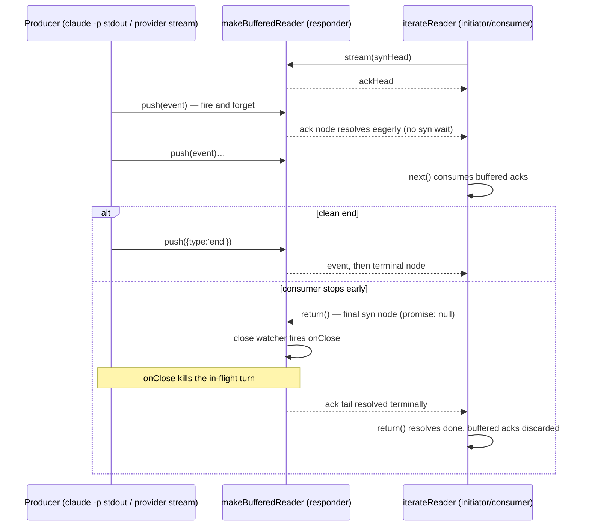

# Buffered Channel Consolidation onto @endo/exo-stream

| | |
|---|---|
| **Created** | 2026-07-06 |
| **Updated** | 2026-07-24 |
| **Author** | endolinbot (prompted by kumavis review on PR #486) |
| **Status** | **Complete** |
| **Source** | Review 4633245769 on endojs/endo-but-for-bots PR #486, inline threads on `packages/claude-sandbox/src/buffered-channel.js` |

## What is the Problem Being Solved?

Two copies of the same streaming primitive are meant to track each other
byte-for-byte and have already diverged:

- `packages/floot/src/buffered-channel.js` (on `llm`): `makeBufferedReader`,
  a `Far`-based buffered reader fed by an imperative `push`. It backs three
  wires: the floot reply wire (`src/stream.js` `makeReplyChannel`), the
  transcript wire (`voice/audio-server-caplet.js`), and the audio wire
  (`voice/tts-server-caplet.js`).
- `packages/claude-sandbox/src/buffered-channel.js` (PR #486, not yet on
  `llm`): ported "verbatim" from floot but already diverged at the exo
  boundary. It uses `makeExo` with a `BufferedReader` `M.interface` guard where
  floot still uses plain `Far`. It backs the `claude -p` stdout reply wire in
  `src/claude-client.js` (`runTurn`).

A third, informal sibling exists: `makeTextFeed` in
`packages/chat/floot-component.js`, a browser-side reduction of the same
pattern (buffer, park, wake, `return()` discards) that feeds the TTS server.

Reviewing #486, kumavis held the file rather than diverging it further, noting
it is "probably duplicative of packages/exo-stream" and dispatching this
design. The goal: one primitive, exported from `@endo/exo-stream`, consumed by
both packages (and eventually the chat feed), landed for both copies in one
coordinated cross-package change.

## Semantics the consolidated primitive must preserve

The four load-bearing properties, from the review thread, verified against
both copies (they are identical in logic; only the exo wrapper differs):

1. **Fire-and-forget imperative `push`.** The producer runs ahead without
   awaiting acknowledgments; the buffer is unbounded. A lockstep
   `makePipe` from `@endo/stream` would change behavior and could stall
   reading `claude`'s stdout.
2. **Terminal events auto-finalize.** `push({ type: 'end' })` or
   `push({ type: 'abort', reason })` delivers the event as a value, then the
   channel reports done; later pushes are ignored.
3. **`onClose` fires on early consumer stop.** When the consumer `return()`s
   or `throw()`s before the stream finished, a hook fires so the producer is
   aborted: floot aborts the provider fetch, claude-sandbox kills the
   in-flight `claude -p` process. The hook may be supplied up front or late
   (`setOnClose`; the transcript wire wires it after construction).
4. **`return()` reports done promptly, discarding buffered events.** The
   consumer is never forced to drain what it no longer wants.

## Why the existing exo-stream surface does not already cover this

`@endo/exo-stream` (present at `packages/exo-stream/` on `llm`, vendored from
upstream endojs/endo#3036) exports responder-side wrappers over a **local
iterator** (`readerFromIterator`, `makeReaderPump`) and initiator-side
consumers (`iterateReader`), speaking a pipelined synchronize/acknowledge
promise-chain protocol. Everything in the package is **pull-based and
backpressured by design** ("such that the producer does not overwhelm the
consumer", DESIGN.md); the `buffer` option only widens a bounded pre-ack
window. Nothing exports the imperative push side.

Composing the obvious way (an unbounded push queue such as `@endo/stream`
`makeQueue`, adapted to an async iterator and handed to `readerFromIterator`)
preserves semantics 1 and 2 but breaks 3 in an operationally important way:
`makeReaderPump`'s loop is strictly sequential (await a syn node, then await
`iterator.next()`). While it is parked in `iterator.next()` waiting on an
**idle producer**, it cannot observe the close signal traveling on the syn
chain, so `iterator.return()` (and therefore `onClose`, and therefore the
`claude -p` kill) is deferred until the producer's next push. A hung `claude`
turn that emits nothing would never be killed by the consumer's `return()`.
Semantic 4 degrades the same way. So the consolidation needs a **new export**,
not just a composition: a push-fed responder pump that treats the close signal
as always-live.

## Design

Add one module to `@endo/exo-stream`: `buffered-channel.js`, exporting
`makeBufferedReader` (name kept from both copies so call sites migrate by
changing only the import specifier).

```js
import { makeBufferedReader } from '@endo/exo-stream/buffered-channel.js';

const { push, reader, close, isClosed, setOnClose } = makeBufferedReader({
  onClose,        // optional, may also be set later via setOnClose
  isTerminal,     // optional predicate, default: e => e.type === 'end' || e.type === 'abort'
  readPattern,    // optional M pattern for pushed events (per-wire vocabulary)
});
```

`reader` is an exo carrying the exo-stream responder protocol under one
interface guard (`BufferedReaderInterface`, defined once in exo-stream's
`type-guards.js`): `stream(synHead)` plus `readPattern()` /
`readReturnPattern()`, so initiators consume it with
`iterateReader(reader, { buffer })`.

During migration it also carried the legacy iterator methods `next()` /
`return()` / `throw()` — the shape pre-consolidation consumers called via
`E(reader).next()` — so the primitive could land and both copies could be
deleted before any consumer changed. Those methods were deprecated at birth
and removed in Phase 3, once every consumer had flipped.

`close()` is the producer-side half of a consumer close: it discards
undelivered events and fires `onClose` exactly as an early consumer close
would. It exists because, with the legacy surface gone, a producer that must
abort its own stream (claude-sandbox's `interrupt()` / `terminate()`) can no
longer do so by calling `return()` on the reader it handed out.

### The push pump (responder side)

Unlike `makeReaderPump`, which pulls, the buffered channel's pump is driven by
`push` and never blocks on the producer:

- **Eager acknowledgment.** Each `push(event)` immediately resolves the next
  acknowledge-chain node with the hardened event, without waiting for syn
  credit. The initiator's `iterateReader` already tolerates early-resolved ack
  nodes (it sends syn, then awaits the node; an already-resolved node is
  fine), so events cross the wire as they occur and buffer initiator-side.
  This is the wire-level expression of semantic 1: the syn chain degenerates
  to a close-signal carrier, and the unbounded buffer that today is a
  responder-side array becomes the resolved tail of the ack chain.
- **Terminal finalization.** A terminal event (per `isTerminal`) resolves its
  node as a value, then resolves the following node as the terminal
  (`{ value: undefined, promise: null }`). Later pushes are dropped
  (semantic 2).
- **Live close watcher.** A concurrent microtask loop walks the syn chain from
  the moment `stream(synHead)` is called. When a node arrives with
  `promise: null` (the initiator's `return(value)` or `throw()`), the channel
  finalizes: it fires the close hook if the stream had not already finished
  (semantic 3), and resolves the ack tail terminally so the initiator's
  `return()` drain completes in one round trip (semantic 4; `iterateReader`'s
  `return()` drains the remaining ack nodes without delivering them, which
  is precisely "discarding buffered events"). Because the watcher is
  independent of the producer, close is observed promptly even when the
  producer is idle: the failure mode that rules out the pull-pump composition.



### The `buffer` option

The eager-ack pump changes what `buffer` means on this channel, so the
semantics are specified rather than left open:

- **There is no producer-side `buffer` bound.** `push` is fire-and-forget and
  the buffer is unbounded — that is semantic 1. A bound would require either
  blocking the producer (a lockstep pipe, which could stall reading
  `claude -p`'s stdout) or dropping events. If a bounded variant is ever
  wanted, it must be a drop/coalesce policy, not backpressure, and it is out
  of scope here.
- **The initiator's `iterateReader(reader, { buffer })` does not throttle this
  channel.** On a pull-based reader, `buffer` widens the pre-acknowledged
  window by granting synchronize credit. The buffered channel's responder
  acknowledges eagerly and never spends synchronize credit, so `buffer` only
  pre-resolves synchronize nodes: `buffer: 0` is fine, events pipeline to the
  initiator regardless, and unconsumed events accumulate initiator-side as
  the resolved acknowledge-chain tail (the responder-side array becomes wire
  transmission plus an initiator-side buffer).

### Mapping the four semantics

| # | Semantic | Mechanism |
|---|----------|-----------|
| 1 | Fire-and-forget push, producer runs ahead | `push` resolves ack nodes eagerly; no syn credit needed; unbounded |
| 2 | Terminal `end`/`abort` auto-finalize | `isTerminal` predicate; terminal event delivered as a value, then done |
| 3 | `onClose` on early `return()`/`throw()` | dedicated syn-chain close watcher, live even while the producer is idle |
| 4 | `return()` done promptly, buffer discarded | responder finalizes the ack tail on close; initiator drain discards undelivered acks |

### What call sites look like after

Producer sides change only their import (the kit shape
`{ push, reader, isClosed, setOnClose }` is preserved):

- `packages/floot/src/stream.js` (`makeReplyChannel`), keeping its
  `ReplyEvent` writer vocabulary; optionally passing a `readPattern` for it.
- `packages/floot/voice/audio-server-caplet.js` (transcript wire) and
  `packages/floot/voice/tts-server-caplet.js` (audio wire).
- `packages/claude-sandbox/src/claude-client.js` (`runTurn`), whose
  `setOnClose(() => E(proc).kill())` is unchanged.

Consumer sides flip from a manual remote-iterator loop to `iterateReader`:

```js
// before
for (;;) {
  const { value, done } = await E(reader).next();
  ...
}
// after
for await (const event of iterateReader(reader, { buffer: 16 })) { ... }
```

Known consumers: `packages/chat/floot-component.js` (`startFlootTurn` turn
view, reply wire), the voice caplet pumps (`tts-server-caplet.js` consuming
the text feed, `audio-server-caplet.js` consuming the mic audio reader),
`claude-client.js`'s local initial-prompt drain, and the claude-sandbox tests.
The per-`next()` round trip today's loops pay disappears; token streaming
pipelines instead.

## Migration plan (both copies together)

Tracking anchor for the cross-package build: branch
`build/buffered-channel-exo-stream-consolidation` on endojs/endo-but-for-bots
against `llm`; tracking issue to be filed when the build job is posted.

1. **Land the primitive.** `packages/exo-stream/buffered-channel.js` +
   `BufferedReaderInterface` in `type-guards.js` + tests. Tests must cover the
   four semantics directly, including the close-while-producer-idle case
   (consumer `return()` fires `onClose` with no pending push) and
   discard-on-return (pushed-but-unconsumed events never reach the consumer
   after `return()`).
2. **Delete both copies.** Point `packages/floot` (stream.js and both voice
   caplets) and `packages/claude-sandbox` (claude-client.js) at the new
   import; add `@endo/exo-stream` to both packages' dependencies. The dual
   surface keeps every existing `E(reader).next()` consumer and local
   `reader.next()` test working unchanged. This resolves the current
   Far-versus-makeExo divergence in favor of the shared guard.
3. **Flip consumers wire-by-wire** to `iterateReader` (reply wire in chat,
   transcript and audio wires in the voice caplets, local drains and tests),
   then drop the legacy `next`/`return`/`throw` methods from the guard.

Phases 1 and 2 are one PR (the coordinated change the review asked for);
phase 3 can trail as small per-wire PRs.

**Coordination with PR #486:** resolved by a third path — one integration
branch (`build/floot-claude-sandbox`) carries the exo-stream primitive, the
floot migration, and the `packages/claude-sandbox` import (subsuming #486,
whose frozen base had drifted too far from `llm` for a history-preserving
merge) rebased onto the shared primitive. The invariant holds: no state of
`llm` carries two copies.

## Status

Phase 3 landed on `build/exo-stream-legacy-retirement` (2026-07-24): every
consumer moved onto `iterateReader` (chat's reply, transcript, and audio wires,
the TTS caplet's text pump, floot's transcript resolver, claude-sandbox's
initial-prompt drain, and the package test suites), chat's `makeTextFeed` — the
third informal copy — now builds on `makeBufferedReader`, and the transitional
`next`/`return`/`throw` methods are gone from the interface guard, the
implementation, and the types. A producer that needs to abort its own stream
(claude-sandbox's `interrupt()`/`terminate()`) calls the kit's new `close()`,
which fires `onClose` exactly as a consumer close would. Chat's
`makeAudioChannel` is deliberately left alone: it coalesces buffered PCM chunks
into one event per read, which the buffered channel does not do, so it is a
different primitive rather than a fourth copy.

Phases 1 and 2 landed together on `build/floot-claude-sandbox` (2026-07-24):
`packages/exo-stream/buffered-channel.js` + `BufferedReaderInterface` with
tests covering the four semantics (including close-while-producer-idle and
discard-on-return), floot's copy deleted (reply, transcript, and audio wires
re-pointed), and claude-sandbox's copy deleted (`runTurn` re-pointed,
`setOnClose(() => E(proc).kill())` unchanged). (Phase 3 has since landed; see above.)

## Design Decisions

1. **A new exo-stream export, not a composition.** `makeQueue` +
   `readerFromIterator` cannot observe close while parked on an idle producer
   (see above); the kill-the-turn semantic is the whole point of `onClose`.
2. **Home: `@endo/exo-stream`.** The surface is a passable interface
   exchanged over CapTP, which is exactly the package's charter (and the
   `exo-` prefix rule). The purely local push-iterator half could live in
   `@endo/stream`, but splitting one small module across two packages buys
   nothing today (open question 2).
3. **Keep the `makeBufferedReader` name and kit shape.** Minimizes churn at
   five producer call sites and keeps the diff reviewable. The `name`
   parameter is dropped: the interface guard is shared, and per-wire typing
   moves to the optional `readPattern`.
4. **Dual surface during migration.** Landing the protocol flip and the
   consumer flips in one PR would touch chat, voice, floot, claude-sandbox,
   and tests at once; the deprecated legacy methods decouple those.
5. **Terminal events stay in-band.** Consumers today switch on
   `event.type === 'end' | 'abort'` as delivered values; the consolidated
   channel preserves that rather than remapping onto iterator
   return-values/exceptions.

Considered and rejected: plain `makePipe`/lockstep channel (regresses
semantic 1; could stall `claude` stdout). Considered and rejected: a shared
app-level package (`packages/floot` exporting to claude-sandbox): wrong
dependency direction and leaves the exo-stream duplication standing.

## Dependencies

| Design / artifact | Relationship |
|---|---|
| `packages/exo-stream/DESIGN.md` (endojs/endo#3036) | protocol this design extends with a push-fed responder |
| endojs/endo-but-for-bots PR #486 | introduces the second copy; ordering constraint in the migration plan |
| `packages/claude-sandbox/DESIGN.md` § Turn model | records the port and the open "factor it into a small shared package" question this design answers |
| `packages/chat/floot-component.js` `makeTextFeed` | third informal copy; folds in during phase 3 (open question 3) |

## Open questions

1. Upstream divergence: `packages/exo-stream` is vendored from upstream
   endojs/endo#3036. Does the new module land in the fork's copy now and ride
   the existing upstream PR later, or should it be proposed on endojs/endo#3036
   directly first? (Default assumed here: land on `llm`, ferry upstream later.)
2. Should the local, non-passable half (an unbounded push-fed async iterator
   with terminal detection) be extracted to `@endo/stream` alongside
   `makeQueue`, with exo-stream layering only the wire protocol on top?
3. Does `makeTextFeed` in `packages/chat/floot-component.js` migrate onto the
   consolidated primitive in phase 3, or stay a browser-local simplification
   (it has no `onClose` consumer today)?
4. Should the reply/transcript/audio wires adopt `readPattern` guards for
   their event vocabularies at migration time, or later as a separate
   hardening pass?
5. How long does the dual surface live: is phase 3 gated on a release, or on
   the last known consumer flipping on `llm`?

## Prompt

> Maintainer review decision by @kumavis on endojs/endo-but-for-bots PR #486
> (review 4633245769): consolidate the two `buffered-channel.js` copies
> (`packages/claude-sandbox`, `packages/floot`) onto `@endo/exo-stream` as one
> coordinated cross-package change, preserving four load-bearing semantics:
> (1) fire-and-forget non-backpressured `push` (no lockstep `makePipe`),
> (2) auto-finalizing terminal `{type:'end'|'abort'}` events, (3) an `onClose`
> hook that kills the in-flight `claude -p` turn on early consumer
> `return()`/`throw()`, and (4) `return()` reporting done immediately,
> discarding buffered events. Determine whether an existing exo-stream export
> already covers these semantics or whether a new export is needed.
