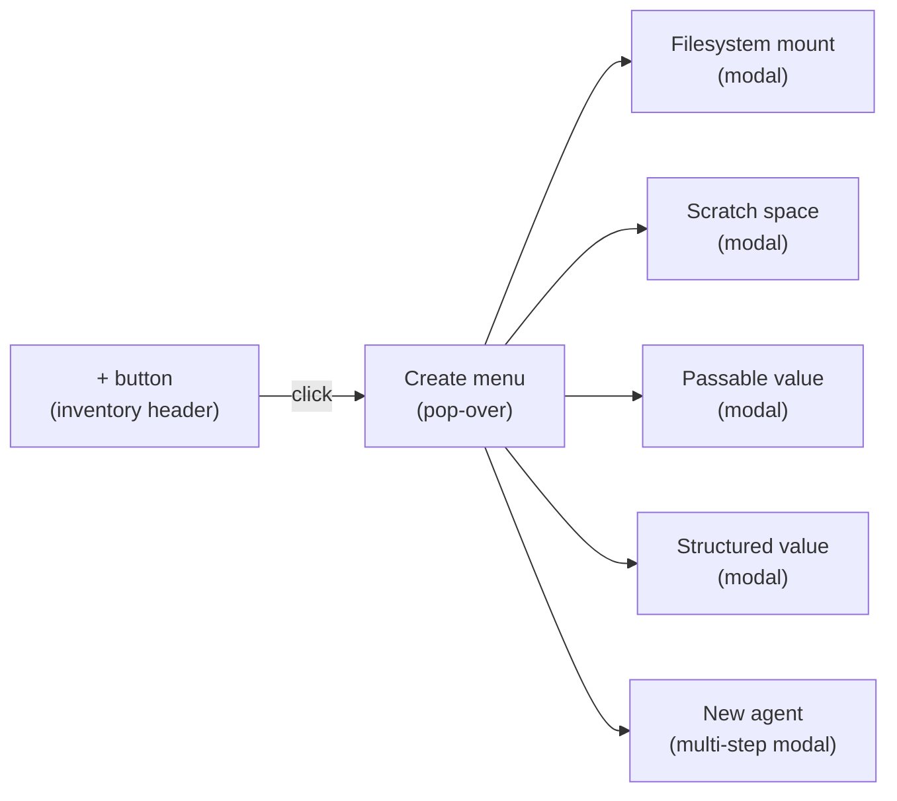
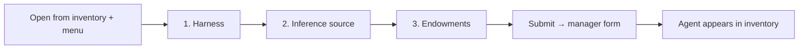
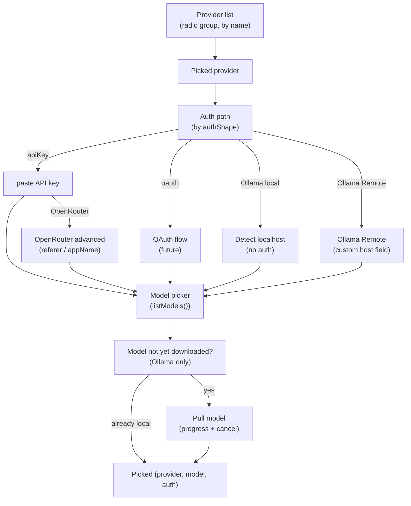

# Chat Inventory Create Menu

| | |
|---|---|
| **Created** | 2026-06-02 |
| **Updated** | 2026-06-14 |
| **Author** | Kris Kowal (prompted) |
| **Status** | Not Started |

## What is the Problem Being Solved?

The Chat UI inventory is read-mostly today.
A user can inspect, remove, expand, and rename existing pet names, but every kind of item that lives in the inventory (filesystem mounts, scratch spaces, passable values, structured values, agents) is created by a side channel: a CLI verb, a setup script run from a checkout, or a form that the user has to chase down in `@host`'s inbox.

The Familiar packaged build is the first surface where users have no shell beside the Chat UI.
A user who installs Familiar from a `.dmg` cannot pop a terminal to run `endo mount`, `endo mkscratch`, `endo storeValue`, or `endo run --UNCONFINED setup.js`.
For Chat to be a self-sufficient first surface, the inventory needs an in-band way to create the kinds of things that live in it.

The maintainer's directive (verbatim in [§ Prompt](#prompt)) names the affordance: a `+` button on the inventory whose menu lists the whole-cloth item types Chat can mint.
The original prompt placed the button at the bottom of the inventory; the maintainer's subsequent directive on PR #404 moved it to the top, and this design follows the revised placement.
The substantive complexity sits inside the new-agent flow, which the existing form-based provisioning ([lal-fae-form-provisioning](lal-fae-form-provisioning.md)) covers for credentials but does not yet cover for endowment selection, provider selection (without URLs), or harness selection.

This design extends the existing primitives.
It does not introduce new daemon machinery; it composes the form ([daemon-form-request](daemon-form-request.md)), value-message reply ([daemon-value-message](daemon-value-message.md)), mount ([daemon-mount-capabilities](daemon-mount-capabilities.md)), and provider ([endopi-provider-registry-and-oauth](endopi-provider-registry-and-oauth.md)) shapes that already exist or are designed.

## Scope

In scope:

- The `+` button affordance at the top of the inventory and its pop-over menu.
- Per-item-type create flows for: filesystem mount, scratch space, passable value, structured value, new agent.
- The new-agent flow's three substantive layers: endowment selection, inference-source selection, harness selection.

Out of scope:

- New daemon-side message types or capability shapes.
  Every primitive this design uses already exists or is designed in the cited documents.
- The Familiar weblet hosting layer or the packaging story.
  This design assumes Chat already runs.
- Multi-host agent provisioning or cross-fork ferry shapes.
  Single-host, single-user surfaces only.

## UI Affordance

### Placement

The `+` button sits at the top of the inventory panel ([chat-components § Inventory Panel](chat-components.md)), not on the spaces gutter.

The spaces gutter already has a `+` button ([chat-spaces-gutter § User Interactions](chat-spaces-gutter.md) item 3) that opens a dialog to add a new *space* (a bookmark into the capability graph, pointing at an existing guest).
That affordance is about navigation, not creation: it picks an item that already exists and pins it to the gutter.
The new affordance is about *minting* a fresh item under the current profile, which is what the inventory shows.
Separating the two prevents the gutter `+` from drifting into a multi-purpose menu and keeps each `+` action one click from its target surface.

The button is rendered as a header row in the inventory panel, immediately above the first name, styled consistently with the inventory item rows (dashed border, `+` glyph, hover affordance).
A click opens the create menu anchored to the button.

### Menu shape

The menu is a pop-over anchored to the button (not a modal).
Modal usage in Chat today is reserved for forms that need keyboard focus and multi-step entry (add-space-modal, edit-space-modal, eval-form).
A pop-over fits Chat's structured-input-over-text-parsing principle ([chat-invariants § Design Principle 1](chat-invariants.md)) without taking over the screen: it surfaces the item-type choice as a list, then hands off to the right modal or inline form for each type.

The menu items honor the same keyboard discipline as the slash-command selector ([chat-invariants § Autocomplete Invariant 6](chat-invariants.md)): arrow keys to navigate, Enter to pick, Escape to dismiss.
Each menu item carries an icon and a one-line description so the user can recognize the item type without prior familiarity.

### Mode discipline

Per the modeline-completeness and keyboard-manual-parity invariants ([chat-invariants § 1, 2](chat-invariants.md)) the modeline shows the keyboard shortcut for `+` (the menu is also reachable via a slash command, `/create`, for keyboard users) and every menu item has a mouse-clickable entry.

## Whole-cloth Item Types

### 1. Filesystem mount

A live mount of a host directory ([daemon-mount-capabilities](daemon-mount-capabilities.md)).
Backed by `E(powers).provideMount(absolutePath, petName)` (per [daemon-mount § Implemented](daemon-mount.md)).

Create-flow fields:

| Field | Source | Validation |
|---|---|---|
| Pet name | text | non-empty; not already in scope; not a reserved special name |
| Host path | host filesystem picker, or text fallback | resolves; is a directory; not a symlink leading out of `$HOME` |

The host-filesystem picker is a future enhancement.
In its absence the Chat UI accepts a typed absolute path and surfaces the daemon's `EACCES` or `ENOTDIR` rejection as a per-field error bubble.
The Familiar Electron shell already has `dialog.showOpenDialog`; routing through it is a follow-up.

On submit, the form calls `E(powers).provideMount(hostPath, petName)`.
The new mount appears in the inventory under the chosen pet name.

### 2. Scratch space

An ephemeral mount with daemon-owned storage ([daemon-mount § Implemented](daemon-mount.md) `provideScratchMount`).
The host directory is allocated under the daemon's `statePath`.

Create-flow fields:

| Field | Source | Validation |
|---|---|---|
| Pet name | text | non-empty; not already in scope; not a reserved special name |

Lifecycle:
A scratch mount lives as long as its pet name is reachable.
Removing the pet name from every directory that holds it (typically just the current host) makes the formula unreachable; the daemon's content-store gc reclaims the on-disk storage ([daemon-content-store-gc](daemon-content-store-gc.md)).
The Chat UI does not surface "delete this scratch space" beyond the existing inventory `×` button; the gc is the durability story.

### 3. Passable value

A primitive, list, or record stored as a value formula ([daemon-value-message § Message formula persistence](daemon-value-message.md)).
The primitives `null`, booleans, numbers, bigints, strings, symbols are accepted, as are lists and records of primitives.
Remotable references are *not* accepted from this surface: they require a source capability, which the inventory create flow does not produce.

Create-flow fields:

| Field | Source | Validation |
|---|---|---|
| Pet name | text | non-empty; not already in scope; not a reserved special name |
| Value | text area, parsed as SmallCaps | passes `@endo/marshal` parse; resolves to a passable value |

On submit, the form parses the SmallCaps text via `@endo/marshal`'s `decodeFromSmallcaps`, calls `E(powers).storeValue(marshalledText)`, and writes the resulting formula under the chosen pet name.
The Monaco editor wrapper ([chat-components § Eval Components](chat-components.md) `monaco-wrapper.js`) is reused for the value text area so the same syntax-highlighting and parse-feedback users already see in the eval form covers the value-create flow.

### 4. Structured value

A passable value that conforms to a `@endo/patterns` pattern ([daemon-form-request § FormField pattern](daemon-form-request.md), which uses the same machinery).
The create flow asks for a pattern first, then renders a per-field form derived from the pattern's `M.splitRecord` / `M.arrayOf` shape.

Create-flow fields, layered:

1. **Pattern**: SmallCaps text, parsed via `@endo/patterns`'s `decodePattern`.
2. **Per-field values**: rendered from the pattern's split.
   Each field's input widget is derived from the field's leaf pattern (`M.string()` → text input, `M.number()` → numeric input, `M.boolean()` → checkbox, `M.or(...)` → select).
3. **Pet name**: where to retain the value.

On submit, the daemon stores the value and the pattern together (the existing form machinery already supports this).
The structured value appears in the inventory; clicking it surfaces the field values in the value modal, with the pattern shown alongside.

Note:
Pattern authorship from inside Chat is the cognitive load this flow carries.
The intent is not that a typical user writes patterns; the intent is that a power user or an agent that wants to coordinate with a typed shape can mint a structured value without leaving Chat.
A future iteration may add a pattern picker that selects from a curated set; this design does not block on that.

### 5. New agent

The substantive flow, designed below in [§ New-Agent Workflow](#new-agent-workflow).

## New-Agent Workflow

The new-agent create flow extends, but does not replace, the form-based provisioning in [lal-fae-form-provisioning](lal-fae-form-provisioning.md).
That design already covers:

- a manager guest (`@lal` / `@fae` / `@genie`) that sends a configuration form on startup
- form fields for `name`, `host`, `model`, `authToken`
- value-message reply semantics
- guest provisioning via the manager's `@agent` introduction

What that flow does *not* cover, and what this design adds, is the Chat-UI surface that:

1. picks the harness (Lal / Fae / Genie),
2. picks the inference source by name (not by URL),
3. picks the initial endowments,
4. and routes the chosen values into the existing form submission shape.

### Three-pane wizard

The create-agent flow is a three-pane wizard rendered in a single modal:

Each pane is a step the user can navigate forward and back (per the keyboard-manual-parity invariant: `Tab` / `Shift-Tab` between fields, arrow keys within a list, `Enter` advances when the active control is the next-button, `Escape` cancels with confirmation).

### Pane 1: Harness selection

A radio-group list of available harnesses.
Today the harnesses are separate; the maintainer has named convergence on "a unified Endo agent harness" as a future direction, so the UI surfaces this as a transitional choice:

| Harness | Source package | Notes |
|---|---|---|
| Lal | [`packages/lal/`](../packages/lal/) | Reply-chain transcripts; static tools. |
| Fae | [`packages/fae/`](../packages/fae/) | Flat transcripts; dynamic tool discovery. |
| Genie | [`packages/genie/`](../packages/genie/) | Sandboxed workspace; tool set tuned for agentic coding via `@mariozechner/pi-ai`. |

Discovery:
The list is sourced from the introduced names in the current host's namespace.
If `@lal` is present, Lal is offered; if `@fae` is present, Fae is offered; if `@genie` is present, Genie is offered.
This is consistent with [familiar-bundled-agents](familiar-bundled-agents.md), which auto-registers `@lal` and `@fae` as special formulas in the packaged Familiar; a future packaging revision adds `@genie`.

A footer note next to the radio group reads:
"These harnesses will converge into a unified Endo agent harness; this choice will go away."
The note links to the open question section.

### Pane 2: Inference source selection

The user picks a *provider* by name and (within the chosen provider) a *model*.
URLs and per-provider configuration details are not surfaced.

Provider registry:
The list comes from the provider registry described in [endopi-provider-registry-and-oauth § Provider registry](endopi-provider-registry-and-oauth.md).
Each registry entry carries `name`, `apiStyle`, `authShape`, and a `listModels()` method.

The maintainer's four named providers, mapped onto registry entries (with one variant for remote Ollama):

| Provider | Registry name | `authShape` | First-class flow |
|---|---|---|---|
| Anthropic | `anthropic` | `apiKey` (Pro/Max OAuth in a later phase per endopi § Phases 3-4) | API-key paste; OAuth when shipped |
| OpenAI | `openai` | `apiKey` (Plus/Pro OAuth in a later phase) | API-key paste; OAuth when shipped |
| Ollama (local) | `ollama` | `none` | Auto-detect localhost:11434; query supported models including not-yet-downloaded; offer download |
| Ollama Remote | `ollama-remote` | `none` (default) or `apiKey` (per-host bearer) | Reveal custom host field; otherwise as Ollama local |
| OpenRouter | `openrouter` | `apiKey` plus optional `referer` / `appName` | API-key paste; advanced disclosure for HTTP-Referer and X-Title attribution fields |

The UI shape:

Hiding the URL:
The registry entry holds the canonical base URL per provider.
For Anthropic, OpenAI, and OpenRouter the URL is the provider's documented public endpoint.
For Ollama (local) the registry entry's default is `http://127.0.0.1:11434`; the create-agent UI auto-fills it.
For users running Ollama on a remote machine, *Ollama Remote* is a distinct provider entry in the registry (not an "Advanced" disclosure on the local row) so the URL field surfaces only when the user explicitly picks that variant.
The framing on the UI reads "Ollama Remote (running on another machine)" rather than naming a URL, keeping the maintainer's "without having to know the details of how they are configured" discipline.
OpenRouter's per-request attribution headers (HTTP-Referer, X-Title) sit behind a small "Attribution (optional)" disclosure on the OpenRouter row; the defaults are an Endo-identifying referer and the user's chosen pet name, and the disclosure exists for users who want explicit control over the attribution OpenRouter exposes to upstream providers.

Model discovery:
Once a provider is picked, the UI calls the registry entry's `listModels()` and renders the returned list.
For providers that require an API key before model listing (Anthropic, OpenAI, OpenRouter), the API-key paste happens first; for Ollama (local or remote), model listing works without auth.
The Ollama registry entry's `listModels()` returns *both* the locally-installed models (from `/api/tags`) *and* the supported models the user could pull (from the curated catalog in `pi-ai`'s Ollama adaptor, per [endopi-provider-registry-and-oauth § buildOllamaModel masquerade](endopi-provider-registry-and-oauth.md)).
The picker renders both kinds in one list with a visible state badge ("local" vs "not downloaded").
Pre-known model lists are cached in the registry as a fallback so the picker is responsive even when the network is slow.

Model download (Ollama):
When the user picks a "not downloaded" model, the UI offers to pull it via `/api/pull` and surfaces the pull's progress (total bytes, downloaded bytes, current layer) with a cancel control.
On success, the badge flips to "local" and the user proceeds to the next pane.
On failure (network, disk full, model not found upstream), the failure surfaces as a per-field error bubble and the user can retry or pick a different model.
The download happens through the daemon's `pi-ai` Ollama adaptor; Chat does not speak directly to the Ollama HTTP API.
This is the maintainer's COMMENTED-review ask ("if we can, we should also add support for querying ollama supported models and providing a menu, including the option of downloading a supported model that is not yet downloaded") encoded as part of the create-agent flow.

OAuth as a future phase:
Subscription OAuth (Claude Pro/Max, ChatGPT Plus/Pro) is in [endopi § Phases 3-4](endopi-provider-registry-and-oauth.md); when those land, the auth-path row for Anthropic and OpenAI gains an OAuth button alongside the API-key paste.
This design's UI accommodates the future row without depending on it (the `authShape` switch is the seam).

### Pane 3: Endowment selection

A checklist of capabilities to introduce into the new agent guest at provisioning time.
Each row carries a label, a one-line description, and a control sized to the endowment's shape.

The pane enumerates the nine rows of the capability bank as described in [daemon-capability-bank § Capability families](daemon-capability-bank.md).
Filesystem is shippable today via the mount-create composition; the other eight rows ship as documented placeholders that surface the architectural direction without offering a half-implemented control.
The system is extensible: as each row's substrate design lands, the pane gains a working control without changing pane 3's shape or surrounding panes.

| Row | Substrate | Today | Future |
|---|---|---|---|
| `@main` worker | [familiar-bundled-agents § Specials](familiar-bundled-agents.md) | Omitted by default. The agent already runs on `@main`; an explicit row would imply a per-tool / per-tier worker choice the unified harness has not yet exposed. | Becomes selectable when the unified harness lands and a per-tool / per-tier worker shape is offered. |
| `@fs` (filesystem) | [daemon-mount](daemon-mount.md), [daemon-mount-capabilities](daemon-mount-capabilities.md) | Omitted by default; opt-in selects either a *scratch* mount ([daemon-mount § `ScratchMount`](daemon-mount.md)) or a *snapshot* of an existing mount, or picks an existing mount-cap from the inventory, or "create new" which inlines the [§ Filesystem mount](#1-filesystem-mount) flow. When coupled with `@main`, the pair backs a posix sandbox: the `@fs` mount becomes the filesystem the worker on `@main` sees as its root. | Per [daemon-mount-capabilities](daemon-mount-capabilities.md) when capability VFS lands; the row's value type changes from "one mount cap" to "a composed VFS namespace". |
| Process execution (`@node`) | [daemon-capability-bank § Process execution](daemon-capability-bank.md), [daemon-mount-capabilities § Phase 4](daemon-mount-capabilities.md) | Omitted by default; opt-in not recommended outside a posix-sandboxed `@fs` + `@main` composition. A child-process / shell capability without a confinement story is a foot-gun for new users. | Per the OS-sandbox direction in [daemon-capability-bank § Process execution](daemon-capability-bank.md); sandboxed by default once the substrate ships. |
| Network | [daemon-capability-bank § Network](daemon-capability-bank.md), `endoclaw-network-fetch` | Omitted by default; documented placeholder. | Bound to a denial-pattern-attenuated fetch endowment with a per-origin allow / deny shape per the capability bank's principle 4. |
| Git operations | [daemon-git-capability](daemon-git-capability.md), [daemon-git-remotes](daemon-git-remotes.md) | Omitted by default; documented placeholder. The git trio (`daemon-git-capability`, `daemon-git-remotes`, `daemon-git-next-steps`) is in flight; pane 3's row activates once the canonical `@git` endowment shape lands. | Composed with `@fs` (workspace) and optionally `@network` (remotes); ASKPASS injection per the substrate's credential-injection mechanism. |
| Environment variables | [daemon-capability-bank § Environment variables](daemon-capability-bank.md) | Omitted by default; documented placeholder. | A per-key attenuation map (`KEY → value | <prompt>`); the agent only sees the keys the user explicitly grants. |
| Credential store | [endopi-provider-registry-and-oauth § Encrypted-at-rest credentials](endopi-provider-registry-and-oauth.md) and the sibling design at [§ Open Questions](#open-questions) | Omitted by default; documented placeholder. The wizard's own provider-credential paste (pane 2) lands in the root host agent pet store with encryption per the sibling design; the *Credential store* endowment is for *other agents* sharing the credential set. | A per-provider attenuation that lets a delegate agent draw on a subset of the user's credentials without re-pasting. |
| User I/O | [daemon-capability-bank § User I/O](daemon-capability-bank.md) | Omitted by default; documented placeholder. The agent's reply chain already routes through Chat; an explicit User-I/O endowment is for *other* surfaces (Electron notifications, the Familiar tray icon) per `endoclaw-notifications`. | Bound to the Electron Notification API per the existing notifications design. |
| Timer | [daemon-capability-bank § Timer](daemon-capability-bank.md), `endoclaw-timer` | Omitted by default; documented placeholder. | Bound to the daemon's existing timer formula; rate-limited per the capability bank's principle 4 (denial patterns). |
| Delegates | [daemon-capability-bank § Delegates](daemon-capability-bank.md) | Omitted by default; documented placeholder. A *delegate* row endows the new agent with the right to *create* further agents (recursive attenuation per capability-bank principle 2). | A picker over the user's other host agents and a quota shape per the capability bank's principle 4. |

Today's minimum:
Only the `@fs` row offers a working control today; opt-in selects scratch, snapshot, or an existing mount-cap.
The other eight rows are documented placeholders.
The default for every row is *omitted*: capability-bank principle 4 (the absence of a capability is the safer default) governs the wizard.

Posix sandbox composition:
The `@fs` and `@main` rows can be coupled to back a posix sandbox without a new endowment type.
When both are picked together, the wizard offers a "make this a posix sandbox" checkbox that wires the `@fs` mount as the worker's filesystem root.
This is the same composition the maintainer named on inline 289 ("the `@fs` and `@main` bindings can be coupled for a posix sandbox"); pane 3 surfaces it as a checkbox rather than a third endowment type.

The endowment selection is rendered as the third pane of the wizard rather than as a sub-pane of harness selection, because the same endowment shape applies regardless of harness; the harness affects what the agent *does* with the endowment, not what the endowment is.

### Submit: Routing to the manager's form

When the user clicks Submit on pane 3, the Chat UI does *not* speak to a new daemon API.
It does what the user would do manually: it submits the chosen harness's outstanding configuration form.

The submitted values map onto the form fields the manager already accepts ([lal-fae-form-provisioning § Form Fields](lal-fae-form-provisioning.md)):

| Wizard input | Form field |
|---|---|
| Pet name | `name` |
| Provider base URL (from registry entry) | `host` |
| Picked model | `model` |
| API key paste (or OAuth token, future) | `authToken` |
| Endowments (the cap-pet-names picked in pane 3) | `introducedNames` |

The endowment delivery:
The manager's existing `provideGuest(name, { introducedNames })` shape ([lal-fae-form-provisioning § Form submission from @host already serves as the consent mechanism](lal-fae-form-provisioning.md)) is the endowment-delivery field; pane 3's picked endowments thread through `introducedNames` directly, no follow-up `introduce` call is needed.
The wizard maps each picked endowment to a `{ <picked-pet-name>: <cap-pet-name> }` entry; the manager's form-submission handler passes the record through to `provideGuest` unmodified.
This is the maintainer's clarification on inline 495 ("I think we can use introducedNames to endow the guest"); the prior "follow-up `introduce` per endowment" framing was an artifact of an earlier draft that did not recognize `introducedNames` as the substrate.

### Result

The newly created agent appears in the inventory under its chosen pet name, with the spaces-gutter `+`-add-existing-space flow available to pin it as a navigable space (the existing gutter `+` flow stays unchanged).

## Cross-Design Alignment

### Relationship to `endo-gateway-mcp`

[endo-gateway-mcp § Affordance 1: create an agent](endo-gateway-mcp.md) (merged today) also names a "+ Add agent" Chat-UI surface that "routes to the existing form".
That design's affordance is a single button on the spaces gutter that opens the manager's form directly.

Reconciling: this design's create-agent flow is the *parent affordance* into which `endo-gateway-mcp`'s "+ Add agent" plugs.
Specifically:

- The maintainer's framing in this design's prompt names a richer flow (provider selection without URLs, endowment selection, harness selection) than `endo-gateway-mcp`'s one-button route.
- The richer flow renders the manager's form *plus* the harness pane *plus* the provider pane *plus* the endowment pane, then submits the form on the user's behalf with the assembled values.
- `endo-gateway-mcp`'s "Affordance 1" is satisfied by this design: a `+ Add agent` entry exists; clicking it opens this design's three-pane wizard rather than the manager's bare form.
  The wizard fills in the form on the user's behalf, so the manager's form-handling code path (the substrate `endo-gateway-mcp` depends on) does not change.

In other words, this design subsumes `endo-gateway-mcp`'s create-agent UI section without invalidating the rest of that design (the MCP `/mcp` endpoint, the bearer token, the MCP-config retrieval tab).
The MCP-config retrieval tab (Affordance 2 in `endo-gateway-mcp`) is unaffected: this design does not touch the per-space MCP tab.

A note in the new design's text directs future readers to this design as the canonical create-agent UI; the corresponding update to `endo-gateway-mcp` is a follow-up edit, not a blocker for this design's PR.

### Relationship to `chat-spaces-gutter`'s existing `+`

The spaces gutter's `+` button ([chat-spaces-gutter § User Interactions](chat-spaces-gutter.md) item 3) stays as it is: a navigation affordance, not a creation affordance.
A user who creates a new agent via the inventory `+` and then wants to pin it to the gutter uses the gutter `+` afterward.

A future iteration may add a "Pin to gutter" checkbox to this design's new-agent submit pane, so the user can do both actions in one trip.
The design records this as a future enhancement rather than coupling the flows now.

### Relationship to `lal-fae-form-provisioning`

Chat absorbs the provisioning entry point.
The daemon-side substrate stays: the form ([daemon-form-request](daemon-form-request.md)), the value-message reply ([daemon-value-message](daemon-value-message.md)), the `@agent` introduction, the manager loop, the worker spawn, and the inbox-as-durable-config-store property all persist.
What moves out of the daemon is the *role of the daemon as the provisioning entry point*: provisioning becomes a dependency of the Chat application, not a dependency of the daemon.
Chat installs the provisioning capabilities on the root host agent and replays the inbox on first launch so the durability property is preserved.
This is the maintainer's directive on inline 363 ("my intention is that this should replace lal fae form provisioning. Provisioning becomes a dependency of the Chat application but not a dependency of the daemon. This requires Chat to install the provisioning capabilities in the root host agent").

### Root host agent as a special place

The maintainer's inline 363 also names a *user / user-profile* split on top of the root host agent:

> Chat should arrange for a user host agent, named like `user` and `user-profile`, then treat that as the primary user, to hide capabilities like the agent provisioner from the UX. We can add an `@root` endowment to all Endo hosts so the user can enter from below.

The user-host's role:
The root host agent becomes a special place that holds the provisioning capabilities Chat installs.
A user host agent (named `user`) and its profile (`user-profile`) sit one level below the root and become the primary identity the Chat UX shows.
Capabilities like the agent provisioner stay on the root host; the user-host has the user-facing pet names and the spaces the user navigates day-to-day.
This isolates provisioning machinery from the day-to-day UX surface without hiding it: a power user can still navigate up to the root.

The `@root` endowment:
Adding `@root` as a special name on every Endo host (alongside the existing `@self`, `@host`, `@agent`, `@keypair`, `@main`, `@endo` per [d256 § Per-agent keypairs](d256.md) and the broader special-name idiom) gives every host a stable way to reach the root host agent.
Familiar precedent: the `@apps` special name in [familiar-bundled-agents § Specials](familiar-bundled-agents.md) is preformulated at daemon initialization, before root host / pet stores / guest profiles exist; `@root` lands as a sibling Specials entry that names the root host formula.
A separate designer dispatch authors the full design (see [§ Open Questions](#open-questions) question 8); this design's contribution is the directive's encoding and the link to the existing precedent.

The implementation cascade:
For this design, the cascade is: Chat installs the provisioning capabilities in the root host agent's pet store; the user host agent's namespace presents the inventory the user sees; the `@root` endowment is the path back up when the user (or an agent on behalf of the user) needs to reach the provisioning capabilities.
A separate designer dispatch (see [§ Open Questions](#open-questions) question 8) authors the full design.

The pet-store shape:
The root host agent's pet store is the typed namespace where Chat installs the provisioning capabilities.
This composes existing daemon primitives ([daemon `pet-store.write` / `list` / `lookup` / `remove`](chat-spaces-gutter.md), `host.storeValue`) without a new daemon API; the discipline matches the chat-spaces gutter precedent of "typed namespace over the untyped pet-store" (per [chat-spaces-gutter § Space model and persistence](chat-spaces-gutter.md)).

### Relationship to `endopi-provider-registry-and-oauth`

Dependency.
The provider registry shape this design's pane 2 depends on is the registry that `endopi-provider-registry-and-oauth` specifies.
That design's status is "Proposed (partially satisfied)" via Genie's existing dependency on `pi-ai`; this design's pane 2 works against whichever registry shape lands, with `pi-ai`'s registry as the most-likely substrate.

### Dependencies summary

| Design | Relationship |
|---|---|
| [chat-spaces-gutter](chat-spaces-gutter.md) | Sibling affordance; placement reference. The inventory `+` is distinct from the gutter `+`. |
| [chat-spaces-home](chat-spaces-home.md) | Sibling; provides the per-space view the created agent will appear in. |
| [chat-components](chat-components.md) | Hosting surface; the inventory panel and modal-component conventions. |
| [chat-invariants](chat-invariants.md) | Keyboard / mouse parity, modeline completeness, autocomplete navigation rules apply to the pop-over menu and the modal panes. |
| [daemon-form-request](daemon-form-request.md) | Substrate for the manager's configuration form (already implemented). |
| [daemon-value-message](daemon-value-message.md) | Substrate for the manager's reply. |
| [daemon-mount-capabilities](daemon-mount-capabilities.md) | Substrate for the `@fs` endowment and the filesystem-mount item type. |
| [daemon-capability-filesystem](daemon-capability-filesystem.md) | Reference for the future VFS direction the `@fs` endowment grows into. |
| [daemon-capability-bus](daemon-capability-bus.md) | Reference for the passable / structured value item types. |
| [familiar-bundled-agents](familiar-bundled-agents.md) | Names `@lal`, `@fae`, and (future) `@genie` as the discoverable harnesses; precedent (`@apps` Specials entry) for the future `@root` endowment. |
| [endopi-provider-registry-and-oauth](endopi-provider-registry-and-oauth.md) | Substrate for pane 2's provider list, per-provider auth shape, encrypted-at-rest credential discipline, and Ollama-model discovery via the `pi-ai` adaptor. |
| [lal-fae-form-provisioning](lal-fae-form-provisioning.md) | Substrate (daemon-side) for the manager's form, value-message reply, and `provideGuest({ introducedNames })` shape; Chat absorbs the provisioning entry point on top per Design Decision 7. |
| [endo-gateway-mcp](endo-gateway-mcp.md) | Adjacent design whose "+ Add agent" affordance plugs into this design's wizard. |
| [daemon-capability-bank](daemon-capability-bank.md) | Roster source for pane 3's nine endowment rows and the six design principles the wizard cites. |
| [daemon-mount](daemon-mount.md) | Substrate for the `@fs` row's *scratch* and *snapshot* alternatives, and for the posix-sandbox composition with `@main`. |
| [d256](d256.md) | Per-agent keypairs and the special-name idiom on hosts and guests (`@self`, `@host`, `@agent`, `@keypair`, `@main`, `@endo`); precedent for the future `@root` special name. |
| [chat-spaces-gutter](chat-spaces-gutter.md) (already cited above) | The "typed namespace over the untyped pet-store" precedent the root host agent's pet store follows. |

## Files Expected to Be Modified

| File | Change |
|---|---|
| `packages/chat/inventory-component.js` | Render the `+` header row; wire to the create menu. |
| `packages/chat/create-menu.js` | New: the pop-over menu factory. |
| `packages/chat/create-mount-modal.js` | New: the filesystem-mount modal. |
| `packages/chat/create-scratch-modal.js` | New: the scratch-space modal. |
| `packages/chat/create-passable-modal.js` | New: the passable-value modal (Monaco-backed). |
| `packages/chat/create-structured-modal.js` | New: the structured-value modal (pattern + per-field). |
| `packages/chat/create-agent-modal.js` | New: the three-pane new-agent wizard. |
| `packages/chat/provider-registry-client.js` | New: client-side proxy for the daemon-side provider registry. |
| `packages/chat/index.css` | Styles for the menu and the new modals. |
| `packages/chat/command-registry.js` | Add `/create` slash command for keyboard access. |
| `packages/chat/chat.js` | Wire the new components into the inventory panel. |

No daemon-side changes are anticipated for the create-menu itself.
The provider-registry and endowment-form-field follow-ups (in [§ Open Questions](#open-questions)) are independent designs.

## Phased Implementation

### Phase 1: Inventory `+` and menu

Render the inventory header row and the pop-over menu.
Wire the menu items as no-op handlers so the affordance is visible without committing to any item type.
A Playwright smoke test ([chat-playwright-smoke](chat-playwright-smoke.md)) covers the header-row render and the menu open / dismiss / arrow-navigation.

### Phase 2: Filesystem mount, scratch space, passable value

Implement the three create flows that depend only on already-shipped daemon primitives ([daemon-mount § Implemented](daemon-mount.md), [daemon-value-message § Complete](daemon-value-message.md)).
Each flow's modal lands with a unit test (modal renders, submit calls the right `E(powers).<verb>(...)`, error states surface as field-level bubbles).

### Phase 3: Structured value

Land the pattern picker and the per-field renderer.
The renderer's leaf-pattern → input mapping is the load-bearing piece; it gets its own coverage.

### Phase 4: New-agent wizard, no endowments yet

Render the three panes.
Pane 3's endowment list ships as a documentation-only checklist.
Submit routes to the manager's existing form with `name` / `host` / `model` / `authToken`.
The provider list in pane 2 ships as a static list of four providers with hardcoded base URLs (the registry shape from [endopi-provider-registry-and-oauth](endopi-provider-registry-and-oauth.md) is in flight; Phase 4 ships against whatever shape exists at the time and the registry-client adapts).

### Phase 5: Endowment delivery

Once the endowment-form-field follow-up design lands (see [§ Open Questions](#open-questions)), pane 3's controls become functional and the manager's form accepts an `endowments` field.

### Phase 6: OAuth providers

When [endopi-provider-registry-and-oauth § Phases 3-4](endopi-provider-registry-and-oauth.md) land, pane 2's auth-path row gains the OAuth button for Anthropic and OpenAI subscriptions.

## Design Decisions

1. **Inventory header, not gutter header.**
   The gutter `+` is a navigation affordance (pin existing); the inventory `+` is a creation affordance (mint new).
   Separating them keeps each `+` action one click from its target surface and prevents either menu from drifting into a multi-purpose mega-menu.
   The `+` sits at the *top* of the inventory rather than the bottom so it is visible without scrolling once the inventory grows past one screen; per the maintainer's PR #404 directive.

2. **Pop-over for type pick, modal for parameter entry.**
   The type pick is a single-choice; pop-over is the lightweight affordance.
   Parameter entry is multi-field with validation; modal is the right surface.

3. **Wizard, not single modal, for new-agent.**
   The three substantive layers (harness, inference source, endowments) compose in a forward-then-back shape that fits a three-pane wizard.
   Cramming them into a single modal would either fail to expose the layering or render a wall of controls.

4. **Provider list by name, URL hidden; Ollama Remote as a distinct provider, not an Advanced disclosure.**
   The maintainer's "without having to know the details of how they are configured (URLs)" framing.
   Hidden URLs land via the registry entry's `name` → canonical base URL mapping.
   For Ollama on a remote machine the variant is a separate provider entry ("Ollama Remote") with its own host field, not an Advanced disclosure on the local row; this keeps the local row free of URL fields and surfaces the host only when the user explicitly picks the remote variant.

5. **Harness selection surfaced as transitional.**
   The maintainer's "until these converge on a unified Endo agent harness" framing.
   The pane carries a note pointing to the open question; when the unified harness ships, the pane collapses into a single hidden choice.

6. **Endowment selection is the third pane, not nested under harness.**
   The endowment shape (which capabilities to introduce) is independent of harness behavior.
   Nesting endowments under harness would imply per-harness endowment sets, which is not the architectural direction (the capability bank is harness-agnostic).

7. **Chat absorbs the provisioning entry point; daemon-side substrate stays.**
   Per the maintainer's directive on inline 363, Chat installs the provisioning capabilities in the root host agent and becomes the entry point for new-agent provisioning.
   The lal-fae *daemon-side substrate* persists: the form ([daemon-form-request](daemon-form-request.md)), the value-message reply ([daemon-value-message](daemon-value-message.md)), the `@agent` introduction, the manager loop, the worker spawn, and the inbox-as-durable-config-store property all stay.
   What retires is the daemon's role as the *provisioning entry point*: the CLI flow and the standalone-setup flow continue to work against the substrate, but the canonical user-facing entry point is Chat.
   Chat replays the inbox on first launch so the durability property is preserved.

8. **No new daemon API for the menu itself.**
   Every item type's create flow composes existing daemon methods.
   The two open follow-ups (endowment form field, provider registry shape) are independent designs that this design depends on but does not author.

## Open Questions

1. **Provider credentials live in the root host agent pet store, encrypted at rest.**
   The maintainer's inline 477 directive ("Let's use the root host agent pet store. Please dispatch a designer to ensure formulas are encrypted at rest") routes provider credentials (pasted API keys, future OAuth tokens) into the root host agent's pet store under a typed sub-namespace, with formula encryption at rest matching the discipline in [endopi-provider-registry-and-oauth § Encrypted-at-rest credentials](endopi-provider-registry-and-oauth.md).
   The encryption shape itself (key derivation, per-formula vs. per-store) is the subject of a sibling designer dispatch authored separately under the slug `chat-inventory-encrypted-formulas` (see [§ Sibling designer dispatches](#sibling-designer-dispatches)).
   This design's pane 2 commits to *where* credentials land (the root host pet store, under Chat's typed namespace); the sibling design owns *how* they are encrypted.

2. **Provider-key recovery and rotation: deferred to a sibling design.**
   The recovery problem parallels the public-key recovery gap in `gateway-key-recovery.md`.
   If a user loses their Anthropic API key paste, do they re-paste, or is there a recovery flow?
   For OAuth tokens that expire, who refreshes?
   Per the maintainer's inline 484 directive ("Agree this is a separate design. Dispatch a designer to leave a place-holder for this complication"), the recovery story is a separate design authored under a sibling-designer dispatch (slug to be named by the maintainer; see [§ Sibling designer dispatches](#sibling-designer-dispatches)).
   This design's pane 2 leaves a "rotate" affordance per-provider as a placeholder; the sibling design defines what the affordance does.

3. **Ollama Remote as a distinct provider; local row stays clean.**
   The auto-detect-localhost path is the default for the Ollama (local) registry entry.
   A user pointing at a remote Ollama daemon picks the *Ollama Remote* provider entry, which surfaces a host field as a first-class control (not an Advanced disclosure on the local row).
   The framing on the UI reads "Ollama Remote (running on another machine)" rather than naming a URL, matching the maintainer's "without having to know the details of how they are configured" framing.

4. **Endowment delivery: `provideGuest({ introducedNames })` is the field.**
   *Resolved.*
   Per inline 495, the existing `introducedNames` parameter on `provideGuest` is the endowment-delivery substrate; pane 3's picked endowments thread through directly.
   No follow-up `introduce` call and no new form field are required.
   The earlier framing here (a hypothetical `lal-fae-form-provisioning-endowments.md` sibling) is retired; the manager's existing form-submission handler passes `introducedNames` through unmodified.

5. **Harness convergence path.**
   The maintainer named "until these converge on a unified Endo agent harness" in the prompt; the convergence design itself is not in the corpus today.
   When that design lands, this design's pane 1 collapses; the convergence design's exit criterion should name this design's pane 1 as one of the deprecations.
   The maintainer's inline 499 ("Agreed.") confirms the transitional framing on pane 1; no further change here.

6. **Root host agent, user-host split, and the `@root` endowment: sibling design.**
   Per the maintainer's inline 363 directive, a separate designer dispatch authors the design that names the *user / user-profile* split on top of the root host agent and the `@root` endowment registered alongside the other special names per [d256 § Per-agent keypairs](d256.md).
   This design's contribution is the encoding of the directive (in [§ Root host agent as a special place](#root-host-agent-as-a-special-place) above) and the cascade for how Chat installs provisioning capabilities on the root and exposes user-facing surfaces through the user host.
   The sibling design owns the full shape (`@root` as a Specials entry analogous to `@apps`, the `user` / `user-profile` formula shapes, the lazy-vs-eager bootstrap question; see [familiar-bundled-agents § Three-option powers analysis](familiar-bundled-agents.md) for the parallel rubric).

7. **Discovery of the provider registry from the Chat client.**
   The registry lives daemon-side per [endopi-provider-registry-and-oauth § Provider registry](endopi-provider-registry-and-oauth.md).
   Chat needs a client-side proxy.
   The proxy shape (a special name like `@providers`, a host method like `listProviders()`, or a per-harness lookup) is undecided; the endopi design's resolution of this is the input.

8. **Item-type extensibility.**
   The five item types in this design are the maintainer's first cut.
   New item types (handle wrappers, channels, sub-mounts, blob uploads) are plausible additions.
   The menu shape accommodates more rows; the design does not block on choosing them.
   The pane 3 endowment roster has the same extensibility property: the nine rows mirror the [daemon-capability-bank](daemon-capability-bank.md) families, and new capability families surface as new rows without reshaping the wizard.

### Sibling designer dispatches

The maintainer's review directives on this PR explicitly call for three separate designer dispatches to author the work that this design touches but does not own:

| Trigger | Slug (proposed) | Owner of authorization |
|---|---|---|
| Inline 477 (root host pet store + encrypted at rest) | `chat-inventory-encrypted-formulas` | Maintainer; the slug is the designer's proposal pending confirmation |
| Inline 484 (provider-key recovery and rotation) | (to be named by the maintainer) | Maintainer; the scope (key recovery only, or also rotation and the gateway-key-recovery parallel?) is the maintainer's call |
| Inline 363 (`@root` endowment + user / user-profile split) | (to be named by the maintainer; candidate: `endo-root-special-and-user-host`) | Maintainer; the design composes [d256](d256.md), [familiar-bundled-agents](familiar-bundled-agents.md), and the root-host-pet-store directive on inline 477 |

This design does not author the three sibling designs in its own diff; doing so would inflate the PR beyond the maintainer's intended scope.
The dispatches surface as separate `message` entries to the steward and the maintainer per [garden/skills/dispatch-worktree/SKILL.md](../../skills/dispatch-worktree/SKILL.md), and each one originates its own designer dispatch when authorized.

## Prompt

> Please dispatch a designer to add a "+" button to the bottom
> of the inventory in Chat. This will bring up a menu of
> inventory items that can be created from whole cloth, like
> filesystem mounts, scratch spaces, arbitrary passable values,
> structured values, or new agents. The new agent workflow
> will need to enable the user to select the guest's intitial
> endowments. This will grow to include choosing whether to
> give them a `@main` worker endowment, and eventually also
> `@fs` or `@node` endowments. They will then have the option
> of selecting a source of inferrence for their agent/bot. We
> should make this as easy as possible to select from
> Anthropic, OpenAI, Ollama, or OpenRouter sources, without
> having to know the details of how they are configured
> (URLs). We should also give the option of using Fae, Lal, or
> Genie until these converge on a unified Endo agent harness.
