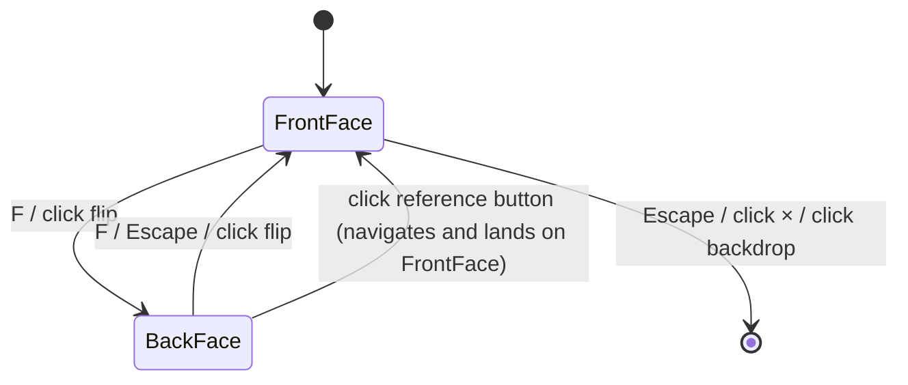
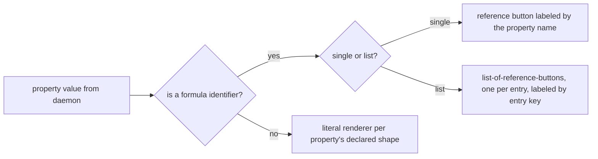
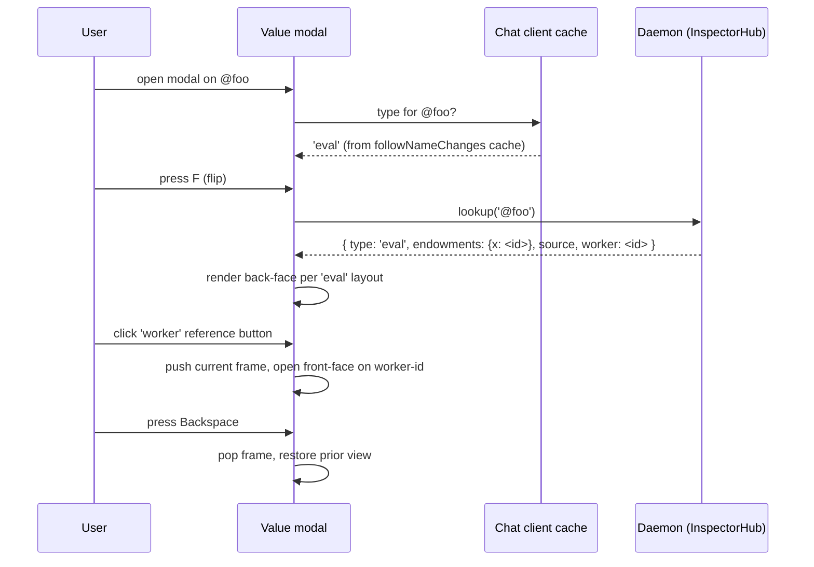

# Chat Value Modal Formula View

| | |
|---|---|
| **Created** | 2026-06-12 |
| **Author** | Kris Kowal (prompted) |
| **Status** | Not Started |

## What is the Problem Being Solved?

The Chat Value modal today shows the *rendered* value behind a pet name.
Many values are formulas that retain other formulas (an `eval` retains a `worker`, a `guest` retains a `host` and a `handle`, a `mount` retains its backing files, and so on).
Power users and developers cannot see this graph from the modal.
They have to consult the daemon directly or trace pet names by hand to understand what a value depends on.

This design adds a second face to the Value modal.
The front face stays as it is today (the rendered value plus identity surface per [`chat-command-bar.md`](chat-command-bar.md) § Value modal).
The back face is the *Formula view*: a layout dedicated to the value's formula type that lists every property of the formula and renders each retained reference as a button that navigates the modal to that referenced value.
The modal "flips" between the two faces.

## Cross-design coordination

[`formula-inspector.md`](formula-inspector.md) (Not Started, 2026-02-14) is the direct precedent.
Its scope is a "Formula Inspector" *panel* accessible from each inventory item (separate UI surface, with edit toggle and retention-path reveal), plus a daemon read API, plus a CLI `endo inspect`.
This design **cites** that one as the prior art and does **not** supersede it.
The two split as follows.

- The shared substrate is one: the per-type metadata catalog (`eval` → `endowments` + `source` + `worker`; `lookup` → `hub` + `path`; `guest` → `hostAgent` + `hostHandle`; `make-bundle` → `bundle` + `powers` + `worker`; `make-unconfined` → `powers` + `specifier` + `worker`; `peer` → `node` + `addresses`; etc.) is already implemented by `makePetStoreInspector` in `packages/daemon/src/daemon.js` lines 5704-5829 and exposed via `InspectorHubInterface.lookup()`.
  Both designs read from that surface.
- The Chat-side UX is *two* surfaces, not one.
  This design carves out the *in-modal* surface (a back-face flipped from the existing Value modal, reachable from the four entry points listed in [`chat-components.md`](chat-components.md) § Inventory panel and § Message display).
  The Inspector panel from `formula-inspector.md` remains a separate surface (a dedicated panel, opened from a wrench/gear icon on the inventory row, with read/edit toggle and retention-path reveal); it is not on the Value modal.
- The Chat-side editing affordance, the `endo inspect` CLI verb, and the retention-path reveal stay with `formula-inspector.md` and are out of scope here.
  This design is read-only and Chat-only.

When `formula-inspector.md` lands its panel, the per-type layouts it draws on are *the same* layouts this design defines, factored once into a shared component (see § Implementation notes).
The two designs are deliberately complementary: a quick in-modal flip for everyday use, plus a deeper panel with editing and retention paths for power users.

## Description of the Design

### The card-flip affordance

The Value modal grows a fourth action alongside the existing three (Close, Save, Enter Profile per [`chat-command-bar.md`](chat-command-bar.md) § Modal Actions).

| Action | Keyboard | Manual |
|--------|----------|--------|
| Close | `Escape` (front face) | Click × or backdrop |
| Save | `Enter` (in name field) | Click Save button |
| Enter Profile | `Shift+P` (proposed, see open question) | Click "Enter Profile" |
| **Flip to Formula / Flip to Value** | **`F`** | **Click the flip button in the modal header** |

`F` is reachable from both faces.
On the front face it flips to the back; on the back face it flips to the front.
The flip-button affordance lives in the modal header, opposite the close × — a small "flip" glyph (proposed: a circular two-arrow icon) with `aria-label="Show formula"` on the front face and `aria-label="Show value"` on the back face.
The modeline gains a `F flip to formula` hint on the front face and a `F flip to value` hint on the back face per [`chat-invariants.md`](chat-invariants.md) § Modeline Completeness.

`Escape` on the back face flips to the front face (not close), so a user who flipped to inspect can `Escape` back into context and `Escape` again to close.
This matches [`chat-invariants.md`](chat-invariants.md) § Escape Consistency ("return to a safer/simpler state without losing critical data") because the front face is the simpler state of the two.

Animation register: a 200 ms 3D card-flip on the modal container (CSS `transform: rotateY(180deg)` with `transform-style: preserve-3d` and `backface-visibility: hidden` on both faces).
Reduced-motion fallback (under `@media (prefers-reduced-motion: reduce)`): no rotation; instead a 100 ms cross-fade with `opacity` only.

Screen-reader behavior: the flip is announced via an `aria-live="polite"` region on the modal that updates to "Showing formula for <pet-name-or-id>" on flip-to-back and "Showing value for <pet-name-or-id>" on flip-to-front.
The back face is rendered as `role="region"` with `aria-labelledby` pointing at the back-face title.
Focus moves to the back-face title on flip-to-back and to the front-face value container on flip-to-front, so a keyboard user lands in a known position after the flip.



### Formula-view layout taxonomy

The back face is divided into a fixed header (formula-type badge, title, help text, formula identifier) and a scrollable property list.
The property list shape is the same across all formula types: an ordered list of rows, each row a `<dt>label</dt><dd>value-or-reference-button</dd>` pair.
Per-type variations differ only in *which* properties are listed and in the per-property classifier (see § Literal-vs-reference resolution).

The catalog covers all 33 formula types currently in [`packages/daemon/src/formula-type.js`](../packages/daemon/src/formula-type.js) (the [`daemon-256-bit-identifiers.md`](daemon-256-bit-identifiers.md) document lists the historical 26-type set; the catalog has grown since via [`daemon-mount.md`](daemon-mount.md) (`mount`, `scratch-mount`), [`daemon-git-capability.md`](daemon-git-capability.md) (`git`, `git-credential`, `git-remote`), [`daemon-make-archive.md`](daemon-make-archive.md) (`make-archive`, `make-from-tree`), [`daemon-message-streaming.md`](daemon-message-streaming.md) (`channel`), `readable-tree`, and `timer`).

| Formula type | Header text | Properties (label → render) |
|---|---|---|
| `eval` | "Evaluation" — code run inside a worker | `source` literal (code block, monospace), `endowments` record (list-of-references, one button per binding labeled by codeName), `worker` reference |
| `lookup` | "Lookup" — name traversal | `hub` reference, `path` literal (array of names rendered as breadcrumbs) |
| `guest` | "Guest" — sub-agent of a host | `hostAgent` reference, `hostHandle` reference |
| `host` | "Host" — agent identity | `handle`, `hostHandle`, `keypair`, `worker`, `inspector`, `petStore`, `mailboxStore`, `mailHub`, `endo`, `networks`, `pins` (all references) |
| `directory` | "Directory" — naming hub | `petStore` reference |
| `pet-store` | "Pet store" — name-to-id table | (no daemon-side metadata; show empty state "No formula properties; this is a leaf store.") |
| `mailbox-store` | "Mailbox store" | (empty state, as `pet-store`) |
| `mail-hub` | "Mail hub" — inbox-and-outbox facet | `store` reference |
| `message` | "Message" | (empty state until message-side metadata lands; the formula itself carries `from`, `to`, `replyTo`; treat as references when present) |
| `make-bundle` | "Make-bundle" — unconfined code loaded from a bundle | `bundle` reference, `powers` reference, `worker` reference |
| `make-unconfined` | "Make-unconfined" — unconfined code loaded from a specifier | `specifier` literal (string), `powers` reference, `worker` reference |
| `make-archive` | "Make-archive" — code loaded from an archive | `archive` reference, `powers` reference, `worker` reference |
| `make-from-tree` | "Make-from-tree" — code loaded from a tree | `tree` reference, `powers` reference, `worker` reference |
| `peer` | "Peer" — remote node | `node` literal (hex), `addresses` literal (list of locator URLs) |
| `mount` | "Mount" — filesystem capability | `path` literal (filesystem path), per [`daemon-mount.md`](daemon-mount.md) (additional fields surface as the formula stabilizes) |
| `scratch-mount` | "Scratch mount" — daemon-managed scratch directory | (same as `mount`; the `path` is daemon-managed) |
| `git` / `git-credential` / `git-remote` | "Git" / "Git credential" / "Git remote" | (per [`daemon-git-capability.md`](daemon-git-capability.md); enumerate after that design lands) |
| `channel` | "Channel" — thread substrate | (per [`daemon-message-streaming.md`](daemon-message-streaming.md); enumerate after that design lands) |
| `readable-blob` | "Readable blob" — immutable bytes | (empty state; the blob is content-addressed and has no retained references) |
| `readable-tree` | "Readable tree" — immutable snapshot | (empty state today; tree-side metadata can surface here when defined) |
| `promise` | "Promise" — pending result | `store` reference, status (pending / fulfilled / rejected; see open question) |
| `resolver` | "Resolver" — write-half of a promise | `store` reference |
| `worker` | "Worker" — execution sandbox | (empty state; the worker is a leaf) |
| `handle` | "Handle" — receive-half of an agent | (empty state) |
| `keypair` | "Keypair" — Ed25519 key material | `publicKey` literal (hex) — note: the private key is **not** displayed |
| `endo` | "Endo bootstrap" | (lists root references when the formula is loaded; deferred to follow-up) |
| `invitation` | "Invitation" | `hostAgent` reference, `hostHandle` reference, `guestName` literal |
| `pet-inspector` | "Pet inspector" | `petStore` reference |
| `least-authority` | "Least authority" | (empty state) |
| `known-peers-store` | "Known peers store" | (empty state) |
| `loopback-network` | "Loopback network" | (empty state) |
| `marshal` | "Marshal" | (per the formula; enumerate when first encountered) |
| `timer` | "Timer" | `intervalMs` literal, `label` literal |

Where the table says "(empty state)" the back face still renders the header (badge, type name, help text, formula identifier) and an explicit empty-state message so the user sees the type but is not led to expect missing data.

When the daemon-side metadata catalog has not yet shipped a row (any cell marked "enumerate after that design lands"), the back face falls back to the empty state plus a one-line "Properties not yet exposed; see <design-link>" message so the gap is visible rather than silent.

### Literal-vs-reference resolution

Each property declares its render mode at the layout-taxonomy level above.
The runtime classifier is small.



The daemon returns formula-identifier strings (`{64-char number}:{64-char node}` per [`daemon-256-bit-identifiers.md`](daemon-256-bit-identifiers.md)) for properties that retain other formulas, plain JS values for literals, and records (key→identifier maps) for list-of-references properties.

**The reference button is labeled by the property name in the formula schema, not by the target's pet name.**
For an `eval` formula, the row whose value is the formula's `worker` is rendered as a button reading "worker", *not* "@my-worker" (the worker often has no pet name in the user's store).
For the `endowments` record (a `Record<codeName, formula-identifier>`), each binding becomes a button labeled by its codeName (the name the eval's source code uses), not by the source pet name nor by the target's pet name.
This rule keeps the back face truthful: the formula's property names are what the formula carries; pet names are user-side decorations that may or may not exist.

When the click target *does* have one or more pet names in the user's store, the front face the modal lands on still shows those pet name chips (per [`chat-command-bar.md`](chat-command-bar.md) § Value States).
The back face's button label and the front face's title can therefore differ; that is intentional.

### Back-to-value navigation

**The design picks the *stack* model** (Back returns to the prior face/value).
The modal grows a back-button (`Backspace` keyboard, `←` glyph manual) that pops the most recent entry off a stack maintained internally to the modal session.
The stack lives until the modal is closed; closing clears it.

Rationale: a user inspecting an `eval` and clicking its `worker` reference expects to come back to the eval, not to lose context.
Without a stack, the user has no way to "rewind" except to re-find the entry point (token chip, inventory click, attachment, command-bar token).
Stack depth is bounded only by the user's clicks; we do not cap it in V1.

**The landed state on a referenced value is indistinguishable from clicking that value's token chip** (per [`chat-components.md`](chat-components.md) § Inventory panel / § Message display).
Concretely: clicking a reference button on the back face calls the same handler that token-chip click calls, with the formula identifier as the seed, and the modal opens on the front face with that value's identity surface (pet names if any, message context if any, ephemeral otherwise).
The user then has the choice to flip again.

Cycle handling: the reference walk can return to an already-visited value (e.g., a `host`'s `handle` whose containing-host references back).
The stack does not coalesce; if the user navigates A → B → A, the stack reads `[A, B, A]`.
Backspace pops one frame at a time.
This is the simplest semantics and matches browser-back behavior.
A cycle never blocks navigation; the reference button is always live.
The modeline on the back face displays the stack depth (`stack 2/3`) so the user can see they are deeper than the entry point.

(The alternative — *replace* — would treat the modal as single-value-at-a-time, with no back-stack; clicking a reference replaces the current value.
This is simpler to implement and matches the current modal's "one value at a time" framing, but it loses the entry-point context.
See § Options Considered for the rejection rationale.)

### Daemon API and Chat data flow

Per the *Cross-design coordination* note above, the per-type metadata catalog already exists in `makePetStoreInspector` at `packages/daemon/src/daemon.js` lines 5704-5829.
The catalog is reachable via `InspectorHubInterface.lookup(petName | path)`, which returns an inspector object that exposes the formula type and the per-type properties.

This design does **not** introduce a new daemon method.
It reuses two existing surfaces.

1. **`followNameChanges()` extension from [`inventory-grouping-by-type.md`](inventory-grouping-by-type.md).**
   That design adds a `type` field to the change events:
   ```js
   // before: { add: 'my-file' }
   // after:  { add: 'my-file', type: 'eval' }
   ```
   The Chat client caches the `type` per pet name as it streams.
   When the user opens the modal, the type is already on the client side; no extra round-trip is needed to pick the right back-face layout.
   This is the *additive-shape* discipline from `inventory-grouping-by-type.md` (old consumers that destructure only `add` / `remove` are unaffected).
2. **`InspectorHub.lookup(petName)`** for the per-type properties.
   This is called *lazily* on first flip-to-back per modal session.
   The result (literal values plus formula-identifier references) is cached for the session so subsequent flips back-and-forth are cheap.
   The cache is per-modal-session, not global.

For values that did not arrive via `followNameChanges` (ephemeral values from `/list`, message-attachment values, etc.), the type is not yet on the client.
For those the client falls back to a single `InspectorHub.lookup` round-trip on first flip; the response carries both the type and the properties.

**Choice rationale (vs. a new method)**: extending the existing surface is preferred over a new `inspectFormula(formulaId)` method because (a) the daemon already returns this shape from `lookup`, (b) `inventory-grouping-by-type.md` is already proposing the `type` extension and this design composes cleanly with it, (c) adding a new method when an existing surface suffices is the wrong direction per the project's API-minimalism norm.



### Implementation notes

The per-type layouts are a small registry in the Chat client.

- A new file `packages/chat/formula-view-component.js` (sibling of `packages/chat/value-component.js`) renders the back face.
- A registry `packages/chat/formula-view-registry.js` maps formula type → `{ header, helpText, propertyList }` per the *Formula-view layout taxonomy* table.
  When `formula-inspector.md`'s separate panel lands later, the same registry is shared between the two surfaces.
- `packages/chat/value-component.js` grows the flip control, the back-face mount point, and the back-stack.
- CSS variables added: `--card-flip-duration`, `--card-flip-easing`; the reduced-motion rule overrides duration to `0ms` and disables the rotation.
- No new daemon-side code in V1 (the `followNameChanges` `type` extension is on `inventory-grouping-by-type.md`; if that ships first this design just consumes it).

## Options Considered

| Option | Decision | Rationale |
|---|---|---|
| **Navigation model**: stack vs replace | **Stack (preferred)** | Preserves entry-point context across the reference walk; matches user expectation from browser-back; bounded only by user clicks. Considered and rejected: *replace*. Reason: loses context; the user has no way to return to the entry point after one click. |
| **Daemon API**: extend `followNameChanges` `type` + reuse `InspectorHub.lookup` vs new `inspectFormula(formulaId)` method | **Extend existing (preferred)** | The daemon already exposes this shape; `inventory-grouping-by-type.md` is already proposing the `type` extension; adding a new method when an existing surface suffices is the wrong direction. Considered and rejected: *new `inspectFormula` method*. Reason: needless API surface. |
| **Flip surface**: in-modal card-flip vs separate panel | **In-modal card-flip (preferred)** | The maintainer's prompt explicitly framed this as a card-flip on the existing modal. The separate-panel option already exists as `formula-inspector.md`; the two complement rather than duplicate. Considered and rejected: *collapse this design into `formula-inspector.md`*. Reason: the modal flip is a different UX moment from the inspector panel (everyday-inspection vs power-tool); folding loses the everyday moment. |
| **Reference-button label**: property name vs target pet name | **Property name (preferred)** | The property name is on the formula and always present; the target's pet name is a user-side decoration that may or may not exist. Labeling by property name keeps the back face truthful and consistent across users. Considered and rejected: *target pet name when available*. Reason: inconsistent presence; mixed labels confuse the user about what the label means. |
| **Escape on back face**: flip-to-front vs close-modal | **Flip-to-front (preferred)** | Matches `chat-invariants.md` § Escape Consistency (return to a *simpler* state, not necessarily the closed state). The user can `Escape` twice to close from the back face, which is consistent with the modal-stack metaphor. Considered and rejected: *close-modal*. Reason: surprises a user who flipped to inspect and wanted to step back. |

## Security Considerations

- **Surface visibility**: The back face reveals the formula's retained references and literals to the owning agent.
  This is the same data `formula-inspector.md` already surfaces and the same data already exposed via `InspectorHub.lookup()`.
  No new information is leaked beyond what the daemon already returns to the owning agent.
- **Keypair caveat**: For `keypair` formulas, the back face displays the *public* key only.
  The private key is on the formula JSON (per [`daemon-256-bit-identifiers.md`](daemon-256-bit-identifiers.md) § Per-Agent Keypairs) but **must not** be rendered on the back face; the back face's `keypair` row explicitly omits the `privateKey` property and shows a "Private key not displayed" note in its place.
- **Guest scope**: A guest with access to the modal sees only formulas in the guest's own pet store (the same scope `InspectorHub.lookup` already enforces).
  Cross-guest snooping is not enabled by this design.

## Scaling Considerations

- **Per-modal-session cache**: `InspectorHub.lookup` results are cached per modal session.
  The cache is dropped on modal close.
  A deep reference walk through a single session is at worst one `lookup` per distinct formula visited.
- **No new subscriptions**: The back face is a snapshot at flip time, not a live view.
  We do not subscribe to formula changes; if the formula is mutated mid-session, the user re-opens or re-flips to refresh.
  This keeps the resource footprint low and matches `formula-inspector.md`'s same posture.
- **Large endowments records**: An `eval` with hundreds of endowments would produce a long property list.
  The back face's property list is independently scrollable; we do not paginate in V1.
  If real usage shows a need we revisit (consider virtual-scrolling or a search box).

## Test Plan

Exercise what is implemented.

- **Unit tests** for the formula-view-registry: each row in the layout-taxonomy table renders the expected header, help text, and property list shape for a synthetic input.
- **Component tests** (Playwright per [`chat-playwright-smoke.md`](chat-playwright-smoke.md)) for the flip:
  - Open the modal on a `eval` value; press `F`; assert the back face renders the `eval` layout.
  - Click the `worker` reference button; assert the modal lands on the front face for the worker.
  - Press `Backspace`; assert the modal returns to the `eval` (front face, since back-stack remembers the face we left).
  - Press `Escape` on the back face; assert flip-to-front, not close.
  - Press `Escape` on the front face; assert close.
- **Reduced-motion test**: set `prefers-reduced-motion: reduce`; assert the flip uses cross-fade rather than rotation.
- **Screen-reader smoke test**: assert the `aria-live` region updates on flip and that focus moves to the back-face title on flip-to-back.
- **Cycle test**: construct a formula graph A → B → A; navigate A → B → A; assert stack depth `2/3` indicator; pop twice to A.
- **Keypair test**: assert that the `keypair` back face shows the `publicKey` row and explicitly does not show a `privateKey` row.

## Compatibility Considerations

- **No daemon-side changes** required for V1, beyond the `followNameChanges` `type` field already on [`inventory-grouping-by-type.md`](inventory-grouping-by-type.md) (which this design composes with rather than re-proposing).
  If that design ships after this one, the Chat client falls back to per-flip `InspectorHub.lookup` for the type and the implementation degrades gracefully.
- **Modal API**: `value-component.js`'s public seam (`focusValue(value, id, petNamePath, messageContext)`) is unchanged.
  The back-stack and flip state are internal.
- **Modeline**: gains one new hint (`F flip to formula/value`) on the modal-open states; existing hints unchanged.
- **CSS**: two new variables (`--card-flip-duration`, `--card-flip-easing`); existing variables unchanged.

## Upgrade Considerations

- **State**: no daemon-side state changes.
- **Persistence**: no formula-schema migration.
- **Forward compatibility with `formula-inspector.md`**: when that design lands, its panel reuses the `formula-view-registry.js` defined here.
  The Inspector panel and the Value-modal back face share one layout source of truth; the panel adds the edit toggle and the retention-path reveal on top.

## Open Questions

1. **Supersede vs specialize `formula-inspector.md`**: this design picks *specialize-and-cite* (see § Cross-design coordination).
   Open: does the maintainer want them merged (single design covering both modal flip and panel) instead?
2. **Navigation stack vs replace**: this design picks *stack* (see § Back-to-value navigation).
   Open: is the stack model the right default, or is the single-value-at-a-time framing preferred?
   The replace alternative is simpler; the stack alternative is more capable.
3. **Card-flip animation precedent**: no existing card-flip in the Chat UI; the choice (200 ms 3D rotateY + reduced-motion cross-fade fallback) is a first-instance decision.
   Open: is there a Chat-side animation register (timing, easing) the design should align to rather than introduce?
4. **Reference-to-promise status-aware rendering**: `promise` and `resolver` formulas have additional state (pending / fulfilled / rejected).
   The back face shows a `status` row, but the value behind a resolved promise is itself a formula reference.
   Open: should the reference button for a resolved promise's value carry a "resolved" badge?
   Should a rejected promise's reason render as a literal (the rejection reason) or be omitted?
5. **Cycle handling in the back-stack**: the design accepts cycles by leaving the stack untouched (A → B → A is `[A, B, A]`).
   Open: should the modal *de-duplicate* the stack so a cycle compresses (A → B → A becomes a single frame back to the earlier A)?
   The non-compressed version is simpler and more predictable; the compressed version is more concise but introduces invisible coalescing.
6. **Enter-Profile keyboard parity**: the existing modal has `N/A` keyboard for Enter Profile per [`chat-command-bar.md`](chat-command-bar.md) (acknowledged parity gap).
   This design proposes `Shift+P` to retire the gap simultaneously.
   Open: is `Shift+P` the right binding, or should the gap stay acknowledged-and-deferred for a future modeline pass?

## Prompt

> Please dispatch a designer subagent to design a minor complication for the Chat application's Value modal display.
> Many values are backed by formulas that retain other formulas, like `evaluate` retains a `worker`.
> Some of the properties are literal and some of them are references to other formulas, by identifier.
> I would like to have a Formula view of a value, that can be revealed by "flipping the modal card", and in that view there should be a dedicated layout for each formula type.
> The view should show all properties, but each reference to another value should just be a button named after the property that flips back to Show Value for the corresponding identifier.
