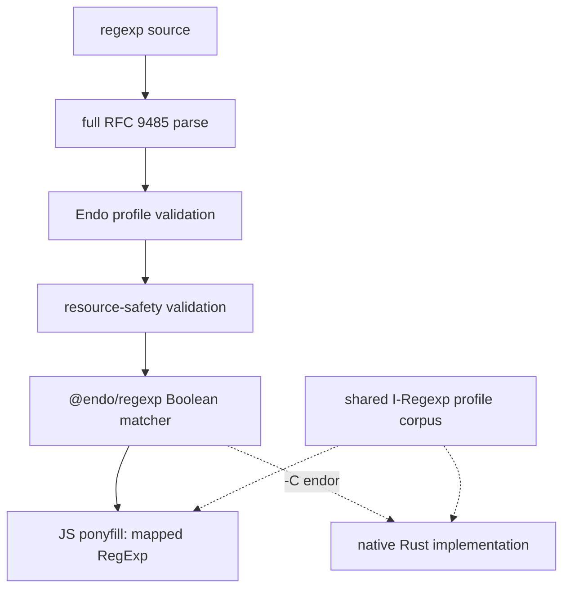

# An RFC 9485 Conservative Regexp Subset: @endo/regexp

| | |
|---|---|
| **Created** | 2026-07-10 |
| **Updated** | 2026-07-15 |
| **Author** | Kris Kowal (prompted) |
| **Status** | Not Started |
| **Source** | [Endo issue #3079](https://github.com/endojs/endo/issues/3079), maintainer review of [platform-search-pushdown](platform-search-pushdown.md) (PR #675), and PR #676 review |

## What is the Problem Being Solved?

platform-search-pushdown needs a regexp language whose patterns can be checked
in JavaScript and eventually matched by either JavaScript or Rust without
changing their meaning. A feature-name allowlist is not enough: it does not
establish a grammar, identify dialect differences or resource hazards, or give
a contract that can remain fixed when a native implementation replaces JS.

The foundation is [RFC 9485, I-Regexp](https://www.rfc-editor.org/rfc/rfc9485).
It deliberately defines a Boolean-only interoperable language, rather than a
general extraction language ([Section 1](https://www.rfc-editor.org/rfc/rfc9485#section-1)).
Its ABNF is in [Section 3](https://www.rfc-editor.org/rfc/rfc9485#section-3)
and its ECMAScript and RE2-family mappings are in
[Sections 5.3 and 5.4](https://www.rfc-editor.org/rfc/rfc9485#section-5).
This design adopts a Unicode-independent profile of I-Regexp, then explicitly
checks that profile for safe delegation to an installed engine.

The resulting package is both a usable JavaScript ponyfill and the executable
reference for a future Rust implementation. The parser, validator, and shared
tests describe the contract; the engine is replaceable.

## Design



### The Endo I-Regexp profile

An accepted pattern MUST first be a complete parse of RFC 9485 Figure 1
([Section 3](https://www.rfc-editor.org/rfc/rfc9485#section-3)). The validator
does not recognize selected tokens with a regexp of its own: it parses all of
the source and rejects trailing or otherwise unaccounted-for input. This makes
diagnostics precise and prevents a JavaScript engine from interpreting syntax
that validation skipped.

The initial profile accepts the RFC's alternation, grouping, quantifiers,
literals, dot, character classes, ranges, and RFC single-character escapes. It
preserves RFC 9485's Boolean whole-string semantics: pattern `a` matches `a`,
not `aa`. There are no `^` or `$` anchors. Consumers needing a contains search
construct an I-Regexp explicitly (for example `.*foo.*`); prefix and suffix
search use `foo.*` and `.*foo`. This follows the RFC ECMAScript mapping, which
envelopes the mapped pattern in `^(?:` and `)$`
([Section 5.3](https://www.rfc-editor.org/rfc/rfc9485#section-5.3)).

The Endo profile excludes `\p{...}` and `\P{...}` character properties despite
RFC 9485 otherwise requiring them. This is the Unicode-independent restriction
proposed in issue #3079: property data changes over time and is unsuitable for
an initially fixed cross-implementation corpus. Other source and input
characters remain Unicode scalar values, as RFC 9485 requires
([Section 1](https://www.rfc-editor.org/rfc/rfc9485#section-1)). The public
boundary rejects surrogate code points rather than silently treating JavaScript
UTF-16 code units as characters.

The profile excludes every ECMAScript-only extension: captures, backreferences,
lookaround, named groups, flags, `\d`/`\w`/`\s`, `\b`, lazy or possessive
quantifiers, and JavaScript escape forms outside RFC 9485. The RFC intentionally
omits multi-character escapes because their meanings vary between engines
([Sections 5.1 and 6.1](https://www.rfc-editor.org/rfc/rfc9485#section-5.1)).
Unescaped dot retains the RFC meaning: it excludes LF and CR. The JS mapper
replaces dot with `[^\n\r]`, as required by RFC 9485 Section 5.3.

### Resource-safe acceptance

RFC 9485 restricts syntax and interoperability; it does not promise that a
general-purpose backtracking engine has bounded resource use. Its security
considerations call out range quantifiers and recommend that implementations
receiving untrusted patterns apply limits and document their robustness
([Section 8](https://www.rfc-editor.org/rfc/rfc9485#section-8)).

The parser produces an AST and a second validator decides whether that AST is
in the Endo safe subset. The result is either a hardened parsed pattern or a
structured, non-source-echoing diagnostic such as `syntax`,
`unicode-property`, `ambiguous-repetition`, or `resource-limit`.

The intended v1 safety rule is **block determinism**, as proposed in issue
#3079. It rejects a repetition whose alternatives can consume the same next
block in more than one way, including known JavaScript backtracking hazards
such as `(a*)*$`, `([0-9]+)*$`, `(a|aa){10}$`, and `(a|a?)+$`. Fixed literal
sequences may be blocks, so `(foo|bar|baz)__[0-9]+` need not be rewritten into
a strictly one-character deterministic form. The exact block construction and
admissibility algorithm remain an open question; until specified and tested,
the classifier is conservative.

The validator also enforces profile-versioned limits on source size, AST nodes,
repetition nesting, and range-quantifier bounds. These are corpus-visible
policy, not incidental engine settings, and provide defense in depth alongside
the determinism rule.

### API and JavaScript ponyfill

The package exports a Boolean matcher, not captures:

```js
parseIRegexp(source) -> ParsedIRegexp // throws a diagnostic on rejection
matches(parsed, text) -> boolean
compile(source) -> { test(text) -> boolean }
```

parseIRegexp performs both the complete RFC parse and profile/safety
validation. compile is a convenience layer. The hardened parsed value is the
boundary shared by JavaScript and a later native backend, so neither must
reparse unchecked source.

When JavaScript is included, matches delegates to the underlying JavaScript
RegExp after mapping only the validated AST into RFC 9485's ECMAScript form:
replace dot, serialize validated syntax, envelope it with `^(?: ... )$`, and
use Unicode mode. JavaScript is a **ponyfill**, not the language definition.
Raw user source is never handed to RegExp. The safety classifier makes that
delegation acceptable for untrusted patterns and must remain conservative until
its proof obligations and adversarial cases are established.

The JS implementation is separable from parser, profile, tests, and API. An
Endor import/build condition such as `-C endor` selects a native matches
implementation and omits the JavaScript ponyfill from the import graph. A
dependency-graph test must demonstrate omission; a dead JS branch that a
bundler still resolves is insufficient. The selected backend receives only a
validated parsed form or canonical serialization.

### Shared, fixed conformance corpus

`packages/regexp/test/i-regexp-profile-cases.json` is the normative executable
asset. It is owned by @endo/regexp, contains no JS-engine-specific expectation,
and is executed unchanged by both implementations.

```json
{
  "profile": "endo-i-regexp-v1",
  "validity": [
    { "source": "0x[0-9a-fA-F]{40}", "accepted": true },
    { "source": "\\p{L}+", "accepted": false, "reason": "unicode-property" },
    { "source": "(a*)*$", "accepted": false, "reason": "ambiguous-repetition" }
  ],
  "matches": [
    { "source": "a", "text": "a", "matches": true },
    { "source": "a", "text": "aa", "matches": false },
    { "source": ".", "text": "\\n", "matches": false },
    { "source": "[A-Z]+", "text": "ENDO", "matches": true }
  ]
}
```

The JS runner asserts acceptance diagnostics and Boolean results. The Rust
runner uses the same JSON and asserts the same results and rejection
categories. The corpus grows from RFC syntax boundaries, Endo exclusions, known
ReDoS shapes, mapping edges (dot, whole string, CR/LF, Unicode scalars), and
bugs found in either backend. A case is not weakened or removed merely because
a native implementation differs; a profile-version change is required.

The Rust implementation begins behind `-C endor` as a second backend, not a
forked specification. It may use a Rust regexp engine only after applying the
corresponding whole-string mapping and passing the shared corpus. An engine
gap is not permission to reinterpret the language.

## Dependencies

| Artifact | Relationship |
|---|---|
| [RFC 9485](https://www.rfc-editor.org/rfc/rfc9485) | Normative syntax/Boolean-semantics foundation; the Endo profile removes properties. |
| [Endo issue #3079](https://github.com/endojs/endo/issues/3079) | Unicode-independent I-Regexp and block-determinism direction. |
| [platform-search-pushdown](platform-search-pushdown.md) (PR #675) | Consumer of validation and eventual backend; must adapt grep's substring contract to I-Regexp whole-string semantics. |
| PR #654 (`rust/mount_parity`) | Existing parity-runner seam for the fixed corpus. |
| `endor` | Supplies -C endor native selection and import-graph assertion. |

## Phased Implementation

1. **Profile and parser.** Create @endo/regexp, an RFC 9485 AST parser,
   Unicode-independent validator, bounded diagnostics, and initial fixed corpus.
2. **Safety classifier and JS ponyfill.** Specify and implement conservative
   block determinism; map only validated ASTs to JS RegExp; run the corpus on V8
   and XS where available.
3. **Consumer adoption.** Teach grep/search to express its desired mode as an
   I-Regexp and surface profile diagnostics. Do not retain a raw-RegExp fallback.
4. **Native proof-out.** Add Rust as a second backend, execute the identical
   corpus through existing parity machinery, and add -C endor graph tests.
5. **Native promotion.** Select native only after corpus parity, graph checks,
   and resource tests pass; retain the corpus as a regression contract.

## Design Decisions

1. **RFC 9485 is the syntax and semantic foundation.** We use its complete
   grammar and Boolean model instead of a feature allowlist.
2. **Validation is a full parse plus profile checks.** No implementation
   delegates raw source after checking only a prefix or selected tokens.
3. **Unicode properties are initially excluded.** This is issue #3079's
   Unicode-independent profile, despite RFC 9485's full-Unicode requirement.
4. **JavaScript is a ponyfill.** It supplies the first backend, but parsed
   inputs and shared tests are designed to survive its Endor omission.
5. **The corpus is shared and fixed.** Rust conforms to the same file, not a
   Rust-specific restatement of expectations.
6. **-C endor is an import-graph condition.** Native selection must actually
   omit the JS implementation.

## Open Questions

- **What is the exact safe-language proof obligation?** Confirm block
  determinism for v1, including its block construction, or select a simpler
  conservative classifier. RFC 9485 alone does not make backtracking JS safe.
- **Which numerical limits and diagnostic taxonomy define profile v1?** Set
  source, AST, range, and nesting bounds from V8/XS/Rust evidence and encode
  them in the corpus.
- **How should grep retain its substring-oriented contract?** Decide whether
  the API composes I-Regexps, offers a safe contains helper, or becomes
  whole-string matching.
- **What Rust engine and mapping satisfy the profile?** It must preserve Unicode
  scalar and CR/LF-dot behavior and pass the unmodified corpus.
- **What exactly implements -C endor?** Decide whether it is a
  compartment-mapper condition, export condition, or another build setting,
  then add the graph test.

## Prompt

> Amend PR #676 to use the RFC 9485 safe-subset direction associated with Endo
> issue 3079: fully parse each regexp, validate syntax in the safe subset, and,
> when JavaScript is present, delegate matching to its engine. Treat JavaScript
> as a ponyfill and foundation for extensive shared tests that remain fixed for
> native Rust. Design a -C endor-like condition that omits JavaScript from the
> import graph, cite RFC sections, and record unresolved choices.
