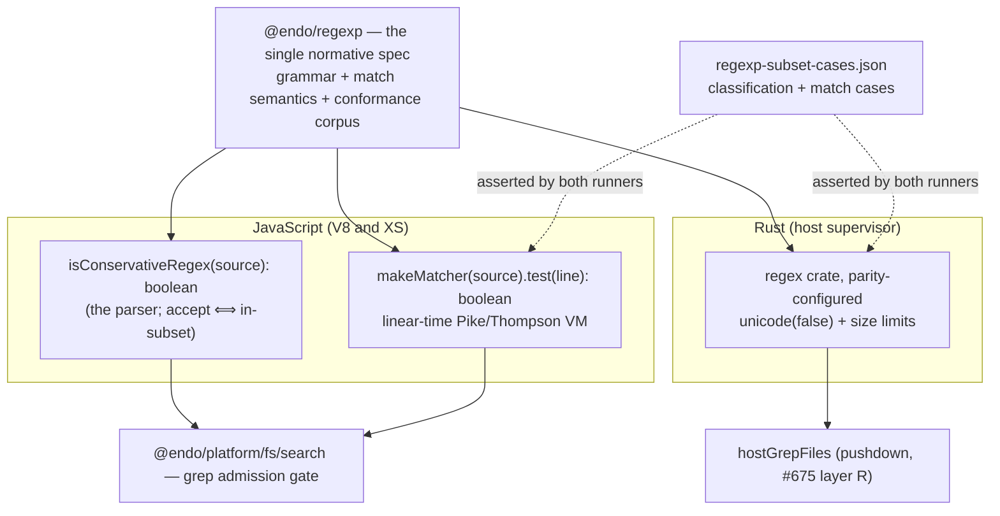

# A Conservative Regular-Expression Subset for Search Parity: `@endo/regexp`

| | |
|---|---|
| **Created** | 2026-07-10 |
| **Author** | Kris Kowal (prompted) |
| **Status** | Not Started |
| **Source** | Maintainer review on [platform-search-pushdown](platform-search-pushdown.md) (PR #675), inline comment on `isConservativeRegex`; orchestration `orch-endo-glob-grep-pushdown` |

## What is the Problem Being Solved?

[platform-search-pushdown](platform-search-pushdown.md) pushes `grep` down into
`@endo/platform/fs/search` and, on the XS-under-Rust platform, offers a native
`hostGrepFiles` (Rust `regex` crate) for patterns inside a *conservative
syntactic subset* — "literals, character classes, anchors, alternation, bounded
quantifiers" — deciding pushdown eligibility with a predicate,
`isConservativeRegex(source)`. That design leaves the predicate as an
implementation-defined allowlist and, in its Resolved decisions, defers the
whole question to this design, taking a **dependency** on the result:

> `isConservativeRegex` cannot stay an implementation-defined allowlist:
> confidence in it requires tackling the Rust implementation, and the Rust and
> JS engines must reach **parity**. That is a project on its own — a
> ReDoS-mitigating regex subset in the spirit of RE2, potentially
> `@endo/regexp`. Until it lands, the normative JS engine remains the sole grep
> implementation; the native subset does not ship without the parity design.

Three problems make this a project rather than a helper function:

1. **Parity has no ground truth.** ECMA-262 `RegExp` (what the JS engine reaches
   for) and the Rust `regex` crate accept overlapping-but-different languages
   and, worse, assign **different semantics** to constructs both accept
   (`\b`, `\w`, `\d`, `\s`, case folding). An allowlist that merely *names*
   features cannot state which of two engines is right when they disagree; a
   pattern "in the subset" on one engine can silently match differently on the
   other. Parity needs a **single normative grammar and match semantics** both
   engines target, not two engines compared after the fact.

2. **ReDoS lives on the JS floor, not just the native path.** The grep floor is
   the JS engine, which runs on **XS** (Moddable) as well as V8. XS's `RegExp`
   is a backtracking engine, so a caller-supplied `(a+)+b`-shaped pattern is a
   catastrophic-backtracking (denial-of-service) hazard *on the floor itself* —
   and grep patterns come from LLM agents, a prompt-injection-adjacent surface.
   Restricting the pushdown subset does nothing for the JS floor unless the
   floor also stops handing arbitrary patterns to a backtracking engine.

3. **The subset wants a home and a matcher, not just a validator.** Genie's
   hand-rolled filesystem search, the extended capability FS, and the daemon
   grep all want one definition of "a safe pattern." The RE2-style answer is
   not only *validate* patterns but *match* them in guaranteed linear time —
   which means shipping a small matcher, not delegating to a backtracking
   `RegExp`.

This design defines that grammar, its match semantics, the JS↔Rust parity
contract, and the package that houses them: **`@endo/regexp`**.

## Design



### Home: a dedicated `@endo/regexp` package

The subset lives in its own package, `@endo/regexp`, not inside
`@endo/platform/fs/search`. It carries **no** `exo-` prefix: it exports plain
functions (a predicate and a matcher), not passable interfaces over CapTP. The
package is the single normative definition three consumers reference:
`@endo/platform/fs/search` (the grep admission gate and the JS matcher), the
`rust/mount_parity` runner (PR #654), and later genie's filesystem search and
the extended capability FS (the consolidation follow-up
platform-search-pushdown names). A helper buried in `fs/search` could not be
depended on by the Rust crate or reused outside the daemon, and it would tangle
a matcher's lifecycle with a filesystem walker's.

Public surface (Hardened-JS, `harden`ed exports):

```js
// @endo/regexp
isConservativeRegex(source) -> boolean        // parse succeeds ⟺ in-subset
makeMatcher(source) -> { test(line) -> boolean }  // throws if !isConservativeRegex(source)
// makeMatcher compiles once to a linear-time program; test() is O(|line| · |program|).
```

`grep` needs only a boolean per-line acceptor (the case table's `text` field is
the **whole line**, not a captured span — [mount-grep-cases.json](../packages/daemon/test/mount-grep-cases.json)
on `feat/mount-grep`), so the matcher extracts no captures. That keeps the
linear-time VM to an acceptor — the smallest thing that does the job.

### The grammar (precise, not an allowlist)

`isConservativeRegex(source)` returns `true` **iff** `source` parses under this
grammar (flagless throughout — no `i`, `m`, `s`, `u`, `x`, and no inline flag
groups). EBNF:

```ebnf
regexp       = alternation ;
alternation  = concatenation , { "|" , concatenation } ;
concatenation= { term } ;                         (* may be empty: "a|" is legal *)
term         = anchor | ( atom , [ quantifier ] ) ;
anchor       = "^" | "$" | "\b" | "\B" ;          (* not quantifiable *)
atom         = group | class | dot | shorthand | escape | literal ;
group        = "(" , [ "?:" ] , alternation , ")" ;   (* capturing or non-capturing; captures are ignored *)
class        = "[" , [ "^" ] , class-item , { class-item } , "]" ;
class-item   = class-range | class-atom ;
class-range  = class-atom , "-" , class-atom ;    (* low code point <= high *)
class-atom   = class-escape | class-literal ;
dot          = "." ;                              (* any character (haystack is one newline-free line) *)
shorthand    = "\d" | "\D" | "\w" | "\W" | "\s" | "\S" ;
quantifier   = ( "*" | "+" | "?" | counted ) , [ "?" ] ;   (* trailing "?" = lazy *)
counted      = "{" , n , "}" | "{" , n , "," , "}" | "{" , n , "," , m , "}" ;
escape       = "\" , ( metachar | "n"|"r"|"t"|"f"|"v"|"0" | "x" hexhex | "u" hexhexhexhex ) ;
literal      = ? any character except an unescaped metacharacter ? ;
metachar     = "." | "^" | "$" | "*" | "+" | "?" | "(" | ")" | "[" | "]"
             | "{" | "}" | "|" | "\" ;
```

Side conditions (parse errors — i.e. `isConservativeRegex` returns `false` —
when violated):

- **A quantifier applies to exactly one preceding atom.** `a*` legal; a leading
  or double quantifier (`*a`, `a**`, `a+?+`) is rejected. Lazy `*?`/`+?`/`??`/`{n,m}?`
  is one quantifier, allowed.
- **Anchors are not quantifiable** (`^*`, `\b?` rejected).
- **Counted repetition is bounded for space.** `n, m ≤ REPEAT_MAX` (proposed
  1000) and `n ≤ m`. The *compiled program size* is bounded independently:
  compilation that would exceed `PROGRAM_STATES_MAX` (proposed 10 000 NFA
  states — the analogue of Rust `regex`'s `size_limit`) is rejected, so a nest
  of counted repetitions cannot blow up the automaton. (Both limits are
  policy constants, tunable after a benchmark, mirroring #675's `batchSize`
  posture.)
- **Class ranges are well-ordered** (`[z-a]` rejected) and a class is
  non-empty.
- **`\xHH` / `\uHHHH` require exactly the hex digits shown**; `\u{…}`, `\cX`,
  and octal escapes beyond `\0` are **not** in the subset (see exclusions).

Note that `*`, `+`, and `{n,}` (**unbounded** quantifiers) **are in the
subset.** Unbounded repetition is only a ReDoS hazard on a *backtracking*
engine; under a linear-time matcher it is safe and constant-space. The #675
prose "bounded quantifiers" was written against the assumption of the native
backtracking `RegExp`; adopting the linear matcher (below) lifts that
restriction and lets the subset match RE2's expressive range. The residual
resource concern is *counted* repetition (`{n,m}`), which the program-size
bound governs — this is a **refinement of #675's subset**, called out in
Design Decisions for the maintainer.

### Match semantics (the single source of truth)

Because both engines target *this* spec rather than their own native behavior,
the corner semantics are pinned here once:

| Construct | Pinned meaning |
|---|---|
| Haystack | One **line** at a time, its trailing `\n`/`\r\n` already stripped by the grep splitter; the matcher never sees a newline. |
| `^` / `$` | Start / end of that line. (Per-line feeding makes the multiline flag unnecessary; both engines agree.) |
| `.` | Any character (no newline exists in the haystack). |
| Case | **Case-sensitive.** No `i` flag; no Unicode case folding on either side. |
| `\d` | `[0-9]` (ASCII). |
| `\w` | `[A-Za-z0-9_]` (ASCII). |
| `\s` | `[ \t\r\n\f\v]` restricted to what can appear in a line → effectively `[ \t\f\v]` (ASCII). **Deliberately narrower than ECMA-262 `\s`** (which includes ` `, ` `, the ` `–` ` run, ``, …); see Open Questions. |
| `\b` / `\B` | Word boundary over the **ASCII** `\w` set above (not Unicode-aware). |
| Ranges/classes | Code-point ranges over UTF-16 code units, matching the glob dialect's UTF-16 collation ([platform-search-pushdown](platform-search-pushdown.md) § ordering). |
| Groups | `(?:…)` and `(…)` are **grouping only**; captures are never surfaced (grep is match/no-match). |
| Greedy vs lazy | Distinguishable but immaterial to a boolean acceptor; both accepted, both linear. |

The unit `\s` narrows to ASCII is the clearest illustration of why we cannot
delegate to native engines: ECMA-262 and Rust each define `\s` differently, and
*neither* definition is the one we want (agent-supplied source-code search). We
pick one, write it once, and make both implementations conform to it.

### Excluded features, and the divergences each one closes

`isConservativeRegex` rejects everything below. Each exclusion removes either a
feature the Rust `regex` crate lacks, a construct that defeats linear-time
matching, or a corner where ECMA-262 and Rust *disagree* — the divergences the
subset exists to keep out of grep.

| Excluded | Reason |
|---|---|
| Backreferences `\1`–`\9`, `\k<name>` | Rust `regex` **cannot express them**; they are also inherently non-linear (the canonical reason RE2 omits them). |
| Lookaround `(?=)`, `(?!)`, `(?<=)`, `(?<!)` | Rust `regex` cannot express them. |
| Inline flags `(?i)`, `(?m)`, `(?s)`, `(?x)` and all flags | Case-folding, multiline, dot-all, and free-spacing each diverge between ECMA-262 and Rust; excluding flags keeps one pinned semantics. |
| Unicode property escapes `\p{…}`, `\P{…}` | ECMA-262 requires the `u` flag; Rust enables them by default. Straight divergence — excluded in v1 (a candidate for a later, explicitly Unicode-aware tier). |
| Named groups `(?<name>…)`, atomic groups `(?>…)`, possessive quantifiers `a*+` | Syntax and/or semantics diverge; unneeded for a boolean acceptor. |
| `\u{…}`, `\cX`, octal `\nnn` | `\u{…}` needs the ECMA `u` flag; `\cX` and octal are rarely needed and divergently parsed. `\xHH` and `\uHHHH` (BMP) are kept — both engines agree on them. |
| Empty pattern `""` | Rejected as a grep pattern (matches every line — a footgun, not a search); callers wanting "all lines" pass no pattern. Surface at the grep layer, not a subset concern per se. |

The three the maintainer's directive named explicitly — **backreferences,
lookaround, and "corner semantics"** — are rows 1, 2, and (collectively) the
flag/`\p`/`\s` rows.

### RE2-style linear-time matching (why not native `RegExp`)

The mitigation strategy is **RE2's**: compile to an automaton and simulate it in
time linear in the input, so no pattern can trigger catastrophic backtracking —
the guarantee holds *by construction of the matcher*, not by hoping the pattern
is tame.

- **Rust side.** The `regex` crate **is** the RE2 lineage (finite automata,
  linear time, no backtracking). It needs only parity **configuration**, not a
  bespoke matcher: `RegexBuilder::new(source).unicode(false)` (to get the
  pinned ASCII `\b \w \d \s` semantics) with `size_limit` / `dfa_size_limit`
  set to mirror `PROGRAM_STATES_MAX`. Writing a second Rust matcher would be
  wasteful when the reference implementation is a dependency away.

- **JS side.** V8's default `RegExp` and XS's `RegExp` are **backtracking**
  (V8's linear engine is opt-in and non-default; XS has none). Handing a
  caller pattern to them reintroduces ReDoS on the floor. So `@endo/regexp`
  ships its **own** linear-time acceptor — Thompson construction plus a Pike
  VM over the compiled program (a bounded, well-understood component; an
  acceptor with no captures is a few hundred lines of Hardened JS). This is
  what makes the JS floor itself ReDoS-immune and, as a bonus, removes the
  ECMA-262 corner semantics from the picture entirely: the JS matcher
  implements *our* pinned semantics, so V8-vs-XS `RegExp` quirks never enter.

**The grep pattern language becomes the subset.** The strongest posture — and
the one "mitigate ReDoS like RE2" implies — is that `isConservativeRegex` is the
**admission gate for grep**, not merely a pushdown fast-path selector: a pattern
outside the subset is **rejected with a clear "unsupported regexp feature"
error**, never handed to a backtracking `RegExp`. This is the change from #675's
current prose ("falls back to the JS engine … for anything outside it"): the
fallback for matching *semantics* becomes *reject*, not *match with native
RegExp*. Consequences fed back to #675:

- grep's floor is ReDoS-immune on every platform, not only where the Rust
  pushdown is present;
- there is one matcher path, not a subset-vs-native fork, which *simplifies*
  parity (nothing outside the corpus is ever matched);
- the native pushdown decision collapses to "is the Rust host available?" —
  every grep pattern is already in-subset by admission.

The cost is that a handful of ECMA-262 regexes an agent might type get a crisp
rejection instead of a result. For an LLM-facing tool over untrusted input, a
bounded, safe, well-documented language with a clear error is the better
contract. This is a **decision for the maintainer** (Design Decision 5, Open
Question 1): adopt the subset as the whole grep language, or keep it a
pushdown-only fast path with native `RegExp` retained for out-of-subset
patterns on the JS floor (accepting the residual XS ReDoS surface).

### JS ↔ Rust parity contract

Parity is a first-class, tested contract, not an aspiration:

1. **One normative spec** — this document's grammar + semantics — that both
   implementations target. Neither engine's native behavior is authoritative;
   the spec is.
2. **The JS classifier is the only classifier.** `provideSearch` calls
   `isConservativeRegex` on the JS side before choosing the pushdown; Rust
   `hostGrepFiles` therefore only ever receives already-admitted, in-subset
   patterns. Rust needs no parser — it needs the parity-configured `regex`
   crate plus the guarantee (proven by the corpus) that every admitted pattern
   compiles and matches identically.
3. **A shared conformance corpus** (next section) both runners execute, so a
   drift between the JS matcher, the Rust config, and the spec fails a test
   rather than shipping.
4. **Defense in depth in Rust.** If `regex` ever fails to compile an admitted
   pattern (it should not, by the corpus guarantee), `hostGrepFiles` **falls
   back to the JS engine for that pattern and records it**, never hangs and
   never silently drops matches.

### The case-table / parity-runner contract

The corpus is a declarative, language-neutral JSON asset in the same idiom as
[platform-search-pushdown](platform-search-pushdown.md)'s
`mount-glob-cases.json` / `mount-grep-cases.json`, so PR #654's
`rust/mount_parity` runner consumes it with the same machinery
(`serde` structs, the existing envelope shape). Canonical location:
**`packages/regexp/test/regexp-subset-cases.json`** (the corpus is independent
of the filesystem fixture, so it lives with the package that owns the
semantics; the Rust runner gains a `regexp_subset_cases()` path helper beside
its `contract_dir()`).

```json
{
  "description": "Cross-language conformance for the @endo/regexp conservative subset …",
  "classification": [
    { "source": "^exp[a-z]+", "inSubset": true },
    { "source": "a{2,4}", "inSubset": true },
    { "source": "(a+)+b", "inSubset": true, "note": "linear-safe here; the ReDoS shape only bites a backtracking engine" },
    { "source": "\\1", "inSubset": false, "reason": "backreference" },
    { "source": "(?=x)", "inSubset": false, "reason": "lookahead" },
    { "source": "\\p{L}", "inSubset": false, "reason": "unicode-property" },
    { "source": "a{0,5000}", "inSubset": false, "reason": "counted-repeat exceeds REPEAT_MAX" }
  ],
  "match": [
    { "source": "^export const util", "input": "export const util = 2;", "matches": true },
    { "source": "line$",  "input": "second line", "matches": true },
    { "source": "[24]",   "input": "export const index = 1;", "matches": false },
    { "source": "index|util", "input": "export const util = 2;", "matches": true },
    { "source": "\\bfoo\\b", "input": "foobar foo", "matches": true }
  ]
}
```

Runner obligations:

- **JS runner** (`packages/regexp/test/subset-conformance.test.js`): for every
  `classification` case, assert `isConservativeRegex(source) === inSubset`; for
  every `match` case (all in-subset), assert
  `makeMatcher(source).test(input) === matches`.
- **Rust runner** (`rust/mount_parity`, wiring the currently-stubbed
  `mount_grep_parity.rs` seam): for every `match` case, build the
  parity-configured `regex` and assert `re.is_match(input) === matches`. The
  `classification` list is JS-authoritative (Rust never classifies), but the
  Rust runner may additionally assert every `match` source *compiles* under the
  parity config — a compile failure on an admitted pattern is itself a parity
  bug.
- The `match` corpus is seeded by **lifting the existing
  `mount-grep-cases.json` patterns** ([feat/mount-grep](../packages/daemon/test/mount-grep-cases.json):
  `export`, `^second`, `1;$`, `[24]`, `index|util`, `^export const util`, `#`,
  `zzz-nonexistent`) into `source`/`input`/`matches` triples, then extended
  with the exclusion and boundary cases above, so grep's own coverage and the
  subset corpus cannot disagree.

## Dependencies

| Artifact | Relationship |
|---|---|
| [platform-search-pushdown](platform-search-pushdown.md) (PR #675) | **Depends on this.** Its `isConservativeRegex` and native `hostGrepFiles` (layer R) do not ship until this lands; consumes `@endo/regexp` for the admission gate and the JS matcher. This design feeds back the "subset = grep language" and "unbounded quantifiers are fine" refinements. |
| PR #654 (`rust/mount_parity`) | Hosts the Rust conformance runner; its stubbed `mount_grep_parity.rs` seam is wired to this corpus, and its `regex`-config mirror is the Rust half of parity. |
| PRs #653 / #655 (`feat/mount-glob`, `feat/mount-grep`) | #655's `mount-grep-cases.json` patterns seed the `match` corpus; #655's grep surface adopts `isConservativeRegex` as its admission gate. |
| [mount-extensions-reconstruction](mount-extensions-reconstruction.md) | Defines the glob/grep dialects and the case-table/fixture strategy this corpus follows. |
| Rust `regex` crate | The RE2-lineage linear matcher; the Rust side is a parity **configuration** of it, not a new engine. |
| endor `xs2rust-endor-stage5-fix5` (sibling project) | **Prior art, related discipline only:** XS/Rust regexp *literal-validation* parity. That work validates that literals round-trip across engines; this design specifies a *runtime matcher subset*. Cross-referenced for the parity methodology, not reused wholesale. |

## Phased Implementation

1. **`@endo/regexp` package.** Grammar parser (`isConservativeRegex`), the
   linear-time Pike-VM acceptor (`makeMatcher`), the pinned semantics, the
   policy constants (`REPEAT_MAX`, `PROGRAM_STATES_MAX`), a changeset, and the
   canonical `regexp-subset-cases.json` + JS conformance runner. Standalone,
   no daemon dependency.
2. **Rust parity.** Add the parity-configured `regex` builder to
   `rust/mount_parity`; wire the stubbed `mount_grep_parity.rs` to iterate the
   corpus's `match` cases; add the `regexp_subset_cases()` path helper.
3. **`@endo/platform/fs/search` adoption.** Replace the placeholder
   `isConservativeRegex` with the `@endo/regexp` import; the JS grep engine uses
   `makeMatcher(...).test` (retiring native `RegExp` from the grep path);
   grep's admission gate rejects out-of-subset patterns (pending the maintainer
   decision on Open Question 1).
4. **Native pushdown unblocked (this is #675's deferred layer R, gated on
   phases 1–3).** `hostGrepFiles` in `rust/endo/xsnap/src/powers/fs.rs` uses the
   parity-verified Rust config; `bus-daemon-rust-xs-powers.js` wires
   `filePowers.search.grepFiles`. Tracking: to be filed against
   `orch-endo-glob-grep-pushdown` on this design's acceptance.

## Design Decisions

1. **A dedicated `@endo/regexp` package, no `exo-` prefix.** Reused by
   `fs/search`, the Rust runner, and (later) genie and the extended FS; exports
   plain functions, not CapTP-passable interfaces.
2. **One normative spec both engines target**, rather than comparing two native
   engines. The spec is authoritative; ECMA-262 and Rust each *conform to it*,
   which is the only way parity has ground truth.
3. **Ship a linear-time JS matcher; do not delegate to native `RegExp`.** The
   floor runs on XS (backtracking), so ReDoS immunity requires our own
   RE2-style acceptor. It also erases V8/XS corner-semantics divergence for
   free.
4. **The Rust side is a *configuration* of the `regex` crate, not a new
   matcher.** `unicode(false)` + size limits reproduce the pinned semantics; no
   bespoke Rust engine.
5. **The subset is the grep pattern language (recommended), not merely a
   pushdown selector.** Out-of-subset patterns are rejected with a clear error,
   giving ReDoS immunity on every platform and a single matcher path. (Open
   Question 1 leaves the final call to the maintainer.)
6. **Unbounded `*`, `+`, `{n,}` are in the subset; only *counted* repetition is
   bounded** (`REPEAT_MAX`) and the *compiled program size* is capped
   (`PROGRAM_STATES_MAX`). A linear matcher makes unbounded repetition safe;
   this refines #675's "bounded quantifiers only," which assumed a backtracking
   engine.
7. **The matcher is a boolean acceptor, no captures.** grep returns whole lines
   ([mount-grep-cases.json](../packages/daemon/test/mount-grep-cases.json)),
   so per-line `test()` is all that is needed — the smallest linear VM that does
   the job. A capture-extracting variant is a later addition if a consumer needs
   spans.
8. **ASCII-pinned `\w \d \s \b`.** Chosen because ECMA-262 and Rust disagree and
   neither native definition suits source-code search; pinned once, conformed to
   by both.

## Open Questions

- **Should the conservative subset be the *entire* grep pattern language
  (rejecting out-of-subset patterns), or a pushdown-only fast path with native
  `RegExp` retained on the JS floor for out-of-subset patterns?** The design
  *recommends* the former (Design Decision 5) for whole-platform ReDoS immunity
  and a single matcher path; the latter preserves full ECMA-262 acceptance at
  the cost of a residual XS ReDoS surface. Maintainer's call; it changes #675's
  grep prose.
- **Is the ASCII narrowing of `\s` acceptable?** It drops ECMA-262's Unicode
  whitespace tail (` `, ` `, ` `–` `, ``, …). For
  source-code grep this is almost certainly fine and is the simplest parity
  point, but a caller searching for a non-breaking space would need an explicit
  ` `. Confirm the narrowing, or add those code points to the pinned `\s`
  on both sides.
- **Where should `REPEAT_MAX` and `PROGRAM_STATES_MAX` land?** Proposed 1000 and
  10 000; both are policy constants to calibrate against a benchmark rather than
  guess now (mirroring #675's `batchSize` posture).
- **Does a later Unicode-aware tier belong on the roadmap?** `\p{…}` and Unicode
  case folding are excluded in v1 for parity simplicity. If agents need
  Unicode-class search, a `u`-flag-parity tier (ECMA `u` semantics on the JS
  side, Rust `unicode(true)`) could be a follow-up subset — to be filed if
  demand appears.

## Prompt

> Dispatched by the maintainer's review on PR #675 (platform search pushdown),
> inline comment on `isConservativeRegex`: "We have to tackle the Rust
> implementation in order to have confidence in the `isConservativeRegex`
> implementation, so dispatch the exploratory work and feed it back to the
> design. We must have parity. This is likely an opportunity to adopt a subset
> that mitigates ReDoS like RE2 — a project on its own, potentially
> `@endo/regexp`. Take a dependency on the result." Produce a design for a
> conservative, ReDoS-mitigating regular-expression subset: define the grammar
> precisely (what `isConservativeRegex` accepts/rejects); establish JS↔Rust
> parity as a first-class contract (noting the ECMA-262 vs Rust-`regex`
> divergences to exclude); evaluate an RE2-style linear-time matcher and whether
> a dedicated `@endo/regexp` package is the right home; and specify the
> case-table/parity-runner contract so PR #654's `rust/mount_parity` runner can
> consume it.
