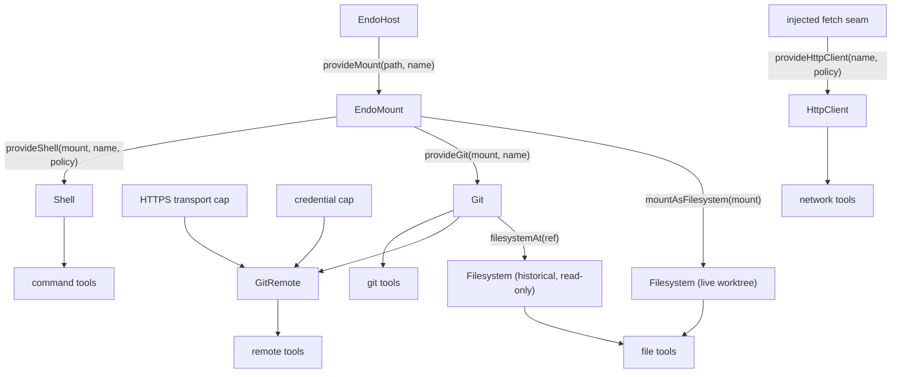

# Daemon Agent Tools (Claw-like Capabilities)

| | |
|---|---|
| **Created** | 2026-03-02 |
| **Updated** | 2026-07-09 |
| **Author** | Kris Kowal, endolinbot (prompted) |
| **Status** | In Progress |

## Status

This document began as a pre-trio sketch (2026-03-02) whose own revision
note (2026-05-18) deferred to the then-unwritten mount and git designs.
The 2026-07-06 reconciliation pass resolves that note: the sketch's
`Dir` / `Shell` / `Git` interfaces are replaced by the vocabulary that
actually landed, and the document is repositioned as the capability-layer
map and build sequence for Milestone 3's "Claw-like coding capabilities
available to agents" pillar.

What has shipped, by layer:

- **Capability substrate.** `EndoMount` is complete
  ([daemon-mount-capabilities](daemon-mount-capabilities.md), all five
  phases). The local `Git` capability over `EndoMount` landed in #364
  (hardening #371), immutable trees and the bulk archive path in #367,
  `GitRemote` with controllers in #365, and the fd-pipe askpass credential
  envelope in #368. `Git.filesystemAt(ref)` landed per
  [endo-fs-from-git](endo-fs-from-git.md).
- **Tool surface.** `@endo/agent-tools` exists on `llm`
  ([endo-agent-tools](endo-agent-tools.md)): `makeTool`, `makeGitTool`,
  and `makeMountReadTool` emit the canonical `ToolRecord` (#523), and the
  code-mode TypeScript declaration renderer shipped in #524. The
  2026-07-08 batch then landed the file-tool set (`list` / `edit` / `stat`,
  #614), the **Shell capability** and `makeShellTool` (`provideShell` plus
  the host-spawner engine, #615), and the mount-bridged local git `status`
  / `add` tools (#616) — Phase 1 in full, plus the Shell capability and
  tool (Phase 2a/2b; the sandbox engine 2c is still gated and open).
- **Network tier.** The confined-HTTP substrate landed as a standalone
  package pair on 2026-07-08 (#566): `@endo/http-confine` (the pure
  confinement core) and `@endo/exo-http-client` (the `HttpClient` /
  `HttpClientControl` capability), realizing
  [endoclaw-network-fetch](endoclaw-network-fetch.md). The daemon
  `provideHttpClient` wiring and a `makeHttpTool` are the remaining delta
  (§ Tool Groups, § Implementation Plan).
- **Remaining** (the phased delta in § Implementation Plan below): the
  **push tier** (`makeGitRemoteTool` over a granted `GitRemote`), the
  **network tool** (`provideHttpClient` daemon formula plus `makeHttpTool`),
  the **sandbox-spawner shell engine** (Phase 2c, gated on
  [endo-posix-sandbox](endo-posix-sandbox.md)), and the provisioning and
  across-turn persistence wiring.

## What is the Problem Being Solved?

AI coding agents like Claude Code ("Claw"), Cursor, and Devin have a
standard set of tools: read files, write files, execute shell commands,
run git operations, search codebases. These tools operate with ambient
authority — the agent has the same filesystem and process access as the
user running it.

Endo's capability model can provide these same tools with principled
confinement: an agent receives a `Filesystem` capability scoped to a
project worktree, a `Shell` capability that can only execute approved
commands in that worktree, a `Git` capability scoped to the same
repository, and a `GitRemote` bounded to one endpoint with
non-extractable credentials. The agent can do useful coding work without
ambient access to `~/.ssh`, `~/.aws`, or the ability to run arbitrary
network commands.

The capability shapes themselves are settled elsewhere and are not
re-opened here:

- the mount / git / remotes **trio**
  ([daemon-mount-capabilities](daemon-mount-capabilities.md),
  [daemon-git-capability](daemon-git-capability.md),
  [daemon-git-remotes](daemon-git-remotes.md)) owns `EndoMount`,
  `EndoMountEntry`, `Git`, and `GitRemote`;
- [endo-agent-tools](endo-agent-tools.md) owns the tool surface: the
  canonical `ToolRecord`, wire schemas, the confinement axis and
  attenuation levers, git authority tiers, and petname capability
  arguments.

What this document owns is the remainder:

1. the **capability-to-tool-group map** — which daemon capability backs
   each of the four Claw-like tool groups, stated once so the milestone
   has a single index;
2. the **Shell capability** — the one tool group whose backing capability
   has no owning design (the trio never covered process execution, and
   [endo-agent-tools](endo-agent-tools.md) explicitly defers "the
   command-tool family and its `Spawner` seam");
3. the **build order** that turns the shipped substrate into the M3 exit
   pillar.

## Tool Groups, Reconciled

| Group | 2026-03 sketch | Reconciled backing | Status |
|---|---|---|---|
| Filesystem | `Dir` from [daemon-capability-filesystem](daemon-capability-filesystem.md) | `Filesystem` (`@endo/platform/fs/extended`) via `mountAsFilesystem(mount)` for the live worktree and `Git.filesystemAt(ref)` for history | read tool landed (#523); list / edit / stat landed (#614) |
| Shell | `makeShell({ cwd, allowedCommands, … })` from a raw path | `Shell` capability derived from a writable `EndoMount`, executing through the `Spawner` seam (§ Shell Capability) | capability + `makeShellTool` landed (#615, host-spawner engine); sandbox engine (Phase 2c) remaining |
| Git (local) | `Git` exo over a repository path string | `Git` over `EndoMount` via `provideGit(mountCap, petName)` ([daemon-git-capability](daemon-git-capability.md)) | capability landed (#364); tools landed (`makeGitTool`); mount-bridged `status` / `add` landed (#616) |
| Git (remote) | deliberately omitted ("network access is a separate capability") | `GitRemote` = `Git` + bounded HTTPS transport + non-extractable credential ([daemon-git-remotes](daemon-git-remotes.md)) | capability landed (#365, #368); `makeGitRemoteTool` remaining |
| Network (HTTP) | not in sketch (network excluded from `Git`, Design Decision 3) | `HttpClient` / `HttpClientControl` from `@endo/exo-http-client` over the `@endo/http-confine` core, granted standalone from an injected `fetch` seam (not mount-derived) | capability landed (#566); `provideHttpClient` daemon wiring and `makeHttpTool` remaining |
| Search | `grep` / `glob` on `Dir` | interim: `Filesystem` walks plus the Shell group's allowlisted `grep`; a capability-backed search substrate is an open question | not started |

Three properties of the reconciled map, each a correction to the sketch:

- **One filesystem cap reads worktree and history.** The sketch's `Dir`
  could only see live files. `mountAsFilesystem(mount)` and
  `Git.filesystemAt(ref)` present the *same* `Filesystem` shape, so the
  same read / list / stat tools serve both, and `readOnly()` / `chroot`
  are uniform attenuations
  ([endo-agent-tools](endo-agent-tools.md) § Filesystem-targeted file
  tools).
- **Paths convert to descriptors at the boundary.** Agent-facing tools
  accept user-friendly relative path strings, then immediately convert
  them into `EndoMountEntry` values (or `Filesystem` walks); no free-form
  path string crosses into a capability method
  ([daemon-mount-capabilities](daemon-mount-capabilities.md)
  § Migration Notes).
- **The remote group exists.** The sketch's Design Decision 3 excluded
  network from `Git` and left remotes unspecified; the landed model
  grants them separately as `GitRemote`, so push authority is
  grant-gated: a read-only `Git` cannot construct a `GitRemote` at all.

## The Mount Is the Root Authority

Every coding-tool authority derives from an already-authorized
`EndoMount`; nothing is minted from a raw host path once the mount model
exists. This is the same invariant
[daemon-git-capability](daemon-git-capability.md) Design Decision 1
states for `provideGit`, extended to the whole tool surface:



The host-private bridge for trusted providers that need the physical
worktree (native git today, the shell's child-process working directory
tomorrow) is `EndoHost.provideHostPath(cap)`
([daemon-mount-capabilities](daemon-mount-capabilities.md)
§ Host-Private Physical Backing); the guest never observes the path.

The **Network (HTTP) tier is the deliberate exception** to "everything
derives from the mount": there is no filesystem to root it in, so its
root authority is a host-injected `fetch` (and `now`) seam rather than an
`EndoMount`. That is why `HttpClient` hangs off `fetchSeam`, not `mount`,
in the graph above. Everything else about it stays within the model —
the confinement is capability-structural (origin allowlist, rate and
response-byte caps, timeout, revocation, redirect containment) and the
policy-bearing `HttpClientControl` is host-retained while only the
use-facing `HttpClient` is bound into the guest petstore, exactly the
control / client split the Shell and Git grants use.

## Shell Capability

The net-new normative design. Everything in this section is
implementation-ready for a builder; the rest of the document defers to
designs that already carry their own normative content.

### Construction

```js
const worktree = await E(host).provideMount('/repo', 'repo-worktree');
const shell = await E(host).provideShell(worktree, 'repo-shell', {
  allowedCommands: ['node', 'npm', 'yarn', 'make', 'grep', 'sed', 'awk'],
  env: { CI: 'true' }, // explicit passlist; nothing inherited
  timeoutMs: 60_000,
  maxOutputBytes: 1_048_576,
});
```

`provideShell(mountCap, petName, policy)` mirrors `provideGit`:

1. takes a **writable** `EndoMount` capability (cap-passing only, no
   pet-name lookup, no raw path);
2. resolves the child working directory through
   `EndoHost.provideHostPath` — host-private, never guest-visible;
3. rejects a read-only mount with a structured error. A child process
   holds OS-level write authority over its working tree; a read-only
   mount cannot bound that, and constructing a "read-only shell" would
   misrepresent the authority actually granted;
4. bakes the policy into the `shell` formula at construction time
   (formula-owned, like `GitRemote`'s Phase 1 endpoint policy), so the
   capability reconstitutes across daemon restart with the same bounds.

Attenuation is construction-time: a narrower grant is a new
`provideShell` call with a shorter allowlist. There is no
`Shell.readOnly()` — a shell that cannot mutate is not a shell, and
pretending otherwise would invite the misrepresentation rejected in
point 3.

### Interface

```ts
type ShellPolicy = {
  allowedCommands: string[];
  timeoutMs: number;
  maxOutputBytes: number;
};

type ShellResult = {
  stdout: string;
  stderr: string;
  exitCode: number | null;
  signal: string | null;
  truncated: boolean;
};

interface Shell {
  inspect(): Promise<ShellPolicy>;
  exec(
    command: string,
    args: string[],
    options?: { timeoutMs?: number },
  ): Promise<ShellResult>;
}
```

- **Argv arrays only.** `(command, args[])`, never a shell string; no
  shell interpolation on the guest surface (the `shell: true` mode that
  `@endo/host-shell` and genie's host spawner expose for operators is
  deliberately absent here). This is the sketch's Design Decision 4,
  kept verbatim.
- **Allowlist before spawn.** `command` must be a member of
  `allowedCommands`. Policy closures in the genie style
  (`rejectPatterns`, `rejectFlags` — see
  `packages/genie/src/tools/command.js`) run after the allowlist check
  and may veto or annotate; they are advisory hardening, not the
  boundary (see § The honest boundary).
- **Sanitized environment.** The child env is exactly the policy's
  passlist plus a fixed minimal base (`PATH` from a policy-owned
  `searchPath`, `LC_ALL=C`); the host process env is never inherited.
  No secret reaches a child by default.
- **Bounded output.** `stdout` / `stderr` accumulate to
  `maxOutputBytes` each and set `truncated`; a per-call `timeoutMs` can
  only narrow the policy value. Timeout kills the process group.
- **Buffered first.** `exec` returns a complete `ShellResult`.
  Streaming stdio for long-running processes is deferred; when a
  consumer needs it, the exo-stream shapes proven by
  `@endo/host-shell` (`PassableBytesReader` stdout / stderr, an
  awaitable `{ code, signal }`) are the named path, added as sibling
  methods rather than a change to `exec`.

### Execution engine: the `Spawner` seam

The shell formula's implementation executes through the `Spawner`
interface genie already ships (`packages/genie/src/tools/spawner.js`):
`spawn(argv, opts) → ProcessLike`, where `ProcessLike` mirrors
`DriverProcess` from `@endo/sandbox/types.d.ts`. Two engines exist in
tree today:

| Engine | Where | Confinement |
|---|---|---|
| host spawner | `makeHostSpawner` (genie) wrapping `child_process.spawn` | none beyond the policy closures; the child holds host-process ambient authority |
| sandbox spawner | `makeSandboxSpawner` (genie) over an `@endo/sandbox` slice | kernel-level: bwrap namespace, `network: 'none'` default, worktree bind-mounted as the writable upper layer ([endo-posix-sandbox](endo-posix-sandbox.md), In Progress Phase 3) |

The engine is chosen host-side at `provideShell` time and is invisible
in the capability surface: the same `Shell` interface, the same tool
records, the same wire schemas. This is the same
backend-private-data-plane discipline as
[daemon-git-capability](daemon-git-capability.md) Design Decision 10.

Relationship to `@endo/host-shell`: that package is a one-command
formula (each instance re-runs a single command captured in its `env`,
streaming stdio) aimed at operator one-offs and plumbing. The `Shell`
capability is the multi-invocation, allowlisted, agent-facing sibling.
They share the unconfined-plugin loading shape (the shell formula, like
host-shell, reaches `node:child_process` through the daemon's
unconfined-module worker path) and, eventually, the stream shapes.

### The honest boundary

The 2026-03 sketch implied that an allowlist confines a shell. It does
not, and this reconciliation states the boundary truthfully, adopting
the confinement-axis vocabulary of
[endo-agent-tools](endo-agent-tools.md) § The confinement axis:

- Under the **host engine**, the `Shell` capability bounds *which
  commands start* and *with what env, cwd, timeout, and output budget* —
  but a started child is an ordinary host process. `grep` from the
  allowlist can read `~/.ssh` if the OS user can. The policy closures
  are a veto on the command string, "advice, not a boundary".
- Under the **sandbox engine**, the same capability surface gains a
  kernel boundary: the child sees only the slice's filesystem view
  (the worktree), its own pid namespace, and no network unless the
  slice profile grants it.

The host engine is therefore a transitional posture for trusted-operator
deployments, and the sandbox engine is the destination for granting
shells to less-trusted agents. Hosts choose per grant; the design makes
the difference legible instead of papering over it.

### Tool adapter

`makeShellTool(shellCap)` in `@endo/agent-tools` closes over the `Shell`
capability and emits canonical `ToolRecord`s
(`makeTool` over a MethodGuard, hand-authored wire schema pinned by the
divergence gate — all per [endo-agent-tools](endo-agent-tools.md); this
document introduces no rival tool shape). Genie's existing
`makeCommandTool({ name, program?, spawner, policies })` remains the
unconfined dev-repl binding over the bare `Spawner`; the two are the two
poles of the confinement axis with one seam between them.

## Granting and Provisioning

The sketch's `endo grant fae fs /home/user/project` CLI is replaced by
the capability-derivation flow plus petname binding:

```js
// Host provisions a workspace for agent 'fae':
const worktree = await E(host).provideMount('/repo', 'repo-worktree');
const git = await E(host).provideGit(worktree, 'repo-git');
const shell = await E(host).provideShell(worktree, 'repo-shell', policy);
// The Filesystem view is derived, not separately minted:
// mountAsFilesystem(worktree) from @endo/platform/fs/extended, or
// git.filesystemAt(ref) for history. GitRemote composes per
// daemon-git-remotes § Capability Construction.

// Bind into the agent's petstore; the names are what the LLM utters:
await E(faePowers).storeIdentifier('workspace', worktreeId);
await E(faePowers).storeIdentifier('repoGit', gitId);
await E(faePowers).storeIdentifier('repoShell', shellId);
```

Tool composition is conditional on the grant: a tool group is composed
into the agent's catalog only when the caller holds the backing
capability, so an ungranted group is *absent from the catalog*, not
present-but-failing (the sketch's "agent tool discovery" idea, now
realized as the `extra`-array composition and the build-time `scope`
filtering of [endo-agent-tools](endo-agent-tools.md)). Capability
arguments on the wire are petname strings resolved fail-closed against
the guest petstore; across-turn persistence of cap-bearing results
follows [endo-agent-tools](endo-agent-tools.md) § Persisting a
cap-bearing result across turns.

That petname rule is **only** for capability-valued arguments, not for
high-cardinality data like filenames. File tools and `git add`-style
tools keep accepting relative path strings that are authenticated by the
mount or git capability at the boundary; they do not require every file
to have a guest petstore name.

The network tier grants the same way but from the `fetch` seam rather
than the mount: a host method `provideHttpClient(name, { allowedOrigins,
policyMode, maxRequestsPerMinute, maxResponseBytes, … })` mints the
`HttpClient` / `HttpClientControl` pair over `@endo/exo-http-client`,
binds only the use-facing `HttpClient` into the guest petstore, and
retains the policy-bearing `HttpClientControl` host-side (the same
control / client split as `provideShell`). That host method is **not yet
built**: #566 landed only the package pair (`@endo/http-confine` plus
`@endo/exo-http-client`), so the daemon formula, its host-owned `fetch`
seam, and formula-owned policy reconstitution are the remaining wiring
(§ Implementation Plan, Network tier). The conditional-composition rule
is unchanged: the network tool group is absent from the catalog unless
the agent holds the `HttpClient`.

Form-based provisioning
([lal-fae-form-provisioning](lal-fae-form-provisioning.md)) keeps its
shape; the `capabilities: 'fs,shell,git'` field of the sketch becomes
the host running the derivation flow above and binding the petnames.

## Implementation Plan

Phases are ordered by what gates the M3 exit pillar. Phase 0 records
the landed substrate; Phases 1–3 are dispatchable builder work; Phase 4
is the integration pass that demonstrates the pillar. As of 2026-07-08,
Phase 1 (#614), Phase 2a/2b (#615), and the local mount-bridged git
tools (#616, Phase 3.5) have landed on `llm`; the remaining builder work
is the push tier (Phase 3), the network tool wiring (Phase 3.6), the
sandbox shell engine (Phase 2c), and the Phase 4 worked loop.

### Phase 0: Substrate (landed — record only)

- [x] `EndoMount` completion — descriptors, snapshot, `provideHostPath`
  ([daemon-mount-capabilities](daemon-mount-capabilities.md), all phases).
- [x] Local `Git` over `EndoMount` (#364; hardening #371; archive #367).
- [x] `GitRemote` + controllers (#365); fd-pipe askpass (#368).
- [x] `Git.filesystemAt(ref)` ([endo-fs-from-git](endo-fs-from-git.md)).
- [x] `@endo/agent-tools` with `makeTool`, `makeGitTool`,
  `makeMountReadTool` on the canonical `ToolRecord` (#523); code-mode
  declaration renderer (#524).

### Phase 1: Complete the file-tool set — landed (#614)

- [x] `list`, `edit` (write), and `stat` tools over the `Filesystem`
  interface, as separate makers so a read-only deployment composes only
  the read slice ([endo-agent-tools](endo-agent-tools.md)
  § Filesystem-targeted file tools is normative for shapes and names).
  Landed as `makeMountListTool` / `makeMountEditTool` / `makeMountStatTool`
  plus the composite `makeMountFsTools` in
  `packages/agent-tools/src/mount-fs.js`.
- [x] A read-only `Filesystem` never advertises an edit tool
  (build-time filtering, matching `makeGitTool`'s `isGitReadOnly`
  precedent). `makeMountFsTools` drops the `scope:'write'` edit tool when
  the backing is `readOnly()`.
- [x] Tests over a real `makeNodeFilesystem` plus a daemon-backed `Mount`
  (no hand-rolled petstore stubs). `test/mount-fs-tools.test.js` runs
  every behavior against both backings; resolution is by mount-relative
  path authenticated at the boundary, per the § Granting petname rule
  (paths are not petnamed).

### Phase 2: Shell capability and command tools — 2a / 2b landed (#615)

- [x] 2a — the daemon `shell` formula and `provideShell` per § Shell
  Capability: writable-mount derivation via `provideHostPath`,
  formula-owned policy, host-spawner engine, hardening tests
  (allowlist enforcement, env sanitization — assert no host env
  leakage, argv-only spawn, timeout kill, output-cap truncation,
  read-only-mount rejection, restart reconstitution with identical
  policy, `inspect()` reveals no host path). Landed as the `'shell'`
  formula plus `host.provideShell`, the `@endo/exo-shell` engine, and
  the `@endo/host-spawner` spawner; hardening asserted across
  `packages/daemon/test/shell.test.js` and `packages/exo-shell/test/`.
- [x] 2b — `makeShellTool` in `@endo/agent-tools`: `ToolRecord` plus
  hand-authored wire schema and divergence gate; port genie's policy
  closures (`rejectPatterns`, `rejectFlags`) as policy inputs. Landed in
  `packages/agent-tools/src/shell-tool.js` (`exec` / `inspect` records,
  schema ⟷ guard divergence gate, `makeAdvisoryVeto`).
- [ ] 2c — the sandbox-spawner engine behind a `provideShell` option,
  gated on [endo-posix-sandbox](endo-posix-sandbox.md) phase progress.
  Optional for the M3 exit; required before granting shells to
  less-trusted agents (§ The honest boundary). The `@endo/host-spawner`
  `Spawner` interface is shaped to accept a sandbox `DriverProcess`
  adapter, but only the host `child_process` engine ships today.

### Phase 3: Push tier — not started

- [ ] `makeGitRemoteTool(remoteCap)` per
  [endo-agent-tools](endo-agent-tools.md) § Git authority tiers:
  `fetch` / `pull` / `push` tools whose bounds come entirely from the
  granted `GitRemote`; no policy re-statement in the tool layer.

### Phase 3.5: Local mount-bridged git tools — landed (#616)

- [x] `makeGitMountTools(gitCap)` in `packages/agent-tools/src/git-mount-tool.js`:
  `status` and `add` tools over the *local* `Git` capability, bridging
  live `EndoMountEntry` remotables across the JSON wire where `makeGitTool`
  could not carry live-capability signatures. Network operations stay
  excluded; the push tier remains the separately granted `GitRemote`
  (Phase 3).
- [ ] Revisit petname-backed results when a git or file tool returns a
  live capability rather than high-cardinality path data. Today file and
  path arguments stay as boundary-authenticated relative strings; #424
  petname persistence has not landed, and remains the future direction
  for cap-bearing results.

### Phase 3.6: Network (HTTP) tier

The confined-HTTP substrate landed in #566 as `@endo/http-confine` (the
pure confinement core) and `@endo/exo-http-client` (the `HttpClient` /
`HttpClientControl` capability); the tool and daemon wiring remain.

- [ ] Reconcile the largely in-flight daemon HTTP formula from #286 onto
  the shared HTTP core: keep the `http-controller` / `http-client`
  formula pair and CLI-facing `makeHttpClient` shape, but replace its
  inline origin, method, and redirect confinement with
  `@endo/http-confine`, the convergence point recorded in
  [http-confine](http-confine.md). The reconciled formula still needs the
  host-owned `fetch` (and `now`) seam, formula-owned policy, restart
  reconstitution with identical policy, and host-retained
  `HttpClientControl`; the open coordination question is whether
  agent-tools `provideHttpClient` and #286's CLI-facing `makeHttpClient`
  become one host method or two entry points to the same capability.
- [ ] `makeHttpTool` in `@endo/agent-tools`: `ToolRecord` plus
  hand-authored wire schema and divergence gate, mirroring `makeGitTool`
  / `makeShellTool`; bounds come entirely from the granted `HttpClient`.

### Phase 4: Provisioning and the worked loop

- [ ] Wire the § Granting and Provisioning flow end to end for one
  agent harness (lal front-loaded binding first; fae's `adopt` accretion
  follows).
- [ ] Run the worked reference flow of
  [daemon-git-next-steps](daemon-git-next-steps.md) § Open Work as the
  acceptance test: branch → edit via file tools → status / diff / commit
  via git tools → push via the remote tool → inspect the pushed ref via
  `filesystemAt` — with a shell-tool build step (`npm test`) in the
  middle. That single pass demonstrates the M3 pillar.

### Phase 5: Commit-metadata history verbs (agentry eval lane)

These phases extend the local `Git` capability for the agentry code-mode
stack-surgery eval lane, per
[agentry-git-verb-gaps](agentry-git-verb-gaps.md). The acceptance contract is
the `stack-surgery` scenario in `designs/agentry-git-eval-scenarios.md` (draft
PR #636, branch `design/agentry-git-eval-scenarios`).

- [ ] `commit({ amend })` and `reword(ref, message)` across all surfaces
  at once: exo + `GitInterface` guard + `GitBackend` + native impl +
  code-mode regen (`packages/agentry/src/execute/git-types.js`) + JSON
  tools (the `commit` tool's optional `options.amend`; `reword` on the
  JSON-safe ref convention).
- [ ] Extend the `473b718b3` contract test (branch
  `docs/agentry-git-rebase-evals`) so the exo type, `GitInterface`,
  `packages/exo-git/src/types.js`, `types.d.ts`, and the generated
  code-mode declarations cannot drift.
- [ ] Tests: read-only rejection for each mutator; non-interactive
  editor behavior for reword.

### Phase 6: Stack-replay and conflict resolution (agentry eval lane)

Grouped because replay produces the conflicts the selection verb resolves;
per [agentry-git-verb-gaps](agentry-git-verb-gaps.md). The acceptance contract
is the `stack-surgery` scenario in `designs/agentry-git-eval-scenarios.md`
(draft PR #636, branch `design/agentry-git-eval-scenarios`).

- [ ] `cherryPick(ref, options?)` and `rebase({ autosquash })` for
  `mode: 'start'` across all surfaces, including JSON (cherryPick ref +
  options; autosquash-start as a structured op; control modes stay
  code-mode-only).
- [ ] `checkoutConflict(entries, side)` across all surfaces:
  `entriesToRepoPaths` lineage + `ours`/`theirs` index-stage; JSON as
  `checkoutConflict({ paths, side })` resolving strings to authenticated
  `EndoMountEntry` values (the capability method stays entry-based).
- [ ] Tests: read-only rejection per mutator, autosquash-flag validation,
  conflict-side path lineage, conflict-stop for cherryPick.

## Dependencies

| Design | Relationship |
|---|---|
| [daemon-mount-capabilities](daemon-mount-capabilities.md) | Root authority: `EndoMount`, `EndoMountEntry`, `provideHostPath` (the shell's cwd bridge). Complete. |
| [daemon-git-capability](daemon-git-capability.md) | Local `Git` capability and `filesystemAt` historical read. |
| [daemon-git-remotes](daemon-git-remotes.md) | `GitRemote` backing the push tier. |
| [endo-agent-tools](endo-agent-tools.md) | Normative tool surface (`ToolRecord`, wire schemas, attenuation levers, petnames); this document feeds it the Shell capability and the build order. |
| [agentry-agent-builder](agentry-agent-builder.md) | Consumer: `defineAgent` composes the tool groups per agent. |
| [endo-fs-backend-seam](endo-fs-backend-seam.md), [endo-fs-from-git](endo-fs-from-git.md) | The `Filesystem` substrate file tools target. |
| [endoclaw-network-fetch](endoclaw-network-fetch.md) | The network-fetch capability shape (`HttpClient` / `HttpClientControl`) this document's HTTP tier realizes; landed via `@endo/exo-http-client` (#566). |
| [http-confine](http-confine.md) | The shared confinement core (`@endo/http-confine`) the HTTP capability — and the `endo http` CLI track — sit on; `provideHttpClient` must adopt it, not re-implement it. |
| [cli-http-client](cli-http-client.md) | Records the controller + client split decision that superseded (in part) the original single-formula endoclaw-network-fetch shape; the parallel `endo http` daemon/CLI track. |
| [trust-on-first-bind](trust-on-first-bind.md) | TOFU policy for allowlist-bearing caps; the `makeTrustOnFirstBindPolicyAdapter` the HTTP capability composes. |
| [endo-posix-sandbox](endo-posix-sandbox.md) | Kernel-confinement engine for the Shell (Phase 2c). Supersedes the sketch's [daemon-os-sandbox-plugin](daemon-os-sandbox-plugin.md) dependency. |
| [daemon-git-next-steps](daemon-git-next-steps.md) | The version-controlled-filesystem-loop milestone Phase 4 demonstrates. |
| [lal-fae-form-provisioning](lal-fae-form-provisioning.md) | Provisioning UI shape for capability grants. |
| [daemon-capability-filesystem](daemon-capability-filesystem.md) | Historical `Dir` / `File` sketch (Reference); superseded for this surface by the mount trio and `Filesystem`. |

## Design Decisions

1. **Capabilities, not configurations.** (Kept from the sketch.) The
   agent holds a `Filesystem`, a `Git`, a `Shell` — never a path string
   or an access descriptor. It cannot name what no method returns.
2. **Everything derives from the mount.** (New; generalizes
   [daemon-git-capability](daemon-git-capability.md) Design Decision 1.)
   `provideShell` takes a mount cap exactly as `provideGit` does; no
   host API mints a coding-tool capability from a raw path once the
   mount model exists.
3. **Git split by authority.** (Kept, and validated by the landed
   model.) Local `Git` excludes network; remotes are separately granted
   `GitRemote` bundles; a read-only `Git` structurally excludes push.
4. **Shell is array-based, allowlisted, env-sanitized — and honest
   about its boundary.** (Kept and extended.) Argv tuples, no shell
   strings, explicit env passlist; and the design says plainly that
   only the sandbox engine adds a kernel boundary, so hosts grant the
   host-engine shell as a trusted-operator posture, not as confinement.
5. **Shell attenuation is construction-time policy.** (New.) No
   `Shell.readOnly()`; a narrower shell is a new grant with a shorter
   allowlist. This keeps the mutability of the capability legible from
   its construction.
6. **One tool shape, owned elsewhere.** (New.) Every group emits
   [endo-agent-tools](endo-agent-tools.md)' `ToolRecord` via `makeTool`;
   this document defines capabilities and sequencing, never a rival
   tool contract. The sketch's `tools.register(...)` registry is gone.
7. **Buffered `exec` first, streaming later.** (New.) The first slice
   returns a bounded `ShellResult`; streaming stdio arrives as sibling
   methods on the proven exo-stream shapes when a consumer needs it.
8. **Conditional composition over always-present tools.** (Kept.) An
   ungranted group is absent from the catalog, so the tool list itself
   is an accurate statement of the agent's authority.
9. **Network is a fourth grant-gated tier, rooted in a `fetch` seam, not
   the mount.** (New; #566.) The HTTP capability is the deliberate
   exception to Design Decision 2: it has no filesystem to derive from,
   so its root authority is a host-injected `fetch` seam. It keeps the
   rest of the model — capability-structural confinement (origin
   allowlist, rate and byte caps, timeout, revocation, redirect
   containment), a host-retained `HttpClientControl` versus a
   guest-bound `HttpClient`, and TOFU boundary policy
   ([trust-on-first-bind](trust-on-first-bind.md)) — and reuses the
   shared `@endo/http-confine` core so the `endo http` CLI track and the
   agent tier do not carry parallel confinement logic.

## Open Questions

1. **Should the daemon-hosted `Shell` ship before the sandbox engine
   (Phase 2a before 2c), or wait for slices?** Recommendation: ship 2a
   with the host engine and the honest-boundary posture — the same
   staging [endo-agent-tools](endo-agent-tools.md) accepted for genie's
   unconfined command tools — so the tool surface, wire schemas, and
   provisioning wiring are exercised while
   [endo-posix-sandbox](endo-posix-sandbox.md) converges. The
   alternative (wait for slices) couples the M3 pillar to sandbox
   phase work that is not otherwise on its critical path.
2. **Search substrate.** Does an allowlisted `grep` through the Shell
   group suffice for M3, or does a capability-backed search (a
   `Filesystem`-level `glob` / content search, adjacent to genie's
   host-path FTS5 memory tools) deserve its own design? The interim
   answer here is Shell-based; a real agent transcript showing the
   interim failing would promote the follow-up, to be filed as its own
   design if promoted.
3. **Streaming / interactive processes.** Which consumer first needs a
   long-running process (a dev server, a REPL, a watch task) rather
   than bounded `exec`? That consumer decides when the exo-stream
   sibling methods land and whether they need pty semantics that
   `@endo/host-shell`'s pipe shapes do not cover.

## Prompt

> Design work on endojs/endo-but-for-bots: reconcile the stale
> `daemon-agent-tools` sketch (Not Started, its own 2026-05-18 revision
> note defers to the later mount/git designs) against the now-landed
> `daemon-mount-capabilities`, `daemon-git-capability`, and
> `daemon-git-remotes` designs, producing a buildable, phased spec for
> the endoclaw filesystem/shell/git agent-tool surface (`Dir`/`Shell`/
> `Git` capabilities scoped through mount descriptors) and correcting
> the design record's status, so a subsequent builder can deliver M3's
> "Claw-like coding capabilities available to agents" pillar.
