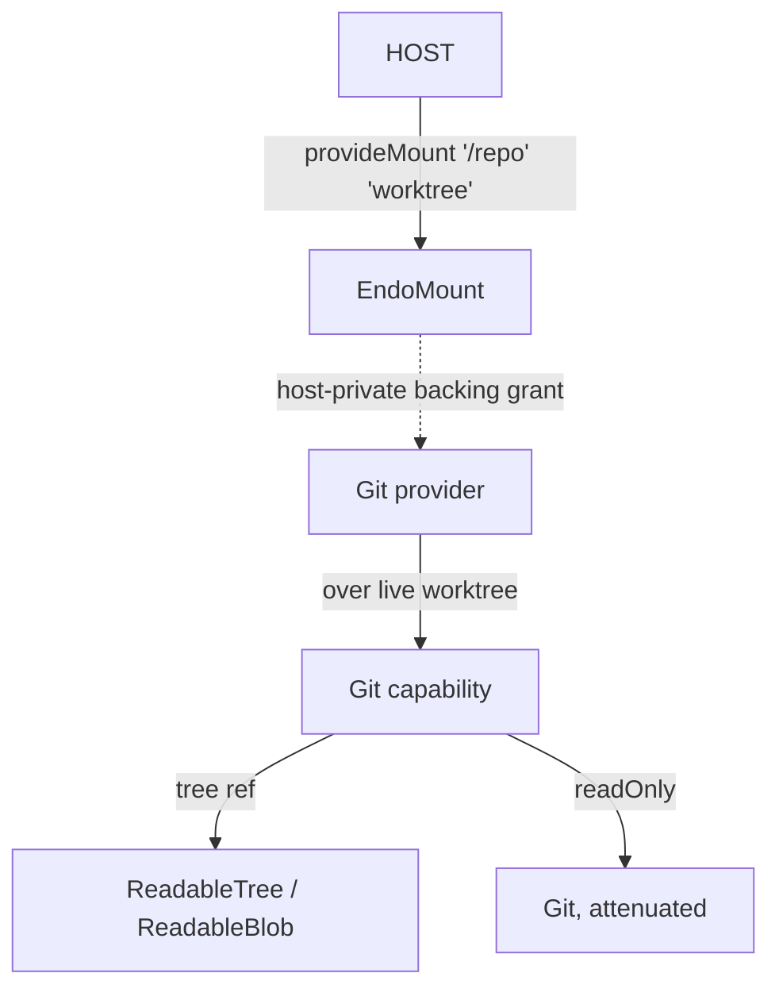
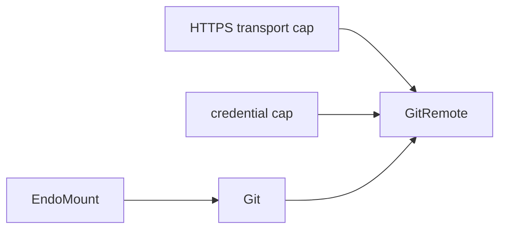
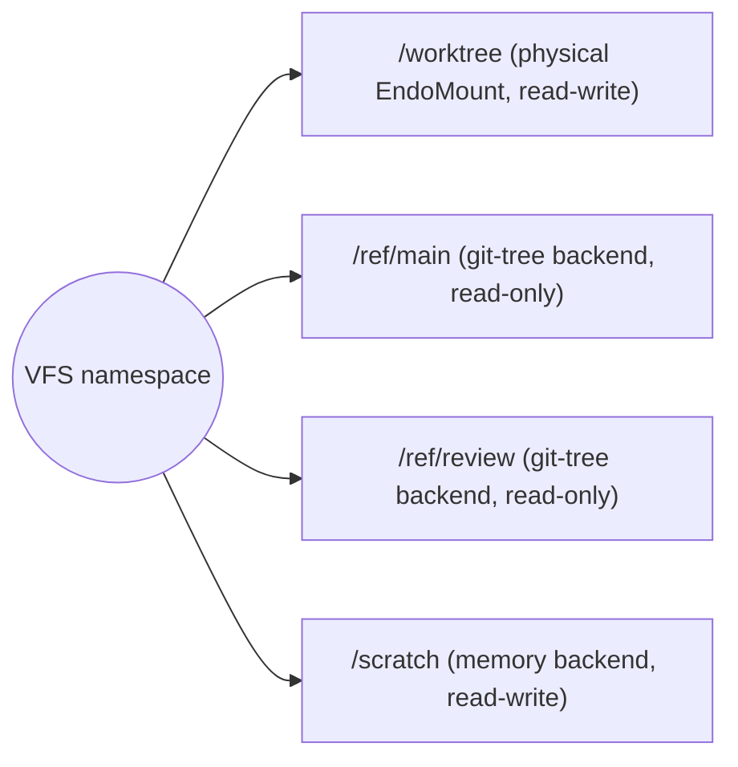

# Daemon Git Capability over EndoMount

| | |
|---|---|
| **Created** | 2026-05-18 |
| **Updated** | 2026-05-20 |
| **Author** | 0xPatrick (prompted) |
| **Status** | Proposed |

> **Read in order.**
> This is doc 2 of 3.
> It requires [daemon-mount-capabilities](daemon-mount-capabilities.md) (doc 1) as a prerequisite and is required by [daemon-git-remotes](daemon-git-remotes.md) (doc 3).

## Summary

Define a local-git capability `Git` whose authority is derived from an already-authorized `EndoMount` (not from a path string).
Worktree operations (status / diff / log / add / commit / branch / merge / rebase / stash) and historical tree reads (`tree(ref)`) live on `Git`; `Git.readOnly()` attenuates the cap for read-only auditor agents, matching the `EndoMount.readOnly()` idiom.
Path-bearing inputs are `EndoMountEntry` values, not free-form strings.
The first backend is native git (`NativeGitBackend`) on a pinned `git >= 2.30`, with the hardening envelope (sanitized env, askpass-only authentication, allowlist, repo-local-filter rejection) called out separately from the essential `GitBackend` contract so a future JS backend can implement the essential parts without inheriting native-only methods.
Structured result shapes for diff / show / merge / rebase / stash arrive in a later phase; the first phase returns those as text so consumers can start integrating against the path-bearing inputs immediately.

## What You Should Know First

This document assumes you know the following primitives from [daemon-mount-capabilities](daemon-mount-capabilities.md) (doc 1) in one-line form; the rest of the doc names them without re-introducing them.

- **`EndoMount`** is the daemon's live-mount Exo: confined live access to one physical directory, returns `EndoMountFile` handles, and is structurally compatible with `ReadableTree`.
- **`EndoMountFile`** is the live mutable-file handle minted by `EndoMount.lookup()`; it is structurally compatible with `ReadableBlob`.
- **`EndoMountEntry`** is the mount-scoped value-shaped descriptor for a path that may not currently exist on disk; the `Git` capability consumes entries (not free-form path strings) for its path-bearing methods.
- **`EndoMountBacking`** is the host-private Exo facet on the mount formula that trusted daemon code uses to reach the physical worktree without leaking the path to guests; `provideGit` uses it to verify a mount is physical.
- **`ReadableTree` / `ReadableBlob`** are the shared read-surface interfaces in [platform-fs](platform-fs.md); `Git.tree(ref)` returns a `ReadableTree`.

## What is the Problem Being Solved?

Agents need useful local git workflows without receiving ambient shell authority, raw host paths, or network authority.
The earlier [daemon-agent-tools](daemon-agent-tools.md) note sketches a path-scoped `Git` wrapper, and `packages/fae` now has a practical reference implementation of that idea.
That implementation is useful as a native-git adapter prototype, but its public authority boundary is still a configured repository-root string.

The newer filesystem work changes the right abstraction boundary:

- live worktree authority should come from `EndoMount`;
- existing live files should be represented by `EndoMountFile`;
- paths that do not currently have live handles should be represented by mount-scoped descriptors, not ambient strings;
- immutable commit trees should surface as `ReadableTree` providers inside the broader filesystem model.

This document revises the git design around those facts.

## Goals

1. Define a git capability whose authority is derived from an existing physical worktree mount rather than from an arbitrary path string.
2. Preserve useful local git workflows without exposing raw git command execution, network operations, or repository configuration mutation.
3. Make the public API handle-first by using `EndoMount`, `EndoMountFile`, and `EndoMountEntry`.
4. Distinguish mutable physical-worktree operations from immutable git-tree reads.
5. Keep the implementation backend swappable so native git, a JS git library, or a future daemon-native backend can share one public capability contract.
6. Preserve room for bulk native-git data paths, such as `git archive`, so large immutable tree reads do not degenerate into one subprocess or one remote object turn per file.

## Non-Goals

- Defining remote transport, fetch, pull, push, or credential management in this local-worktree document.
  Those are MVP-relevant, but they require separate network and credential authority and are specified in [daemon-git-remotes](daemon-git-remotes.md).
- Arbitrary shell access.
- Raw `git` passthrough.
- Exposing repository config, hooks, aliases, or arbitrary filters to guests.
- Making a CAS tree or arbitrary virtual tree behave as a writable git worktree.
- Replacing the multi-provider filesystem design with git-specific special cases.

## Dependencies

| Design | Relationship |
|---|---|
| [daemon-mount-capabilities](daemon-mount-capabilities.md) | Required prerequisite: snapshot bridge, mount-scoped descriptors, handle-oriented navigation, and trusted backing provenance. |
| [daemon-mount](daemon-mount.md) | Current physical mount formula implementation. |
| [platform-fs](platform-fs.md) | Shared `ReadableTree` / `SnapshotTree` vocabulary for git tree exposure. |
| [daemon-capability-filesystem](daemon-capability-filesystem.md) | Broader multi-provider VFS model including physical and git-tree backends. |
| [daemon-agent-tools](daemon-agent-tools.md) | Earlier agent-facing sketch to be revised by this design. |
| [daemon-git-remotes](daemon-git-remotes.md) | Companion MVP design for fetch, pull, push, and credentialed remote use. |

## Current State

### Useful Reference Implementation

The current Fae git tool demonstrates several implementation details worth preserving:

- local-only workflow coverage;
- explicit operation allowlisting;
- sanitized git environment;
- disabled hooks, fsmonitor, external diff, signing, and prompt-based auth;
- repository-root verification;
- rejection of repo-local executable filters and merge drivers.

That work should remain useful as a reference for a `NativeGitBackend`.

### What Changes in This Design

| Earlier shape | Revised shape |
|---|---|
| Repository root string configured authority | `EndoMount` carries public worktree authority |
| Path strings were passed into git calls | `EndoMountEntry` values are passed after mount-local resolution |
| Git only meant commands against a worktree | Git exposes worktree mutation, `tree(ref)` for immutable historical reads, and `readOnly()` for in-place attenuation |
| Adapter details leaked into the tool design | Public `Git` capability is backend-shaped (native-first), with `NativeGitBackend` named separately |

## Architecture



The public worktree authority remains the `EndoMount`.
Trusted daemon code uses a hidden backing grant to prove that the mount is physical and to reach the repository metadata required by the chosen backend.

## Two Git Concerns, Kept Separate

### 1. Physical Worktree Capability

A physical worktree capability is the mutable side:

- status
- add / restore
- commit
- branch switching
- merge / rebase
- stash

It requires a real worktree and repository metadata.
It should be granted only for an `EndoMount` backed by a physical directory that is exactly the repository worktree root.

### 2. Git-Tree Backend

A git-tree backend is the immutable side:

- expose `HEAD^{tree}` or another tree-ish as a read-only filesystem tree;
- browse source at a commit without mutating the worktree;
- provide stable inputs for diffs, checkouts, snapshots, or future VFS composition.

The result should implement `ReadableTree`, with blobs implementing `ReadableBlob`.
Once the VFS compositor exists, git trees become ordinary read-only providers mounted beside physical, memory, and CAS backends.

Keeping these concerns separate avoids forcing immutable commit trees to pretend they can support live worktree mutations.

## Capability Construction

The host flow is capability-derived.
`provideGit()` takes an `EndoMount` capability as its first argument and a pet name as the second:

```js
const worktree = await E(host).provideMount('/repo', 'repo-worktree');
const git = await E(host).provideGit(worktree, 'repo-git');
```

The `petName` (the second argument, `'repo-git'` in the example above) registers the constructed `Git` capability in the host's name table so the operator can later resolve it back by name (e.g., `await E(host).lookup('repo-git')`).  It is purely a host-side handle for later lookup; the `Git`-deriving authority is the mount cap, not the name.

Cap-passing is the only normative form on `provideGit`.
Pet-name lookup is not part of this API: an agent-facing CLI or tool adapter that needs to look up a mount by name uses a separate `E(host).lookup(name)` capability (or whatever convenience method the harness layer provides) to resolve the name to a mount cap *before* calling `provideGit`.

`provideGit()`:

1. takes a mount capability;
2. uses the host-private mount backing grant (see [daemon-mount-capabilities](daemon-mount-capabilities.md) § Host-Private Physical Backing) to prove the mount is physical;
3. verifies that the physical mount root is exactly a git worktree root;
4. constructs a `Git` formula / Exo tied to that mount identity;
5. stores only the formula references required to reconstitute the capability, not a guest-visible free-form path.

The required invariant is that git authority can only be derived from an already-authorized mount.
There must be no parallel host API that mints local `Git` from a raw path string once the mount model exists; that would reintroduce an independent filesystem authority path beside `EndoMount`.

### Read-only construction paths

`provideGit` accepts either a writable mount or a read-only mount.
Both construction paths are valid; the invariant the formula enforces is that both produce the **same authority shape internally**:

```js
const git = await E(host).provideGit(writableMount, 'repo-git');
// mutable Git

const roGit1 = await E(git).readOnly();
// read-only Git

const roGit2 = await E(host).provideGit(readOnlyMount, 'repo-git-ro');
// also read-only Git
```

Those two read-only `Git` caps expose the same read surface and reject the same mutation methods.
Read-only state is part of the `Git` capability / formula itself, not just a wrapper convention: `provideGit(readOnlyMount)` constructs a `Git` whose mutability flag is already false; it does **not** briefly mint a writable `Git` and wrap it.

The same backing invariants — same repository-root verification, same backing-storage check — apply on both construction paths.
Git authority is bounded by the mount it was derived from, and `Git.readOnly()` can only attenuate further; it can never widen.

The same-authority-shape invariant is what makes the repository-identity pin (Design Decision 7) construct-able on a read-only mount in the first place: pinning needs read access to `.git/config` and `git rev-parse` output, and the read-only mount grants exactly that historical-contents read access at construction time.
See Design Decision 8 § *Two additional boundaries on a read-only `Git`* for the explicit cross-link between read-only mount authority and historical-contents grant, and for the inverse note (callers handing out a read-only `Git` derived from a read-only mount are simultaneously granting historical-contents read access, not just present-worktree read access).

Behavioral boundaries that follow from this same-authority-shape invariant are catalogued in § Design Decision 8 (allowed and rejected operations on a read-only `Git`) and § Design Decision 9 (`Git.readOnly()` idempotence and attenuation semantics).
`GitRemote` construction from a read-only `Git` is rejected for now, even for `fetch`, because fetching mutates `.git` object and ref state (see `daemon-git-remotes.md` § Capability Construction).

Remote repository use composes later without changing that root:



## Proposed Public Vocabulary

### `GitRef`

```ts
type GitRef = {
  name: string;
  kind: 'branch' | 'tag' | 'commit' | 'detached';
  oid?: string;
};
```

### `GitStatusEntry`

```ts
type GitStatusEntry = {
  entry: EndoMountEntry;
  path: string; // mount-relative display copy
  index:
    | 'clean'
    | 'added'
    | 'modified'
    | 'deleted'
    | 'renamed'
    | 'copied'
    | 'conflicted';
  worktree:
    | 'clean'
    | 'modified'
    | 'deleted'
    | 'untracked'
    | 'ignored'
    | 'conflicted';
  node?: EndoMountFile | EndoMount;
};
```

`entry` is the authority-bearing reference.
`path` is only presentation data.
`node` is present only when a live worktree object currently exists.

### `GitCommit`

```ts
type GitCommit = {
  oid: string;
  summary: string;
  author?: string;
  committedAt?: number;
};
```

### `Git`

```ts
interface Git {
  // The public filesystem authority this Git capability is tied to.
  worktree(): EndoMount;

  // Repository inspection.
  status(): Promise<GitStatusEntry[]>;
  diff(options?: {
    cached?: boolean;
    base?: GitRef | string;
    head?: GitRef | string;
    entries?: EndoMountEntry[];
  }): Promise<string>;
  log(options?: {
    maxCount?: number;
    ref?: GitRef | string;
  }): Promise<GitCommit[]>;
  show(ref: GitRef | string): Promise<string>;
  revParse(ref: GitRef | string): Promise<GitRef>;

  // Worktree and index mutation.
  add(entries: EndoMountEntry[]): Promise<void>;
  restore(entries: EndoMountEntry[], options?: { staged?: boolean }):
    Promise<void>;
  commit(message: string): Promise<GitCommit>;

  // Branching.
  currentBranch(): Promise<GitRef | undefined>;
  branches(): Promise<GitRef[]>;
  createBranch(name: string, options?: {
    startPoint?: GitRef | string;
    switchAfterCreate?: boolean;
  }): Promise<GitRef>;
  deleteBranch(name: string, options?: { force?: boolean }): Promise<void>;
  renameBranch(from: string, to: string): Promise<void>;
  // Branch checkout and detached-HEAD checkout are separate methods so
  // the `*Branch` family stays coherent.  switchBranch(name) checks out
  // a branch by name (matches `git switch <branch>`); detach(ref)
  // performs a detached-HEAD checkout of any other ref — tag, commit
  // oid, or arbitrary tree-ish — and matches `git switch --detach
  // <ref>` / `git checkout --detach <ref>`.
  switchBranch(name: string): Promise<void>;
  detach(ref: GitRef | string): Promise<void>;

  // History editing and integration.
  merge(ref: GitRef | string, options?: { noFastForward?: boolean }):
    Promise<string>;
  rebase(input:
    | { mode: 'start'; upstream: GitRef | string }
    | { mode: 'continue' }
    | { mode: 'abort' }
    | { mode: 'skip' }): Promise<string>;

  // Local stash state.
  stashPush(options?: {
    message?: string;
    entries?: EndoMountEntry[];
    includeUntracked?: boolean;
  }): Promise<string>;
  stashList(): Promise<string[]>;
  stashShow(index?: number): Promise<string>;
  stashApply(index?: number): Promise<void>;
  stashPop(index?: number): Promise<void>;
  stashDrop(index?: number): Promise<void>;

  // Immutable tree access (one-turn read on the same capability).
  tree(ref: GitRef | string): Promise<ReadableTree>;

  // Attenuation to a read-only posture.  Mutation methods on the returned
  // cap throw at runtime in the first implementation phase; the type
  // narrows to drop them when structured shapes land in Phase 7.
  readOnly(): Git;
}
```

`tree(ref)` returns the read surface defined by `GitTreeProvider` below; the interface name remains as the documented shape of the returned read capability even though tree access lives as a method on `Git` itself.

`readOnly()` mirrors the `EndoMount.readOnly()` attenuation idiom ([daemon-mount-capabilities](daemon-mount-capabilities.md) § Design Decision 6): the returned `Git` exposes the same methods, but the mutation methods (`add`, `restore`, `commit`, `createBranch`, `deleteBranch`, `renameBranch`, `switchBranch`, `detach`, `merge`, `rebase`, `stashPush`, `stashApply`, `stashPop`, `stashDrop`) throw at runtime initially and are narrowed out of the type when structured shapes land (Phase 7).
A read-only auditor agent holds the attenuated `Git`; the operator hands it `await E(git).readOnly()` rather than the unattenuated cap.

### Alternatives Considered for Tree Access Shape

The design panel recommended splitting tree access off `Git` into a separately-grantable `GitTreeProvider` capability obtained via `git.trees()`.
Two further shapes were considered.
The chosen shape (tree on `Git` plus `Git.readOnly()`) was picked for consistency with the existing `EndoMount.readOnly()` idiom and for the one-turn cost on the common case.

| Shape | Pros | Cons |
|---|---|---|
| **Chosen: `Git.tree(ref)` plus `Git.readOnly()`** | One-turn read on the common case (caller holds `Git`, wants `tree`).  Matches `EndoMount.readOnly()` idiom.  Read-only auditor is `await E(git).readOnly()` — no new cap shape. | No standalone "tree-only" grant shape: a caller who should only read historical trees still holds an attenuated `Git`, which advertises the read methods it does not care about. |
| **Considered: split-only (`git.trees() → GitTreeProvider.tree(ref)`)** | Cleanest decomposition: tree-only callers hold a different cap type, not an attenuated parent.  Matches decomplector's "different concerns → different caps" lens. | Two-turn cost on every read (`await E(git).trees()` then `await E(provider).tree(ref)`), unless the holder caches the provider.  No in-place attenuation pattern for the rest of `Git`. |
| **Considered: both axes (`Git.tree(ref)` + `Git.readOnly()` + separately-grantable `GitTreeProvider` via host shortcut)** | Covers every use case: one-turn tree access for `Git` holders, read-only attenuation posture, and tree-only grants for build systems / archivers that should never see worktree state. | Widest public surface.  Two ways to obtain a tree-reading capability (via `Git.tree(ref)` and via the separately-granted provider) is the kind of accidental complexity creep an implementation later regrets. |

If a real build-system or code-archiver use case surfaces that wants a genuinely tree-only grant (without worktree-method advertisement at all), the implementation can revisit and add the separately-grantable `GitTreeProvider` shape.
Until then, an attenuated `Git` plus `tree(ref)` covers the auditor case without inventing a new cap type.

The initial implementation can keep some result types textual where the stable structure is not yet worth committing to.
The path-bearing inputs should not regress back to arbitrary strings.

### Sample Use

```js
// status the worktree
const entries = await E(git).status();
for (const entry of entries) {
  if (entry.worktree !== 'clean') {
    console.error(entry.path, entry.worktree);
  }
}

// stage a file, commit it
const readme = await E(worktree).entry('README.md');
await E(git).add([readme]);
const commit = await E(git).commit('docs: update README');

// browse a historical tree without touching the worktree
const headTree = await E(git).tree('HEAD');
const oldReadme = await E(headTree).lookup('README.md');
const text = await E(oldReadme).text();

// hand a read-only attenuated Git to an auditor agent
const auditor = await E(git).readOnly();
await E(auditor).status();          // ok — read method
await E(auditor).commit('nope');    // throws — mutation method on read-only
```

### Structured Result Shapes (Phase 7)

The text-returning methods (`diff`, `show`, `merge`, `rebase`, `stashList`, `stashShow`) ship as `Promise<string>` in the first implementation phase and gain structured-shape siblings in Phase 7 of the Implementation Plan.
Naming the eventual shapes here lets first-phase consumers plan a clean migration instead of writing a parser they will have to throw away.

```ts
type GitDiffHunk = {
  oldStart: number;
  oldLines: number;
  newStart: number;
  newLines: number;
  lines: Array<{ kind: 'context' | 'add' | 'remove'; text: string }>;
};

type GitFileDiff = {
  oldEntry?: EndoMountEntry;
  newEntry?: EndoMountEntry;
  oldMode?: number;
  newMode?: number;
  status: 'added' | 'modified' | 'deleted' | 'renamed' | 'copied';
  hunks: GitDiffHunk[];
  binary?: { oldSizeBytes?: number; newSizeBytes?: number };
};

type GitDiff = { files: GitFileDiff[] };

type GitShow = {
  commit: GitCommit;
  parents: string[];
  diff: GitDiff;
};

type GitConflict = {
  entry: EndoMountEntry;
  base?: { oid: string };
  ours: { oid: string };
  theirs: { oid: string };
  markerStyle: 'merge' | 'diff3';
};

type GitMergeResult =
  | { status: 'up-to-date'; head: GitRef }
  | { status: 'fast-forward'; head: GitRef }
  | { status: 'merged'; head: GitRef; merged: GitCommit }
  | { status: 'conflicts'; conflicts: GitConflict[] };

type GitRebaseResult =
  | { status: 'completed'; head: GitRef; replayed: GitCommit[] }
  | { status: 'conflicts'; current: GitCommit; conflicts: GitConflict[] }
  | { status: 'aborted'; head: GitRef }
  | { status: 'in-progress'; current: GitCommit };
```

Phase 7 upgrades the `Git` interface in place; the first phase's text-returning methods move under `*Text()` siblings (`diffText`, `showText`, …) so callers that still want the porcelain output for display can keep it.
The migration is named in `## Migration Strategy` as a discrete step rather than an ambient "we'll structurally-improve later"; consumers who write against the first phase can flip to the structured shapes by replacing one method call per site.

`stashList`'s structured shape, in the same vein, becomes `Promise<Array<{ index: number; ref: GitRef; message: string; created: GitCommit }>>`.
It ships as part of the same Phase 7 cut.

## Why `EndoMountEntry` Is Required

`EndoMountFile` is correct for an existing file, but git routinely needs to talk about entries that are not live file handles:

- a tracked file deleted from the worktree;
- an untracked path before it is created or staged;
- an index entry absent from the filesystem;
- a conflict path;
- a historical path in another tree.

The git API therefore needs mount-relative entry descriptors in addition to live handles.
Without them, the design inevitably falls back to free-form relative strings and loses the provenance supplied by the mount.

## Git-Tree Backend

### Read Surface

The git-tree backend's read surface is `ReadableTree` (with blobs as `ReadableBlob`).
`Git.tree(ref)` returns it directly:

```ts
interface GitTreeProvider {
  // Documented name for the shape Git.tree(ref) returns when factored
  // out conceptually; tree access is a method on Git itself, not a
  // separately-grantable cap.  See § Alternatives Considered for Tree
  // Access Shape for the trade-off.
  tree(ref: GitRef | string): Promise<ReadableTree>;
}
```

The returned tree should:

- resolve the ref in the repository object database;
- expose directories as `ReadableTree`;
- expose blobs as `ReadableBlob`;
- never expose mutation methods;
- be usable anywhere a `ReadableTree` is accepted today, including checkin, checkout, staging, and later VFS mounting.

### VFS Integration

When the VFS namespace exists, a host could compose:



The guest sees ordinary filesystem trees.
Git remains the provider of the immutable revision-backed trees, not a special path syntax inside the VFS.

### Bulk Tree Data Plane

The public read surface should stay `ReadableTree` / `ReadableBlob`, but the native backend should not be limited to the smallest possible git primitive for every use case.
Lazy browsing can reasonably use commands such as `git ls-tree` and `git cat-file` because an agent may only inspect a handful of entries.
Whole-tree materialization is different: `storeTree()`, `stageTree()`, checkout-like flows, caplet source import, and future VFS composition may need hundreds or thousands of files from one commit.

For those bulk paths, a native backend should be allowed to amortize the cost of shelling out by streaming a subtree in one operation:

```sh
git archive --format=tar HASH path/to/thing
```

or equivalently by resolving the subtree first and archiving that tree-ish.
Trusted daemon code can then parse the tar stream and feed the content store or scratch-mount writer directly.
The important point is that the tar stream is a private backend data plane.
The guest still receives object capabilities and structured results, not host paths, tar bytes, or raw git command authority.

This optimization matters whenever many files from one revision flow into a single sink: importing a commit subtree into content-addressed storage, staging a git tree into a scratch mount, constructing a source archive, indexing many files at once.
For one-off interactive reads, lazy `lookup()` and blob reads keep latency low and avoid loading data the agent will not use.

The archive path must obey the same authority and validation rules as the rest of the git-tree backend:

- the ref is resolved inside the already-authorized repository;
- subtree paths are normalized git-tree path segments, not host paths;
- archive entry names are treated as untrusted input and checked for absolute paths, `..`, NUL bytes, duplicate entries, and unsupported modes;
- symlink, executable-bit, and directory mode handling is explicit rather than inherited from a host `tar` command;
- extraction is performed by trusted code into CAS formulas or an authorized scratch mount, never by giving the guest a destination path;
- archive generation uses argument arrays, not shell interpolation.

Compression is a secondary concern.
`git archive --format=tar` is already valuable because it batches traversal and file transfer.
A compressed variant may be useful for storage or network hops, but the first optimization target is reducing process and object-call overhead while preserving the same public capability boundary.

## Backend Boundary

The public `Git` capability is shaped for the native-git backend in [`packages/fae`](../packages/fae)'s existing reference implementation.
A later JS backend (`isomorphic-git`, an Endo-native HTTP git smart-protocol client, a daemon-local object-database walker) may require contract revisions in a later phase.
The contract below is best-effort backend-pluggable, not contractually backend-replaceable; methods that turn out to leak native-git assumptions (sanitization, askpass, allowlist rejection) move to a `NativeGitBackend` sub-interface in a later phase if and when that swap actually happens.

```ts
// Essential backend contract (every backend must satisfy):
interface GitBackend {
  assertRepositoryRoot(): Promise<void>;
  status(): Promise<BackendStatusEntry[]>;
  diff(...): Promise<string>;
  add(...): Promise<void>;
  // ...
  tree(ref: string): Promise<ReadableTree>;
}

// Native-git-shaped contract; carries the hardening envelope:
interface NativeGitBackend extends GitBackend {
  sanitizeChildEnv(env: Record<string, string>): Record<string, string>;
  rejectRepoLocalExecutables(): Promise<void>;
  // …native-only operational surface
}
```

The split is deliberate: it names the parts of today's implementation that are accidentally specific to shelling-out, so a future JS backend can implement the essential contract without inheriting hooks that do not apply to it.
Until that swap actually happens, the only backend in flight is the native one.

### Initial Backend: Native Git

Start with a `NativeGitBackend` because the existing reference tool already proves the hardening envelope and local workflow shape:

- exact worktree-root verification;
- no shell interpolation;
- sanitized environment;
- disabled hooks and external execution paths;
- explicit operation allowlist;
- rejection of repo-local executable filters and merge drivers.

This backend uses the host-private physical mount backing, not a path granted to the guest.

#### Native Git Version Pin

The backend pins **`git >= 2.30`** as its minimum supported version (ships with Ubuntu 22.04 LTS, macOS Monterey's git-installable, Homebrew's default, RHEL 9, and Debian 12).
The load-bearing features that motivate the 2.30 floor — and that a future maintainer considering lowering the floor must replace or work without — are `git status --porcelain=v2` (introduced in 2.11, the stable machine-readable status format the `status()` parser depends on) and `git rev-parse --end-of-options` (introduced in 2.24, the explicit option/positional separator the `revParse()` invocation uses to refuse ref strings that begin with `--`).
The chosen parsing surfaces are stable across that floor:

- `git status --porcelain=v2 --branch` for `status()` (NUL-terminated with `-z`);
- `git log --pretty=format:%H%x1f%s%x1f%aN%x1f%aI%x1e` for `log()`;
- `git diff --raw -z` plus `git diff` (text) for the first `diff()` phase; `git diff --no-color --no-ext-diff` invariants for the structured-shape hunk parser ([§ Structured Result Shapes (Phase 7)](#structured-result-shapes-phase-7));
- `git for-each-ref --format=...` for `branches()`;
- `git rev-parse --verify --end-of-options` for `revParse()`;
- `git ls-tree -z --long` and `git cat-file --batch` for lazy tree reads;
- `git archive --format=tar` for bulk tree reads.

The startup check runs `git --version` once per daemon instance and refuses to construct a `NativeGitBackend` on hosts whose git is older than the pinned floor.
Parsers assume the pinned formats; they reject and surface a structured error if a future host's git emits a format the parser does not recognize, rather than degrading silently.

For immutable tree reads, the native backend may expose both a lazy object view and a bulk archive reader internally.
Callers should not observe which strategy was used except through performance.
A small `lookup('README.md')` can use `cat-file`; a `storeTree()` over the same revision can use a single archive stream.

### Future Backends

A JS implementation such as an `isomorphic-git`-style backend remains a valid future experiment, especially for commit-tree reads or alternate storage backends.
Adopting one will sharpen the line between `GitBackend` (essential) and `NativeGitBackend` (native-only) and may surface methods that should move from one to the other.
Plan for the contract to evolve across phases rather than treating it as frozen.

Evaluation criteria for any future backend:

- support for the required local workflow surface;
- ability to honor the same confinement and filter/hook restrictions;
- ability to operate through mount / backend abstractions rather than ambient host paths;
- ability to provide an efficient bulk tree data plane for large immutable reads, whether by native `git archive`, batched object APIs, or direct object-database traversal;
- fidelity with native git behavior for merges, rebases, stashes, and index semantics where those operations are exposed.

## Security Model

### Authority Separation

| Capability | Allows |
|---|---|
| `EndoMount` | Live worktree filesystem access within one confined root |
| `Git` | Local repository operations over that worktree |
| network capability | Remote repository interaction, if separately granted |
| shell capability | Process execution, if separately granted |

Granting git does not imply shell or network authority.

Remote repository interaction is still required for an agent MVP; it is specified separately in [daemon-git-remotes](daemon-git-remotes.md) so that the extra network and credential authority remains explicit.

### Required Restrictions

- No raw git command passthrough; no public config mutation.
- No push, pull, fetch, clone, remote mutation, or credential helpers (those live separately on [daemon-git-remotes](daemon-git-remotes.md)).
- No hooks, aliases, external diff, fsmonitor, textconv, custom filters, merge drivers, or signing helpers unless a future explicit capability design authorizes them.
  Repo-local executable filter / merge-driver config is verified absent before each mutating worktree operation (`add`, `restore`, `commit`, branch create / rename / delete / switch, `detach`, `switch`, `merge`, `rebase`, and the worktree-touching `stash*` verbs).
  Read-only inspection methods (`status`, `diff`, `log`, `show`, `revParse`, `branches`, `currentBranch`, `stashList`, `stashShow`, `tree`) dispatch straight to the backend and do not re-check, because they cannot invoke a filter or merge driver in the first place.
- No accepting arbitrary host paths; all path-bearing operations consume `EndoMountEntry` values from the same worktree mount.

### Read-Only and Snapshot Interactions

- A read-only worktree mount may support inspection and immutable tree reads but must reject mutating git operations.
- `git.tree(ref)` returns immutable read capabilities (a `ReadableTree`); the returned tree never exposes mutation.
- `git.readOnly()` returns a `Git` whose mutation methods throw; use it to grant an auditor agent inspection authority without the worktree mutation surface.
- `worktree.snapshot()` remains the way to capture the live worktree into content-addressed snapshot storage.

## Agent-Facing Tool Adapters

`Git` is a capability, not necessarily the exact LLM tool schema.
Lal, Fae, or Genie can adapt it into tool calls:

- resolve user-entered relative paths through the granted worktree mount;
- convert those paths immediately into `EndoMountEntry` values;
- call the git capability with entries;
- present copied relative paths and structured status data back to the LLM.

The existing Fae git tool can survive as a transitional reference branch and later be replaced by a thin adapter over the proper `Git` capability.

## Implementation Plan

### Phase 0: Mount Prerequisites

Complete the required phases from [daemon-mount-capabilities](daemon-mount-capabilities.md):

- [ ] `snapshot()`;
- [ ] `EndoMountEntry`;
- [ ] handle-oriented open/create APIs;
- [ ] metadata;
- [ ] host-private physical backing provenance.

### Phase 1: Backend Contract and Formula Skeleton

- [ ] Add `GitBackend` abstraction.
- [ ] Add `Git` interface guards and types.
- [ ] Add `git` formula type tying a git capability to a mount formula identity.
- [ ] Add host method to derive git from an existing physical worktree mount.
- [ ] Add exact-repository-root verification.

### Phase 2: Local Inspection Surface

- [ ] Implement `worktree`, `status`, `diff`, `log`, `show`, and `revParse`.
- [ ] Convert backend path results into `EndoMountEntry` values minted from the worktree mount.
- [ ] Return structured status entries with optional live nodes when available.

### Phase 3: Local Mutation Surface

- [ ] Implement `add`, `restore`, and `commit`.
- [ ] Implement branch listing / create / delete / rename / `switchBranch` / `detach`.
- [ ] Enforce read-only mount rejection on all mutation calls.
- [ ] Port the native hardening checks from the reference implementation into backend tests.

### Phase 4: Integration Workflows

- [ ] Implement merge, rebase, and stash operations.
- [ ] Define conflict-state reporting and ensure conflict entries are represented by `EndoMountEntry`, not path strings.
- [ ] Add restart / persistence tests for long-lived git capabilities.

### Phase 5: Git-Tree Reads and Read-Only Attenuation

- [ ] Implement `Git.tree(ref) -> ReadableTree` directly on the `Git` cap (the `GitTreeProvider` shape names the returned read surface).
- [ ] Implement `Git.readOnly()` returning an attenuated `Git`; mutation methods throw at runtime in this phase and are dropped from the type in Phase 7 alongside the structured-result-shape migration.
- [ ] Add tests for browsing blobs and subtrees at specific refs.
- [ ] Add tests for read-only attenuation: every mutation method on a `readOnly()` cap throws; every read method still works.
- [ ] Verify compatibility with existing checkin / checkout / stage-tree flows.
- [ ] Add a backend-private bulk tree path for large materialization operations, initially using `git archive --format=tar` if the native backend remains the practical implementation.
- [ ] Keep the read surface separable enough that, if a build-system or archiver use case surfaces a need for a tree-only-grant cap, the separately-grantable `GitTreeProvider` shape can be added without breaking `Git.tree(ref)` consumers (see § Alternatives Considered for Tree Access Shape).

### Phase 6: Agent Adapters and Migration

- [ ] Replace path-root Fae git provisioning with a thin adapter over granted `Git`.
- [ ] Add Lal / Genie registration over the capability rather than over process wrappers.
- [ ] Deprecate direct path-string git tool creation once capability-based provisioning exists.
- [ ] Update [daemon-agent-tools](daemon-agent-tools.md) to point at the revised model.

### Phase 7: Structured Result Shapes

- [ ] Land the structured shapes named in § Structured Result Shapes (`GitDiff`, `GitFileDiff`, `GitDiffHunk`, `GitShow`, `GitConflict`, `GitMergeResult`, `GitRebaseResult`, structured `stashList`).
- [ ] Rename the text-returning methods to `*Text` siblings (`diffText`, `showText`, `mergeText`, `rebaseText`, `stashListText`, `stashShowText`) so display consumers can keep the porcelain output.
- [ ] Drop mutation methods from the type of `readOnly()` cap returns; the runtime-throws behavior from Phase 5 stays as a defense-in-depth check.
- [ ] Migrate every in-tree consumer of the text methods to the structured shape in the same window; the `*Text` siblings remain available for consumers that still need porcelain.

## Testing Plan

### Capability Tests

- git can only be derived from a physical mount;
- mount root must equal the actual worktree root;
- entries from another mount are rejected;
- read-only mounts reject mutation;
- no guest-visible method leaks the physical path;
- **same-authority-shape invariant**: a read-only `Git` obtained via `await E(writableGit).readOnly()` exposes the same read surface and the same throw-on-mutation behavior as a read-only `Git` obtained via `provideGit(readOnlyMount)` — `__getMethodNames__()` returns the same set, and the same mutation methods reject;
- **`Git.readOnly()` is idempotent**: invoking `readOnly()` on an already-read-only `Git` returns the same cap (or an equivalent read-only cap with the same surface); composing it does not produce nested or differently-attenuated wrappers;
- **`GitRemote` construction from a read-only `Git` is rejected**: `provideGitRemote({ git: readOnlyGit, ... })` throws with a structured error citing the read-only posture;
- **`Git.tree(ref)` is allowed on a read-only `Git`** and reads historical repository contents reachable from `ref` (matching the read-only mount's historical-contents grant).

### Workflow Tests

- clean / modified / added / deleted / untracked / conflicted status;
- add / restore / commit;
- branch create / `switchBranch` / `detach` / rename / delete;
- merge, rebase, and stash happy paths plus conflicts;
- exact behavior after daemon restart;
- **daemon-restart mid-operation**: kill the daemon during `rebase` (between commits), restart, and confirm `rebase --continue` resumes cleanly from the recorded `.git/rebase-merge` state without orphaning the index;
- **`.git` replaced under the mount mid-operation**: swap the `.git` directory while a long `merge` is mid-conflict, confirm the next git call rejects the operation with a structured error rather than silently completing against the new repository;
- **mount-formula identity preserved across restart**: confirm `provideGit()` after restart re-derives the same `Git` cap as before the restart, with the same backing-facet identity check holding.

### Hardening Tests

- reject executable filters;
- reject merge drivers;
- ignore hooks and global/system config;
- disable network-facing operations;
- reject arbitrary unsupported operations.

### Tree Provider Tests

- browse commit trees;
- load blobs from historical refs;
- use git trees as `ReadableTree` inputs to existing snapshot and staging flows;
- materialize a large subtree through the bulk archive path and confirm it produces the same CAS / scratch-mount result as the lazy tree walk;
- reject malicious or malformed archive entries during trusted extraction;
- confirm immutability.

## Migration Strategy

1. Preserve the current Fae implementation as a reference branch and test corpus.
2. Build the mount prerequisites.
3. Introduce `Git` (text-returning `diff` / `show` / `merge` / `rebase` / `stashList` / `stashShow`) without removing any existing ad hoc tool immediately.
4. Move agent adapters onto `Git`.
5. Retire path-configured wrappers after the capability path is exercised in real workflows.
6. Land the structured-shape phase (Phase 7 of the Implementation Plan) alongside `*Text` siblings; migrate in-tree consumers to the structured shapes.

## Open Questions

This trio's open-question debt has been resolved into the Design Decisions below.
No open questions remain on this document; revisit if real implementation surfaces new ones.

### Resolved (recorded as Design Decisions)

- Tree-access shape (`tree(ref)` on `Git` plus `readOnly()` attenuation; separately-grantable `GitTreeProvider` is a documented alternative for future use cases) — decision 3 and § Alternatives Considered for Tree Access Shape.
- Structured `diff()` shape — decision 6.
- Structured conflict state in phase 4 — decision 6.
- Pinning repository identity separately from worktree mount — decision 7.
- Operations valid over a read-only worktree mount — decision 8.
- Read-only audit grant shape — decision 9; bulk-path exposure is a backend-private optimization, see decision 10.

## Design Decisions

1. **Git derives from `EndoMount`, by cap-passing.**
   `provideGit(mountCap, petName)` is the only normative entry point; cap-passing is the only form accepted.
   Pet-name lookup is not part of `provideGit` itself: agent-facing CLI / tool adapters that need it use a separate `E(host).lookup` capability (or whatever convenience the harness layer provides) to resolve a name to a mount cap before calling `provideGit`.
   No host API mints local `Git` from a raw path string once the mount model exists.
2. **Entries, not strings, carry path authority.**
   Path strings may appear at UI boundaries, but git operations consume mount-minted descriptors.
3. **Live worktree and immutable trees are separate methods, not separate capabilities.**
   Mutable worktree operations and `tree(ref)` both live on `Git`; read-only attenuation comes via `Git.readOnly()`, matching the `EndoMount.readOnly()` idiom.
   An audit-grant for a read-only auditor agent is `await E(git).readOnly()`; the auditor holds an attenuated `Git`.
   See § Alternatives Considered for Tree Access Shape for the split-capability variant the design panel originally recommended and the rationale for picking attenuation instead.
4. **Backend choice is best-effort pluggable, not contractually swappable.**
   The first-phase contract is shaped for the `NativeGitBackend` extracted from `packages/fae`.
   A future JS backend may force the essential `GitBackend` contract to narrow as native-only methods migrate to `NativeGitBackend`.
   The contract is allowed to evolve at backend-swap time rather than being treated as frozen.
5. **No hidden authority expansion.**
   Git does not imply network or shell access, and a read-only mount does not become writable through git.
6. **Text first, then structured shapes.**
   `diff` / `show` / `merge` / `rebase` / `stashList` / `stashShow` return `Promise<string>` in the first implementation phase; the structured-shapes phase (Implementation Plan § Phase 7) introduces the shapes named in § Structured Result Shapes (Phase 7) alongside `*Text` siblings for the porcelain output.
   Conflict state is modeled structurally from the structured-shapes phase onward (`GitConflict`).
7. **Pin repository identity separately from the worktree mount.**
   The git formula records (a) the worktree mount identity AND (b) a repository-identity pin captured at construction time, then verifies the pin before acting on every subsequent operation.
   This defends against `.git` being replaced under the mount (Open Question #4 in the early draft).
   Read-only inspection methods log a structured warning and fail-closed if the pin no longer matches.

   **Pin algorithm.**
   The pin is computed at construction time by reading `git rev-parse --git-common-dir --git-path config --git-path HEAD` inside the worktree, then hashing a canonical tuple of:

   - the absolute `--git-common-dir` (canonicalized, symlinks resolved);
   - the contents of `<common-dir>/config` at the moment of the pin, excluding mutable-by-design sections (`remote.*.url`, `branch.*.merge`, and similar settings the operator may legitimately edit post-pin without changing repository identity);
   - the OID of the first commit reachable from HEAD if the repo has commits (`git rev-list --max-count=1 HEAD`), or the sentinel `EMPTY` if the repo is unborn or empty.

   **Edge cases.**

   - **Linked worktrees** (`git worktree add`): the pin uses the `--git-common-dir`, not the `.git`-file's pointer.
     A worktree-add against the same parent repo therefore pins to the same identity, which is correct: the same git object database serves both worktrees.
   - **Detached HEAD**: the first-commit OID is used (HEAD's own OID for a detached single-commit case, the rev-list root otherwise); the pin is stable so long as that OID remains reachable.
   - **Submodules**: the pin is the submodule's own `--git-common-dir`, not the parent repo's.
     Swapping a submodule's `.git` indirection re-pins (correctly: it is a different repository as far as the submodule's local `Git` cap is concerned).
   - **Empty / unborn repos**: the `EMPTY` sentinel pins the repository identity to the unborn state.
     The first guest-initiated `commit` creates a first-commit OID that does not match the `EMPTY` sentinel, so the next pin-verification call fails closed with a structured warning naming the new first-commit OID.
     The host then re-derives `Git` against the now-non-empty repo to refresh the pin; the guest does not implicitly re-pin by committing.
     Fail-closed preserves the "guests cannot mutate the pin" invariant unconditionally (Design Decision 5): a guest-initiated commit must not silently widen the repository-identity authority a pin was minted to bound.

   **Re-pinning** is a host-side operation: the host can re-derive `Git` with a refreshed pin.
   Guests cannot mutate the pin under any path, including the unborn-to-non-empty transition above.
8. **Read-only worktree mounts permit inspection + immutable trees + `worktree.snapshot()`; reject everything else.**
   A read-only `Git` can be obtained two ways and the two paths produce the same authority shape (see § Read-only construction paths):
   - **Writable→readOnly path:** `await E(git).readOnly()` returns a read-only attenuation of a `Git` constructed from a writable mount.
   - **Read-only-mount-derived path:** `provideGit(readOnlyMount)` constructs a `Git` whose mutability flag is already false; the formula does not briefly mint a writable `Git` and wrap it.

   Allowed on a read-only `Git`: `status`, `diff`, `log`, `show`, `revParse`, `branches`, `currentBranch`, `tree(ref)`, `readOnly()` (idempotent — see Design Decision 9), and `worktree.snapshot()`.
   Rejected: `add`, `restore`, `commit`, `createBranch`, `deleteBranch`, `renameBranch`, `switchBranch`, `detach`, `merge`, `rebase`, `stashPush`, `stashApply`, `stashPop`, `stashDrop`.

   Two additional boundaries on a read-only `Git`:
   - `GitRemote` construction from a read-only `Git` is rejected for now.
     Even `fetch` mutates `.git` object and ref state, so the read-only posture cannot host a remote.
   - `tree(ref)` is allowed and grants access to historical repository contents reachable from `ref`.
     That is consistent with the read-only mount granting authority over repository history, but it must be made explicit on the grant: callers handing out a read-only `Git` derived from a read-only mount are simultaneously granting historical-contents read access, not just present-worktree read access.
9. **Read-only audit grants come via `Git.readOnly()`, not a separate cap shape; the method is idempotent.**
   The operator hands the auditor `await E(git).readOnly()` and the auditor holds an attenuated `Git` whose mutation methods throw.
   `Git.readOnly()` is idempotent: invoked on an already-read-only `Git`, it returns the same cap (or an equivalent read-only cap with the same surface); composing `readOnly()` calls does not produce nested or differently-attenuated wrappers.
   `readOnly()` can only attenuate further, never widen; it is a one-way attenuation operator.
   No `provideGitReadOnly()` or `provideGitTreeProvider()` host shortcut is part of the design; the readOnly() attenuation is the documented path.
   If a future use case wants a tree-only-grant cap that hides the worktree methods entirely, the separately-grantable `GitTreeProvider` shape from § Alternatives Considered can be added without breaking existing consumers.
10. **Bulk reads are a backend data plane.**
    Large immutable tree operations may use native archive streams internally (see § Bulk Tree Data Plane), but that does not change the guest-visible capability surface; no `stageGitTree()` style guest API exposes the bulk path.
