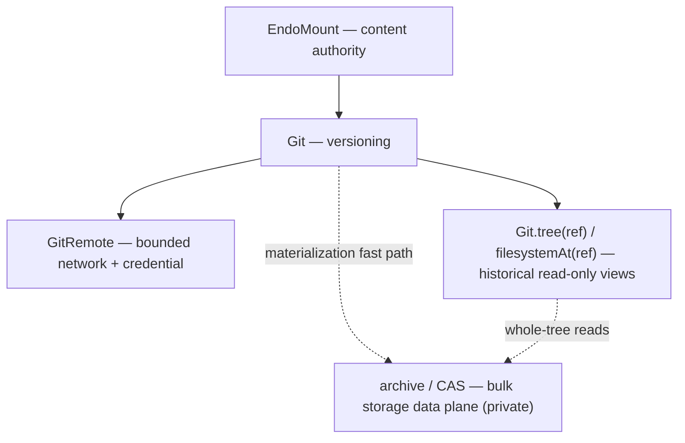

# Roadmap: The Version-Controlled Filesystem Loop

| | |
|---|---|
| **Created** | 2026-05-27 |
| **Updated** | 2026-06-03 |
| **Author** | 0xPatrick (prompted) |
| **Status** | Proposed |

> **Read in order.**
> This is the milestone roadmap that sits on top of the canonical Git trio.
> It requires [daemon-mount-capabilities](daemon-mount-capabilities.md), [daemon-git-capability](daemon-git-capability.md), and [daemon-git-remotes](daemon-git-remotes.md) as prerequisites.

## Summary

The canonical trio defines the capabilities; this document defines the **milestone** they add up to: a *version-controlled filesystem loop* an agent can drive end to end, without ever holding a host path, a shell, ambient network, or a credential it can read.

The north-star loop is one sentence:

> The operator provides a workspace; the agent reads, lists, and edits files through filesystem tools; asks Git for status and diff; commits; pulls and pushes through a bounded `GitRemote`; and inspects history — `HEAD~1`, other branches, the remote-tracking refs — by opening a read-only filesystem view of any ref.

This document orders the work that still sits between "the trio's capabilities are shipped" and "an agent runs that loop."
It invents no new capabilities of its own: each item links the canonical design where the capability shape is decided, or names the one new sibling design that item needs.

The shipped state of the underlying capabilities is not tracked here.
Per the doc-vs-issue split, follow-ups on the *landed* trio code (fixes, test coverage, legibility) live in issue #378, and the canonical trio docs ([daemon-git-capability](daemon-git-capability.md), [daemon-git-remotes](daemon-git-remotes.md)) carry their own implementation-progress notes.

## The Layer Split

The loop's authority decomposes into five layers.
Naming them explicitly is the load-bearing contribution of this roadmap, because every next step lands in exactly one layer and the priority order falls out of which layers gate which.

| Layer | Capability | Authority it carries | Canonical source |
|---|---|---|---|
| **Content** | `EndoMount` / `EndoMountFile` / `EndoMountEntry` | The live worktree: read, list, edit, stat, snapshot one confined physical subtree. The filesystem is the content authority — Git never becomes the way you edit a file. | [daemon-mount-capabilities](daemon-mount-capabilities.md) |
| **Versioning** | `Git` | Status, diff, log, stage, commit, branch, merge, rebase, stash over the content layer's worktree. Derived from an `EndoMount`, never from a path. | [daemon-git-capability](daemon-git-capability.md) |
| **Network + credential** | `GitRemote` | Bounded fetch / pull / push against one host-chosen endpoint, with non-extractable credentials and policy-fixed refspecs. The only layer that crosses the daemon boundary. | [daemon-git-remotes](daemon-git-remotes.md) |
| **Historical read** | git-tree views — `Git.tree(ref)` / `Git.filesystemAt(ref)` | Read-only snapshots of any ref: `HEAD~1`, a branch tip, a remote-tracking ref. The agent "looks at" history as an ordinary filesystem; it cannot mutate through this view. | [daemon-git-capability](daemon-git-capability.md) § Git-Tree Backend (`tree(ref)`); [endo-fs-from-git](endo-fs-from-git.md) (`filesystemAt(ref)`) |
| **Bulk storage (detail)** | archive / CAS / git-as-backend | How many files from one revision move efficiently into a sink (content store, scratch mount). A backend-private data plane, never a guest-visible API. | [daemon-git-capability](daemon-git-capability.md) § Bulk Tree Data Plane |

The split is the discipline that keeps the loop honest:

- **Content is not versioning.**
  An agent edits files through `EndoMount`, not through a git command.
  Git observes and records changes; it is not the editor.
- **Versioning is not network.**
  `Git` never reaches the wire.
  `GitRemote` is a separate, separately-revocable composition that bundles `Git` + transport + credential.
- **Historical read is not worktree mutation.**
  `Git.tree(ref)` / `filesystemAt(ref)` return read-only filesystem views; a holder of a history view cannot commit, stage, or push through it.
- **Bulk storage is an implementation detail, not a layer the agent sees.**
  The archive / CAS path exists so a whole-tree materialization does not degenerate into one subprocess per file.
  The guest still receives object capabilities and structured results, never tar bytes or host paths.

## Open Work

The items below are the genuinely-future work that closes the loop, ordered by how directly each closes it.
Each is a dispatchable work item or a pointer to the design that owns it.

- [ ] **Agent tool adapters over `Git` and `GitRemote` — deferred to #416.**
  A thin tool layer that exposes the `Git` and `GitRemote` methods through the agent harness's tool-call interface (Fae / Lal / Genie), converting path-bearing inputs to `EndoMountEntry` at the boundary so the agent sees `status` / `diff` / `add` / `commit` / `fetch` / `pull` / `push` as tool calls over a host-chosen mount, endpoint, transport, and credential.
  This is the loop's first work: every other item is the agent *calling* these tools.
  It is no longer specified here — PR #416 (the `endo-agent-tools` + `agentry-agent-builder` design pair) makes it concrete and wires this roadmap.
  The agent-tools `extra` seam ([endo-gateway-mcp](endo-gateway-mcp.md)) and the capability-tool model ([daemon-agent-tools](daemon-agent-tools.md)) are the surfaces it plugs into.

- [ ] **A worked end-to-end reference flow (bot-fork roadmap).**
  One worked example, run end to end: a maintainer's prompt → branch off `llm` via `Git` → edit files via `EndoMount` → `status` / `diff` / `commit` via `Git` → `push` a draft-PR branch via `GitRemote` → inspect the pushed ref via `filesystemAt`.
  This is exactly the bot-fork-roadmap pattern this garden already exercises by hand, which makes it the canonical real-world workload: a single pass touches the content, versioning, network, and historical-read layers at once, surfaces missing seams cheaply, then stands as a regression target.
  Depends on the agent tool adapters (#416, above).
  See [daemon-git-remotes](daemon-git-remotes.md) § Agent MVP Profile for the default remote profile the example runs under.

- [ ] **Repository bootstrap (`provideGitClone`) and the commit-author / identity boundary → a future `daemon-git-clone.md`.**
  Today the loop starts only from a worktree the operator pre-mounted; `GitRemote` is intentionally bound to an existing local `Git`, so cloning has no home on it.
  `provideGitClone(...)` — named in [daemon-git-remotes](daemon-git-remotes.md) § Repository Bootstrap and `clone` — composes mount creation + endpoint policy + sealed credential authority + clone-into-the-new-mount before a local `Git` exists, returning the resulting `EndoMount` + `Git`.
  Paired with it is the **commit-author / identity boundary**: the agent's commits must be attributed from a policy it does not control, which wants a capability shape rather than per-dispatch out-of-band knowledge.
  Together these close the "you give me a URL, the agent runs, and its commits are attributed correctly" gap.
  The bootstrap design (and the identity boundary as a section or sibling) lives in its own `daemon-git-clone.md`; depends on the `GitRemote` composition being stable.

- [ ] **Reconcile `tree(ref)` and `filesystemAt(ref)` into one canonical vocabulary — a focused edit to [daemon-git-capability](daemon-git-capability.md).**
  `tree(ref)` (returning `ReadableTree`) is specified in [daemon-git-capability](daemon-git-capability.md) § Git-Tree Backend and Design Decision 3; `filesystemAt(ref)` (returning an `@endo/endo-fs` `Filesystem`) is specified in [endo-fs-from-git](endo-fs-from-git.md).
  They are not two competing names for one thing — they are two methods in a projection relationship: `tree(ref)` projects the narrower `ReadableTree`, `filesystemAt(ref)` lifts the same git tree into the richer `Filesystem` (the same shape the content layer exposes for the live worktree).
  The edit names `filesystemAt(ref)` as the historical-read method and `tree(ref)` as its `ReadableTree` projection, cross-linking [endo-fs-from-git](endo-fs-from-git.md), so the canonical doc carries one historical-read API, not two.
  It must carry `filesystemAt`'s two documented trade-offs into the canonical vocabulary so they are not silently lost: the `Filesystem` view's QID is **path-based, not the git OID**, and its `BlobRef.algorithm` is **`'sha256'`, not the git tree's `git-sha1`** (both reintroducible if `wrapBackend` grows a backend-supplied QID / hash hook — see [endo-fs-from-git](endo-fs-from-git.md) § Status).
  This is a documentation merge, not a new design; it is listed because letting the two names drift apart in the canonical corpus is the failure this roadmap exists to prevent.
  Small, but it must happen in the same window the canonical doc next moves.

## Beyond the Loop

The following are real follow-ups that compose with the loop but are not on its critical path.
They are named so a builder dispatch does not mistake them for gaps in the milestone.

- [ ] **CLI git verbs** (`endo git status` / `log` / `diff`).
  The substrate for headless harnesses and the operator's debug loop; sibling of [cli-edit-verb](cli-edit-verb.md) / [cli-store-verb-text-modes](cli-store-verb-text-modes.md).
  The loop closes through the tool adapters (#416) without it; the CLI is a parallel surface, not a prerequisite.
- [ ] **Bank-backed credential durability.**
  Once [daemon-capability-bank](daemon-capability-bank.md) lands, the fd-pipe askpass helper sources credentials from the bank instead of the daemon-process-local map, surviving restart for multi-repo / scheduled workflows ([daemon-git-remotes](daemon-git-remotes.md) § Initial Backend).
- [ ] **Provider advisory layer.**
  An opt-in layer that *queries* (does not enforce) GitHub / GitLab / Forgejo branch-protection, draft-state, required-checks — useful when the agent needs to know "is this PR un-drafted?" before acting.
  Design Decision 10 of [daemon-git-remotes](daemon-git-remotes.md) keeps the *enforcement* boundary server-side; this only reads the provider API.
- [ ] **Linked-worktree and submodule worked example.**
  The pin algorithm ([daemon-git-capability](daemon-git-capability.md) Design Decision 7) handles `git worktree add` and submodules in theory; a worked example pins the contract.
- [ ] **Audit-log surfaces, timing observability, editor / patch-apply integration.**
  Operator-facing audit exports, the `captpMs` / `transportMs` timing fields ([daemon-git-remotes](daemon-git-remotes.md) § Spike Tasks), and composing `Git` with the chat / endopi edit tools so a proposed patch applies to the worktree as a real reviewable change.

## Dependencies

| Design | Relationship |
|---|---|
| [daemon-mount-capabilities](daemon-mount-capabilities.md) | Content layer (mount-scoped descriptors, snapshot, host-private backing). |
| [daemon-git-capability](daemon-git-capability.md) | Versioning + historical-read layers (`Git`, `tree(ref)`, `readOnly()`, bulk data plane, Phase 7 structured shapes). The `tree(ref)`/`filesystemAt(ref)` reconciliation is a focused edit here. |
| [endo-fs-from-git](endo-fs-from-git.md) | Historical-read foundation: `Git.filesystemAt(ref)` returning an `@endo/endo-fs` `Filesystem` over the git object database. The reconciliation item merges its vocabulary with `tree(ref)`. |
| [daemon-git-remotes](daemon-git-remotes.md) | Network + credential layer (`GitRemote`, credential injection, `provideGitClone` bootstrap, audit). |
| [endo-gateway-mcp](endo-gateway-mcp.md) | Defines `@endo/agent-tools` and the `extra` seam (`makeAgentTools(powers, { extra })`) that the agent tool adapters (#416) plug into. |
| [daemon-agent-tools](daemon-agent-tools.md) | Conceptual parent of the agent-tool capability model — names which capabilities (`Dir` / `Shell` / `Git`, now mount-derived) surface as agent tools. |
| [daemon-capability-bank](daemon-capability-bank.md) | Future home for durable credential authority (Beyond the Loop). |
| [cli-edit-verb](cli-edit-verb.md), [cli-store-verb-text-modes](cli-store-verb-text-modes.md) | CLI-side blob editing / storage; the CLI git verbs compose with them. |
| [endopi-edit-tool](endopi-edit-tool.md) | Endopi raft's edit-tool design; informs the agent-side edit-and-commit loop. |

## Design Decisions

1. **The roadmap is a milestone, not a capability catalogue.**
   It orders the work that turns the canonical trio into a loop an agent can drive; it invents no new capabilities.
   New capability designs (the clone bootstrap, the provider advisory layer) are named here but designed in their own documents.
2. **The layer split is the load-bearing contribution.**
   Content / versioning / network / historical-read / bulk-storage each carry a distinct authority; every roadmap item lands in exactly one layer, and the priority order falls out of which layers gate which.
   Keeping the layers distinct is what keeps the agent from editing through git, reaching the wire through `Git`, or mutating through a history view.
3. **Historical read is two methods in a projection relationship.**
   `filesystemAt(ref)` (returns a `Filesystem`) is the historical-read method; `tree(ref)` (returns the narrower `ReadableTree`) is its predecessor / projection.
   The canonical doc carries one API, reconciled rather than forked.
4. **The agent-tools layer belongs to #416, not here.**
   The agent tool adapters were this roadmap's "item 1"; PR #416 makes them concrete (`endo-agent-tools` + `agentry-agent-builder`) and wires this roadmap.
   This document defers to #416 rather than re-specifying the tool surface.
