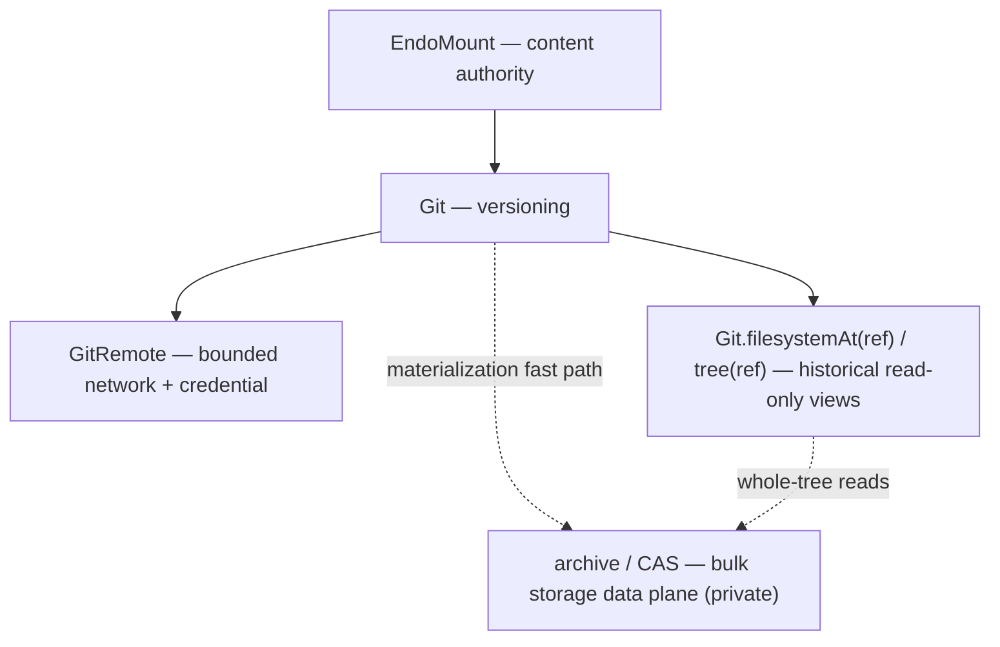

# Roadmap: The Version-Controlled Filesystem Loop

| | |
|---|---|
| **Created** | 2026-05-27 |
| **Updated** | 2026-07-11 |
| **Author** | 0xPatrick (prompted) |
| **Status** | In Progress |

> **Read in order.**
> This is the milestone roadmap that sits on top of the canonical Git trio.
> It requires [daemon-mount-capabilities](daemon-mount-capabilities.md), [daemon-git-capability](daemon-git-capability.md), and [daemon-git-remotes](daemon-git-remotes.md) as prerequisites.

## Summary

The canonical trio defines the capabilities; this document defines the **milestone** they add up to: a *version-controlled filesystem loop* an agent can drive end to end, without ever holding a host path, a shell, ambient network, or a credential it can read.

The north-star loop is one sentence:

> The operator provides a workspace; the agent reads, lists, and edits files through filesystem tools; asks Git for status and diff; commits; pulls and pushes through a bounded `GitRemote`; and inspects history — `HEAD~1`, other branches, the remote-tracking refs — by opening a read-only filesystem view of any ref.

This document orders the work that still sits between "the trio's capabilities are shipped" and "an agent runs that loop."
It invents no new capabilities of its own: each item links the canonical design where the capability shape is decided.

As of 2026-07-11 this document carries the **canonical, dependency-ordered phased build plan for the whole git-capability stack** (§ Phased Build Plan below), reconciled against the landed `@endo/agent-tools` git tools and the `EndoMount` substrate; the stack's designs ([daemon-git-capability](daemon-git-capability.md), [daemon-git-remotes](daemon-git-remotes.md), this roadmap, and [agentry-git-verb-gaps](agentry-git-verb-gaps.md)) flipped Proposed → In Progress together in the same pass.
It lives here, in the coordinating roadmap rather than in the neutral [designs/README.md](README.md), for the same reason the module-loading stack's plan lives in its integration-layer doc ([daemon-worker-import-from-mount](daemon-worker-import-from-mount.md) § Phased Implementation): this roadmap is already the document that ties the layers together, so placing the whole-stack sequence here keeps it beside the loop it closes.
The sibling designs number their remaining work against this sequence; [daemon-agent-tools](daemon-agent-tools.md) § Implementation Plan remains the normative spec for each tool-layer deliverable and cross-references the numbering below.

The shipped state of the underlying capabilities is not tracked here.
Per the doc-vs-issue split, follow-ups on the *landed* trio code (fixes, test coverage, legibility) live in issue #378, and the canonical trio docs ([daemon-git-capability](daemon-git-capability.md), [daemon-git-remotes](daemon-git-remotes.md)) carry their own implementation-progress notes.

## The Layer Split

The loop's authority decomposes into five layers.
Naming them explicitly is the load-bearing contribution of this roadmap, because every next step lands in exactly one layer and the priority order falls out of which layers gate which.

| Layer | Capability | Authority it carries | Canonical source |
|---|---|---|---|
| **Content** | `EndoMount` / `EndoMountFile` / `EndoMountEntry` | The live worktree: read, list, edit, stat, snapshot one confined physical subtree. The filesystem is the content authority — Git never becomes the way you edit a file. | [daemon-mount-capabilities](daemon-mount-capabilities.md) |
| **Versioning** | `Git` | Status, diff, log, stage, commit, branch, merge, rebase, stash over the content layer's worktree. Derived from an `EndoMount`, never from a path. | [daemon-git-capability](daemon-git-capability.md) |
| **Network + credential** | `GitRemote` | Bounded fetch / pull / push against one host-chosen endpoint, with non-extractable credentials and policy-fixed refspecs. The only layer that crosses the daemon boundary. | [daemon-git-remotes](daemon-git-remotes.md) |
| **Historical read** | git-tree views — `Git.filesystemAt(ref)` / `Git.tree(ref)` | Read-only snapshots of any ref: `HEAD~1`, a branch tip, a remote-tracking ref. The agent "looks at" history as an ordinary filesystem; it cannot mutate through this view. | [daemon-git-capability](daemon-git-capability.md) § Historical Read (`filesystemAt(ref)` with `tree(ref)` as its `ReadableTree` projection); [endo-fs-from-git](endo-fs-from-git.md) |
| **Bulk storage (detail)** | archive / CAS / git-as-backend | How many files from one revision move efficiently into a sink (content store, scratch mount). A backend-private data plane, never a guest-visible API. | [daemon-git-capability](daemon-git-capability.md) § Bulk Tree Data Plane |

The split is the discipline that keeps the loop honest:

- **Content is not versioning.**
  An agent edits files through `EndoMount`, not through a git command.
  Git observes and records changes; it is not the editor.
- **Versioning is not network.**
  `Git` never reaches the wire.
  `GitRemote` is a separate, separately-revocable composition that bundles `Git` + transport + credential.
- **Historical read is not worktree mutation.**
  `Git.filesystemAt(ref)` / `tree(ref)` return read-only filesystem views; a holder of a history view cannot commit, stage, or push through it.
- **Bulk storage is an implementation detail, not a layer the agent sees.**
  The archive / CAS path exists so a whole-tree materialization does not degenerate into one subprocess per file.
  The guest still receives object capabilities and structured results, never tar bytes or host paths.

```mermaid
flowchart TD
  mount["EndoMount — content authority"]
  git["Git — versioning"]
  remote["GitRemote — bounded network + credential"]
  hist["Git.filesystemAt(ref) / tree(ref) — historical read-only views"]
  bulk["archive / CAS — bulk storage data plane (private)"]

  mount --> git
  git --> remote
  git --> hist
  git -.->|materialization fast path| bulk
  hist -.->|whole-tree reads| bulk
```

## Landed Substrate (record only)

The plan below dispatches against substrate that is already on `llm`; a builder never waits on unlanded capability work outside this stack.
Recorded here once so the phases can cite it tersely:

- **Content layer complete.** [daemon-mount-capabilities](daemon-mount-capabilities.md) is Complete (all five phases); mount revocation caretaker + deny patterns landed via #650.
- **Local `Git` complete through history verbs.** #364 (capability, Phases 1–5), #367 (bulk archive), #371 (hardening), and #644 (`commit({ amend })` + `reword` behind the gated `allowHistoryRewrite` axis).
- **`GitRemote` complete with controllers.** #365 (capability + controllers + policy validation), #368 (fd-pipe askpass credential injection).
- **Historical read landed.** `Git.filesystemAt(ref)` over `@endo/platform/fs/extended`'s `wrapBackend` ([endo-fs-from-git](endo-fs-from-git.md), In Progress: Phases 1–3 plus a Phase-4 slice).
- **Repository bootstrap landed.** `EndoHost.provideGitClone` + the `@endo/exo-git` cloner seam + the native clone helper (#538); see [daemon-git-remotes](daemon-git-remotes.md) § Repository Bootstrap and `clone`.
- **Agent tool layer partially landed.** `@endo/agent-tools` core + `makeGitTool` (#523/#524), file tools (#614), `Shell` capability + tool (#615), mount-bridged git `status`/`add` (#616), and the elevated `makeGitHistoryTool` (#644), per [daemon-agent-tools](daemon-agent-tools.md) § Implementation Plan.
  (Numbering caveat for builders: code comments around #616 say "Phase 3"; the canonical numbering in [daemon-agent-tools](daemon-agent-tools.md) calls that slice **Phase 3.5**, and reserves *its own* Phase 3 for the push tier — which the whole-stack plan below indexes as **Phase 1**. The two numbering spaces are disentangled under § Phased Build Plan.)

## Phased Build Plan

This section is the **canonical, dependency-ordered build plan for the git-capability stack** (reconciled and accepted 2026-07-11; the stack's design statuses flipped from Proposed to In Progress together).
Each phase is a dispatchable builder job; the owning design carries the normative shapes.
The phase numbers here (1–6) are this plan's own index and are distinct from each owning design's internal phase numbering: a row's `§ Phase N` citation refers to that owning design's number, not to this table's. (For instance, this plan's Phase 1 is [daemon-agent-tools](daemon-agent-tools.md)'s own § Phase 3, and this plan's Phase 6 is [daemon-git-capability](daemon-git-capability.md)'s own § Phase 7.)

| Phase | Owning design | Deliverable | Builds on |
|-------|---------------|-------------|-----------|
| 1 | [daemon-agent-tools](daemon-agent-tools.md) § Phase 3 (shapes: [endo-agent-tools](endo-agent-tools.md) § Git authority tiers; substrate: [daemon-git-remotes](daemon-git-remotes.md)) | `makeGitRemoteTool(remoteCap)` in `@endo/agent-tools`: `fetch` / `pull` / `push` tools whose bounds come entirely from the granted `GitRemote`; no policy re-statement in the tool layer | Landed substrate only: `GitRemote` + controllers (#365), askpass (#368), `ToolRecord` (#523) |
| 2 | [daemon-git-remotes](daemon-git-remotes.md) § Repository Bootstrap (identity residue; shape pinned in § Commit-identity boundary below) | Formula-owned commit-identity policy: an `{ identity: { authorName, authorEmail } }` construction-time option on `provideGit` / `provideGitClone`, guest-immutable, defaulting to today's `Endo <endo@invalid.local>` | Landed substrate only: `provideGit`, `provideGitClone` (#538), the `withGitEnvOverrides` per-invocation env seam in `@endo/git` |
| 3 | [daemon-agent-tools](daemon-agent-tools.md) § Phase 4 + this roadmap (acceptance flow) | Provisioning wired end to end for one harness, then the worked reference flow as the acceptance test: branch → edit via file tools → shell build step → status / diff / commit via git tools → push via the remote tool → inspect the pushed ref via `filesystemAt(ref)`. **The loop — the milestone's exit criterion — closes here.** | Phases 1 and 2 |
| 4 | [agentry-git-verb-gaps](agentry-git-verb-gaps.md) (shapes) + [daemon-agent-tools](daemon-agent-tools.md) § Phases 5–6 (tool exposure) | `cherryPick(ref, options?)`, `rebase({ autosquash })` for `mode: 'start'`, `checkoutConflict(entries, side)` across exo + guard + backend + code-mode + JSON surfaces; the `EndoGit` contract-test extension (the open [daemon-agent-tools](daemon-agent-tools.md) § Phase 5 residue) | Landed substrate only (local `Git`); **parallel-eligible with Phases 1–3** |
| 5 | [agentry-git-eval-scenarios](agentry-git-eval-scenarios.md) (draft PR #636) | Eval activation: `conflict-rebase` buildable against today's surface; the `stack-surgery` live row activates when the Phase-4 verbs land | Phase 4 for `stack-surgery`; landed substrate only for `conflict-rebase` |
| 6 | [daemon-git-capability](daemon-git-capability.md) § Phase 7 | Structured result shapes (`GitDiff`, `GitShow`, `GitMergeResult`, `GitRebaseResult`, `GitConflict`, structured stash), `*Text` porcelain siblings, `readOnly()` type narrowing | Landed substrate only; **parallel lane** — gates nothing in the loop or the eval lane |

Phases 1 and 2 are mutually independent — each builds only on landed substrate, with no edge between them — and Phase 3 is the join that closes the loop, the milestone's exit criterion. Phase 3 needs the remote tool (Phase 1) to push: that is a hard dependency. Phase 2 is sequenced before Phase 3 by priority rather than by hard dependency — the loop closes mechanically with the default `Endo <endo@invalid.local>` identity, so Phase 2 is the attribution-correctness gate on the acceptance flow (making the pushed commits' attribution policy-owned rather than the hardcoded backend default), not a prerequisite for that flow to run. The 1 → 3 push edge is thus the only hard sequencing constraint in the critical path.
Phases 4 → 5 are the agentry eval lane; they touch only the local `Git` surface, so they can run in parallel with the loop lane and are sequenced after it only by priority, not by dependency.
Phase 6 is an ergonomics lane on the same contract as the landed text-first surface; consumers migrate one call site at a time when it lands.
No phase waits on unlanded substrate or on a design outside this stack.

**Status and the #731 grandfathering (recorded 2026-07-19).**
The #731 parking of the JSON tool-wrapper surface does **not** abandon reviewed work already in flight; it bars *starting new* JSON-tool work.
The two in-flight phase PRs are explicitly **grandfathered** and land in their existing order — **#705 (Phase 1) then #707 (Phase 3)**; both are non-draft, green, and past their panel/repair rounds.
There is no contradiction between the parking notes in [daemon-agent-tools](daemon-agent-tools.md) / [agentry-git-verb-gaps](agentry-git-verb-gaps.md) and the Phase 1/3 rows above: the rows describe the grandfathered tail of the reviewed stack, and once it lands the door closes — follow-on JSON catalog expansion does not start, and new capability-exposure work prefers code mode over `ToolRecord` wrappers (the capability substrate itself stays prioritized).
Phase status: **Phase 2 shipped** — #706 merged 2026-07-16 (`4f09410a2e`). **Phase 4 shipped in substance** — #645 merged 2026-07-17 (`7e38e5c59b`), landing `commit({ amend })` / `reword` / `cherryPick` / `rebase({ autosquash })`; `checkoutConflict` did not land and is demoted to on-demand (the stack-surgery eval lane does not need it). Phase 5's `stack-surgery` fixture/scorer/pass-path rides draft #626.

### Commit-identity boundary (Phase 2 shape — shipped)

**Shipped:** #706 merged 2026-07-16 (`4f09410a2e`), implementing exactly the shape pinned below; the prose is kept as the normative record of that shape.

The agent's commits must be attributed from a policy it does not control.
Before #706 the native backend hardcoded `GIT_AUTHOR_NAME='Endo'` / `GIT_AUTHOR_EMAIL='endo@invalid.local'` (`makeGitEnv` in `@endo/git`'s `native-git-backend.js`), which was correct in shape (the guest cannot influence it) but not yet policy: every `Git` on a host committed as the same fictional author.
The pinned Phase-2 shape — the smallest one consistent with the trio's authority model, now landed via #706:

- `provideGit(mountCap, petName, { identity: { authorName, authorEmail } })` and the same option on `provideGitClone` — **formula-owned, captured at construction, guest-immutable** (the same ownership shape as `GitRemote`'s Phase-1 endpoint policy).
- Omitted, the identity defaults to the current backend defaults, so the change is strictly additive.
- The backend threads the identity per invocation through the existing `withGitEnvOverrides` seam; `reword`'s author-preservation behavior (it keeps the original commit's author) is unchanged.
- Changing an existing `Git`'s identity is a host-side re-derivation, exactly like re-pinning ([daemon-git-capability](daemon-git-capability.md) Design Decision 7); guests cannot mutate it.

Considered and rejected: a guest-visible `setIdentity()`. Reason: commit attribution is exactly the kind of authority the loop exists to keep out of the agent's hands.
Per-persona identity (deriving the policy from [daemon-capability-persona](daemon-capability-persona.md) rather than per-`provideGit` options) remains deferred until the persona design lands.

### Reconciliation deltas closed (2026-07-11)

Gaps found between the stack's documents and the landed code, closed in the same pass that accepted this plan:

- **`tree(ref)` / `filesystemAt(ref)` had drifted apart.** `filesystemAt(ref)` shipped on the `Git` exo, but the canonical doc still described `tree(ref)` as the only historical-read method. Now merged into [daemon-git-capability](daemon-git-capability.md) § Historical Read: `filesystemAt(ref)` is the historical-read method, `tree(ref)` its `ReadableTree` projection, with `filesystemAt`'s two documented trade-offs (path-based QID, `'sha256'` `BlobRef.algorithm`) carried into the canonical vocabulary rather than silently lost.
- **Repository bootstrap had landed without its planned design doc.** `provideGitClone` (#538) shipped host-mediated, matching [daemon-git-remotes](daemon-git-remotes.md) § Repository Bootstrap's second flow; the once-planned `daemon-git-clone.md` is no longer needed for the clone half. The residual gap is exactly the commit-identity boundary — Phase 2 above, since shipped via #706. **Sequencing against draft #709 (explicit, 2026-07-19):** #709 now proposes adding a `daemon-git-clone.md` record of the landed host-preclone → code-mode handoff. That is not a contradiction of this bullet but a deliberate follow-up to it: this PR lands first with the disposition stated here, and #709 then rebases as the focused follow-up whose scope is the retrospective bootstrap record and the code-mode handoff — the two branches must not land with divergent dispositions in parallel.
- **The gated history-rewrite axis had landed undocumented in the canonical doc.** #644 added `commit({ amend })` + `reword` behind a second attenuation axis (`allowHistoryRewrite`, default withheld) and the elevated `makeGitHistoryTool`; [daemon-git-capability](daemon-git-capability.md) now records it (§ Design Decision 11 and § Implementation Progress).
- **Phase-numbering drift between code and spec.** #616's code comments call the mount-bridged `status`/`add` tools "Phase 3"; the canonical [daemon-agent-tools](daemon-agent-tools.md) numbering calls them Phase 3.5 and reserves Phase 3 for the push tier. The plan above uses the canonical numbering.
- **README status drift.** `daemon-mount-capabilities` is Complete in its own doc and the summary table but was still Proposed in the M3 milestone table; synced.

## Beyond the Loop

The following are real follow-ups that compose with the loop but are not on its critical path.
They are named so a builder dispatch does not mistake them for gaps in the milestone.

- [ ] **CLI git verbs** (`endo git status` / `log` / `diff`).
  The substrate for headless harnesses and the operator's debug loop; sibling of [cli-edit-verb](cli-edit-verb.md) / [cli-store-verb-text-modes](cli-store-verb-text-modes.md).
  The loop closes through the tool adapters without it; the CLI is a parallel surface, not a prerequisite.
- [ ] **Bank-backed credential durability.**
  Once [daemon-capability-bank](daemon-capability-bank.md) lands, the fd-pipe askpass helper sources credentials from the bank instead of the daemon-process-local map, surviving restart for multi-repo / scheduled workflows ([daemon-git-remotes](daemon-git-remotes.md) § Initial Backend).
- [ ] **Provider advisory layer.**
  An opt-in layer that *queries* (does not enforce) GitHub / GitLab / Forgejo branch-protection, draft-state, required-checks — useful when the agent needs to know "is this PR un-drafted?" before acting.
  Design Decision 10 of [daemon-git-remotes](daemon-git-remotes.md) keeps the *enforcement* boundary server-side; this only reads the provider API.
- [ ] **Interactive remote provisioning and extended transports.**
  [daemon-git-remotes](daemon-git-remotes.md) § Phase 6 (form / CLI flows, trust-on-first-bind endpoint approval) and § Phase 7 (SSH transport design, Noise revisit).
- [ ] **Linked-worktree and submodule worked example.**
  The pin algorithm ([daemon-git-capability](daemon-git-capability.md) Design Decision 7) handles `git worktree add` and submodules in theory; a worked example pins the contract.
- [ ] **Audit-log surfaces, timing observability, editor / patch-apply integration.**
  Operator-facing audit exports, the `captpMs` / `transportMs` timing fields ([daemon-git-remotes](daemon-git-remotes.md) § Spike Tasks), and composing `Git` with the chat / endopi edit tools so a proposed patch applies to the worktree as a real reviewable change.

## Dependencies

| Design | Relationship |
|---|---|
| [daemon-mount-capabilities](daemon-mount-capabilities.md) | Content layer (mount-scoped descriptors, snapshot, host-private backing). Complete. |
| [daemon-git-capability](daemon-git-capability.md) | Versioning + historical-read layers (`Git`, `filesystemAt(ref)` / `tree(ref)`, `readOnly()`, the gated history-rewrite axis, bulk data plane, Phase 7 structured shapes). |
| [endo-fs-from-git](endo-fs-from-git.md) | Historical-read foundation: `Git.filesystemAt(ref)` returning a `Filesystem` over the git object database. Its vocabulary is merged into the canonical doc's § Historical Read. |
| [daemon-git-remotes](daemon-git-remotes.md) | Network + credential layer (`GitRemote`, credential injection, the landed `provideGitClone` bootstrap, audit); owns the Phase-2 identity residue. |
| [daemon-agent-tools](daemon-agent-tools.md) | The capability-to-tool build sequence this plan's Phases 1 and 3 dispatch (its Phases 3 and 4), and the tool exposure for Phase 4 (its Phases 5–6). |
| [endo-agent-tools](endo-agent-tools.md) | Normative tool surface (`ToolRecord`, wire schemas, git authority tiers) the remote tool plugs into. |
| [agentry-git-verb-gaps](agentry-git-verb-gaps.md) | Phase-4 verb shapes (`cherryPick`, autosquash, `checkoutConflict`). |
| [agentry-git-eval-scenarios](agentry-git-eval-scenarios.md) | Phase-5 acceptance contract (`stage-and-commit`, `conflict-rebase`, `stack-surgery`). |
| [daemon-capability-bank](daemon-capability-bank.md) | Future home for durable credential authority (Beyond the Loop). |
| [daemon-capability-persona](daemon-capability-persona.md) | Deferred source for per-persona commit identity (§ Commit-identity boundary). |
| [cli-edit-verb](cli-edit-verb.md), [cli-store-verb-text-modes](cli-store-verb-text-modes.md) | CLI-side blob editing / storage; the CLI git verbs compose with them. |
| [endopi-edit-tool](endopi-edit-tool.md) | Endopi raft's edit-tool design; informs the agent-side edit-and-commit loop. |

## Design Decisions

1. **The roadmap is a milestone, not a capability catalogue.**
   It orders the work that turns the canonical trio into a loop an agent can drive; it invents no new capabilities.
   New capability designs are named here but designed in their own documents.
2. **The layer split is the load-bearing contribution.**
   Content / versioning / network / historical-read / bulk-storage each carry a distinct authority; every roadmap item lands in exactly one layer, and the priority order falls out of which layers gate which.
   Keeping the layers distinct is what keeps the agent from editing through git, reaching the wire through `Git`, or mutating through a history view.
3. **Historical read is two methods in a projection relationship.**
   `filesystemAt(ref)` (returns a `Filesystem`) is the historical-read method; `tree(ref)` (returns the narrower `ReadableTree`) is its projection.
   The canonical doc carries one vocabulary, reconciled rather than forked (merged 2026-07-11 into [daemon-git-capability](daemon-git-capability.md) § Historical Read).
4. **The agent-tools layer belongs to [daemon-agent-tools](daemon-agent-tools.md) / [endo-agent-tools](endo-agent-tools.md), not here.**
   PR #416 made the tool adapters concrete; this plan sequences their dispatch and defers to those documents for every tool shape.
5. **This roadmap carries the whole-stack build order.**
   Accepted 2026-07-11, mirroring the module-loading stack's precedent ([daemon-worker-import-from-mount](daemon-worker-import-from-mount.md) § Phased Implementation): the coordinating document owns the cross-design sequence, sibling designs own their shapes, and statuses flip together at acceptance.
6. **Commit identity is formula-owned policy, never guest authority.**
   The Phase-2 shape (§ Commit-identity boundary) puts attribution on `provideGit` / `provideGitClone` construction options with host-side re-derivation as the only mutation path.
   Considered and rejected: a guest-visible `setIdentity()`; a standalone `daemon-git-clone.md` *as a prerequisite* (its clone half landed via #538, its identity half shipped as Phase 2 / #706). Draft #709's retrospective `daemon-git-clone.md` record is a sequenced follow-up, not a reversal — see § Reconciliation deltas.
