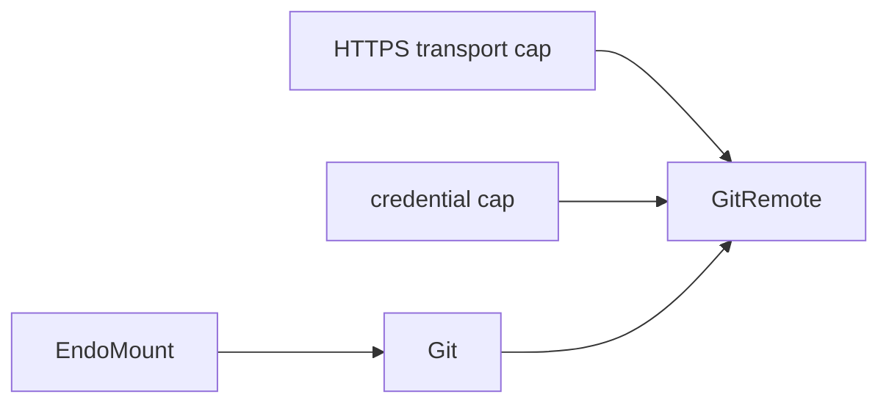

# Daemon Git Remotes for Agent MVP

| | |
|---|---|
| **Created** | 2026-05-18 |
| **Updated** | 2026-05-29 |
| **Author** | 0xPatrick (prompted) |
| **Status** | Proposed (Phases 1-5 landed via #365; fd-pipe askpass landed via #368) |

> **Read in order.**
> This is doc 3 of 3.
> It requires [daemon-mount-capabilities](daemon-mount-capabilities.md) (doc 1) and [daemon-git-capability](daemon-git-capability.md) (doc 2) as prerequisites.

## Summary

Add the remote half of the git story as an explicit composition: local `Git` plus separately authorized HTTPS transport plus non-extractable bearer or basic credentials, bundled into a `GitRemote` capability that agents call directly.
Credential injection runs through a daemon-shipped `GIT_ASKPASS` helper fed by an anonymous pipe (fd-only, never argv or env).
CapTP carries control-plane authority (which repo, which endpoint, which credential, which directions and refs) while git packfile bytes travel on the bounded HTTPS data plane outside CapTP messages.
Endpoint policy is formula-owned in Phase 1; controller-owned once Phase 5 lands.
The guest receives `GitRemote` only.
Controllers (`GitRemoteController`, `GitCredentialController`) and collection capabilities (`GitRemoteSet`) land in Phase 5 so the first phase stays minimum.

## What You Should Know First

This document assumes you know the following primitives from [daemon-mount-capabilities](daemon-mount-capabilities.md) (doc 1) and [daemon-git-capability](daemon-git-capability.md) (doc 2) in one-line form; the rest of the doc names them without re-introducing them.

- **`EndoMount`** (doc 1) is the daemon's live-mount Exo: confined live access to one physical directory, returns `EndoMountFile` handles, and is structurally compatible with `ReadableTree`.
- **`EndoMountEntry`** (doc 1) is the mount-scoped value-shaped descriptor for a path that may not currently exist on disk.
- **`Git`** (doc 2) is the local-git capability derived from an already-authorized `EndoMount`; remote operations compose `Git` with separately granted transport and credential authorities to form a `GitRemote`.
- **`Git.readOnly()`** (doc 2) is the in-place attenuation that drops mutation methods; `GitRemote` construction from a read-only `Git` is rejected (even `fetch` mutates `.git` object and ref state).
- **`GitRef`** (doc 2) is the structured ref descriptor (`{ name, kind: 'branch' | 'tag' | 'commit' | 'detached', oid? }`); `GitRemote` accepts refs in this form or as a string.
- **`HttpClient`** is the Endo HTTP-transport capability shape used as the bounded outbound-network authority input when constructing a remote (see [cli-http-client](cli-http-client.md) for the full controller/client split).

## What is the Problem Being Solved?

The local-worktree design in [daemon-git-capability](daemon-git-capability.md) deliberately keeps network and credential authority out of the base `Git` capability.
That is the right authority boundary, but it is not enough for an agent MVP.

A useful coding agent must often:

- inspect remote branches;
- fetch review updates;
- pull or integrate upstream changes;
- push a branch for review;
- do so without receiving raw credentials or unconstrained network access.

Today, agentic coding tools usually get all of that by inheriting the host user's ambient git configuration, SSH agent, credential helpers, and network stack.
That posture is incompatible with Endo's capability model.
We need remote git for the MVP, but we need it as an explicit composition of:

1. local repository authority;
2. remote endpoint authority;
3. transport / network authority;
4. non-extractable credential authority.

This document defines that companion capability.

## Goals

1. Make `fetch`, `pull`, and `push` available for the agent MVP.
2. Preserve the local `Git` capability's least-authority boundary.
3. Represent remotes as explicit capabilities or controller-managed bindings, not as mutable strings hidden in repository config.
4. Let an agent use credentials without ever reading or exporting them.
5. Allow hosts to grant fetch-only, push-limited, or branch-limited remotes.
6. Keep endpoint policy, credential policy, and local repository authority independently revocable.
7. Make the composition visible: local `Git`, outbound transport, and credentials are separate authority inputs.
8. Clarify how remote operations relate to repository bootstrap / clone.
9. Keep remote git object transfer out of CapTP's data plane: CapTP should carry authority, invocation, policy, and summaries, while packfile bytes move over a bounded git transport such as HTTPS.

## Non-Goals

- Giving the agent raw network sockets, ambient DNS, or arbitrary `ssh` process execution.
- Exposing plaintext tokens, SSH private keys, or credential-helper output.
- Supporting every git transport in the first increment.
- Replacing local branch / commit / worktree operations in the base `Git` capability.
- Using mutable `.git/config` as the authority source of record.
- Tunneling git packfiles through CapTP as the default remote data path.

## Why This Is Separate from Local `Git`

Remote operations add at least two authorities that local git does not need:

| Authority | Why it is distinct |
|---|---|
| network transport | `fetch` and `push` communicate outside the daemon boundary |
| credentials | authenticated remotes must use secrets the agent should not inspect |

Keeping them separate means each authority can be granted, revoked, and audited independently, and a guest with one of them does not implicitly hold the others.
The local and remote designs ship close together for product reasons but stay separate capabilities for authority-isolation reasons.

## Dependencies

| Design | Relationship |
|---|---|
| [daemon-git-capability](daemon-git-capability.md) | Required local repository capability. |
| [daemon-mount-capabilities](daemon-mount-capabilities.md) | Required indirectly through local `Git`. |
| [cli-http-client](cli-http-client.md) | Controller / client split for policy-bearing network capabilities. |
| [trust-on-first-bind](trust-on-first-bind.md) | Reusable policy-binding pattern for first-seen remote endpoints. |
| [endoclaw-network-fetch](endoclaw-network-fetch.md) | Earlier HTTP capability note; superseded in part by `cli-http-client`. |
| [endoclaw-oauth](endoclaw-oauth.md) | Existing non-extractable credential pattern, useful by analogy. |
| [daemon-capability-bank](daemon-capability-bank.md) | Broader resource-category framing for network, git, and credentials. |

## Capability Model

### Guest-Visible Facets

| Capability | Role |
|---|---|
| `Git` | Local repository and worktree authority |
| `GitRemote` | Authority to use one configured remote endpoint with bounded operations |
| `GitRemoteSet` | Optional collection capability for named remotes associated with one local `Git` |

### Construction Inputs

| Capability | Role |
|---|---|
| HTTPS transport cap | Outbound network authority, initially modeled by `HttpClient`-like origin policy |
| `BearerCredential` / `BasicCredential` | Non-extractable authentication-use authority |

### Host-Private / Controller Facets

| Capability | Role |
|---|---|
| `GitRemoteController` | Host-held policy facet for endpoint, allowed refs, direction, revocation, and inspection |
| `GitCredentialController` | Host-held facet that installs, rotates, or revokes credential material |
| transport-specific backing | Trusted implementation detail used by native git or another backend |

The agent-facing remote capability should be able to *use* a remote, not retarget it, widen its branch policy, or read the secret backing it.

`GitRemote` is the guest-visible bounded remote-use authority for one git endpoint.
It is constructed from separate local-repository, transport, and credential capabilities.
The guest may receive only `remote`, or both `git` and `remote`, but cannot recover or retarget the transport or credential authority that was used to construct it.



## MVP Transport Scope

The first implementation should support **HTTPS remotes with bearer or basic credentials**.

Reasons:

- it follows the same controller/client and non-extractable-credential patterns as the existing HTTP-client and OAuth-like designs;
- URL origins are inspectable and allowlistable;
- credentials can be injected without exposing them to the guest;
- it avoids granting ambient `ssh` process authority for the first cut.

For the HTTPS MVP, an `HttpClient`-like capability is the right visible authority input even if the first native-git backend cannot literally call through that object.
The important design point is that remote git is not minted from `Git` plus a URL string alone; it also requires separately granted outbound-network authority.

SSH remotes are important, but they need an explicit follow-up design for host-key policy, agent forwarding, command restriction, and whether Endo should expose an `SshSession` / `GitSshTransport` capability instead of shelling through ambient `ssh`.

## Proposed Vocabulary

### `GitRemotePolicy`

```ts
type GitRemotePolicy = {
  url: string;
  allowedDirections: Array<'fetch' | 'push'>;
  fetchRefspecs: string[];
  pushRefspecs: string[];
  allowedBranches?: string[];
  allowForcePush?: boolean;
  allowTags?: boolean;
  allowDelete?: boolean;
};
```

The URL is formula-owned policy in Phase 1 (baked into the `git-remote` formula at construction time and immutable thereafter) and becomes controller-mediated once Phase 5 lands; the guest cannot mutate it in either phase.
`allowedBranches` is the user-facing shortcut; implementations may compile it into refspec policy.

### `GitRemote`

```ts
interface GitRemote {
  // Return shape mirrors GitRemoteController.inspect()'s sibling form
  // (`Promise<GitRemotePolicy & { revoked: boolean }>`): GitRemote
  // exposes the policy plus its own name, but never `revoked` —
  // revocation state is the controller's domain, not the guest cap's.
  // `allowedBranches` is normalized into `fetchRefspecs` /
  // `pushRefspecs` at construction time and is not re-surfaced here.
  inspect(): Promise<GitRemotePolicy & { name: string }>;

  fetch(options?: {
    prune?: boolean;
    tags?: boolean;
  }): Promise<GitFetchResult>;

  // strategy uses an enum string rather than a tagged union because pull is
  // a one-shot operation with mutually-exclusive integration choices, not a
  // state machine.  rebase() uses a tagged union because its phases
  // (start/continue/abort/skip) take genuinely different inputs.
  pull(options?: {
    branch?: GitRef | string;
    strategy?: 'merge' | 'rebase' | 'ff-only';
  }): Promise<GitPullResult>;

  push(options?: {
    source?: GitRef | string;
    destination?: string;
    force?: boolean;
    setUpstream?: boolean;
  }): Promise<GitPushResult>;
}
```

### Result Types

```ts
type GitRefUpdate = {
  local?: GitRef; // present on push and on fetches that update tracking refs
  remote: GitRef | string; // GitRef when known structurally, string otherwise
  result: 'created' | 'updated' | 'up-to-date' | 'fast-forward'
    | 'forced' | 'pruned' | 'rejected';
};

type GitFetchResult = {
  updatedRefs: GitRefUpdate[]; // includes pruned entries with result='pruned'
};

type GitPullResult = {
  fetch: GitFetchResult;
  integration: 'up-to-date' | 'fast-forward' | 'merge' | 'rebase';
  head: GitRef;
};

type GitPushResult = {
  updatedRefs: GitRefUpdate[];
};
```

`updatedRefs` is shape-aligned across fetch and push so consumers that present a unified "what changed on the remote" view do not branch on the operation.
Pruned refs are folded into the same array with `result: 'pruned'` instead of a separate `prunedRefs` field; that keeps the typed shape singular and lets a caller filter rather than join.

### Sample Use

```js
// fetch updates from origin
const fetched = await E(remote).fetch({ prune: true });
console.error(`updated ${fetched.updatedRefs.length} refs`);

// publish a local branch as agent/topic
const pushed = await E(remote).push({
  source: 'agent/topic',
  destination: 'refs/heads/agent/topic',
  setUpstream: true,
});
for (const update of pushed.updatedRefs) {
  console.error(update.remote, update.result);
}

// fast-forward pull
await E(remote).pull({ strategy: 'ff-only' });
```

The first implementation may return backend text alongside these summaries if native git output is still operationally useful.
The structured result is the stable public shape.

### `GitRemoteController`

```ts
interface GitRemoteController {
  inspect(): Promise<GitRemotePolicy & { revoked: boolean }>;
  setAllowedDirections(directions: Array<'fetch' | 'push'>): Promise<void>;
  setFetchRefspecs(refspecs: string[]): Promise<void>;
  setPushRefspecs(refspecs: string[]): Promise<void>;
  setAllowedBranches(branches: string[]): Promise<void>;
  setAllowForcePush(flag: boolean): Promise<void>;
  setAllowTags(flag: boolean): Promise<void>;
  setAllowDelete(flag: boolean): Promise<void>;
  revoke(): Promise<void>;
}
```

The controller can narrow or widen policy after creation.
The guest-held `GitRemote` cannot.

The controller surface above intentionally does **not** include a `setUrl(newUrl)` method.
Adding one is plausible forward-design (rotating an `origin` from `https://github.com/org/repo` to a successor URL without re-issuing the bundle), but it interacts with construction-time-captured locals in the remote's closure: the URL, the audience-derived `requiresCredential` flag, and the bound `credentialRecord` are early-bound at construction.
A future `setUrl` must re-anchor those locals (re-run the audience-match against the new URL, re-validate the new origin against the granted transport, and either reject the change or atomically refresh the captured credential reference) or it will silently leave the in-memory state divergent from the policy.
Until the use case surfaces, the operator's path to changing a remote's URL is `revoke()` plus `provideGitRemote(...)` with the new URL — a discrete identity boundary the audit log will record explicitly.

## Capability Construction

The preferred host flow is composition.
These calls are **one-time host setup**, run once when the operator provisions a remote for an agent; the resulting `GitRemote` (and credential cap) survive across daemon restart via formula reconstitution and do not need to be re-issued per agent session.

```js
const worktree = await E(host).provideMount('/repo', 'repo-worktree');
const git = await E(host).provideGit(worktree, 'repo-git');

const http = await E(host).provideHttpClient('github-http', {
  allowedOrigins: ['https://github.com'],
});

const credential = await E(host).provideBearerCredential('github-token', {
  audience: 'https://github.com',
});

const remote = await E(host).provideGitRemote({
  git,
  name: 'origin',
  url: 'https://github.com/endojs/endo.git',
  transport: http,
  credential,
  policy: {
    allowedDirections: ['fetch', 'push'],
    fetchRefspecs: ['+refs/heads/*:refs/remotes/origin/*'],
    pushRefspecs: ['refs/heads/agent/*:refs/heads/agent/*'],
    allowForcePush: false,
    allowTags: false,
    allowDelete: false,
  },
});
```

The exact maker names are placeholders.
Phase 5 (see *Implementation Plan*) adds a sibling `provideGitRemoteController()` that returns the host-held controller for revocation / policy updates; until then, the operator's only post-setup lever is `revoke()` on the credential cap.

The required properties are:

- the remote is bound to one local `Git`;
- the `git` argument must be a writable (non-readOnly) `Git`; `provideGitRemote` rejects a read-only `Git` with a structured error.
  Even `fetch` mutates `.git` object and ref state, so a remote backed by a read-only `Git` could not implement its own contract; see [daemon-git-capability](daemon-git-capability.md) § Design Decision 8 for the same-authority-shape invariant this enforces;
- the endpoint is host-specified and inspectable;
- the transport is separately authorized and bounded before the remote is constructed;
- the credential is separately authorized and non-extractable;
- the agent receives only `remote`, not the credential or transport caps.

### Why bundle local + transport + credential into one `GitRemote`?

The deliberate ergonomic choice is to compose the three authority inputs into one guest-facing capability rather than expose them separately and ask the agent to compose them on every call.
Reasons:

- the agent's mental model is "fetch from origin / push to origin", not "compose local repo + HTTPS transport + bearer credential for one HTTPS GET";
- the composition is fixed at construction time; an agent that holds three loose caps could try to recombine them in ways the operator did not authorize;
- the construction-time bundling is where the host enforces "this credential is only useful with this transport against this endpoint for this repo";
- revocation is per-bundle: revoking the credential invalidates exactly the bundles that used it, no more.

The cost is that the guest holding `GitRemote` cannot observe events that touch one bundled authority without holding the controller for that authority too: a credential identity rotation (the operator swapping the bearer token behind a `BearerCredential` via `GitCredentialController.rotate()`) is invisible to the agent unless the agent is also granted the credential controller, which would defeat the non-extractable-credential guarantee.
The agent sees only "fetch succeeded" or "fetch failed with credential-revoked"; observing *which* credential identity served a given fetch requires the host-side audit surface.
This is the deliberate trade-off the bundling pattern makes: an agent that wants finer-grained visibility into one of the three authority axes has to either hold the controller for it (and accept the wider authority) or read the host-retained audit log.

The host-side **decomposition** surface is the Phase 5 controllers (`GitRemoteController`, `GitCredentialController`).
Splitting policy edits and credential rotation off the guest-facing cap is what lets operators change those without re-issuing the bundle to the agent.

## Credentials

### Required Properties

The credential capability must:

- let the backend authenticate requests;
- refuse export of the underlying token / password / key;
- be scoped to an audience or remote binding;
- be revocable independently of the remote;
- support rotation without replacing the guest-held `GitRemote`.

### MVP Credential Shapes

For HTTPS remotes, the first useful shapes are:

```ts
interface BearerCredential {
  audience(): string;
}

interface BasicCredential {
  audience(): string;
}
```

These public facets may expose almost nothing beyond inspection of their scope.
Trusted backend code obtains the sealed secret through a host-private unsealer when constructing transport requests.

### Relation to OAuth

This is the same pattern already described by [endoclaw-oauth](endoclaw-oauth.md): authority to use a service without authority to read the credential.
Remote git needs the same property even when the token was minted manually rather than by an OAuth flow.

## Endpoint Policy

### Strict Mode

The default should be strict:

- remote URL fixed at construction;
- origin must already be allowed by the supplied transport authority;
- fetch / push direction fixed by policy;
- refspecs fixed by policy;
- unknown endpoint requests fail.

### Trust-On-First-Bind

For interactive agent setup, remote creation can optionally use the [trust-on-first-bind](trust-on-first-bind.md) pattern:

- first attempted binding to `https://github.com` prompts the holder;
- approval pins the endpoint in controller policy;
- denial remains inspectable and revocable;
- strict remains the default for unattended agents.

This belongs in the controller layer, not in the guest-held remote cap.

### Policy Validation Matrix

The combinations below catch the subtle failure modes where a refspec form and a policy flag interact (`+` force prefix vs. `allowForcePush`, deletion refspecs vs. `allowDelete`, tag refspecs vs. `allowTags`, short vs. fully-qualified names, wildcard scopes, and the `allowedBranches` vs. `pushRefspecs` shortcut).
The implementation should reject the listed "Rejected" forms with a structured error citing the offending policy field and the specific refspec / flag combination.

| Policy field | Accepted forms | Rejected forms | Validation rule |
|---|---|---|---|
| `fetchRefspecs` | Fully-qualified refs (`refs/heads/main:refs/remotes/origin/main`); wildcards under a fixed parent (`+refs/heads/*:refs/remotes/origin/*`); leading `+` force prefix to update non-fast-forward remote-tracking refs (fetch-side force is local-only and does not require `allowForcePush`); deletion refspecs (`:refs/remotes/origin/foo`) only when `allowDelete: true` | Short names (`main:origin/main`); refspecs whose destination lies outside `refs/remotes/<remote-name>/`; tag refspecs (`refs/tags/*`) when `allowTags: false`; deletion refspecs when `allowDelete: false` | At construction, every fetch refspec must parse to `[+]<src>:<dst>` where `<dst>` is rooted at `refs/remotes/<remote-name>/`; deletion forms (empty `<src>`) require `allowDelete: true`; tag-prefix sources require `allowTags: true` |
| `pushRefspecs` | Fully-qualified source and destination (`refs/heads/agent/main:refs/heads/agent/main`); wildcards under a fixed parent on both sides (`refs/heads/agent/*:refs/heads/agent/*`); leading `+` only when `allowForcePush: true`; deletion refspecs (`:refs/heads/foo`) only when `allowDelete: true`; tag-source refspecs only when `allowTags: true` | Short names; `+`-prefixed refspecs when `allowForcePush: false`; deletion refspecs when `allowDelete: false`; tag refspecs when `allowTags: false`; refspecs whose source resolves outside the local repo's `refs/` namespace | Mirror of `fetchRefspecs` validation, plus the force / delete / tag flag interactions; the source side must be a known local ref namespace, not an arbitrary string |
| `allowedBranches` | A list of branch names or `refs/heads/<glob>` patterns interpreted as a shortcut: equivalent to a derived `pushRefspecs` of `refs/heads/<b>:refs/heads/<b>` for each branch, AND a destination-side filter on any explicit `pushRefspecs` | Short names with no `refs/heads/` anchoring that would also match tags or remote-tracking refs by accident | If both `allowedBranches` and `pushRefspecs` are set, the union is forbidden: the policy must choose one mode.  If only `allowedBranches` is set, the implementation derives `pushRefspecs` from it.  If `pushRefspecs` is empty AND `allowedBranches` is empty, push is rejected entirely (a push-direction remote with no allowed targets is misconfigured, not "permit nothing"; the operator must say so explicitly with `allowedDirections: ['fetch']`) |
| `allowTags` | `true` to allow tag refspecs in fetch and push (`refs/tags/*` on either side); `false` (default) to reject any tag-prefix refspec | Tag refspecs when `false` | Validated at refspec-parse time against both `fetchRefspecs` and `pushRefspecs` |
| `allowDelete` | `true` to allow deletion refspecs (empty `<src>`) in fetch (`:refs/remotes/origin/foo`) and push (`:refs/heads/foo`); `false` (default) to reject deletion forms | Deletion refspecs when `false` | Deletion form is detected by an empty `<src>` in `[+]<src>:<dst>`; both directions are gated by the same flag |
| `allowForcePush` | `true` to allow leading `+` on `pushRefspecs` entries; `false` (default) to reject the `+` prefix on push.  Fetch-side `+` is unaffected (remote-tracking refs are local). | `+`-prefixed push refspecs when `false`; non-`+` push refspecs that the server reports as non-fast-forward (the local validation cannot detect this; the post-push response check fail-closes) | Local validation rejects the `+` prefix at refspec-parse time; the post-push response check rejects an upstream non-fast-forward result regardless of the `+` flag |

## Operation Semantics

### `fetch`

`fetch()`:

- requires fetch direction;
- uses only controller-approved fetch refspecs;
- may update local remote-tracking refs;
- does not mutate the worktree.

### `pull`

`pull()`:

- requires fetch direction;
- composes `fetch()` with a local integration operation on the paired `Git` capability;
- requires the relevant local mutation authority;
- should default to a host-selected mode such as `ff-only` or `rebase`, not silently choose broad merge behavior.

### `push`

`push()`:

- requires push direction;
- validates source and destination against push policy;
- refuses force, tag creation, and deletes unless explicitly authorized;
- uses only the bound credential and endpoint.

## Remote Data Plane

`GitRemote` should be a CapTP control-plane capability, not a CapTP packfile tunnel.

The guest-visible operation is a capability invocation:

```js
await E(remote).fetch();
await E(remote).push({
  source: 'HEAD',
  destination: 'refs/heads/agent/topic',
});
```

That invocation carries authority and policy through CapTP:

- which local repository is paired with the remote;
- which endpoint the host has approved;
- which credential may be used without being exposed;
- which directions and refs are allowed;
- what summary, audit record, or error is returned to the guest.

The bulk git object exchange should then happen outside CapTP through the approved git transport.
For the HTTPS MVP, trusted backend code should run the git smart HTTP protocol, either through native git or a future HTTP git client, using the policy-owned URL (formula-owned in Phase 1; controller-mediated once Phase 5 lands) and sealed credential material.
The packfiles, deltas, and large object payloads should not be serialized as CapTP messages merely because the initiating authority was a CapTP object.

This distinction keeps several boundaries clear:

- CapTP remains the object-capability layer for authorization and durable references.
- HTTPS remains the first remote data plane because it is already the normal git transport, has inspectable origins, and composes with bearer/basic credential patterns.
- The daemon can enforce endpoint and ref policy before starting the data transfer, then summarize the result after it completes.
- Large fetches and pushes avoid per-object CapTP round trips and avoid making the remote protocol depend on CapTP framing.

The backend must still be careful not to smuggle in ambient authority.
A native-git HTTPS implementation should provide the endpoint and credential through trusted code, suppress ambient credential helpers, and reject any call-time URL supplied by the guest.
Moving packfile bytes outside CapTP does not mean bypassing policy; it means applying policy before handing the bulk transfer to the transport best suited for that data.

### Future Encrypted Transports

HTTPS is the right first target.
It is available today, has clear origin policy, and matches the credential patterns already in this design.
SSH requires separate design work for host keys, agent forwarding, command restriction, and key-use authority.

A future Noise-based transport could be useful if Endo later wants a capability-native encrypted channel for peer-to-peer git object exchange or for remotes that are not ordinary Git hosting services.
That should remain future work until the HTTPS data-plane shape is proven.
The durable design requirement is not "always HTTPS"; it is "remote git bulk bytes travel on a bounded transport capability, while CapTP remains the control and authority plane."

## Repository Bootstrap and `clone`

`GitRemote` is intentionally bound to an existing local `Git`, so `clone()` does not belong on that facet.
Cloning creates both repository metadata and a worktree; it crosses the boundary between remote transport and mount provisioning.

For the MVP there are two legitimate product flows:

1. The host provides an already-existing physical worktree mount, then derives `Git` and `GitRemote`.
2. The host performs a separate trusted bootstrap operation that creates a new physical worktree from a bounded remote source and then returns the resulting `EndoMount` plus `Git`.

The second flow is product-relevant when an agent starts from only a remote repository, but it should remain host-mediated.
It should not become guest authority to clone arbitrary remotes into arbitrary host paths.
The exact bootstrap API is a follow-up design point because it must combine mount creation, endpoint policy, and sealed credential authority before a local `Git` exists.

## Security Model

### Authority Separation

| Capability | Grants |
|---|---|
| `Git` | local repository operations |
| transport cap | outbound network access bounded by origin / transport policy |
| `GitRemote` | bounded use of one remote |
| `GitRemote` endpoint policy | bounded access to one remote endpoint |
| credential cap | non-extractable authentication use |

The guest-held `GitRemote` intentionally composes bounded local-repository use, outbound transport, endpoint use, and credential use for one remote.
The host-held controllers remain separate so endpoint policy and credential state can be revoked or changed independently.

### Required Restrictions

- no remote URLs or refspecs supplied by the guest at call time;
- no remote add / rename / set-url on the guest facet;
- no guest access to credential material; ambient credential helpers and SSH agents are not consulted in the HTTPS MVP;
- no force-push, tag-push, or deletion unless separately enabled, and no push on a fetch-only remote;
- no use of a remote after either the remote controller or credential has been revoked.

### Audit Surface

Controllers should retain an audit log of:

- endpoint creation and policy changes;
- credential attachment / rotation / revocation;
- fetch / pull / push invocations;
- refs updated by push;
- rejected attempts.

The guest may get summaries of its own operations; the host retains the full audit surface.

## Agent MVP Profile

For a practical first release, a useful default profile is:

```text
origin:
  transport: HTTPS only
  credential: scoped bearer token
  fetch: allowed
  pull: allowed, default ff-only or rebase
  push: allowed only for refs/heads/agent/*
  force push: denied
  tag push: denied
  delete: denied
```

That lets an agent:

- advance work already present in the mounted worktree from upstream;
- publish its own review branches;
- avoid writing over protected human branches;
- remain unable to retarget the token or push arbitrary refs.

Fetch-only remotes are a natural stricter profile for review or analysis agents.

## Transport and Backend Boundary

The public `GitRemote` API should not commit the design to one internal transport implementation, but its construction should still make transport authority explicit.

```ts
interface GitRemoteBackend {
  fetch(...): Promise<GitFetchResult>;
  push(...): Promise<GitPushResult>;
}
```

### Initial Backend

The first backend may still use native git internally.
A native `git` process cannot literally consume an Endo `HttpClient` object, so the MVP should not pretend that generic HTTP-client composition is already the runtime call path.
The transport capability is still a real required input: trusted daemon code must verify the policy-owned URL (formula-owned in Phase 1; controller-mediated once Phase 5 lands) against the granted transport authority, then invoke native git only with the approved URL, approved refspecs, and sealed credential material.

That means:

- a daemon-shipped `GIT_ASKPASS` helper binary, exec'd by `git` and fed the credential through an anonymous pipe whose read-end fd is inherited by the helper (the secret is passed via fd-pointer, never via argv or process env);
- `GIT_TERMINAL_PROMPT=0` so a missed askpass does not hang waiting for a TTY;
- `LC_ALL=C` on the subprocess env so askpass prompts and porcelain output are routed against a stable English locale (the askpass helper's prompt-routing regex assumes English `"Username"` / `"Password"` strings; a localized git would otherwise route the wrong response);
- sanitized git environment that drops `GIT_*_HELPER`, `GIT_PROXY_COMMAND`, and other credential / process-shell vectors;
- repo config and ambient-credential-helper suppression (`-c credential.helper=` empties the ambient helper list for the invocation; the daemon-shipped `GIT_ASKPASS` above remains the controlled injection path);
- explicit remote URL supplied from controller state, written into the invocation as a positional argument never derived from a guest input;
- no shell interpolation; argv-array spawn only.

**Porcelain-output parser robustness.**
The native backend parses git's `push --porcelain` output to populate `GitPushResult.updatedRefs`.
The current parser treats every line with a recognized leading flag character as an update record, and defaults an unknown flag to `'updated'`.
The defensible posture is to gate the parser on the documented flag alphabet (`'*=  +-!'` per `git-push`'s porcelain documentation) before treating the line as an update record, and to surface a structured warning (preserving the raw flag in the audit-log entry) when an unknown flag arrives.
This defends the parser against future git-cli format drift without silently mis-classifying a refusal as an update.
Forward-defense; not a current correctness gap.

These two concerns are orthogonal and should not be conflated.
A **secret manager** answers *where durable secret authority lives*: a daemon-owned (or external) capability that holds, rotates, and revokes credentials across restarts and across multiple repos.
The **fd-based askpass** answers *how one native-git invocation receives the secret without disk, env, or argv exposure*: it is the in-process injection envelope, not a place to durably store anything.
The long-term home for durable authority is [daemon-capability-bank](daemon-capability-bank.md); once it lands, the askpass helper should fetch the credential from that bank (or an external secret manager it fronts) on demand rather than reading from git's own credential store, which keeps `.git` restartable without making git credential files durable.
Until then, Phase 1 ships the askpass envelope on its own and treats bank-backed sourcing as the planned follow-up for unattended, multi-repo, post-restart workflows.

The safe target for credential injection is: **no secret in argv, in process environment, in formula state, in inspect output, in logs, or in any persisted or durable temp file.**
The askpass-fed-by-anonymous-pipe mechanism above is the only path that meets that bar for the basic (username/password) case.

**Portability.**
The anonymous-pipe / fd-inheritance path is POSIX-specific.
A Windows port of the askpass transport would need to substitute a named pipe (or another in-process IPC primitive available on Windows) for the fd-3 inheritance pattern.
The capability contract is portable; the transport primitive is not.
This is licenced as forward-design work and is out of scope for the HTTPS MVP — the daemon ships POSIX-only today, so the askpass implementation can use POSIX-only primitives without immediate cross-platform constraint.

For bearer-token HTTPS remotes, native git also supports `http.extraHeader`.
Passing the header through `-c "http.extraHeader=Authorization: Bearer ..."` leaks the token to `/proc/*/cmdline` (and is the standard reason public guides warn against the flag).
Env-variable injection paths fail the bar in the other direction (any env-borne secret lands in `/proc/*/environ`, which is world-readable on most Linux distros), and config-file injection paths fail because a persisted temp file is exactly what the bar excludes.
None of those approaches meets the "no secret in env, argv, or persisted state" target.

Bearer-token support is therefore **conditional on the credential-injection spike** confirming an askpass / anonymous-pipe path that keeps the bearer token out of argv, env, and any persisted location.
Until the spike completes, the implementation:

- defaults to basic credentials (HTTPS username/password fed through the askpass helper);
- treats bearer support as gated by the spike's go/no-go;
- or, where bearer is the only option, uses the askpass mechanism for bearer too (treating the bearer as a password fed through askpass), which keeps the credential on the proven path rather than inventing a parallel injection mechanism.

This preserves the same authority shape as `HttpClient` even when the first implementation adapts that authority into a native-git invocation rather than issuing requests through the object directly.

### Spike: confirm credential-injection portability

Before Phase 2 ships the first credential-bearing remote, run a spike across the target host matrix (Linux, macOS, Windows where applicable) to measure:

1. Whether the anonymous-pipe-fed `GIT_ASKPASS` helper works on every target host's stock `git` (≥ 2.30; see [daemon-git-capability](daemon-git-capability.md) for the version pin), including under `git`'s recent `setup_credential_helpers` defaults.
2. Whether the askpass-fed-by-anonymous-pipe path can carry a bearer token (treating the bearer as a password fed through askpass) while keeping the token out of argv, `/proc/*/environ`, and any persisted temp-file artifact a panicked git invocation might leave behind.
   If not, bearer support stays gated until a mechanism that meets the "no secret in env / argv / temp file" bar is identified.
3. Whether the daemon-shipped helper binary can be located on macOS in a way that survives `git`'s notarization / quarantine attributes for packaged installers.
4. Whether `pipe2(O_CLOEXEC)` (Linux) and equivalent (macOS `pipe` + `fcntl(FD_CLOEXEC)`) prevent the credential fd from leaking into sibling subprocesses git may spawn (`git config --show-origin`, smart HTTP helpers, etc.).

The spike's deliverable is a one-page note in `designs/` recording which mechanism works on which host and any fallback ladder.
The note must include an explicit **"no secret in env / argv / temp file" verification step** per credential type tested: a procedure that scrapes `/proc/<pid>/environ`, `/proc/<pid>/cmdline`, the helper-bin temp dir, and any `GIT_CONFIG_*` file location during and after a representative git operation, and confirms the secret is not visible at any of those surfaces.
The capability contract does not change with the spike's outcome; the implementation detail does.

The native invocation should also be treated as a bulk data-plane adapter.
CapTP starts the operation and receives completion metadata; native git and HTTPS carry the packfile exchange.
Tests should assert policy behavior and observable results, not require packfile bytes to pass through CapTP.

### Future Backends

Future implementations may use:

- a JS git backend over an Endo transport adapter;
- a dedicated HTTP git smart-protocol client;
- an SSH transport capability once separately designed.
- a future Noise-based transport capability for git object exchange, if Endo grows a peer-to-peer git use case that justifies it.

The public `GitRemote` contract should survive those swaps.

## Implementation Plan

### Phase 1: Remote Model (MVA)

- [ ] Add `GitRemote` and credential-capability types (`BearerCredential`, `BasicCredential`).
- [ ] Add `git-remote` formula type bound to a local `Git`.
- [ ] Add a host method to mint a `GitRemote` with policy baked in at construction (`provideGitRemote({...})`), including fetch-only, push-limited, and branch-limited validation.
- [ ] The minimum viable agent flow (fetch + ff-only-pull + branch-limited push) is exercised end-to-end on this surface, with no controller in sight.
  Controllers come in Phase 5.

### Phase 2: HTTPS Credentialed Fetch

- [ ] Support HTTPS bearer/basic credential injection through trusted backend code.
- [ ] Implement `fetch()` with fixed endpoint and approved refspecs.
- [ ] Keep packfile transfer on the HTTPS/native-git data plane rather than relaying git object bytes through CapTP.
- [ ] Add revocation tests for remote and credential caps.

### Phase 3: Pull and Local Integration

- [ ] Implement `pull()` as `fetch + local Git integration`.
- [ ] Make the default integration mode explicit.
- [ ] Add divergence / conflict tests.

### Phase 4: Push for MVP

- [ ] Implement branch-limited `push()`.
- [ ] Deny force, tags, and deletes by default.
- [ ] Keep push packfile transfer on the bounded HTTPS/native-git data plane.
- [ ] Add audit entries for outbound ref updates.
- [ ] Add end-to-end tests for publishing `agent/*` branches.

### Phase 5: Controllers and Revocation

- [ ] Add `GitRemoteController` and `GitCredentialController` for post-construction policy updates and revocation.
- [ ] Add `GitRemoteSet` if a collection capability is useful (host can also defer this).
- [ ] Wire `revoke()` against in-flight operations (see *daemon-restart mid-operation* in the testing plan).
- [ ] The agent-facing surface from Phase 1 does not change; controllers add a parallel host-held authority for ops-team work.

### Phase 6: Interactive Provisioning

- [ ] Add form / CLI flows for creating common remote profiles.
- [ ] Optionally integrate trust-on-first-bind for interactive endpoint approval.
- [ ] Add clear inspection surfaces so users can see which remotes and push targets are granted.

### Phase 7: Extended Transports

- [ ] Design SSH-specific transport and credential capability.
- [ ] Decide whether SSH belongs under a general network/process capability or a git-specialized transport cap.
- [ ] Revisit Noise only after HTTPS semantics, policy, and audit are stable.
- [ ] Add mirror / tag / delete profiles only after explicit policy designs.

## Testing Plan

### Capability Tests

- remote cannot be created without local `Git`;
- remote cannot be created without transport authority;
- remote cannot be created without compatible credential authority;
- credential cannot be read by the guest;
- revoked credential blocks remote operations;
- remote URL cannot be changed by the guest.

### Policy Tests

- fetch-only remote rejects push;
- push-limited remote rejects branches outside policy;
- force push, tags, and deletion are denied by default;
- audience mismatch rejects credential use;
- strict endpoint policy rejects unknown remotes.

### Workflow Tests

- fetch updates remote-tracking refs;
- pull fast-forwards;
- pull rebase path;
- push creates an allowed review branch;
- large fetch / push fixtures complete without exposing packfile bytes or remote credentials through the guest-visible CapTP result;
- restart persistence preserves remote policy without exposing secrets;
- **revoke()** in-flight: call `GitRemoteController.revoke()` while a `push()` is mid-packfile; the in-flight transfer aborts cleanly and the remote-tracking ref is not advanced past the last-acknowledged commit;
- **credential rotation mid-operation**: call `GitCredentialController.rotate()` between a `fetch()` and a `push()` on the same `GitRemote`; the `push()` either uses the new credential or fails with a credential-revoked error, never both;
- **daemon restart mid-fetch**: kill the daemon while `fetch()` is streaming a large packfile, restart, and confirm the partial remote-tracking state is either consistent with the last completed ref-update batch or fully rolled back, not an intermediate per-pack state.
- **in-flight authentication failure**: configure the test server to accept the initial smart-HTTP handshake and then return a `401 Unauthorized` on the packfile request mid-`fetch()`; confirm the operation surfaces a structured credential-revoked-style error (distinct from a pre-operation auth failure or a mid-operation credential rotation), the in-flight transfer aborts cleanly, and remote-tracking refs are not advanced past the last completed ref-update batch.
- **in-flight transport error**: configure the test server to accept the initial smart-HTTP request and then return a `502 Bad Gateway` / `503 Service Unavailable` / TCP-reset mid-`push()`; confirm the operation surfaces a structured transport-error result (distinct from a credential failure and from a pre-operation network error), the in-flight push aborts cleanly without partial ref advancement on the remote (where the server reports), and the client-side `GitPushResult.updatedRefs` reflects only the refs the server acknowledged before the error.

### Hardening Tests

- global/system git config ignored;
- no ambient git credential helpers; only daemon-controlled credential injection (e.g., the daemon-shipped askpass helper) is in scope;
- guest-provided refspecs cannot widen policy;
- guest-provided URLs are never accepted by call-time methods;
- backend never falls back to ambient SSH or shell.
- remote packfile transport is only started after endpoint, direction, ref, and credential policy checks pass.

## Implementation Progress and Notes

This section records how the design is realized in shipped code.
It is not part of the normative design.

### Shipped

- **#365** (`feat(daemon): GitRemote capability composing Git + transport + credentials`) — Phases 1-5 of the Implementation Plan: `GitRemote` + credential types (`BearerCredential`, `BasicCredential`), the `git-remote` formula bound to a local `Git`, HTTPS bearer/basic credential injection, `fetch` / `pull` / branch-limited `push`, in-flight revoke fencing on `fetch` and `pull`, audit-log on the controller, and the `GitRemoteController` + `GitCredentialController` surface for post-construction policy updates and revocation.
- **#368** (`feat(daemon): use fd askpass for Git credentials`) — the design-compliant fd-pipe askpass helper described in § Initial Backend ("a daemon-shipped `GIT_ASKPASS` helper binary, exec'd by `git` and fed the credential through an anonymous pipe whose read-end fd is inherited by the helper").
  The daemon-shipped helper lives at `packages/daemon/src/git-askpass-helper.cjs`, exec'd by `git` and reading from fd 3; the fd number (`ENDO_GIT_ASKPASS_FD`) is the only credential-related value reaching the child env, so the secret never appears in argv, the process env, `/proc/<git>/environ`, or a temp file.
  The anonymous-pipe transport has no socket to keep open, so the askpass-socket-lifetime narrowing is structurally satisfied; the OS-user-account boundary (`mkdtemp` 0o700 parent directory) remains the trust model.

Fix, test-coverage, and legibility follow-ups on the shipped trio code (issue #378) are tracked there, not here.

## Relationship to Existing Git Designs

- [daemon-git-capability](daemon-git-capability.md) defines local worktree git and remains the prerequisite.
- This document is the remote companion required for a practical agent MVP.
- [daemon-agent-tools](daemon-agent-tools.md) should eventually describe two tool groups:
  - local git tools from `Git`;
  - remote git tools from granted `GitRemote` values.

## Open Questions

1. **Concrete peer-to-peer use case for a Noise-based git transport.**
   Explicitly deferred until HTTPS data-plane shape is proven (§ Future Encrypted Transports).
   A real use case (Endo agents exchanging git objects directly, sneakernet repo sync, etc.) is what justifies designing the transport and its endpoint-identity policy.

### Resolved (recorded as Design Decisions)

- `pull()` location — decision 7.
- `GitRemote.inspect()` URL reveal scope — decision 8.
- Credential capability generality (generic vs `GitCredential`) — decision 9.
- Provider-specific branch protection — decision 10.
- `HttpClient` vs `GitHttpsTransport` narrowing — decision 11.

### Spike Tasks

These are open questions that need measurement or a concrete use case before the answer is design-stable.
Each gets a one-line follow-up deliverable.

- **MVP transport scope: HTTPS-only sufficient?**
  Before Phase 1 ships, survey the target endo-MVP users (likely the Fae / Lal / Genie agents' current operators) and confirm that HTTPS bearer/basic credentials cover their first-release flows.
  If a non-trivial fraction needs SSH, the SSH design in Phase 7 moves earlier.
  Deliverable: a one-page note in `designs/` confirming or revising the HTTPS-only Phase 1.
- **Bootstrap / clone API.**
  A `provideGitClone({...})` host flow that composes mount creation + endpoint policy + sealed credential authority before a local `Git` exists is a real follow-up requirement (early-draft Open Question #6).
  Design lives in its own `designs/daemon-git-clone.md` follow-up; the spike's deliverable is the design doc, scheduled for Phase 6 after HTTPS fetch/push are exercised in real workflows.
- **Telemetry to distinguish CapTP control-plane time from remote transport data-plane time.**
  During Phase 2, add structured timing fields to `GitFetchResult` and `GitPushResult` (initial shape: `{ captpMs: number; transportMs: number }` augmenting the existing result types) and iterate based on what debug sessions actually need.
  The shape may change after the spike; the principle (timing is observable) is decision 12.

## Design Decisions

1. **Remote git is MVP scope.**
   Agents need fetch / pull / push to be useful in real coding workflows.
2. **Remote git is still a separate capability.**
   MVP relevance does not justify folding network and credentials into base local `Git`.
3. **HTTPS first.**
   It gives the shortest path to a secure useful release and composes with existing HTTP / OAuth patterns.
4. **Endpoint policy ownership is phase-conditional: formula-owned in Phase 1, controller-owned once Phase 5 lands.**
   In Phase 1, endpoint policy is baked into the `git-remote` formula at construction time and is immutable thereafter; the only post-construction lever is credential revocation.
   Once the Phase 5 `GitRemoteController` lands, the policy becomes controller-mediated and can be narrowed or widened post-construction.
   Guests use remotes in both phases; hosts decide what they point at.
5. **Push is bounded by default.**
   A practical default permits review-branch publication without granting arbitrary external write authority.
6. **CapTP is the remote control plane.**
   Remote git packfiles should move over bounded HTTPS or another explicit git transport, not through CapTP object messages by default.
7. **`pull()` lives on `GitRemote`.**
   The composition is `fetch + local integration` per § Operation Semantics; the `strategy` enum keeps the policy explicit on every call.
   An agent that wants finer-grained composition can still call `E(remote).fetch()` and then `E(git).merge()` or `E(git).rebase()` separately, but the bundled `pull()` is the ergonomic path for the common case.
8. **`GitRemote.inspect()` reveals the full remote URL.**
   The URL is policy the host already chose to share (formula-owned in Phase 1; controller-mediated once Phase 5 lands); hiding it behind a host-assigned label adds an indirection without obviously protecting anything (the guest can correlate operations to the URL anyway).
   Construction-time rejection of URLs with embedded `user:password@host` userinfo prevents the only case where the URL itself would carry a secret.
9. **Credentials are generic across services.**
   `BearerCredential` and `BasicCredential` are not git-specific; the same caps work for any HTTPS service that accepts the same authentication shape.
   Specializing to `GitCredential` after the fact is cheap; generalizing a specialized one later is expensive.
10. **Provider-specific branch protection is server-side, not daemon-side.**
    The daemon does not introspect GitHub / GitLab / Forgejo / Gitea branch-protection APIs; relying on server-side rejection keeps the daemon free of provider-specific knowledge.
    Local policy (`pushRefspecs`, `allowForcePush`, `allowDelete`) covers the operator-known constraints; server-side rejection covers the provider-specific ones.
11. **HTTPS transport input remains a general `HttpClient` initially.**
    A dedicated `GitHttpsTransport` capability may emerge later if spike-measured git-specific needs (smart-protocol pipelining, sideband channel handling) make it worth specializing.
    Until then, the general transport cap composes cleanly with other Endo HTTP consumers.
12. **Timing is observable on every remote operation.**
    Phase 2 adds timing fields to `GitFetchResult` / `GitPushResult` so a debugging consumer can distinguish CapTP control-plane time from remote transport data-plane time without needing daemon-side instrumentation.
