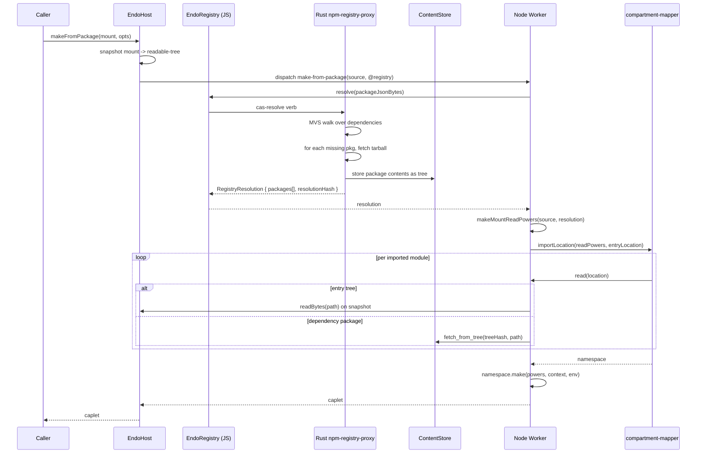

# Daemon Worker `importLocation` from EndoMount with npm-registry-proxy

| | |
|---|---|
| **Created** | 2026-05-22 |
| **Author** | endolinbot (prompted) |
| **Status** | Proposed |

## Summary

Add a daemon-worker entry point that runs a JavaScript program from a
mount or readable-tree whose root contains a `package.json` (rather
than a pre-built `compartment-map.json`).

Dependencies declared in `package.json` are resolved through a daemon
capability that wraps the Rust-side npm-registry-proxy and its Go-like
minimal-version-selection (MVS) resolver, materializing each selected
package as a `readable-tree` in the content-addressed store (CAS,
the daemon's hash-keyed content store).

The worker then runs `@endo/compartment-mapper`'s `importLocation`
(a graph-walking module loader that reads sources through a caller-supplied
`ReadPowers` of `{ read, canonical }`) against a synthesized `ReadPowers`
that reads sources from the mount and from the CAS-resident package
trees, dispatched through the daemon's `daemon-worker` (the
out-of-process Node or XS process that hosts user caplets).

This closes the gap between the daemon's existing mount and archive
capabilities (`EndoMount`, `makeArchive`, `makeFromTree`) and the
Rust-side roadmap (`endor run`, `endor-npm-registry-proxy`):
the same npm-resolution path that powers `endor run entry.js` is
exposed as a daemon capability so JS-side hosts and guests can run
mount-rooted programs without `npm install` and without a
`node_modules` tree on disk.

## What is the Problem Being Solved?

The daemon today has three paths from a *source shape* to a running
caplet:

1. **`makeArchive`** consumes a ZIP whose root has a
   `compartment-map.json`.  This is the closed-world,
   already-resolved form; every module is in the archive.
2. **`makeFromTree`** (`daemon-make-archive.md` § Phase 7) consumes
   a `readable-tree` or `EndoMount` whose root contains a
   `compartment-map.json`.  Same closed-world shape, different
   container.
3. **`makeUnconfined` / `makeUnconfinedFromTree`** delegate to
   Node's native module loader on the `@node` worker.  They cross
   the confinement boundary deliberately.

There is no daemon-side path that takes a `package.json`-rooted
source tree (the shape every working developer's project actually has
on disk) and runs it through a confined worker.
Today the workflow is:

- Run `npm install` to populate `node_modules`.
- Have a Node-side caller run `compartment-mapper`'s `importLocation`
  with `fs.promises.readFile` as the `read` power.
- Or build an archive with `compartment-mapper`'s `makeArchive`,
  hand it to `makeArchive` as a `readable-blob`, and run it.

Neither shape composes with `EndoMount`-rooted projects or with the
Rust-side npm-registry-proxy that is already landing under
`endor run`.
A user with a mount over their project directory cannot ask the
daemon to run that project against the npm registry without first
synthesizing an archive on the side.

This is acute for three converging pieces of work:

- **`endor run entry.js`** (`endor-run-expanded.md` § Phase 5)
  needs an entry-point flow that resolves dependencies through the
  registry table and runs them under a worker.  Today the
  resolution is Rust-side only; there is no JS-side entry that
  matches the Rust-side semantics.
- **`daemon-mount-capabilities`** completes `EndoMount` as the
  live, handle-first filesystem.  An `EndoMount` rooted at a
  project directory should be runnable, not just readable.
- **`daemon-make-archive` Phase 7** stops at trees that contain a
  `compartment-map.json`.  Trees that contain a `package.json`
  (the everyday shape) need a separate entry point because the
  resolution step is different.

The new design provides the missing rung: `makeFromPackage`, which
takes a mount or readable-tree whose root contains `package.json`,
resolves its dependencies through a npm-registry-proxy capability
(JS-side wrapper around the Rust subsystem), composes a
`ReadPowers` that reads the entry tree from the mount and each
resolved dependency tree from the CAS, and hands the result to
`importLocation`.

## Goals

1. Run a project rooted at an `EndoMount` or `readable-tree` whose
   root file is `package.json`, with no `node_modules` directory
   required and no upfront `npm install` step.
2. Reuse the Rust-side npm-registry-proxy's resolution semantics
   (Go-like MVS, on-demand tarball fetch, CAS-backed package
   trees) by exposing it as a daemon capability rather than by
   reimplementing resolution in the worker.
3. Keep the worker's import path the
   `@endo/compartment-mapper.importLocation` flow that already
   runs everywhere Node runs.  The new work is in the
   `ReadPowers` construction and the `moduleMapHook` / package
   resolver, not in the worker's bootstrap.
4. Stay source-only (no precompiled module formats), the same
   constraint `makeArchive` and `makeFromTree` already enforce.
5. Compose cleanly with the existing capability-bus dispatch so
   the new method is a peer of `makeArchive` and `makeFromTree`,
   not a separate subsystem.

## Non-Goals

- Reimplementing the npm-registry-proxy in JavaScript.  The
  resolver, the SQLite-backed `RegistryTable`, and the tarball
  fetch all stay in Rust (`endor-npm-registry-proxy.md`); this
  design only describes how the daemon and worker reach them.
- Running native (`.node`) modules.  This path is source-only;
  packages that need native addons must use
  `makeUnconfinedFromTree` per `daemon-make-archive.md` § Phase 8.
- Mutating the registry table from JavaScript.  The registry is
  Rust-owned; the JS-side capability is a query / fetch surface
  only.
- A new package-manager CLI.  The existing `endo install` /
  `endo run` shapes stay; what changes is what `endo run` can
  consume.
- Live filesystem watch on the mount's `package.json`.  A change
  to the entry tree's manifest does not re-resolve a running
  caplet; the caplet is bound to the resolution result captured
  at start.  A separate dispatch (analogous to
  `filesystem-watchers.md`) could later add re-resolution on
  manifest churn, but that is out of scope for this design.

## Where This Sits Among Existing Designs

This design is a **sibling** of `daemon-make-archive.md` § Phase 7
(`makeFromTree`), not a supersedor:

- `makeFromTree` reads a tree whose root is `compartment-map.json`.
  Its modules are already resolved; the worker walks the map.
  That shape stays valid for trees produced by
  `compartment-mapper.makeArchive` and unpacked into a mount, and
  for trees snapshotted from a mount where a prior
  `endor archive` pass has materialized the compartment map.
- `makeFromPackage` (this design) reads a tree whose root is
  `package.json`.  Its modules are *not* resolved; the daemon
  drives resolution through the npm-registry-proxy capability
  before the worker runs.  Each resolved dependency lands in the
  CAS as a `readable-tree`, and the worker's `ReadPowers` reads
  from those CAS trees in addition to the entry tree.

The two cases converge inside `compartment-mapper`: in both, the
worker calls `importLocation` with a `ReadPowers` keyed to a
synthesized URL scheme that the supervisor's `read` function knows
how to dereference.  The difference is whether the package graph
arrives pre-walked (Phase 7) or has to be walked at start time
(this design).

A "Superseded by" link on `daemon-make-archive.md` § Phase 7 would
overstate the relationship.  `makeFromTree` is the right shape
for closed-world trees and stays.  Both methods land on the same
worker bootstrap with different `ReadPowers` and different
resolution pre-steps.

**Sharing shape on the worker side.**
`makeFromPackage` and `makeFromTree` share a single worker-side
dispatcher that branches on detected root-file shape, not two
parallel daemon facets.
Concretely: a private helper `selectRootShape(source)` in the
worker reads the source's root listing once, returns either
`'compartment-map'` or `'package'`, and the worker's
`daemon facet` exposes the two methods as thin wrappers that pin
the expected shape, fail closed on a mismatch, and dispatch to a
shared `runImportLocation(source, readPowers, options)` core.
The shared core means a future third root-file shape (e.g. a
`pnpm-workspace.yaml` workspace root) extends `selectRootShape`
without forking the worker bootstrap.

## Design

### Capability shape

A new daemon-worker method, paired with a new daemon formula
type, plus a new daemon capability that wraps the registry
subsystem.

#### New host method: `makeFromPackage`

```ts
makeFromPackage(
  workerPetName: string | undefined,
  mountName: string,        // pet name of an EndoMount or readable-tree
  options?: MakeCapletOptions & {
    entry?: string;         // module specifier relative to package root
    registry?: string;      // pet name of an EndoRegistry capability
    offline?: boolean;      // skip fetch; require all packages present
  },
): Promise<unknown>;
```

`mountName` resolves to either an `EndoMount`, an
`EndoMountEntry` (per `daemon-mount-capabilities.md`), or a
`readable-tree`.  The named tree's root must contain a
`package.json`.

`options.entry` defaults to whatever `compartment-mapper`'s
own entry resolution picks: `package.json#exports['.'].endo`,
then `exports['.'].import`, then `exports['.'].default`, then
`main`, then `index.js`.
The default is inherited from `compartment-mapper` rather than
restated here so the daemon-side defaults do not drift from the
mapper's behavior as conditional exports evolve.
Bare specifiers inside the entry module are resolved against
the root `package.json`'s `dependencies` and resolved through
the registry capability.

`options.registry` defaults to a host-scoped `@registry` special
name (analogous to `@node`, see *Host special name* below).

`options.offline` mirrors `--offline` from
`endor-npm-registry-proxy.md`: with it set, no network access is
permitted; the resolution either succeeds against the existing
registry table or fails cleanly.

#### New host method: `makeFromMount`

```ts
makeFromMount(
  workerPetName: string | undefined,
  mountName: string,
  options?: MakeCapletOptions & {
    entry?: string;
    registry?: string;
    offline?: boolean;
  },
): Promise<unknown>;
```

`makeFromMount` is a thin dispatcher that inspects the mount
root once (the same `selectRootShape` private helper the worker
uses) and forwards to `makeFromTree` if the root contains
`compartment-map.json`, or to `makeFromPackage` if the root
contains `package.json`, or rejects cleanly if the root contains
neither.
The CLI's `endo run <mount>` form (below) delegates to
`makeFromMount`, so the source-detection logic lives in one
place rather than re-implemented by every host-API caller that
wants the CLI's "do the right thing for this mount" behavior.
A caller that already knows the root shape can still call
`makeFromTree` or `makeFromPackage` directly.

#### New formula type: `MakeFromPackageFormula`

```ts
type MakeFromPackageFormula = {
  type: 'make-from-package';
  worker: FormulaIdentifier;
  powers: FormulaIdentifier;
  source: FormulaIdentifier;     // EndoMount or readable-tree
  registry: FormulaIdentifier;   // EndoRegistry
  entry?: string;                // relative module specifier
  env?: Record<string, string>;
  offline?: boolean;
  cancelWithWorker?: FormulaIdentifier;
};
```

`extractLabeledDeps` reports the same shape `make-archive` already
uses, with the `archive` slot replaced by `source` and a new
`registry` slot.

#### New daemon capability: `EndoRegistry`

The JS-side handle on the Rust-side npm-registry-proxy.  Exposed
as a host special name `@registry` by default (see below) and
re-exposable on per-host or per-guest formulas for confinement.

**Interaction model (who calls what, when).**
The worker calls `resolve` once during `makeFromPackage` setup,
before the `importLocation` walk begins; the result feeds the
synthesized `ReadPowers`.
The worker reads from resolved tree refs through CAS bus verbs
(`cas-fetch-from-tree`), not through `EndoRegistry` directly,
during the `importLocation` walk.
The host owner (not the worker) may call `fetch`, `lookup`, or
`list` for diagnostics or for pre-warming the registry cache;
these methods are not on the worker's hot path.

```ts
interface EndoRegistry {
  // Resolve a dependency graph rooted at a package.json (as
  // bytes) and return the selected versions and their CAS tree
  // hashes.  Uses MVS per `endor-npm-registry-proxy.md`.
  resolve(
    packageJson: Uint8Array,
    options?: { offline?: boolean; condition?: string[] },
  ): Promise<RegistryResolution>;

  // Fetch a single resolved package by (name, version) and
  // return the readable-tree pet capability for its contents.
  // Idempotent: calling twice returns the same tree.
  fetch(
    name: string,
    version: string,
  ): Promise<EndoReadableTree>;

  // Look up the cached resolution without fetching (returns
  // undefined if the package is not yet in the table).
  lookup(
    name: string,
    version: string,
  ): Promise<EndoReadableTree | undefined>;

  // List the installed packages (for diagnostics; bounded).
  list(prefix?: string): Promise<Array<{ name: string; version: string }>>;

  help(): string;
}

type RegistryResolution = {
  // One entry per package in the transitive closure, keyed by
  // package name.  For packages with major-version coexistence
  // (allowed by MVS), the array carries one entry per selected
  // major.
  packages: Array<{
    name: string;
    version: string;
    treeRef: EndoReadableTree;   // CAS readable-tree capability
    integrity: string;            // npm `dist.integrity`, retained
                                   // for cross-check against
                                   // upstream registry attestations
                                   // (not used to verify treeRef;
                                   // treeRef's content-address
                                   // already proves the bytes)
  }>;
  // The resolution itself is content-addressed for cache reuse.
  resolutionHash: string;
};
```

The Rust subsystem owns the `RegistryTable`, the tarball fetcher,
and the MVS resolver; `EndoRegistry` is the JS-side capability
that crosses the worker boundary through the existing bus
verbs.  The methods on the interface map to the verbs defined in
`endor-npm-registry-proxy.md` § *Integration with `endor run`*
plus the verbs added in `daemon-cas-management.md` for tree
reads.

**Failure surface.**
`EndoRegistry.resolve` rejects with a structured `@endo/errors`
error tagged by failure class, so callers can distinguish:

- `RegistryTamperedError` (the lockfile integrity hash does not
  match the upstream registry's `dist.integrity`).
- `RegistryMissingPackageError` (a `(name, version)` pair on the
  lockfile or in the resolver's transitive closure is not on the
  configured registry).
- `RegistryNetworkError` (the bus call to the Rust subsystem
  failed in transit: subsystem restart, bus disconnect,
  registry-host TCP error).
- `RegistryOfflineError` (`options.offline` set and the
  resolution touched a package not yet in the table).

A mid-resolve Rust-subsystem restart or bus disconnect surfaces
as `RegistryNetworkError`; the caller may retry.
This mirrors the named cancellation surface in
`daemon-make-archive.md` § *Cancellation handling* rather than
leaving the failure modes implicit in the `Promise` rejection.

**Resolver vs store separation.**
The interface as listed braids three concerns: resolution
(`resolve`), fetch (`fetch`), and lookup (`lookup` / `list`).
A confinement-friendly refinement splits the capability into a
`EndoRegistryResolver` (the `resolve` + `fetch` surface; needs
the network-fetch authority) and an `EndoPackageStore` (the
`lookup` + `list` surface; read-only over the resolved CAS
trees), so a guest holding only the store cap can enumerate
already-resolved packages without holding the fetch authority.
The first cut ships the combined `EndoRegistry` for symmetry
with `@node`; the split is tracked as a follow-up under *Open
Questions*.

### Worker dispatch

The Node worker's `daemon facet` gains one method:

```js
makeFromPackage: async (
  sourceP, registryP, contextP, options,
) => {
  const { entry, env, offline } = options;
  const source = await sourceP;
  const registry = await registryP;

  // Step 1: resolve the dependency graph.
  const packageJsonBytes = await E(source).readBytes(['package.json']);
  const resolution = await E(registry).resolve(
    packageJsonBytes,
    { offline },
  );

  // Step 2: build a URL-keyed ReadPowers that delegates to the
  // mount for the entry tree and to the resolved CAS trees for
  // each dependency.
  const readPowers = makeMountReadPowers({
    entryMount: source,
    resolution,
  });

  // Step 3: run importLocation in the worker's compartment.
  const { importLocation } = await import(
    '@endo/compartment-mapper'
  );
  const { defaultParserForLanguage } = await import(
    '@endo/compartment-mapper/import-parsers.js'
  );
  const entrySpecifier = entry || pickEntry(packageJsonBytes);
  const entryLocation = `endo-mount:/${entrySpecifier}`;

  const { namespace } = await importLocation(
    readPowers,
    entryLocation,
    {
      globals: endowments,
      parserForLanguage: defaultParserForLanguage,
    },
  );

  return namespace.make(/* powersP */ undefined, contextP, { env });
};
```

The XS worker's `daemon facet` gains the same method but routes
the `read` function through the supervisor's CAS bindings (see
*XS bridging* below).

### `ReadPowers` synthesis: `makeMountReadPowers`

The new helper `makeMountReadPowers` lives in
`packages/daemon/src/worker-import.js` and is shared between the
Node and XS worker bootstrap.

Each location is a URL in a synthetic `endo-mount:` scheme:

- `endo-mount:/<relative-path>` reads from the entry mount.
- `endo-mount:/node_modules/<name>@<version>/<relative-path>`
  reads from the resolved package tree for the specific
  `(name, version)` pair (via the resolution's CAS tree).

The `endo-mount:` URL carries the selected version after the
bare name so the multi-major coexistence path the
`RegistryResolution` type explicitly admits ("packages with
major-version coexistence (allowed by MVS), the array carries
one entry per selected major") is unambiguous.
`compartment-mapper`'s descriptor walk knows the selected
version for each `(importer, dependency)` edge because the
walk operates against the resolution's `packages[]` and
threads the `(name, version)` pair into the synthesized URL it
emits for the dependency's directory.

The `endo-mount:` scheme is internal to the worker; it never
appears in user code.  `compartment-mapper` treats locations as
opaque strings and asks the `read` function to fetch bytes, so
the worker controls the scheme entirely.

```js
const makeMountReadPowers = ({ entryMount, resolution }) => {
  const packagesByVersion = new Map();
  for (const pkg of resolution.packages) {
    packagesByVersion.set(`${pkg.name}@${pkg.version}`, pkg.treeRef);
  }

  const read = async location => {
    const url = new URL(location);
    if (url.protocol !== 'endo-mount:') {
      throw makeError(X`Unsupported location: ${q(location)}`);
    }
    const path = url.pathname.replace(/^\//, '').split('/');
    if (path[0] === 'node_modules') {
      // path[1] is `<name>@<version>` (or `@scope/<name>@<version>`
      // for scoped packages, joined as a single segment by the
      // descriptor walk).  packagesByVersion is keyed by the same
      // `<name>@<version>` string so the lookup is a direct Map.get.
      const [, nameAtVersion, ...rest] = path;
      const treeRef = packagesByVersion.get(nameAtVersion);
      if (treeRef === undefined) {
        throw makeError(
          X`No resolved package for ${q(nameAtVersion)} in resolution ${q(resolution.resolutionHash)}`,
        );
      }
      return E(treeRef).readBytes(rest);
    }
    return E(entryMount).readBytes(path);
  };

  const canonical = async location => location;

  return harden({ read, canonical });
};
```

The `compartment-mapper`'s package descriptor walk reads each
importer's `package.json#dependencies`, maps each bare specifier
to the selected version from `resolution.packages[]`, and emits
the dependency URL with `<name>@<version>` as the directory
segment so the synthesized layout disambiguates majors.
For a project that depends on `pkg@^1` directly and on a
transitive that requires `pkg@^2`, the entry importer's
specifier `'pkg'` resolves to `endo-mount:/node_modules/pkg@1.x.y/`
and the transitive importer's specifier `'pkg'` resolves to
`endo-mount:/node_modules/pkg@2.x.y/`; each importer reads its
own major's tree.
The descriptor walk's per-importer version table is the
authoritative source for the `<name>@<version>` segment; the
mapper does not need to know that the `node_modules` segment is
synthetic.

The "step 3" referenced from `endor-npm-registry-proxy.md`'s
algorithm is the mapper's per-importer descriptor walk: for each
importer, read `package.json#dependencies`, look up each bare
specifier's selected version against the registry resolution,
and emit a URL for the dependency's resolved directory.
Stating the step inline avoids forcing a reader to consult a
not-yet-merged sibling design for the load-bearing detail.

**Scheme choice: one scheme, two roles.**
The `endo-mount:` scheme braids the entry mount (place-like
until snapshot) and the resolved CAS trees (immutable values)
into one address space.
A two-scheme refinement (`endo-mount:` for the entry,
`endo-tree:` for resolved deps) would signal the nature of the
data through the scheme itself; the first cut keeps one scheme
because the worker takes the `snapshot()` before `importLocation`
runs, so by the time the mapper emits any URL the entry mount
has been frozen to a tree-shaped snapshot.
Both roles read tree-shaped immutable data at the moment of
read, and a single scheme keeps the mapper's `read` function
shape uniform.
The split is tracked as a follow-up under *Open Questions*.

### Resolution path: who walks the graph

The Rust-side `endor-npm-registry-proxy.md` describes MVS as a
graph walk over `package.json` `dependencies`.  This design lifts
that walk onto the JS-side resolver method (`EndoRegistry.resolve`)
because:

- The entry `package.json` arrives as opaque bytes; the resolver
  must read it, then read each transitively-required
  `package.json` from the package trees it fetches.
- The Rust resolver is already structured around this walk
  (per `endor-run-expanded.md` § Phase 5).  Exposing one
  `resolve(packageJsonBytes)` verb that returns the full
  transitive resolution keeps the JS-side worker loop small
  (no per-import callbacks across the bus).
- The single-pass shape also lets the resolution be
  content-addressed.
  The `resolutionHash` returned to the worker can serve as a
  cache key for the synthesized `ReadPowers`.

The alternative (have the worker emit per-import `resolvePackage`
calls during the `importLocation` walk) is rejected: it would
add one bus round-trip per imported package, defeating the
purpose of pre-resolution.  The Rust subsystem can still do
on-demand fetch within the `resolve` call; what we avoid is
per-import resolution from the worker side.

### MVS interaction with on-disk `package-lock.json`

If the entry mount contains a `package-lock.json` (or
`yarn.lock`), `EndoRegistry.resolve` honors it as the constraint
floor: the lock's exact versions become the selected versions,
and MVS does not relax them.  If the lock is absent, MVS runs
freely and selects, for each `(name, major)` pair, the
**minimum minor.patch that satisfies every transitive caret /
tilde constraint mentioned in the graph** (this is Go's MVS
applied to npm's caret-and-major semantics: minimum-of-the-mins
that-satisfy-the-constraint, not maximum-resolver).
The exact rule is defined in `endor-npm-registry-proxy.md`
§ *Comparison with Go's MVS*; this design honors that rule
verbatim and adds no resolver heuristics.

The lockfile interaction is *consultative*, not authoritative:
the resolver still validates that each lock entry's `(name,
version)` exists on the configured registry and matches the
declared integrity.  A lockfile that refers to a missing or
tampered package fails the resolve step rather than silently
falling back.

This decision keeps two existing workflows working:

- Developer workflows where `package-lock.json` is checked in
  and treated as the source of truth.
- Developer workflows where no lockfile is present and the
  developer trusts MVS to pick versions.

A future refinement could add `options.policy: 'lock' | 'mvs' |
'lock-or-mvs'` to make the choice explicit; for the first cut,
"lock if present, else MVS" matches the npm-CLI default and is
the least-surprising shape.

### Mount snapshot vs live read

`EndoMount` is a live capability: subsequent writes to the
backing directory are observable through it.  For a running
caplet, the questions are:

- Does the worker see file mutations after it has imported a
  module?  No.  The `importLocation` walk reads each module
  once during graph construction; the modules are compiled into
  the worker's compartment and re-read only on explicit reload
  (which is not a path this design exposes).
- Does the worker see file mutations *during* the
  `importLocation` walk?
  Possibly, depending on timing; to avoid this we snapshot the
  entry tree before resolution begins.

```js
const entrySnapshot = await E(source).snapshot();
```

This produces an immutable `readable-tree` (per
`daemon-mount.md` § *Snapshot* and `daemon-mount-capabilities.md`
§ Phase 7) that the `ReadPowers` reads against.  The live mount
keeps mutating; the running caplet sees the snapshot it was
started against.

The snapshot is a `thisDiesIfThatDies` dependency of the caplet
(a lifetime-coupling primitive that releases the dependency when
the dependent caplet ends; see `inventory-cancel-and-liveness.md`
§ *Lifetime coupling* for the definition), so the CAS trees the
snapshot holds are released when the caplet ends.
This mirrors the snapshot-before-stage pattern in
`daemon-make-archive.md` § Phase 8 (`makeUnconfinedFromTree`).

For the common case where the caller has already passed a
`readable-tree` (immutable), the snapshot step is a no-op.

### Host special name: `@registry`

Following the `@node` precedent from `daemon-make-archive.md`
§ Phase 6, every host carries a required `registry` field that
points to an `EndoRegistry` capability:

```ts
type HostFormula = {
  // existing fields ...
  registry: FormulaIdentifier;   // new, required; powers @registry
};
```

`E(host).lookup('@registry')` returns the host-scoped registry
capability.  Guests do *not* see `@registry` by default; a host
that wants to grant a guest access to the registry must do so
through the usual capability-passing patterns.

The default registry is configured at daemon startup with the
registry URL and credentials.  A per-host registry can be
substituted by the host's owner (for example, to point at a
private registry mirror) by formulating a new `EndoRegistry`
and rebinding the `@registry` special name.

The `@registry` field is required on `HostFormula`, not
optional.  This follows the same reasoning as `@node`: an
optional field forces a conditional on every code path that
touches resolution, and the operational cost of provisioning a
registry capability at host formulation is small (the underlying
Rust subsystem is shared, not per-host).

**Migration for already-formulated hosts.**
Adding a required field to `HostFormula` is a backward-incompatible
formula change; pre-existing host formulas on disk lack the
`registry` slot.
The migration policy mirrors the precedent `daemon-make-archive.md`
§ Phase 6 set when `@node` became a required `HostFormula` field:
on daemon start, a one-shot upgrade pass rewrites host formulas
missing the `registry` field to point at the daemon-default registry
formula, in a single transaction per host.
The upgrade is idempotent (a second start is a no-op) and runs
before the host map is exposed to callers, so guests never observe
a half-migrated host.
A host whose owner has already substituted a custom `@registry`
keeps that substitution; the upgrade only fills the absent slot.

### CLI shape

A new `endo run` form, on top of the existing archive form:

```
endo run <mount-pet-name>            # uses @registry, default entry
endo run <mount-pet-name> entry.js   # explicit entry module
endo run <mount-pet-name> --offline  # no network access
endo run <mount-pet-name> --registry @private-npm
```

`endo run` detects the source form by inspecting the mount root
once:

- Has `compartment-map.json`?  Use `makeFromTree`.
- Has `package.json`?  Use `makeFromPackage`.
- Has neither?  Reject with a clean error pointing at both.

This mirrors the Rust-side detection logic in
`endor-run-expanded.md` § *Input forms*.

### XS bridging

XS workers cannot run `compartment-mapper` directly today
because the mapper imports filesystem-shaped modules
(`fs.promises`).  Two viable paths, ordered by readiness:

1. **Near-term: Node-worker default.**  `makeFromPackage`
   defaults the worker selection to the host's Node worker
   (`mainWorker` if it is Node, else `@node`).  The XS worker
   raises a clean "compartment-mapper not yet hosted in XS"
   error if dispatched directly.  This matches the existing
   `daemon-make-archive.md` § Phase 4 split where archive
   loading on XS goes through the Rust host call rather than
   through `compartment-mapper`'s Node-only loader.
2. **Long-term: XS-hosted compartment-mapper.**  Per
   `endor-run-expanded.md` § *Compartment mapper
   implementation* option B, bundle the mapper for XS
   execution and have the Rust supervisor satisfy its
   `ReadFn` from CAS.  This is the same path the Rust-side
   `endor run` is taking; once it lands, the daemon-side
   `makeFromPackage` can dispatch to either worker kind
   without code duplication on the bus.

The Node-worker default is what ships first; the XS path is a
follow-up.  The daemon-side dispatcher does not change between
the two cases.

### Architecture diagram



## Phased Implementation

Each phase ends with at least one passing daemon integration test
(`packages/daemon/test/endo.test.js`).

### Phase 1: `EndoRegistry` capability and special name

1. Add `RegistryFormula` and `EndoRegistry` exo.
2. Wire the JS-side `EndoRegistry` to the existing
   `daemon-cas-management.md` bus verbs plus a new
   `cas-registry-resolve` verb (Rust-side new; corresponds to
   `endor-npm-registry-proxy.md` § Phase 4 integration).
3. Add `registry` to `HostFormula` as a required field; populate
   it during host formulation.
4. Add `@registry` to the host special-names map.
5. Tests: `E(host).lookup('@registry')` resolves;
   `E(registry).lookup(name, version)` returns undefined for an
   unfetched package; `E(registry).fetch(name, version)` returns
   a `readable-tree` capability.

### Phase 2: `makeMountReadPowers` and worker dispatch

1. Add `packages/daemon/src/worker-import.js` exporting
   `makeMountReadPowers`.
2. Add `makeFromPackage` to the Node worker's daemon facet.
3. Add `MakeFromPackageFormula` to the formula union and the
   dispatcher case.
4. Tests: hand-crafted fixture with a trivial `package.json`
   pinning a single small dependency
   (e.g. `is-odd@1.0.0`); verify the dependency is resolved,
   fetched, and importable.

### Phase 3: `makeFromPackage` host method and CLI

1. Add `EndoHost.makeFromPackage`.
2. Add the source-detection branch to `endo run`.
3. Add `--offline` and `--registry` flags.
4. Tests: `endo run <mount>` for a small project; `endo run
   <mount> --offline` after a populated registry table;
   `endo run <mount> --offline` with a missing dependency fails
   cleanly.

### Phase 4: Snapshot-before-import

1. Add the `E(source).snapshot()` step ahead of resolution.
2. Tie the snapshot's lifetime to the caplet's context.
3. Tests: start a caplet against a mount, mutate the mount
   during the caplet's lifetime, verify the caplet's view
   does not change.

### Phase 5: Lockfile honoring

1. Inside `EndoRegistry.resolve`, detect `package-lock.json`
   (and `yarn.lock`) in the entry tree.
2. When present, constrain MVS to the locked versions.
3. Validate each locked `(name, version, integrity)` against the
   registry; fail cleanly on mismatch.
4. Tests:
   - Project with a lockfile resolves to the locked versions.
   - Project with a tampered lockfile (mismatched integrity)
     fails the resolve step.
   - Project without a lockfile falls through to MVS.
   - **Multi-major coexistence.**
     Project that depends on `pkg@^1` directly and on a
     transitive that requires `pkg@^2` produces a
     `RegistryResolution.packages[]` carrying both majors;
     `importLocation` resolves the entry importer's `'pkg'`
     specifier to `pkg@1.x.y` and the transitive importer's
     `'pkg'` specifier to `pkg@2.x.y`; each compartment's
     `pkg` namespace is the major it was directly resolved
     against.
     The test uses two side-by-side fixture packages so the
     bytes the two majors return differ and the test can
     assert each importer reads from its own major's tree.
   - **Caplet snapshot lifetime release.**
     Start a caplet against a mount, observe the snapshot's
     CAS trees are alive while the caplet runs, end the
     caplet, and observe the snapshot's CAS trees become
     collectible (the `thisDiesIfThatDies` dependency releases).
     The test confirms the lifetime claim under § *Mount
     snapshot vs live read* is enforced, not just documented.

### Phase 6: XS-hosted compartment-mapper (deferred)

This phase is deferred to the Rust-side `endor-run-expanded.md`
§ Phase 4 / 5; the daemon-side work in this design does not block
on it.
The section preamble's "each phase ends with at least one passing
daemon integration test" rule does not apply to a deferred phase
that depends on out-of-tree work; the test exception is noted here
rather than restated on every deferred phase the daemon designs
carry.
When the Rust-side path lands, the daemon dispatcher does not
change; only the per-worker bootstrap, and the corresponding test
lands with the Rust-side phase.

## Design Decisions

1. **Snapshot the mount before resolution; do not stream live
   reads.**  Running modules against a live filesystem is a
   well-known source of subtle bugs (a partially-written file
   read mid-import produces an opaque syntax error).  The
   snapshot-before-import pattern is already established in
   `daemon-make-archive.md` § Phase 8 for the unconfined Node
   bridge; reusing it here keeps the lifetime contract uniform.
   The cost is one tree-walk and one set of CAS writes per
   invocation, which is the same cost a `makeArchive` pass
   already incurs.
2. **Eager resolution, not lazy per-import resolution.**  The
   `EndoRegistry.resolve` call returns the full transitive
   closure of selected packages before the worker begins
   `importLocation`.  Per-import lazy resolution would add one
   bus round-trip per imported package and defeat the
   pre-computed resolution hash that lets the
   `makeMountReadPowers` cache its work.  Eager resolution also
   matches the Rust-side `endor run` flow, where the
   compartment-mapper walks once and the import hook then reads
   by hash.
3. **MVS-then-lockfile, not lockfile-then-MVS.**  When a
   lockfile is present, MVS is constrained to its versions;
   when absent, MVS runs freely.  This is the order the npm
   ecosystem already expects (a lockfile is a constraint, not
   a parallel source of truth), and it composes cleanly with
   the offline mode: a lockfile makes offline runs
   deterministic without requiring a separate "frozen" flag.
4. **`@registry` is host-scoped, default to the daemon-wide
   registry capability.**  Each host carries a `registry`
   formula field, populated at formulation time from a
   daemon-default capability.  A host's owner can swap the
   registry (e.g., to point at a private registry mirror)
   without re-formulating the host; this follows the same
   pattern `@node` uses.  Guests do not see `@registry`
   directly; a guest that needs to install a package goes
   through the host.

## Open Questions

1. **Per-condition resolution.**  `compartment-mapper` supports
   `import`, `browser`, and `endo` conditions on
   `package.json#exports`.  Should `makeFromPackage` accept an
   `options.condition: string[]` and thread it through both
   `EndoRegistry.resolve` (which inspects `peerDependencies`
   and conditional `dependencies`) and the `importLocation`
   call?  The Rust-side design does not yet name conditions.
   Provisional answer: yes, accept the option, default to
   `['import', 'endo']`, and revisit once the Rust-side
   resolver names its condition behavior.
2. **Workspace protocol (`workspace:^`).**  A
   `package.json` may declare a workspace dependency
   referencing a sibling package on disk.  In a mount that
   contains the whole workspace, those references should
   resolve to the sibling subdirectory rather than to the
   registry.  `EndoRegistry.resolve` needs a way to discover
   the workspace root; the entry mount carries that information
   (the workspace `package.json` typically lives at the mount
   root, with member packages under `packages/`).  The first
   cut can reject `workspace:` specifiers with a clear error
   pointing at this gap; the followup is a workspace-detection
   step in `EndoRegistry.resolve`.
3. **Private-registry credentials.**  The Rust subsystem reads
   `.npmrc` for the registry URL and auth tokens
   (`endor-npm-registry-proxy.md` § *Configuration*).  Should
   the JS-side `EndoRegistry` carry a separate credential
   capability per host, or inherit the daemon-wide
   configuration?  Operationally the daemon-wide path is
   simpler; per-host credentials would compose with the
   `endo-gateway` multi-tenant story.  Provisional answer:
   daemon-wide for the first cut, with `EndoRegistry`
   bequeathing a `withCredentials(credentialCap)` method
   later for the per-tenant case.
4. **`peerDependencies` and `optionalDependencies`.**  The
   Rust-side design defers these as a known gap.  This design
   inherits the same gap; resolution silently ignores them
   today.  A clean error from `EndoRegistry.resolve` ("package
   X declares unmet peer dependency Y") is preferable to the
   silent-ignore default; the question is whether to enforce
   it in the first cut or defer to a follow-up.
5. **Caching the synthesized `ReadPowers`.**  Two invocations
   against the same mount with the same `package.json` and the
   same registry resolution should reuse the
   `makeMountReadPowers` result.  The `resolutionHash` is the
   natural cache key, but the cache itself needs an owner
   (daemon-wide?  per-host?).  This is a performance refinement,
   not a correctness question; defer until profiling shows the
   construction cost matters.
6. **Re-resolution on lockfile change.**  If the entry mount's
   `package-lock.json` is replaced mid-run, the running caplet
   does not re-resolve.  Should the daemon offer a "restart
   caplet on lockfile change" affordance, analogous to a
   filesystem-watcher integration?  Out of scope here; track on
   the agent-tooling roadmap.
7. **`EndoRegistry` naming.**  The capability name flavors the
   underlying registry table over the user's mental model of
   "packages".  A user-facing name (`EndoPackages` or
   `EndoNpm`) may track the caller's intent more closely; the
   host special name `@registry` is correct as-is because the
   host's named slot is the registry concept rather than the
   package collection.
   Provisional answer: keep `EndoRegistry` for the first cut to
   match `@registry`; revisit during the user-facing review of
   `daemon-agent-tools`.
8. **Resolver / store capability split.**  Split `EndoRegistry`
   into `EndoRegistryResolver` (`resolve` + `fetch`; carries
   the network-fetch authority) and `EndoPackageStore`
   (`lookup` + `list`; read-only over the resolved CAS trees)
   so a guest can hold the read surface without the fetch
   authority.
   The first cut ships the combined cap for symmetry with
   `@node`; the split is a confinement refinement to land once
   the first cut shows which guests want which authority.
9. **Two-scheme URL split (`endo-mount:` vs `endo-tree:`).**
   The synthesized scheme today addresses both the entry mount
   (snapshotted into a tree before the mapper sees it) and the
   resolved dependency CAS trees.
   A two-scheme refinement would signal "place that became a
   value" vs "value the resolver produced" through the scheme.
   The first cut keeps one scheme because both roles are
   tree-shaped at read time; revisit if a future feature adds
   a non-tree read source under the same `ReadPowers`.

## Dependencies

| Design | Relationship |
|--------|--------------|
| [daemon-make-archive](daemon-make-archive.md) | Sibling of § Phase 7 (`makeFromTree`).  `makeFromTree` handles `compartment-map.json`-rooted trees; `makeFromPackage` handles `package.json`-rooted trees and adds the npm-registry-proxy resolution step.  Both end at `compartment-mapper`'s `importLocation` / `parseArchive`. |
| [endor-run-expanded](endor-run-expanded.md) | This design's daemon-side analogue lands ahead of the Rust-side Phase 5 (entry-point with dependencies).  When the Rust side ships, the JS dispatcher's `makeFromPackage` and the Rust `endor run` converge on the same `RegistryResolution` shape via the registry bus verbs. |
| [endor-npm-registry-proxy](endor-npm-registry-proxy.md) | This design wraps the Rust subsystem as a JS-side capability (`EndoRegistry`) and exposes it as a host special name `@registry`.  The Rust-side resolution semantics (MVS, on-demand fetch, CAS-backed package trees) are referenced rather than re-implemented. |
| [daemon-mount](daemon-mount.md) | `makeFromPackage` consumes an `EndoMount` as its primary source shape.  The snapshot-before-import step uses `EndoMount.snapshot()` from § *Snapshot*. |
| [daemon-mount-capabilities](daemon-mount-capabilities.md) | Uses the completed `EndoMount` surface: `readBytes`, `snapshot`, and the `EndoMountEntry` overload on `lookup`. |
| [daemon-cas-management](daemon-cas-management.md) | The resolved package trees live in the CAS; the worker reads from them through the existing `cas-fetch` / `cas-fetch-from-tree` bus verbs. |
| [filesystem-watchers](filesystem-watchers.md) | Future integration point.  A watcher on the entry mount's `package.json` could trigger re-resolution; out of scope here, called out under Open Questions. |

## Prompt

> Author the missing daemon-worker design that ties Compartment
> Mapper's `importLocation`-style entry to an `EndoMount`
> read-source with the existing Rust-side npm-registry-proxy +
> Go-like MVS resolver exposed as a daemon capability.  Single
> design file at `designs/<slug>.md` (suggested slug:
> `daemon-worker-import-from-mount`; designer picks the final
> name).  Decide whether the design supersedes
> `daemon-make-archive.md` § Phase 7 in whole or sits as a
> sibling that extends it; in the supersede case, add a
> `Superseded by:` row to `daemon-make-archive.md` in the same
> PR.  Sync `designs/README.md` (new row, milestone, dependency
> edges to the four prior designs and to `daemon-make-archive.md`'s
> phase-7 box, size estimate).
