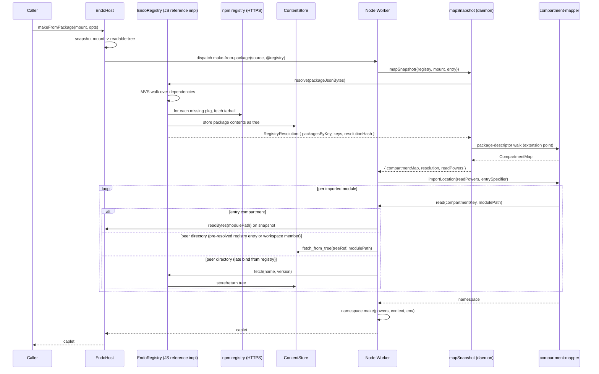

# Daemon Worker `importLocation` from EndoMount

| | |
|---|---|
| **Created** | 2026-05-22 |
| **Updated** | 2026-06-02 |
| **Author** | endolinbot (prompted) |
| **Status** | Proposed |

## Summary

Add a daemon-worker entry point that runs a JavaScript program from
a mount or readable-tree whose root contains a `package.json`
(rather than a pre-built `compartment-map.json`).
This is the **integration layer** of the four-layer stack that
ties [@endo/compartment-mapper](endor-run-expanded.md)'s
`importLocation` (a graph-walking module loader) to a
daemon-side capability surface.

The four layers, each a sibling design:

| Layer | Doc | Concern |
|-------|-----|---------|
| Capability | [registry-capability](registry-capability.md) | `EndoRegistry` shape, `@registry` slot, lifetime |
| Algorithm | [mvs-resolver](mvs-resolver.md) | MVS walk, lockfile stance, who walks the graph |
| Mapper | [snapshot-mapper](snapshot-mapper.md) | `mapSnapshot`, `makeMountReadPowers`, archive-precedent layout |
| Integration | this | `makeFromPackage`, worker dispatch, CLI, XS bridging |

Dependencies declared in `package.json` are resolved by the JS
reference implementation of MVS specified in
[mvs-resolver](mvs-resolver.md), materializing each selected
package as a `readable-tree` in the content-addressed store (CAS).
The worker then runs `compartment-mapper`'s `importLocation`
against a synthesized `ReadPowers` produced by
[snapshot-mapper](snapshot-mapper.md), dispatched through the
daemon's `daemon-worker` (the out-of-process Node or XS process
that hosts user caplets).

The Node.js implementation is a separate lane from the Rust-side
[endor-npm-registry-proxy](endor-npm-registry-proxy.md) and does
not depend on a compiled Rust binary being present.
Both lanes implement the same MVS algorithm and expose the same
`EndoRegistry` capability shape, so Node-hosted and Rust-hosted
daemons reach feature parity on this entry point.

This closes the gap between the daemon's existing mount and
archive capabilities ([daemon-mount](daemon-mount.md),
`makeArchive`, `makeFromTree`) and the `endor run` roadmap: the
same npm-resolution path that `endor run entry.js` describes
becomes a daemon capability so JS-side hosts and guests can run
mount-rooted programs without `npm install` and without a
`node_modules` tree on disk.

## What is the Problem Being Solved?

The daemon today has three paths from a *source shape* to a
running caplet:

1. **`makeArchive`** consumes a ZIP whose root has a
   `compartment-map.json`.
   This is the closed-world, already-resolved form; every module
   is in the archive.
2. **`makeFromTree`** ([daemon-make-archive](daemon-make-archive.md)
   § Phase 7) consumes a `readable-tree` or `EndoMount` whose
   root contains a `compartment-map.json`.
   Same closed-world shape, different container.
3. **`makeUnconfined` / `makeUnconfinedFromTree`** delegate to
   Node's native module loader on the `@node` worker.
   They cross the confinement boundary deliberately.

There is no daemon-side path that takes a `package.json`-rooted
source tree (the shape every working developer's project
actually has on disk) and runs it through a confined worker.
Today the workflow is:

- Run `npm install` to populate `node_modules`.
- Have a Node-side caller run `compartment-mapper`'s
  `importLocation` with `fs.promises.readFile` as the `read`
  power.
- Or build an archive with `compartment-mapper`'s
  `makeArchive`, hand it to `makeArchive` as a
  `readable-blob`, and run it.

Neither shape composes with `EndoMount`-rooted projects or with
the Rust-side npm-registry-proxy that is already landing under
`endor run`.
A user with a mount over their project directory cannot ask the
daemon to run that project against the npm registry without
first synthesizing an archive on the side.

This is acute for three converging pieces of work:

- **`endor run entry.js`**
  ([endor-run-expanded](endor-run-expanded.md) § Phase 5) needs
  an entry-point flow that resolves dependencies through the
  registry table and runs them under a worker.
  Today the resolution is Rust-side only; there is no JS-side
  entry that matches the Rust-side semantics.
- **[daemon-mount-capabilities](daemon-mount-capabilities.md)**
  completes `EndoMount` as the live, handle-first filesystem.
  An `EndoMount` rooted at a project directory should be
  runnable, not just readable.
- **[daemon-make-archive](daemon-make-archive.md) § Phase 7**
  stops at trees that contain a `compartment-map.json`.
  Trees that contain a `package.json` (the everyday shape) need
  a separate entry point because the resolution step is
  different.

The integration layer described here provides the missing rung:
`makeFromPackage`, which takes a mount or readable-tree whose
root contains `package.json`, calls into the three preceding
layers, and hands the result to `importLocation`.

## Goals

1. Run a project rooted at an `EndoMount` or `readable-tree`
   whose root file is `package.json`, with no `node_modules`
   directory required and no upfront `npm install` step.
2. Keep the worker's import path the
   `@endo/compartment-mapper.importLocation` flow that already
   runs everywhere Node runs.
   The new work is in the `ReadPowers` construction (the
   [snapshot-mapper](snapshot-mapper.md) layer), in the new
   `mapSnapshot` lane, and in the JS-side `EndoRegistry` (the
   [registry-capability](registry-capability.md) layer); not in
   the worker's bootstrap.
3. Stay source-only (no precompiled module formats), the same
   constraint `makeArchive` and `makeFromTree` already enforce.
4. Compose cleanly with the existing capability-bus dispatch so
   the new method is a peer of `makeArchive` and `makeFromTree`,
   not a separate subsystem.
5. Reach Node.js parity with whatever the Rust-side `endor run`
   eventually ships: the same MVS semantics, the same offline /
   `--registry` knobs, the same end-to-end shape from a
   `package.json`-rooted source to a running caplet.
   Parity is a precondition for the Node-only CI lane to cover
   the daemon's entry-point behavior.
6. Compose with the unconfined path so that projects whose
   dependencies include native (`.node`) addons can still run
   end-to-end: `makeFromPackage` itself is source-only (the
   compartment-mapper requirement), but when the resolved
   package graph contains native addons, the per-host policy
   may route the entry through `makeUnconfinedFromTree` per
   [daemon-make-archive](daemon-make-archive.md) § Phase 8
   against the same snapshot+resolution result.
   Running native modules is a project-wide goal; this entry
   point integrates with the existing unconfined lane rather
   than blocking it.

## Non-Goals

- A new package-manager CLI.
  The existing `endo install` / `endo run` / `endo make`
  shapes stay; what changes is what `endo run` and `endo make`
  can consume.
- Live filesystem watch on the mount's `package.json` driven by
  this design.
  Re-resolution on manifest churn is a separate lane that
  composes with [filesystem-watchers](filesystem-watchers.md)
  and is tracked there.
- The capability shape, algorithm, and mapper concerns covered
  by the three sibling layers.
  This document focuses on the integration-layer entry points
  and stitches the other three.

## Where This Sits Among Existing Designs

This design is a **sibling** of
[daemon-make-archive](daemon-make-archive.md) § Phase 7
(`makeFromTree`), not a supersedor:

- `makeFromTree` reads a tree whose root is `compartment-map.json`.
  Its modules are already resolved; the worker walks the map.
  That shape stays valid for trees produced by
  `compartment-mapper.makeArchive` and unpacked into a mount,
  and for trees snapshotted from a mount where a prior
  `endor archive` pass has materialized the compartment map.
- `makeFromPackage` (this integration layer) reads a tree whose
  root is `package.json`.
  Its modules are *not* resolved; the daemon drives resolution
  through the [registry-capability](registry-capability.md)
  before the worker runs.
  Each resolved dependency lands in the CAS as a
  `readable-tree`, and the worker's `ReadPowers` (synthesized
  in [snapshot-mapper](snapshot-mapper.md)) reads from those
  CAS trees in addition to the entry tree.

The two cases converge inside `compartment-mapper`: in both, the
worker calls `importLocation` with a `ReadPowers` whose `read`
function understands the archive-precedent layout of a top-level
`compartment-map.json` plus peer directories named by package
(see [snapshot-mapper](snapshot-mapper.md) § *Synthesized
layout*).
The difference is whether the package graph arrives pre-walked
(`makeFromTree`) or has to be walked at start time
(`makeFromPackage`).

A "Superseded by" link on
[daemon-make-archive](daemon-make-archive.md) § Phase 7 would
overstate the relationship.
`makeFromTree` is the right shape for closed-world trees and
stays.
Both methods land on the same worker bootstrap with different
`ReadPowers` and different resolution pre-steps.

**Sharing shape on the worker side.**
`makeFromPackage` and `makeFromTree` share a single worker-side
dispatcher that branches on detected root-file shape, not two
parallel daemon facets.
Concretely: a private helper `selectRootShape(source)` in the
worker reads the source's root listing once, returns either
`'compartment-map'` or `'package'`, and the worker's
`daemon facet` exposes the two methods as thin wrappers that pin
the expected shape, fail closed on a mismatch, and dispatch to a
shared `runImportLocation(source, readPowers, options)` core.
The shared core means a future third root-file shape (for
example a `pnpm-workspace.yaml` workspace root) extends
`selectRootShape` without forking the worker bootstrap.

## Design

### Capability shape

A new daemon-worker method, paired with a new daemon formula
type.
The `EndoRegistry` capability and the `@registry` host special
name are defined in [registry-capability](registry-capability.md)
and consumed by name here.

#### New host method: `makeFromPackage`

```ts
makeFromPackage(
  workerPetName: string | undefined,
  mountName: string,        // pet name of an EndoMount or readable-tree
  options?: MakeCapletOptions & {
    entry?: string;         // module specifier relative to package root
    registry?: string;      // pet name of an EndoRegistry capability
    offline?: boolean;      // skip fetch; require all packages present
  },
): Promise<unknown>;
```

`mountName` resolves to either an `EndoMount`, an
`EndoMountEntry` (per
[daemon-mount-capabilities](daemon-mount-capabilities.md)), or a
`readable-tree`.
The named tree's root must contain a `package.json`.

`options.entry` defaults to whatever `compartment-mapper`'s own
entry resolution picks: `package.json#exports['.'].endo`, then
`exports['.'].import`, then `exports['.'].default`, then `main`,
then `index.js`.
The default is inherited from `compartment-mapper` rather than
restated here so the daemon-side defaults do not drift from the
mapper's behavior as conditional exports evolve.
Bare specifiers inside the entry module are resolved against the
root `package.json`'s `dependencies` and resolved through the
registry capability.

`options.registry` defaults to a host-scoped `@registry` special
name; see [registry-capability](registry-capability.md) §
*Host special name* for the slot's shape and migration policy.

`options.offline` mirrors `--offline` from
[endor-npm-registry-proxy](endor-npm-registry-proxy.md): with it
set, no network access is permitted; the resolution either
succeeds against the existing registry table or fails cleanly.

#### New host method: `makeFromMount`

```ts
makeFromMount(
  workerPetName: string | undefined,
  mountName: string,
  options?: MakeCapletOptions & {
    entry?: string;
    registry?: string;
    offline?: boolean;
  },
): Promise<unknown>;
```

`makeFromMount` is a thin dispatcher that inspects the mount root
once (the same `selectRootShape` private helper the worker uses)
and forwards to `makeFromTree` if the root contains
`compartment-map.json`, or to `makeFromPackage` if the root
contains `package.json`, or rejects cleanly if the root contains
neither.
The CLI's `endo run <mount>` form (below) delegates to
`makeFromMount`, so the source-detection logic lives in one place
rather than re-implemented by every host-API caller that wants
the CLI's "do the right thing for this mount" behavior.
A caller that already knows the root shape can still call
`makeFromTree` or `makeFromPackage` directly.

#### New formula type: `MakeFromPackageFormula`

```ts
type MakeFromPackageFormula = {
  type: 'make-from-package';
  worker: FormulaIdentifier;
  powers: FormulaIdentifier;
  source: FormulaIdentifier;     // EndoMount or readable-tree
  registry: FormulaIdentifier;   // EndoRegistry
  entry?: string;                // relative module specifier
  env?: Record<string, string>;
  offline?: boolean;
  cancelWithWorker?: FormulaIdentifier;
};
```

`extractLabeledDeps` reports the same shape `make-archive` already
uses, with the `archive` slot replaced by `source` and a new
`registry` slot.

### Worker dispatch

The Node worker's `daemon facet` gains one method.
The body composes the three preceding layers: snapshot the
source, call into `mapSnapshot`
(see [snapshot-mapper](snapshot-mapper.md)) for the resolution,
the synthesized `ReadPowers`, and the `CompartmentMap`, then run
`importLocation`.

```js
makeFromPackage: async (
  sourceP, registryP, contextP, options,
) => {
  const { entry, env, offline } = options;
  const source = await sourceP;
  const registry = await registryP;

  // Step 1: snapshot the live entry source before resolution
  // (see registry-capability.md § Mount snapshot vs live read).
  // No-op when the source is already a readable-tree.
  const snapshot = await E(source).snapshot();

  // Step 2: drive the snapshot mapper.
  // mapSnapshot internally calls E(registry).resolve(packageJsonBytes)
  // and builds the synthesized ReadPowers against the archive-
  // precedent layout (top-level compartment-map.json plus peer
  // directories named by package); see snapshot-mapper.md.
  const { mapSnapshot } = await import('../map-snapshot.js');
  const { compartmentMap, resolution, readPowers } = await mapSnapshot({
    registry,
    mount: snapshot,
    entry,
  });

  // Step 3: run importLocation in the worker's compartment.
  // The compartment-mapper conditions option applies at link
  // time, not at dependency-graph walk time (see
  // mvs-resolver.md § Anti-design steers), so conditions thread
  // through importLocation here.
  const { importLocation } = await import('@endo/compartment-mapper');
  const { defaultParserForLanguage } = await import(
    '@endo/compartment-mapper/import-parsers.js'
  );
  const entrySpecifier = entry || compartmentMap.entry.module;

  const { namespace } = await importLocation(
    readPowers,
    entrySpecifier,
    {
      globals: endowments,
      parserForLanguage: defaultParserForLanguage,
      compartmentMap,
      conditions: options.conditions,
    },
  );

  return namespace.make(/* powersP */ undefined, contextP, { env });
};
```

The XS worker's `daemon facet` gains the same method but routes
the `read` function through the supervisor's CAS bindings (see
*XS bridging* below).

### CLI shape

A new `endo run` form, on top of the existing archive form:

```
endo run <mount-pet-name>            # uses @registry, default entry
endo run <mount-pet-name> entry.js   # explicit entry module
endo run <mount-pet-name> --offline  # no network access
endo run <mount-pet-name> --registry @private-npm
```

`endo run` detects the source form by inspecting the mount root
once:

- Has `compartment-map.json`?  Use `makeFromTree`.
- Has `package.json`?  Use `makeFromPackage`.
- Has neither?  Reject with a clean error pointing at both.

This is the same `selectRootShape` discrimination the worker
performs internally, and mirrors the Rust-side detection logic
in [endor-run-expanded](endor-run-expanded.md) § *Input forms*.

### XS bridging

XS workers cannot run `compartment-mapper` directly today because
the mapper imports filesystem-shaped modules (`fs.promises`).
Two viable paths, ordered by readiness:

1. **Near-term: Node-worker default.**
   `makeFromPackage` defaults the worker selection to the host's
   Node worker (`mainWorker` if it is Node, else `@node`).
   The XS worker raises a clean "compartment-mapper not yet
   hosted in XS" error if dispatched directly.
   This matches the existing
   [daemon-make-archive](daemon-make-archive.md) § Phase 4 split
   where archive loading on XS goes through the Rust host call
   rather than through `compartment-mapper`'s Node-only loader.
2. **Long-term: XS-hosted compartment-mapper.**
   Per [endor-run-expanded](endor-run-expanded.md) §
   *Compartment mapper implementation* option B, bundle the
   mapper for XS execution and have the Rust supervisor satisfy
   its `ReadFn` from CAS.
   This is the same path the Rust-side `endor run` is taking;
   once it lands, the daemon-side `makeFromPackage` can dispatch
   to either worker kind without code duplication on the bus.

The Node-worker default is what ships first; the XS path is a
follow-up.
The daemon-side dispatcher does not change between the two
cases.

### Architecture diagram

The diagram shows the JS-reference-implementation lane (default).
A Rust-backed `EndoRegistry` is a drop-in replacement at the
capability boundary and changes only the steps inside `Reg`; the
rest of the flow is identical.



## Phased Implementation

Each phase ends with at least one passing daemon integration test
(`packages/daemon/test/endo.test.js`).
The phases below stitch the three preceding layers' phases into
the integration-layer entry; see each layer's *Phased
implementation* section for the per-layer test surface.

### Phase 1: Registry capability (delegated)

Land [registry-capability](registry-capability.md) § Phase 1: the
JS reference `EndoRegistry`, `RegistryFormula`, the `@registry`
host special name, and the host-formula migration pass.
The MVS algorithm that backs `resolve` lands here too, per
[mvs-resolver](mvs-resolver.md) § *Phased implementation*.

### Phase 2: `mapSnapshot` and worker dispatch

Land [snapshot-mapper](snapshot-mapper.md) § *Phased
implementation*: `packages/daemon/src/worker-import.js`
(`makeMountReadPowers`), `packages/daemon/src/map-snapshot.js`
(`mapSnapshot`), and the small `compartment-mapper` extension
point.

Then add `makeFromPackage` to the Node worker's daemon facet,
calling `mapSnapshot` and then `importLocation` against the
returned `ReadPowers`.
Add `MakeFromPackageFormula` to the formula union and the
dispatcher case.

Integration tests at this phase:

- Hand-crafted fixture with a trivial `package.json` pinning a
  single small dependency (for example `is-odd@1.0.0`); the
  worker imports the entry module, the namespace returns the
  expected `make` result.
- Multi-major coexistence: a project that depends on `pkg@^1`
  directly and on a transitive that requires `pkg@^2` runs to
  completion and each compartment's `pkg` namespace is the major
  it was directly resolved against.
  This exercises the end-to-end stitch the mapper and the
  worker dispatch make.

### Phase 3: `makeFromPackage` host method and CLI

1. Add `EndoHost.makeFromPackage` and `EndoHost.makeFromMount`.
2. Add the source-detection branch to `endo run` and `endo make`,
   delegating to `makeFromMount`.
3. Add `--offline` and `--registry` flags.
4. Tests:
   - `endo run <mount>` for a small project.
   - `endo make <mount>` for the same.
   - `endo run <mount> --offline` after a populated registry
     table.
   - `endo run <mount> --offline` with a missing dependency fails
     cleanly (`RegistryOfflineError`; see
     [registry-capability](registry-capability.md) § *Failure
     surface*).

### Phase 4: Snapshot-before-import

1. Add the `E(source).snapshot()` step ahead of resolution in
   the worker dispatch body.
2. Tie the snapshot's lifetime to the caplet's context via
   `thisDiesIfThatDies`.
3. Tests:
   - Start a caplet against a mount, mutate the mount during the
     caplet's lifetime, verify the caplet's view does not change.
   - **Caplet snapshot lifetime release.**
     Start a caplet against a mount, observe the snapshot's CAS
     trees are alive while the caplet runs, end the caplet, and
     observe the snapshot's CAS trees become collectible (the
     `thisDiesIfThatDies` dependency releases).
     The test confirms the lifetime claim under
     [registry-capability](registry-capability.md) §
     *Mount snapshot vs live read* is enforced, not just
     documented.

### Phase 5: Rust-backed `EndoRegistry` (drop-in)

Land [registry-capability](registry-capability.md) § Phase 5:
the Rust-backed `EndoRegistry` backend.
The capability shape is unchanged; the integration-layer worker
dispatch does not change.
Tests for the Rust backend mirror the JS-side suite (including
the multi-major coexistence and caplet snapshot lifetime release
tests defined in Phase 2 and Phase 4) to confirm parity between
the lanes.

### Phase 6: XS-hosted compartment-mapper (deferred)

This phase is deferred to the Rust-side
[endor-run-expanded](endor-run-expanded.md) § Phase 4 / 5; the
daemon-side work in this design does not block on it.
The section preamble's "each phase ends with at least one
passing daemon integration test" rule does not apply to a
deferred phase that depends on out-of-tree work; the test
exception is noted here rather than restated on every deferred
phase the daemon designs carry.
When the Rust-side path lands, the daemon dispatcher does not
change; only the per-worker bootstrap, and the corresponding
test lands with the Rust-side phase.

## Design Decisions

1. **One stack, four layers.**
   The original monolithic design covered the capability, the
   algorithm, the mapper, and the integration in one file.
   The decomposition lands the four layers as siblings so each
   is independently reviewable and the integration layer reads
   as a stitch rather than a re-statement.
   The integration layer keeps the original branch slug
   (`design/daemon-worker-import-from-mount`) so cross-references
   from outside the design tree do not break.

2. **`makeFromPackage` and `makeFromTree` share a worker-side
   dispatcher.**
   A single `selectRootShape` private helper inspects the mount
   root once and dispatches to the right downstream handler.
   The two methods are thin wrappers that pin the expected shape
   and fail closed on mismatch.
   This lets a future third root shape extend the dispatcher
   without forking the worker bootstrap.

3. **CLI delegates to `makeFromMount`.**
   The "do the right thing for this mount" detection logic
   lives once in `makeFromMount`, and the CLI consumes it.
   A caller that already knows the root shape can still call
   `makeFromTree` or `makeFromPackage` directly; the
   detection-bearing entry is the convenience layer, not the
   only path.

4. **XS bridging is a deferred phase, not a blocker.**
   The Node-worker default ships first; the XS-hosted mapper
   path is a follow-up that does not change the
   integration-layer dispatcher.
   This matches the
   [daemon-make-archive](daemon-make-archive.md) § Phase 4 split
   precedent.

## Open Questions

1. **`makeFromPackage` vs `makeFromMount` as the primary
   surface.**
   The CLI uses `makeFromMount` and delegates internally.
   Should the host API document `makeFromMount` as the
   recommended entry and treat `makeFromPackage` /
   `makeFromTree` as advanced explicit-shape methods?
   Provisional answer: yes for the user-facing docs, no for the
   capability surface (both stay first-class).

2. **Future third root shape.**
   A `pnpm-workspace.yaml` root or a Bun workspace root would
   extend `selectRootShape`.
   No commitment in the first cut; the dispatcher's extensibility
   is the only design surface that needs to anticipate it.

## Dependencies

| Design | Relationship |
|--------|--------------|
| [registry-capability](registry-capability.md) | The capability layer this integration consumes.  `EndoRegistry`, the `@registry` host special name, the snapshot-vs-live-read contract, the host-formula migration pass, and the failure surface are defined there. |
| [mvs-resolver](mvs-resolver.md) | The algorithm layer.  The integration layer drives `EndoRegistry.resolve` exactly once per `makeFromPackage` invocation; the algorithm's eager-single-pass shape is what makes the per-import bus-roundtrip-free path possible. |
| [snapshot-mapper](snapshot-mapper.md) | The mapper layer.  The integration layer calls `mapSnapshot` between the snapshot step and the `importLocation` call; the returned `{ compartmentMap, resolution, readPowers }` trio is the integration's interface to the worker. |
| [daemon-make-archive](daemon-make-archive.md) | Sibling of § Phase 7 (`makeFromTree`).  `makeFromTree` handles `compartment-map.json`-rooted trees; `makeFromPackage` handles `package.json`-rooted trees.  Both end at `compartment-mapper`'s `importLocation` / `parseArchive`. |
| [endor-run-expanded](endor-run-expanded.md) | The Rust-side analogue.  Both sides converge on the same `EndoRegistry` capability shape and the same `RegistryResolution` content-addressing.  The Rust side and the JS side are independent implementations (separate lanes); the JS side does not depend on the Rust side being present. |
| [endor-npm-registry-proxy](endor-npm-registry-proxy.md) | The Rust-side resolver mirror.  Phase 5 drops it in as a second `EndoRegistry` backend. |
| [daemon-mount](daemon-mount.md) | `makeFromPackage` consumes an `EndoMount` as its primary source shape.  The snapshot-before-import step uses `EndoMount.snapshot()` from § *Snapshot*. |
| [daemon-mount-capabilities](daemon-mount-capabilities.md) | Uses the completed `EndoMount` surface: `readBytes`, `snapshot`, and the `EndoMountEntry` overload on `lookup`. |
| [daemon-cas-management](daemon-cas-management.md) | The resolved package trees live in the CAS; the worker reads from them through the existing `cas-fetch` / `cas-fetch-from-tree` bus verbs. |
| [filesystem-watchers](filesystem-watchers.md) | Future integration point.  A watcher on the entry mount's `package.json` could trigger re-resolution; out of scope here, and each implementation lane (Rust and JS) manages its own watch/re-resolve loop independently. |
| [inventory-cancel-and-liveness](inventory-cancel-and-liveness.md) | `thisDiesIfThatDies` underwrites the caplet-snapshot lifetime coupling tested in Phase 4. |

## Prompt

> Author the missing daemon-worker design that ties Compartment
> Mapper's `importLocation`-style entry to an `EndoMount`
> read-source with the existing Rust-side npm-registry-proxy +
> Go-like MVS resolver exposed as a daemon capability.  Single
> design file at `designs/<slug>.md` (suggested slug:
> `daemon-worker-import-from-mount`; designer picks the final
> name).  Decide whether the design supersedes
> `daemon-make-archive.md` § Phase 7 in whole or sits as a
> sibling that extends it; in the supersede case, add a
> `Superseded by:` row to `daemon-make-archive.md` in the same
> PR.  Sync `designs/README.md` (new row, milestone, dependency
> edges to the four prior designs and to
> `daemon-make-archive.md`'s phase-7 box, size estimate).

Decomposed 2026-06-02 per kriskowal CHANGES_REQUESTED on
`endojs/endo-but-for-bots#358` into the four-layer stack named in
the *Where This Sits Among Existing Designs* section above; this
file is repurposed as the integration layer.

Round-2 update 2026-06-02 reflects the snapshot-mapper layout
change (archive precedent: top-level `compartment-map.json` plus
peer directories named by package), the corresponding
`importLocation` entry-specifier shape, the `read` function's
`(compartmentKey, modulePath)` signature, and the threading of
conditional `exports` through `importLocation` rather than
through the dependency-graph walk per
[mvs-resolver](mvs-resolver.md) § *Anti-design steers*.
