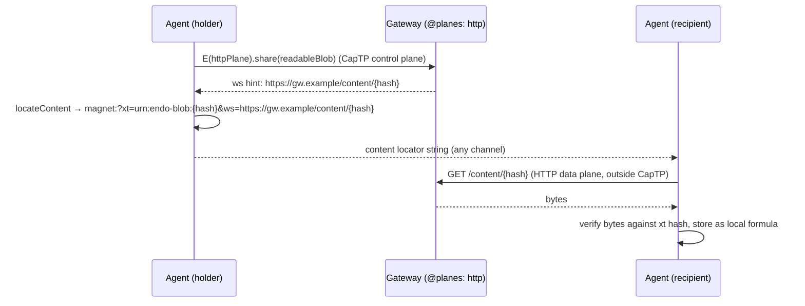

# Endo Content Locators (Magnet URNs)

| | |
|---|---|
| **Created** | 2026-07-10 |
| **Author** | Kris Kowal (prompted) |
| **Status** | Not Started |

## What is the Problem Being Solved?

An Endo **locator** ([daemon-locator-reference](daemon-locator-reference.md)) is
a URL that identifies a **formula** on the Endo network and says *how to reach
the peer that hosts it*. Its connection hints, the `@`-delimited path components
after the formula address, are ephemeral transport addresses. They are not
stored with the formula: they are looked up fresh from the network layer each
time a locator is produced for sharing, so a peer that changes networks (Wi-Fi
to cellular to Tor) shares the same durable identity with different reachable
addresses. Which hints appear depends on the agent's configuration, specifically
its per-agent `@nets` (`NETS`) directory of advertised transports
([daemon-agent-network-identity](daemon-agent-network-identity.md)): an agent
with an empty `NETS` produces locators without connection hints at all.

There is no analogous artifact for **content**. Today the only way to move a
readable-blob or readable-tree between agents is **in band, over CapTP**:
`checkin` / `checkout` ([daemon-checkin-checkout](daemon-checkin-checkout.md)),
`worktree.snapshot()`, and `storeTree()` stream the bytes inside CapTP messages
between two connected peers. That requires a live CapTP session and a capability
to the readable, and it puts the whole payload on the object-capability channel.

Many transfers do not want those constraints. A recipient may hold only a short
string, not a live capability. The bytes may be large, cacheable, mirrorable, or
swarmable, and belong on a data plane built for bulk transfer (HTTP, Git over
HTTP, BitTorrent) rather than on the CapTP control channel. This is exactly the
split [daemon-git-remotes](daemon-git-remotes.md) already draws for git: *CapTP
carries control-plane authority while packfile bytes travel on a bounded HTTPS
data plane outside CapTP messages*. This design generalizes that split to any
readable.

A **content locator** is the content-side analogue of a locator: a string that
identifies a readable-blob or readable-tree **by its content**, independent of
where it lives, and carries **data-plane connection hints** that say *how to
fetch the bytes out of band*. Just as a locator's transport hints come from
`@nets` and depend on configuration, a content locator's data-plane hints come
from the content analogue of `@nets` and depend on configuration: which back
planes the agent's **Gateway** is currently vending. Content locators are the
**out-of-band complement** to in-band CapTP transfer, never a replacement (see
[§ Relationship to in-band CapTP transfer](#relationship-to-in-band-captp-transfer)).

## Design

### Two locators, two hint axes

The content locator mirrors the transport locator point for point. The durable
part names identity; the ephemeral part carries configuration-dependent hints
looked up fresh at share time.

| Axis | Transport locator (existing) | Content locator (this design) |
|---|---|---|
| Identifies | a **formula** (who / which / what kind) | **content** (a readable-blob or readable-tree, by hash) |
| Scheme | `endo://` URL (names a **location**: a peer) | `magnet:` URN (names **content**, location-independent) |
| Durable identity | `peerKey` + `formulaAddress` + `type` | SHA-256 content address (`xt`) |
| Ephemeral hints | transport addresses (`@`-delimited path) | data-plane sources (`ws` / `xs` / `as` / `tr`) |
| Hints depend on | `@nets` (`NETS`) advertised transports | `@planes` vended data planes (see below) |
| Hints resolved | fresh at `locate`, via `getAllNetworkAddresses` | fresh at `locateContent`, via `getAllContentSources` |
| Empty-config result | locator with no connection hints | content locator with `xt` only, no sources |
| Verified against | Ed25519 keypair at OCapN-Noise handshake | the `xt` hash, after the bytes arrive |

A locator is a **URL** because it names a location (a peer to contact). A content
locator is a **URN** because it names content by hash regardless of location.
This is precisely the distinction the `magnet:` URI scheme already draws, so the
content locator **reuses the magnet grammar** rather than inventing a new one.

### Content-locator grammar

```
magnet:?xt=urn:endo-blob:{sha256hex}&dn={displayName}&xl={byteLength}&ws={source}&xs={source}
magnet:?xt=urn:endo-tree:{sha256hex}&dn={displayName}&ws={source}
```

| Parameter | Role | Analogue |
|---|---|---|
| `xt` | **exact topic**: the durable content identity. `urn:endo-blob:{hash}` for a readable-blob, `urn:endo-tree:{hash}` for a readable-tree. The hash is the SHA-256 content address the CAS already keys on (`store-sha256/`, [daemon-cas-management](daemon-cas-management.md)). | the `formulaAddress` + `type` of a locator |
| `dn` | display name (descriptive only) | none |
| `xl` | exact length in bytes (descriptive only) | none |
| `ws` / `xs` / `as` / `tr` | **data-plane connection hints**, each `<plane-prefix>:<plane-payload>`, one per acquisition source | the `@`-delimited `at` hints of a locator |

The standard magnet letters are reused deliberately: `ws` (**web seed**, BEP 19)
is a direct HTTP URL to the bytes; `as` (acceptable source) is a fallback web
link; `xs` (exact source) is a P2P/verifiable source; `tr` (tracker) is a
BitTorrent tracker. Each back-plane declares which parameters it contributes (see
[§ Extensible data-plane hint framework](#extensible-data-plane-hint-framework)).
A content locator with only `xt` and no source parameters is the content analogue
of a hint-free locator from an empty `NETS`: the bytes can be **verified** if
obtained, but the agent advertises **no** way to fetch them (the in-band CapTP
path remains the fallback).

Like locator hints, source hints are **ephemeral**: they reflect the Gateway's
current configuration and are never stored with the content. Producing a content
locator looks the sources up fresh (see `getAllContentSources` below), exactly as
`locate` looks up transport hints fresh via `addPeerInfo` / the network layer.

### Interface extension

The agent interface gains a content-locate method family beside the existing
name-resolution family (`identify` / `locate` / `lookup`,
[daemon-locator-reference](daemon-locator-reference.md) § Method Taxonomy).
Content-locate methods are defined once in `directory.js` and carried up through
`host.js` / `guest.js` by destructuring, the same shape as `writeLocator`.

| Method | Signature | Description |
|---|---|---|
| `locateContent(...path)` | `name → contentLocator` | Resolve a pet name for a readable-blob or readable-tree to a content locator (magnet URN). Rejects if the named formula is not content-bearing. |
| `listContent(...path)` | `name → Record<name, contentLocator>` | Content analogue of `listLocators`, for a directory of content-bearing formulas. |
| `storeContent(...path)` | `name → contentLocator` | The explicit publish verb behind `locateContent`'s resolution: mint the per-plane sharing capabilities over the agent's `@planes`, ask each vended plane to begin serving the named readable, and return the content locator carrying the freshly vended source hints. (Exact store-side semantics are elaborated at implementation; recorded here as the maintainer-confirmed member of the method family.) |
| `loadContent(contentLocator)` | `contentLocator → ReadableBlob \| ReadableTree` | Fetch the content over the first reachable advertised data plane, **verifying every byte against `xt`**, and return the readable as a **new local content-addressed formula** (copy semantics, matching `checkin`). Falls back across sources; falls back to in-band CapTP if a capability to the origin is also held. |
| `reverseLocateContent(contentLocator)` | `contentLocator → name[]` | Find pet names whose content matches a content locator's `xt` hash. |
| `internalizeContentLocator(contentLocator)` | `contentLocator → { hash, kind, sources }` | Parse and validate a content locator: extract the content hash and kind, and forward the source hints to the fetch layer (analogue of `internalizeLocator` forwarding transport hints to `addPeerInfo`). |

Only content-bearing formulas can be content-located: a readable-blob, a
readable-tree, and the structurally-compatible read surfaces from
[platform-fs](platform-fs.md) (`EndoMountFile` as a blob, `EndoMount` /
`GitTreeProvider` result as a tree, [daemon-git-capability](daemon-git-capability.md)).
`locateContent` on any other formula type rejects, the same way `parseLocator`
rejects an unknown query parameter.

`externalizeContent(hash, kind, sources?)` and `internalizeContentLocator` form
the content-side duality that mirrors `externalizeId` / `internalizeLocator`,
and live beside them in `locator.js`.

### The `@nets` content analogue: `@planes`

`@nets` (`NETS`) is a per-agent directory of **network references**; the network
layer resolves it to the transport addresses a locator advertises. The content
analogue is a per-agent directory of **data-plane sharing capabilities**. The
maintainer has picked the canonical spelling: it is **`@planes`** (see
[§ Design Decisions](#design-decisions)). This lands as the transport side is
itself renamed `@nets` → **`@transports`**, so the two special names read as a
pair (`@transports` for reachability, `@planes` for content). Each entry is a
capability, vended by a Gateway, that can serve content the agent holds over one
back-plane and report the reachable source URL for it.

`@planes` is the identity/advertisement half of content sharing, exactly as
`NETS` is for reachability:

- **What content I can serve, and how to fetch it** = the `@planes` contents
  (advertised data planes), the content analogue of *how to reach me* = `NETS`.
- A content-locate call resolves `getAllContentSources(planesDirectoryId, hash)`
  the way `locate` resolves `getAllNetworkAddresses(networksDirectoryId)`: it
  asks each vended data plane for a source hint for this hash and appends the
  results as `ws` / `xs` / `as` / `tr` parameters.
- A newly incarnated agent's `@planes` starts **empty** and its creator may
  populate it, mirroring the empty-`NETS` default. An empty `@planes` produces
  content locators with `xt` only, the persona-privacy analogue: the agent
  proves what the content *is* without advertising any place to get it.

Two agents on one daemon can present entirely different content footprints (one
public-HTTP-mirrored, one serve-nothing) while sharing the underlying process,
just as they can present different `NETS` transport footprints.

### Extensible data-plane hint framework

The directive asks that each data plane (HTTP, Git over HTTP, BitTorrent, and
others) be approached as an **individual, incremental** design that extends the
supported hint vocabulary. So the content-locator layer defines a **registry**,
not a fixed set of planes. A back-plane is a value implementing:

```ts
interface ContentDataPlane {
  // Stable prefix used in a source hint and (for BitTorrent-style planes) the
  // urn namespace this plane understands, for example 'ws' + 'urn:endo-blob'.
  readonly name: string;

  // Ask this plane (via its @planes sharing capability) to begin serving the
  // content and return the source hint(s) to append to a content locator.
  // Returns [] if this plane cannot serve the given content right now.
  source(hash: string, kind: 'blob' | 'tree', share: DataPlaneShare):
    Promise<ContentSourceHint[]>;

  // Fetch bytes for the content from a source hint. The caller verifies the
  // stream against `hash`; a plane never returns unverified content as trusted.
  fetch(hint: ContentSourceHint, hash: string, kind: 'blob' | 'tree'):
    Promise<ReadableBlob | ReadableTree>;
}

type ContentSourceHint = { plane: string; payload: string };
```

Registering a plane wires three things: (1) how it **contributes** parameters to
the magnet grammar, (2) a **resolver** that turns a held `@planes` sharing
capability plus a content hash into source hints, and (3) a **verifying fetcher**
that retrieves bytes for a hint and hands them to the hash-verification gate.
`loadContent` iterates the registered planes present in a content locator in
preference order and stops at the first that yields hash-verified bytes.

This design registers **one** plane end to end (below) and names the rest as
follow-up designs to be filed (see [§ Follow-up back-planes](#follow-up-back-planes-to-be-filed)).

### Worked back-plane: HTTP web-seed

The first worked plane is **plain HTTP** (a web-seed `ws` hint), recommended as
the minimal end-to-end proof for three reasons:

1. **The socket already exists.** The Gateway
   ([daemon-web-gateway](daemon-web-gateway.md), [gateway-package](gateway-package.md))
   already runs an HTTP+WebSocket server and already keeps a
   **content-addressed static-asset cache**. Serving `GET /content/{sha256hex}`
   for a blob the agent holds is the smallest possible new surface on machinery
   that is built.
2. **The hash maps directly to the route.** A readable-blob's identity already
   *is* its SHA-256 content address, so the `xt` hash and the URL path are the
   same string. No new addressing scheme is introduced.
3. **It exercises the whole frame** (registry, `@planes`, Gateway vend,
   verifying fetch) with the least machinery, so the second and third planes
   extend a proven frame rather than co-designing it.

Worked flow:



The HTTP `GET` returns raw bytes for a blob. For a tree, the web-seed serves the
tree's canonical archive (the `git archive --format=tar` bulk data plane
[daemon-git-capability](daemon-git-capability.md) already defines is a natural
carrier, and the tar-entry validation rules there apply on extraction). The
recipient verifies the assembled tree against `xt` before trusting it.

Because every byte is verified against `xt`, the HTTP data plane is **untrusted**:
a malicious mirror, CDN, or man in the middle cannot substitute content, only
deny it. This is the content analogue of a locator hint being advisory while the
keypair is the true identity. A wrong or unreachable `ws` source just falls
through to the next source, or to in-band CapTP.

### The Gateway as the source of configuration-dependent hints

The reason content-locator hints depend on configuration is that they are
**Gateway-vended**. A Gateway is the online service that can vend a reachable
socket ([gateway-package](gateway-package.md) already lists Git-over-HTTP and
HTTP static serving among its roles). To share content over a back-plane, an
agent asks its Gateway (through the relevant `@planes` capability) to start
serving the content and to report the reachable URL. That URL becomes the hint.

So the hints change when the Gateway configuration changes (a new public
hostname, a relay added or removed, a plane enabled or disabled), which is
exactly why they are resolved fresh at `locateContent` time and never stored with
the content, mirroring the connection-hints-are-ephemeral discipline for
locators. An agent with no Gateway, or a Gateway vending no planes, produces
`xt`-only content locators.

Minting a sharing capability is the agent's **explicit** act. Holding a content
locator lets the recipient *fetch and verify* specific content; it conveys **no**
authority over the agent or its formulas. The `xt` hash is a
read-capability-by-content (whoever has the bytes and the hash can check them),
not an object capability.

### Relationship to in-band CapTP transfer

Content locators sit beside, not on top of, the existing in-band transfer, and
the boundary is explicit:

| | In-band (existing) | Out-of-band content locator (this design) |
|---|---|---|
| Carrier | bytes inside CapTP messages | bytes on a separate data plane (HTTP / Git / BitTorrent) |
| Needs | a live CapTP session **and** a capability to the readable | only the content-locator string; no capability, no live session |
| CapTP role | control **and** data plane | control plane only (mint sharing cap, return URN); no bytes |
| Good when | peer-to-peer copy over an open connection | large / cacheable / mirrorable / swarmable payloads, or recipient holds only a string |
| Fallback | (is the fallback) | `loadContent` falls back to in-band CapTP if a capability and session are also held |

The two compose. `loadContent` prefers advertised data planes and falls back to
in-band CapTP; conversely a content locator works when no CapTP capability was
ever shared. Content locators **extend** the transfer story the way `GitRemote`
extends local `Git`: same control-plane-on-CapTP, data-plane-off-CapTP split,
generalized from packfiles to any readable.

## Dependencies

| Design | Relationship |
|---|---|
| [daemon-locator-reference](daemon-locator-reference.md) | The transport-locator format this mirrors; `externalizeId` / `internalizeLocator` and the ephemeral-hints discipline are the templates for the content-side duality. |
| [daemon-agent-network-identity](daemon-agent-network-identity.md) | `@nets` (`NETS`) and `getAllNetworkAddresses`, the model `@planes` / `getAllContentSources` copies. |
| [daemon-cas-management](daemon-cas-management.md) | The SHA-256 content-addressed store whose hash is the `xt` identity and the verification target. |
| [platform-fs](platform-fs.md) | `ReadableBlob` / `ReadableTree` read surfaces that content locators name and that `loadContent` returns. |
| [daemon-checkin-checkout](daemon-checkin-checkout.md) | The in-band CapTP transfer this complements; the boundary is drawn in § Relationship to in-band CapTP transfer. |
| [daemon-web-gateway](daemon-web-gateway.md) / [gateway-package](gateway-package.md) | The Gateway that vends reachable sockets and holds the content-addressed static-asset cache the HTTP plane serves from. |
| [daemon-git-capability](daemon-git-capability.md) / [daemon-git-remotes](daemon-git-remotes.md) | The control-plane-on-CapTP / data-plane-on-HTTP split this generalizes; the `git archive` bulk path is a tree carrier and the Git-over-HTTP follow-up's substrate. |

## Phased implementation

1. **Grammar and duality.** `externalizeContent` / `internalizeContentLocator`
   and a `parseContentLocator` validator in `locator.js` (accept `xt` for
   `urn:endo-blob:` / `urn:endo-tree:`, `dn`, `xl`, and registered source
   parameters; reject unknown parameters, matching `parseLocator`'s strictness).
   Round-trip invariant tests, no network.
2. **Interface methods.** `locateContent`, `listContent`, `storeContent`,
   `reverseLocateContent`, `internalizeContentLocator` in `directory.js`, carried
   up through `host.js` / `guest.js`; rejection for non-content formula types.
3. **`@planes` and resolution.** The per-agent `@planes` special name (empty by
   default), `getAllContentSources`, and the `ContentDataPlane` registry. With
   an empty `@planes` this yields `xt`-only content locators.
4. **HTTP web-seed plane.** The Gateway `GET /content/{hash}` route over the
   content-addressed static-asset cache, the `@planes` HTTP sharing capability
   that vends the `ws` URL, and `loadContent`'s verifying fetch for `ws` (blob and
   tar-tree), with fallback ordering and the in-band CapTP fallback.
5. **Verification gate and fallback.** The hash-verification wrapper every plane
   feeds, source preference ordering, and the CapTP fallback path.

## Design Decisions

1. **A content locator is a URN (`magnet:`), not an `endo://` URL.** It names
   content by hash regardless of location; a locator names a peer to contact.
   Reusing the magnet grammar inherits `xt` / `ws` / `xs` / `as` / `tr` prior art
   instead of coining a parallel scheme.
2. **`xt` is the existing SHA-256 content address.** No new content-identity
   scheme: the URN carries the same hash the CAS and the readable-blob formula
   already key on, so identity is verifiable and location-independent.
3. **Source hints are ephemeral and Gateway-vended.** They are resolved fresh at
   share time and never stored with the content, mirroring the
   connection-hints-are-ephemeral discipline for locators. This is what makes
   them configuration-dependent.
4. **`@planes` is the content analogue of `@nets`, and is the canonical name.**
   The maintainer picked **`@planes`** over the other candidates (`@seeds`,
   `@shares`, `@stores`). It lands alongside the transport side's own rename
   `@nets` → **`@transports`**, so the pair reads as `@transports` (reachability)
   and `@planes` (content). Same empty-by-default, creator-populated,
   persona-scoped shape; an empty `@planes` yields `xt`-only content locators,
   the content-side of the anonymizing-persona property.
5. **Every plane is an untrusted data plane; `xt` is the trust root.** Bytes are
   verified against the hash before use, so mirrors, CDNs, and swarms need to be
   *available*, not *trusted*. Wrong sources fall through.
6. **Control plane on CapTP, data plane off it.** CapTP mints the sharing
   capability and carries the URN; the payload bytes travel on HTTP/Git/BitTorrent,
   generalizing the [daemon-git-remotes](daemon-git-remotes.md) split.
7. **One plane worked, the rest registered.** The `ContentDataPlane` registry
   makes the hint vocabulary extensible; this design lands HTTP end to end and
   defers the others to individual designs.
8. **Out-of-band complements in-band, never replaces it.** `loadContent` falls
   back to CapTP snapshot; content locators add reach (string-only recipients,
   bulk planes) without removing the peer-to-peer copy path.
9. **The method family is spelled `<verb>Content`.** `locateContent`,
   `loadContent`, `storeContent`, `listContent`, `reverseLocateContent`, `&c.` —
   a **separate** family (not a content flag folded into the `locate` family),
   the same way `writeLocator` stays distinct. This is the maintainer-confirmed
   spelling of the interface.
10. **`loadContent` uses copy semantics.** It returns a **new local
    content-addressed formula**, matching `checkin`, rather than a remote-backed
    lazy readable that streams from the data plane on demand. A lazy-streaming
    variant for large, sparsely-browsed trees is left to a future extension.
11. **The readable-tree `xt` uses the current readable-tree hashing scheme, with
    a planned future change.** The `xt` for a tree is computed over today's
    readable-tree serialization now, so two agents hash the same tree alike. The
    design reserves the right to change this when **CASK** is integrated: CASK
    has its own hashing constraints — Rabin-fingerprinting, and child hashes
    captured in a way that is transparent to the GC — that may reshape the
    canonical serialization, at which point cross-agent hash agreement is
    re-established under the new scheme.
12. **Hint integrity/expiry is a reserved configuration surface, deferred.**
    Content-hash verification already covers *correctness*, so no signed or
    time-bounded hint is required for safety today. A configuration surface for
    hint integrity/expiry (the *availability and abuse* dimension of the vended
    socket — e.g. a signed or time-bounded `ws` URL) is explicitly reserved and
    deferred rather than designed now.

## Follow-up back-planes (to be filed)

Each extends the `ContentDataPlane` registry and the source-hint vocabulary; each
is its own incremental design, to be filed as a sibling `designs/*.md`:

- **Git over HTTP** (`endo-content-plane-git-http`, to be filed). The natural
  carrier for readable-**tree** content: a tree is a git tree, and
  [daemon-git-remotes](daemon-git-remotes.md) already runs the smart-HTTP data
  plane with the CapTP control split. The Gateway vends a per-tree smart-HTTP
  endpoint; the source hint names the clone URL and ref. Strong candidate to be
  the **second** plane precisely because most of its substrate exists.
- **BitTorrent** (`endo-content-plane-bittorrent`, to be filed). Swarmed
  distribution for large or popular content. `xt=urn:btih:` alongside
  `xt=urn:endo-blob:` (multi-topic magnet), `tr` trackers, `ws` web-seed
  fallback. Introduces the multi-`xt` / piece-hash-vs-content-hash reconciliation
  question.
- **Others** (IPFS/`urn:cid:`, S3-style content-addressed buckets per the
  storage-backend prior art, plain file URLs for LAN transfer): each a registry
  entry and a to-be-filed design.

## Open Questions

The naming (`@planes`), method-family spelling, `loadContent` copy semantics,
readable-tree hashing scheme, and hint integrity/expiry questions this draft
originally surfaced have been answered by the maintainer and moved into
[§ Design Decisions](#design-decisions). The one item that remains deferred:

- Milestone placement, dependency-graph edges, and a size/duration estimate for
  `designs/README.md` are **not yet classified** and remain a candidate for the
  next round of organization (the journalist's next classification cycle). This
  draft adds the summary-table row and total only.

## Prompt

> Propose an extension to the Endo agent interface and implementations that would
> introduce support for obtaining a **magnet URL** for the named, identified, or
> located **readable-blob or readable-tree**. In the way the presentation of an
> Endo *locator* may have connection hints that depend on the configuration of the
> agent, an Endo **content locator (magnet URN)** may have connection hints that
> depend on configuration. Consider the analogue of `@nets` for an agent's content
> locators. We already support in-band transfer mechanisms for copying or
> snapshotting blobs and trees over CapTP. **Content locators** would be for
> transferring content on one or more **data planes** including HTTP, Git over
> HTTP, BitTorrent, or others; approach each of these back-planes as individual,
> incremental designs, extending the supported resource-location hints. It would,
> for example, be the responsibility of a **Gateway** to present a capability to
> share data over a Git or HTTP back-plane, as the Gateway would be the online
> service that can vend a reachable socket.
>
> (Originating maintainer directive, kriskowal, on
> [kriskowal/garden#34](https://github.com/kriskowal/garden/issues/34#issuecomment-4932224277).)
