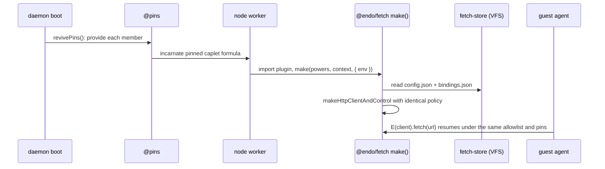

# `@endo/fetch`: A Confined Outbound HTTP Plugin

| | |
|---|---|
| **Created** | 2026-07-13 |
| **Author** | Kris Kowal (prompted) |
| **Status** | Not Started |
| **Supersedes** | [endoclaw-network-fetch](endoclaw-network-fetch.md) (provisioning; the capability shape is landed and carries over) |
| **Parent** | [endoclaw](endoclaw.md) |

## What is the Problem Being Solved?

Agents under SES lockdown have no ambient network access; confined outbound
HTTP is half of the M3 exit criterion ("Agents have scheduled execution and
confined outbound HTTP", [README](README.md) § Milestone 3). The capability
itself landed in PR
[#566](https://github.com/endojs/endo-but-for-bots/pull/566): the
`HttpClient` / `HttpClientControl` facet pair of `@endo/exo-http-client`
(`makeHttpClientAndControl`) over the pure confinement core
`@endo/http-confine` (`makeHttpConfinement`). What never landed is the
**provisioning**: the wiring that mints the pair, persists its policy, hands
the client facet to a guest, and brings the pair back after a daemon restart.

Every prior draft of that wiring is daemon-formula-shaped: the
[endoclaw-network-fetch](endoclaw-network-fetch.md) sketch (2026-03-03), the
`http-controller` / `http-client` formula pair of
[cli-http-client](cli-http-client.md), and the `provideHttpClient` host
method of [daemon-agent-tools](daemon-agent-tools.md) Phase 3.6. The
maintainer's review of PR
[#609](https://github.com/endojs/endo-but-for-bots/pull/609) (2026-07-10)
set a different direction for exactly this kind of feature: a capability
that does not benefit from deep daemon integration becomes an **unconfined
plugin**, persisting through the **virtual file system**, with restart
revival owned **out of band by an integration** (like `@pins`) rather than
by formula machinery. [endo-reminder](endo-reminder.md) (design PR
[#682](https://github.com/endojs/endo-but-for-bots/pull/682), implementation
PR [#721](https://github.com/endojs/endo-but-for-bots/pull/721)) redrafted
the message scheduler on those terms and is the worked precedent.

This design redrafts the outbound-HTTP provisioning on the same terms. The
capability *behavior* is untouched; the packaging, persistence, and revival
story change.

## Design

### What carries over unchanged

The landed `@endo/exo-http-client` surface is normative and this document
does not restate it: the `HttpClient` facet (`fetch(url, options)`,
`allowedOrigins()`, `help()`), the bounded `HttpResponse` remotable, the
`HttpClientControl` facet (`inspect`, the allowlist mutators, the rate and
byte-cap setters, `revoke` / `isRevoked`, the trust-on-first-bind surface
`listBindings` / `revokeBinding` / `unpin` / `setPolicyMode`,
`listAuditEntries`), and the `makeTrustOnFirstBindPolicyAdapter` policy
machine specified by [trust-on-first-bind](trust-on-first-bind.md). So are
the enforcement semantics of `@endo/http-confine`
([http-confine](http-confine.md)): structural origin allowlisting, method
and header validation, rate limiting, manual redirect resolution,
read-time byte caps, and revocation. The controller-versus-client facet
split and its SSRF defenses follow
[cli-http-client](cli-http-client.md), whose analysis remains normative
even though its formula packaging is superseded here (see *What this
supersedes*).

### Package and plugin shape

A new thin package, `packages/fetch`, published as `@endo/fetch`. Like
`@endo/reminder`, it is an **unconfined plugin**: no new formula type, no
`daemon.js` / `host.js` / `interfaces.js` changes, no `extractDeps` case, no
maker-table entry. The plugin module exports the standard unconfined-caplet
maker:

```js
export const make = (powers, context, { env }) => { /* returns the fetch service */ };
```

provisioned by any host through the existing generic pathway:

```
E(host).makeUnconfined(workerName, specifier, { powersName, resultName })
```

where `specifier` resolves to `@endo/fetch`'s plugin module. `make()` reads
the durable policy store, constructs the pair with
`makeHttpClientAndControl` (passing the worker's ambient `fetch` as the
`FetchLike` seam), and returns a `FetchService` exo that hands out the two
facets, mirroring `ReminderService`:

- `client()` — the guest-facing `HttpClient` facet, the only thing a
  confined agent ever holds.
- `control()` — the integration-facing `HttpClientControl` facet, retained
  by whoever provisioned the service.
- `help()`.

The plugin is unconfined because something must hold the real `fetch`
power; the capability it mints is confined. A guest granted `client()` can
reach only allowlisted or pinned origins, under rate and byte caps, and
never sees the plugin, the store, or ambient `fetch`.

### Powers: what the integration grants

`powers` is agent-shaped (typically a dedicated guest). The plugin resolves
everything durable by name through it, the same pathway as
`@endo/reminder`:

1. **Durable store**: `E(powers).lookup('fetch-store')` must resolve to a
   writable virtual-file-system directory (next section).
2. **Policy authority** (optional): `E(powers).lookup('fetch-policy-authority')`
   resolves the referral target for trust-on-first-bind decisions, passed
   through as `makeHttpClientAndControl`'s `policyAuthority`. When the
   lookup fails, the plugin runs without one: `prompt` policy modes are
   unavailable and unknown origins fail closed (strict behavior).
3. **Initial policy**: first-run `allowedOrigins` (comma-separated),
   `maxRequestsPerMinute`, `maxResponseBytes`, and `policyMode` arrive via
   the `env` option of `makeUnconfined`. Thereafter `HttpClientControl`
   adjusts them and the store persists them, so the store — not `env` — is
   authoritative across restarts.

The implementation keeps `makeHttpClientAndControl`'s injectable `fetch`
and `now` seams so tests run against a deterministic clock and a fake
transport, even though the unconfined worker has both ambiently.

### Durable policy on the virtual file system

The store is a writable directory on the platform virtual file system
([platform-fs](platform-fs.md),
[fs-interface-reconciliation](fs-interface-reconciliation.md)), using the
reconciled tree verbs. The plugin never touches `node:fs` and cannot tell
what backs the directory (`makeNodeFilesystem`, `makeInMemoryFilesystem`
in tests, `mountAsFilesystem`, or a database-backed backend):

```
fetch-store/
  config.json      # { allowedOrigins, maxRequestsPerMinute, maxResponseBytes,
                   #   policyMode, revoked } — the PolicyShape fields
  bindings.json    # the trust-on-first-bind binding table: origin ->
                   #   { state, decidedAt, source, note? }
```

Writes are write-then-`move` within the store directory, serialized so
overlapping control operations cannot interleave partial documents; atomic
within-directory `move` is **required of the store backing** as a store
contract, exactly as [endo-reminder](endo-reminder.md) states it (its
design decision 9). Both documents are single files rather than
per-entry directories: the cardinality is one service per guest with tens
of origins and pins, so an O(N) rewrite per policy change costs nothing
(the same cardinality argument as endo-reminder's decision 13).

Not persisted, by design: the sliding rate-limit window (resets on
restart) and the `listAuditEntries` ring buffer (an in-memory
observability convenience with a hard cap; durably logging every request
is a disk-growth hazard and a separate decision an integration can layer
on).

### Persistence seam in `@endo/exo-http-client`

Today `makeHttpClientAndControl` holds policy and bindings only in memory.
The plugin needs two small additions to the package, not a re-implementation:

- an **initial-state** argument: `initialBindings` alongside the existing
  policy constructor arguments, so `make()` can reconstitute the pair with
  identical policy from the store;
- an **on-change** notification: an `onPolicyChange(snapshot)` callback
  invoked after any durable-state mutation — the control-facet mutators
  (`setAllowedOrigins`, `addAllowedOrigin`, `removeAllowedOrigin`,
  `setMaxRequestsPerMinute`, `setMaxResponseBytes`, `setPolicyMode`,
  `revoke`) and every trust-on-first-bind pin, unpin, or binding
  revocation — so the plugin persists exactly when state changes.

The hook is the right seam because trust-on-first-bind pins are made at
request time inside the adapter; no wrapper around the control facet could
observe them. `@endo/exo-http-client` stays platform-pure (the callback is
an ordinary function; the VFS never enters the package), and
`@endo/http-confine` is untouched.

### Wake-on-restart: retention by the integration

Identical to [endo-reminder](endo-reminder.md) § Wake-on-restart, which is
normative here: the integration that provisions the fetch service pins it
(for the reference host, `resultName: ['@pins', 'fetch']` at
`makeUnconfined` time), `revivePins()` provides the identifier at boot, the
worker incarnates the plugin, and `make()` reconstitutes the pair from the
store with identical policy — the restart-reconstitution requirement that
Phase 3.6 assigned to formula machinery, met without it. Retention is
user-driven via the package README for now; the Familiar app and the
online Gateway are candidate future owners. Unpinning decommissions: the
service does not wake next boot, and its store remains until the
integration deletes it. A revoked service revives revoked (`revoked` is a
persisted `config.json` field).



### Granting, and the surviving agent-tool binding

Provisioning binds **one fetch service per guest**, mirroring
endo-reminder's one-scheduler-per-recipient decision: the integration
provisions the service, retains `control()`, and writes `client()` into
the guest's pet store. A second guest gets a second provisioning with its
own store and its own policy; policies never share state.

The second half of [daemon-agent-tools](daemon-agent-tools.md) Phase 3.6
survives unchanged: `makeHttpTool` in `@endo/agent-tools` (a `ToolRecord`
plus hand-authored wire schema and divergence gate, mirroring
`makeGitTool` / `makeShellTool`) binds whatever `HttpClient` the guest was
granted; bounds come entirely from the capability, and the conditional
composition rule holds — the network tool group is absent from the
catalog unless the agent holds the `HttpClient`. Only the provisioning
half of that phase (the daemon formula, the host-owned seam, formula-owned
policy) is superseded by this plugin.

### What this supersedes

- [endoclaw-network-fetch](endoclaw-network-fetch.md): the
  single-`HttpClient`-formula provisioning sketch. Its capability-shape
  and Endo-idiom sections were realized by #566 and remain normative by
  reference; the document is marked superseded.
- [cli-http-client](cli-http-client.md), in part: the `http-controller` /
  `http-client` daemon formula pair and the host `makeHttpClient` mint.
  Its facet split, method placement, SSRF defenses, and
  `cancellation: Promise<never>` analysis carry forward — the facets they
  describe are the ones the plugin provisions — and its `endo http` verb
  tree becomes the eventual user surface below.
- [daemon-agent-tools](daemon-agent-tools.md) Phase 3.6, first work item:
  the reconciliation of PR
  [#286](https://github.com/endojs/endo-but-for-bots/pull/286)'s daemon
  HTTP formula onto the shared core. That reconciliation no longer
  happens: #286's formula shape is superseded outright, and its CLI
  intent survives only as the eventual `endo http` surface. The
  `makeHttpTool` item is retained (previous section).

### Eventual user surface (sketch)

A CLI verb family is a follow-up, sketched so the facets support it by
design: the [cli-http-client](cli-http-client.md) `endo http` tree
(`allow`, `deny`, `set-rate`, `set-bytes`, `revoke`, `inspect`) maps
one-to-one onto `HttpClientControl` methods against a named service, with
`endo http mk` replaced by the generic provisioning recipe
(`makeUnconfined` + pin + grant). As with endo-reminder's CLI sketch, the
follow-up owns service selection and discovery (which named service a verb
routes to); it adds no new confinement capability.

## Dependencies

| Design | Relationship |
|---|---|
| [endoclaw](endoclaw.md) | Parent capability taxonomy |
| [endoclaw-network-fetch](endoclaw-network-fetch.md) | Superseded; its realized capability shape remains normative by reference |
| [http-confine](http-confine.md) | The pure confinement core under the facets; untouched |
| [trust-on-first-bind](trust-on-first-bind.md) | The TOFU policy machine whose pins this plugin makes durable |
| [cli-http-client](cli-http-client.md) | Facet split and defenses carry forward; formula packaging superseded; CLI tree becomes the eventual surface |
| [daemon-agent-tools](daemon-agent-tools.md) | Phase 3.6 provisioning half superseded; `makeHttpTool` half retained |
| [endo-reminder](endo-reminder.md) | The unconfined-plugin precedent this design follows (store contract, revival narrative, one-service-per-guest) |
| [platform-fs](platform-fs.md), [fs-interface-reconciliation](fs-interface-reconciliation.md) | The virtual file system and tree verbs backing the durable store |
| [endoclaw-oauth](endoclaw-oauth.md) | Depends on this design (wraps a granted `HttpClient` with token injection) |

## Implementation Phases

### Phase 1: Package and durable policy (S)

`packages/fetch` with `make(powers, context, { env })`, the VFS store
(`config.json` write-then-`move`, serialized), pair construction over the
existing `makeHttpClientAndControl`, the `FetchService` facet-accessor exo,
and a test suite on `makeInMemoryFilesystem` with injected `fetch` / `now`
seams — including restart reconstitution with identical policy and
revive-as-revoked.

### Phase 2: Trust-on-first-bind durability (S)

The `initialBindings` + `onPolicyChange` seam in `@endo/exo-http-client`,
the `fetch-policy-authority` powers lookup, and `bindings.json`
persistence, so a pin made in a `prompt` mode survives restart and remains
inspectable and revocable through `listBindings` / `revokeBinding`.

### Phase 3: Integration, revival, and the tool binding (S)

The pinning and granting recipe in the package README, one worked
integration demonstrating restart-survival end to end, and `makeHttpTool`
in `@endo/agent-tools` bound to the granted client — together
demonstrating the M3 "confined outbound HTTP" exit criterion.

## Design Decisions

1. **Unconfined plugin, not a formula.** The PR #609 review direction,
   applied to this capability as it was to the message scheduler; the
   feature gains nothing from formula integration. Consequences match
   endo-reminder decision 2: no GC edges, lifecycle is pin/unpin, policy
   lives in the durable store.
2. **The plugin is unconfined; the granted capability is confined.** The
   guest holds only the `HttpClient` facet; ambient `fetch`, the store,
   and the control facet never reach it. "Confined outbound HTTP" names
   what the guest gets, not where the plugin runs.
3. **Provisioning-only package; #566 is not re-implemented.** The plugin
   composes `makeHttpClientAndControl`; `@endo/http-confine` is untouched;
   the only capability-package change is the persistence seam (decision 4).
4. **The persistence seam is initial-state plus an on-change callback in
   `@endo/exo-http-client`.** Trust-on-first-bind pins happen at request
   time inside the adapter, where no control-facet wrapper can see them;
   the callback is the one seam that observes every durable mutation while
   keeping the package platform-pure. Considered and rejected: persisting
   from a wrapper around the control facet. Reason: misses request-time
   pins.
5. **Durable policy on the VFS, backing-agnostic, write-then-`move`.** The
   same store contract as endo-reminder decision 9, stated as an
   obligation of the backing.
6. **Single-document `config.json` and `bindings.json`, serialized
   writes.** One service per guest, tens of entries; per-entry files and
   indexes buy nothing at this cardinality (endo-reminder decision 13's
   argument).
7. **Revival is integration-owned retention via `@pins`, user-driven for
   now.** Endo-reminder decisions 4 and 10 apply verbatim; the README
   carries the recipe, and the Familiar app / online Gateway are candidate
   future owners.
8. **One fetch service per guest.** Mirrors one-scheduler-per-recipient;
   policy is per-guest by construction and a grant is never shared through
   a common allowlist.
9. **Revocation is durable and permanent; the rate window and audit ring
   are ephemeral.** `revoked` persists and a revived service stays
   revoked. The rate window resetting on restart is at worst briefly
   generous; the audit ring is bounded observability, not a durable log.
10. **Package name `@endo/fetch`, no `exo-` prefix.** The package's
    primary export is the plugin `make()`; the CapTP-surfaced facets live
    in `@endo/exo-http-client` already. Endo-reminder decision 7's
    no-prefix rationale applies; the name states what the guest gets.
    Maintainer confirmation flagged in Open Questions.
11. **Considered and rejected: keeping the daemon-formula provisioning**
    (endoclaw-network-fetch's sketch, cli-http-client's formula pair,
    Phase 3.6's `provideHttpClient`, #286's formula). Reason: the PR #609
    review direction and the endo-reminder precedent.
12. **Considered and rejected: a plugin entry point inside
    `@endo/exo-http-client` instead of a new package.** Reason: it drags
    provisioning, VFS-store, and powers-lookup concerns into a pure facet
    package; `packages/reminder` set the thin-plugin-package precedent.

## Open Questions

1. Is `@endo/fetch` the maintainer's chosen name? Alternatives:
   `@endo/confined-fetch`; or no new package, a plugin module under
   `@endo/exo-http-client` (rejected as decision 12 but cheap to revisit).
2. Should the policy authority be re-resolved through `powers` at each
   referral rather than once at `make()`, so an integration can swap the
   prompt target without re-provisioning? Once-at-`make()` mirrors
   endo-reminder's recipient resolution and is the default here.

## Prompt

> Designer job on endojs/endo-but-for-bots: redraft the
> `endoclaw-network-fetch` design (M3 "confined outbound HTTP"
> exit-criterion capability, currently carrying a stale 2026-03-03
> daemon-formula shape) as an `@endo` confined-fetch plugin aligned with
> the just-landed `@endo/reminder` message-scheduler pattern (design PR
> #682, implementation PR #721), so the outbound-HTTP capability follows
> the maintainer's unconfined-plugin direction rather than the superseded
> daemon-formula approach.

The unconfined-plugin direction originates in the maintainer's review of
PR [#609](https://github.com/endojs/endo-but-for-bots/pull/609)
(2026-07-10), quoted in full in [endo-reminder](endo-reminder.md) § Prompt:
"this particular feature does not particularly benefit from deep
integration into the daemon and could be an unconfined plugin, using the
virtual file system for durable tracking", with revival "handled out of
band by a particular integration (like the Familiar app or online Gateway)
with less coupling to the lowest parts."
