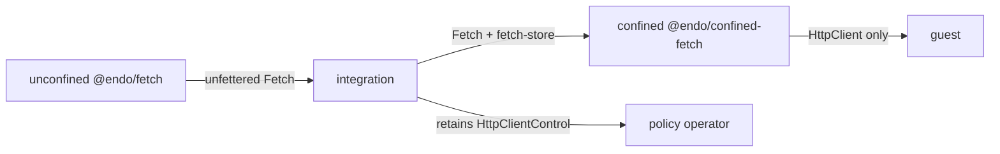

# `@endo/fetch` and `@endo/confined-fetch`: Outbound HTTP Plugins

| | |
|---|---|
| **Created** | 2026-07-13 |
| **Updated** | 2026-07-15 |
| **Author** | Kris Kowal (prompted) |
| **Status** | Not Started |
| **Supersedes** | [endoclaw-network-fetch](endoclaw-network-fetch.md) (provisioning; the capability shape is landed and carries over) |
| **Parent** | [endoclaw](endoclaw.md) |

## What is the Problem Being Solved?

Agents under SES lockdown have no ambient network access. Confined outbound
HTTP is half of the M3 exit criterion: "Agents have scheduled execution and
confined outbound HTTP" ([README](README.md) § Milestone 3). The capability
itself landed in PR [#566](https://github.com/endojs/endo-but-for-bots/pull/566):
the `HttpClient` / `HttpClientControl` facet pair of `@endo/exo-http-client`
over the pure confinement core `@endo/http-confine`.

What never landed is provisioning, policy persistence, and revival. Earlier
drafts put that work in daemon formulas. The maintainer's PR #609 direction is
to use unconfined plugins and the virtual file system for durable tracking.
The review of this design adds an important attenuation boundary: the direct,
unfettered HTTP capability must be separate from the confined capability. A
confined plugin receives that base capability and a state directory as its
endowments. It does not acquire ambient network access merely by existing.

## Design

### Two plugins and an explicit attenuation boundary

The design has two thin packages.

- `@endo/fetch` is an **unconfined base plugin**. Its `make()` receives the
  worker's ambient `fetch` and returns a `Fetch` capability with
  `fetch(url, options)`. This capability is intentionally unfettered: it makes
  no allowlist, policy, persistence, or revival decisions. An integration
  retains it and treats granting it as granting direct HTTP authority.
- `@endo/confined-fetch` is a **confined plugin**. Its `make()` is endowed with
  the base `Fetch` capability and a writable state directory. It constructs
  `HttpClient` / `HttpClientControl` over the endowed base, never over ambient
  `fetch`, and returns a `ConfinedFetchService` that exposes `client()`,
  `control()`, and `help()`.

The base package is the sole bridge from an unconfined worker to real network
access. The confined package is useful only when an integration intentionally
endows both the base capability and its private state directory. A guest gets
only `client()`. It never receives the base `Fetch`, the directory, or the
control facet.



### Base plugin

`@endo/fetch` exports the standard unconfined-caplet maker:

```js
export const make = (powers, context, { env }) => { /* returns Fetch */ };
```

It adapts the unconfined worker's ambient `fetch` into a passable `Fetch`
service. `powers`, `context`, and `env` are accepted for the normal plugin
shape but do not supply policy or storage. The package is deliberately small:
it has no dependency on `@endo/http-confine`, the virtual file system, or the
policy machinery. Its tests use an injected transport seam instead of a live
network.

### Confined plugin endowments

`@endo/confined-fetch` exports a confined-caplet maker. Its powers resolve:

1. `fetch`: the base `Fetch` capability supplied by an integration. This is
   the only transport used to construct `makeHttpClientAndControl`.
2. `fetch-store`: a writable virtual-file-system directory, private to this
   confined service.
3. `fetch-policy-authority` (optional): the referral target for
   trust-on-first-bind decisions. Without it, prompt modes are unavailable and
   unknown origins fail closed.

Initial `allowedOrigins`, `maxRequestsPerMinute`, `maxResponseBytes`, and
`policyMode` arrive through `env` only on first provisioning. The directory is
authoritative across restart. The integration provisions one confined service
per guest, retains `control()`, and grants only `client()` to that guest.

### Durable policy on the virtual file system

The private state directory uses the reconciled virtual-file-system tree verbs:

```
fetch-store/
  config.json      # allowedOrigins, maxRequestsPerMinute, maxResponseBytes,
                   # policyMode, revoked
  bindings.json    # origin -> state, decidedAt, source, note?
```

Writes are serialized and use write-then-`move` within the directory. Atomic
within-directory `move` is a required backing contract, as in
[endo-reminder](endo-reminder.md). The rate-limit window and audit ring remain
ephemeral. They are bounded operational state, not durable policy.

`@endo/exo-http-client` needs an `initialBindings` input and an
`onPolicyChange(snapshot)` callback. The callback runs after every durable
mutation, including a request-time trust-on-first-bind pin, so the confined
plugin can persist a complete snapshot without putting VFS code in the pure
capability package. `@endo/http-confine` remains untouched.

### Revival and agent-tool binding

The integration owns both retention and re-endowment. It pins the confined
service under `@pins`, restores the base `Fetch` plus the same `fetch-store`
at boot, and lets `revivePins()` re-incarnate the confined plugin. A revoked
service therefore revives revoked. The package README carries this recipe;
Familiar and the online Gateway are candidate owners.

`makeHttpTool` remains in [daemon-agent-tools](daemon-agent-tools.md) Phase
3.6. It binds the `HttpClient` granted to a guest. The tool does not choose a
transport or policy and therefore never needs the unfettered base capability.

### What this supersedes

[endoclaw-network-fetch](endoclaw-network-fetch.md)'s daemon provisioning,
[cli-http-client](cli-http-client.md)'s formula packaging, and the
`provideHttpClient` half of [daemon-agent-tools](daemon-agent-tools.md) Phase
3.6 are superseded. Their landed facet split, SSRF defenses, and eventual CLI
surface remain normative where referenced.

## Dependencies

| Design | Relationship |
|---|---|
| [http-confine](http-confine.md) | Pure confinement core under the facets |
| [trust-on-first-bind](trust-on-first-bind.md) | Policy machine whose bindings the confined plugin persists |
| [endo-reminder](endo-reminder.md) | Precedent for VFS state and integration-owned revival |
| [platform-fs](platform-fs.md), [fs-interface-reconciliation](fs-interface-reconciliation.md) | State-directory API and tree verbs |
| [daemon-agent-tools](daemon-agent-tools.md) | `makeHttpTool` consumes the granted confined client |
| [endoclaw-oauth](endoclaw-oauth.md) | Consumes a granted `HttpClient`, never the base `Fetch` |

## Implementation Phases

### Phase 1: Base and confined plugin boundary (S)

Add `packages/fetch` (`@endo/fetch`) as the unconfined adapter over ambient
`fetch`, with a deterministic transport seam. Add `packages/confined-fetch`
(`@endo/confined-fetch`) that requires an endowed base `Fetch` and
`fetch-store`, constructs the existing client/control pair over that base, and
returns `ConfinedFetchService`. Tests prove the confined package cannot fetch
without the endowed base and that a guest receives only `HttpClient`.

### Phase 2: Durable policy and TOFU bindings (S)

Add serialized `config.json` / `bindings.json` persistence in the confined
package. Add `initialBindings` and `onPolicyChange` to
`@endo/exo-http-client`. Tests prove restart reconstitution, durable
revocation, and a request-time TOFU pin that survives restart and remains
revocable.

### Phase 3: Integration, revival, and tool binding (S)

Document provisioning that retains the base capability privately, endows the
confined plugin with it plus a state directory, pins the confined service, and
grants only its client facet. Exercise the restart path end to end on an
in-memory filesystem. Implement `makeHttpTool` separately in
`daemon-agent-tools` Phase 3.6 against the granted client.

## Design Decisions

1. **Two plugins, not one.** The base unconfined plugin provides explicit
   unfettered HTTP authority. The confined plugin receives that authority only
   as an endowment plus a state directory.
2. **The base capability is never guest-facing.** Giving it to a guest would
   bypass allowlisting, caps, revocation, and trust-on-first-bind policy.
3. **State belongs to the confined service.** The base plugin is stateless;
   policy and bindings are private to one guest's confined service.
4. **Persist through an `@endo/exo-http-client` callback.** A control wrapper
   cannot observe request-time pins.
5. **Revival is integration-owned.** The integration is responsible for
   restoring both required endowments before reviving the confined service.

## Alignment for Implementation PR #723

PR [#723](https://github.com/endojs/endo-but-for-bots/pull/723) currently
implements the earlier single-plugin shape. It must be revised in its own PR
to split `@endo/fetch` into the unconfined base adapter and
`@endo/confined-fetch` into the stateful confined plugin, with tests for the
explicit base-plus-directory endowment boundary. This design change does not
modify #723.

## Prompt

> Divide the capability into a base, unconfined plugin that provides
> unfettered HTTP access and a confined plugin endowed with that base plus a
> state directory.
