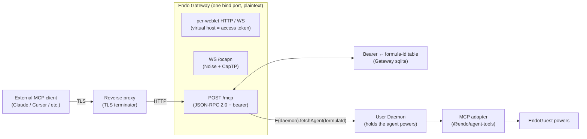

# Endo Gateway: Model Context Protocol Termination

| | |
|---|---|
| **Created** | 2026-05-29 |
| **Updated** | 2026-05-29 |
| **Author** | kriscendobot (prompted) |
| **Status** | Not Started |

## What is the Problem Being Solved?

The Endo Gateway, as proposed in [endo-gateway](endo-gateway.md), is the
per-host system service that owns the host's external HTTP and WebSocket
surface and relays into per-user Daemons by Ed25519 public key.
Today the Gateway terminates exactly one application protocol on that
surface: OCapN, at the well-known WebSocket path `/ocapn`, with
session-level confidentiality and authentication provided by the Noise
netlayer.

External AI tooling (Claude, Cursor, OpenAI-compatible clients) does not
speak OCapN.
It speaks the Model Context Protocol (MCP),
a JSON-RPC 2.0 dialect carried over either stdio or a streamable HTTP /
SSE transport.
To let an external MCP client drive an Endo agent (call its tools, read
its resources) the Gateway needs a **second** termination surface
alongside the OCapN one: an MCP JSON-RPC endpoint that authenticates the
caller by bearer token, resolves the token to a specific Endo agent's
formula identifier, and exposes the tools that agent's Lal-style harness
already provides as MCP tools.

The TLS-proxy assumption from [endo-gateway](endo-gateway.md) carries
over to this new surface unchanged: the Gateway speaks plaintext HTTP and
the operator runs a TLS terminator (Caddy, nginx, Traefik) in front of
it.
Confidentiality of the bearer token on the wire is the proxy's
responsibility, not the Gateway's, exactly as today for the Chat
browser-facing path.

This design proposes the MCP termination, the bearer-to-formula
indirection, the tool surface, and the auxiliary Chat-side UI for
creating agents and retrieving their MCP configuration block.

## Background

Three pieces of prior art frame the design.

**Endo Gateway.**
[endo-gateway](endo-gateway.md) (Proposed) lifts host-scope HTTP and
WebSocket out of the per-user Daemon into a system service.
The Gateway terminates two protocols today on its plaintext bind port:
per-weblet HTTP / WebSocket on virtual hosts derived from a weblet's
access token, and a single canonical OCapN endpoint at `/ocapn`.
The Gateway explicitly **does not** terminate TLS: OCapN's
confidentiality is provided in-band by Noise, and operators who want
browser-facing TLS run a reverse proxy.
The MCP endpoint this design adds is a third application protocol on
the same bind port, behind the same reverse-proxy TLS assumption.
It is **not** OCapN: it is JSON-RPC, and TLS is the only thing standing
between the bearer token and the network.

**Bearer-token / agent-id auth.**
[gateway-bearer-token-auth](gateway-bearer-token-auth.md) (Implemented)
already establishes the shape: the agent's 256-bit formula identifier
(64 hex characters) **is** the bearer token, presented over an
already-encrypted (by reverse-proxy TLS) channel, with per-IP rate
limiting on failed authentications.
The MCP bearer in this design is identical in shape to the existing
Chat-fetch bearer: the same 256-bit formula identifier, the same
brute-force resistance argument, the same TLS-warning at startup if
remote mode is on.
This design **does not** introduce a separate credential type; reusing
the formula id keeps the authorization model uniform and avoids a
second credential rotation story.

**Lal-style tool harness.**
`packages/lal/agent.js` defines a static array of OpenAI function-calling
tool schemas (`help`, `list`, `lookup`, `send`, `evaluate`,
`inspectCapability`, etc.) and a `switch`-based dispatcher that resolves
each call to an `E(powers).<method>(...)` against an `EndoGuest`.
[LAL-ARCHITECTURE.md](../packages/lal/LAL-ARCHITECTURE.md) names this the
"static tool set" pattern: tool definitions, the SmallCaps argument
decoder, and the executor live alongside the agentic message-following
loop in the same file.
The tools are bound to `powers` (an `EndoGuest`) at `make()` time, and
the loop calls `provider.chat(transcript, tools)` with the OpenAI-shaped
schema array.

**Daemon Agent Tools.**
[daemon-agent-tools](daemon-agent-tools.md) (Not Started) proposes a
second, capability-scoped tool surface (`Dir` / `Shell` / `Git`) bound
to capabilities the agent holds in its namespace.
That surface is orthogonal to the namespace / mail tools Lal exposes
today: it depends on the filesystem and capability-bank designs landing
first.
The MCP termination here exposes **the Lal harness's current static
tools** (the namespace / mail / evaluate surface), not the capability-
scoped tools, because the latter are not implemented yet.
The relationship is recorded in Open Questions §1 so a future revision
adds the capability-scoped tools to the MCP catalog as they land.

## Architectural Shape

A new `/mcp` endpoint sits on the Gateway's bind port alongside the
existing `/ocapn` endpoint and the per-virtual-host weblet paths.



The bind port is shared with the existing endpoints; the demultiplex is
by HTTP path on `Host: <gateway-host>` (no virtual host).
`/ocapn` and `/mcp` are sibling well-known paths on the host's bare
name; the per-weblet paths live on virtual-host subdomains as they do
today.

The Gateway's job on the MCP path is narrow:

1. Accept a plaintext HTTP POST (or SSE GET for streaming responses) at
   `/mcp`.
2. Read the `Authorization: Bearer <hex>` header, validate it as a
   64-character hex formula id, look it up in the bearer-token table,
   and refuse with 401 if absent (advancing the failed-auth rate
   limiter from [gateway-bearer-token-auth](gateway-bearer-token-auth.md)).
3. Resolve the formula id to the User Daemon that owns it via the
   registration table from [endo-gateway](endo-gateway.md), then call
   `E(userDaemon).fetchAgent(formulaId)` to obtain the agent's
   `EndoGuest` powers.
4. Hand the JSON-RPC request to the MCP adapter bound to those powers,
   wait for the adapter's reply, and write it back as the HTTP response.

The Gateway holds no LLM, no transcript, no tools.
The tools are provided by the MCP adapter that wraps the agent's
`EndoGuest`, and the adapter is what produces a JSON-RPC response from
a JSON-RPC request.

## MCP Wire Shape and Transport

MCP defines two transports.
The Gateway terminates the HTTP-based one
("streamable HTTP", post-March-2025 MCP spec): a single HTTP endpoint
that accepts JSON-RPC requests via POST and streams responses
(notifications and long-running results) via Server-Sent Events on the
same path.
The stdio transport is not in scope; MCP clients that want stdio still
run a local subprocess, and that subprocess can be a thin Endo CLI
shim that itself opens an OCapN connection or a `/mcp` HTTP connection.

The endpoint is `POST /mcp` for client-to-server requests and
`GET /mcp` (with `Accept: text/event-stream`) for the server-to-client
event stream.
JSON-RPC framing follows MCP spec verbatim; the Gateway does not
inspect the payload beyond what it needs to route, with the deliberate
exception of the `initialize` handshake (see *Initialize* below).

### Authentication

Every request carries:

```
Authorization: Bearer <64-char-hex>
```

The bearer is the 64-character hex formula identifier of the target
Endo agent, exactly as in
[gateway-bearer-token-auth](gateway-bearer-token-auth.md).
The Gateway:

1. Hex-validates the bearer (64 lowercase hex chars).
2. Looks up the formula id in its bearer-token table, which is itself
   populated by the per-user Daemon at registration time (`E(registration)
   .publishAgent({ formulaId, agentExo })`, a new method paralleling
   `publishWeblet`).
3. On hit, the table yields the User Daemon handle plus an `agentExo`
   that exposes the agent's MCP adapter.
4. On miss, returns 401, advancing the per-IP rate limiter.
5. Logs nothing about which formula ids exist; a miss is
   indistinguishable from a never-registered id.

The bearer-token table is **persistent** at the Gateway (sqlite,
alongside the existing weblet-formula table) so that an MCP client's
configured connection survives a User Daemon restart: when the User
Daemon re-registers, it re-publishes the same agent under the same
formula id.

### Initialize

MCP's `initialize` method advertises server capabilities and protocol
version.
The Gateway's adapter answers with:

```json
{
  "protocolVersion": "2025-03-26",
  "capabilities": {
    "tools": { "listChanged": false },
    "logging": {}
  },
  "serverInfo": {
    "name": "endo-gateway",
    "version": "<gateway-build>"
  }
}
```

`tools.listChanged: false` reflects Lal's static tool set: the tool
catalog does not change at runtime for a given agent.
Logging is advertised so the adapter can ship `console.error`-shaped
diagnostics back over `notifications/message`.

`resources` and `prompts` capabilities are deliberately omitted; both
are MCP-side surfaces the Endo agent does not currently model.
Adding them is in scope of a future revision (see Open Questions §2).

### Tool catalog

`tools/list` returns the same OpenAI-format schemas Lal builds today,
trivially translated to MCP's `Tool` shape (`name`, `description`,
`inputSchema` instead of `function.parameters`).
The translation is a one-line projection per tool and happens in the
MCP adapter, not the Gateway:

```ts
const mcpTool = (lalTool) => ({
  name: lalTool.function.name,
  description: lalTool.function.description,
  inputSchema: lalTool.function.parameters,
});
```

`tools/call` dispatches to the same `executeTool(name, args)` switch
that lives in `packages/lal/agent.js` today.
The result is wrapped in MCP's `content: [{ type: 'text', text: ... }]`
shape; `passableAsJustin` from `@endo/marshal` renders the result for
the text body, matching how Lal already formats tool results into its
transcript.

### Streaming, cancellation, and concurrency

The streamable-HTTP transport supports streaming responses for long-
running tool calls; the MCP adapter signals progress via
`notifications/progress` on the SSE stream tied to the bearer-token
session.

Concurrent `tools/call` requests on the same bearer are accepted; the
underlying `EndoGuest` already handles concurrent eventual-sends, and
each MCP request maps one-to-one onto one `E(powers).<method>(...)`
call (or, for `evaluate`, one `E(powers).evaluate(...)` call).
There is no per-bearer queueing in the Gateway.

Cancellation via MCP's `notifications/cancelled` is forwarded to the
adapter, which calls the cancel API on the underlying eventual-send
(the daemon already exposes a `cancel` channel for outstanding sends;
the adapter wires it through).

## The MCP Adapter (Refactor vs. Export Recommendation)

The MCP adapter is the piece that takes a JSON-RPC `tools/call` and
turns it into an `E(powers).<method>(...)` invocation.
Today the equivalent lives inside `packages/lal/agent.js` as:

- The static `tools` array (lines defining the OpenAI tool schemas).
- The `decodeSmallcaps` helper.
- The `executeTool(name, args)` switch.
- The `processToolCalls` glue that runs `executeTool` for each tool
  call and wraps the result.

None of these depend on the LLM provider, the transcript, the agentic
loop, or the message-following loop.
They depend on `@endo/eventual-send`, `@endo/marshal`, and an
`EndoGuest`.
The MCP termination needs exactly these four pieces, bound to a fresh
`EndoGuest` per bearer and emitted as JSON-RPC instead of as
chat-completion responses.

### Design Decisions

#### Recommendation: refactor Lal to extract `@endo/agent-tools`.

**Recommendation: option (a).
Extract the tool catalog, the SmallCaps decoder, and the
`executeTool` switch from `packages/lal/agent.js` into a new
`packages/agent-tools/` package that exports a single
`makeAgentTools(powers)` factory returning `{ tools, executeTool,
processToolCalls }`.
The Gateway's MCP adapter consumes this package directly; Lal
consumes it in place of the inline definitions it has today.**

The trade-off is between the cost of a refactor (touching Lal's most
load-bearing file, opening a build PR that must keep Lal's existing
tests green) and the durability and correctness of the result.

Three forces tilt toward extraction.

The tool surface is **already a separable thing** in the architecture
of [LAL-ARCHITECTURE.md](../packages/lal/LAL-ARCHITECTURE.md): tools,
dispatcher, and SmallCaps decoder are independent of the agentic loop
that sits above them.
[daemon-agent-tools](daemon-agent-tools.md) names exactly the same
shape ("each agent receives a `Dir` ... and registers tools that
delegate to its methods") and describes both Lal and Fae as consumers.
The repeated phrase "an agent's tool set is determined by the
capabilities granted to it" only types-as-true once the tool catalog
is a parameterized package, not an inline switch.

The MCP termination needs to bind tools to an `EndoGuest` that is not
the agent's *own* powers.
The Gateway's MCP adapter binds to whatever `EndoGuest` the bearer
resolves to, and a given Gateway may have many bound adapters live
concurrently (one per active MCP session).
An exported API from `packages/lal` proper (option b) would either
spin up a full Lal agent (which is wrong: there is no LLM at the
Gateway, no transcript, no message-following loop) or expose
`executeTool` as a top-level export of the `lal` package and ask
Gateway consumers to import it from inside an LLM-agent package.
The latter is workable but couples the Gateway's dependency graph to
`@endo/lal` for what is really a `@endo/eventual-send`-shaped concern.

Fae uses dynamic tool discovery on top of the same shape per
[daemon-agent-tools](daemon-agent-tools.md) §"Agent tool discovery";
extracting the registration mechanism into a shared package gives Fae
a clean place to plug capability-scoped tools without re-inventing the
SmallCaps decoder or the `processToolCalls` glue.

The fourth force, weakly, is upstream taste: the project has a
standing preference for narrow packages with explicit exports
(`@endo/bytes`, `@endo/hex`, the in-progress `@endo/hex-test` cut from
PR #211).
An `@endo/agent-tools` package with one factory and three exports
fits that grain.

The cost is real but bounded.
Lal's tests cover `executeTool` via the simulator harness
(`packages/lal/test/simulator/`) and via the unit tests for tool
extraction; the refactor moves the implementation but preserves the
shape, so the test surface migrates as-is or, where it makes sense,
moves into the new package's own test directory.

**Considered and rejected: option (b): keep tools in Lal proper and
add an exported API the Gateway calls.
Reason: the Gateway is not an LLM-agent consumer, and an `@endo/lal`
import for what is fundamentally an `EndoGuest`-binding concern
couples the Gateway's dependency graph to the LLM provider system it
has no use for.**

### Package shape

```
packages/agent-tools/
├── package.json         # @endo/agent-tools, exports: makeAgentTools
├── index.js             # makeAgentTools(powers, { extra? }) factory
├── tool-schemas.js      # the OpenAI-format schema array (extracted from lal/agent.js)
├── execute.js           # executeTool(powers, name, args) switch (extracted)
├── smallcaps.js         # decodeSmallcaps helper (extracted)
├── process.js           # processToolCalls(powers, calls) glue (extracted)
├── README.md
└── test/
    └── execute.test.js  # the simulator-style coverage that lives in lal today
```

The `makeAgentTools(powers, { extra } = {})` factory returns:

```ts
{
  /** OpenAI-format tool schemas (also valid as MCP inputSchema after the projection above). */
  tools: ReadonlyArray<Tool>;
  /** Execute one named tool by name + args; returns the raw result. */
  executeTool: (name: string, args: object) => Promise<unknown>;
  /** Execute an array of tool calls; returns OpenAI-shaped tool-result records. */
  processToolCalls: (calls: ToolCall[]) => Promise<ToolResult[]>;
}
```

The `extra` option is the seam for [daemon-agent-tools](daemon-agent-tools.md)'s
capability-scoped tools: as `Dir` / `Shell` / `Git` come online,
callers compose them in:

```js
const { tools, executeTool } = makeAgentTools(powers, {
  extra: [makeDirTools(dir), makeShellTools(shell), makeGitTools(git)],
});
```

The Lal refactor replaces the inline `tools` / `executeTool` /
`processToolCalls` with a call to `makeAgentTools(powers)` at
`make()` time, preserving exactly today's behavior.

### Gateway-side MCP adapter

```
packages/daemon/src/gateway-mcp.js
```

A new module that:

- Routes POST `/mcp` and GET `/mcp` requests.
- Validates the bearer and resolves it via the registration table.
- Calls `makeAgentTools(powers)` against the resolved guest's powers.
- Translates JSON-RPC `initialize` / `tools/list` / `tools/call` to
  the corresponding `@endo/agent-tools` calls, wraps results in MCP
  content blocks, and writes the SSE stream.
- Handles the per-IP rate limiter on auth failures, reusing the
  limiter from `web-server-node.js` rather than spinning up a second.

`gateway-mcp.js` lives in `packages/daemon` because that is where the
Gateway and the per-user Daemon already live (the Gateway and Daemon
are two modes of the same binary, per
[endo-gateway](endo-gateway.md)).

## Chat-side UI: create-agent and MCP-config retrieval

The Chat web interface needs two new affordances.
Both are surfaces on the existing Chat app
([chat-components](chat-components.md), [chat-spaces-home](chat-spaces-home.md)),
not new weblets.

### Affordance 1: create an agent

The Lal manager already drives agent creation via a configuration form
([lal-fae-form-provisioning](lal-fae-form-provisioning.md), §"Form
Fields": name, host, model, authToken).
The Chat UI already renders that form when it appears in the @host
inbox.
The new affordance is **discoverability**: a "+ Add agent" button on
Chat's spaces gutter ([chat-spaces-gutter](chat-spaces-gutter.md)) that,
on click:

1. Looks up `@lal` (or `@fae`) in the host's namespace.
2. If not present, triggers the setup script (this is the same path the
   CLI takes today; the renderer reuses it).
3. If present, surfaces the manager's outstanding configuration form
   directly in the spaces-home view, anchored to a "create another
   agent" CTA rather than waiting for the user to find it in the inbox.

No new daemon-side wire is needed: the Chat UI already knows how to
render forms, and `lal-fae-form-provisioning` already supports repeated
submission.
The change is UI-side: a button, a route to the existing form, and a
"created" confirmation toast.

### Affordance 2: retrieve the MCP configuration block

A new "MCP" tab on each agent's space-home view that shows:

```jsonc
// Paste into your MCP client's config (Claude Desktop, etc.):
{
  "mcpServers": {
    "<agent-pet-name>": {
      "url": "https://<gateway-host>/mcp",
      "headers": {
        "Authorization": "Bearer <64-char-formula-id>"
      }
    }
  }
}
```

The agent's formula id is the existing 256-bit hex string the agent
already carries
([gateway-bearer-token-auth](gateway-bearer-token-auth.md)), so no new
identifier is minted.
The Chat UI looks the id up via `E(powers).identify(petName)`, the
same call Chat already uses elsewhere.

A "Copy" button copies the JSON block.
A "Rotate" button is deferred: rotation is the cross-cutting open
question in [endo-gateway](endo-gateway.md) §Open Questions §1 (the
Pass-Invariant-Eq problem), and this design does not introduce a new
rotation mechanism.
A warning is shown next to the block:
"This token is the agent's full authority. Treat it like an SSH key."

### Decision: same design, two sections; no sibling design

The Chat-side surfaces are small (one button, one tab, one JSON
template), and they sit on top of mechanisms already designed elsewhere
(`lal-fae-form-provisioning`, the formula-id-as-token from
`gateway-bearer-token-auth`).
Splitting them into a sibling design would duplicate the cross-link
budget without adding clarity.
They live as a section here; if either grows beyond a screen, the
designer at that future point splits.

## Phased Implementation

### Phase 1: extract `@endo/agent-tools`

Refactor `packages/lal/agent.js`: move `tools`, `decodeSmallcaps`,
`executeTool`, `processToolCalls` into a new `packages/agent-tools/`
package.
Lal imports from `@endo/agent-tools` and otherwise behaves exactly as
before.
The Lal simulator tests stay green; the new package picks up its own
focused unit tests for `executeTool`.

### Phase 2: bearer-token table + agent publishing

Extend `Registration` (from [endo-gateway](endo-gateway.md) §Registration
Protocol) with `publishAgent({ formulaId, agentExo })` /
`unpublishAgent(formulaId)`.
The Gateway persists the published agents in its sqlite store next to
the weblet table.
The per-user Daemon publishes every agent it owns: the bearer is the
agent's 256-bit formula identifier, knowledge of the bearer **is** the
authorization (see Design Decision §3, *Capability discipline*), and
a per-agent opt-in toggle would only obscure the actual policy.
`unpublishAgent` exists for the agent-deletion path, not for "hide from
MCP while keeping the agent alive".

### Phase 3: MCP adapter and `/mcp` endpoint

Add `packages/daemon/src/gateway-mcp.js` and wire it into the
Gateway's HTTP router on `/mcp`.
Implement the JSON-RPC initialize / tools/list / tools/call surface
and the SSE event stream.
Reuse the per-IP rate limiter from `web-server-node.js`.
Add `packages/daemon/test/gateway-mcp.test.js`, `test.serial` per the
gateway-test convention, exercising auth failure, tool listing, a
simple tool call, and a streaming tool call.

### Phase 4: Chat-side UI

Add the "+ Add agent" button on the spaces gutter and the "MCP" tab
on the space-home view.
Add a Playwright smoke test alongside `chat-playwright-smoke`'s
existing ones.

## Dependencies

| Design | Relationship |
|--------|--------------|
| [endo-gateway](endo-gateway.md) | The Gateway this design adds an endpoint to. The MCP termination is a third application protocol on the same bind port; the TLS-proxy assumption from `endo-gateway` carries over. |
| [gateway-bearer-token-auth](gateway-bearer-token-auth.md) | The bearer is the 256-bit hex formula identifier from this design, applied to the new `/mcp` surface. Per-IP rate limiter is reused. |
| [daemon-agent-tools](daemon-agent-tools.md) | Capability-scoped tools (`Dir` / `Shell` / `Git`) compose into `makeAgentTools` via the `extra` option as they land. Out of scope for the initial MCP catalog. |
| [lal-fae-form-provisioning](lal-fae-form-provisioning.md) | The Chat "+ Add agent" affordance routes to the existing manager configuration form. |
| [chat-components](chat-components.md), [chat-spaces-gutter](chat-spaces-gutter.md), [chat-spaces-home](chat-spaces-home.md) | Hosting surfaces for the two Chat-side affordances. |
| [daemon-web-gateway](daemon-web-gateway.md) | The Gateway's HTTP routing layer the new `/mcp` route attaches to. |

## Design Decisions

1. **Refactor Lal to extract `@endo/agent-tools` (above).**
   See §"The MCP Adapter (Refactor vs. Export Recommendation)" for
   the full trade-off.

2. **Bearer is the formula identifier verbatim.**
   The MCP bearer is identical in shape to the
   [gateway-bearer-token-auth](gateway-bearer-token-auth.md) bearer:
   64-character lowercase hex of the agent's formula id.
   No derivation, no per-client subkey, no expiry.
   Reusing the existing credential keeps the authorization model
   uniform; a derived credential would need its own revocation story
   that the formula-id model does not need (the agent itself is
   revoked by deletion, which the Gateway notices on the next
   registration update).

3. **Capability discipline: knowledge of the bearer is the
   authorization; no expose toggle.**
   Consistent with object-capability discipline, if a caller knows the
   secret (the agent's formula identifier) they can send messages to
   the agent.
   The Gateway does not gate exposure behind a per-agent "Expose to
   MCP" toggle: a toggle would split the agent's authority model into
   two ("the bearer authorizes" vs. "the bearer authorizes only if the
   toggle is on"), which contradicts the object-capability invariant
   that holding the reference is the right to invoke.
   The user-facing affordance the design owes is therefore not a
   visibility switch but a way to **obtain** the bearer token for an
   agent the user already owns; that affordance is the "MCP" tab
   described in §"Affordance 2: retrieve the MCP configuration block"
   (the JSON snippet plus Copy button).
   Operationally: every agent the per-user Daemon owns is published to
   the Gateway's bearer table at registration time; deleting the agent
   unpublishes it.
   There is no intermediate state where the agent exists but is
   "hidden from MCP".

4. **MCP catalog is "everything Lal sees today."**
   The initial MCP tool catalog is the static Lal tool set, projected
   from OpenAI schemas to MCP `Tool` shape.
   Capability-scoped tools from
   [daemon-agent-tools](daemon-agent-tools.md) compose in via the
   `extra` option as they land; this design does not block on them.

5. **No TLS, no certificate, no rotation.**
   The Gateway speaks plaintext on the `/mcp` path exactly as it does
   on `/ocapn` and the per-weblet paths.
   TLS is the reverse proxy's job.
   No certificate management, no ACME, no SNI; the Gateway warns at
   startup if remote mode is on (the existing warning from
   [gateway-bearer-token-auth](gateway-bearer-token-auth.md) suffices,
   widened textually to name the `/mcp` path).

6. **Streamable HTTP only; no stdio.**
   The Gateway terminates the streamable-HTTP MCP transport.
   Clients that need stdio run a local shim subprocess; that shim is
   out of scope here.

7. **Chat UI lives in this design.**
   The "+ Add agent" button and the "MCP" tab are small and
   directly load-bearing; splitting them into a sibling design would
   duplicate cross-link work without clarifying anything.

8. **Per-MCP-session state is not planned.**
   The MCP streamable-HTTP transport supports persistent SSE
   connections keyed by an `Mcp-Session-Id` header.
   The Gateway treats each request as stateless: one bearer resolves
   to one `EndoGuest` powers binding, and no per-session table sits
   between the request and that binding.
   The persistence model the Endo agent already provides is
   capabilities held across sessions (the agent itself persists the
   capabilities it bears); that is the full extent of persistence the
   MCP termination layers in.
   If a future MCP feature requires per-session state
   (long-running notifications, server-initiated tool calls beyond the
   request's SSE lifetime), the Gateway will need a session table;
   that is a separate design, not this one.

9. **Logging today: a structured-logger-shaped `node:console`;
   anylogger when we cross that bridge.**
   MCP's `notifications/message` carries a `level` field
   (debug / info / warning / error / critical / alert / emergency).
   The MCP adapter forwards the agent's diagnostic output back over
   `notifications/message`.
   The agent's diagnostic output is produced via a `node:console`
   `Console` instance constructed in the spirit of a structured
   logger: writing to a dedicated file or stream (not the process's
   default `stderr`), so its records can be projected to MCP levels
   without losing the level distinction and without mingling with any
   incidental `stdout` traffic.
   Bare `console.error` and `console.log` from tools (the latter
   in violation of the "libraries are silent by default" rule from
   [packages/lal/CLAUDE.md](../packages/lal/CLAUDE.md)) map to MCP
   `error` and `info` respectively.
   When the project adopts a structured logger
   ([anylogger](https://www.npmjs.com/package/anylogger) is the
   project's standing preference for the bridge), the adapter swaps
   its `node:console` instance for an anylogger sink and the MCP
   level mapping moves to anylogger's level set.
   The `node:console`-as-stopgap shape is deliberately one of
   anylogger's drop-in patterns, so the swap is mechanical.

## Open Questions

1. **Capability-scoped tools timing.** *(deferred)*
   [daemon-agent-tools](daemon-agent-tools.md) is Not Started.
   When it lands, the MCP catalog should grow to include the
   capability-scoped tools.
   This design says "compose via `extra`" as the mechanism; it does
   not pin the catalog ordering, the conflict-resolution rule for
   name collisions between built-in and capability-scoped tools, or
   whether absent capabilities yield "hidden" tools or "always-fail"
   tools.
   Resolve when the first capability-scoped tool ships.

2. **`resources` and `prompts` MCP capabilities.** *(deferred)*
   Both are advertised-then-implemented in MCP servers in the wild.
   Endo's resource model (pet store, formula store, content-addressed
   store) is plausibly an MCP resource source.
   Endo's prompt notion is less obvious; Lal's static system prompt
   is not a per-call prompt template.
   This design omits both capabilities from the initial `initialize`
   response.
   Re-evaluate when an external client is observed asking for them.

## Prompt

> Please dispatch a designer to propose an extension of the Endo
> Gateway for Model Context Protocol. The gateway should terminate
> MCP JSON RPC connections and use a bearer token or API key to
> designate the formula identifier of an Endo agent and expose the
> tools provided currently by the Lal agent harness. This may
> involve refactoring Lal to provide a reusable package for exposing
> tool calls, or just an exported API from the Lal package proper
> (please assess the better design direction). The gateway can
> assume that there is a TLS proxy for the host. Auxiliary to this
> is the need for the Gateway's web interface (based on Chat) to
> enable the user to create agents and get the MCP configuration
> for them.
