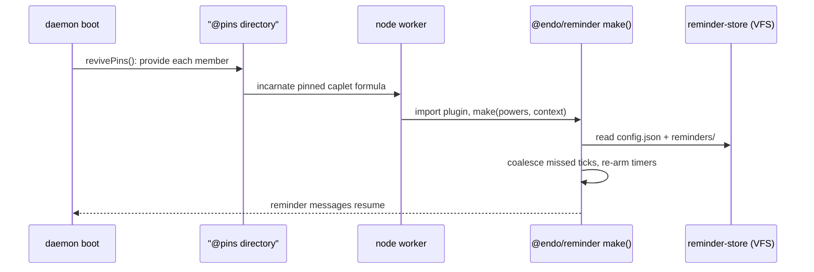

# `@endo/reminder`: A Message Scheduler Plugin

| | |
|---|---|
| **Created** | 2026-07-10 |
| **Author** | Kris Kowal (prompted) |
| **Status** | Not Started |
| **Supersedes** | [endoclaw-timer](endoclaw-timer.md) |
| **Parent** | [endoclaw](endoclaw.md) |

## What is the Problem Being Solved?

Agents running under SES lockdown have no `setTimeout` or `setInterval`;
without a scheduling capability they are purely reactive. The superseded
design ([endoclaw-timer](endoclaw-timer.md)) prototyped an interval scheduler
in `@endo/genie`, and PR
[#609](https://github.com/endojs/endo-but-for-bots/pull/609) graduated it into
`@endo/daemon` as a first-class `interval-scheduler` formula. Maintainer
review of #609 (2026-07-10) redirected the packaging on four points:

1. The mechanism is a **message scheduler**. It is not a generalized
   scheduling mechanism; it produces messages on various schedules. The name
   and documentation must say so.
2. The feature does not benefit from deep integration into the daemon. It
   becomes a **new unconfined plugin, `@endo/reminder`**, not a formula type.
3. Durable tracking must not couple to a host file system (`filePowers`,
   `node:fs`), which may be absent on some supported platforms. Persistence
   pushes down to the platform: the plugin uses the **virtual file system**,
   whose backing may be a real directory, a database, or memory.
4. The one thing the formula machinery provided that a plugin loses is
   revival on daemon restart. The missing narrative, retention of a live
   reference to the scheduler (like `@pins`), is supplied **out of band by a
   particular integration** (the Familiar app, the online Gateway), with less
   coupling to the lowest parts of the daemon.

This design redrafts the feature on those terms. The scheduling *behavior*
carries over from the superseded design; the packaging, persistence, revival
story, and naming change.

## Design

### What carries over unchanged

The behavioral sections of [endoclaw-timer](endoclaw-timer.md) remain
normative for the mechanism, read with the vocabulary map below: the
caretaker facet pair, the one-shot per-firing response capability,
start-to-start timing, resolve/reschedule with exponential backoff, firing
timeout with auto-resolve, host-controlled limits (`maxActive`,
`minPeriodMs`), pause/resume/revoke semantics, startup recovery with
missed-tick coalescing, and the security considerations (interval-bomb
prevention, response-capability abuse bounds, clock caveats). This document
does not restate them.

### Message-scheduler framing and vocabulary

`@endo/reminder` is documented everywhere as a **message scheduler**: it
produces messages on various schedules, and nothing else. Policy about *what
to do* on a schedule belongs to the recipient. The vocabulary map from the
superseded design:

| Superseded term | This design |
|---|---|
| interval scheduler (formula) | reminder service (plugin caplet) |
| interval | **reminder** (one scheduled message stream) |
| tick | **reminder message** (one delivery) |
| `IntervalScheduler` facet | `ReminderScheduler` facet |
| `IntervalControl` facet | `ReminderControl` facet |
| `TickResponse` | `ReminderResponse` |
| `makeIntervalSchedulerCmd` host command | none (provisioned via `makeUnconfined`) |

### Package and plugin shape

A new package, `packages/reminder`, published as `@endo/reminder`. It is an
**unconfined plugin**: no new formula type, no `formula-type.js` /
`daemon.js` / `host.js` / `interfaces.js` changes, no `extractDeps` case, no
maker-table entry. The plugin module exports the standard unconfined-caplet
maker:

```js
export const make = (powers, context) => { /* returns the reminder service */ };
```

provisioned by any host through the existing generic pathway:

```
E(host).makeUnconfined(workerName, specifier, { powersName, resultName })
```

where `specifier` resolves to `@endo/reminder`'s plugin module. `make`
returns the reminder service exo carrying the two caretaker facets:

- `ReminderScheduler` (agent-facing): `makeReminder(label, periodMs, opts)`,
  `list()`, `help()`; each `Reminder` exposes `label` / `period` /
  `setPeriod` / `cancel` / `info` / `help`.
- `ReminderControl` (integration-facing): `setMaxActive`, `setMinPeriodMs`,
  `pause`, `resume`, `revoke`, `listAll`, `help`.

Naming rules, from the review's inline comments, binding on the build:

- **No `Cmd` suffix** on any maker or surface (`makeIntervalSchedulerCmd` was
  the offender; it is unclear and it does not make a command). Makers are
  `makeReminderService`, `makeReminder`, and so on.
- **No `@module` JSDoc tags** in the plugin's sources.

### Powers: what the integration grants

`powers` is agent-shaped (typically a dedicated guest). The plugin resolves
everything it needs through it; it holds no ambient authority beyond the
Node worker it runs in.

1. **Durable store**: `E(powers).lookup('reminder-store')` must resolve to a
   writable virtual-file-system directory (next section).
2. **Recipient**: the scheduler is bound to one recipient agent (the
   one-scheduler-per-agent decision carries over); reminder messages are
   delivered through the powers' mail surface to that recipient.
3. **Limits**: initial `maxActive` / `minPeriodMs` arrive via the `env`
   option of `makeUnconfined`; thereafter `ReminderControl` adjusts them and
   the store persists them.

The implementation keeps the injectable `setTimeout` / `clearTimeout` /
`now` seam from #609 so tests run against a deterministic clock, even though
the unconfined worker has them ambiently.

### Durable tracking on the virtual file system

The store is a writable directory on the platform virtual file system: the
passable filesystem surface of `@endo/platform/fs/extended`
([platform-fs](platform-fs.md),
[fs-interface-reconciliation](fs-interface-reconciliation.md)), using the
reconciled tree verbs (`lookup`, `list`, `write`, `makeDirectory`, `remove`,
`move`). The plugin never touches `node:fs` or daemon `filePowers`, and
cannot tell what backs the directory: `makeNodeFilesystem` (a host
directory), `makeInMemoryFilesystem` (tests), `mountAsFilesystem` (a daemon
mount), a layered or database-backed backend. Layout, carried from the
superseded design's persistence section with the formula removed:

```
reminder-store/
  config.json          # { maxActive, minPeriodMs, paused } — formerly formula fields
  reminders/
    <id>.json          # one document per reminder; nextTickAt is absolute epoch ms
```

Writes use write-then-`move` for atomic replacement where the backing does
not already guarantee atomic `write` (open question 1).

### Wake-on-restart: retention by the integration

The daemon eagerly revives exactly one collection at boot: `revivePins()`
provides every identifier in the `@pins` directory, incarnating each formula
(`packages/daemon/src/daemon.js`, `revivePins`). Everything else revives
lazily on demand. A plugin caplet therefore wakes on restart if and only if
**something retains its identifier in a reviving collection**. That is the
narrative the formula integration used to supply implicitly, and here it is
explicit and integration-owned:

- The integration that provisions the reminder service **pins it**: for the
  reference host, `resultName: ['@pins', 'reminder']` at `makeUnconfined`
  time (or a later `storeIdentifier` into `@pins`) is sufficient. On the
  next boot, `revivePins()` provides the identifier, the worker incarnates
  the plugin, and `make()` runs recovery.
- The **Familiar app** and the **online Gateway** each own this retention for
  their deployments, out of band; daemon core gains no reminder-specific
  revival logic. Which of the two documents the first worked integration is
  open question 2.
- **Unpinning decommissions.** Removing the pin means the scheduler does not
  wake next boot; its durable store remains until the integration deletes it.



Recovery inside `make()` is the superseded design's startup-recovery
procedure verbatim, with "formula fields" replaced by `config.json`: skip
arming when paused; otherwise compute `missedTicks` per active reminder,
deliver a single catch-up reminder message, persist, re-arm.

### What becomes of PR #609

- `packages/daemon/src/interval-scheduler.js` ports nearly whole into
  `packages/reminder/src/scheduler.js`: the `filePowers` persistence swaps
  for the VFS store, the injected id generator and clock carry over, and the
  vocabulary renames apply.
- Every daemon integration file in #609 (`daemon.js`, `formula-type.js`,
  `types.d.ts`, `host.js`, `interfaces.js`) drops entirely, as do the
  `endo interval` CLI commands; the generic `endo make-unconfined` pathway
  suffices to provision the plugin. A dedicated CLI verb is out of scope
  (follow-up to be filed if wanted).
- The #609 test suite ports onto the in-memory VFS backing.
- PR #609 itself is superseded by this design; its disposition (close, or
  redraft its head onto a build of this design) rests with the maintainer.

## Dependencies

| Design | Relationship |
|---|---|
| [endoclaw](endoclaw.md) | Parent capability taxonomy |
| [endoclaw-timer](endoclaw-timer.md) | Superseded; its behavioral sections remain normative by reference |
| [platform-fs](platform-fs.md) | The virtual file system providing the durable store |
| [fs-interface-reconciliation](fs-interface-reconciliation.md) | The reconciled writable-tree verbs the store contract names |
| [endoclaw-proactive-messages](endoclaw-proactive-messages.md) | Depends on this design (composes scheduled messages with data capabilities and `send()`) |
| [familiar-daemon-bundling](familiar-daemon-bundling.md), [endo-gateway](endo-gateway.md) | Candidate owners of the live-reference retention (open question 2) |

## Implementation Phases

### Phase 1: Package and core scheduler (S)

`packages/reminder` with `make(powers, context)`, the scheduler core ported
from #609's head onto the VFS store contract, facet guards, limits, and the
test suite running on `makeInMemoryFilesystem`.

### Phase 2: Delivery and response (S)

Reminder-message delivery through the powers' mail surface with the one-shot
`ReminderResponse` attached (resolving open question 3), firing timeout with
auto-resolve, exponential backoff on reschedule.

### Phase 3: Integration and revival (S)

The pinning recipe documented in the package README, recovery on
incarnation, and one worked integration (Familiar app or online Gateway)
demonstrating restart-survival end to end.

## Design Decisions

1. **Message scheduler, by name and in documentation.** Review directive;
   forecloses reading this as a general scheduling or cron facility. The
   no-cron-semantics decision carries over: period math only, policy in the
   recipient.
2. **Unconfined plugin, not a formula.** Review directive. Consequences: no
   GC edges or `extractDeps`; lifecycle is pin/unpin rather than
   formula-graph reachability; limits and pause state live in the durable
   store rather than on a formula.
3. **Persistence is a virtual-file-system capability, backing-agnostic.**
   Review directive. The plugin depends on the passable tree surface, so a
   database-backed or in-memory store is a backend swap, not a plugin
   change.
4. **Revival is integration-owned retention, not daemon machinery.** Review
   directive. The `@pins` mechanism already exists and suffices; the plugin
   documents the recipe instead of the daemon growing a revival hook.
5. **Carried decisions** from the superseded design, unchanged: tick events
   are messages; start-to-start timing; resolve/reschedule with timeout
   auto-resolve; missed ticks coalesce; pause suppresses rather than defers;
   revocation is permanent; one scheduler per recipient agent; no sub-second
   periods.
6. **No `Cmd` suffix; no `@module` tags.** Review inline comments; recorded
   here so they do not recur in the build.
7. **Package name `@endo/reminder`.** The maintainer's chosen name. The
   project style guides mandate no naming prefix for CapTP-surfaced
   packages, so no conflict arises.
8. Considered and rejected: keeping the daemon-formula integration of #609.
   Reason: the review; the feature does not benefit from deep daemon
   integration.

## Open Questions

1. What is the exact durable-store contract: which
   `@endo/platform/fs/extended` verbs must the granted directory support,
   and is atomic replacement expressed as write-then-`move` or delegated to
   a backing-level atomic `write`?
2. Which integration owns live-reference retention first, the Familiar app
   or the online Gateway, and does the reference `@pins` recipe live in the
   package README or in that integration's design?
3. Which mail verb delivers a reminder message with its one-shot
   `ReminderResponse` attached? `EndoGuest`'s `send` requires attachments to
   be named in the sender's store first; `sendValue` is a reply verb. The
   fallback is direct eventual-send to a subscriber capability granted at
   provisioning, at the cost of the mailbox's persistence and replay.
4. Should reminder ids reuse the daemon's random-hex id discipline from
   #609's injected id generator, or the platform's content-addressed ids?

## Prompt

> Review of PR #609 (kriskowal, 2026-07-10):
>
> I would like this mechanism to be named and documented more clearly. This
> is a "message scheduler". This clarifies that it is not a generalized
> scheduling mechanism but rather produces messages on various schedules.
>
> I would also like to push more down to the platform. This framing of the
> interval scheduler creates undue coupling to a file system which may or
> may not be present on all supported platforms and the durable persistence
> of the scheduler could be a database or a virtual file system.
>
> In fact, this particular feature does not particularly benefit from deep
> integration into the daemon and could be an unconfined plugin, using the
> virtual file system for durable tracking. The only thing missing is a
> narrative for the retention of a live reference to the scheduler (like
> `@pins`) to ensure that it wakes up on daemon restart. This, could be
> handled out of band by a particular integration (like the Familiar app or
> online Gateway) with less coupling to the lowest parts.
>
> Please redraft this change as a new plugin `@endo/reminder`.
>
> Inline on `host.js` (`makeIntervalSchedulerCmd`): "Avoid abbreviations.
> `makeIntervalScheduler`. It's not clear what Cmd is supposed to indicate
> or differentiate. It isn't making a command."
>
> Inline on `interval-scheduler.js` (`@module interval-scheduler`): "Omit."
