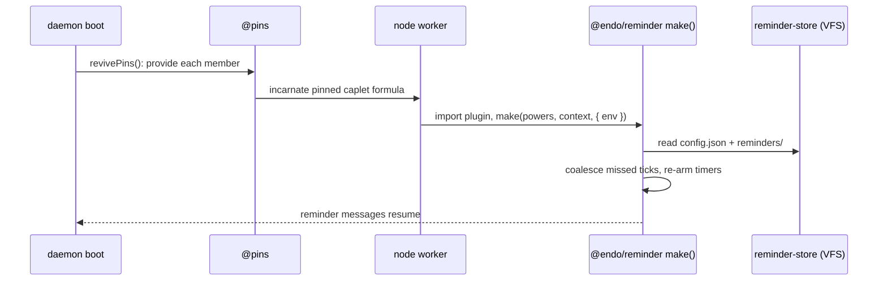

# `@endo/reminder`: A Message Scheduler Plugin

| | |
|---|---|
| **Created** | 2026-07-10 |
| **Author** | Kris Kowal (prompted) |
| **Status** | Not Started |
| **Supersedes** | [endoclaw-timer](endoclaw-timer.md) |
| **Parent** | [endoclaw](endoclaw.md) |

## What is the Problem Being Solved?

Agents running under SES lockdown have no `setTimeout` or `setInterval`;
without a scheduling capability they are purely reactive. The superseded
design ([endoclaw-timer](endoclaw-timer.md)) prototyped an interval scheduler
in `@endo/genie`, and PR
[#609](https://github.com/endojs/endo-but-for-bots/pull/609) graduated it into
`@endo/daemon` as a first-class `interval-scheduler` formula. Maintainer
review of #609 (2026-07-10) redirected the packaging on four points:

1. The mechanism is a **message scheduler**. It is not a generalized
   scheduling mechanism; it produces messages on various schedules. The name
   and documentation must say so.
2. The feature does not benefit from deep integration into the daemon. It
   becomes a **new unconfined plugin, `@endo/reminder`**, not a formula type.
3. Durable tracking must not couple to a host file system (`filePowers`,
   `node:fs`), which may be absent on some supported platforms. Persistence
   pushes down to the platform: the plugin uses the **virtual file system**,
   whose backing may be a real directory, a database, or memory.
4. The one thing the formula machinery provided that a plugin loses is
   revival on daemon restart. The missing narrative, retention of a live
   reference to the scheduler (like `@pins`), is supplied **out of band by a
   particular integration** (the Familiar app, the online Gateway), with less
   coupling to the lowest parts of the daemon.

This design redrafts the feature on those terms. The scheduling *behavior*
carries over from the superseded design; the packaging, persistence, revival
story, and naming change.

## Design

### What carries over unchanged

The behavioral sections of [endoclaw-timer](endoclaw-timer.md) remain
normative for the mechanism, read with the vocabulary map below: the
caretaker facet pair, the one-shot per-firing response capability,
start-to-start timing, resolve/reschedule with exponential backoff, firing
timeout with auto-resolve, host-controlled limits (`maxActive`,
`minPeriodMs`), pause/resume/revoke semantics, startup recovery with
missed-tick coalescing, and the security considerations (interval-bomb
prevention, response-capability abuse bounds, clock caveats). This document
does not restate them.

### Message-scheduler framing and vocabulary

`@endo/reminder` is documented everywhere as a **message scheduler**: it
produces messages on various schedules, and nothing else. Policy about *what
to do* on a schedule belongs to the recipient. The vocabulary map from the
superseded design:

| Superseded term | This design |
|---|---|
| interval scheduler (formula) | reminder service (plugin caplet) |
| interval | **reminder** (one scheduled message stream) |
| tick | **reminder message** (one delivery) |
| `IntervalScheduler` facet | `ReminderScheduler` facet |
| `IntervalControl` facet | `ReminderControl` facet |
| `TickResponse` | `ReminderResponse` |
| `makeIntervalSchedulerCmd` host command | none (provisioned via `makeUnconfined`) |

### Package and plugin shape

A new package, `packages/reminder`, published as `@endo/reminder`. It is an
**unconfined plugin**: no new formula type, no `formula-type.js` /
`daemon.js` / `host.js` / `interfaces.js` changes, no `extractDeps` case, no
maker-table entry. The plugin module exports the standard unconfined-caplet
maker:

```js
export const make = (powers, context, { env }) => { /* returns the reminder service */ };
```

provisioned by any host through the existing generic pathway:

```
E(host).makeUnconfined(workerName, specifier, { powersName, resultName })
```

where `specifier` resolves to `@endo/reminder`'s plugin module. `make`
returns the reminder service exo carrying the two caretaker facets:

- `ReminderScheduler` (agent-facing): `makeReminder(label, periodMs, opts)`,
  `list()`, `help()`; each `Reminder` exposes `label` / `period` /
  `setPeriod` / `cancel` / `info` / `help`.
- `ReminderControl` (integration-facing): `setMaxActive`, `setMinPeriodMs`,
  `pause`, `resume`, `revoke`, `listAll`, `help`.

Naming rules, from the review's inline comments, binding on the build:

- **No `Cmd` suffix** on any maker or surface (`makeIntervalSchedulerCmd` was
  the offender; it is unclear and it does not make a command). Makers are
  `makeReminderService`, `makeReminder`, and so on.
- **No `@module` JSDoc tags** in the plugin's sources.

### Powers: what the integration grants

`powers` is agent-shaped (typically a dedicated guest). The plugin resolves
everything it needs through it; it holds no ambient authority beyond the
Node worker it runs in.

1. **Durable store**: `E(powers).lookup('reminder-store')` must resolve to a
   writable virtual-file-system directory (next section).
2. **Recipient**: the scheduler is bound to one recipient — a **subscriber
   capability resolved by name through `powers`**,
   `E(powers).lookup('reminder-recipient')`, the same durable-name pathway as
   the store (the one-scheduler-per-agent decision carries over). Phase 2
   delivers each reminder message by eventual-send to that subscriber
   capability, carrying the one-shot `ReminderResponse` as an argument. Because
   the capability is re-resolved by name on every `make()`, it is re-obtained
   on restart rather than held only in memory, and nothing durable is passed
   through a mailbox — which is exactly why the Phase 2 baseline needs no
   SturdyRef modelling (contrast the gated Phase 4 `send` path, which retains
   the response via `storeValue`).
3. **Limits**: initial `maxActive` / `minPeriodMs` arrive via the `env`
   option of `makeUnconfined`; thereafter `ReminderControl` adjusts them and
   the store persists them.

The implementation keeps the injectable `setTimeout` / `clearTimeout` /
`now` seam from #609 so tests run against a deterministic clock, even though
the unconfined worker has them ambiently.

### Delegation and attenuation: agent to subagent

The two-facet caretaker split (§Package and plugin shape) is also the
delegation seam. An agent holds capabilities and may hand them to a subagent (a
guest it makes); pure object-capability discipline means it can delegate **only
handles it already holds**, and can only *narrow* their authority, never widen
it. Three modes span the review's requirements — from sharing one live
scheduler, through attenuated handles, to formulating an entirely independent
yet revocable scheduler — and each is ordinary capability passing over the
plugin's existing facets, adding no new plugin surface (design decision 17).

**Mode A — share a held handle (attenuation by selection).** An agent that
holds a `ReminderScheduler` gives a subagent scheduling authority by passing a
capability it already has, choosing how much:

- the whole `ReminderScheduler` → the subagent *shares* the parent's one
  scheduler and store; the subagent's reminders count against the parent's
  `maxActive` and stay visible to the parent through `list()`;
- a single `Reminder` handle → the subagent may `setPeriod` / `cancel` / `info`
  that one reminder only, and cannot create others;
- an attenuating forwarder → a caretaker-wrapped facet exposing a chosen subset
  (create-only, or read-only `list` / `info`) that the parent can revoke on its
  own, without disturbing its own direct access.

Mode A does not grant independence: one scheduler, one store, one shared budget.
Revoking a *shared* handle uses a parent-held caretaker wrapper (the daemon's
generic caretaker over the forwarded facet), **not** `ReminderControl.revoke`,
which would also kill the parent's own use.

**Mode B — an independent, revocable scheduler for a subagent.** For genuine
independence the parent does not share its scheduler; it **provisions a fresh
one bound to the subagent as recipient, and keeps the control facet.** The
parent plays the *integration* role that §Powers assigns to whoever provisions
the service:

1. **Attenuate the powers.** Compose a child `powers` namehub holding *only* the
   two names the plugin resolves (§Powers items 1–2): `reminder-store` bound to a
   **subdirectory** of the parent's own store, and `reminder-recipient` bound to
   the subagent. Both are handles the parent already holds, narrowed — the child
   can name no store and no recipient the parent could not, which is exactly
   *delegate only handles you hold*.
2. **Provision a fresh service** against that attenuated powers (recipe below),
   yielding the `ReminderScheduler` / `ReminderControl` facet pair.
3. **Split the pair.** Hand the subagent **only `ReminderScheduler`**; **retain
   `ReminderControl`.**

The result is *independent* — its own store subdirectory, its own `config.json`
limits, its own recipient, so the child's reminders never touch the parent's
scheduler, store, or `maxActive` budget — and *revocable*, because the parent
holds `ReminderControl`: `revoke()` permanently kills the child's scheduler
(carried decision 5 semantics), `pause` / `resume` suspend it, and deleting the
child's store subdirectory plus unpinning decommissions it durably (mirroring
§Wake-on-restart's "unpinning decommissions"). "Independent but revocable" is
precisely *the parent is the child's integration.* This also upholds
one-scheduler-per-recipient (decision 5): each subagent is a distinct recipient,
so each gets its own scheduler with no aliasing.

**Formulation via `agent.evaluate`, automatable.** Provisioning is
`makeUnconfined` underneath, but per the review the parent may drive it through
`agent.evaluate`, provided the formulation is straightforward to automate. It is
a **single canned, parameterized recipe** — no per-child bespoke source — that
the parent evaluates once per subagent (in a loop when fanning out to a fleet):

```js
// Evaluated by the PARENT agent via E(agent).evaluate(...); its own agent
// `powers` is in scope. Pure and parameterized, so automation is a call, not a
// rewrite. Returns the reminder service exo, which carries both caretaker
// facets: the caller RETAINS `control` (revoke / pause / limits) and hands the
// subagent ONLY `scheduler`.
export const provisionSubagentReminder = async (
  powers,
  { subagent, storeSubdir, maxActive, minPeriodMs },
) => {
  // 1. Attenuate: a child powers namehub holding only the two names the plugin
  //    resolves — each a handle the parent already holds, narrowed, never widened.
  const store = await E(powers).lookup('reminder-store');       // parent's VFS store dir
  const childStore = await E(store).makeDirectory(storeSubdir); // the child's own subtree
  // makeChildPowers is the daemon's existing pet-name-namehub (or guest)
  // creation — no new primitive; it returns an empty namehub the parent populates.
  const childPowers = await makeChildPowers(powers, `reminder-powers/${storeSubdir}`);
  await E(childPowers).write(['reminder-store'], childStore);
  await E(childPowers).write(['reminder-recipient'], subagent);
  // 2. Provision a FRESH scheduler against the attenuated powers.
  return E(powers).makeUnconfined(
    `reminder-worker/${storeSubdir}`, '@endo/reminder',
    { powersName: `reminder-powers/${storeSubdir}`, env: { maxActive, minPeriodMs } },
  );
};
```

To automate a fleet, the parent scripts one call per subagent, retains each
returned service's `control` facet (keyed by subagent) for later `revoke` /
`pause`, and passes each `scheduler` facet onward. `agent.evaluate`'s authority
bound — a subagent can only evaluate in workers, and reach capabilities, the
parent granted, per
[daemon-guest-eval-simplification](daemon-guest-eval-simplification.md) — is
what keeps every fanned-out scheduler within the parent's own authority.

### Durable tracking on the virtual file system

The store is a writable directory on the platform virtual file system: the
passable filesystem surface of `@endo/platform/fs/extended`
([platform-fs](platform-fs.md),
[fs-interface-reconciliation](fs-interface-reconciliation.md)), using the
reconciled tree verbs (`lookup`, `list`, `write`, `makeDirectory`, `remove`,
`move`). The plugin never touches `node:fs` or daemon `filePowers`, and
cannot tell what backs the directory: `makeNodeFilesystem` (a host
directory), `makeInMemoryFilesystem` (tests), `mountAsFilesystem` (a daemon
mount), a layered or database-backed backend. Layout, carried from the
superseded design's persistence section with the formula removed:

```
reminder-store/
  config.json          # { maxActive, minPeriodMs, paused } — formerly formula fields
  reminders/
    <id>.json          # one document per reminder; <id> is a random hex minted
                       #   by the injected id generator (design decision 18);
                       #   nextTickAt is absolute epoch ms; also catchUpPolicy,
                       #   annotation, and the backoff params +
                       #   consecutiveFailures (see below)
```

Each reminder's `<id>` is a **random hex** value from the injected id generator
carried over from #609, not a content-address of its parameters: a fresh id
avoids collisions and lets an agent register the *same* schedule more than once,
each duplicate its own independently cancellable reminder (design decision 18).

Writes use write-then-`move` within the store directory for atomic
replacement. The atomicity of a direct `write` varies by backing and is not
relied upon; instead the plugin **requires atomic within-directory `move`** of
the store backing as a store contract. Because the plugin cannot tell what backs
the directory, this is stated as an obligation the backing must meet, not an
inherent VFS guarantee it can verify (design decision 9).

At the expected cardinality — one scheduler per recipient agent, a handful of
reminders — the absence of a `next_tick_at` index costs nothing: recovery is an
O(N) directory scan over a tiny N. The superseded reactor + schedule design
([#165](https://github.com/endojs/endo-but-for-bots/pull/165)) indexed recovery
in sqlite; that rationale is moot at this cardinality, so a future reader should
not reach for a database reflexively (design decision 13).

### Per-reminder behavior: catch-up, annotation, backoff

Three behaviors the superseded design under-specified become explicit,
persisted per-reminder fields, ported from #165 without its formula packaging
(they are pure content in the durable store and the `make()` recovery path):

- **`catchUpPolicy`** — how a reminder treats ticks missed while the daemon was
  down. The default is **`coalesce`** (one catch-up message spanning the whole
  gap, carried over from `endoclaw-timer`). At least **`skip`** (drop stale
  ticks entirely — the right default for a "still alive?" heartbeat that gains
  nothing from replaying the past) is offered alongside it. The fuller #165
  vocabulary — `backfill`, `batch`, `suspend` (from the CloudFlare Queues
  catch-up model) — is reserved as named future values, where `suspend` surfaces
  an unbounded backlog as a fault instead of silently masking it (design
  decision 14).
- **`annotation`** — what a coalesced message conveys. Defaults to a **count**
  (`[fired N times]`, making explicit the `missedTicks` count `endoclaw-timer`
  already carries); optionally the **list of scheduled timestamps** it stands in
  for. Per-reminder (design decision 15).
- **`backoff`** — the reschedule-backoff parameters, named and persisted rather
  than carried by reference from `endoclaw-timer`: `initialMs`, `maxMs`,
  `multiplier`, and a **`jitterFraction`** (full jitter, per AWS "Exponential
  Backoff and Jitter"), with `consecutiveFailures` persisted alongside so
  backoff state survives restart. Full jitter de-synchronizes retries when
  several reminders co-fail against one downstream and would otherwise realign
  their backoff on restart — cheap insurance even at this design's small
  cardinality (a handful of reminders, design decision 13). The defaults
  reproduce `endoclaw-timer`'s `min(1000, periodMs/10) * 2^n` with a nonzero
  jitter fraction added (design decision 16).

### Wake-on-restart: retention by the integration

The daemon eagerly revives exactly one caplet collection at boot: `revivePins()`
provides every identifier in the `@pins` directory, incarnating each formula
(`packages/daemon/src/daemon.js`, `revivePins`). Everything else revives
lazily on demand. A plugin caplet therefore wakes on restart if and only if
**something retains its identifier in a reviving collection**. That is the
narrative the formula integration used to supply implicitly, and here it is
explicit and integration-owned:

- The integration that provisions the reminder service **pins it**: for the
  reference host, `resultName: ['@pins', 'reminder']` at `makeUnconfined`
  time (or a later `storeIdentifier` into `@pins`) is sufficient. On the
  next boot, `revivePins()` provides the identifier, the worker incarnates
  the plugin, and `make()` runs recovery.
- For now the retention is **user-driven**: the user follows the
  `@endo/reminder` README instructions to place the reminder service in
  `@pins` for incarnation-on-start (design decision 10). The **Familiar app**
  and the **online Gateway** may each own this retention automatically for
  their deployments later, out of band; daemon core gains no
  reminder-specific revival logic either way.
- **Unpinning decommissions.** Removing the pin means the scheduler does not
  wake next boot; its durable store remains until the integration deletes it.



Recovery inside `make()` is the superseded design's startup-recovery
procedure, with "formula fields" replaced by `config.json`: skip arming when
paused; otherwise apply each active reminder's `catchUpPolicy` to the ticks
missed while down (`coalesce` into one message annotated per its `annotation`
field, or `skip`), persist, re-arm — see *Per-reminder behavior* above.

### What becomes of PR #609

- `packages/daemon/src/interval-scheduler.js` ports nearly whole into
  `packages/reminder/src/scheduler.js`: the `filePowers` persistence swaps
  for the VFS store, the injected id generator and clock carry over, and the
  vocabulary renames apply.
- Every daemon integration file in #609 (`daemon.js`, `formula-type.js`,
  `types.d.ts`, `host.js`, `interfaces.js`) drops entirely, as do the
  `endo interval` CLI commands; the generic `endo make-unconfined` pathway
  suffices to provision the plugin. A dedicated CLI verb is a follow-up, whose
  target shape is sketched below (*Eventual user surface*) so the plugin's
  facets are designed to support it rather than retrofitted.
- The #609 test suite ports onto the in-memory VFS backing.
- PR #609 itself is superseded by this design; its disposition (close, or
  redraft its head onto a build of this design) rests with the maintainer.

### Eventual user surface (sketch)

The CLI verb is a follow-up, but the target shape is named now so the plugin's
exported facets support it by design rather than being retrofitted. Two
candidate surfaces, both portable from #165's fully-specified ergonomics:

- an **`endo reminder`** family — `endo reminder add <recipient> --every
  <period> [--message ...] [--catch-up skip|coalesce]`, `endo reminder list`,
  `endo reminder pause|resume|cancel <id>` — mapping one-to-one onto
  `ReminderScheduler` / `ReminderControl`; or
- **`endo send --every <period>` / `--at <time>` / `--on <schedule>`**, folding
  scheduling into the existing send verb (the #165 shape).

The facet methods cover the per-reminder verbs — `makeReminder(label,
periodMs, opts)`, `list`, and each `Reminder`'s `setPeriod` / `cancel` / `info`,
plus the `ReminderControl` limits — with the per-reminder `opts`
(`catchUpPolicy`, `annotation`, `backoff`) surfaced as flags and the reminder
`label` supplied positionally or defaulted from `--message`. Two dimensions the
CLI sketch adds are deliberately **not** per-reminder facet arguments, and the
follow-up owns them: the `<recipient>` selects *which* scheduler (one is bound
per recipient at provisioning, §Powers), so the CLI routes to the right service
rather than passing a recipient into `makeReminder`; and a hosted CLI needs a
discovery path to reach each recipient's scheduler. The follow-up wires a CLI
onto these facets and adds no new *scheduling* capability, but it does own the
scheduler-selection and discovery surface the facets alone do not express.

## Dependencies

| Design | Relationship |
|---|---|
| [endoclaw](endoclaw.md) | Parent capability taxonomy |
| [endoclaw-timer](endoclaw-timer.md) | Superseded; its behavioral sections remain normative by reference |
| [platform-fs](platform-fs.md) | The virtual file system providing the durable store |
| [daemon-guest-eval-simplification](daemon-guest-eval-simplification.md) | The `agent.evaluate` authority bound underpinning subagent delegation (§Delegation and attenuation) |
| [fs-interface-reconciliation](fs-interface-reconciliation.md) | The reconciled writable-tree verbs the store contract names |
| [endoclaw-proactive-messages](endoclaw-proactive-messages.md) | Depends on this design (composes scheduled messages with data capabilities and `send()`) |
| [familiar-daemon-bundling](familiar-daemon-bundling.md), [gateway-package](gateway-package.md) | Candidate future owners of the live-reference retention (user-driven via README for now, design decision 10) |
| SturdyRef modelling (agent provide/accept surface [#695](https://github.com/endojs/endo-but-for-bots/pull/695), cross-peer bridge [#697](https://github.com/endojs/endo-but-for-bots/pull/697) with cuts [#698](https://github.com/endojs/endo-but-for-bots/pull/698)–[#704](https://github.com/endojs/endo-but-for-bots/pull/704), on-demand enlivenment [#539](https://github.com/endojs/endo-but-for-bots/pull/539); substrate [#521](https://github.com/endojs/endo-but-for-bots/pull/521)/[#541](https://github.com/endojs/endo-but-for-bots/pull/541)) | Gates only the Phase 4 `send` + `storeValue` delivery upgrade; the Phase 2 subscriber-capability baseline is ungated (see *Gating dependency: SturdyRef modelling*) |

## Implementation Phases

### Phase 1: Package and core scheduler (S)

`packages/reminder` with `make(powers, context, { env })`, the scheduler core ported
from #609's head onto the VFS store contract, facet guards, limits, and the
test suite running on `makeInMemoryFilesystem`.

### Phase 2: Delivery and response — subscriber-capability baseline (S)

Reminder-message delivery by eventual-send to the subscriber capability
(§Powers, item 2) with the one-shot `ReminderResponse` attached, firing timeout
with auto-resolve, and jittered exponential backoff on reschedule (see
*Per-reminder behavior*). Delivery in this phase is the **ungated baseline**: an
eventual-send to a **subscriber capability resolved by name through `powers`**
(design decision 11), which retains no durable capability and therefore needs no
SturdyRef modelling. This is the critical path, and it does not block on unmerged
work.

### Phase 3: Integration and revival (S)

The pinning recipe documented in the package README, recovery on
incarnation, and one worked integration (Familiar app or online Gateway)
demonstrating restart-survival end to end.

### Phase 4: Mailbox delivery via `send` + `storeValue` (S, gated)

An upgrade that routes delivery through the powers' `send` verb, the service
retaining the one-shot `ReminderResponse` (and any data capabilities) via
`storeValue` (design decision 12), buying the mailbox's persistence and replay
over the Phase 2 baseline. This phase — and only this phase — is gated on
SturdyRef progress (see *Gating dependency: SturdyRef modelling*); Phases 1–3
ship without it.

## Design Decisions

1. **Message scheduler, by name and in documentation.** Review directive;
   forecloses reading this as a general scheduling or cron facility. The
   no-cron-semantics decision carries over: period math only, policy in the
   recipient.
2. **Unconfined plugin, not a formula.** Review directive. Consequences: no
   GC edges or `extractDeps`; lifecycle is pin/unpin rather than
   formula-graph reachability; limits and pause state live in the durable
   store rather than on a formula.
3. **Persistence is a virtual-file-system capability, backing-agnostic.**
   Review directive. The plugin depends on the passable tree surface, so a
   database-backed or in-memory store is a backend swap, not a plugin
   change.
4. **Revival is integration-owned retention, not daemon machinery.** Review
   directive. The `@pins` mechanism already exists and suffices; the plugin
   documents the recipe instead of the daemon growing a revival hook.
5. **Carried decisions** from the superseded design, unchanged: tick events
   are messages; start-to-start timing; resolve/reschedule with timeout
   auto-resolve; missed ticks coalesce; pause suppresses rather than defers;
   revocation is permanent; one scheduler per recipient agent; no sub-second
   periods.
6. **No `Cmd` suffix; no `@module` tags.** Review inline comments; recorded
   here so they do not recur in the build.
7. **Package name `@endo/reminder`.** The maintainer's chosen name. The
   project style guides mandate no naming prefix for CapTP-surfaced
   packages, so no conflict arises.
8. **Considered and rejected: keeping the daemon-formula integration of
   #609.** Reason: the review; the feature does not benefit from deep daemon
   integration.
9. **Atomic replacement is write-then-`move`, not backing-level atomic
   `write`.** Maintainer review of this PR (2026-07-11): the atomicity of a
   direct `write` varies by implementation and cannot be relied upon.
   Atomic within-directory `move` is instead **required of the store backing**
   as a store contract the plugin depends on — not an inherent VFS guarantee, and
   not one the plugin can verify, since it cannot tell what backs the directory.
   Resolves former open question 1.
10. **The reference `@pins` recipe lives in the package README, user-driven
    for now.** Maintainer review (2026-07-11): for now we rely on the user to
    follow the `@endo/reminder` README instructions to place the reminder
    service in `@pins` for incarnation-on-start. No integration owns the
    retention automatically yet (the Familiar app / online Gateway remain
    candidate future owners). Resolves former open question 2.
11. **Delivery baseline is a subscriber capability resolved by name through
    `powers`, not `send`.** This design review (2026-07-12, maintainer-agreed via the
    [dispatch comment](https://github.com/endojs/endo-but-for-bots/pull/682#issuecomment-4951968957)):
    the headline delivery path must not block on four unmerged draft PRs when an
    ungated path exists. Phase 2 delivers by eventual-send to a **subscriber
    capability resolved by name through the `powers` granted at provisioning**
    (§Powers item 2) — retaining no durable capability, so no SturdyRef gate —
    the way #165's canned-send reactor holds its send endowment directly. This supersedes the former resolution (below) that made
    `send` + `storeValue` the baseline; that path becomes a later, gated
    upgrade (decision 12).
12. **`send` + `storeValue` delivery is a later, gated phase (Phase 4).**
    Maintainer review (2026-07-11) fixed the mail verb as `send`; because `send`
    requires the sender to retain the capabilities it attaches, the reminder
    service retains the one-shot `ReminderResponse` (and any data capabilities)
    via `storeValue`, which holds durable values anonymously under a single
    name. That path buys the mailbox's persistence and replay but is **gated on
    SturdyRef progress** (see *Gating dependency: SturdyRef modelling*); it
    layers over the Phase 2 subscriber-capability baseline rather than replacing
    it. (Formerly decision 11, resolving open question 3.)
13. **No recovery index; O(N) directory scan at this cardinality.** This design
    review (2026-07-12): one scheduler per recipient, a handful of reminders, so
    #165's sqlite indexed-recovery rationale is moot; the VFS-over-database
    choice is deliberate here.
14. **Named catch-up policies, per reminder (`coalesce` default, `skip`
    offered).** This design review (2026-07-12): ported from #165's
    catch-up vocabulary; `backfill` / `batch` / `suspend` reserved as named
    future values. See *Per-reminder behavior*.
15. **Coalesced-message annotation is specified: count by default, timestamps
    optionally.** This design review (2026-07-12): #682 said "a single catch-up
    message" without stating what it conveys; #165's aggregation section is
    ported. See *Per-reminder behavior*.
16. **Backoff parameters named and persisted, with full jitter.** This design
    review (2026-07-12): `initialMs` / `maxMs` / `multiplier` / `jitterFraction`
    plus persisted `consecutiveFailures`, ported from #165; full jitter guards
    against a co-fail thundering herd. See *Per-reminder behavior*.
17. **Agent→subagent delegation is capability passing over the existing facets,
    not new plugin surface.** This design review (2026-07-14): an agent shares
    scheduling authority with a subagent in one of three ways — pass a held
    `ReminderScheduler` / `Reminder` handle (Mode A, shared), pass an
    attenuating forwarder (Mode A, narrowed), or provision a *fresh* scheduler
    bound to the subagent as recipient while retaining `ReminderControl` (Mode
    B, independent + revocable). The two-facet caretaker split already *is* the
    attenuation seam: provisioning-for-a-subagent makes the parent that child's
    integration, so `ReminderControl.revoke` / `pause` is the revocation lever
    and the child's store subdirectory + `maxActive` are its independence.
    Formulation is a single canned `agent.evaluate` recipe (§Delegation and
    attenuation), parameterized per subagent so a fleet is a loop, and bounded
    by pure object-capability discipline — a subagent's scheduler is always a
    strict attenuation of the parent's authority. No `makeReminder` argument, no
    plugin change, is added for delegation. Resolves the 2026-07-14 review.
18. **Reminder ids are random hex, not content-addressed.** Maintainer review
    (2026-07-15): reminder ids reuse the daemon's random-hex id discipline from
    #609's injected id generator rather than platform content-addressed ids.
    Two reasons: **collision avoidance** (a fresh random hex per reminder never
    aliases an existing document), and **allowing duplicates of the same
    schedule** — content-addressing would collapse two reminders with identical
    parameters onto one id, whereas the design must let an agent register the
    same schedule more than once and have each be its own independently
    cancellable reminder. Resolves the id-scheme open question, retiring the
    last entry in the former *Open Questions* section.

## Gating dependency: SturdyRef modelling

Design decision 12 (the Phase 4 `send` + `storeValue` delivery upgrade) depends
on SturdyRef modelling maturing far enough that the reminder service can (a)
obtain a
SturdyRef for a durable value it holds under `storeValue`, by-value or
by-name, without knowing the value's identifier or locator, and (b) later
pass that SturdyRef in place of a pet name when it `send`s the reminder
message. The maintainer flagged (2026-07-11) that this reminder increases the
urgency of that modelling. Since that review the SturdyRef effort has grown a
provide/accept agent surface and a cross-peer bridge that, taken together,
cover both requirements at the design level. State of the SturdyRef work in
this repo:

| Design / PR | State | Relationship |
|---|---|---|
| [#539](https://github.com/endojs/endo-but-for-bots/pull/539) design: on-demand enlivenment via the closely-held OCapN network capability | open (draft) | Foundation: `'sturdyref'` pass-style + OCapN boxing + read-side pet-name-path substitute + on-demand enlivenment |
| [#695](https://github.com/endojs/endo-but-for-bots/pull/695) design: agent provide/accept surface + guest token | open (draft) | Adds the agent-facing **provide** verbs (`makeRefToken` shared, `makeSturdyRef` host-only, `storeRef` for durable naming) and the write/send-side **accept** admission on the mail verbs (`send`/`reply`/`resolve`); settles the confined-guest token tier |
| [#697](https://github.com/endojs/endo-but-for-bots/pull/697) design: cross-peer bridge, wire codec, foreign-locator internalization, three-party handoff | open (draft) | Expands #539's local pipeline cross-peer; specifies the daemon **mint-and-export** of a durable, revocable wire-tier SturdyRef over a persistent swiss-num store |
| [#521](https://github.com/endojs/endo-but-for-bots/pull/521) feat(pass-style): first-class `'sturdyref'` pass-style; ocapn defers | open (draft) | Pass-style + `@endo/ocapn` implementation slice |
| [#541](https://github.com/endojs/endo-but-for-bots/pull/541) feat(daemon): SturdyRef read-side threading at the facet boundary | open (draft) | Daemon read-side threading (`lookup`/`identify`/`locate`/`evaluate`); write/send guards left untouched here, added by #695's mail-accept cut |
| [#698](https://github.com/endojs/endo-but-for-bots/pull/698)–[#704](https://github.com/endojs/endo-but-for-bots/pull/704) the #697 bridge cuts (esp. [#701](https://github.com/endojs/endo-but-for-bots/pull/701) mint + export over a swiss-num store) | open (draft) | Six independently mergeable implementation cuts of #697; #701 gives the daemon the exporter role (`host.sturdyRefs().provideSturdyRef`, revocable by forgetting) |

*(The origin design [#510](https://github.com/endojs/endo-but-for-bots/pull/510)
merged and its `endor`-syscall retention direction was abandoned;
[#511](https://github.com/endojs/endo-but-for-bots/pull/511)'s competing
`FinalizationRegistry` retention framing is withdrawn per #539. Both are
superseded by the #539/#695/#697 line above.)*

**Covered** by the above, at the design level — both of the maintainer's two
requirements now have a home:

- **Requirement (b), obtaining a SturdyRef for a durable value the reminder
  holds under `storeValue`, by-value or by-name, without knowing its
  identifier or locator.** #695's **provide** surface mints a reference for a
  durable value the holder already has: `makeRefToken` (a *shared* facet verb,
  so reachable by the reminder's confined-guest `powers`) hands back a fresh,
  unlinkable `SturdyRefToken`; `makeSturdyRef` (host-only) hands back a
  location-bearing wire SturdyRef; `storeRef` names one durably. #697/#701 back
  the wire tier with a daemon mint-and-export over a persistent swiss-num store.
  The granter's facet picks the tier — the unlinkable token for a confined
  guest, the location-bearing SturdyRef for trusted or wire peers.
- **Requirement (a), passing that reference in place of a pet name when the
  reminder `send`s the message.** #695's **accept** surface admits the ref tier
  on the **mail verbs** (`send`/`reply`/`resolve`) as well as on every
  pet-name-path-accepting read method, and carries refs across the LLM boundary
  via a text-tier escrow. This is precisely the write/send-side admission that
  the read-side-only threading of #541 left open.

The read-side facet threading (#541), the foreign-locator internalization that
replaces #541's rejection (#697/#703), and the three-party
mint-pass-enliven round-trip (#697/#704) supply the surrounding machinery.

**What still gates Phase 4** is therefore not a missing design but that the
whole cluster is **unmerged draft**. The upgrade lands only once the specific
cuts the reminder rides are merged:

1. **#695's provide + mail-accept cuts** (its cut A daemon token core, cut B
   daemon provide + mail): the `storeRef` durable-naming verb, `makeRefToken`
   for the reminder's confined-guest tier, and the `send` admission of the ref
   tier. These implement the two requirements directly.
2. For a **cross-peer** recipient (reminder and recipient on different
   daemons), additionally #697's mint-and-export (#701) and foreign
   internalization (#703), so the reference survives the wire. For a
   **same-daemon** recipient — the common case, one scheduler per co-located
   agent — the token tier + `storeRef` + mail admission from #695 suffice
   without the wire bridge.

One genuinely open *modelling* question remains (not merely unmerged code):
#539's enlivened-presence lifetime — worker-held presence teardown on session
loss — which #697 narrows for the daemon side but does not resolve. It does not
block the reminder's same-daemon path.

Until the provide + mail-accept cuts land, the Phase 4 `send` + `storeValue`
upgrade is simply not built; the **Phase 2 subscriber-capability baseline**
(design decision 11) carries all delivery, at the cost of the mailbox's
persistence and replay. The critical path is therefore never blocked on this
modelling — the gate governs an enhancement, not the feature.

## Prompt

> Review of PR #609 (kriskowal, 2026-07-10):
>
> I would like this mechanism to be named and documented more clearly. This
> is a "message scheduler". This clarifies that it is not a generalized
> scheduling mechanism but rather produces messages on various schedules.
>
> I would also like to push more down to the platform. This framing of the
> interval scheduler creates undue coupling to a file system which may or
> may not be present on all supported platforms and the durable persistence
> of the scheduler could be a database or a virtual file system.
>
> In fact, this particular feature does not particularly benefit from deep
> integration into the daemon and could be an unconfined plugin, using the
> virtual file system for durable tracking. The only thing missing is a
> narrative for the retention of a live reference to the scheduler (like
> `@pins`) to ensure that it wakes up on daemon restart. This, could be
> handled out of band by a particular integration (like the Familiar app or
> online Gateway) with less coupling to the lowest parts.
>
> Please redraft this change as a new plugin `@endo/reminder`.
>
> Inline on `host.js` (`makeIntervalSchedulerCmd`): "Avoid abbreviations.
> `makeIntervalScheduler`. It's not clear what Cmd is supposed to indicate
> or differentiate. It isn't making a command."
>
> Inline on `interval-scheduler.js` (`@module interval-scheduler`): "Omit."
>
> Design review of PR #682 (2026-07-12, maintainer-agreed via
> [comment](https://github.com/endojs/endo-but-for-bots/pull/682#issuecomment-4951968957),
> concluding [review](https://github.com/endojs/endo-but-for-bots/pull/682#pullrequestreview-4680373156)):
> recover from #165, before build, the operational richness that does not
> depend on formula packaging — named catch-up policies (at least `skip` vs
> `coalesce`), explicit jittered backoff parameters (with persisted
> `consecutiveFailures`), the coalesced-message annotation (count by default,
> timestamps optionally), a sketched eventual CLI surface, and a one-line
> persistence-scale note — and, most importantly, decouple the delivery path
> from the SturdyRef gate by making direct subscriber-capability delivery the
> baseline. All are content ports into the plugin's durable store and `make()`
> recovery; none reintroduces a formula.
>
> Design review of PR #682 (kriskowal, 2026-07-14,
> [review](https://github.com/endojs/endo-but-for-bots/pull/682#pullrequestreview-4690774603)):
> Please discuss how the reminder capability gets passed and attenuated when
> passed from agent to subagent. It must be possible for each agent to manage
> their own schedules, delegate only to handles they hold, and easily formulate
> an entirely independent but revocable scheduler for a subagent. Formulation
> may rely on `agent.evaluate`, but must be straightforward to automate.
