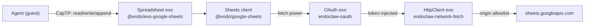

# `@endo/exo-google-sheets` package: Google Sheets connector

| | |
|---|---|
| **Created** | 2026-07-06 |
| **Author** | Kris Kowal (prompted) |
| **Status** | Proposed |

## Summary

`@endo/exo-google-sheets` presents a Google Sheets spreadsheet as a passable
capability an agent can call over CapTP without ever seeing the OAuth
credential. The host performs the OAuth flow and holds the token behind an
[endoclaw-oauth](endoclaw-oauth.md) `OAuth` exo; the agent holds a
`Spreadsheet` exo and calls `E(sheet).read('Tasks!A1:C10')`. The credential is
structurally inaccessible: no method on any granted facet returns or forwards
it.

The exo package is backed by a lower-level plain library,
`@endo/google-sheets`, which speaks the Sheets REST API against an injected
`fetch`-shaped power and knows nothing about CapTP, exos, or tokens. This
mirrors the [exo-zip-package](exo-zip-package.md) shape (`@endo/exo-zip` wraps
`@endo/zip`): the `exo-` prefix marks the package whose primary surface is
passable interfaces exchanged over CapTP, and the plain sibling stays free of
Passable machinery.

## What is the Problem Being Solved?

Agents routinely need tabular state that humans also edit: task queues,
inventories, budgets, contact lists. Google Sheets is where much of that data
already lives. Today an Endo agent has no principled way to touch it: handing
the agent a Google OAuth token grants the whole Google account surface and
lets the agent exfiltrate the credential; handing it nothing forces a human to
copy data by hand.

The ocap answer is already designed in two layers this document builds on
rather than reinvents:

- [endoclaw-network-fetch](endoclaw-network-fetch.md) confines outbound HTTP
  to a host-controlled origin allowlist (`HttpClient`).
- [endoclaw-oauth](endoclaw-oauth.md) wraps an `HttpClient` with token
  injection, path restrictions, and read-only mode (`OAuth`); its own worked
  example is `E(gmail).fetch('/messages')`.

What is missing is the domain layer: the raw `OAuth.fetch` surface makes the
agent assemble Sheets REST URLs, encode value ranges, page results, and parse
quota errors by hand, and the path-pattern attenuation `setAllowedPaths`
offers is far coarser than "read-only access to one tab of one spreadsheet".
This design adds that layer as a typed, attenuable, passable capability.

## Package Split

Two packages, mirroring `@endo/zip` / `@endo/exo-zip`
([exo-zip-package](exo-zip-package.md) Design Decision 8):

- **`@endo/google-sheets`** (`packages/google-sheets/`): a plain, portable
  Sheets API client. Pure ECMAScript, no Node built-ins, loadable in XS and
  SES realms. Its factory takes a `fetch`-shaped function as a power:

  ```js
  import { makeSheetsClient } from '@endo/google-sheets';
  const client = makeSheetsClient(fetchPower, { spreadsheetId });
  ```

  The client never sees a token. In production the injected power is the
  bound `fetch` of an `OAuth` exo (which injects the `Authorization` header
  itself); in tests it is a stub. The client owns URL construction, A1-range
  encoding, `values.get` / `values.batchGet` / `values.update` /
  `values.append` / `values.clear` and `spreadsheets.get` calls, response
  parsing, pagination, and mapping Google error payloads to structured
  errors.

- **`@endo/exo-google-sheets`** (`packages/exo-google-sheets/`): wraps a
  client in hardened exos with interface guards and facet attenuation, for
  consumption over CapTP.

  ```js
  import { makeExoSpreadsheet } from '@endo/exo-google-sheets';
  const { spreadsheet, writer, control } = makeExoSpreadsheet(client);
  ```

The layering, end to end:



The host composes the stack at mint time; the agent receives only the top.

## Capability Shape

Following the Principle of Least Authority, the connector offers a full
**attenuation lattice** that runs from very coarse to very fine along two
independent axes, and every facet narrows to any facet below and to its side —
never the reverse. This mirrors the `readOnly()` discipline of
[daemon-mount-capabilities](daemon-mount-capabilities.md), extended so that
read and write authority can be separated all the way down.

- **Scope axis (coarse → fine).** A *group of spreadsheets* (the account
  surface, a `SheetsService`) narrows to a *single spreadsheet*, which narrows
  to a *single sheet/tab* (`sheet(title)`), which narrows to a *range within a
  sheet* (`range('A1:C10')`). Root-level account authority exists and is
  narrowed *electively*; the coarse handle is never derivable from a fine one.
- **Permission axis (read ⇄ write, mutually exclusive slices).** A read-write
  facet attenuates to `readOnly()` (observe, never mutate), `appendOnly()` (a
  blind producer that can add rows but neither read nor overwrite), or
  `writeOnly()` (overwrite without read-back). Splitting append/write/read into
  distinct facets lets two parties share one sheet as a queue — one appends,
  the other reads — without either holding the other's authority.

The per-spreadsheet facets, from broadest to narrowest authority:
`SpreadsheetControl` (host-side caretaker), `SpreadsheetWriter` (read-write,
with the append/write/read attenuators), `Spreadsheet` (read-only). Following
the hidden-facet attenuation pattern of
[daemon-mount-capabilities](daemon-mount-capabilities.md): the reader is
derivable from the writer (`readOnly()`), never the reverse, and the control
facet is never reachable from either. The coarse `SheetsService` is a separate,
optional grant (Design Decision 3) that mints per-spreadsheet facets.

```ts
// Cell values are copyable passables.
type CellValue = string | number | boolean | null;

type SheetInfo = {
  sheetId: number;
  title: string;
  index: number;
  rowCount: number;
  columnCount: number;
};

type SpreadsheetInfo = { spreadsheetId: string, title: string };

// COARSE: a group of spreadsheets — the account surface, narrowed electively.
interface SheetsService {
  // Root-level read authority over the account's spreadsheets (Drive-backed).
  list(): Promise<SpreadsheetInfo[]>;
  open(spreadsheetId: string): Spreadsheet;   // narrow to one document (read)
  allow(spreadsheetIds: string[]): SheetsService;  // narrow the visible group
  help(): string;
}

interface SheetsServiceWriter /* extends SheetsService */ {
  // Root-level read-write authority. Never the default grant.
  open(spreadsheetId: string): SpreadsheetWriter;
  create(title: string): Promise<SpreadsheetWriter>;
  readOnly(): SheetsService;                  // narrow the whole group to read
}

// FINE: per-spreadsheet facets.
interface Spreadsheet {
  // Read-only facet. Default grant.
  title(): Promise<string>;
  sheets(): Promise<SheetInfo[]>;
  sheet(title: string): Spreadsheet;          // narrow scope to one tab
  range(a1: string): Spreadsheet;             // narrow scope to one range
  read(range: string): Promise<CellValue[][]>;          // A1 notation
  readBatch(ranges: string[]): Promise<CellValue[][][]>;
  readRecords(range: string): Promise<Record<string, CellValue>[]>;
  follow(range: string): AsyncIterableIterator<RangeChange>;
  help(): string;
}

interface SpreadsheetWriter /* extends Spreadsheet */ {
  // Read-write facet. Separate, narrower-audience grant.
  write(range: string, values: CellValue[][]): Promise<UpdateResult>;
  writeBatch(updates: { range: string, values: CellValue[][] }[]):
    Promise<UpdateResult[]>;
  append(range: string, rows: CellValue[][]): Promise<AppendResult>;
  clear(range: string): Promise<void>;
  // Permission-axis attenuators — narrow, never widen:
  readOnly(): Spreadsheet;                    // observe, never mutate
  appendOnly(): SpreadsheetAppender;          // add rows, no read, no overwrite
  writeOnly(): SpreadsheetWriteOnly;          // overwrite, no read-back
  // Scope-axis attenuators:
  sheet(title: string): SpreadsheetWriter;    // tab-scoped writer
  range(a1: string): SpreadsheetWriter;       // range-scoped writer
}

interface SpreadsheetAppender {
  // Blind producer — a queue's write end. Cannot read or overwrite.
  append(range: string, rows: CellValue[][]): Promise<AppendResult>;
  sheet(title: string): SpreadsheetAppender;
  range(a1: string): SpreadsheetAppender;
  help(): string;
}

interface SpreadsheetWriteOnly {
  // Overwrite without read-back; symmetric with readOnly.
  write(range: string, values: CellValue[][]): Promise<UpdateResult>;
  clear(range: string): Promise<void>;
  sheet(title: string): SpreadsheetWriteOnly;
  range(a1: string): SpreadsheetWriteOnly;
  help(): string;
}

interface SpreadsheetStructure {
  // Structural batchUpdate authority — a distinct hidden sibling of the
  // writer, not a mode of it (Open Question 1). Detailed op surface deferred.
  addSheet(title: string): Promise<SheetInfo>;
  deleteSheet(title: string): Promise<void>;
  // …formatting, resize, data-validation ops enumerated in the follow-up.
  help(): string;
}

interface SpreadsheetControl {
  // Host-side caretaker. Never granted to guests.
  setAllowedSheets(titles: string[] | null): void;  // null = all tabs
  setAllowedRanges(a1: string[] | null): void;       // null = whole tab(s)
  setReadOnly(flag: boolean): void;
  setMaxCellsPerRead(n: number): void;
  setPollIntervalMs(ms: number): void;
  revoke(): void;
  help(): string;
}

type UpdateResult = { updatedRange: string, updatedCells: number };
type AppendResult = { updatedRange: string, appendedRows: number };
type RangeChange = { range: string, values: CellValue[][], revision: string };
```

### Mapping Sheets values onto passables

- **Cell values** are the copyable scalars `string | number | boolean | null`.
  The client requests `valueRenderOption=UNFORMATTED_VALUE`, so numbers arrive
  as numbers, not locale-formatted strings. An empty cell is `null`.
- **Dates and times** arrive as Sheets serial numbers (days since 1899-12-30)
  under `UNFORMATTED_VALUE`. The client passes them through as numbers and
  exports `serialToISO8601` / `iso8601ToSerial` helpers; it does not guess
  which numbers are dates. Callers that want strings can opt into
  `FORMATTED_VALUE` per call via an options bag.
- **Ranges** are A1-notation strings (`'Tasks!A1:C10'`, `'Sheet1'`,
  `'A:A'`). Strings are selectors, not authorities, per the
  [daemon-mount-capabilities](daemon-mount-capabilities.md) principle: the
  exo validates every range against its scope (its tab attenuation and the
  control facet's `setAllowedSheets`) before any network call, exactly as
  `EndoMount` confines paths and `HttpClient` confines origins. A tab-scoped
  facet minted by `sheet('Tasks')` rejects ranges naming any other tab and
  treats bare ranges (`'A1:C10'`) as scoped to its tab.
- **Rectangles** are `CellValue[][]` (rows of columns), hardened copyable
  arrays: the same shape the REST API uses, cheap to marshal.
- **Records** (`readRecords`) treat row 1 of the range as a header row and
  return one copyable record per subsequent row, keyed by header. This is
  sugar computed client-side from `read`; it exists because "a sheet as a
  list of records" is the dominant agent use case and saves every consumer
  reimplementing the zip.

### Read, append, and write facets

Write authority is a separate grant, not a mode bit the agent can flip. The
host mints `{ spreadsheet, writer, control }` once; it typically grants
`spreadsheet` by pet name (`budget`) and withholds `writer` unless the use
case demands it (`budget-writer`). `writer.readOnly()` lets an agent that
holds write authority delegate a read-only view onward, mirroring
`EndoMount.readOnly()`. `control.setReadOnly(true)` is the caretaker's
emergency brake over already-granted writers, on top of revocation.

The permission axis is a lattice, not a two-state switch, because different
parties often need to touch one sheet without holding each other's authority:

- **`appendOnly()`** yields a `SpreadsheetAppender` — a *blind producer* that
  can add rows but can neither read existing contents nor overwrite them. This
  is the write end of a **Google Sheet used as a queue**: a producer holds an
  appender, a consumer holds a `readOnly()` (or `follow()`) view, and neither
  can do the other's job. A sheet-as-queue is the motivating use case for the
  push/pubsub follow-up (see Change notification and Open Question 2).
- **`writeOnly()`** yields a `SpreadsheetWriteOnly` — overwrite without
  read-back, the symmetric partner of `readOnly()`, for a party that should set
  cells (a status board, a rendered report) without observing what was there.

Because each attenuator narrows and never widens, a holder can always hand a
peer a strictly smaller slice — a range-scoped appender for one tab — without
the host re-minting anything.

This is deliberately finer than what the underlying OAuth token can express:
a Google token scoped `spreadsheets.readonly` cannot write anywhere, but a
read-write token is account-wide for the Sheets API. The exo layer narrows a
necessarily-broad token to one spreadsheet, optionally one tab, optionally
read-only. Defense in depth: hosts should still request the narrowest Google
scope that covers the intended grants, and the underlying `OAuth` exo should
carry `setAllowedPaths` patterns pinned to the granted spreadsheet ids.

### Errors, rate limits, and batching

- **Quota errors surface structurally.** The Sheets API enforces per-minute
  read and write quotas; a 429 or `RESOURCE_EXHAUSTED` maps to a thrown
  error with `{ code: 'quota-exceeded', retryAfterSeconds }` (copyable data
  properties), so a remote agent can back off intelligently instead of
  parsing Google's error prose. Permission and not-found errors map to
  `'permission-denied'` and `'not-found'` similarly. The full mapping lives
  in `@endo/google-sheets` so it is testable without exos.
- **The exo throttles before Google does.** A token-bucket rate limit inside
  the exo (tunable via the control facet) keeps one enthusiastic agent from
  burning the whole project's quota and turns overrun into fast local
  errors rather than remote 429s. `setMaxCellsPerRead` bounds response
  sizes the same way `HttpClient.setMaxResponseBytes` does.
- **Batching is first-class.** `readBatch` and `writeBatch` map to
  `values.batchGet` / `values.batchUpdate`, one HTTP call each. Agents
  should batch; the interface makes the batched path as convenient as the
  single path. Structural `batchUpdate` operations (formatting, adding
  tabs, resizing) are out of scope for v1 (Open Question 1).

### Change notification

`follow(range)` returns an async iterator of `RangeChange` events, following
the daemon's established `followMessages` / `followNameChanges` subscription
idiom. v1 implements it by **polling**: the host-side exo re-reads the range
on the control-facet-configured interval (default 30s), compares against the
last snapshot, and yields on difference. Polling costs read quota, which the
built-in throttle already accounts for.

The Sheets push model is the alternative: Google delivers change
notifications via Drive API `files.watch` channels, which require a public
HTTPS webhook endpoint and channel-renewal bookkeeping. That endpoint is
exactly what [endoclaw-webhooks](endoclaw-webhooks.md) provides (gateway
webhook routes delivered as inbox messages), so push is deferred as a phase
that plugs in behind the same `follow` contract once webhooks land, rather
than a reason to block v1 (Open Question 2). Notably, Drive watch events say
*that* a file changed, not *what* changed, so even the push implementation
polls the changed range to produce the event payload; push only replaces the
timer.

**Sheet-as-queue and pubsub.** Once a sheet is a queue (`appendOnly()`
producers, `follow()`/`readOnly()` consumers), efficient change notification
becomes the central concern: polling is adequate for v1 but a true pubsub —
Drive `files.watch` push over the [endoclaw-webhooks](endoclaw-webhooks.md)
substrate — is the right long-term shape. That is a design in its own right
(channel renewal, delivery fan-out, the read-to-learn-what-changed step), so a
**follow-up designer job for Google Sheet pubsub** is posted alongside this
review rather than folded in here (Open Question 2 resolution).

## Where the Connector Sits

All three placements from the prompt are true at different layers, and the
package split keeps them from tangling:

- **Standalone libraries** (`packages/google-sheets/`,
  `packages/exo-google-sheets/`): the substance of this design. Neither
  package depends on the daemon; `makeExoSpreadsheet(client)` runs wherever
  a `fetch` power exists.
- **Daemon capability**: how agents actually receive one. The host performs
  the OAuth flow per [endoclaw-oauth](endoclaw-oauth.md) (token in the
  daemon's formula store), mints the `OAuth` exo, composes
  `makeSheetsClient` and `makeExoSpreadsheet` over it, and grants the
  resulting facets by pet name. A `google-sheet` formula type capturing
  `{ oauthFormulaId, spreadsheetId, allowedSheets, readOnly }` makes grants
  durable across daemon restarts. This is Phase 3, small by construction
  because the exo package does the work.
- **Milestone 7 (Weblets and Integrations)**: the roadmap home. M7's goal is
  literally "OAuth-based external service integrations"; this design is the
  first concrete instance of the [endoclaw-oauth](endoclaw-oauth.md) pattern
  applied to a named service, and a template for Gmail and Calendar
  siblings.

**Not this design** (cross-references so the reader is not confused):
[endopi-provider-registry-and-oauth](endopi-provider-registry-and-oauth.md)
is OAuth to *LLM providers* for inference subscriptions, and the
`gateway-oauth-bonding` gap (tracked in the [README](README.md) M5 bucket) is
bonding an OAuth *login identity* to a public-key identity. Both are
identity-and-billing plumbing; this design is an agent *using* an external
service through a credential it cannot see.

## Dependencies

| Design | Relationship |
|--------|-------------|
| [endoclaw-oauth](endoclaw-oauth.md) | **Depends on.** The credential-capability layer; the injected fetch power is an `OAuth` exo's fetch. Not yet implemented; Phase 1-2 can develop against a stub fetch power in parallel. |
| [endoclaw-network-fetch](endoclaw-network-fetch.md) | **Depends on (transitively).** The origin-allowlist substrate under the OAuth exo. |
| [exo-zip-package](exo-zip-package.md) | **Precedent.** The `exo-` wrapper over a plain backing library; naming and layering mirrored here. |
| [daemon-mount-capabilities](daemon-mount-capabilities.md) | **Precedent.** Facet attenuation (`readOnly()`), strings-as-selectors range confinement, caretaker control. |
| [endoclaw-webhooks](endoclaw-webhooks.md) | **Future.** Push-based `follow` rides gateway webhook endpoints once they exist (Phase 5). |

## Implementation Phases

1. **`@endo/google-sheets` client (S-M).** `makeSheetsClient(fetchPower,
   opts)`: A1-range encode/validate helpers, `spreadsheets.get`, values
   get/batchGet/update/append/clear, `UNFORMATTED_VALUE` default, serial-date
   helpers, structured error mapping. Tested entirely against a stub fetch
   with recorded Sheets API fixtures; no network, no OAuth.
2. **`@endo/exo-google-sheets` facets (S-M).** `makeExoSpreadsheet(client,
   opts)` minting the per-spreadsheet lattice with interface guards:
   `Spreadsheet`/`SpreadsheetWriter`/`SpreadsheetControl` plus the
   `readOnly()`/`appendOnly()`/`writeOnly()` permission attenuators and the
   `sheet()`/`range()` scope attenuators; range confinement; token-bucket
   throttle; `readRecords`; polling `follow`. Tests drive the facets over a
   loopback CapTP connection against the stubbed client. (`SheetsService`
   group facet and `SpreadsheetStructure` land as thin follow-on layers over
   this core.)
3. **Daemon integration (S).** `google-sheet` formula type, host flow that
   composes an existing `OAuth` formula with a spreadsheet id, pet-name
   grant of reader and (optionally) writer facets. Gated on
   [endoclaw-oauth](endoclaw-oauth.md) implementation.
4. **Agent-facing polish (S).** `help()` text, a worked example in the
   package README (task-queue-in-a-sheet), tool-record surface for
   `@endo/agent-tools` consumers if wanted.
5. **Push notifications (M, deferred).** Drive `files.watch` channel
   management behind the existing `follow` contract, delivered through
   [endoclaw-webhooks](endoclaw-webhooks.md). To be filed as a follow-up
   design once webhooks land.

Phases 1 and 2 land together as one `feat(exo-google-sheets)` PR and do not
block on any unimplemented dependency; the OAuth exo is stubbed as a bare
`fetch` function until Phase 3.

## Design Decisions

1. **Two packages, plain client under the exo wrapper.** Mirrors
   `@endo/zip` / `@endo/exo-zip`: the plain client is testable without exo
   machinery, usable in non-CapTP contexts, and keeps Passable dependencies
   out of the protocol code. The `exo-` prefix follows the project
   convention that packages whose primary surface is passable-over-CapTP
   carry it.
2. **The client takes a fetch power, never a token.** Credential handling
   stays entirely in the [endoclaw-oauth](endoclaw-oauth.md) layer. There
   is no code path in either new package that touches, stores, or refreshes
   a token, so there is nothing to audit for leaks and nothing to reinvent.
3. **A full coarse-to-fine scope lattice.** Grants run from a group of
   spreadsheets (`SheetsService`, root account authority) → one spreadsheet →
   one tab (`sheet`) → one range (`range`). Root-level authority *exists* and
   is narrowed *electively* rather than being synthesized bottom-up: this is
   the ocap-correct direction (hold broad, hand out narrow), and it keeps the
   common per-spreadsheet grant as just one rung of the same ladder rather than
   a special case (resolves Open Question 3).
4. **Read/append/write are separate hidden facets, not a mode.** Read-only is
   the default grant; write, append, and write-only authority each arrive only
   as distinct exos, per the
   [daemon-mount-capabilities](daemon-mount-capabilities.md) attenuation
   discipline. `readOnly()`, `appendOnly()`, and `writeOnly()` all narrow;
   nothing widens. Splitting append from write is what lets a sheet back a
   queue whose producer and consumer share no authority (resolves the
   read/write-granularity half of Open Question 1).
5. **`UNFORMATTED_VALUE` by default.** Numbers as numbers beats
   locale-formatted strings for program consumption; formatting is opt-in
   per call. Date serials pass through with conversion helpers rather than
   guessed coercion.
6. **Polling `follow` first, push later, same contract.** Push requires the
   webhook substrate and still needs a read to learn what changed; polling
   ships value now and the async-iterator contract survives the swap.
7. **Throttle and size-bound inside the exo.** Quota is a shared resource
   across every consumer of the host's Google project; the capability that
   spends it carries its own governor, adjustable from the control facet.
8. **The smallest abstraction is read + append + notify; everything else
   layers on it.** Reframed as layering: the irreducible core an agent needs is
   *read access* and *change notification* (`follow`), plus *append* for the
   queue case. Records (`readRecords`), batching, and structural edits are
   strictly higher layers computed or dispatched over that core, so they can be
   added without disturbing it. The `SheetsService` group facet, in turn, is a
   thin listing-and-minting layer *above* the per-spreadsheet exo. Providing
   the read/append/notify core as first-class primitives up front (rather than
   only through a records sugar) is deliberate: a higher schema abstraction
   could otherwise hide optimizations available when a consumer touches the
   Drive/Sheets API shape directly (resolves Open Question 4).

## Resolved Questions (framed as layering)

Reframed per review as *layering* questions — for each surface, what is the
smallest abstraction out of which it can be built, and which layer should own
it. The irreducible core is **read access + change notification + append**
(Design Decision 8); every item below is either that core or a layer over it.

1. **Structural `batchUpdate` — in the lattice, not out of scope.** Structural
   operations (add/delete tabs, formatting, column resizing, data validation)
   are a distinct **`SpreadsheetStructure`** facet — a hidden sibling of the
   writer in the same attenuation lattice, minted separately and never implied
   by write authority. The `batchUpdate` request surface is enormous, so v1
   ships the values-and-append core with `SpreadsheetStructure` reserved and
   its detailed op set enumerated in a follow-up; the *shape* is settled now
   ("do the whole thing"), the *op catalog* is the only deferral. The
   read/append/write **granularity** half of this question is resolved by the
   `readOnly()`/`appendOnly()`/`writeOnly()` facets (Design Decision 4).
2. **Push notification is its own design.** The channel-renewal bookkeeping
   (channels expire, must be re-armed, deliver to a public URL) is shared by
   all Drive-family watchers and deserves its own treatment, so push is *not* a
   mode of this package. Polling ships v1 behind the `follow` contract; a
   **follow-up designer job for Google Sheet pubsub** (Drive `files.watch` over
   [endoclaw-webhooks](endoclaw-webhooks.md)) is posted alongside this review.
3. **`SheetsService` root authority is in scope, as the coarse rung.** Yes — a
   Drive-backed group facet that lists and mints per-spreadsheet exos belongs
   here as the coarsest rung of the scope lattice (Design Decision 3). It is
   the ocap-correct place to *start* authority and narrow electively, not a
   separate document; the per-spreadsheet grant is the same ladder one rung
   down. It is an optional grant, so hosts that only ever want one document
   never mint it.
4. **Records are a layer above the core, but the core is first-class.** The
   smallest abstraction is `read`/`follow`/`append` on raw rectangles; records
   (`readRecords`, and any writing dual `appendRecords`/`updateRecordsWhere`)
   are schema sugar — header mapping and row identity — that layers on top.
   Task queues are a central concern, so the *core* primitives that a queue
   needs (append + follow) are provided up front as first-class methods rather
   than only through a records abstraction, because a schema layer could
   otherwise hide optimizations available when a consumer touches the
   Drive/Sheets API shape directly. The records *writing* duals stay a
   consumer-library concern (or a later thin layer) and are out of v1 scope.
5. **First-mint OAuth flow is settled by the OAuth design.** Which flow the
   host runs (browser redirect against a localhost callback vs. device-code
   grant) belongs to [endoclaw-oauth](endoclaw-oauth.md) and the daemon's
   form-request UI; the Sheets connector consumes an already-minted `OAuth` exo
   and does not care. Because that design does not yet pin the flow, a
   **follow-up job to refine `endoclaw-oauth`** — to ensure it is a suitable
   foundation for this and sibling connectors — is posted alongside this
   review.

### Follow-up jobs posted with this review

- **`design: Google Sheet pubsub`** — Drive `files.watch` push change
  notification over [endoclaw-webhooks](endoclaw-webhooks.md), behind this
  design's `follow` contract; motivated by the sheet-as-queue case (Resolved
  Question 2).
- **`design: refine endoclaw-oauth foundation`** — settle the first-mint OAuth
  flow and confirm the `OAuth`/`OAuthControl` surface is a suitable foundation
  for `exo-google-sheets` and its Gmail/Calendar siblings (Resolved
  Question 5).

## Prompt

> Propose a design for a **Google Sheets connector**,
> `@endo/exo-google-sheets`: an Exo that presents a Google Sheets
> spreadsheet (or the Sheets API surface) as a passable capability an agent
> can call over CapTP without ever seeing the OAuth credential. Consider
> whether it is backed by a lower-level `@endo/google-sheets` package (a
> plain, non-CapTP Sheets API client library) that the `exo-` package wraps
> and hardens, mirroring the `@endo/exo-zip` shape (`@endo/exo-zip` wraps
> `@endo/zip`).
>
> Design questions the document should settle or surface as open questions:
> the capability shape (read range, write range, append row, list sheets,
> watch for changes; how cell values, A1 ranges, and structured records map
> onto passable values); read-only vs read-write facets and whether write
> access is a separate, narrower capability (hidden-facet attenuation, as
> `daemon-mount` does); credential handling (the host performs the OAuth
> flow and injects the token; the agent calls `E(sheet).getRange(...)` and
> the credential is structurally inaccessible, per the `endoclaw-oauth`
> `OAuth` capability pattern layered on the `endoclaw-network-fetch`
> `HttpClient` allowlist substrate); where the connector sits (daemon
> capability, Milestone 7 weblet/integration, or standalone library consumed
> by both); change notification (polling vs the Sheets API push model); and
> rate limiting, batching (`batchUpdate`), and error/quota surfacing over
> CapTP.
