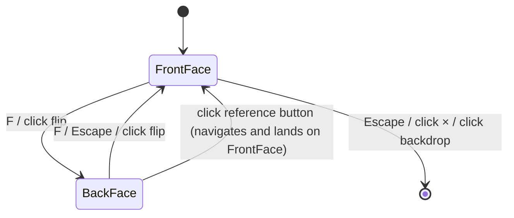
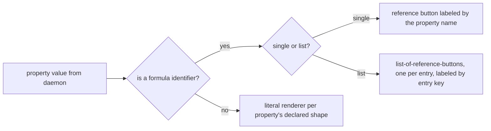
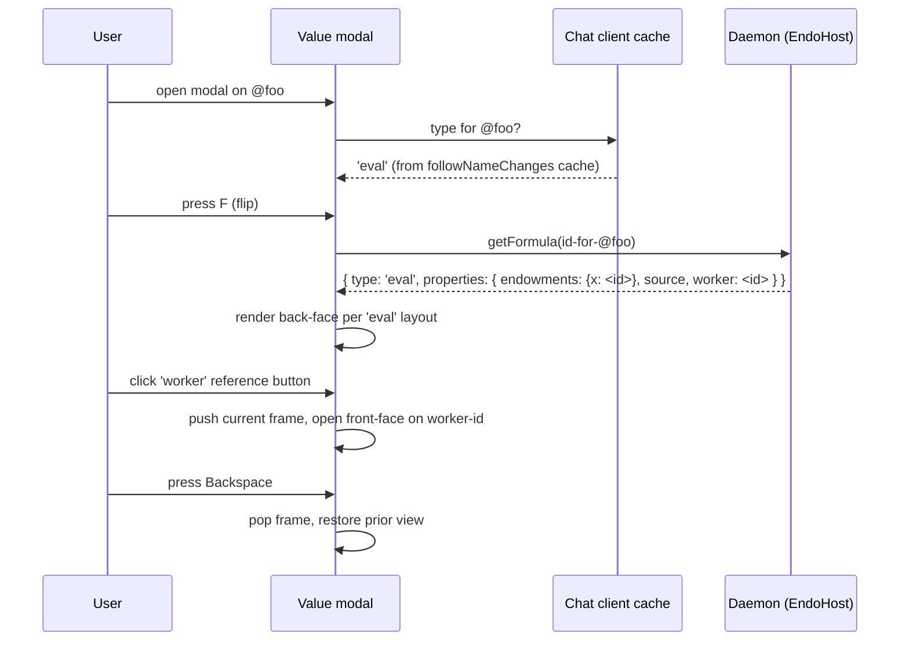

# Formula Inspector

| | |
|---|---|
| **Created** | 2026-02-14 |
| **Updated** | 2026-06-12 |
| **Author** | Kris Kowal (prompted) |
| **Status** | Not Started |

## What is the Problem Being Solved?

There is no way for a user to "pop the bonnet" and see the underlying formula for a pet-named capability.
The daemon stores rich formula structures (33 types with fields like `worker`, `source`, `endowments`, `hub`, `path`, and others) but the Chat UI and CLI only show the rendered value.
Power users and developers cannot see the formula graph that backs each capability: that an `eval` retains a `worker`, that a `guest` retains a `host` and a `handle`, that a `mount` retains its backing files.
They have to consult the daemon directly or trace pet names by hand to understand what a value depends on.

This design adds a Formula Inspector: a host-only daemon method, a CLI verb, and two Chat-side surfaces that share one layout source of truth.
The two Chat surfaces are a back-face flip on the existing Value modal (the everyday-inspection moment) and a dedicated panel (the power-tool moment with edit toggle and retention-path reveal); both render the same per-type layout taxonomy.

## Consolidation Note

This document supersedes the earlier `chat-value-modal-formula-view.md` (2026-06-12, never merged).
On 2026-06-12 the maintainer asked to consolidate the two designs and to redesign the inspector around a host-only daemon method, not the `@info` name hub.
The consolidated design preserves the card-flip back-face proposal, the per-type layout taxonomy, the stack navigation model, and the no-cycle-unwinding principle from that draft, and folds them into the existing panel-plus-CLI shape from this document.

## Description of the Design

### Daemon surface: host-only `getFormula(identifier)`

The daemon already returns per-formula-type metadata via `makePetStoreInspector` in `packages/daemon/src/daemon.js` lines 5704-5829, reachable via `InspectorHubInterface.lookup(petName | path)` and wired into the host's special-names map as `@info` at `packages/daemon/src/host.js` line 209.
That `@info` shape is misguided.
It exposes the inspector as a name hub addressable by any agent that can resolve `@info`, and it forces the user to compose paths through `@info` for every lookup, which "becomes more complicated for formulas in directories of a guest's pet store" (kriskowal 2026-06-12 inline comment on PR #439).

The replacement is a host-only daemon method.

```typescript
interface EndoHost {
  /**
   * Retrieve the formula record for the given identifier.
   * Returns the formula type plus the type-specific metadata
   * (literals plus retained-formula identifiers).
   *
   * Identifier is in the same string form as the second half
   * of a locator (`{64-char number}:{64-char node}` per
   * daemon-256-bit-identifiers.md), and must be local to this
   * node (not a cross-peer locator).
   */
  getFormula(identifier: FormulaIdentifier): Promise<FormulaRecord>;
}

type FormulaRecord = {
  type: FormulaType;                          // 'eval' | 'lookup' | 'guest' | ...
  number: string;                             // the 64-char formula number
  properties: Record<string, FormulaProperty>;
};

type FormulaProperty =
  | { kind: 'literal'; value: PassableValue }
  | { kind: 'reference'; identifier: FormulaIdentifier }
  | { kind: 'reference-list'; entries: Record<string, FormulaIdentifier> };
```

`getFormula` is added to `HostInterface` in `packages/daemon/src/interfaces.js` between `getFormulaGraph` and the closing brace, and is exposed on the `EndoHost` Far facet in `host.js`.
It is **not** added to `GuestInterface`, mirroring the precedent in [`daemon-retention-paths.md`](daemon-retention-paths.md) § Daemon surface (host-only).

#### Why host-only

Guests must not be able to retrieve formula records for capabilities they do not own.
A guest's `getFormula(myLocator)` would reveal the host's internal naming, peer relationships, and which other guests share common roots.
This is the same authority rationale `daemon-retention-paths.md` § Why host-only carries for `listRetentionPaths`: a method that surfaces the host's internal structure belongs on the host facet, not the guest facet.

The error-tracing facility in [`docs/error-tracing-design.md`](../docs/error-tracing-design.md) § EndoHost `traces` facet is a second precedent: `E(host).traces()` is host-only for the same reason (the trace aggregator surfaces worker-level internals that a guest must not enumerate).

### Removing the `@info` name hub

The `@info` entry in the host's `specialNames` map at `packages/daemon/src/host.js` line 209 is removed.
The guest's `specialNames` map at `packages/daemon/src/guest.js` lines 88-96 already omits `@info`; this change brings host parity with guest, and the host-vs-guest method delta moves from "host has `@info` in special names, guest does not" to "host has `getFormula` method, guest does not".

Three regression tests in `packages/daemon/test/endo.test.js` lines 2377-2510 exercise the `@info` lookup path (`E(AGENT).lookup(["@info", "ten", "source"])`).
These tests are rewritten to call `getFormula(identifier)` directly.
There is no deprecation alias: `@info` was a misguided shape and a one-release drop is preferable to carrying a compatibility redirect that re-encodes the same composition burden in a different surface.
The CLI's new `endo inspect` verb (see below) is the user-visible replacement for any prior workflow that composed paths through `@info`.

The standalone `InspectorHubInterface` (`lookup`, `list`) at `packages/daemon/src/interfaces.js` lines 522-525 is retired.
`makePetStoreInspector` remains as the internal implementation of `getFormula` for the per-type metadata catalog; the exo interface it constructed is no longer exposed.
`list` was always a thin wrapper on `petStore.list()`; the host's existing pet-store enumeration methods (`identifyLocal`, the `list()` on the directory facet) cover that use case.

### CLI: `endo inspect`

The CLI gains an `endo inspect <name-or-identifier>` verb.

```
endo inspect <name-or-identifier> [--identifier] [--json]
```

- Without flags, accepts a pet name (or `petname/path`) and resolves it via the host's `identify` to a formula identifier before calling `getFormula`.
- `--identifier` interprets the argument as an already-encoded formula identifier.
- Default output is human-readable: formula type as a header, then one row per property, with reference-properties rendered as the property name plus the target identifier in a dim style.
- `--json` emits the raw `FormulaRecord` for scripting.

`inspect` was chosen over the alternatives the maintainer offered (`examine`, `formula`) for parallelism with `formula-inspector.md`'s original `endo inspect` proposal (this document's prior name) and with the *Pop the bonnet* metaphor in the existing concept page.
The current CLI (`packages/cli/src/endo.js`) carries 41 verbs (`run`, `make`, `inbox`, `request`, `resolve`, ..., `log`, `ping`); none of `inspect`, `examine`, or `formula` is taken, so the choice is unconstrained by collision.
The parallel to `endo paths` (from `daemon-retention-paths.md`) and `endo locate` keeps the single-word noun-style-verb shape consistent.

### Chat: two surfaces, one layout registry

The Chat UI grows two surfaces that share one source of truth for per-type layouts.

#### Surface 1: Value modal back face (the everyday moment)

The Value modal grows a fourth action alongside the existing three (Close, Save, Enter Profile per [`chat-command-bar.md`](chat-command-bar.md) § Modal Actions).

| Action | Keyboard | Manual |
|--------|----------|--------|
| Close | `Escape` (front face) | Click × or backdrop |
| Save | `Enter` (in name field) | Click Save button |
| Enter Profile | `Shift+P` (proposed) | Click "Enter Profile" |
| **Flip to Formula / Flip to Value** | **`F`** | **Click the flip button in the modal header** |

`F` is reachable from both faces.
On the front face it flips to the back; on the back face it flips to the front.
The flip-button affordance lives in the modal header, opposite the close ×, with `aria-label="Show formula"` on the front face and `aria-label="Show value"` on the back face.
The modeline gains a `F flip to formula` hint on the front face and a `F flip to value` hint on the back face per [`chat-invariants.md`](chat-invariants.md) § Modeline Completeness.

`Escape` on the back face flips to the front face (not close), so a user who flipped to inspect can `Escape` back into context and `Escape` again to close.
This matches [`chat-invariants.md`](chat-invariants.md) § Escape Consistency: the front face is the simpler state of the two.

Animation register: a 200 ms 3D card-flip on the modal container (CSS `transform: rotateY(180deg)` with `transform-style: preserve-3d` and `backface-visibility: hidden` on both faces).
Reduced-motion fallback (under `@media (prefers-reduced-motion: reduce)`): no rotation; instead a 100 ms cross-fade with `opacity` only.

Screen-reader behavior: the flip is announced via an `aria-live="polite"` region on the modal that updates to "Showing formula for <pet-name-or-id>" on flip-to-back and "Showing value for <pet-name-or-id>" on flip-to-front.
The back face is rendered as `role="region"` with `aria-labelledby` pointing at the back-face title.
Focus moves to the back-face title on flip-to-back and to the front-face value container on flip-to-front, so a keyboard user lands in a known position after the flip.



#### Surface 2: Inspector panel (the power-tool moment)

A separate panel is reachable from a wrench/gear icon on every inventory row (per [`chat-components.md`](chat-components.md) § Inventory panel).
The panel renders the same per-type layout as the modal back face, plus:

- A **read/edit toggle** for advanced users.
  In edit mode, mutable formula fields become editable (for example, re-pointing a lookup path).
  Editing requires a new daemon method `E(host).revise(petName, patch)` on the host facet (not the guest facet) that validates and persists formula changes.
  Editing is host-only for the same authority rationale as `getFormula`.
- A **retention-paths reveal**: the panel embeds the paths viewer from [`daemon-retention-paths.md`](daemon-retention-paths.md) below the formula fields.
  When `daemon-retention-paths` lands its `followRetentionPaths` subscription, the inspector panel subscribes for the open formula and updates in place.

The panel is the everyday-inspection moment's complement: the modal back face is one quick flip for browsing, the panel is the deeper view for editing and retention-path exploration.

#### Shared layout registry

Both surfaces consume `packages/chat/formula-view-registry.js`, a single registry that maps formula type to `{ header, helpText, propertyList }`.
The modal back face renders the registry via a new file `packages/chat/formula-view-component.js` (sibling of `packages/chat/value-component.js`); the inspector panel renders the same registry via `packages/chat/formula-inspector-panel.js`.
Edits to a per-type layout land in the registry and both surfaces pick them up.

### Formula-view layout taxonomy

The back face (and the panel) are divided into a fixed header (formula-type badge, title, help text, formula identifier) and a scrollable property list.
The property list shape is the same across all formula types: an ordered list of rows, each row a `<dt>label</dt><dd>value-or-reference-button</dd>` pair.
Per-type variations differ only in *which* properties are listed and in the per-property classifier (see § Literal-vs-reference resolution).

The catalog covers all 33 formula types currently in [`packages/daemon/src/formula-type.js`](../packages/daemon/src/formula-type.js).

| Formula type | Header text | Properties (label → render) |
|---|---|---|
| `eval` | "Evaluation": code run inside a worker | `source` literal (code block, monospace), `endowments` record (list-of-references, one button per binding labeled by codeName), `worker` reference |
| `lookup` | "Lookup": name traversal | `hub` reference, `path` literal (array of names rendered as breadcrumbs) |
| `guest` | "Guest": sub-agent of a host | `hostAgent` reference, `hostHandle` reference |
| `host` | "Host": agent identity | `handle`, `hostHandle`, `keypair`, `worker`, `inspector`, `petStore`, `mailboxStore`, `mailHub`, `endo`, `networks`, `pins` (all references) |
| `directory` | "Directory": naming hub | `petStore` reference |
| `pet-store` | "Pet store": name-to-id table | (no daemon-side metadata; show empty state "No formula properties; this is a leaf store.") |
| `mailbox-store` | "Mailbox store" | (empty state, as `pet-store`) |
| `mail-hub` | "Mail hub": inbox-and-outbox facet | `store` reference |
| `message` | "Message" | (empty state until message-side metadata lands; the formula itself carries `from`, `to`, `replyTo`; treat as references when present) |
| `make-bundle` | "Make-bundle": unconfined code loaded from a bundle | `bundle` reference, `powers` reference, `worker` reference |
| `make-unconfined` | "Make-unconfined": unconfined code loaded from a specifier | `specifier` literal (string), `powers` reference, `worker` reference |
| `make-archive` | "Make-archive": code loaded from an archive | `archive` reference, `powers` reference, `worker` reference |
| `make-from-tree` | "Make-from-tree": code loaded from a tree | `tree` reference, `powers` reference, `worker` reference |
| `peer` | "Peer": remote node | `node` literal (hex), `addresses` literal (list of locator URLs) |
| `mount` | "Mount": filesystem capability | `path` literal (filesystem path), per [`daemon-mount.md`](daemon-mount.md) (additional fields surface as the formula stabilizes) |
| `scratch-mount` | "Scratch mount": daemon-managed scratch directory | (same as `mount`; the `path` is daemon-managed) |
| `git` / `git-credential` / `git-remote` | "Git" / "Git credential" / "Git remote" | (per [`daemon-git-capability.md`](daemon-git-capability.md); enumerate after that design lands) |
| `channel` | "Channel": thread substrate | (per [`daemon-message-streaming.md`](daemon-message-streaming.md); enumerate after that design lands) |
| `readable-blob` | "Readable blob": immutable bytes | (empty state; the blob is content-addressed and has no retained references) |
| `readable-tree` | "Readable tree": immutable snapshot | (empty state today; tree-side metadata can surface here when defined) |
| `promise` | "Promise": pending result | `store` reference, status (pending / fulfilled / rejected), plus the next-value or rejection-reason affordance (see § Promise-formula view) |
| `resolver` | "Resolver": write-half of a promise | `store` reference |
| `worker` | "Worker": execution sandbox | (empty state; the worker is a leaf) |
| `handle` | "Handle": receive-half of an agent | (empty state) |
| `keypair` | "Keypair": Ed25519 key material | `publicKey` literal (hex). The private key is **not** displayed; the row shows "Private key not displayed" in its place. |
| `endo` | "Endo bootstrap" | (lists root references when the formula is loaded; deferred to follow-up) |
| `invitation` | "Invitation" | `hostAgent` reference, `hostHandle` reference, `guestName` literal |
| `pet-inspector` | "Pet inspector" | `petStore` reference |
| `least-authority` | "Least authority" | (empty state) |
| `known-peers-store` | "Known peers store" | (empty state) |
| `loopback-network` | "Loopback network" | (empty state) |
| `marshal` | "Marshal" | (per the formula; enumerate when first encountered) |
| `timer` | "Timer" | `intervalMs` literal, `label` literal |

Where the table says "(empty state)" the back face still renders the header (badge, type name, help text, formula identifier) and an explicit empty-state message so the user sees the type but is not led to expect missing data.

When the daemon-side metadata catalog has not yet shipped a row (any cell marked "enumerate after that design lands"), the back face falls back to the empty state plus a one-line "Properties not yet exposed; see <design-link>" message so the gap is visible rather than silent.

### Literal-vs-reference resolution

Each property declares its render mode at the layout-taxonomy level above.
The runtime classifier is small.



The daemon returns formula-identifier strings (`{64-char number}:{64-char node}` per [`daemon-256-bit-identifiers.md`](daemon-256-bit-identifiers.md)) for properties that retain other formulas, plain JS values for literals, and records (key→identifier maps) for list-of-references properties.

**The reference button is labeled by the property name in the formula schema, not by the target's pet name.**
For an `eval` formula, the row whose value is the formula's `worker` is rendered as a button reading "worker", *not* "@my-worker" (the worker often has no pet name in the user's store).
For the `endowments` record (a `Record<codeName, formula-identifier>`), each binding becomes a button labeled by its codeName (the name the eval's source code uses), not by the source pet name nor by the target's pet name.
This rule keeps the back face truthful: the formula's property names are what the formula carries; pet names are user-side decorations that may or may not exist.

When the click target *does* have one or more pet names in the user's store, the front face the modal lands on still shows those pet name chips (per [`chat-command-bar.md`](chat-command-bar.md) § Value States).
The back face's button label and the front face's title can therefore differ; that is intentional.

### Promise-formula view

`promise` and `resolver` formulas have additional state beyond the static `store` reference.
The back face for a `promise` formula renders one of three affordances depending on the promise's status, integrated with the error-tracing facility in [`docs/error-tracing-design.md`](../docs/error-tracing-design.md).

| Status | Affordance | Behavior |
|---|---|---|
| **Pending** | "View next value" button | Subscribes to the promise via the `store` reference (the substrate where the eventual value lands) and re-renders on resolution. The subscription is per-modal-session; closing the modal drops it. |
| **Fulfilled** | Reference button labeled "value" | Points at the resolved value's formula identifier. Clicking flips the modal to that value's front face, with the existing reference-button discipline. |
| **Rejected** | Rejection reason as a literal, plus a "View trace" button | The rejection reason renders as a literal in a dim style. If the rejection carries an `errorId` annotation (per `docs/error-tracing-design.md` § Correlation key), the "View trace" button fetches `E(host).traces().lookup(errorId)` on demand and renders the resulting `TraceReport` (causal `causes` chain, plus `related` window) below the rejection reason. |

The promise subscription on pending uses the same `store`-reference shape the existing `daemon-message-streaming.md` channel substrate uses; the implementation reuses whatever streaming substrate is shipped by that design rather than introducing a new subscription mechanism.

The error-tracing integration is **on demand**, not eager: the trace is fetched only when the user clicks "View trace", matching the per-modal-session cache discipline used elsewhere.
This keeps the back face cheap for the common case (a rejection the user does not want to deep-dive on) and lets the error-tracing facility serve as the deep-dive substrate when the user does want one.

### Back-to-value navigation

**The design uses the *stack* model**: Back returns to the prior face/value.
The modal grows a back-button (`Backspace` keyboard, `←` glyph manual) that pops the most recent entry off a stack maintained internally to the modal session.
The stack lives until the modal is closed; closing clears it.

Rationale: a user inspecting an `eval` and clicking its `worker` reference expects to come back to the eval, not to lose context.
Without a stack, the user has no way to "rewind" except to re-find the entry point (token chip, inventory click, attachment, command-bar token).
Stack depth is bounded only by the user's clicks; we do not cap it in V1.

**The landed state on a referenced value is indistinguishable from clicking that value's token chip** (per [`chat-components.md`](chat-components.md) § Inventory panel and § Message display).
Concretely: clicking a reference button on the back face calls the same handler that token-chip click calls, with the formula identifier as the seed, and the modal opens on the front face with that value's identity surface (pet names if any, message context if any, ephemeral otherwise).
The user then has the choice to flip again.

### Cycle handling: principle of least surprise

**The reference walk does not unwind cycles.**
The user has a mental model of how many layers they have gone down; the modal does not meddle with it.
If the user navigates A → B → A, the stack reads `[A, B, A]` and Backspace pops one frame at a time.
A → B → A → Backspace returns to B, not to the entry-point A.

Rationale: cycle-unwinding (coalescing A → B → A into a single frame returning to the earlier A) is an invisible behavior that diverges from the click count the user just performed.
The principle of least surprise (kriskowal 2026-06-12 inline comment on PR #439) is that a Backspace pops exactly one click's worth of navigation, regardless of whether the target identifier appears earlier in the stack.
This matches browser-back behavior and is the simplest semantics to reason about.

The modeline on the back face displays the stack depth (`stack 2/3`) so the user can see they are deeper than the entry point.
A cycle never blocks navigation; the reference button is always live.

### Daemon API and Chat data flow

The Chat client consumes two surfaces.

1. **`followNameChanges()` extension from [`inventory-grouping-by-type.md`](inventory-grouping-by-type.md).**
   That design adds a `type` field to the change events:
   ```js
   // before: { add: 'my-file' }
   // after:  { add: 'my-file', type: 'eval' }
   ```
   The Chat client caches the `type` per pet name as it streams.
   When the user opens the modal, the type is already on the client side; no extra round-trip is needed to pick the right back-face layout.
   This is the *additive-shape* discipline from `inventory-grouping-by-type.md` (old consumers that destructure only `add` / `remove` are unaffected).
2. **`E(host).getFormula(identifier)`** for the per-type properties.
   This is called *lazily* on first flip-to-back (modal) or panel-open (panel) per session.
   The result (literal values plus formula-identifier references) is cached for the session so subsequent flips back-and-forth are cheap.
   The cache is per-modal-session or per-panel-session, not global.

For values that did not arrive via `followNameChanges` (ephemeral values from `/list`, message-attachment values, and similar), the type is not yet on the client.
For those the client falls back to a single `getFormula(identifier)` round-trip on first flip; the response carries both the type and the properties.



### Implementation notes

The per-type layouts are a small registry in the Chat client.

- A new file `packages/chat/formula-view-component.js` (sibling of `packages/chat/value-component.js`) renders the modal back face.
- A new file `packages/chat/formula-inspector-panel.js` renders the dedicated panel; it embeds `formula-view-component.js` for the property list and adds the read/edit toggle and the retention-paths embed.
- A registry `packages/chat/formula-view-registry.js` maps formula type → `{ header, helpText, propertyList }` per the *Formula-view layout taxonomy* table.
  Both surfaces consume the same registry.
- `packages/chat/value-component.js` grows the flip control, the back-face mount point, and the back-stack.
- CSS variables added: `--card-flip-duration`, `--card-flip-easing`; the reduced-motion rule overrides duration to `0ms` and disables the rotation.
- Daemon-side: `EndoHost.getFormula(identifier)` is added to `HostInterface` and to the `EndoHost` Far facet in `host.js`; the `@info` row at `host.js` line 209 is removed; `makePetStoreInspector` becomes the internal implementation of `getFormula` (its outer exo construction is deleted; only the per-type metadata function survives); `InspectorHubInterface` is removed from `interfaces.js`.
- The `revise(petName, patch)` method (for the panel's edit toggle) is added to `HostInterface`; it validates and persists formula changes and is gated to the host facet only.

### Affected Packages

- `packages/daemon`: add `getFormula` and `revise` to `EndoHost`; remove `@info` from host special names; rewrite the three `@info` regression tests in `endo.test.js` to call `getFormula` directly; retire `InspectorHubInterface`.
- `packages/chat`: new formula-view component, new inspector panel, shared layout registry; flip control on the Value modal; wrench/gear icon on inventory rows; retention-paths embed when `daemon-retention-paths` lands.
- `packages/cli`: new `endo inspect <name-or-identifier>` command.

## Options Considered

| Option | Decision | Rationale |
|---|---|---|
| **Daemon surface**: keep `@info` (extend) versus replace with host method `getFormula` | **Host method `getFormula`** | `@info` forces composed paths through a name hub and exposes the inspector to any agent that resolves `@info`; the redesign aligns the inspector with the host-only authority shape used by `daemon-retention-paths` and the `traces` facet from `docs/error-tracing-design.md`. Considered and rejected: *deprecation alias (`@info` redirects onto `getFormula` for one release)*. Reason: a redirect re-encodes the same composition burden in a different surface; the test rewrite is cheap. |
| **CLI verb**: `inspect` versus `examine` versus `formula` | **`inspect`** | Parallel to the existing `endo inspect` proposal in this document's prior draft; parallel to the *Pop the bonnet* metaphor in the concept page; parallel to the single-word noun-style-verb shape of `endo paths`, `endo locate`, `endo show`. |
| **Two Chat surfaces (panel + modal back face) versus one** | **Two surfaces, one layout registry** | The modal back face is the everyday-inspection moment (one flip, no context switch); the dedicated panel is the power-tool moment (edit toggle, retention-paths viewer). Folding them loses one of the two moments. The shared registry keeps the maintenance burden flat. |
| **Navigation model**: stack versus replace | **Stack** | Preserves entry-point context across the reference walk; matches user expectation from browser-back; bounded only by user clicks. Considered and rejected: *replace*. Reason: loses context after one click. Maintainer ack 2026-06-12: "Stack model sounds good to me." |
| **Cycle handling**: leave-as-is versus de-duplicate | **Leave as-is (principle of least surprise)** | The user's mental model of stack depth matches their click count; coalescing A → B → A into one frame back to A is an invisible behavior that diverges from that mental model. Maintainer ruling 2026-06-12: "Principle of least surprise: do not unwind cycles. The user has a mental model of how many layers they have gone down that we should not meddle with." |
| **Reference-button label**: property name versus target pet name | **Property name** | The property name is on the formula and always present; the target's pet name is a user-side decoration that may or may not exist. Labeling by property name keeps the back face truthful and consistent across users. |
| **Escape on back face**: flip-to-front versus close-modal | **Flip-to-front** | Matches `chat-invariants.md` § Escape Consistency. Two Escapes from the back face closes the modal, consistent with the modal-stack metaphor. |
| **Promise rendering**: status-aware (subscribe + error-tracing) versus static `store` reference | **Status-aware** | A `promise` formula's interesting content is its eventual value (or rejection); a static `store` reference reveals only the substrate. The subscribe-and-button-to-view-next-value pattern matches kriskowal's directive 2026-06-12 and the error-tracing integration uses the existing `EndoHost.traces()` facet rather than introducing a new error surface. |

## Security Considerations

- **Surface visibility**: The Formula Inspector reveals the formula's retained references and literals to the owning host.
  `getFormula` and `revise` are host-only; guests do not have access (mirroring the precedent in `daemon-retention-paths.md` and `docs/error-tracing-design.md`).
- **Keypair caveat**: For `keypair` formulas, the back face and panel display the *public* key only.
  The private key is on the formula JSON (per [`daemon-256-bit-identifiers.md`](daemon-256-bit-identifiers.md) § Per-Agent Keypairs) but **must not** be rendered; the `keypair` row explicitly omits the `privateKey` property and shows a "Private key not displayed" note in its place.
- **Cross-peer locators**: `getFormula(identifier)` accepts only local formula identifiers, not cross-peer locators.
  Cross-peer formula content is the remote host's concern; surfacing it would require a CapTP round-trip that this design does not propose.
- **Editing authority**: `revise(petName, patch)` is gated behind host-level authority and logs an audit trail.
  Editing validates formula invariants (a `worker` field must reference a valid worker formula, and so on).
- **Trace access for rejected promises**: the "View trace" button calls `E(host).traces().lookup(errorId)`, which is host-only (per `docs/error-tracing-design.md` § Confidentiality and security).
  A guest seeing the modal back face for a rejected promise sees the rejection reason but no "View trace" affordance, because the guest's facet does not include `traces`.

## Scaling Considerations

- **Per-session cache**: `getFormula` results are cached per modal session (and per panel session).
  The cache is dropped on close.
  A deep reference walk through a single session is at worst one round-trip per distinct formula visited.
- **No new subscriptions** (except the promise-pending case): the back face and panel are snapshots at flip/open time.
  If the formula is mutated mid-session, the user re-opens or re-flips to refresh.
  The promise-pending subscription is a single-shot subscribe-once-and-render-on-resolve; it does not poll.
- **Retention-paths subscription** (panel only): when the panel embeds the paths viewer from `daemon-retention-paths.md`, it uses that design's microtask-coalesced `followRetentionPaths` so one formulation does not produce N deltas.
- **Large endowments records**: an `eval` with hundreds of endowments produces a long property list.
  The property list is independently scrollable; we do not paginate in V1.
  If real usage shows a need we revisit (consider virtual-scrolling or a search box).

## Test Plan

Exercise what is implemented.

- **Daemon unit tests** for `getFormula`: each formula type returns the expected per-type metadata; cross-peer locators are rejected with a clear error; the three pre-existing `@info` regression tests in `endo.test.js` lines 2377-2510 are rewritten to call `getFormula` and continue to assert the same per-type properties.
- **Daemon authority test**: a guest's facet does not expose `getFormula` or `revise`; attempting to call them through a guest-only edge fails with the standard "no such method" guard-rejection.
- **CLI integration test**: `endo inspect <name>` prints the expected per-type output for `eval`, `lookup`, `guest`, and `host` formulas; `--json` emits the raw record.
- **Unit tests for the formula-view-registry**: each row in the layout-taxonomy table renders the expected header, help text, and property list shape for a synthetic input.
- **Component tests** (Playwright per [`chat-playwright-smoke.md`](chat-playwright-smoke.md)) for the modal back face:
  - Open the modal on an `eval` value; press `F`; assert the back face renders the `eval` layout.
  - Click the `worker` reference button; assert the modal lands on the front face for the worker.
  - Press `Backspace`; assert the modal returns to the `eval` (front face).
  - Press `Escape` on the back face; assert flip-to-front, not close.
  - Press `Escape` on the front face; assert close.
- **Component tests for the panel**: open the wrench/gear from an inventory row; assert the panel renders the same per-type layout as the modal back face; toggle edit; assert the `revise` call shape.
- **Reduced-motion test**: set `prefers-reduced-motion: reduce`; assert the flip uses cross-fade rather than rotation.
- **Screen-reader smoke test**: assert the `aria-live` region updates on flip and that focus moves to the back-face title on flip-to-back.
- **Cycle test**: construct a formula graph A → B → A; navigate A → B → A; assert stack depth `2/3` indicator; pop twice to A (no coalescing).
- **Keypair test**: assert that the `keypair` back face and panel show the `publicKey` row and explicitly do not show a `privateKey` row.
- **Promise-formula test**: a pending promise renders the "View next value" button; resolving the promise updates the back face to show the resolved value's reference button; a rejected promise renders the rejection reason plus a "View trace" button that fetches the `TraceReport`.

## Compatibility Considerations

- **`@info` removal**: the three regression tests that exercise `@info` are rewritten as part of this change; there is no deprecation alias.
  Any external script that composed paths through `@info` migrates to `endo inspect` (CLI) or `E(host).getFormula(identifier)` (programmatic).
  The migration is documented in the change's release notes.
- **`InspectorHubInterface` removal**: no in-tree consumer survives the migration; `makePetStoreInspector`'s inner per-type function is retained as the implementation of `getFormula`.
- **`followNameChanges` `type` field**: depends on [`inventory-grouping-by-type.md`](inventory-grouping-by-type.md).
  If that design ships after this one, the Chat client falls back to per-flip `getFormula` for the type and the implementation degrades gracefully.
- **Modal API**: `value-component.js`'s public seam (`focusValue(value, id, petNamePath, messageContext)`) is unchanged.
  The back-stack and flip state are internal.
- **Modeline**: gains one new hint (`F flip to formula/value`) on the modal-open states; existing hints unchanged.

## Upgrade Considerations

- **State**: no daemon-side state changes for the read path.
  The edit path (`revise`) requires versioning the formula persistence format; that's deferred until the panel's edit toggle is shipped.
- **Persistence**: no formula-schema migration for the read path.
- **Forward compatibility with `daemon-retention-paths.md`**: when Phase 2 of that design ships (the `followRetentionPaths` subscription per PR #284 follow-up), the inspector panel imports the paths viewer; the formula-view-registry is unchanged.

## Dependencies

| Design | Relationship |
|---|---|
| `daemon-retention-paths` (In Progress) | The inspector panel embeds the retention-paths viewer below the formula fields; Phase 2 subscription powers the live update. |
| `inventory-grouping-by-type` (Not Started) | Supplies the `followNameChanges` `type` field so the modal back face can pick the right layout without an extra round-trip. |
| `docs/error-tracing-design.md` (Reference) | Supplies the `EndoHost.traces()` facet that the rejected-promise view uses to fetch causal traces on demand. |
| `daemon-message-streaming` (In Progress) | Supplies the substrate the pending-promise subscription rides on for the "View next value" affordance. |
| `chat-command-bar` (Active) | The Value modal lives here; the `F` flip key and the modeline hint extend its modal-action vocabulary. |
| `chat-components` (Complete) | The inventory row's wrench/gear icon is a new chat-components-style affordance. |
| `chat-invariants` (Complete) | The `Escape` flip-to-front behavior is governed by the Escape Consistency rule. |
| `daemon-256-bit-identifiers` (Complete) | Supplies the formula-identifier string shape and the per-agent keypair structure. |

## Open Questions

1. **`revise(petName, patch)` patch shape**: the existing draft proposes a free-form patch object.
   A future revision may want to constrain it (for example, only certain fields are mutable per formula type).
   Defer to the implementation; the panel's edit toggle is the natural place to surface the constraint.
2. **Card-flip animation register**: no existing card-flip in the Chat UI; the choice (200 ms 3D rotateY plus reduced-motion cross-fade) is a first-instance decision (per kriskowal 2026-06-12: "This will be new.").
   Once an animation register exists at the Chat level, this design conforms to it.
3. **Enter-Profile keyboard parity (`Shift+P`)**: the existing modal has `N/A` keyboard for Enter Profile per [`chat-command-bar.md`](chat-command-bar.md) (acknowledged parity gap).
   This design proposes `Shift+P` to retire the gap simultaneously.
   The maintainer ack on 2026-06-12 is "Let's implement this."

## Prompt

The original prompt that started the design (2026-02):

> Provide a way for a user to "pop the bonnet" and see the underlying formula for a pet-named capability.
> Make formula identifier references clickable so the user can navigate.
> Add an edit toggle for advanced users.
> Add a CLI `endo inspect <name>` command.
> Provide a facility for revealing every retention path in the formula graph.

Plus the 2026-06-12 maintainer consolidation directive on PR #439:

> Please consolidate this design into the existing formula inspector design.
> Synthesize the best of both.
> Drop the `@info` hub: prefer a method of Host agents that is absent on Guest agents, that can retrieve the formula for any identifier (but not for any locator, as these span peers).
> Create a CLI/GUI verb like `inspect` or `examine` or `formula` to replace the former idiom.
> The view for a promise formula will need to subscribe to the promise and provide a button to view the next value when it resolves, or the rejection reason. This should be integrated with error tracing.
> Principle of least surprise: do not unwind cycles. The user has a mental model of how many layers they have gone down that we should not meddle with.
