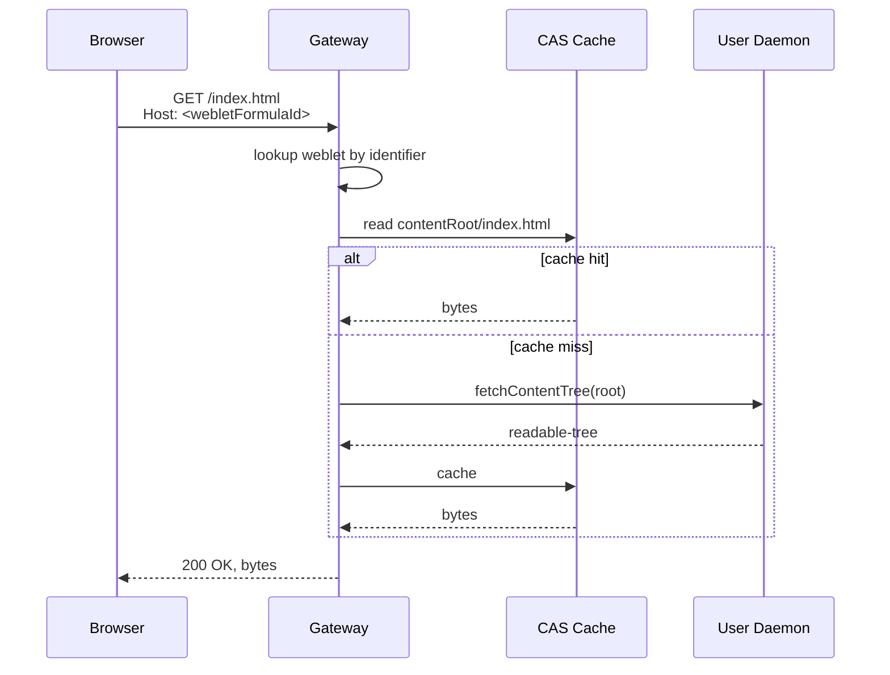
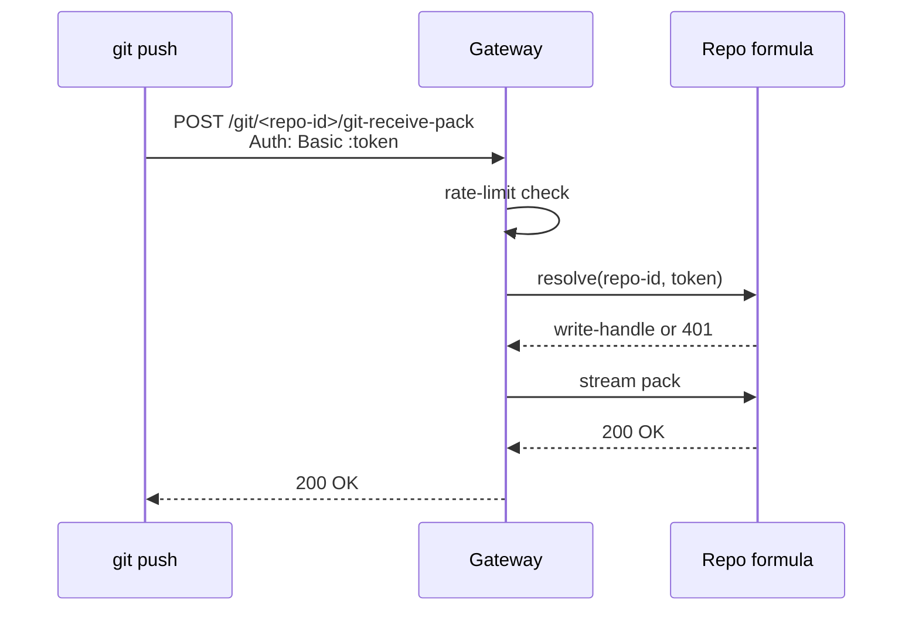
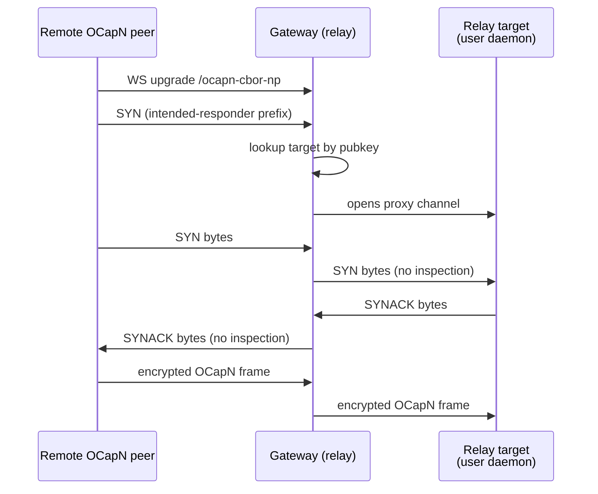

# @endo/gateway Package

| | |
|---|---|
| **Created** | 2026-05-22 |
| **Updated** | 2026-05-23 |
| **Author** | Kris Kowal (prompted) |
| **Status** | Proposed |
| **Supersedes** | [endo-gateway](endo-gateway.md) |

## What is the Problem Being Solved?

The Endo daemon currently bundles its HTTP+WebSocket server inside
[`packages/daemon`](../packages/daemon)
as the `@apps` unconfined guest formula
([`daemon-web-gateway`](daemon-web-gateway.md), Complete).
That shape works for the per-user developer install: one OS user,
one daemon, one port, one weblet hierarchy, one CapTP bridge for
Chat.
It does not extend to the shapes the project now wants the gateway
to support:

1. A **per-host system service** that virtual-hosts many users on
   one address and registers from a UNIX-domain bootstrap socket
   ([`endo-gateway`](endo-gateway.md) sketches this; the present
   design subsumes and reframes it).
2. A **public web service** reachable from the internet, serving
   the Chat application, Git-over-HTTP, OCapN over a Noise-encrypted
   WebSocket, and per-tenant weblets.
3. A **Familiar-bundled fallback** that the Electron shell can stand
   up on an OS-assigned port for exactly one user when no system
   gateway is installed.
4. A **CapTP relay-as-a-service** for customers or the public.
5. An **administrator handle** for the local system administrator,
   distinct from any one user's daemon authority.

These uses share most of their machinery (HTTP framing, virtual
hosting, the Noise-over-WebSocket OCapN endpoint, the content-
addressed static-asset cache), but they need to compose
differently across deployments.
A single binary configuration cannot serve all of them without
re-introducing the per-user, multi-user, and bundled-fallback
forks the existing design corpus has been working around one PR
at a time.

The proposal is to extract the gateway concerns from `@endo/daemon`
into a new package, **`@endo/gateway`**, that exposes a `make({ ... })`
factory returning a hardened exo.
The daemon embeds it when run as the per-user developer install
(today's shape), the Familiar embeds it for the bundled fallback,
and a separate `@endo/gateway-daemon` entry point (a thin wrapper)
runs it as the system-service variant.
The ten features in the maintainer directive land as configurable
subsystems of the same package, gated by configuration rather than
by binary.

The shorter framing: **the gateway is becoming a thing in its own
right; give it a package.**

This document covers the overarching shape of that package, the ten
feature subsystems, the capability surface, the configuration
model, and a phased rollout.
It supersedes [`endo-gateway`](endo-gateway.md) and integrates the
weblet, Familiar, and OCapN-Noise designs cited in the Dependencies
table below.
Where [`endo-gateway`](endo-gateway.md) named specific decisions
(no TLS in the gateway, Noise in-band, `@apps` NameHub, distinct
config trees, IPC socket for local-vs-remote attestation, public-key
rotation as a follow-up), those decisions carry forward verbatim
unless explicitly revised in the Design Decisions section below.

## Package Shape

The new package lives at `packages/gateway/` in the monorepo.

```
packages/gateway/
  package.json
  src/
    index.js              # make({ ... }) factory
    types.d.ts            # public types
    bind.js               # listener + ENDO_HTTP_ADDR parsing
    vhost.js              # Host-header → weblet routing
    cas.js                # content-addressed static-asset cache
    git-http.js           # smart-HTTP Git endpoint
    bootstrap-uds.js      # UNIX-domain registration bootstrap
    relay.js              # CapTP relay over OCapN
    ocapn-ws.js           # /ocapn-cbor-np WebSocket subprotocol
    proxy-headers.js      # X-Forwarded-* trust model
    config.js             # env + config-file parse
  test/
```

The package's public surface is a single factory:

```ts
import { make } from '@endo/gateway';

const gateway = await make({
  powers,            // filesystem, net, crypto, time
  config,            // see Configuration Model below
  hostAgent,         // optional: per-user host this gateway serves
  trustedProxy,      // optional: HTTPS-terminating proxy contract
});

await E(gateway).start();
// ...
await E(gateway).stop();
```

`make({ ... })` returns a hardened exo with an `M.interface` guard
(per `project/CLAUDE.md` § makeExo).
The exo exposes `start`, `stop`, `getBindAddress`, `getApps`,
and feature-specific facets named per the Capability Surface
section below.

The gateway does not own the formula graph, the content store, or
the worker pool.
Those remain in `@endo/daemon`.
The gateway holds:

- An HTTP listener (Node `http.Server`).
- A WebSocket server (`@endo/ws-relay` style, see `packages/daemon/src/networks/ws-relay.js`).
- A virtual-host registration table (Host header → weblet handle).
- A content-addressed read-through cache for static assets.
- A registration table for OCapN public keys to relay targets.
- Optionally, a UNIX-domain bootstrap socket for local registration.

It composes with `@endo/daemon` via the same `@apps` NameHub the
current built-in gateway uses
([`daemon-web-gateway`](daemon-web-gateway.md)); the daemon
formulates a gateway in the same place it formulates `@apps`
today, but the gateway code lives in `@endo/gateway` rather than
inline in `packages/daemon/src/web-server-node.js`.
The Familiar's bundled variant uses the same package with a
different configuration (OS-assigned port, single-user, no UDS
bootstrap).

## Bind Shape

The gateway binds to **`0.0.0.0:3469`** by default, overridable
via the `ENDO_HTTP_ADDR` environment variable.

The maintainer directive names this port and env var explicitly.
`0.0.0.0` makes the bind public to the host's network interfaces;
this is appropriate because the gateway is intended as a public
web service.
Operators who want a private bind override:

```sh
ENDO_HTTP_ADDR=127.0.0.1:3469 endo-gateway
ENDO_HTTP_ADDR=[::1]:3469 endo-gateway
ENDO_HTTP_ADDR=0.0.0.0:0 endo-gateway      # OS-assigned port
```

The `ENDO_HTTP_ADDR` value is a host:port pair parseable by
Node's `URL` (with the IPv6 brackets convention).
The gateway parses it with the same `port !== '' ? Number(port) : default`
rule called out in `project/CLAUDE.md` § Familiar to handle the
OS-assigned `:0` case correctly.

`ENDO_HTTP_ADDR` is distinct from the existing `ENDO_ADDR`
(default `127.0.0.1:8920`) used by the per-user daemon's existing
web server.
The two coexist during the transition: a host running today's
per-user daemon (binding `ENDO_ADDR`) can also run an `@endo/gateway`
on `ENDO_HTTP_ADDR=0.0.0.0:3469` without a port conflict.
After the gateway lands and the per-user daemon's built-in server
is retired, `ENDO_ADDR` is deprecated and `ENDO_HTTP_ADDR` is the
single source of truth.

The IPv4-vs-IPv6 default: `0.0.0.0` is IPv4-only.
On a dual-stack host that wants both, the operator binds two
gateway instances (one IPv4, one IPv6) or uses `[::]:3469` (which
on Linux with `IPV6_V6ONLY=0` accepts both).
The default stays IPv4-only because IPv4 reachability is the
broader case for the public-web-service use; the operator who
wants IPv6 overrides explicitly.

For the **Familiar-bundled variant** (feature 5), the bind shape
changes: the Familiar always sets `ENDO_HTTP_ADDR=127.0.0.1:0`
(localhost only, OS-assigned port) and the Familiar's
`localhttp://` protocol handler
([`familiar-localhttp-protocol`](familiar-localhttp-protocol.md))
proxies through the OS-assigned port instead of the default 3469.
The Familiar does not bind a public address.

## Feature Decomposition

The maintainer directive lists ten features.
Each subsection names what the feature is, how it composes with
the existing corpus, the phase it lands in, and which questions
it leaves open.

### Feature 1: Chat-hosting with payment-token enhancement

The gateway hosts the Chat application as the entry-point weblet
on the default virtual host (`http://<gateway-host>/` with no
weblet-id subdomain).
The Chat weblet today connects to a per-user daemon over the
`fetch(token)` WebSocket call
([`daemon-web-gateway`](daemon-web-gateway.md),
[`gateway-bearer-token-auth`](gateway-bearer-token-auth.md)); that
flow carries forward, with the gateway routing the WS upgrade to
the user daemon identified by the bearer token.

The **payment-token enhancement** is the new bit: the gateway
exposes a resource-accounting surface (compute, storage, network
counters), and the Chat weblet renders a purchase UI that
credits resource tokens onto the user's account.
The split:

- **Gateway responsibility:** maintain per-account resource counters
  (compute seconds, storage bytes, network bytes), expose a
  CapTP-reachable `ResourceLedger` exo with `getBalance`,
  `chargeBalance`, and `purchaseTokens` methods, and gate
  resource-intensive operations on a positive balance.
- **Chat weblet responsibility:** render the purchase UI, integrate
  with the payment processor (Stripe, Coinbase Commerce, or
  similar), receive payment-completion webhooks, and call
  `E(resourceLedger).purchaseTokens(tokens, paymentProof)` to credit
  the balance.

The payment processor is **out of scope for `@endo/gateway`** and
is contracted via the `ResourceLedger`'s `purchaseTokens(tokens,
proof)` interface; the `proof` is opaque to the gateway, validated
by an external `PaymentProcessor` exo the operator supplies in
configuration.
This keeps the gateway agnostic to the specific payment system.

The resource-accounting surface is implementable independent of
the payment integration; phase 2 lands the ledger and metering,
phase 4 lands a reference payment-processor adapter.

**Open question:** the granularity of the resource counters (per-
request vs. per-session vs. per-weblet), and whether the gateway
itself owns the metering or delegates to the per-user daemon.
This depends on the trust model: the gateway can meter its own
HTTP/WS traffic, but it cannot directly meter compute inside a
user daemon's worker without instrumentation in the daemon side.
Surfaced rather than answered.

### Feature 2: Virtual hosting (Host header → Weblet formula)

The gateway routes incoming HTTP and WebSocket traffic by the
`Host` header to the corresponding weblet.
A **Weblet formula** designates the content for that virtual host;
the gateway resolves the formula on first contact, caches the
result, and serves subsequent requests from cache.

**Virtual hosting is not DNS-based.**
The `Host` header is not interpreted as a public DNS name; it is
the daemon/gateway-assigned weblet identifier (or a prefix
thereof) that the Familiar synthesizes for each request.
The Familiar's `localhttp://` protocol handler
([`familiar-localhttp-protocol`](familiar-localhttp-protocol.md))
sets `Host` to the weblet's gateway-assigned identifier before
proxying; a remote client that opens a WebSocket through the
gateway sets `Host` to the relay-assigned identifier of the
weblet it intends to reach.
This frees the design from DNS registration, certificate
provisioning per virtual host, and operator-managed name
allocation. The collision question reframes: the namespace is
gateway-assigned, not user-chosen, so collisions are a gateway
allocation concern rather than a user-policy one.

The Weblet formula is a new daemon-side formula type with the
following shape:

```ts
interface WebletFormula {
  type: 'weblet';
  /** Content tree to serve as static assets. */
  contentRoot: FormulaIdentifier;       // readable-tree per
                                        // daemon-weblet-application.md
  /** Optional per-extension MIME-type overrides. */
  mimeTypes?: Record<string, string>;
  /** Optional SSR-route handler. */
  ssrHandler?: FormulaIdentifier;
  /** Optional virtual-host names this weblet may bind. */
  virtualHosts?: ReadonlyArray<string>;
}
```

The gateway exposes the **`@apps` NameHub** on each host agent's
special-names (already the convention per
[`endo-gateway`](endo-gateway.md) and
[`familiar-bundled-agents`](familiar-bundled-agents.md)).
`@apps` is a NameHub: each entry is a `(virtualHostName,
webletFormulaId)` mapping.
The host agent's user holds the capability to register, update,
and revoke entries.
The short name `chat` in the example below is a local alias on the
user's `@apps` NameHub; the gateway routes by the bound
`webletFormulaId`, not by the alias.

```js
// On a host agent:
await E(agent).lookup('@apps');           // → AppsNameHub
await E(apps).bind('chat', chatWebletId);
await E(apps).bind('inbox', inboxWebletId);
// Gateway now routes Host: <chatWebletId> and Host: <inboxWebletId>
// (or a registered prefix thereof) to the corresponding weblets.
```

For multi-user hosts, each user's `@apps` NameHub is local to
their host agent; the gateway aggregates the bindings from every
registered user into its routing table.
Because the `Host` header carries a gateway-assigned identifier
rather than a user-chosen DNS name, there is no cross-user
collision over names like `chat`; the identifier namespace is
allocated by the gateway and is per-weblet-formula by
construction.

The content-tree resolution path:

1. Gateway receives `GET /index.html`, `Host: <webletFormulaId>`
   (the Familiar or remote client set the header to the
   gateway-assigned weblet identifier).
2. Gateway looks the identifier up in its virtual-host table
   → `webletFormulaId`.
3. Gateway fetches the weblet formula from the originating user
   daemon (or its cache).
4. Gateway resolves `index.html` against `webletFormula.contentRoot`
   (a `readable-tree`, content-addressed).
5. Gateway serves the bytes directly from its CAS, applying
   `mimeTypes` overrides and inferring otherwise (per
   [`daemon-weblet-application`](daemon-weblet-application.md)).

The SSR-route handler is invoked for requests that do not match a
file in the content tree; the gateway forwards
`(method, path, headers, body)` to the user daemon as a CapTP
call and returns the response.
This is the existing dynamic-fallback path per
[`endo-gateway`](endo-gateway.md) § Routing an HTTP request.



Phase 1.

### Feature 3: Git over HTTP, formula-identifier bearer-token

The gateway hosts the Git **smart HTTP** protocol (the
`info/refs?service=git-upload-pack` / `git-receive-pack` shape) for
push and pull, authenticated by a formula-identifier bearer token.

URL shape: `/git/<repo-id>/info/refs?service=git-upload-pack`,
where `<repo-id>` is a Git-repo formula identifier (a new daemon
formula type wrapping a Git working tree or a packed reference).
Authentication is HTTP Basic with the formula identifier as the
password (Git's standard Bearer scheme is awkward in many clients;
Basic auth with an empty username and the token as the password is
the de-facto convention for token-authenticated Git over HTTPS).

Alternative: HTTP Bearer (`Authorization: Bearer <formula-id>`)
where the client supports it (`git-credential` does, after some
configuration).
The gateway accepts both; the client chooses.

The formula-identifier bearer token is **the same 256-bit hex
string** already used as the `fetch(token)` argument on the Chat
gateway
([`gateway-bearer-token-auth`](gateway-bearer-token-auth.md),
[`daemon-256-bit-identifiers`](daemon-256-bit-identifiers.md)).
The token grants the authority of whichever formula it identifies;
for Git the relevant formulas are repo handles with read-only or
read-write powers.

Rate-limiting and CIDR-allowlisting reuse the existing
`gateway-bearer-token-auth` machinery; the gateway exposes both
the Chat WS endpoint and the Git HTTP endpoint under the same
rate-limiter table keyed by remote IP.



The smart-HTTP framing is the standard `pkt-line` format defined
in Git's `Documentation/technical/http-protocol.txt`; the gateway
proxies the byte stream from the client to the repo formula
without parsing the Git protocol itself.
The repo formula's exo exposes `gitUploadPack(reader, writer)` and
`gitReceivePack(reader, writer)` methods that the gateway invokes.

Phase 3.

**Open question:** the rotation story for formula-identifier
bearer tokens.
Today the formula identifier is permanent; rotating it requires
re-issuing every saved Git remote URL.
This is the same as `gateway-bearer-token-auth.md`'s "token
secrecy" warning and inherits the Pass-Invariant-Eq follow-up
from [`endo-gateway`](endo-gateway.md) § Open Questions 1.
Surfaced rather than answered.

### Feature 4: UDS bootstrap for local CapTP relay registration

The gateway optionally exposes a **UNIX-domain socket** with a
bootstrap object that has implicit authority to register CapTP
relays for local users.
This is the system-service-variant configuration.

The socket path defaults to `/run/endo-gateway/bootstrap.sock`
when the gateway runs as a system service (matching
[`endo-gateway`](endo-gateway.md) § Registration Protocol), or
`${XDG_RUNTIME_DIR}/endo-gateway/bootstrap.sock` when it runs
under a user account.
The access mode is 0700 (owner-only) by default; the operator may
relax to 0770 with a group whitelist for multi-user hosts.

The bootstrap exo speaks CapTP, framed by netstrings as
`packages/daemon/src/connection.js` already does for the daemon's
CLI socket.
The bootstrap exposes:

```ts
interface GatewayBootstrap {
  /** Register a relay for an OCapN public key. */
  registerRelay(args: {
    publicKey: Uint8Array;            // Ed25519 public key
    proofOfPossession: Uint8Array;    // signature over a fresh nonce
    relayTarget: UserDaemonHandle;    // where to forward sessions
  }): Promise<RelayRegistration>;

  /** Get the gateway's bind address. */
  getBindAddress(): Promise<string>;

  /** Get the @apps NameHub for the calling user's host. */
  getApps(userHandle: HostHandle): Promise<AppsNameHub>;

  /** Issue a fresh nonce for proof-of-possession. */
  challenge(): Promise<Uint8Array>;
}
```

The `proofOfPossession` step is identical to
[`endo-gateway`](endo-gateway.md) § Handshake: the client signs a
fresh nonce returned by `challenge()`, the gateway verifies under
the claimed public key, then accepts the registration.
This prevents one local OS user from registering another user's
public key.

The **implicit authority** the directive names is the
`registerRelay` capability itself: any process that can connect
to the UDS gets a `GatewayBootstrap`, and from it the right to
register relays.
The filesystem permissions on the socket gate who-may-connect;
the proof-of-possession step gates which-public-keys-may-register.

Phase 2.

### Feature 5: Familiar-bundled fallback on OS-assigned port

When the system gateway is not available (no installation
privileges, or a per-user-developer install), the Familiar
embeds `@endo/gateway` and stands it up on an OS-assigned port
bound to `127.0.0.1:0`.
The Familiar's `localhttp://` protocol handler
([`familiar-localhttp-protocol`](familiar-localhttp-protocol.md))
then proxies through the OS-assigned port instead of the default
3469.

The Familiar reads the gateway's actual port after bind:

```js
const gateway = await make({
  powers,
  config: {
    bindAddress: '127.0.0.1:0',
    enableFeatures: {
      virtualHosting: true,
      chatHosting: true,
      ocapnWebSocket: true,
      udsBootstrap: false,
      gitHttp: false,
      captpRelay: false,
    },
  },
});
await E(gateway).start();
const bindAddress = await E(gateway).getBindAddress();
// bindAddress === "127.0.0.1:54321"
familiar.configureLocalhttpProxy(bindAddress);
```

The **dual-binary-vs-shared-package question**: `@endo/gateway` is
the same code in both configurations.
Configuration branches gate which features are active.
There is no separate `@endo/gateway-familiar` package; the
Familiar simply imports `@endo/gateway` and passes a different
configuration.

A separate binary entry point (`@endo/gateway-daemon`) exists for
the system-service variant; it is a thin wrapper around
`@endo/gateway` that reads environment variables and config
files, then invokes `make(...)`.
The Familiar does not use this wrapper; it embeds the package
directly in its main process.

Phase 3.

### Feature 6: Public CapTP relay

When configured to relay, the gateway exposes the OCapN-Noise
WebSocket endpoint (feature 8) to the public internet and
forwards incoming sessions to the registered relay target keyed
by the destination public key.

The relay's responsibilities:

- Accept inbound OCapN sessions on `/ocapn-cbor-np`.
- Read the destination public key from the Noise handshake's
  intended-responder prefix (per
  [`ocapn-noise-network`](ocapn-noise-network.md)).
- Look up the registered relay target for that public key in the
  relay registration table (populated via UDS bootstrap, feature
  4).
- Establish a frame-level proxy between the public WebSocket and
  the registered target (which may be a local UNIX-socket-attached
  user daemon, a Tor onion service, or another gateway).
- Pump Noise-encrypted frames in both directions; the gateway is
  a frame relay and never decrypts.

**Per-peer authentication** is provided by Noise in-band: the
peer's Ed25519 public key is bound to the session by the Noise
XX (or IK, per [`ocapn-noise-cryptographic-review`](ocapn-noise-cryptographic-review.md))
handshake.
The gateway sees only Noise-encrypted ciphertext after the
handshake; relay targets receive the same ciphertext and complete
the handshake themselves.



**Abuse prevention** is an open question; candidate mechanisms:

- Per-public-key rate limit (N sessions/minute).
- Per-IP rate limit (already in `gateway-bearer-token-auth`).
- Registration-required: relay targets must register before the
  gateway accepts inbound sessions for their public key
  (closed-allowlist by default).
- Operator-configured registration policy: per-IP allowlist,
  per-account quota, billing-tied gating via the resource ledger
  (feature 1).

The first implementation lands closed-allowlist (registration-
required) by default; public-relay configuration is an explicit
opt-in by the operator.
The rate-limit and quota machinery composes from the
`gateway-bearer-token-auth` `makeRateLimiter` and the resource
ledger (feature 1) where present.

Phase 4.

### Feature 7: Admin daemon

The gateway serves as a daemon on behalf of the local system
administrator, for purposes of management.
"Administrator" here means the OS account that owns the gateway
process: `endo` on a typical Linux install, the logged-in user
on a single-user install, the Electron main-process user inside
the Familiar.

The administrator's handle is **the UDS bootstrap from feature 4**.
A process that can connect to the gateway's bootstrap socket
holds the administrator's authority on the gateway: it can
inspect the registration table, override the virtual-host
allocation policy, view per-account resource balances, force-
deregister a peer, and rotate the gateway's per-instance signing
key.

```ts
interface GatewayAdmin {
  /** List currently-registered relay public keys. */
  listRegistrations(): Promise<ReadonlyArray<{
    publicKey: Uint8Array;
    target: UserDaemonHandle;
    registeredAt: number;
  }>>;

  /** Deregister a relay. */
  deregisterRelay(publicKey: Uint8Array): Promise<void>;

  /** Inspect virtual-host bindings. */
  listVirtualHosts(): Promise<ReadonlyArray<{
    hostname: string;
    weblet: FormulaIdentifier;
    owner: UserDaemonHandle;
  }>>;

  /** Read per-account resource balances. */
  getResourceBalances(): Promise<ReadonlyArray<{
    account: AccountId;
    compute: number;
    storage: number;
    network: number;
  }>>;
}
```

The `GatewayAdmin` exo is accessible **only** over the UDS
bootstrap, never over the public HTTP surface.
This keeps the admin authority off the network.

Phase 2 (after the UDS bootstrap lands).

### Feature 8: `/ocapn-cbor-np` WebSocket subprotocol

The gateway exposes a single canonical WebSocket path,
**`/ocapn-cbor-np`**, that runs OCapN over **CBOR** (codec) and
**Noise Protocol** (network).
This is the OCapN entry point for both relay (feature 6) and
direct-to-this-gateway sessions.

The path name encodes the codec/transport pair:

- `ocapn`: protocol family.
- `cbor`: payload codec ([`cbors`](cbors.md), peer of
  `@endo/syrups`).
- `np`: Noise Protocol network identifier (per
  [`ocapn-noise-network`](ocapn-noise-network.md) § Network
  Identifier).

The naming differs from [`endo-gateway`](endo-gateway.md)'s
`/ocapn` for forward extensibility: future siblings can land at
`/ocapn-syrups-tcp`, `/ocapn-cbor-tls`, etc., without colliding
on the bare `/ocapn` slot.
The [`endo-gateway`](endo-gateway.md) `/ocapn` path becomes a
compatibility alias that maps to `/ocapn-cbor-np` during the
transition.

**Framing**: one Noise message per WebSocket binary frame.
The WebSocket message boundary corresponds to one Noise
ciphertext (handshake message during the first three exchanges,
encrypted payload thereafter).
Inside the encrypted payload, the OCapN payload is a single CBOR
record encoding one OCapN message.
This is analogous to
[`ocapn-tcp-syrups-framing`](ocapn-tcp-syrups-framing.md)'s
netstring-around-syrup framing on TCP: the outer layer (WS frame
or netstring) provides message boundaries, the inner layer
(Noise) provides encryption, and the innermost layer (CBOR or
Syrup) carries the OCapN semantics.

The Noise handshake's `intended-responder` prefix on the SYN
([`ocapn-noise-network`](ocapn-noise-network.md) § Session
Establishment) tells the gateway which relay target to forward
to before the handshake completes; the gateway opens a proxy
channel to that target on receipt of the SYN, then pumps frames
in both directions without inspecting them.

The OCapN locator's connection hint for a gateway-hosted endpoint
is `wss:host=<hostname>;path=/ocapn-cbor-np;np` (the `wss:` form
when behind an HTTPS terminating proxy, `ws:` for plain
deployments).

Phase 1.

### Feature 9: HTTPS terminating proxy compatibility

The gateway does **not** terminate TLS itself.
An external reverse proxy (nginx, Caddy, Cloudflare, Traefik)
terminates TLS when the gateway is exposed to the public internet
for browser-facing endpoints (Chat, virtual-hosted weblets, Git).

The gateway accepts and trusts the `X-Forwarded-*` headers from
a configured trusted proxy:

- `X-Forwarded-For`: client IP address (for rate-limiting).
- `X-Forwarded-Proto`: original scheme (`https` or `http`).
- `X-Forwarded-Host`: original `Host` header (for virtual-host
  routing).

The **trust model** for X-Forwarded headers is critical: the
gateway must trust them only when the immediate TCP peer is a
configured proxy.
The configuration takes a CIDR allowlist of trusted proxy IPs;
requests from outside the allowlist are treated as direct
client requests (X-Forwarded headers ignored, the TCP peer's IP
is the client IP, the `Host` header is taken at face value).

```ts
interface TrustedProxyConfig {
  /** CIDR ranges that are trusted to set X-Forwarded-*. */
  cidrs: ReadonlyArray<string>;
  /** Maximum number of X-Forwarded-For hops to trust. */
  maxHops: number;
}
```

The gateway does **not** require TLS for the OCapN endpoint:
OCapN's confidentiality and peer authentication are provided by
Noise in-band per
[`ocapn-noise-network`](ocapn-noise-network.md) and
[`ocapn-network-transport-separation`](ocapn-network-transport-separation.md).
HTTPS on the OCapN endpoint is defense-in-depth only; the
gateway functions correctly without it.

For the browser-facing endpoints (Chat, weblets, Git), HTTPS is
required for any public deployment because the formula-identifier
bearer tokens travel in HTTP headers (Git auth, Chat WS
URL-fragment) and a passive observer would otherwise see them.
The gateway warns at startup when bound publicly without a
trusted-proxy configuration:

```
[Gateway] Bound to 0.0.0.0:3469 with no trusted proxy configured.
Browser-facing endpoints transmit bearer tokens; ensure TLS
termination if this gateway is reachable from the internet.
```

This matches the existing warning in
[`gateway-bearer-token-auth`](gateway-bearer-token-auth.md) § TLS
warning.

**Documentation-only feature** (no code beyond the
`X-Forwarded-*` parser and the warning).
The actual reverse-proxy configuration is the operator's; the
gateway publishes example Caddy and nginx fragments in
`packages/gateway/examples/` for the common cases.

Phase 4 (parser + warning land with the public-relay work).

### Feature 10: OS packaging (rpm / deb / PKGBUILD / Docker)

The gateway is **deployable as a system service** on the major
Linux distributions and as a Docker container for everything
else.

**Common shape across packages:**

- Service user/group: `endo:endo` (system account, no shell,
  home `/var/lib/endo-gateway`).
- Data directory: `/var/lib/endo-gateway/` (owner `endo:endo`,
  mode 0750).
- Runtime directory: `/run/endo-gateway/` (owner `endo:endo`,
  mode 0750), holds the UDS bootstrap socket.
- Config file: `/etc/endo-gateway/config.toml` (owner `root:endo`,
  mode 0640).
- Cache directory: `/var/cache/endo-gateway/` (owner `endo:endo`,
  mode 0750), holds the CAS read-through cache.
- Log directory: `/var/log/endo-gateway/` (owner `endo:endo`,
  mode 0750) or systemd journal.

**Per-distribution packaging:**

| Package | Service manager | Notes |
|---------|-----------------|-------|
| `.deb` (Debian, Ubuntu) | systemd unit `endo-gateway.service` | `debian/postinst` creates the service user and directories. |
| `.rpm` (RHEL, Fedora) | systemd unit `endo-gateway.service` | `%pre` creates user, `%post` enables service. |
| PKGBUILD (Arch) | systemd unit `endo-gateway.service` | `pkgbuild.install` does post-install. |
| Dockerfile | `endo-gateway` as PID 1 | Container runtime is the service manager; restart policy `unless-stopped`. |

The systemd unit:

```ini
[Unit]
Description=Endo Gateway
After=network.target

[Service]
Type=notify
User=endo
Group=endo
ExecStart=/usr/bin/endo-gateway
EnvironmentFile=-/etc/default/endo-gateway
Restart=on-failure
RestartSec=5s
RuntimeDirectory=endo-gateway
StateDirectory=endo-gateway
CacheDirectory=endo-gateway
LogsDirectory=endo-gateway
ProtectSystem=strict
ProtectHome=true
NoNewPrivileges=true

[Install]
WantedBy=multi-user.target
```

The Docker image:

```dockerfile
FROM node:20-slim
RUN useradd --system --home /var/lib/endo-gateway endo && \
    mkdir -p /var/lib/endo-gateway /run/endo-gateway && \
    chown endo:endo /var/lib/endo-gateway /run/endo-gateway
USER endo
WORKDIR /var/lib/endo-gateway
COPY --chown=endo:endo dist/ ./
ENV ENDO_HTTP_ADDR=0.0.0.0:3469
EXPOSE 3469
ENTRYPOINT ["node", "endo-gateway.cjs"]
```

The packaging is **scope-bounded for this design**: the design
names the shape (file paths, service user, systemd unit
skeleton, Dockerfile skeleton); the builder PR lands the actual
spec files in `packaging/{deb,rpm,arch,docker}/`.
The systemd unit, postinst hooks, and per-distro quirks (selinux
labels on RHEL, AppArmor profile on Debian, dynamic-user on
recent systemd) are implementation work, not design work.

Phase 4.

## Capability Surface

The gateway exposes the following CapTP-reachable exos:

### Via the UDS bootstrap (`/run/endo-gateway/bootstrap.sock`)

- `GatewayBootstrap`: the entry exo, with `challenge`,
  `registerRelay`, `getApps`, `getBindAddress`.
- `RelayRegistration`: handle returned by `registerRelay`, with
  `update`, `deregister`.
- `AppsNameHub`: `bind`, `unbind`, `list`, `follow` (per the
  `EndoDirectory` `lookup` shape on `readable-tree` so that
  `E(apps).lookup('chat')` returns the weblet formula identifier).
- `GatewayAdmin`: `listRegistrations`, `deregisterRelay`,
  `listVirtualHosts`, `getResourceBalances`. Only exposed to UDS
  clients (never on the network).
- `ResourceLedger`: `getBalance`, `chargeBalance`,
  `purchaseTokens`, `setQuota`. Both the GatewayAdmin and the
  per-user host agent have handles; the per-user handle is
  scoped to the user's own account.

### Via the public HTTP/WS surface

- `GatewayBootstrap` (a narrower variant): exposes only the
  Chat-facing `fetch(token)` per
  [`gateway-bearer-token-auth`](gateway-bearer-token-auth.md).
  No relay registration, no admin, no apps NameHub.
- Virtual-hosted weblets: the gateway routes by `Host` to the
  weblet's `respond` and `connect` handlers; the weblet runs as
  the user's guest formula and exposes its own CapTP surface to
  in-iframe MessagePort bridges per
  [`familiar-chat-weblet-hosting`](familiar-chat-weblet-hosting.md).
- Git smart-HTTP: stateless (per-request authentication via the
  formula-identifier bearer token).
- `/ocapn-cbor-np`: frame-relay, no application-level exo
  exposed by the gateway (the relay target's exo is reached
  through the relayed CapTP session).

### Familiar-bundled variant

The Familiar-bundled gateway exposes a **subset**: no UDS
bootstrap, no relay, no admin, no apps NameHub for cross-user
binding (the Familiar is single-user).
The Familiar uses the in-process JS API directly (no CapTP
boundary), passing through the exos it wants to expose to the
renderer process.

## Configuration Model

The gateway reads configuration in three layers (later wins):

1. **Built-in defaults**: encoded in `packages/gateway/src/config.js`.
2. **Config file**: TOML at `/etc/endo-gateway/config.toml` (system
   service) or `${XDG_CONFIG_HOME}/endo-gateway/config.toml` (user).
3. **Environment variables**: `ENDO_HTTP_ADDR`, `ENDO_GATEWAY_*`
   (for parity with the existing `ENDO_GATEWAY` /
   `ENDO_GATEWAY_ALLOWED_CIDRS` from
   [`gateway-bearer-token-auth`](gateway-bearer-token-auth.md)).

### Per-feature toggles

Each of the ten features is gated by a configuration flag.
The defaults match the system-service deployment:

| Feature | Flag | System-service default | Familiar default |
|---------|------|------------------------|------------------|
| 1. Chat hosting + payments | `chat.enabled` | true | true |
| 2. Virtual hosting | `vhost.enabled` | true | true |
| 3. Git over HTTP | `git.enabled` | true | false |
| 4. UDS bootstrap | `uds.enabled` | true | false |
| 5. Familiar-bundled | (variant) | n/a | n/a |
| 6. CapTP relay | `relay.enabled` | false (opt-in) | false |
| 7. Admin daemon | `admin.enabled` | true (UDS-only) | false |
| 8. `/ocapn-cbor-np` WS | `ocapn.enabled` | true | true |
| 9. HTTPS proxy compat | `proxy.trustedCidrs` | [] (none) | n/a |
| 10. OS packaging | (build) | n/a | n/a |

### Dependencies between features

- Feature 1 (Chat) depends on feature 2 (virtual hosting) for the
  Chat weblet's bind, and on the resource ledger (a feature-1
  sub-component) for payment-token accounting.
- Feature 6 (relay) depends on feature 8 (`/ocapn-cbor-np`) for
  the wire surface and on feature 4 (UDS) for registration.
- Feature 7 (admin) depends on feature 4 (UDS) for its access
  channel.
- Feature 3 (Git) is independent of every other feature.

The `make({ ... })` factory validates the dependency graph at
startup; a misconfiguration (e.g., `relay.enabled` with
`uds.enabled=false`) is a startup error.

## Dependencies

| Design | Relationship |
|--------|--------------|
| [endo-gateway](endo-gateway.md) | **Superseded by** this design. The prior framing (system-service Daemon variant relaying to per-user Daemons) is the feature-4 + feature-6 + feature-7 subset of the new package. The prior design's specific decisions (no TLS, Noise in-band, `@apps` NameHub, separate config trees, IPC for local-vs-remote, deferred key rotation) carry forward unless explicitly revised. |
| [daemon-web-gateway](daemon-web-gateway.md) | The current in-daemon HTTP+WS server, which this package extracts and generalizes. The daemon's `@apps` formula transitions from inline `web-server-node.js` to a `@endo/gateway` import. |
| [daemon-weblet-application](daemon-weblet-application.md) | Provides the `readable-tree-weblet` formula type the new Weblet formula generalizes (feature 2). The gateway's content-tree serving reuses the `readable-tree` traversal. |
| [weblet-next](weblet-next.md) | Reference doc for the removed weblet feature; the new design's feature 2 picks up the `@webs`-style NameHub idea sketched there. |
| [familiar-unified-weblet-server](familiar-unified-weblet-server.md) | The multi-user / per-session-confidentiality concerns flagged in the 2026-04-17 revision are addressed by this package's feature 8 (Noise in-band) and feature 4 (UDS for local-vs-remote attestation). |
| [familiar-gateway-migration](familiar-gateway-migration.md) | The current daemon-side gateway location; this package is the next move (out of daemon, into its own package). |
| [familiar-chat-weblet-hosting](familiar-chat-weblet-hosting.md) | Chat-as-weblet hosting; the new design's feature 1 hosts Chat through feature 2's virtual-hosting machinery. |
| [familiar-localhttp-protocol](familiar-localhttp-protocol.md) | The Familiar's `localhttp://` scheme; feature 5 (Familiar-bundled fallback) reuses the existing protocol handler to proxy to the OS-assigned port. |
| [familiar-bundled-agents](familiar-bundled-agents.md) | Bundle shape; the Familiar's gateway-bundling follows the same esbuild pattern. |
| [familiar-daemon-bundling](familiar-daemon-bundling.md) | The esbuild infrastructure the gateway bundle joins. |
| [familiar-electron-shell](familiar-electron-shell.md) | The Familiar's existing daemon-management code; feature 5 adds gateway lifecycle alongside the daemon lifecycle. |
| [gateway-bearer-token-auth](gateway-bearer-token-auth.md) | The formula-identifier-as-bearer-token scheme. Feature 3 reuses it for Git HTTP auth; the rate-limit and CIDR-allowlist machinery is hoisted into the gateway's request-handling layer. |
| [ocapn-noise-network](ocapn-noise-network.md) | Provides the Noise protocol netlayer the `/ocapn-cbor-np` endpoint (feature 8) and the public relay (feature 6) use. The `np` network identifier is the "np" in the path name. |
| [ocapn-noise-cryptographic-review](ocapn-noise-cryptographic-review.md) | The handshake-pattern review feeds the relay's session-establishment shape; the gateway uses whichever pattern (XX, IK, XK) that review settles on. |
| [ocapn-network-transport-separation](ocapn-network-transport-separation.md) | Justifies "no TLS, Noise in-band": OCapN's transport is separated from its semantics, so the network layer (Noise) owns confidentiality and the gateway's HTTP/WS transport owns only framing. |
| [daemon-256-bit-identifiers](daemon-256-bit-identifiers.md) | The Ed25519 public keys that identify OCapN nodes are the keys the gateway's relay table is indexed by, and the formula-identifier bearer tokens (feature 3) are the same 256-bit hex strings. |
| [ocapn-tcp-syrups-framing](ocapn-tcp-syrups-framing.md) | Sibling framing pattern (netstring-around-syrup on TCP); the `/ocapn-cbor-np` design (feature 8) is the WS-around-CBOR analog. |
| [ocapn-tcp-for-test-extraction](ocapn-tcp-for-test-extraction.md) | The `op:start-session` extraction; the relay (feature 6) inherits the post-extraction OCapN-Noise session shape. |

## Phased Implementation

Phase 1: **Package skeleton plus core surface.**
Establish `packages/gateway/` in the monorepo; implement
`make({ ... })`; land feature 2 (virtual hosting via `@apps`
NameHub) and feature 8 (`/ocapn-cbor-np` WebSocket).
Wire the daemon's existing `@apps` formula to import `@endo/gateway`
instead of inline `web-server-node.js`.
The package binds `0.0.0.0:3469` by default and behaves
indistinguishably from today's daemon-internal gateway for the
single-user case.

Phase 2: **System-service shape.**
Land feature 4 (UDS bootstrap), feature 7 (admin daemon), and
feature 1 (Chat hosting; the resource ledger plumbing, without
the payment-processor adapter).
Introduce `@endo/gateway-daemon` as the system-service entry
point.

Phase 3: **Multi-deployment fanout.**
Land feature 5 (Familiar-bundled fallback) and feature 3 (Git
over HTTP).
The Familiar starts embedding `@endo/gateway` directly; the per-
user daemon's built-in `web-server-node.js` is deprecated.

Phase 4: **Public service.**
Land feature 6 (CapTP relay), feature 9 (HTTPS terminating-proxy
support), and feature 10 (OS packaging: deb, rpm, PKGBUILD,
Dockerfile).
Reference payment-processor adapter for feature 1 lands here.

The phases are sequential because each builds on its predecessor;
the Phase-1 and Phase-2 work is on the critical path to feature
parity with the existing in-daemon gateway.
Phases 3 and 4 are independently order-able once Phase 2 is in.

## Design Decisions

1. **Extract the gateway into its own package.**
   The gateway's responsibilities (HTTP framing, virtual hosting,
   CAS read-through cache, OCapN-Noise WS, Git smart-HTTP, UDS
   bootstrap, relay) are coherent and distinct from the formula
   store, worker pool, and CapTP plumbing that `@endo/daemon`
   owns.
   Extracting lets the Familiar embed the gateway without
   embedding the daemon, lets the system service run the gateway
   without per-user daemon state, and lets the package have its
   own tests and release cadence.

2. **`0.0.0.0:3469` default with `ENDO_HTTP_ADDR` override.**
   The maintainer directive names the port and env var.
   `0.0.0.0` reflects the "public web service" framing; operators
   who want a private bind override.
   3469 is a non-conflicting maintainer pick (not in the IANA
   well-known range, not commonly used by other services).

3. **`/ocapn-cbor-np` rather than `/ocapn`.**
   The path encodes the codec/network pair (CBOR + Noise
   Protocol) so future siblings (`/ocapn-syrups-tcp`,
   `/ocapn-cbor-tls`) can coexist without renaming the OCapN
   slot.
   The bare `/ocapn` becomes a compatibility alias for
   `/ocapn-cbor-np` during the transition.
   This revises [`endo-gateway`](endo-gateway.md)'s `/ocapn`
   decision.

4. **Formula identifier as bearer token.**
   Reuses the existing `gateway-bearer-token-auth` scheme rather
   than introducing a separate credential.
   The 256-bit hex identifier already represents authority over
   the formula it identifies; the Git endpoint and the Chat
   endpoint use the same tokens for the same authority semantics.

5. **No TLS in the gateway.**
   OCapN's confidentiality is provided by Noise in-band; HTTPS
   for browser-facing endpoints is delegated to an external
   terminating proxy.
   The gateway has no certificate management, no ACME client,
   no cipher-suite configuration.
   This is the same decision as
   [`endo-gateway`](endo-gateway.md) § Cryptographic Protocol.

6. **The gateway and daemon are separate processes, not separate
   binaries.**
   The Familiar embeds both in its main process for the bundled
   variant.
   The system-service variant runs the gateway alone; user
   daemons connect to it via the UDS bootstrap.
   The developer install runs a per-user daemon that embeds the
   gateway in-process (today's shape, generalized).

7. **UDS bootstrap is the administrator's access channel.**
   The "admin daemon" framing (feature 7) is the UDS bootstrap
   from feature 4 with an extended exo (`GatewayAdmin`).
   Admin authority is not on the network surface.

8. **Per-account resource ledger lives in the gateway.**
   The gateway is the layer where HTTP/WS traffic accrues; it is
   the natural place to meter and gate.
   The Chat weblet renders the purchase UI but does not own
   accounting state; the gateway does.

## Open Questions

1. **Payment-token mechanism.**
   Deferred to a later design.
   The likely shape uses ERTP to model local tokens for storage,
   compute, and network quotas that can be distributed to
   specific agents, their workers, and the methods that add or
   edit content (consuming storage), with storage GC methods
   consuming compute and offering storage rebates.
   The choice of external payment processor (Stripe, Coinbase
   Commerce, Lightning, on-chain stablecoin) and the wire shape
   for the `paymentProof` that
   `ResourceLedger.purchaseTokens(tokens, proof)` validates fall
   out of that later design and are not pinned here.
   The gateway abstracts over the processor; the
   `ResourceLedger` and metering surface are implementable
   independent of the payment-processor choice.

2. **Abuse-prevention model for the public relay.**
   Resolved framing: billing is per-account, where the account is
   associated with the relay peer's ed25519 public key.
   Inbound relay sessions are gated against the registered
   account; consumption of compute, storage, and network on the
   relay accrues against that account's balance (the same
   `ResourceLedger` surface Feature 1 uses).
   The first implementation lands closed-allowlist (registration-
   required) by default and uses the ed25519-keyed account as the
   billing principal; per-IP rate limits remain available as a
   secondary defense the operator may enable, but the primary
   gate is per-account.

3. **Virtual-host name allocation across users.**
   Resolved: virtual hosting is not DNS-based.
   The `Host` header carries a gateway-assigned weblet identifier
   (or a registered prefix thereof) that the Familiar or remote
   client synthesizes per request.
   The identifier namespace is allocated by the gateway and is
   per-weblet-formula by construction, so two users binding the
   short name `chat` do not collide; their bindings live under
   distinct gateway-assigned identifiers.
   See Feature 2 above for the routing detail.

4. **Rotation story for formula-identifier bearer tokens.**
   Deferred for now.
   Inherits the Pass-Invariant-Eq follow-up from
   [`endo-gateway`](endo-gateway.md) § Open Questions 1; a
   token-rotation that preserves the E `Eq` property across key
   changes remains unsolved and is not pinned by this design.

5. **Multi-tenant filesystem isolation for the per-user CAS.**
   When the gateway hosts weblets from many users, it caches
   their content trees in `/var/cache/endo-gateway/`.
   The user-daemon-side `daemon-cas-management` plumbing
   addresses per-user isolation; the gateway-side cache shape
   resolves to the framing below.

   Resolved framing: the long-term intent is to use **Git** for
   the CAS itself.
   Retainers (the per-user reference counts that keep an object
   alive across GC) can ride on **Git Notes**, or the storage
   can be partitioned into separate per-tenant Git repositories.
   The first implementation may use a shared dedup-by-hash CAS
   with reference counts keyed by registering user as a
   transitional shape; the migration to Git-as-CAS lands when
   `daemon-cas-management` arrives.

6. **Package naming.**
   Resolved: `@endo/gateway` is fine alone.
   The design retains the directive's language; no
   `@endo/web-gateway` alternative is on the table.

7. **Migration of the existing in-daemon `web-server-node.js`.**
   Resolved direction: the daemon does **not** come with a web
   server; it can be extended by one.
   This is the broader architectural framing: keeping the
   gateway out of `@endo/daemon` leaves the daemon deployable in
   a wider variety of environments where no HTTP surface is
   wanted or available (headless server, embedded, restricted-
   network).
   The phase-1 work moves the existing inline `@apps` formula
   over to `import { make } from '@endo/gateway'`, and the inline
   `packages/daemon/src/web-server-node.js` is removed once the
   package's first release covers every feature the inline code
   today supports (virtual hosting and the Chat fetch endpoint
   carry forward straightforwardly; the CIDR / rate-limit
   machinery hoists cleanly).
   The phase-1 builder plans the transition with the
   "daemon ships without a web server" invariant as the target
   end-state.

## Prompt

> Please dispatch a designer to read in the existing design documents
> pertaining to an Endo gateway and then propose an overarching
> design document for the Gateway. This would be a package
> `@endo/gateway` that stands up a local HTTP server on
> 0.0.0.0:3469 by default (ENDO_HTTP_ADDR). That is, it is a public
> web service.
>
> The gateway will, in the fullness of its design:
>
> 1. Host the Chat application, potentially with Gateway-specific
>    enhancements like payment processing to purchase
>    compute/storage/network tokens.
> 2. Virtual host weblets. That is, mapping the Host header to a
>    Weblet formula. The Weblet formula would designate the content
>    address for static content to host. The gateway would reveal
>    the capability to govern this mapping as an `@apps` special
>    name on host agents. The Weblet formula might also designate
>    other configuration as the system evolves, like the mapping
>    from extension to content type, and server-side rendering
>    routes.
> 3. Host Git over HTTP for push and pull, authenticated by formula
>    identifier as bearer token.
> 4. Listens on a local UNIX domain socket with a bootstrap object
>    with implicit authority to register CapTP relays for local
>    users, when configured as a system service.
> 5. Can also be bundled with the Familiar to listen on an OS
>    assigned port on behalf of exactly one user, in the event
>    that a system Gateway cannot be installed or is otherwise
>    unavailable. The Familiar would configure its own custom
>    protocol handler to proxy the OS-assigned port instead of
>    the system service.
> 6. Relay CapTP on behalf of customers or the public, if
>    configured to do so.
> 7. Serve generally as a daemon on behalf of the local system
>    administrator, for purposes of management.
> 8. Host WebSocket at /ocapn-cbor-np that uses the Noise Protocol
>    network and CBOR codec for OCapN.
> 9. Potentially served behind an HTTPS terminating proxy if
>    public to the internet.
> 10. Deployable in a variety of configurations, but ultimately as
>     rpm, deb, pkgbuild on a base Linux distribution, rolled up
>     to Dockerfile for some cases.
