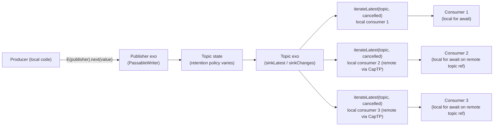

# Notifier Pubsub Migration

| | |
|---|---|
| **Created** | 2026-06-23 |
| **Updated** | 2026-06-23 |
| **Author** | Kris Kowal (prompted) |
| **Status** | Revision 3 (review feedback on revision 2 folded in) |

## What is the Problem Being Solved?

Endo does not yet ship a pubsub primitive at the exo (CapTP-passable) layer.
The closest in-tree precedents are `formulaChangeTopic` in
`packages/daemon/src/daemon.js` (a single-purpose daemon-internal lossless
topic) and the `retention-accumulator.js` coalesce-then-deliver primitive
from [`daemon-cross-peer-gc`](daemon-cross-peer-gc.md).
Neither is reusable across packages.

`@agoric/notifier`, in `agoric-sdk`, is the de facto pubsub primitive in
the broader Agoric ecosystem.
It is the design-vocabulary reference for the topic shapes (lossy versus
lossless, snapshot-then-deltas versus deltas-only) and for the
load-bearing distributed-systems invariants (producer-not-vulnerable-to-
consumers, consumers-mutually-independent).
This design borrows the vocabulary and the invariants; it does **not**
retire `@agoric/notifier`.
`@agoric/notifier` continues to ship from `agoric-sdk` and the agoric-sdk
maintainer's schedule decides any future deprecation independently.

endo#1444 proposes the new package land as small topic shapes rather than
the existing tripartite `makePublishKit` / `makeNotifierKit` /
`makeSubscriptionKit` surface:

- a **lossy** topic where late consumers see the most recent value and then
  wait for the next change,
- a **lossless deltas** topic where late consumers see every change after
  the moment they begin iterating,
- an "update" topic whose disposition this design decides.

endo#1182 records the duality constraint, which this design carries into the
exo layer: the producer side of any new topic exo must satisfy a passable
`PassableWriter<T>` shape analogous to the `Writer<T>` interface from
`@endo/stream`, and the consumer side must satisfy a passable shape
analogous to `Reader<T>`, in the same way `@endo/exo-stream`'s
`PassableReader` / `PassableWriter` are analogous to `@endo/stream`'s
local `Reader` / `Writer`.

This design proposes a `@endo/exo-pubsub` package that lands two topic
shapes (the third is dropped per *The three topic shapes* below) as exos,
coherent with the exo-streams discipline already established on the `llm`
branch.

The package is **greenfield for Endo.**
No existing Endo or endo-but-for-bots consumer migrates onto it as a
prerequisite; the only in-tree call site that the package will eventually
replace is `formulaChangeTopic` in `packages/daemon/`, and that replacement
is a follow-up rather than a precondition.
The package lands on its own merits as a primitive future Endo code can
use; whether and when other ecosystems (agoric-sdk, third-party
consumers) adopt it is out of scope for this design.

### Layering: local pubsub and exo pubsub

`@endo/stream` and `@endo/exo-stream` operate at different layers; the same
layering applies to pubsub.
`@endo/stream` is the local-only async-iteration layer (its `Reader<T>` and
`Writer<T>` are not passable over CapTP; they are async-iterator-shaped
JavaScript objects).
`@endo/exo-stream` is the CapTP layer: `PassableReader` and `PassableWriter`
are exo refs that ride a bidirectional-promise-chain protocol over remote
references, and a `for await` consumer recovers an async iterator on the
local side via `iterateReader` / `iterateWriter`.

We expect `@endo/exo-pubsub` to compose with `@endo/exo-stream`, not with
`@endo/stream`, exactly the same way `@endo/exo-stream` composes with
`@endo/exo-stream`'s peer utilities rather than `@endo/stream`'s.
A reader who hopes `pump`, `makePipe`, or `prime` from `@endo/stream` will
compose with a `@endo/exo-pubsub` publisher exo over CapTP is reaching across
layers; that composition does not work, and is not expected to.
We do not have analogous utilities at the exo layer today (no exo `pump`, no
exo `makePipe`), but they could be added later as siblings of `iterateReader`
in `@endo/exo-stream`; the present design does not block that work.

There is an implied **`@endo/pubsub`** sibling at the local layer.
`@endo/pubsub` would expose local pubsub topics whose publisher is a local
`Writer<T>` and whose subscribers are local `Reader<T>`s, in the same way
`@endo/stream` exposes local `makeQueue` / `makePipe` / `pump` over local
async iterators.
Earlier work on `@endo/stream` itself introduced exactly this shape: a
`makePubSub()` primitive (sink + many independent springs over a shared async
linked list) and a `makeTopic()` factory (publisher: stream over the sink and
the null spring, subscribers: stream over a fresh spring and the null sink),
landed in commit `cbbd57c03` *feat(stream): Introduce pubsub topics* and
later removed during the `@endo/harden` refactor pass.
That removed code is the design-consistency anchor for a future `@endo/pubsub`:
when the local-layer package is reintroduced, its primitives should match
that prior shape (or supersede it with a documented reason) rather than
diverge.

A future local `@endo/pubsub` topic lifts to a `@endo/exo-pubsub` topic the
same way a local async iterator lifts to a `PassableReader` via
`exo-stream`'s `reader-from-iterator`: a thin wrapping factory whose publisher
exo forwards `next` / `return` / `throw` to the local writer, and whose
topic exo's distinguished sink method (`sinkLatest` / `sinkChanges`)
turns each consumer-side iteration into a local subscriber on the
local-layer topic.
Symmetrically, a `@endo/exo-pubsub` topic drops to a local `@endo/pubsub`
topic via the inverse: the `iterateLatest` / `iterateChanges` adapter
yields a local `Reader<T>` over a remote topic exo, analogous to
`iterateReader` over a remote `PassableReader`.
This design specifies the exo layer; the local layer is named here so future
work has a place to land.

## Scope and home

**Decision: a new sibling package, `@endo/exo-pubsub`.**

The `exo-` prefix is the project norm for `@endo/*` packages whose primary
surface is passable interfaces exchanged over CapTP (per the designer role
file's *Operating norms* and the prior art on `@endo/exo-stream`).
A reader scanning the `packages/` directory recognizes at a glance that
`@endo/exo-pubsub` exports passable exos and that they ride the same
discipline as `@endo/exo-stream`.

Why a sibling rather than absorption into `@endo/exo-stream`:

- **Discoverability.**
  A future engineer looking for "the pubsub package" finds it by name.
  Stuffing pubsub into `@endo/exo-stream` would force every notifier caller
  to import from a path that does not match what they are looking for.
- **API-surface scope.**
  `@endo/exo-stream` is one-to-one (one producer, one consumer); pubsub is
  one-to-many (one producer, many subscribers).
  These are different topologies and different invariants (lossy versus
  lossless, snapshot-then-deltas versus deltas-only); a single package
  whose name suggests one-to-one streaming would mis-advertise the
  pubsub semantics.
- **Composition, not duplication.**
  `@endo/exo-pubsub` builds on top of `@endo/exo-stream` (the topic exo's
  distinguished sink methods ride the same bidirectional-promise-chain
  protocol as `PassableReader.stream`) and on top of `@endo/stream`'s
  `makeQueue` (the async-singly-linked-list-queue endo#1444 names is
  `makeQueue` itself, per the researcher's library writeback).
  The new package adds the one-to-many shape; it does not duplicate the
  one-to-one shape.

Considered and rejected: absorption into `@endo/exo-stream`.
Reason: the package name no longer describes its scope; consumers who only
want one-to-one streams pay for code they do not use, and the docs grow a
second top-level chapter that should have been its own document.

Considered and rejected: a new `@endo/notifier` name to match the migration
source.
Reason: the `exo-` prefix discipline (per `roles/designer/AGENT.md` *exo-
package-name prefix*) is the right signal at the package-name level, and
"notifier" is a misleading name for a primitive whose lossless variant
delivers every delta rather than coalesced state.

### Durable pubsub deferred

The package supports only the in-memory wire-protocol shape.
Persistence of unread deltas in `makeChangeTopic` across a daemon
restart, or persistence of the latest cell in `makeLatestTopic`, is not
in scope.
The maintainer's framing on revision 1: *"Not relevant at this layer.
Durable pubsub is another concern that would require durable exos. We
can introduce these later."*
A future *to be filed* tracking issue revisits durable pubsub once
durable exos exist; that work is a separate sibling design, not a
follow-up of this one.

## The topic shapes

Two topic shapes ship in this iteration; endo#1444's proposed third
(`makeUpdateTopic`) is eliminated entirely per the maintainer's revision 1
review (see § `makeUpdateTopic` (eliminated) below).

### Subscriber surface: the topic object

The subscriber surface is the **topic object**, an exo that the factory
returns alongside the publisher.
The topic object exposes a distinguished sink method per topic shape
(`sinkLatest` for a lossy topic, `sinkChanges` for a lossless-deltas
topic) that an *iterator adapter* (`iterateLatest`, `iterateChanges`)
calls to recover a local async iterator on the consumer side.

This shape replaces the earlier draft's `E(hub).subscribe(cancelled)`
method.
The subscribe-method shape diverged from the project convention, which
is exo methods returning topic objects that themselves implement
distinguishing sink methods.
The topic object stays the same passable reference across subscribers;
each subscriber's consumption is a separate `iterateLatest` /
`iterateChanges` call on the local side, parameterized by the consumer's
own cancellation promise.
The distinguishing method names (`sinkLatest`, `sinkChanges`, plus the
future room called out in *Method-name evolvability* below for change
topics that want richer subscription trade-offs) let the topic exo grow
new subscription modes as siblings rather than as new packages or new
exo classes.

Both retained topic factories return the same kit shape:
a publisher exo (passable, `PassableWriter<T>`-shaped) and a topic exo
(passable, with a distinguished sink method per topic shape) that share
underlying state.
Late consumers see history per the topic's lossiness policy; early
consumers see every event delivered after they begin iterating.



### `makeLatestTopic` (lossy)

Late consumers see the most-recent value, then wait for the next change.
Consumers fall behind without buffering: if a consumer is slow and the
producer pushes ten values, the slow consumer still sees only the most
recent one when it next drains.
Matches the lossiness semantics of `@agoric/notifier`'s notifier-pair
(latest-only), used for status-display, exchange-rate-style data, and any
case where intermediate values are uninteresting.

**Replay-on-iterate semantic.**
The lossy topic distinguishes two cases at iterator-start time:

- The topic has **never emitted a value.**
  The new consumer's first `localReader.next()` waits for the first
  `publisher.next(value)` call before resolving.
  There is no synthetic initial value; the consumer blocks on the future.
- The topic has **previously emitted at least one value.**
  The new consumer's first `localReader.next()` resolves immediately to
  the most recent value, without waiting for the next publish.
  Subsequent `next()` calls then wait for the topic's next publish.

This matches the canonical lossy semantic from `@agoric/notifier` and is the
common case that makes the lossy topic a usable status-display surface: a
late consumer that opens a status view sees the current state immediately
rather than waiting for the next change.
A topic that has terminated (`finish()` or `fail()`) before the consumer
starts iterating delivers the terminal result on first `next()` per the
*Termination on late iterate* contract: `finish()` delivers
`{ value: undefined, done: true }`; `fail(error)` rejects.

```js
import { makePromiseKit } from '@endo/promise-kit';
import { makeLatestTopic } from '@endo/exo-pubsub/latest-topic.js';
import { iterateLatest } from '@endo/exo-pubsub/iterate-latest.js';

const { publisher, topic, finish, fail } = makeLatestTopic({
  valuePattern: M.number(),
  returnPattern: M.undefined(),
});

await E(publisher).next(1);
await E(publisher).next(2);
const { reject: cancel, promise: cancelled } = makePromiseKit();
const localReader = iterateLatest(topic, cancelled);
const r = await localReader.next();  // resolves to 2 (the latest, not 1)
await E(publisher).next(3);
const r2 = await localReader.next(); // resolves to 3
cancel(Error('done'));               // unsubscribe (consumer-driven)
await finish();                       // settles every active consumer with done: true
```

A remote consumer holding a reference to the topic exo over CapTP calls
`iterateLatest(remoteTopicRef, cancelled)` exactly the same way; the
adapter's contract is local on both sides of the wire.

InterfaceGuard sketch:

```js
const LatestTopicPublisherI = M.interface('LatestTopicPublisher', {
  next: M.callWhen(M.any()).returns(M.undefined()),
  return: M.callWhen(M.opt(M.any())).returns(M.undefined()),
  throw: M.callWhen(M.error()).returns(M.undefined()),
});

const LatestTopicI = M.interface('LatestTopic', {
  // sinkLatest takes a consumer-supplied bidirectional-promise-chain
  // synchronization head and a cancellation promise; the topic settles
  // per-consumer state on the cancellation's rejection.
  sinkLatest: M.call(M.any(), M.promise())
    .returns(M.any()),  // bidirectional-promise-chain head, exo-stream-shaped
  readPattern: M.call().returns(M.opt(M.pattern())),
  readReturnPattern: M.call().returns(M.opt(M.pattern())),
});
```

### `makeChangeTopic` (lossless deltas)

Every consumer sees every value delivered after it begins iterating.
A consumer that lags accumulates undelivered cells in its **consumer
process's heap**, not in the topic's producer-side state; see
*Back-pressure and wire protocol* below.
A consumer that cancels (settles its cancellation promise) releases its
producer-side chain-head reference and stops ferrying further cells.
Direct precedent: `formulaChangeTopic` in `packages/daemon/src/daemon.js`
plus the `retention-accumulator.js` coalesce-then-deliver primitive from
[`daemon-cross-peer-gc`](daemon-cross-peer-gc.md).
Matches the lossiness semantics of `@agoric/notifier`'s subscription-pair.

```js
import { makePromiseKit } from '@endo/promise-kit';
import { makeChangeTopic } from '@endo/exo-pubsub/change-topic.js';
import { iterateChanges } from '@endo/exo-pubsub/iterate-changes.js';

const { publisher, topic, finish, fail } = makeChangeTopic({
  valuePattern: M.splitRecord({ add: M.arrayOf(M.string()) }),
});

const { promise: earlyCancelled } = makePromiseKit();
const earlyReader = iterateChanges(topic, earlyCancelled);
await E(publisher).next({ add: ['a'] });
await E(publisher).next({ add: ['b'] });
const { promise: lateCancelled } = makePromiseKit();
const lateReader = iterateChanges(topic, lateCancelled);
await E(publisher).next({ add: ['c'] });

// earlyReader.next() yields {add: ['a']}, then {add: ['b']},
// then {add: ['c']}
// lateReader.next() yields {add: ['c']} only
// (started iterating after a and b were ferried; the early reader's
// cells accumulated in the consumer process's heap until drained)
```

The change topic exo's distinguished sink method is `sinkChanges` rather
than `sinkLatest`; otherwise the InterfaceGuard shape mirrors
`LatestTopic`'s.
The wire-protocol-level difference is retention policy: one cell on the
producer-side latest-cell for the lossy variant; one chain-head reference
per active iteration for the lossless-deltas variant.

```js
const ChangeTopicI = M.interface('ChangeTopic', {
  sinkChanges: M.call(M.any(), M.promise())
    .returns(M.any()),
  readPattern: M.call().returns(M.opt(M.pattern())),
  readReturnPattern: M.call().returns(M.opt(M.pattern())),
});
```

The distinguishing method name (`sinkChanges` versus `sinkLatest`) is
the load-bearing convention.
A change topic exo carries `sinkChanges`; a latest topic exo carries
`sinkLatest`; a future iteration that wants a single topic exo to expose
*both* semantics adds them as sibling distinguished methods on the same
exo (see *Method-name evolvability* below).
The shape leaves room for change topics that want richer trade-offs to
land as additional distinguished method names: a change topic that
implements ack-driven coalescing (so unobserved values never touch the
wire, at the expense of a round-trip of latency) could land as
`sinkChangesAcked` or analogous; a change topic that supports
consumer-side coalescing with a consumer-supplied reducer could land as
`sinkChangesReduced`.
The present iteration ships only `sinkChanges` with the eager-ferry
wire-protocol shape described in *Back-pressure and wire protocol*; the
sibling-method-name room is documented so a future iteration's addition
is a non-breaking add.

### `makeUpdateTopic` (eliminated)

**Disposition: eliminated. No shim. No compatibility surface.**
endo#1444's third proposed shape, `makeUpdateTopic`, is not lifted into the
new package and is not provided as a deprecated-on-arrival shim either.
The maintainer's framing on revision 1: *"the existence of this mode is a
usage hazard."*
The two retained shapes (`makeLatestTopic` and `makeChangeTopic`) cover the
lossy / fully-lossless taxonomy from the researcher's notifier-readme
section family; the "snapshot-then-deltas" mode that update-topic packaged
is a usage hazard because the snapshot and the delta stream are two
distinct semantic surfaces fused into one API, and a consumer who
under-reads the contract treats deltas as authoritative state.

A caller that needs the snapshot-then-deltas shape obtains it by
explicit composition: a one-shot RPC to read the producer's accumulated
state, plus an `iterateChanges(topic, cancelled)` against a
`makeChangeTopic` for subsequent deltas, with the consumer's burden to
reconcile the two if a publish lands between the snapshot and the start
of iteration.
That burden is the usage hazard the eliminated mode was hiding; surfacing
it forces the caller to acknowledge the race rather than inheriting an
API that obscures it.

Considered and rejected: keep `makeUpdateTopic` as a first-class topic.
Reason: the lossiness taxonomy is two-dimensional (lossy versus lossless);
forward-lossless is a *composition*, not a third category.
Asking authors to choose between three topics when two cover the design
space is API bloat.

Considered and rejected: ship a deprecated-on-arrival shim at
`@endo/exo-pubsub/update-topic.js` to ease agoric-sdk migration.
Reason: a shim with the hazardous shape is the hazard.
A migration aid that preserves the dangerous API for one cycle leaves the
hazard in the package and in the calling habit; a one-cycle delay is not
worth the cost of carrying the hazard into the surface a future engineer
reads.
A caller that needs the snapshot-then-deltas shape composes the
one-shot-read with the change-topic iteration explicitly per *The topic
shapes* above.

## Producer as a passable `PassableWriter<T>`

The publisher exo's method names mirror the `Stream` interface
(`next`, `return`, `throw`), but the publisher is an **exo ref** that rides
the CapTP bidirectional-promise-chain protocol, not a local
`Writer<T>` from `@endo/stream`.
A remote holder of the publisher exo (a peer who received the publisher
reference over CapTP) calls `E(publisher).next(value)` and gets the same
write-with-acknowledge shape that `@endo/exo-stream`'s `PassableWriter`
exposes.

This layering is deliberate (see *Layering: local pubsub and exo pubsub*
above): the publisher exo lives at the `@endo/exo-stream` layer, not the
`@endo/stream` layer, so utilities like `pump`, `makePipe`, and `prime` from
`@endo/stream` do **not** compose with it directly.
We do not have analogous utilities at the exo layer today: no exo `pump`,
no exo `makePipe`.
They could be added later as siblings of `iterateReader` in
`@endo/exo-stream`; this design does not block that work and does not
provide them itself.
A consumer that wants the local async-iterator shape calls
`iterateLatest(topic, cancelled)` / `iterateChanges(topic, cancelled)`
to recover a local `Reader<T>` from the topic exo (the analog of
`iterateReader` on `PassableReader`, lifted to the topic-object shape),
then composes the local reader with local `@endo/stream` utilities.

Type signatures:

```ts
type PublisherExo<T> = ERef<{
  next(value: T): Promise<undefined>;
  return(value?: undefined): Promise<undefined>;
  throw(error: Error): Promise<undefined>;
}>;
type LatestTopicExo<T> = ERef<{
  // sinkLatest(synHead, cancelled) returns the bidirectional
  // promise-chain head for receiving the most-recent value.
  // synHead is the consumer-supplied synchronization promise.
  // cancelled releases per-consumer state on rejection.
  sinkLatest(
    synHead: ERef<StreamNode<undefined, undefined>>,
    cancelled: Promise<never>,
  ): Promise<StreamNode<T, undefined>>;
  readPattern(): Pattern | undefined;
  readReturnPattern(): Pattern | undefined;
}>;
type ChangeTopicExo<T> = ERef<{
  // sinkChanges is the change-topic analog of sinkLatest; the wire
  // protocol delivers every value rather than the most recent.
  sinkChanges(
    synHead: ERef<StreamNode<undefined, undefined>>,
    cancelled: Promise<never>,
  ): Promise<StreamNode<T, undefined>>;
  readPattern(): Pattern | undefined;
  readReturnPattern(): Pattern | undefined;
}>;
type LatestKit<T> = {
  publisher: PublisherExo<T>;
  topic: LatestTopicExo<T>;
  finish(value?: undefined): Promise<void>;
  fail(reason: Error): Promise<void>;
};
type ChangeKit<T> = {
  publisher: PublisherExo<T>;
  topic: ChangeTopicExo<T>;
  finish(value?: undefined): Promise<void>;
  fail(reason: Error): Promise<void>;
};
```

The sink method on each topic exo requires a `cancelled: Promise<never>`
argument per *Consumer cancellation* below; the topic uses that promise
to detect the consumer's intent to stop iterating.
The iterator adapters (`iterateLatest` / `iterateChanges`) forward the
cancellation through to the topic's sink method; consumers do not call
the sink method directly except in advanced cases that bypass the
adapter.

The publisher exo's `next(value)` resolves once the topic's internal
fan-out has acknowledged value retention.
For `makeLatestTopic` that acknowledgement is "the latest cell has been
written and every actively-iterating consumer's pending `next()` has
been satisfied"; for `makeChangeTopic` it is "the delta has been
enqueued for every active consumer's per-consumer chain advance".
This is the producer-side back-pressure surface; the wire-protocol detail
that keeps backlog accumulating on the *consumer* side (not the producer
side) is in *Back-pressure and wire protocol* below.

## Topic exo and iterator adapters

Each topic exo carries a distinguished sink method (`sinkLatest` or
`sinkChanges`) whose shape mirrors `@endo/exo-stream`'s `PassableReader`
`stream(synHead)` method, plus the cancellation argument added by this
package.
The sink methods receive a consumer-supplied synchronization head and
return the bidirectional-promise-chain head for receiving values; the
wire protocol below the method call is the same one
`@endo/exo-stream`'s `PassableReader.stream` rides.
A local consumer of a topic exo (local or remote over CapTP) calls the
matching iterator adapter from `@endo/exo-pubsub`:

```js
import { iterateLatest } from '@endo/exo-pubsub/iterate-latest.js';

const localReader = iterateLatest(topic, cancelled);
for await (const value of localReader) {
  // ...
}
```

The iterator adapter does for the topic-object shape what `iterateReader`
does for `PassableReader`: it accepts a passable reference (the topic
exo, here, rather than a `PassableReader` exo there), calls the
distinguishing sink method (`sinkLatest` here, `stream` there), and
returns a local async iterator (`Reader<T>`).
The topic exo plus the matching adapter together compose with the
`@endo/exo-stream` toolkit (`iterateReader`, `iterateBytesReader`, the
local pump utilities) at the local layer, satisfying the maintainer's
"coherent and consistent with the design of exo-streams" constraint.

Stopping iteration happens through one of three paths:

- **The local consumer breaks the loop** (a `break` in the `for await`).
  The iterator adapter translates this into a `return()` call on the
  underlying bidirectional-promise-chain head, which the topic treats as
  the consumer-driven stop signal.
- **The consumer settles the cancellation promise** (see *Consumer
  cancellation* below).
  The topic observes the cancellation and releases the per-consumer
  producer-side chain reference.
- **The topic terminates** via `publisher.return()` / `finish()` or
  `publisher.throw()` / `fail(error)`.
  The iterator adapter surfaces the terminal `IteratorResult` (or
  rejection) and the topic releases the chain reference.

## Exo-streams coherence

This is the load-bearing constraint.
Every interface in the new package follows the exo-streams discipline as
established by `@endo/exo-stream` and `daemon-message-streaming`:

| Discipline rule | How `@endo/exo-pubsub` complies |
|---|---|
| Exos, not plain factories. | `makeLatestTopic` and `makeChangeTopic` use `defineExoClassKit` to mint the publisher and topic exo classes. Internal state lives on the kit. |
| `InterfaceGuard` for every method. | `M.interface('LatestTopicPublisher', { next: M.callWhen(M.any()).returns(M.undefined()), ... })`. The publisher and the topic both carry guards; the topic's `sinkLatest` / `sinkChanges` methods are guarded too. |
| Capability discipline at every boundary. | The publisher and the topic are separate exos with no shared mutable state directly accessible. The publisher cannot read; the topic cannot write. Authority to publish or to consume is conveyed only by holding the respective reference. |
| CapTP-rides-method-calls. | The topic's distinguished sink methods (`sinkLatest`, `sinkChanges`) carry the same bidirectional-promise-chain shape `@endo/exo-stream`'s `PassableReader.stream` uses. A remote consumer's `iterateLatest(topicRef, cancelled)` / `iterateChanges(topicRef, cancelled)` works without an extra adapter. |
| Pattern guards for passable values. | `valuePattern` and `returnPattern` are accepted on construction; every emitted value is pattern-checked at the boundary. |

The topic object returned by `makeLatestTopic` / `makeChangeTopic` is an
exo, so a remote holder of the topic exo can call
`iterateLatest(topicRef, cancelled)` / `iterateChanges(topicRef, cancelled)`
(with a cancellation promise per *Consumer cancellation*) and receive a
local `Reader<T>` whose drains pull values over CapTP through the
distinguishing sink method.

## Cross-design coordination

| Design | Relationship |
|---|---|
| [daemon-message-streaming](daemon-message-streaming.md) | The closest in-tree precedent for an exo-shaped streaming interface. Its four-event taxonomy (`append` / `setPhase` / `end` / `abort`) collapses onto the `next` / `return` / `throw` triple, which the publisher exo of this package adopts (at the exo layer, not the local-`Writer<T>` layer). A daemon-message-streaming consumer that wants a fan-out (one streaming source, many downstream UI surfaces) builds it via a local pump-shaped helper: recover the local reader from the streaming source via `iterateReader`, recover the local publisher of a `makeChangeTopic` via a future planned `iteratePublisher` helper, and pump between them at the local layer. The cross-layer pump from `@endo/stream` is not the right shape (see *Layering: local pubsub and exo pubsub*). |
| [daemon-cross-peer-gc](daemon-cross-peer-gc.md) | `formulaChangeTopic` is the direct in-tree precedent for `makeChangeTopic`. The `retention-accumulator.js` coalesce-then-deliver primitive is the precedent for the optional subscriber-side delta-coalescing addressed in *Backpressure*. The new package generalizes `formulaChangeTopic` from a single-purpose daemon-internal topic into a reusable exo primitive; the daemon's existing call site is one of the eventual migration targets. |
| [presence-severance-observation](presence-severance-observation.md) (PR #450) | Out of reach for this iteration. The presence-severance design has not landed, so the topic cannot rely on `E.whenSevered(presence)` to observe a remote consumer's CapTP severance. The topic instead requires a `cancelled: Promise<never>` argument on each sink call (see *Consumer cancellation*); the consumer settles it on the events the consumer can observe locally. Once presence-severance lands, a future revision can layer `E.whenSevered(consumerPresence)` on top of the cancellation promise (severance settles `cancelled` automatically, the consumer keeps the right to settle it earlier on local conditions). |
| `@endo/exo-stream` (`packages/exo-stream/`) | The topic exo's distinguishing sink methods (`sinkLatest`, `sinkChanges`) ride the same bidirectional-promise-chain protocol as `PassableReader.stream`. The package depends on `@endo/exo-stream` for shared protocol primitives (the StreamNode shape, the synchronization-head conventions), and `@endo/exo-pubsub` is intentionally a sibling at the same layer (see *Layering: local pubsub and exo pubsub*). |
| `@endo/stream` (`packages/stream/`) | A *layering* relationship, not a composition one. The local layer's `Reader<T>` / `Writer<T>` shapes are the design vocabulary the exo layer's `PassableReader<T>` / `PassableWriter<T>` mirror. `makeQueue` from `@endo/stream` (the "async-singly-linked-list-queue" endo#1444 names) is the internal queue primitive for per-subscriber buffering in `makeChangeTopic`'s implementation, but `@endo/stream`'s `pump` / `makePipe` / `prime` do not compose with `@endo/exo-pubsub`'s exos. See *Layering: local pubsub and exo pubsub*. |
| Earlier work on `@endo/stream` (`makePubSub` + `makeTopic`, commit `cbbd57c03`, since removed) | Design-consistency anchor for a future `@endo/pubsub` local-layer sibling. The new exo-layer package is not constrained to match the removed local-layer shape, but a future local `@endo/pubsub` should match it (or supersede it with a documented reason). |

## Back-pressure and wire protocol

The design intent for the wire protocol: a slow `makeChangeTopic` consumer
accumulates backlog **in the consumer process**, not in the producer
process.
The producer side observes a slow consumer only as a slower
acknowledgement of the chain-head advance from that consumer; it does
not queue per-consumer deltas itself.

This mirrors the wire-protocol discipline `@endo/exo-stream` already
establishes for one-to-one streams: CapTP ferries `StreamNode` cells from
the producer side to the consumer side as the producer's `next()`
resolutions settle, and the cells sit in the consumer process's heap until
the consumer drains them.
A consumer who reads slowly piles cells in its own heap; the producer side
holds only the chain-head reference and is bounded.

For `@endo/exo-pubsub` this means each iteration started by
`iterateLatest` / `iterateChanges` is the *consumer-side* endpoint of an
exo-stream-shaped fan-out wire.
The topic's per-consumer state on the producer side is the chain-head
reference (one promise per active iteration), not a queue of buffered
cells.
Each consumer's queue of un-drained cells lives in the consumer-side
runtime of the holder of the local reader: a remote consumer's CapTP node
ferries cells across as the producer publishes, and they accumulate on
the consumer's side awaiting the consumer's `next()` drain.

The implementation makes this explicit:

- `makeChangeTopic`'s `publisher.next(value)` puts the value on the topic's
  internal "next chain-head" promise once.
  Each active iteration holds an independent cursor on that chain
  (per the `makePubSub` shape: sink + many independent springs over a
  shared async linked list).
  The producer's `next()` resolves once the chain advance is committed; the
  resolution does **not** wait for every consumer to have drained the
  newly-published cell.
- The bidirectional-promise-chain protocol from `@endo/exo-stream` carries
  each cell across the CapTP boundary to each consumer's wire endpoint
  *eagerly* (as the producer publishes, not as the consumer drains).
  CapTP's promise-pipelining is the ferry; the cell crosses once the
  producer publishes, regardless of consumer drain state.
- A slow consumer accumulates undrained cells in its own runtime's heap.
  The producer side carries one chain-head reference per active
  iteration, not a buffer; producer-side memory is bounded by the active
  iteration count rather than by the slowest consumer's lag.

The producer is **not** vulnerable to a slow or unresponsive consumer's
memory growth: the slow consumer's backlog grows in *its own* address
space, not the producer's.
This is the `@agoric/notifier`'s "producer not vulnerable to consumers"
invariant carried into the exo layer via the same mechanism `@endo/exo-stream`
already uses.

`makeLatestTopic` has the same wire-protocol shape with a simpler retention
policy: the producer side carries one cell (the latest), and each
iteration's chain advances past that cell as the consumer drains.
A slow `makeLatestTopic` consumer that lags through several publishes
sees only the most recent value when it drains; the intermediate cells are
overwritten on the producer side, not buffered per consumer.

### Overflow policy on the consumer

The wire-protocol-side accumulation is unbounded by default: a consumer that
does not drain pins consumer-process memory.
A consumer that needs a bound applies it on the local side, after
`iterateLatest` / `iterateChanges` recovers the local reader: the
consumer wraps its local reader with a coalescing accumulator (see
`retention-accumulator.js` from
[`daemon-cross-peer-gc`](daemon-cross-peer-gc.md)) or a drop-oldest policy
of its own choosing.
The package does not bake an overflow policy into the topic itself; the
consumer that knows its memory budget knows the right policy.

## Consumer cancellation

Both `iterateLatest(topic, cancelled)` and `iterateChanges(topic, cancelled)`
take a required `cancelled: Promise<never>` argument.
The iterator adapter forwards the cancellation through to the topic's
distinguishing sink method (`sinkLatest` / `sinkChanges`).
The consumer arranges for that promise to settle (with a rejection) when
the consumer wants to stop iterating.
The topic observes the settlement, releases the consumer's per-chain
producer-side state, and stops ferrying new cells across the wire.

```js
import { makePromiseKit } from '@endo/promise-kit';
import { iterateLatest } from '@endo/exo-pubsub/iterate-latest.js';

const { reject: cancel, promise: cancelled } = makePromiseKit();

const localReader = iterateLatest(topic, cancelled);

// Drain until some local condition says stop:
const drain = async () => {
  for await (const value of localReader) {
    if (shouldStop(value)) {
      cancel(Error('done'));
      break;
    }
  }
};
```

The argument is required, not optional.
An iterator-adapter call without a cancellation promise gives the topic
no way to detect a consumer that walks away, and the producer-side
chain-head reference for that iteration is leaked.
The pattern guard on the sink methods enforces the argument's presence
at the CapTP boundary.

This shape is the same one `packages/daemon/src/daemon.js` already uses
across its operations: a `cancelled: Promise<never>` argument that the
operation reacts to in concert with the operation's natural completion
signals.

**Why a cancellation promise and not `E.whenSevered(presence)`.**
The presence-severance observability mechanism described in
[`presence-severance-observation`](presence-severance-observation.md)
(PR #450) is not in the repository yet.
A topic implementation that relied on `E.whenSevered(consumerPresence)`
to detect consumer departure would not compile, and could not be
implemented today.
The cancellation-promise pattern works at the current substrate's level: the
consumer signals departure explicitly, and the topic responds.
A future revision can layer `E.whenSevered(consumerPresence)` on top:
once it lands, the topic's sink methods can additionally arrange to
settle `cancelled` from the severance observer, so a remote consumer
whose CapTP session severs is treated identically to a graceful
cancellation.
The consumer retains the right to cancel earlier on local conditions
(the cancellation promise stays in the API for that reason).
The presence-severance design does not need to ship before this package
can; once it ships, `@endo/exo-pubsub` benefits transparently.

## Method-name evolvability

The current iteration uses a single distinguished sink method per topic
factory: `makeLatestTopic` produces a topic whose sink method is
`sinkLatest()` and whose semantic is lossy; `makeChangeTopic` produces a
topic whose sink method is `sinkChanges()` and whose semantic is
lossless-deltas.
The iterator adapters (`iterateLatest`, `iterateChanges`) call the
matching sink method on the topic exo and return a local `Reader<T>`.

For this iteration, that single-shape-per-topic surface is the deliverable.
The naming convention is intentionally not foreclosed: the design leaves
room for a future iteration where a single topic Exo provides **multiple**
sink methods, and the matching iterator adapter selects the right one.

This is the same evolvability pattern `@endo/exo-stream` already uses for
the `streamBase64()` ↔ `stream()` byte-stream migration: a responder
that wants to migrate from one wire shape to another adds the new
distinguished method alongside the old one, the iterator helper selects
which to call, and the old method is deprecated and later removed.
A future iteration where a producer wants to expose
multiple-trade-off sinks over a single change topic lands as
distinguished sink methods on the topic Exo rather than as a new package
or a new topic factory.
Examples the design leaves room for:

- **Ack-driven coalescing** (so unobserved values never touch the wire,
  at the expense of a round-trip of latency).
  Lands as a new sink method (`sinkChangesAcked` or analogous) and a
  matching iterator adapter.
  The producer sends an ack to induce a data transmission for the
  latest value, so a slow consumer that has not drained accumulates a
  single coalesced "latest pending" cell rather than every intermediate
  cell.
- **Consumer-side reduction.**
  Lands as a sink method that accepts a consumer-supplied reducer (or
  the iterator adapter accepts one and folds at the local layer).
  The producer's stream is consumer-side coalesced before the iterator
  surfaces each yielded value.

The present iteration ships only `sinkLatest` on the lossy topic and
`sinkChanges` on the change topic.
Each topic Exo currently exposes one distinguished sink method, and the
matching iterator adapter is named for it.
A future iteration that wants a single topic Exo to expose *both*
lossy and lossless semantics, or a change topic with multiple trade-off
sinks, lands the new distinguished methods then; the present design
names the shape it leaves room for but does not commit to spelling.

## Compatibility considerations

The original endo#1035 motivation was a Parcel-bundler interaction where
`@agoric/notifier`'s dependency on `@endo/marshal` re-used `@endo/marshal`'s
identity across the agoric-sdk boundary in a way that Parcel could not
resolve through symlinks.
The new package's design avoids re-creating that pain:

- **`@endo/exo-pubsub` does not depend on `@endo/marshal` directly.**
  Pattern guards come from `@endo/patterns`; the exo machinery comes from
  `@endo/exo` (via `defineExoClassKit`); the stream type contracts come
  from `@endo/stream` (a `types.d.ts`-only dependency, no runtime import).
  Marshal involvement is transitive at most, the same way every other
  `@endo/*` package transitively depends on marshal through the exo
  layer.
- **No symlink-sensitive layouts.**
  The package is a sibling of `@endo/exo-stream` in `packages/`, ships
  with the same `tsconfig.composite.json` / `tsconfig.build.json` /
  `package.json` shape as its sibling, and exposes one module per
  exported function (no barrel exports, per the project's `CLAUDE.md`).
- **Pass-style is preserved across CapTP.**
  Subscribers conform to `PassableReader`; the bidirectional-promise-chain
  protocol the responders implement is already proven over CapTP via
  `@endo/exo-stream`.

## Open questions

- **Final method names for the additional change-topic sinks the design
  leaves room for?**
  The present iteration ships one distinguished sink method per topic
  exo (`sinkLatest` for `makeLatestTopic`, `sinkChanges` for
  `makeChangeTopic`).
  *Method-name evolvability* above describes the room the design leaves
  for additional change-topic sinks (ack-driven coalescing,
  consumer-side reduction); the present design does not commit to the
  method names for those future sinks.
  A future iteration that adds a second sink to either topic exo lands
  the chosen method name then, as a non-breaking sibling-method-name
  addition.

## Prompt

> Please dispatch a designer to propose a migration based on these hints above.
> The designer is responsible for ensuring the result is coherent and consistent
> with the design of exo-streams.

The "hints above" are the three endo issues referenced in the dispatch:
endo#1035 (migration commitment), endo#1444 (three topic shapes proposal),
and endo#1182 (`Writer<T>` / `Reader<T>` duality).

## Library and project references

### Library concepts and sections

- [`concepts/exo-stream.md`](../../journal/library/concepts/exo-stream.md) — the canonical bridge from local async iterators to remote-passable `PassableReader` / `PassableWriter` exo refs. The maintainer's "exo-streams discipline" rooting. Read first.
- [`sources/endo--packages-stream-README-md`](../../journal/library/sources/) section family — `@endo/stream`'s symmetric Reader/Writer type, parity invariant, back-pressure-via-acks. The `Reader<T>` / `Writer<T>` framing the downstream prompt requires.
- [`sections/endo--packages-stream-index-js--symmetric-async-iterator-streams-with-makeQueue-makePipe-pump-and-prime-utilities`](../../journal/library/sections/) — the source implementation. `makeQueue` is the "async-singly-linked-list-queue" the prompt names; `makePipe = two-queues-cross-wired`; `pump` is the reader-to-writer bridge.
- [`sections/agoric-sdk--pkg-notifier-readme--type-differences`](../../journal/library/sections/) (+ three child sections: type-differences, lossiness, use-cases) — the canonical lossy / forward-lossless / fully-lossless taxonomy for the three topic shapes.
- [`sections/agoric-sdk--pkg-notifier-readme--publishkit-and-related-types`](../../journal/library/sections/) — frame: `makePublishKit` / `makeNotifierKit` / `makeSubscriptionKit` triad; PublishKit is the current recommended shape, NotifierKit and SubscriptionKit are already deprecated.
- [`sections/agoric-sdk--pkg-notifier-readme--distributed-asynchronous-iteration`](../../journal/library/sections/) — the formal semantics: non-final values + Finish / Fail termination, full ordering across all consumers.
- [`sections/agoric-sdk--pkg-notifier-readme--distributed-operation`](../../journal/library/sections/) — the load-bearing distributed-systems properties: producer-not-vulnerable-to-consumers, consumers-mutually-independent, `getSharable*Internals` adapter pattern for remote AsyncIterable consumption. Direct source of the "compose with `pump` / `makePipe`" framing.
- [`concepts/retention-accumulator.md`](../../journal/library/concepts/retention-accumulator.md) — coalesce-then-deliver microtask-batched delta primitive. Precedent for `makeChangeTopic`'s lossless-deltas semantics with subscriber-coalescing.
- [`sections/endo--packages-marshal-src-marshal-js--*`](../../journal/library/sections/) — `@endo/marshal` is the package whose Parcel/symlink interaction with `@agoric/notifier` motivated endo#1035. The dual-format-body-discriminator section is the most relevant for wire-format concerns.
- [`topics/exo.md`](../../journal/library/topics/exo.md) and [`sections/endo--agents--exo-this-context`](../../journal/library/sections/) — the Exo class API (`makeExo` / `defineExoClass` / `defineExoClassKit`) and `M.interface` guards. Required for the "exos not plain factories + InterfaceGuard for every method" constraint from the prompt's *Exo-streams coherence* section.
- [`topics/streams.md`](../../journal/library/topics/streams.md) — the topic index for the streams family; useful for ad-hoc lookups during design.

### Project context

- [`projects/endo-but-for-bots/README.md` § Rules of engagement](../../journal/projects/endo-but-for-bots/README.md) — design PRs land on `llm` branch; design-PR convention applies; standing relaxation authorizes the DRAFT PR open without per-action authorization in the dispatch prompt.
- [`projects/endo-but-for-bots/README.md` § Authority structure](../../journal/projects/endo-but-for-bots/README.md) — every commenter on this repo is maintainer-equivalent; treat erights, kumavis, jcorbin, danfinlay, 0xpatrick reviews as authoritative.
- Related designs on the `llm` branch's `designs/` tree:
  - [`daemon-message-streaming.md`](daemon-message-streaming.md) — StreamWriter / StreamReader exo interfaces with `append` / `setPhase` / `end` / `abort` (four-event taxonomy); CapTP-rides-method-calls discipline; persistence model (durable-on-end / partial-on-abort). The strongest precedent in-tree for how an exo-shaped streaming interface looks on this codebase.
  - [`daemon-cross-peer-gc.md`](daemon-cross-peer-gc.md) — the `formulaChangeTopic` single-mutation-surface pattern; `followRetentionSet` async-iterator follower lifecycle; how retention-accumulator subscribers feed deltas. Direct precedent for `makeChangeTopic`'s subscriber API.
  - [`daemon-cas-management.md`](daemon-cas-management.md) — content-store as supervisor-owned subsystem with typed retain/release and background mark-sweep GC; not in scope for this iteration's pubsub (durable pubsub deferred per the maintainer's revision 1 framing) but cited for context on the durable-exos surface this design would compose with later.
  - [`presence-severance-observation.md`](presence-severance-observation.md) (PR #450, not yet landed) — `E.whenSevered(presence)` as the holder-facing observer for transport-, object-, and permission-level severance. Once landed, a future revision of this design can layer it on top of the cancellation-promise mechanism (severance settles `cancelled` automatically), so a severed remote subscriber is treated identically to a graceful cancellation. For this iteration the substrate is out of reach and the cancellation-promise argument is the substitute.
- `packages/exo-stream/` (already on the `llm` branch per `concepts/exo-stream.md`) — the package source the new design extends; cite by relative path. Upstream PR `endojs/endo#3036` is the migration guide.
