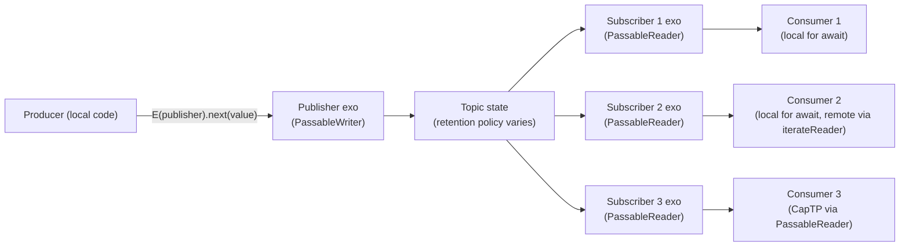

# Notifier Pubsub Migration

| | |
|---|---|
| **Created** | 2026-06-23 |
| **Updated** | 2026-06-23 |
| **Author** | Kris Kowal (prompted) |
| **Status** | Revision 2 (review feedback on revision 1 folded in) |

## What is the Problem Being Solved?

`@agoric/notifier` is the de facto pubsub primitive used across the Endo and
Agoric ecosystem.
It lives in `agoric-sdk` for historical reasons; endo#1035 records the
commitment to migrate it into Endo so that consumers can depend on it without
pulling in the agoric-sdk substrate (and so that the package no longer collides
with `@endo/marshal` under bundlers like Parcel).
endo#1444 proposes the migration land as three small topic shapes rather than
the existing tripartite `makePublishKit` / `makeNotifierKit` / `makeSubscriptionKit`
surface:

- a **lossy** topic where late subscribers see the most recent value and then
  wait for the next change,
- a **lossless deltas** topic where late subscribers see every change after
  the moment of subscription,
- an "update" topic whose disposition this design decides.

endo#1182 records the duality constraint, which this design carries into the
exo layer: the producer side of any new topic exo must satisfy a passable
`PassableWriter<T>` shape analogous to the `Writer<T>` interface from
`@endo/stream`, and the subscriber side must satisfy a passable
`PassableReader<T>` shape analogous to `Reader<T>`, in the same way
`@endo/exo-stream`'s `PassableReader` / `PassableWriter` are analogous to
`@endo/stream`'s local `Reader` / `Writer`.

This design proposes a `@endo/exo-pubsub` package that lands two topic
shapes (the third is dropped per *The three topic shapes* below) as exos,
coherent with the exo-streams discipline already established on the `llm`
branch.

### Layering: local pubsub and exo pubsub

`@endo/stream` and `@endo/exo-stream` operate at different layers; the same
layering applies to pubsub.
`@endo/stream` is the local-only async-iteration layer (its `Reader<T>` and
`Writer<T>` are not passable over CapTP; they are async-iterator-shaped
JavaScript objects).
`@endo/exo-stream` is the CapTP layer: `PassableReader` and `PassableWriter`
are exo refs that ride a bidirectional-promise-chain protocol over remote
references, and a `for await` consumer recovers an async iterator on the
local side via `iterateReader` / `iterateWriter`.

We expect `@endo/exo-pubsub` to compose with `@endo/exo-stream`, not with
`@endo/stream`, exactly the same way `@endo/exo-stream` composes with
`@endo/exo-stream`'s peer utilities rather than `@endo/stream`'s.
A reader who hopes `pump`, `makePipe`, or `prime` from `@endo/stream` will
compose with a `@endo/exo-pubsub` publisher exo over CapTP is reaching across
layers; that composition does not work, and is not expected to.
We do not have analogous utilities at the exo layer today (no exo `pump`, no
exo `makePipe`), but they could be added later as siblings of `iterateReader`
in `@endo/exo-stream`; the present design does not block that work.

There is an implied **`@endo/pubsub`** sibling at the local layer.
`@endo/pubsub` would expose local pubsub topics whose publisher is a local
`Writer<T>` and whose subscribers are local `Reader<T>`s, in the same way
`@endo/stream` exposes local `makeQueue` / `makePipe` / `pump` over local
async iterators.
Earlier work on `@endo/stream` itself introduced exactly this shape: a
`makePubSub()` primitive (sink + many independent springs over a shared async
linked list) and a `makeTopic()` factory (publisher: stream over the sink and
the null spring, subscribers: stream over a fresh spring and the null sink),
landed in commit `cbbd57c03` *feat(stream): Introduce pubsub topics* and
later removed during the `@endo/harden` refactor pass.
That removed code is the design-consistency anchor for a future `@endo/pubsub`:
when the local-layer package is reintroduced, its primitives should match
that prior shape (or supersede it with a documented reason) rather than
diverge.

A future local `@endo/pubsub` topic lifts to a `@endo/exo-pubsub` topic the
same way a local async iterator lifts to a `PassableReader` via
`exo-stream`'s `reader-from-iterator`: a thin wrapping factory whose publisher
exo forwards `next` / `return` / `throw` to the local writer, and whose
`subscribe()` mints a subscriber exo over each local subscriber.
Symmetrically, a `@endo/exo-pubsub` topic drops to a local `@endo/pubsub`
topic via the inverse: an `iterateLatestTopic` / `iterateChangeTopic`
helper that yields a local subscriber over a remote subscriber exo,
analogous to `iterateReader` over a remote `PassableReader`.
This design specifies the exo layer; the local layer is named here so future
work has a place to land.

## Scope and home

**Decision: a new sibling package, `@endo/exo-pubsub`.**

The `exo-` prefix is the project norm for `@endo/*` packages whose primary
surface is passable interfaces exchanged over CapTP (per the designer role
file's *Operating norms* and the prior art on `@endo/exo-stream`).
A reader scanning the `packages/` directory recognizes at a glance that
`@endo/exo-pubsub` exports passable exos and that they ride the same
discipline as `@endo/exo-stream`.

Why a sibling rather than absorption into `@endo/exo-stream`:

- **Discoverability.**
  A future engineer looking for "the pubsub package" finds it by name.
  Stuffing pubsub into `@endo/exo-stream` would force every notifier caller
  to import from a path that does not match what they are looking for.
- **API-surface scope.**
  `@endo/exo-stream` is one-to-one (one producer, one consumer); pubsub is
  one-to-many (one producer, many subscribers).
  These are different topologies and different invariants (lossy versus
  lossless, snapshot-then-deltas versus deltas-only); a single package
  whose name suggests one-to-one streaming would mis-advertise the
  pubsub semantics.
- **Composition, not duplication.**
  `@endo/exo-pubsub` builds on top of `@endo/exo-stream` (each subscriber
  gets a `PassableReader`) and on top of `@endo/stream`'s `makeQueue` (the
  async-singly-linked-list-queue endo#1444 names is `makeQueue` itself,
  per the researcher's library writeback).
  The new package adds the one-to-many shape; it does not duplicate the
  one-to-one shape.

Considered and rejected: absorption into `@endo/exo-stream`.
Reason: the package name no longer describes its scope; consumers who only
want one-to-one streams pay for code they do not use, and the docs grow a
second top-level chapter that should have been its own document.

Considered and rejected: a new `@endo/notifier` name to match the migration
source.
Reason: the `exo-` prefix discipline (per `roles/designer/AGENT.md` *exo-
package-name prefix*) is the right signal at the package-name level, and
"notifier" is a misleading name for a primitive whose lossless variant
delivers every delta rather than coalesced state.

## The topic shapes

Two topic shapes ship in this iteration; endo#1444's proposed third
(`makeUpdateTopic`) is eliminated entirely per the maintainer's revision 1
review (see § `makeUpdateTopic` (eliminated) below).

Both retained topics share the same constructor return shape:
a publisher exo (passable, `PassableWriter<T>`-shaped) plus a `subscribe()`
method that hands out subscriber exos (passable, `PassableReader<T>`-shaped).
Late subscribers see history per the topic's lossiness policy; early
subscribers see every event delivered after their `subscribe()` call.



### `makeLatestTopic` (lossy)

Late subscribers see the most-recent value, then wait for the next change.
Subscribers fall behind without buffering: if a subscriber is slow and the
producer pushes ten values, the slow subscriber still sees only the most
recent one when it polls.
Matches the lossiness semantics of `@agoric/notifier`'s notifier-pair
(latest-only), used for status-display, exchange-rate-style data, and any
case where intermediate values are uninteresting.

**Replay-on-subscribe semantic.**
The lossy topic distinguishes two cases at `subscribe()` time:

- The topic has **never emitted a value.**
  The new subscriber's first `subscriber.next()` waits for the first
  `publisher.next(value)` call before resolving.
  There is no synthetic initial value; the subscriber blocks on the future.
- The topic has **previously emitted at least one value.**
  The new subscriber's first `subscriber.next()` resolves immediately to
  the most recent value, without waiting for the next publish.
  Subsequent `next()` calls then wait for the topic's next publish.

This matches the canonical lossy semantic from `@agoric/notifier` and is the
common case that makes the lossy topic a usable status-display surface: a
late subscriber that opens a status view sees the current state immediately
rather than waiting for the next change.
A topic that has terminated (`finish()` or `fail()`) before `subscribe()`
delivers the terminal result to new subscribers on first `next()` per the
*Termination on late subscribe* contract: `finish()` delivers
`{ value: undefined, done: true }`; `fail(error)` rejects.

```js
import { makePromiseKit } from '@endo/promise-kit';
import { makeLatestTopic } from '@endo/exo-pubsub/latest-topic.js';
import { iterateReader } from '@endo/exo-stream/iterate-reader.js';

const { publisher, subscribe, finish, fail } = makeLatestTopic({
  valuePattern: M.number(),
  returnPattern: M.undefined(),
});

await E(publisher).next(1);
await E(publisher).next(2);
const { reject: cancel, promise: cancelled } = makePromiseKit();
const subscriber = await E(hub).subscribe(cancelled);
const localReader = iterateReader(subscriber);
const r = localReader.next();  // resolves to 2 (the latest, not 1)
await E(publisher).next(3);
const r2 = localReader.next(); // resolves to 3
cancel(Error('done'));         // unsubscribe
await E(finish)();             // settles every active subscriber with done: true
```

InterfaceGuard sketch:

```js
const LatestTopicPublisherI = M.interface('LatestTopicPublisher', {
  next: M.callWhen(M.any()).returns(M.undefined()),
  return: M.callWhen(M.opt(M.any())).returns(M.undefined()),
  throw: M.callWhen(M.error()).returns(M.undefined()),
});

const LatestTopicSubscriberI = M.interface('LatestTopicSubscriber', {
  stream: M.callWhen(M.any()).returns(M.any()),  // PassableReader.stream
  readPattern: M.call().returns(M.opt(M.pattern())),
  readReturnPattern: M.call().returns(M.opt(M.pattern())),
});

const LatestTopicHubI = M.interface('LatestTopicHub', {
  // subscribe takes a required cancellation promise; the topic
  // settles per-subscriber state on the promise's rejection.
  subscribe: M.call(M.promise()).returns(M.remotable('LatestTopicSubscriber')),
});
```

### `makeChangeTopic` (lossless deltas)

Every subscriber sees every value delivered after its `subscribe()` call.
A subscriber that lags accumulates undelivered cells in its **consumer
process's heap**, not in the topic's producer-side state; see
*Back-pressure and wire protocol* below.
A subscriber that cancels (settles its cancellation promise) releases its
producer-side chain-head reference and stops ferrying further cells.
Direct precedent: `formulaChangeTopic` in `packages/daemon/src/daemon.js`
plus the `retention-accumulator.js` coalesce-then-deliver primitive from
[`daemon-cross-peer-gc`](daemon-cross-peer-gc.md).
Matches the lossiness semantics of `@agoric/notifier`'s subscription-pair.

```js
import { makePromiseKit } from '@endo/promise-kit';
import { makeChangeTopic } from '@endo/exo-pubsub/change-topic.js';
import { iterateReader } from '@endo/exo-stream/iterate-reader.js';

const { publisher, subscribe, finish, fail } = makeChangeTopic({
  valuePattern: M.splitRecord({ add: M.arrayOf(M.string()) }),
});

const { promise: earlyCancelled } = makePromiseKit();
const earlySubscriber = await E(hub).subscribe(earlyCancelled);
await E(publisher).next({ add: ['a'] });
await E(publisher).next({ add: ['b'] });
const { promise: lateCancelled } = makePromiseKit();
const lateSubscriber = await E(hub).subscribe(lateCancelled);
await E(publisher).next({ add: ['c'] });

// iterateReader(earlySubscriber).next() yields {add: ['a']}, then
// {add: ['b']}, then {add: ['c']}
// iterateReader(lateSubscriber).next() yields {add: ['c']} only
// (subscribed after a and b were ferried; the early subscriber's cells
// accumulated in the consumer process's heap until drained)
```

The InterfaceGuard shape mirrors `LatestTopic` with the same exo classes;
the difference is wire-protocol retention policy (one cell on the
producer-side latest-cell for the lossy variant; one chain-head reference
per subscriber for the lossless-deltas variant).

### `makeUpdateTopic` (eliminated)

**Disposition: eliminated. No shim. No compatibility surface.**
endo#1444's third proposed shape, `makeUpdateTopic`, is not lifted into the
new package and is not provided as a deprecated-on-arrival shim either.
The maintainer's framing on revision 1: *"the existence of this mode is a
usage hazard."*
The two retained shapes (`makeLatestTopic` and `makeChangeTopic`) cover the
lossy / fully-lossless taxonomy from the researcher's notifier-readme
section family; the "snapshot-then-deltas" mode that update-topic packaged
is a usage hazard because the snapshot and the delta stream are two
distinct semantic surfaces fused into one API, and a consumer who
under-reads the contract treats deltas as authoritative state.

A migration that needs the snapshot-then-deltas shape obtains it by
explicit composition: a one-shot RPC to read the producer's accumulated
state, plus a `subscribe()` against a `makeChangeTopic` for subsequent
deltas, with the consumer's burden to reconcile the two if a publish lands
between the snapshot and the subscribe.
That burden is the usage hazard the eliminated mode was hiding; surfacing
it forces the migrating caller to acknowledge the race rather than
inheriting an API that obscures it.

Considered and rejected: keep `makeUpdateTopic` as a first-class topic.
Reason: the lossiness taxonomy is two-dimensional (lossy versus lossless);
forward-lossless is a *composition*, not a third category.
Asking authors to choose between three topics when two cover the design
space is API bloat.

Considered and rejected: ship a deprecated-on-arrival shim at
`@endo/exo-pubsub/update-topic.js` to ease agoric-sdk migration.
Reason: a shim with the hazardous shape is the hazard.
A migration aid that preserves the dangerous API for one cycle leaves the
hazard in the package and in the migrating caller's habit; a one-cycle
delay is not worth the cost of carrying the hazard into the surface a
future engineer reads.
Agoric-sdk migration absorbs the explicit-composition burden directly.

## Producer as a passable `PassableWriter<T>`

The publisher exo's method names mirror the `Stream` interface
(`next`, `return`, `throw`), but the publisher is an **exo ref** that rides
the CapTP bidirectional-promise-chain protocol, not a local
`Writer<T>` from `@endo/stream`.
A remote holder of the publisher exo (a peer who received the publisher
reference over CapTP) calls `E(publisher).next(value)` and gets the same
write-with-acknowledge shape that `@endo/exo-stream`'s `PassableWriter`
exposes.

This layering is deliberate (see *Layering: local pubsub and exo pubsub*
above): the publisher exo lives at the `@endo/exo-stream` layer, not the
`@endo/stream` layer, so utilities like `pump`, `makePipe`, and `prime` from
`@endo/stream` do **not** compose with it directly.
We do not have analogous utilities at the exo layer today: no exo `pump`,
no exo `makePipe`.
They could be added later as siblings of `iterateReader` in
`@endo/exo-stream`; this design does not block that work and does not
provide them itself.
A consumer that wants the local async-iterator shape calls a planned
`iterateLatestTopic` / `iterateChangeTopic` helper to recover a local
`Reader<T>` from the remote subscriber exo (the analog of `iterateReader`
on `PassableReader`), then composes the local reader with local
`@endo/stream` utilities.

Type signature on the publisher:

```ts
type PublisherExo<T> = ERef<{
  next(value: T): Promise<undefined>;
  return(value?: undefined): Promise<undefined>;
  throw(error: Error): Promise<undefined>;
}>;
type SubscriberExo<T> = ERef<{
  // PassableReader-shaped: stream(synHead) returns the bidirectional
  // promise-chain head for receiving values, as in @endo/exo-stream.
  stream(synHead: ERef<StreamNode<undefined, undefined>>):
    Promise<StreamNode<T, undefined>>;
  readPattern(): Pattern | undefined;
  readReturnPattern(): Pattern | undefined;
}>;
type Hub<T> = {
  publisher: PublisherExo<T>;
  subscribe(cancelled: Promise<never>): SubscriberExo<T>;
  // Convenience terminations; same effect as publisher.return() / .throw():
  finish(value?: undefined): Promise<void>;
  fail(reason: Error): Promise<void>;
};
```

The `subscribe()` method requires a `cancelled: Promise<never>` argument
per *Subscriber cancellation* below; the topic uses that promise to detect
the subscriber's intent to unsubscribe.

The publisher exo's `next(value)` resolves once the topic's internal
fan-out has acknowledged value retention.
For `makeLatestTopic` that acknowledgement is "the latest cell has been
written and every actively-reading subscriber's pending `next()` has been
satisfied"; for `makeChangeTopic` it is "the delta has been enqueued in
every active subscriber's per-subscriber queue".
This is the producer-side back-pressure surface; the wire-protocol detail
that keeps backlog accumulating on the *consumer* side (not the producer
side) is in *Back-pressure and wire protocol* below.

## Subscriber as a passable `PassableReader<T>`

Each subscriber is an exo conforming to the `PassableReader<T>` shape from
`@endo/exo-stream`: it carries a `stream(synHead)` method that returns the
bidirectional-promise-chain head for receiving values, plus
`readPattern()` / `readReturnPattern()` introspection.
A local consumer of a remote subscriber exo recovers the local
async-iterator shape by calling `iterateReader` from `@endo/exo-stream`:

```js
import { iterateReader } from '@endo/exo-stream/iterate-reader.js';

const subscriber = await E(hub).subscribe(cancelled);
const localReader = iterateReader(subscriber);
for await (const value of localReader) {
  // ...
}
```

The subscriber exo therefore composes with the four `@endo/exo-stream`
conversion functions without an adapter, satisfying the maintainer's
"coherent and consistent with the design of exo-streams" constraint.

Unsubscribe happens through one of three paths:

- **The local consumer breaks the loop** (a `break` in the `for await`).
  `iterateReader` translates this into a `return()` call on the
  subscriber exo, which the topic treats as unsubscribe.
- **The consumer settles the cancellation promise** (see *Subscriber
  cancellation* below).
  The topic observes the cancellation and releases the subscriber's queue.
- **The topic terminates** via `publisher.return()` / `finish()` or
  `publisher.throw()` / `fail(error)`.
  The subscriber sees the terminal `IteratorResult` (or rejection) and
  the topic releases its queue.

## Exo-streams coherence

This is the load-bearing constraint.
Every interface in the new package follows the exo-streams discipline as
established by `@endo/exo-stream` and `daemon-message-streaming`:

| Discipline rule | How `@endo/exo-pubsub` complies |
|---|---|
| Exos, not plain factories. | `makeLatestTopic` and `makeChangeTopic` use `defineExoClassKit` to mint the publisher and subscriber exo classes. Internal state lives on the kit. |
| `InterfaceGuard` for every method. | `M.interface('LatestTopicPublisher', { next: M.callWhen(M.any()).returns(M.undefined()), ... })`. The publisher and subscriber both carry guards; `subscribe()` is guarded too. |
| Capability discipline at every boundary. | The publisher and subscriber are separate exos with no shared mutable state directly accessible. The publisher cannot read; the subscriber cannot write. Authority to publish or to subscribe is conveyed only by holding the respective reference. |
| CapTP-rides-method-calls. | Subscribers conform to `PassableReader`; their `stream()` method is the same bidirectional-promise-chain shape `@endo/exo-stream`'s protocol uses. A remote consumer's `iterateReader(subscriberRef)` works without modification. |
| Pattern guards for passable values. | `valuePattern` and `returnPattern` are accepted on construction; every emitted value is pattern-checked at the boundary. |

The hub object returned by `makeLatestTopic` / `makeChangeTopic` is itself
an exo (an outer kit), so a remote holder of the hub can call
`E(hub).subscribe(cancelled)` (with a cancellation promise per *Subscriber
cancellation*) and receive a fresh subscriber exo reference over CapTP.

## Cross-design coordination

| Design | Relationship |
|---|---|
| [daemon-message-streaming](daemon-message-streaming.md) | The closest in-tree precedent for an exo-shaped streaming interface. Its four-event taxonomy (`append` / `setPhase` / `end` / `abort`) collapses onto the `next` / `return` / `throw` triple, which the publisher exo of this package adopts (at the exo layer, not the local-`Writer<T>` layer). A daemon-message-streaming consumer that wants a fan-out (one streaming source, many downstream UI surfaces) builds it via a local pump-shaped helper: recover the local reader from the streaming source via `iterateReader`, recover the local publisher of a `makeChangeTopic` via a future planned `iteratePublisher` helper, and pump between them at the local layer. The cross-layer pump from `@endo/stream` is not the right shape (see *Layering: local pubsub and exo pubsub*). |
| [daemon-cross-peer-gc](daemon-cross-peer-gc.md) | `formulaChangeTopic` is the direct in-tree precedent for `makeChangeTopic`. The `retention-accumulator.js` coalesce-then-deliver primitive is the precedent for the optional subscriber-side delta-coalescing addressed in *Backpressure*. The new package generalizes `formulaChangeTopic` from a single-purpose daemon-internal topic into a reusable exo primitive; the daemon's existing call site is one of the eventual migration targets. |
| [presence-severance-observation](presence-severance-observation.md) (PR #450) | Out of reach for this iteration. The presence-severance design has not landed, so the topic cannot rely on `E.whenSevered(presence)` to observe a remote subscriber's CapTP severance. The topic instead requires a `cancelled: Promise<never>` argument on `subscribe()` (see *Subscriber cancellation*); the consumer settles it on the events the consumer can observe locally. Once presence-severance lands, a future revision can layer `E.whenSevered(subscriberPresence)` on top of the cancellation promise (severance settles `cancelled` automatically, the consumer keeps the right to settle it earlier on local conditions). |
| `@endo/exo-stream` (`packages/exo-stream/`) | Subscribers conform to `PassableReader`; remote consumption uses `iterateReader`. The package depends on `@endo/exo-stream` for the conversion utilities, and `@endo/exo-pubsub` is intentionally a sibling at the same layer (see *Layering: local pubsub and exo pubsub*). |
| `@endo/stream` (`packages/stream/`) | A *layering* relationship, not a composition one. The local layer's `Reader<T>` / `Writer<T>` shapes are the design vocabulary the exo layer's `PassableReader<T>` / `PassableWriter<T>` mirror. `makeQueue` from `@endo/stream` (the "async-singly-linked-list-queue" endo#1444 names) is the internal queue primitive for per-subscriber buffering in `makeChangeTopic`'s implementation, but `@endo/stream`'s `pump` / `makePipe` / `prime` do not compose with `@endo/exo-pubsub`'s exos. See *Layering: local pubsub and exo pubsub*. |
| Earlier work on `@endo/stream` (`makePubSub` + `makeTopic`, commit `cbbd57c03`, since removed) | Design-consistency anchor for a future `@endo/pubsub` local-layer sibling. The new exo-layer package is not constrained to match the removed local-layer shape, but a future local `@endo/pubsub` should match it (or supersede it with a documented reason). |

## Back-pressure and wire protocol

The design intent for the wire protocol: a slow `makeChangeTopic` subscriber
accumulates backlog **in the consumer process**, not in the producer
process.
The producer side observes a slow subscriber only as a slower `next()`
acknowledgement from that subscriber; it does not queue per-subscriber
deltas itself.

This mirrors the wire-protocol discipline `@endo/exo-stream` already
establishes for one-to-one streams: CapTP ferries `StreamNode` cells from
the producer side to the consumer side as the producer's `next()`
resolutions settle, and the cells sit in the consumer process's heap until
the consumer drains them.
A consumer who reads slowly piles cells in its own heap; the producer side
holds only the chain-head reference and is bounded.

For `@endo/exo-pubsub` this means each subscriber exo is the *consumer-side*
endpoint of an exo-stream-shaped fan-out wire.
The topic's per-subscriber state on the producer side is the chain-head
reference (one promise per subscriber), not a queue of buffered cells.
Each subscriber's queue of un-drained cells lives in the consumer-side
runtime of the holder of the subscriber exo: a remote consumer's CapTP node
ferries cells across as the producer publishes, and they accumulate on
the consumer's side awaiting the consumer's `next()` drain.

The implementation makes this explicit:

- `makeChangeTopic`'s `publisher.next(value)` puts the value on the topic's
  internal "next chain-head" promise once.
  Each active subscriber holds an independent cursor on that chain
  (per the `makePubSub` shape: sink + many independent springs over a
  shared async linked list).
  The producer's `next()` resolves once the chain advance is committed; the
  resolution does **not** wait for every subscriber to have drained the
  newly-published cell.
- The bidirectional-promise-chain protocol from `@endo/exo-stream` carries
  each cell across the CapTP boundary to each subscribing peer
  *eagerly* (as the producer publishes, not as the consumer drains).
  CapTP's promise-pipelining is the ferry; the cell crosses once the
  producer publishes, regardless of consumer drain state.
- A slow consumer accumulates undrained cells in its own runtime's heap.
  The producer side carries one chain-head reference per subscriber, not a
  buffer; producer-side memory is bounded by the active subscriber count
  rather than by the slowest subscriber's lag.

The producer is **not** vulnerable to a slow or unresponsive subscriber's
memory growth: the slow subscriber's backlog grows in *its own* address
space, not the producer's.
This is the `@agoric/notifier`'s "producer not vulnerable to consumers"
invariant carried into the exo layer via the same mechanism `@endo/exo-stream`
already uses.

`makeLatestTopic` has the same wire-protocol shape with a simpler retention
policy: the producer side carries one cell (the latest), and each
subscriber's chain advances past that cell as the subscriber drains.
A slow `makeLatestTopic` subscriber that lags through several publishes
sees only the most recent value when it drains; the intermediate cells are
overwritten on the producer side, not buffered per subscriber.

### Hub-side overflow policy on the consumer

The wire-protocol-side accumulation is unbounded by default: a consumer that
does not drain pins consumer-process memory.
A consumer that needs a bound applies it on the local side, after
`iterateReader`/`iterateLatestTopic`/`iterateChangeTopic` recovers the local
reader: the consumer wraps its local reader with a coalescing accumulator
(see `retention-accumulator.js` from
[`daemon-cross-peer-gc`](daemon-cross-peer-gc.md)) or a drop-oldest policy
of its own choosing.
The package does not bake an overflow policy into the topic itself; the
consumer that knows its memory budget knows the right policy.

## Subscriber cancellation

`subscribe()` takes a required `cancelled: Promise<never>` argument.
The consumer arranges for that promise to settle (with a rejection) when
the consumer wants to unsubscribe.
The topic observes the settlement, releases the subscriber's per-chain
producer-side state, and stops ferrying new cells across the wire.

```js
import { makePromiseKit } from '@endo/promise-kit';
import { iterateReader } from '@endo/exo-stream/iterate-reader.js';

const { reject: cancel, promise: cancelled } = makePromiseKit();

const subscriber = await E(hub).subscribe(cancelled);
const localReader = iterateReader(subscriber);

// Drain until some local condition says stop:
const drain = async () => {
  for await (const value of localReader) {
    if (shouldStop(value)) {
      cancel(Error('done'));
      break;
    }
  }
};
```

The argument is required, not optional.
A `subscribe()` call without a cancellation promise gives the topic no way
to detect a subscriber that walks away, and the producer-side chain-head
reference for that subscriber is leaked.
The pattern guard on `subscribe()` enforces the argument's presence at the
CapTP boundary.

This shape is the same one `packages/daemon/src/daemon.js` already uses
across its operations: a `cancelled: Promise<never>` argument that the
operation reacts to in concert with the operation's natural completion
signals.

**Why a cancellation promise and not `E.whenSevered(presence)`.**
The presence-severance observability mechanism described in
[`presence-severance-observation`](presence-severance-observation.md)
(PR #450) is not in the repository yet.
A topic implementation that relied on `E.whenSevered(subscriberPresence)`
to detect subscriber departure would not compile, and could not be
implemented today.
The cancellation-promise pattern works at the current substrate's level: the
consumer signals departure explicitly, and the topic responds.
A future revision can layer `E.whenSevered(subscriberPresence)` on top:
once it lands, the topic's `subscribe()` can additionally arrange to
settle `cancelled` from the severance observer, so a remote subscriber
whose CapTP session severs is treated identically to a graceful
cancellation.
The consumer retains the right to cancel earlier on local conditions
(the cancellation promise stays in the API for that reason).
The presence-severance design does not need to ship before this package
can; once it ships, `@endo/exo-pubsub` benefits transparently.

## Method-name evolvability

The current iteration uses a single distinguished topic kind per package
factory: `makeLatestTopic` produces a topic whose subscriber method is
`subscribe()` and whose semantic is lossy; `makeChangeTopic` produces a
topic whose subscriber method is `subscribe()` and whose semantic is
lossless-deltas.

For this iteration, that single-shape-per-topic surface is the deliverable.
The naming convention is intentionally not foreclosed: the design leaves
room for a future iteration where a single topic Exo provides **both**
behaviors via distinguished methods on the topic.
Specifically: a future topic Exo could expose `subscribeLatest()` and
`subscribeChanges()` as two distinguished methods, and the subscriber
side, like `iterateReader` / `iterateBytesReader` in `@endo/exo-stream`,
would name which distinguished method to call on the topic.

This is the same evolvability pattern `@endo/exo-stream` already uses for
the `streamBase64()` ↔ `stream()` byte-stream migration: a responder
that wants to migrate from one wire shape to another adds the new
distinguished method alongside the old one, the iterator (subscriber-side
helper) selects which to call, and the old method is deprecated and
later removed.
A future iteration where a producer wants to expose a snapshot-plus-changes
shape over a single topic (for example, a topic over an array-like
collection that provides a snapshot followed by changes) lands as
distinguished methods on the topic Exo rather than as a new package or
a new topic factory.

This iteration does **not** introduce `subscribeLatest()` /
`subscribeChanges()` and does **not** introduce a topic Exo that exposes
both at once.
Producers are still single-shape (a lossy topic only exposes the latest
semantic; a lossless-deltas topic only exposes the deltas semantic) and
subscribers still call `subscribe()`.
The design only commits to *leaving room* for the multi-distinguished-method
shape so a future iteration can land it without an API break.

## Migration plan

Two phases, each a separate PR pair (`llm` design, `master` implementation).
(Revision 2: phase count drops from three to two because the
`makeUpdateTopic` shim is eliminated and the retirement-of-the-shim phase
goes away.)

**Phase 1: land the package.**
`@endo/exo-pubsub` ships with the two retained topics, AVA tests, and a
README adapted from the `@agoric/notifier` README's framing (lifting the
lossiness taxonomy vocabulary directly per the researcher's section
family).
There is no `makeUpdateTopic` shim (see *The three topic shapes* §
`makeUpdateTopic` (eliminated)).
The first call site to migrate is the daemon's `formulaChangeTopic`, which
moves from its ad-hoc inline implementation to `makeChangeTopic`.
This serves as the dogfood test for the new package on the project's own
codebase.

**Phase 2: codemod survey + dual-publishing period.**
A designer-performed survey enumerates the `@agoric/notifier` call sites
across:

- `endojs/endo` (likely none today; the migration *is* the reason
  `@endo/exo-pubsub` is being created),
- `endojs/endo-but-for-bots` (likely a few in `packages/daemon/`),
- `Agoric/agoric-sdk` (the bulk of the call sites; the project is on
  passive standing watch per `journal/projects/agoric-sdk/README.md`,
  so the codemod survey is research only and no agoric-sdk PR lands).

The survey is filed as a follow-up tracking issue (*to be filed* in the
endo issue tracker, anchor in the design's *Open questions*).
For each call site, the survey records:

- the topic shape currently used (notifier / subscription / publisher),
- the equivalent `@endo/exo-pubsub` shape,
- any non-trivial semantic delta (for example, a caller relying on
  `getUpdateSince`-style queries or the `@agoric/notifier`-subscription
  snapshot-then-deltas mode that this package does not expose).

A snapshot-then-deltas caller migrates by explicit composition: read the
producer's accumulated state via a one-shot RPC, then `subscribe()` a
`makeChangeTopic` for subsequent deltas, reconciling at the seam.
The migration burden is the same as the eliminated `makeUpdateTopic`
shim's burden; the migration just makes that burden explicit at the call
site rather than hiding it in a shim's contract.

During this phase, `@agoric/notifier` continues to ship from `agoric-sdk`
unchanged.
`@endo/exo-pubsub` is the recommended new API; the two coexist until the
agoric-sdk maintainer's schedule deprecates `@agoric/notifier`.

Hard cutover is **not** the chosen path: the agoric-sdk migration is not
under this project's control and a hard cutover would block
`@endo/exo-pubsub` adoption on agoric-sdk's schedule.

## Compatibility considerations

The original endo#1035 motivation was a Parcel-bundler interaction where
`@agoric/notifier`'s dependency on `@endo/marshal` re-used `@endo/marshal`'s
identity across the agoric-sdk boundary in a way that Parcel could not
resolve through symlinks.
The new package's design avoids re-creating that pain:

- **`@endo/exo-pubsub` does not depend on `@endo/marshal` directly.**
  Pattern guards come from `@endo/patterns`; the exo machinery comes from
  `@endo/exo` (via `defineExoClassKit`); the stream type contracts come
  from `@endo/stream` (a `types.d.ts`-only dependency, no runtime import).
  Marshal involvement is transitive at most, the same way every other
  `@endo/*` package transitively depends on marshal through the exo
  layer.
- **No symlink-sensitive layouts.**
  The package is a sibling of `@endo/exo-stream` in `packages/`, ships
  with the same `tsconfig.composite.json` / `tsconfig.build.json` /
  `package.json` shape as its sibling, and exposes one module per
  exported function (no barrel exports, per the project's `CLAUDE.md`).
- **Pass-style is preserved across CapTP.**
  Subscribers conform to `PassableReader`; the bidirectional-promise-chain
  protocol the responders implement is already proven over CapTP via
  `@endo/exo-stream`.

## Open questions

- **Storage / persistence of unread deltas in `makeChangeTopic` across
  daemon restart?**
  Resolved: not relevant at this layer.
  Durable pubsub is a separate concern that requires durable exos, which
  the project does not yet have; the maintainer's framing on revision 1:
  *"Not relevant at this layer. Durable pubsub is another concern that
  would require durable exos. We can introduce these later."*
  The in-memory wire-protocol shape is the only shape this package
  supports.
  A future *to be filed* tracking issue revisits durable pubsub once
  durable exos exist; that work is out of scope for this design.

- **Back-pressure on a slow subscriber?**
  Resolved: backlog accumulates in the **consumer process**, not the
  producer process, by the same wire-protocol mechanism `@endo/exo-stream`
  uses for one-to-one streams.
  See *Back-pressure and wire protocol* above for the full description.
  The producer side carries one chain-head reference per subscriber, not
  a queue of cells; CapTP ferries cells across as the producer publishes,
  and they accumulate on the consumer side until the consumer drains.
  A consumer that needs a memory bound applies a coalescing or drop-oldest
  policy on its local reader (the recovered `Reader<T>` from
  `iterateChangeTopic`); the package does not bake one in.

- **CapTP traversal: does a remote subscriber's connection severance
  count as unsubscribe?**
  Resolved for this iteration: out of reach; the topic cannot observe
  severance directly because the
  [`presence-severance-observation`](presence-severance-observation.md)
  (PR #450) substrate has not landed.
  The substitute is a required `cancelled: Promise<never>` argument on
  `subscribe()` (see *Subscriber cancellation* above): the consumer
  signals departure explicitly and the topic releases per-subscriber
  state on the settlement.
  A future revision can layer `E.whenSevered(presence)` on top once it
  ships: severance settles `cancelled` automatically, and a remote
  subscriber whose CapTP session severs is treated identically to a
  graceful cancellation.

- **Should subscribers see a snapshot of accumulated state on
  `subscribe()`, or only future values?**
  Resolved: `makeLatestTopic` subscribers see the current latest cell
  immediately if one has ever been published (and wait for the first
  publish if not).
  `makeChangeTopic` subscribers see only deltas after `subscribe()`.
  The snapshot-then-deltas mode is not a native topic kind; a consumer
  that needs it composes a one-shot RPC for the snapshot with a
  `makeChangeTopic` subscribe for subsequent deltas (the consumer
  reconciles at the seam).

- **`@agoric/notifier` caller survey across agoric-sdk + endo-but-for-bots
  + endo.**
  Open: the survey is Phase 2 work (designer-performed research).
  Anchor for follow-up: *to be filed* tracking issue in the endo issue
  tracker once Phase 1 ships.

- **Final method names for distinguished latest / changes accessors on
  a future topic Exo?**
  Open for a future iteration.
  This iteration uses `subscribe()` on a single-shape-per-topic factory
  (`makeLatestTopic` or `makeChangeTopic`).
  A future iteration that wants a single topic Exo to expose both
  behaviors via distinguished methods (`subscribeLatest()` /
  `subscribeChanges()` per *Method-name evolvability*) lands the chosen
  method names then; the present design names the shape it leaves room
  for but does not commit to spelling.

- **Final names for the two retained topic factories.**
  Resolved: `makeLatestTopic` and `makeChangeTopic`.
  The names are absent from the prior library (per the researcher's
  writeback); these names land here as authoritative.

## Prompt

> Please dispatch a designer to propose a migration based on these hints above.
> The designer is responsible for ensuring the result is coherent and consistent
> with the design of exo-streams.

The "hints above" are the three endo issues referenced in the dispatch:
endo#1035 (migration commitment), endo#1444 (three topic shapes proposal),
and endo#1182 (`Writer<T>` / `Reader<T>` duality).

## Library and project references

### Library concepts and sections

- [`concepts/exo-stream.md`](../../journal/library/concepts/exo-stream.md) — the canonical bridge from local async iterators to remote-passable `PassableReader` / `PassableWriter` exo refs. The maintainer's "exo-streams discipline" rooting. Read first.
- [`sources/endo--packages-stream-README-md`](../../journal/library/sources/) section family — `@endo/stream`'s symmetric Reader/Writer type, parity invariant, back-pressure-via-acks. The `Reader<T>` / `Writer<T>` framing the downstream prompt requires.
- [`sections/endo--packages-stream-index-js--symmetric-async-iterator-streams-with-makeQueue-makePipe-pump-and-prime-utilities`](../../journal/library/sections/) — the source implementation. `makeQueue` is the "async-singly-linked-list-queue" the prompt names; `makePipe = two-queues-cross-wired`; `pump` is the reader-to-writer bridge.
- [`sections/agoric-sdk--pkg-notifier-readme--type-differences`](../../journal/library/sections/) (+ three child sections: type-differences, lossiness, use-cases) — the canonical lossy / forward-lossless / fully-lossless taxonomy for the three topic shapes.
- [`sections/agoric-sdk--pkg-notifier-readme--publishkit-and-related-types`](../../journal/library/sections/) — frame: `makePublishKit` / `makeNotifierKit` / `makeSubscriptionKit` triad; PublishKit is the current recommended shape, NotifierKit and SubscriptionKit are already deprecated.
- [`sections/agoric-sdk--pkg-notifier-readme--distributed-asynchronous-iteration`](../../journal/library/sections/) — the formal semantics: non-final values + Finish / Fail termination, full ordering across all consumers.
- [`sections/agoric-sdk--pkg-notifier-readme--distributed-operation`](../../journal/library/sections/) — the load-bearing distributed-systems properties: producer-not-vulnerable-to-consumers, consumers-mutually-independent, `getSharable*Internals` adapter pattern for remote AsyncIterable consumption. Direct source of the "compose with `pump` / `makePipe`" framing.
- [`concepts/retention-accumulator.md`](../../journal/library/concepts/retention-accumulator.md) — coalesce-then-deliver microtask-batched delta primitive. Precedent for `makeChangeTopic`'s lossless-deltas semantics with subscriber-coalescing.
- [`sections/endo--packages-marshal-src-marshal-js--*`](../../journal/library/sections/) — `@endo/marshal` is the package whose Parcel/symlink interaction with `@agoric/notifier` motivated endo#1035. The dual-format-body-discriminator section is the most relevant for wire-format concerns.
- [`topics/exo.md`](../../journal/library/topics/exo.md) and [`sections/endo--agents--exo-this-context`](../../journal/library/sections/) — the Exo class API (`makeExo` / `defineExoClass` / `defineExoClassKit`) and `M.interface` guards. Required for the "exos not plain factories + InterfaceGuard for every method" constraint from the prompt's *Exo-streams coherence* section.
- [`topics/streams.md`](../../journal/library/topics/streams.md) — the topic index for the streams family; useful for ad-hoc lookups during design.

### Project context

- [`projects/endo-but-for-bots/README.md` § Rules of engagement](../../journal/projects/endo-but-for-bots/README.md) — design PRs land on `llm` branch; design-PR convention applies; standing relaxation authorizes the DRAFT PR open without per-action authorization in the dispatch prompt.
- [`projects/endo-but-for-bots/README.md` § Authority structure](../../journal/projects/endo-but-for-bots/README.md) — every commenter on this repo is maintainer-equivalent; treat erights, kumavis, jcorbin, danfinlay, 0xpatrick reviews as authoritative.
- Related designs on the `llm` branch's `designs/` tree:
  - [`daemon-message-streaming.md`](daemon-message-streaming.md) — StreamWriter / StreamReader exo interfaces with `append` / `setPhase` / `end` / `abort` (four-event taxonomy); CapTP-rides-method-calls discipline; persistence model (durable-on-end / partial-on-abort). The strongest precedent in-tree for how an exo-shaped streaming interface looks on this codebase.
  - [`daemon-cross-peer-gc.md`](daemon-cross-peer-gc.md) — the `formulaChangeTopic` single-mutation-surface pattern; `followRetentionSet` async-iterator follower lifecycle; how retention-accumulator subscribers feed deltas. Direct precedent for `makeChangeTopic`'s subscriber API.
  - [`daemon-cas-management.md`](daemon-cas-management.md) — content-store as supervisor-owned subsystem with typed retain/release and background mark-sweep GC; not in scope for this iteration's pubsub (durable pubsub deferred per the maintainer's revision 1 framing) but cited for context on the durable-exos surface this design would compose with later.
  - [`presence-severance-observation.md`](presence-severance-observation.md) (PR #450, not yet landed) — `E.whenSevered(presence)` as the holder-facing observer for transport-, object-, and permission-level severance. Once landed, a future revision of this design can layer it on top of the cancellation-promise mechanism (severance settles `cancelled` automatically), so a severed remote subscriber is treated identically to a graceful cancellation. For this iteration the substrate is out of reach and the cancellation-promise argument is the substitute.
- `packages/exo-stream/` (already on the `llm` branch per `concepts/exo-stream.md`) — the package source the new design extends; cite by relative path. Upstream PR `endojs/endo#3036` is the migration guide.
