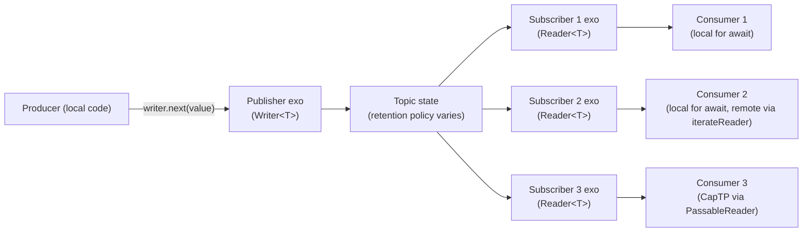

# Notifier Pubsub Migration

| | |
|---|---|
| **Created** | 2026-06-23 |
| **Author** | Kris Kowal (prompted) |
| **Status** | Not Started |

## What is the Problem Being Solved?

`@agoric/notifier` is the de facto pubsub primitive used across the Endo and
Agoric ecosystem.
It lives in `agoric-sdk` for historical reasons; endo#1035 records the
commitment to migrate it into Endo so that consumers can depend on it without
pulling in the agoric-sdk substrate (and so that the package no longer collides
with `@endo/marshal` under bundlers like Parcel).
endo#1444 proposes the migration land as three small topic shapes rather than
the existing tripartite `makePublishKit` / `makeNotifierKit` / `makeSubscriptionKit`
surface:

- a **lossy** topic where late subscribers see the most recent value and then
  wait for the next change,
- a **lossless deltas** topic where late subscribers see every change after
  the moment of subscription,
- an "update" topic whose disposition this design decides.

endo#1182 records the duality constraint: the producer side of any new topic
must satisfy `Writer<T>` from `@endo/stream`, and the subscriber side must
satisfy `Reader<T>`.
Today `@agoric/notifier` exposes neither: its producer/consumer pair carries
shapes specific to the notifier package, so `makePipe` and `pump` from
`@endo/stream` cannot compose with notifier producers without an adapter.

This design proposes a `@endo/exo-pubsub` package that lands the three topic
shapes as exos, coherent with the exo-streams discipline already established
on the `llm` branch.
The producer and subscriber surfaces conform to `Writer<T>` and `Reader<T>`,
so a notifier producer is drop-in composable with `pump`, `makePipe`, and
`prime` from `@endo/stream`.

## Scope and home

**Decision: a new sibling package, `@endo/exo-pubsub`.**

The `exo-` prefix is the project norm for `@endo/*` packages whose primary
surface is passable interfaces exchanged over CapTP (per the designer role
file's *Operating norms* and the prior art on `@endo/exo-stream`).
A reader scanning the `packages/` directory recognizes at a glance that
`@endo/exo-pubsub` exports passable exos and that they ride the same
discipline as `@endo/exo-stream`.

Why a sibling rather than absorption into `@endo/exo-stream`:

- **Discoverability.**
  A future engineer looking for "the pubsub package" finds it by name.
  Stuffing pubsub into `@endo/exo-stream` would force every notifier caller
  to import from a path that does not match what they are looking for.
- **API-surface scope.**
  `@endo/exo-stream` is one-to-one (one producer, one consumer); pubsub is
  one-to-many (one producer, many subscribers).
  These are different topologies and different invariants (lossy versus
  lossless, snapshot-then-deltas versus deltas-only); a single package
  whose name suggests one-to-one streaming would mis-advertise the
  pubsub semantics.
- **Composition, not duplication.**
  `@endo/exo-pubsub` builds on top of `@endo/exo-stream` (each subscriber
  gets a `PassableReader`) and on top of `@endo/stream`'s `makeQueue` (the
  async-singly-linked-list-queue endo#1444 names is `makeQueue` itself,
  per the researcher's library writeback).
  The new package adds the one-to-many shape; it does not duplicate the
  one-to-one shape.

Considered and rejected: absorption into `@endo/exo-stream`.
Reason: the package name no longer describes its scope; consumers who only
want one-to-one streams pay for code they do not use, and the docs grow a
second top-level chapter that should have been its own document.

Considered and rejected: a new `@endo/notifier` name to match the migration
source.
Reason: the `exo-` prefix discipline (per `roles/designer/AGENT.md` *exo-
package-name prefix*) is the right signal at the package-name level, and
"notifier" is a misleading name for a primitive whose lossless variant
delivers every delta rather than coalesced state.

## The three topic shapes

All three topics share the same constructor return shape:
a publisher (exo, `Writer<T>`-conformant) plus a `subscribe()` method that
hands out subscribers (exo, `Reader<T>`-conformant).
Late subscribers see history per the topic's lossiness policy; early
subscribers see every event delivered after their `subscribe()` call.



### `makeLatestTopic` (lossy)

Late subscribers see the most-recent value, then wait for the next change.
Subscribers fall behind without buffering: if a subscriber is slow and the
producer pushes ten values, the slow subscriber still sees only the most
recent one when it polls.
Matches the lossiness semantics of `@agoric/notifier`'s notifier-pair
(latest-only), used for status-display, exchange-rate-style data, and any
case where intermediate values are uninteresting.

```js
import { makeLatestTopic } from '@endo/exo-pubsub/latest-topic.js';

const { publisher, subscribe, finish, fail } = makeLatestTopic({
  valuePattern: M.number(),
  returnPattern: M.undefined(),
});

await publisher.next(1);
await publisher.next(2);
const subscriber = subscribe();
const r = subscriber.next();  // resolves to 2 (the latest, not 1)
await publisher.next(3);
const r2 = subscriber.next();  // resolves to 3
await finish();  // settles every subscriber's iteration with done: true
```

InterfaceGuard sketch:

```js
const LatestTopicPublisherI = M.interface('LatestTopicPublisher', {
  next: M.callWhen(M.any()).returns(M.undefined()),
  return: M.callWhen(M.opt(M.any())).returns(M.undefined()),
  throw: M.callWhen(M.error()).returns(M.undefined()),
});

const LatestTopicSubscriberI = M.interface('LatestTopicSubscriber', {
  stream: M.callWhen(M.any()).returns(M.any()),  // PassableReader.stream
  readPattern: M.call().returns(M.opt(M.pattern())),
  readReturnPattern: M.call().returns(M.opt(M.pattern())),
});

const LatestTopicHubI = M.interface('LatestTopicHub', {
  subscribe: M.call().returns(M.remotable('LatestTopicSubscriber')),
});
```

### `makeChangeTopic` (lossless deltas)

Every subscriber sees every value delivered after its `subscribe()` call.
A subscriber that lags accumulates a per-subscriber queue (see *Backpressure*);
a subscriber that goes away frees its queue.
Direct precedent: `formulaChangeTopic` in `packages/daemon/src/daemon.js`
plus the `retention-accumulator.js` coalesce-then-deliver primitive from
[`daemon-cross-peer-gc`](daemon-cross-peer-gc.md).
Matches the lossiness semantics of `@agoric/notifier`'s subscription-pair.

```js
import { makeChangeTopic } from '@endo/exo-pubsub/change-topic.js';

const { publisher, subscribe, finish, fail } = makeChangeTopic({
  valuePattern: M.splitRecord({ add: M.arrayOf(M.string()) }),
});

const earlySubscriber = subscribe();
await publisher.next({ add: ['a'] });
await publisher.next({ add: ['b'] });
const lateSubscriber = subscribe();
await publisher.next({ add: ['c'] });

// earlySubscriber.next() yields {add: ['a']}, then {add: ['b']}, then {add: ['c']}
// lateSubscriber.next() yields {add: ['c']} only (subscribed after a and b)
```

The InterfaceGuard shape mirrors `LatestTopic` with the same exo classes;
the difference is internal storage (per-subscriber queue versus single
latest cell).

### `makeUpdateTopic` (retired, with a thin shim)

**Disposition: retired.**
endo#1444's third proposed shape, `makeUpdateTopic`, is not lifted into the
new package.
The two retained shapes (`makeLatestTopic` and `makeChangeTopic`) cover the
lossy / fully-lossless taxonomy from the researcher's notifier-readme section
family.
The intermediate "forward-lossless" mode that `@agoric/notifier`'s subscription
provides (subscriber sees the value-at-subscription-time, then every delta
afterwards) is recovered by composition: `subscribe()` on a `makeChangeTopic`
preceded by a one-shot `latestSnapshot()` query gives the same shape, without
introducing a third topic kind that an author has to choose between.

A **thin compatibility shim** lives at
`@endo/exo-pubsub/update-topic.js` for one minor cycle to ease the migration
of agoric-sdk call sites; the shim is a straightforward composition of
`makeChangeTopic` plus a `latestSnapshot()` accessor and is documented in
the package CHANGELOG as deprecated-on-arrival.
The shim is removed at the next major (see *Migration plan*).

Considered and rejected: keep `makeUpdateTopic` as a first-class topic.
Reason: the lossiness taxonomy is two-dimensional (lossy versus lossless);
forward-lossless is a *composition*, not a third category.
Asking authors to choose between three topics when two cover the design
space is API bloat.

## Producer-as-`Writer<T>`

The publisher exo's method names mirror the `Stream` interface from
`@endo/stream` (`next`, `return`, `throw`), so the publisher *is*
`Writer<T>`, so no adapter is required for `pump` or `makePipe` to compose
with it.

```js
import { pump, makePipe } from '@endo/stream';
import { makeChangeTopic } from '@endo/exo-pubsub/change-topic.js';

// Pump from any reader into the topic:
const [pipeReader, pipeWriter] = makePipe();
const { publisher, subscribe } = makeChangeTopic();
const pumpDone = pump(publisher, pipeReader);  // publisher: Writer<T>
// Now pushing into pipeWriter feeds every subscriber of the topic.
```

Type signature on the publisher:

```ts
type Publisher<T> = Writer<T, undefined>;  // from @endo/stream/types.d.ts
type Subscriber<T> = Reader<T, undefined>;
type Hub<T> = {
  publisher: Publisher<T>;
  subscribe(): Subscriber<T>;
  // Convenience terminations; same effect as publisher.return() / .throw():
  finish(value?: undefined): Promise<void>;
  fail(reason: Error): Promise<void>;
  // Lossless variants: a one-shot snapshot accessor for the
  // forward-lossless composition pattern (used by the makeUpdateTopic shim).
  latestSnapshot?(): T | undefined;  // present on LatestTopic; absent on ChangeTopic by default
};
```

The publisher exo's `next(value)` resolves once the topic's internal
fan-out has acknowledged retention for every active subscriber (for
`makeChangeTopic`) or has stored the latest cell (for `makeLatestTopic`).
This is the back-pressure surface: a slow `next()` resolution means the
topic is buffering and the producer should slow down (see *Backpressure*).

## Subscriber-as-`Reader<T>`

Each subscriber exo *is* `Reader<T>`.
`subscriber.next()` resolves to the next `IteratorResult<T>`; `subscriber.return()`
unsubscribes and releases queue memory; `subscriber.throw()` is treated as
unsubscribe.

A local subscriber is consumed with `for await`:

```js
const subscriber = subscribe();
for await (const value of subscriber) {
  // ...
}
```

A remote subscriber is consumed via `iterateReader` from `@endo/exo-stream`,
because the subscriber exo's stream method is the same `PassableReader`
shape `iterateReader` already understands:

```js
import { iterateReader } from '@endo/exo-stream/iterate-reader.js';

const localReader = iterateReader(remoteSubscriber);
for await (const value of localReader) {
  // ...
}
```

The subscriber exo therefore composes with the four `@endo/exo-stream`
conversion functions without an adapter, satisfying the maintainer's
"coherent and consistent with the design of exo-streams" constraint.

## Exo-streams coherence

This is the load-bearing constraint.
Every interface in the new package follows the exo-streams discipline as
established by `@endo/exo-stream` and `daemon-message-streaming`:

| Discipline rule | How `@endo/exo-pubsub` complies |
|---|---|
| Exos, not plain factories. | `makeLatestTopic` and `makeChangeTopic` use `defineExoClassKit` to mint the publisher and subscriber exo classes. Internal state lives on the kit. |
| `InterfaceGuard` for every method. | `M.interface('LatestTopicPublisher', { next: M.callWhen(M.any()).returns(M.undefined()), ... })`. The publisher and subscriber both carry guards; `subscribe()` is guarded too. |
| Capability discipline at every boundary. | The publisher and subscriber are separate exos with no shared mutable state directly accessible. The publisher cannot read; the subscriber cannot write. Authority to publish or to subscribe is conveyed only by holding the respective reference. |
| CapTP-rides-method-calls. | Subscribers conform to `PassableReader`; their `stream()` method is the same bidirectional-promise-chain shape `@endo/exo-stream`'s protocol uses. A remote consumer's `iterateReader(subscriberRef)` works without modification. |
| Pattern guards for passable values. | `valuePattern` and `returnPattern` are accepted on construction; every emitted value is pattern-checked at the boundary. |

The hub object returned by `makeLatestTopic` / `makeChangeTopic` is itself
an exo (an outer kit), so a remote holder of the hub can call
`E(hub).subscribe()` and receive a fresh subscriber exo reference over CapTP.

## Cross-design coordination

| Design | Relationship |
|---|---|
| [daemon-message-streaming](daemon-message-streaming.md) | The closest in-tree precedent for an exo-shaped streaming interface. Its four-event taxonomy (`append` / `setPhase` / `end` / `abort`) collapses onto `Writer<T>`'s `next` / `return` / `throw` triple, which this package adopts directly. A daemon-message-streaming consumer that wants a fan-out (one streaming source, many downstream UI surfaces) builds it by pumping the source into a `makeChangeTopic`. |
| [daemon-cross-peer-gc](daemon-cross-peer-gc.md) | `formulaChangeTopic` is the direct in-tree precedent for `makeChangeTopic`. The `retention-accumulator.js` coalesce-then-deliver primitive is the precedent for the optional subscriber-side delta-coalescing addressed in *Backpressure*. The new package generalizes `formulaChangeTopic` from a single-purpose daemon-internal topic into a reusable exo primitive; the daemon's existing call site is one of the eventual migration targets. |
| [presence-severance-observation](presence-severance-observation.md) (PR #450) | Severance on a remote subscriber's CapTP session is the same event class as `pump` failure terminating a writer. A topic implementation that holds remote subscribers attaches `E.whenSevered(subscriberPresence)` to each subscriber and treats severance as the subscriber's implicit `return()`. The topic's per-subscriber queue is released, the hub's internal subscriber set shrinks, and no further `next()` calls are pumped through the severed reference. |
| `@endo/exo-stream` (`packages/exo-stream/`) | Subscribers *are* `PassableReader`s; remote consumption uses `iterateReader`. The package depends on `@endo/exo-stream` for the conversion utilities. |
| `@endo/stream` (`packages/stream/`) | Publisher and subscriber satisfy `Writer<T>` and `Reader<T>`. `makeQueue` from `@endo/stream` (the "async-singly-linked-list-queue" endo#1444 names) is the internal queue primitive for per-subscriber buffering in `makeChangeTopic`. |

## Migration plan

Three phases, each a separate PR pair (`llm` design, `master` implementation).

**Phase 1: land the package.**
`@endo/exo-pubsub` ships with the two retained topics, the deprecated-on-arrival
`makeUpdateTopic` shim, AVA tests, and a README adapted from the
`@agoric/notifier` README's framing (lifting the lossiness taxonomy
vocabulary directly per the researcher's section family).
The first call site to migrate is the daemon's `formulaChangeTopic`, which
moves from its ad-hoc inline implementation to `makeChangeTopic`.
This serves as the dogfood test for the new package on the project's own
codebase.

**Phase 2: codemod survey + dual-publishing period.**
A designer-performed survey enumerates the `@agoric/notifier` call sites
across:

- `endojs/endo` (likely none today; the migration *is* the reason `@endo/notifier`
  is being created),
- `endojs/endo-but-for-bots` (likely a few in `packages/daemon/`),
- `Agoric/agoric-sdk` (the bulk of the call sites; the project is on
  passive standing watch per `journal/projects/agoric-sdk/README.md`,
  so the codemod survey is research only (no agoric-sdk PR lands).

The survey is filed as a follow-up tracking issue (*to be filed* in the
endo issue tracker, anchor in the design's *Open questions*).
For each call site, the survey records:

- the topic shape currently used (notifier / subscription / publisher),
- the equivalent `@endo/exo-pubsub` shape,
- any non-trivial semantic delta (for example, a caller relying on
  `getUpdateSince` style queries that the new package does not expose).

During this phase, `@agoric/notifier` continues to ship from `agoric-sdk`
unchanged.
`@endo/exo-pubsub` is the recommended new API; the two coexist.

**Phase 3: retirement.**
After agoric-sdk migrates its call sites (the maintainer of agoric-sdk
drives the timing), `@agoric/notifier` is deprecated.
At the next major of `@endo/exo-pubsub`, the `makeUpdateTopic` shim is
removed; the package's API contracts on the two retained shapes only.

Hard cutover is **not** the chosen path: the agoric-sdk migration is not
under this project's control and a hard cutover would block
`@endo/exo-pubsub` adoption on agoric-sdk's schedule.
The shim-then-retire path keeps the two packages independent during the
overlap.

## Compatibility considerations

The original endo#1035 motivation was a Parcel-bundler interaction where
`@agoric/notifier`'s dependency on `@endo/marshal` re-used `@endo/marshal`'s
identity across the agoric-sdk boundary in a way that Parcel could not
resolve through symlinks.
The new package's design avoids re-creating that pain:

- **`@endo/exo-pubsub` does not depend on `@endo/marshal` directly.**
  Pattern guards come from `@endo/patterns`; the exo machinery comes from
  `@endo/exo` (via `defineExoClassKit`); the stream type contracts come
  from `@endo/stream` (a `types.d.ts`-only dependency, no runtime import).
  Marshal involvement is transitive at most, the same way every other
  `@endo/*` package transitively depends on marshal through the exo
  layer.
- **No symlink-sensitive layouts.**
  The package is a sibling of `@endo/exo-stream` in `packages/`, ships
  with the same `tsconfig.composite.json` / `tsconfig.build.json` /
  `package.json` shape as its sibling, and exposes one module per
  exported function (no barrel exports, per the project's `CLAUDE.md`).
- **Pass-style is preserved across CapTP.**
  Subscribers conform to `PassableReader`; the bidirectional-promise-chain
  protocol the responders implement is already proven over CapTP via
  `@endo/exo-stream`.

## Open questions

- **Storage / persistence of unread deltas in `makeChangeTopic` across
  daemon restart.**
  The in-memory queue per subscriber is fine for runtime; surviving
  daemon restart requires a durable backing.
  Resolved: out of scope for v1.
  A consumer that needs durability composes `makeChangeTopic` with
  durable storage on the producer side (the producer replays from
  storage after restart).
  A future *to be filed* tracking issue revisits this if a concrete
  consumer needs durable deltas.

- **Backpressure on a slow subscriber.**
  Default: per-subscriber `makeQueue` grows without bound.
  A subscriber that never drains pins memory.
  Resolved for v1: a `subscriberQueueLimit` construction option caps the
  per-subscriber queue depth; on overflow, the topic invokes a policy
  (default: drop the oldest delta and continue; opt-in: error the
  subscriber via `subscriber.throw(new Error('queue overflow'))`).
  The `retention-accumulator.js` coalesce-then-deliver primitive from
  [`daemon-cross-peer-gc`](daemon-cross-peer-gc.md) is the upgrade path
  for a subscriber that prefers coalesced deltas to dropped ones; that
  composition lives outside the package's core (the subscriber wraps
  its `Reader<T>` with the accumulator).

- **CapTP traversal: does a remote subscriber's connection severance
  count as unsubscribe?**
  Resolved: yes, per
  [`presence-severance-observation`](presence-severance-observation.md).
  The topic attaches `E.whenSevered(subscriberPresence)` to each
  remote subscriber it accepts via `subscribe()`; on severance, the
  topic releases that subscriber's queue and removes it from the active
  set, identical to a graceful `subscriber.return()`.
  This is the same event class as `pump` failure terminating a writer,
  and the topic treats it uniformly.

- **Should subscribers see a snapshot of accumulated state on
  `subscribe()`, or only future values?**
  Resolved: `makeLatestTopic` subscribers see the current latest cell
  immediately (the lossy taxonomy *is* "see the latest").
  `makeChangeTopic` subscribers see only deltas after `subscribe()`
  (the lossless-deltas taxonomy).
  The forward-lossless mode (snapshot + deltas) is the composition
  the `makeUpdateTopic` shim packages, not a native topic kind.

- **`@agoric/notifier` caller survey across agoric-sdk + endo-but-for-bots
  + endo.**
  Open: the survey is Phase 2 work (designer-performed research).
  Anchor for follow-up: *to be filed* tracking issue in the endo issue
  tracker once Phase 1 ships.

- **Final names for the three topic shapes.**
  Resolved: `makeLatestTopic` and `makeChangeTopic` retained; `makeUpdateTopic`
  retired as a shim only.
  The names are absent from the prior library (per the researcher's writeback);
  these names land here as authoritative.

## Prompt

> Please dispatch a designer to propose a migration based on these hints above.
> The designer is responsible for ensuring the result is coherent and consistent
> with the design of exo-streams.

The "hints above" are the three endo issues referenced in the dispatch:
endo#1035 (migration commitment), endo#1444 (three topic shapes proposal),
and endo#1182 (`Writer<T>` / `Reader<T>` duality).

## Library and project references

### Library concepts and sections

- [`concepts/exo-stream.md`](../../journal/library/concepts/exo-stream.md) — the canonical bridge from local async iterators to remote-passable `PassableReader` / `PassableWriter` exo refs. The maintainer's "exo-streams discipline" rooting. Read first.
- [`sources/endo--packages-stream-README-md`](../../journal/library/sources/) section family — `@endo/stream`'s symmetric Reader/Writer type, parity invariant, back-pressure-via-acks. The `Reader<T>` / `Writer<T>` framing the downstream prompt requires.
- [`sections/endo--packages-stream-index-js--symmetric-async-iterator-streams-with-makeQueue-makePipe-pump-and-prime-utilities`](../../journal/library/sections/) — the source implementation. `makeQueue` is the "async-singly-linked-list-queue" the prompt names; `makePipe = two-queues-cross-wired`; `pump` is the reader-to-writer bridge.
- [`sections/agoric-sdk--pkg-notifier-readme--type-differences`](../../journal/library/sections/) (+ three child sections: type-differences, lossiness, use-cases) — the canonical lossy / forward-lossless / fully-lossless taxonomy for the three topic shapes.
- [`sections/agoric-sdk--pkg-notifier-readme--publishkit-and-related-types`](../../journal/library/sections/) — frame: `makePublishKit` / `makeNotifierKit` / `makeSubscriptionKit` triad; PublishKit is the current recommended shape, NotifierKit and SubscriptionKit are already deprecated.
- [`sections/agoric-sdk--pkg-notifier-readme--distributed-asynchronous-iteration`](../../journal/library/sections/) — the formal semantics: non-final values + Finish / Fail termination, full ordering across all consumers.
- [`sections/agoric-sdk--pkg-notifier-readme--distributed-operation`](../../journal/library/sections/) — the load-bearing distributed-systems properties: producer-not-vulnerable-to-consumers, consumers-mutually-independent, `getSharable*Internals` adapter pattern for remote AsyncIterable consumption. Direct source of the "compose with `pump` / `makePipe`" framing.
- [`concepts/retention-accumulator.md`](../../journal/library/concepts/retention-accumulator.md) — coalesce-then-deliver microtask-batched delta primitive. Precedent for `makeChangeTopic`'s lossless-deltas semantics with subscriber-coalescing.
- [`sections/endo--packages-marshal-src-marshal-js--*`](../../journal/library/sections/) — `@endo/marshal` is the package whose Parcel/symlink interaction with `@agoric/notifier` motivated endo#1035. The dual-format-body-discriminator section is the most relevant for wire-format concerns.
- [`topics/exo.md`](../../journal/library/topics/exo.md) and [`sections/endo--agents--exo-this-context`](../../journal/library/sections/) — the Exo class API (`makeExo` / `defineExoClass` / `defineExoClassKit`) and `M.interface` guards. Required for the "exos not plain factories + InterfaceGuard for every method" constraint from the prompt's *Exo-streams coherence* section.
- [`topics/streams.md`](../../journal/library/topics/streams.md) — the topic index for the streams family; useful for ad-hoc lookups during design.

### Project context

- [`projects/endo-but-for-bots/README.md` § Rules of engagement](../../journal/projects/endo-but-for-bots/README.md) — design PRs land on `llm` branch; design-PR convention applies; standing relaxation authorizes the DRAFT PR open without per-action authorization in the dispatch prompt.
- [`projects/endo-but-for-bots/README.md` § Authority structure](../../journal/projects/endo-but-for-bots/README.md) — every commenter on this repo is maintainer-equivalent; treat erights, kumavis, jcorbin, danfinlay, 0xpatrick reviews as authoritative.
- Related designs on the `llm` branch's `designs/` tree:
  - [`daemon-message-streaming.md`](daemon-message-streaming.md) — StreamWriter / StreamReader exo interfaces with `append` / `setPhase` / `end` / `abort` (four-event taxonomy); CapTP-rides-method-calls discipline; persistence model (durable-on-end / partial-on-abort). The strongest precedent in-tree for how an exo-shaped streaming interface looks on this codebase.
  - [`daemon-cross-peer-gc.md`](daemon-cross-peer-gc.md) — the `formulaChangeTopic` single-mutation-surface pattern; `followRetentionSet` async-iterator follower lifecycle; how retention-accumulator subscribers feed deltas. Direct precedent for `makeChangeTopic`'s subscriber API.
  - [`daemon-cas-management.md`](daemon-cas-management.md) — content-store as supervisor-owned subsystem with typed retain/release and background mark-sweep GC; relevant if `makeChangeTopic` needs durable storage of unread deltas.
  - [`presence-severance-observation.md`](presence-severance-observation.md) — `E.whenSevered(presence)` as the holder-facing observer for transport-, object-, and permission-level severance. The hook the topic uses to detect remote-subscriber unsubscribe.
- `packages/exo-stream/` (already on the `llm` branch per `concepts/exo-stream.md`) — the package source the new design extends; cite by relative path. Upstream PR `endojs/endo#3036` is the migration guide.
