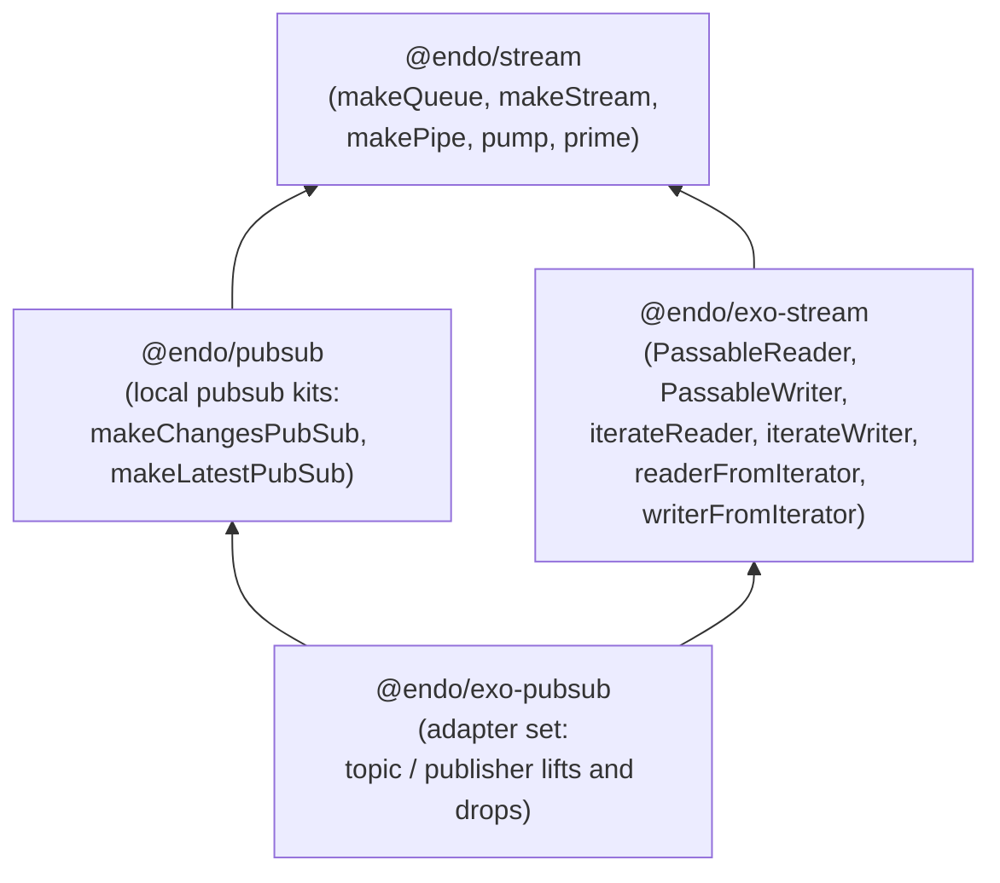

# Notifier Pubsub Migration

| | |
|---|---|
| **Created** | 2026-06-23 |
| **Updated** | 2026-06-23 |
| **Author** | Kris Kowal (prompted) |
| **Status** | Revision 4 (reoriented around local pubsub foundations + adapter set per kriskowal review on revision 3) |

## What is the Problem Being Solved?

Endo does not yet ship a pubsub primitive, either as a local async-iterator
toolkit at the `@endo/stream` layer or as a passable interface at the
`@endo/exo-stream` layer.
The closest in-tree precedents are `formulaChangeTopic` in
`packages/daemon/src/daemon.js` (a single-purpose daemon-internal lossless
topic) and the `retention-accumulator.js` coalesce-then-deliver primitive
from [`daemon-cross-peer-gc`](daemon-cross-peer-gc.md).
Neither is reusable across packages, and neither carries the local-layer
vocabulary (`Sink`, `Spring`, `Reader`, `Writer`) the rest of `@endo/stream`
already uses.

`@agoric/notifier`, in `agoric-sdk`, is the de facto pubsub primitive in
the broader Agoric ecosystem.
It is the design-vocabulary reference for the lossy / lossless taxonomy
(latest-only versus every-delta) and for the load-bearing
distributed-systems invariants (producer-not-vulnerable-to-consumers,
consumers-mutually-independent).
This design borrows the taxonomy and the invariants; it does **not**
retire `@agoric/notifier`.
`@agoric/notifier` continues to ship from `agoric-sdk` and the agoric-sdk
maintainer's schedule decides any future deprecation independently.

### Reorientation: start at the local layer

Earlier revisions of this design were rooted at the exo layer (`@endo/exo-pubsub`)
and treated the local layer as a sibling named in passing.
Revision 4 inverts that.
The maintainer's framing on PR #507 review (2026-06-23):

> in the way that `@endo/exo-stream` focuses on adapting local async
> iterators to passable readers, it may make more sense for us to start
> from local pubsub foundations including async promise queues
> (`@endo/stream` and `@endo/pubsub` layer) and async iterators for both
> consuming and producing changes or updates, as well as adapters for
> sampling a value and changes to a value on demand.
> ...
> In the next iteration, I would like to focus on a broader but tighter
> set of adapters that lift and drop between passable and local pubsub
> primitives.

That direction collapses the prior "two topic shapes as exos" framing
into a layered shape:

1. **A local `@endo/pubsub` package** at the `@endo/stream` layer.
   Two factories (`makeChangesPubSub`, `makeLatestPubSub`) that return a
   `{ sink, makeSpring }` kit over a shared async promise linked list.
   Sink is the producer end; each spring is an independent consumer cursor.
   No exos, no CapTP, no `Passable` constraint on the value type at this
   layer.
2. **An `@endo/exo-pubsub` package** at the `@endo/exo-stream` layer.
   Not a fixed catalog of topic shapes.
   Instead, a **set of adapters** that lift local pubsub primitives to
   passable topic / publisher exos, drop passable topic / publisher exos
   back to local readers / writers, and bridge to non-pubsub sources
   (springs, samplers, diff-driven samplers).
   Each adapter answers one direction of the lift/drop question;
   composing them is how a caller assembles the topology they need.

The exo layer's surface is not "the two topic shapes from `@agoric/notifier`
again, but as exos."
It is an inventory of adapters that decide, per-direction, what is local
and what is passable, given that the two often differ.

### Asymmetric passability

Revision 4 takes seriously the maintainer's observation:

> it occurs to me that there is an asymmetry where it may be sensible for
> either the topic or the publisher to be passable, but rarely both.

A pubsub kit has two facets, the publisher (producer end) and the topic
(consumer-fan-out end).
In practice, **one of the two facets is the wire-crossing facet, the
other stays local.**
A daemon-side process that publishes status updates locally and exposes
the topic to remote subscribers wants a **passable topic** and a
**local publisher** (it owns the producer; consumers ride the wire).
A peer that emits events to a remote daemon and lets the daemon fan them
out wants a **passable publisher** and a **local topic** (it owns the
consumer side; the producer rides the wire).
A topology that hands both facets across the wire is rare: it means the
process that holds the references is neither producer nor consumer,
which is unusual outside of pure routing.

This shape steers the adapter set.
Each adapter answers "given a local thing, give me a passable facet"
or "given a passable facet, give me a local thing" for one facet at a
time.
A kit factory whose product is "both facets passable" is not in the
adapter set; a caller who needs that composes a topic-passable adapter
with a publisher-passable adapter, two separate decisions.

### Incubation on `llm`

Per the maintainer's framing on inline comment 3460690829:

> Please make the base for this build the llm branch. This will incubate
> here and later get projected out to a change on the master branch.

The whole package family (`@endo/pubsub` at the local layer,
`@endo/exo-pubsub` at the exo layer) incubates on the `llm` branch, both
the design and the implementation.
A separate later project lifts the mature version onto `master`.
This is the same shape `@endo/exo-stream` took: introduced on `llm`,
matured under review there, projected to `master` after the design and
the implementation stabilized.

### Greenfield scope

The packages are **greenfield for Endo.**
No existing Endo or endo-but-for-bots consumer migrates onto them as a
prerequisite.
The only in-tree call site that the new packages will eventually replace
is `formulaChangeTopic` in `packages/daemon/`, and that replacement is a
follow-up rather than a precondition.
The packages land on their own merits as primitives that future Endo
code can use; whether and when other ecosystems (agoric-sdk, third-party
consumers) adopt them is out of scope for this design.

## Vocabulary

This design uses the vocabulary already established by `@endo/stream` and
`@endo/exo-stream`, plus the framing from
[*A General Theory of Reactivity*](https://kriskowal.com/gtor) (gtor).
A reader unfamiliar with the terms reads gtor first; the brief glossary
below is the in-design reminder.

| Term | Source | Meaning |
|---|---|---|
| `Sink<T>` | `@endo/stream` `types.d.ts` (`AsyncSink`) | The producer-facing half of an async queue. One method: `put(value)`. No return-value; resolution is implicit. |
| `Spring<T>` | `@endo/stream` `types.d.ts` (`AsyncSpring`) | The consumer-facing half of an async queue. One method: `get()`, returns `Promise<T>`. |
| `Queue<T>` | `@endo/stream` | A `Sink<T>` and a `Spring<T>` over the same async promise linked list. `makeQueue()` returns the pair. |
| `Reader<T>` | `@endo/stream` | A local async iterator that yields `T`. Symmetric duality with `Writer<T>`: a `Stream<T, undefined>` consumed via `for await`. |
| `Writer<T>` | `@endo/stream` | A local async iterator that consumes `T`. Symmetric duality with `Reader<T>`: a `Stream<undefined, T>` driven via `next(value)`. |
| `PassableReader<T>` | `@endo/exo-stream` | The exo-layer dual of `Reader<T>`. An exo over CapTP whose `stream(synHead)` method yields the bidirectional-promise-chain head a remote consumer drains. |
| `PassableWriter<T>` | `@endo/exo-stream` | The exo-layer dual of `Writer<T>`. An exo over CapTP whose `stream(synHead)` method accepts the bidirectional-promise-chain head a remote producer pushes onto. |
| stream (gtor) | gtor | The asynchronous-and-plural primitive that combines iteration and promises with bidirectional flow control. A `Reader<T>` and a `Writer<T>` together are a stream. |
| queue (gtor) | gtor | The asynchronous-plural primitive with `get`/`put` and no termination guarantees; the substrate `makeQueue` provides. |
| observable (gtor) | gtor | The synchronous-plural push primitive (`onNext`/`onReturn`/`onThrow`). Not directly used at the substrate layer, but the conceptual ancestor of a pubsub topic's "many subscribers, pushed values" shape. |

The "pubsub" arrangement, in this vocabulary, is **one sink and many
springs sharing one async promise linked list**.
The producer puts onto the sink; each subscriber's spring holds an
independent cursor on the shared chain.
This is the existing shape `packages/daemon/src/pubsub.js`
(`makeChangePubSub`) already uses; this design generalizes it.

## Layering



`@endo/pubsub` and `@endo/exo-stream` are siblings, each built on
`@endo/stream`.
`@endo/exo-pubsub` builds on **both**: it lifts and drops between
`@endo/pubsub`'s local kits and `@endo/exo-stream`'s passable readers and
writers.

The package boundaries match the boundaries of "what can pass over
CapTP" and "what cannot."
A `Reader<T>` from `@endo/stream` cannot pass over CapTP.
A `PassableReader<T>` from `@endo/exo-stream` can.
The local pubsub kit from `@endo/pubsub` cannot.
The passable topic / publisher exos that `@endo/exo-pubsub` mints can.
The adapter set's job is to convert across the line, in either direction,
for one facet at a time.

## `@endo/pubsub`: local pubsub foundations

The local package exports two factory functions over the existing
`@endo/stream` Sink / Spring / Queue primitives.
Each returns a kit shape modeled on the existing
`packages/daemon/src/pubsub.js` `makeChangePubSub`.

### `makeChangesPubSub<T>()`

The lossless-deltas variant.
Every subscriber sees every value delivered after its spring is minted.
A spring minted late sees only values published after the mint; it does
not replay history.

```ts
type ChangesPubSub<T> = {
  sink: AsyncSink<T>;
  makeSpring(): AsyncSpring<T>;
  finish(value?: undefined): void;
  fail(reason: Error): void;
};
```

The factory shape matches the existing `makeChangePubSub` in
`packages/daemon/src/pubsub.js` (file path; the daemon's existing function
keeps its current name during the migration window so this design's
landing does not churn unrelated daemon call sites).
This package re-homes the primitive to a reusable location and adds
termination (`finish` / `fail`) at the kit level so subscribers see a
clean `done: true` or a thrown error rather than a hung spring.

```js
import { makeChangesPubSub } from '@endo/pubsub/changes-pubsub.js';

const { sink, makeSpring, finish, fail } = makeChangesPubSub();
sink.put('a');
const earlySpring = makeSpring();
sink.put('b');
const lateSpring = makeSpring();
sink.put('c');
finish();
// earlySpring sees: a, b, c, done
// lateSpring sees: c, done
```

A spring's value semantics match the existing `@endo/stream` Spring: each
`get()` returns a promise for the next value on the spring's cursor.
Wrapping the spring with `makeStream(spring, nullIteratorQueue)` (the
existing pattern in `packages/daemon/src/pubsub.js`) recovers a
`Reader<T>` that a `for await` consumer drains.

### `makeLatestPubSub<T>()`

The lossy variant.
Every subscriber sees the most recent value (if any) on first drain,
then waits for the next publish.
Intermediate values that arrived while the subscriber was not drained
are dropped.
This matches `@agoric/notifier`'s notifier-pair semantics for
status-display / exchange-rate-style data.

```ts
type LatestPubSub<T> = {
  sink: AsyncSink<T>;
  makeSpring(): AsyncSpring<T>;
  finish(value?: undefined): void;
  fail(reason: Error): void;
};
```

The kit shape is identical to `makeChangesPubSub`; the retention policy
differs.
Internally, `makeLatestPubSub` maintains one cell (the most recent
published value) plus a "next" promise that resolves on the next publish.
A spring's `get()` either resolves immediately with the current cell
(if the spring has not yet read it) or awaits the next publish.

```js
import { makeLatestPubSub } from '@endo/pubsub/latest-pubsub.js';

const { sink, makeSpring, finish } = makeLatestPubSub();
sink.put(1);
sink.put(2);
const spring = makeSpring();
const a = await spring.get();  // 2 (latest, not 1)
sink.put(3);
const b = await spring.get();  // 3
finish();
```

A spring minted before the first publish blocks on its first `get()` until
the first `put`; this matches the `@agoric/notifier` semantic for a
status surface that has not yet emitted.

### Termination and cancellation

The `finish()` / `fail(error)` methods on each kit are the package's
producer-side termination surface.
A `finish()` settles every active spring's pending `get()` with the
terminal sentinel (the spring's `Reader`-wrapping yields `{ done: true,
value: undefined }`).
A `fail(error)` settles them with a rejection.

For **consumer-side cancellation**, this design adopts
`makeCancelKit()` (per the maintainer's framing on inline comment
3460690829: "Consider using `makeCancelKit`").
`makeCancelKit` does not yet exist in the repository; the maintainer's
direction is that the migration introduces it as a small companion
primitive.
Its shape:

```ts
type CancelKit = {
  cancel(reason?: Error): void;
  cancelled: Promise<never>;
};
```

The kit returns the rejection-side of a promise plus the function that
rejects it.
A consumer that wants to stop draining a spring (or, at the exo layer, a
remote topic) constructs a `CancelKit`, passes `cancelled` to the
draining wrapper, and calls `cancel(reason)` when ready to stop.
The pattern replaces the
`makePromiseKit()` + manual-rejection idiom that earlier revisions of
this design used inline:

```js
// Earlier revisions (manual):
const { reject: cancel, promise: cancelled } = makePromiseKit();
// ...
cancel(Error('done'));

// This revision (with makeCancelKit):
const { cancel, cancelled } = makeCancelKit();
// ...
cancel(Error('done'));
```

`makeCancelKit` lands as a sibling helper in `@endo/promise-kit` (or, if
the maintainer prefers, in `@endo/pubsub` itself as an internal until a
cross-cutting home is decided).
The choice of home is named in *Open questions* below.

## `@endo/exo-pubsub`: the adapter set

The exo-layer package is **not** a fixed catalog of topic shapes.
It is a set of adapters that decide, per-direction and per-facet, what
crosses the wire and what stays local.
The set below enumerates the adapters the maintainer's review names.
Each adapter is one module under `packages/exo-pubsub/` (no barrel
exports, per the project `CLAUDE.md`).

The set is organized by **direction** (what is local, what is passable)
and by **facet** (publisher facet, topic facet).
The asymmetric-passability framing from § *Asymmetric passability* above
explains why each adapter returns one facet rather than a pair.

### Topic facet adapters (consumer fan-out becomes passable, or comes from passable)

#### `topicFromReader(reader, options?)`: drops back-pressure to mint a topic from a single source

Given a local `Reader<T>`, mint a passable topic exo that fans the
reader's iterations out to many remote subscribers.
The adapter **drops the back-pressure channel** of the underlying reader:
the topic consumes the reader as fast as it can and broadcasts to all
attached subscribers.
A slow remote subscriber piles cells on its own side (the
`@endo/exo-stream` wire-protocol shape; see § *Back-pressure and wire
protocol* below) without slowing the source.

```ts
function topicFromReader<T>(
  reader: Reader<T>,
  options?: { valuePattern?: Pattern, returnPattern?: Pattern },
): PassableChangesTopicExo<T>;
```

Symmetric variant: `topicFromWriter(writer)` for the rare case where the
adapter is given a writer-shaped local source (a generator-as-writer; an
acknowledged channel whose acks the adapter throws away).

Underlying machinery: a `makeChangesPubSub` whose sink is fed by the
reader's iteration loop, plus the topic-from-pubsub passable lift below.

#### `topicFromSpring(spring, options?)`: mint a topic from a single async promise linked list

Given a local `AsyncSpring<T>` (a spring on an async promise linked
list), mint a passable topic exo whose subscribers each receive a fresh
cursor on the spring's underlying chain.
Each subscriber's cursor advances independently as the subscriber drains;
late subscribers begin at the chain's current head.

This is the simplest adapter in the set: it directly exposes the
`makeSpring`-output of `@endo/pubsub` to the exo layer.

```ts
function topicFromSpring<T>(
  spring: AsyncSpring<T>,
  options?: { valuePattern?: Pattern, returnPattern?: Pattern },
): PassableChangesTopicExo<T>;
```

The spring's underlying retention discipline determines whether the
resulting topic is changes-style or latest-style: a spring from
`makeChangesPubSub` produces a changes-style topic; a spring from
`makeLatestPubSub` produces a latest-style topic.
The convention is encoded in the exo's interface guard (the topic exo
returned from `makeChangesPubSub`'s spring carries a `sinkChanges`
method; the topic exo returned from `makeLatestPubSub`'s spring carries
a `sinkLatest` method).

#### `topicFromExoStream(passableReader, options?)`: lift a passable reader's wire protocol into a topic

Given a `PassableReader<T>` exo (the existing exo-stream protocol over
the wire), lift it to a passable topic exo that fans the reader's
remote iteration out to many subscribers on the receiving side.
The adapter drains the passable reader once per topic and broadcasts to
each subscriber's local spring.

This is the adapter that connects a remote producer's exo-stream output
to a local fan-out across several consumers, without forcing the
producer to know how many consumers exist.

```ts
function topicFromExoStream<T>(
  passableReader: ERef<PassableReader<T>>,
  options?: { valuePattern?: Pattern, returnPattern?: Pattern, buffer?: number },
): PassableChangesTopicExo<T>;
```

#### `readerFromTopic(topic, cancelled)`: drop a passable topic to a local reader

The inverse: given a passable topic exo, drop it to a local
`Reader<T>` on the consumer side.
This is the local-consumer-facing adapter that earlier revisions of this
design called `iterateChanges` / `iterateLatest`; this revision keeps a
single adapter whose name describes the direction.

```ts
function readerFromTopic<T>(
  topic: ERef<PassableChangesTopicExo<T> | PassableLatestTopicExo<T>>,
  cancelled: Promise<never>,
): Reader<T>;
```

The adapter introspects the topic exo's interface (via `__getMethodNames__()`)
to decide which sink method to call (`sinkChanges` versus `sinkLatest`).
The `cancelled` argument is the rejection-side of a `CancelKit`; settling
it releases the per-consumer producer-side state.

#### `patcherFromTopic(topic, applyDelta, cancelled)`: patch a local value from a remote subscription

The maintainer's review names this directly:

> We can likewise create a patcher for a local value from a remote
> subscription.

Given a passable changes topic exo and a delta-applying function, drain
the topic against a caller-supplied initial value, applying each delta
in arrival order.

```ts
function patcherFromTopic<T, D>(
  topic: ERef<PassableChangesTopicExo<D>>,
  initial: T,
  applyDelta: (current: T, delta: D) => T,
  cancelled: Promise<never>,
): {
  current(): T;
  subscribe(observer: (snapshot: T) => void): () => void;
};
```

A caller can use `current()` to read the current patched value at any
time, or `subscribe(observer)` to be notified on each delta apply.
The `cancelled` argument settles the underlying topic subscription per
the standard cancel pattern.

This adapter is the local-side counterpart to a remote source that
publishes deltas to a topic: the caller patches a local mirror without
having to write the drain loop by hand.

### Publisher facet adapters (producer becomes passable, or comes from passable)

#### `publisherFromIterator(iterator, options?)`: mint a passable publisher from a local async iterator

Given a local async iterator (anything that yields the values the topic
should publish), mint a passable publisher exo whose remote `next(value)`
calls drive an underlying pubsub kit's sink.

```ts
function publisherFromIterator<T>(
  iterator: AsyncIterator<T>,
  options?: { writePattern?: Pattern, writeReturnPattern?: Pattern },
): PassablePublisherExo<T>;
```

The dual of the existing `@endo/exo-stream`'s `writerFromIterator`.
A remote producer calls `E(publisher).next(value)`; the adapter routes
the value through the iterator's `next(value)` for any local
acknowledgement or side-effect, then puts on a sink the caller controls.

#### `publisherFromUpdateSampler(sample, schedule, options?)`: mint a publisher from a value sampler

The maintainer's review names this directly:

> We can create a publisher from an async iterator or an update sampler

Given a synchronous-or-async `sample()` function that returns the
current value of some observable thing, plus a `schedule(callback)`
function that fires the callback whenever the underlying thing might
have changed, mint a passable publisher exo that emits the current
sample on each schedule firing.

```ts
function publisherFromUpdateSampler<T>(
  sample: () => T | Promise<T>,
  schedule: (callback: () => void) => () => void,
  options?: { valuePattern?: Pattern },
): {
  publisher: PassablePublisherExo<T>;
  stop(): void;
};
```

The shape is suitable for "latest" surfaces: the publisher is wired into
a `makeLatestPubSub` so that each remote subscriber sees only the most
recent sample.
The returned `stop()` releases the `schedule` subscription and finalizes
the underlying pubsub.

#### `publisherFromChangeSampler(sample, diff, schedule, options?)`: mint a publisher from a differential change sampler

The maintainer's review names this directly:

> ... or a differential change sampler given a diff function.

Given a `sample()` that returns the current value, a `diff(prev, next)`
that returns the change between two samples (or a sentinel `null` /
`undefined` for "no change"), and a `schedule(callback)` that fires when
the value might have changed, mint a passable publisher exo that emits
the diff on each non-null change.

```ts
function publisherFromChangeSampler<T, D>(
  sample: () => T | Promise<T>,
  diff: (prev: T, next: T) => D | undefined,
  schedule: (callback: () => void) => () => void,
  options?: { deltaPattern?: Pattern },
): {
  publisher: PassablePublisherExo<D>;
  stop(): void;
};
```

The shape is suitable for "changes" surfaces: the publisher is wired
into a `makeChangesPubSub` so that each remote subscriber receives every
diff.
This is the adapter the daemon-cross-peer-gc retention-accumulator
pattern would lift to, were its current single-mutation-surface refactored
onto the new package.

### Asymmetry in the adapter set

The set above carries the asymmetric-passability framing as a structural
property.
A caller who wants a **passable topic and a local publisher** assembles:

- `topicFromSpring(spring)` to expose the topic facet.
- The local kit's `sink` (or any kit returned from `@endo/pubsub`) is the
  local publisher; it does not need an adapter.

A caller who wants a **passable publisher and a local topic** assembles:

- `publisherFromIterator(iterator)` (or the sampler variants) to expose
  the publisher facet.
- The local kit's `makeSpring()` is the local topic / fan-out; it does not
  need an adapter.

A caller who wants **both facets passable** (the unusual case) composes
two adapters in the same process, both reading or writing the same
underlying local kit.
The design does not provide a single-call factory for this case; the
composition is explicit so the caller acknowledges the topology.

## Back-pressure and wire protocol

The wire-protocol discipline is inherited from `@endo/exo-stream`: a
slow consumer accumulates backlog **in the consumer process**, not in
the producer process.
The producer side observes a slow consumer only as a slower
acknowledgement of the chain-head advance from that consumer; it does
not queue per-consumer deltas itself.

CapTP ferries `StreamNode` cells from the producer side to the consumer
side as the producer's chain-head advances, and the cells sit in the
consumer process's heap until the consumer drains them.
A consumer that reads slowly piles cells in its own heap; the producer
side holds only the chain-head reference per active iteration and is
bounded.

`@endo/pubsub`'s changes variant matches this on the local side: each
spring is a cursor, and the cells live on the shared async promise
linked list until the slowest-cursor consumer advances past them.
The lossy variant carries only one cell (the latest) regardless of
consumer count, so the local-side memory cost is bounded irrespective of
consumer lag.

This is the `@agoric/notifier`'s "producer not vulnerable to consumers"
invariant carried into both layers via the same mechanism `@endo/stream`
and `@endo/exo-stream` already use.

### Overflow policy on the consumer

The wire-protocol-side accumulation is unbounded by default.
A consumer that does not drain pins consumer-process memory.
A consumer that needs a bound applies it on the local side, after
`readerFromTopic` recovers the local reader: the consumer wraps its
local reader with a coalescing accumulator (see
`retention-accumulator.js` from
[`daemon-cross-peer-gc`](daemon-cross-peer-gc.md)) or a drop-oldest policy
of its own choosing.
The adapters do not bake an overflow policy into the topic itself; the
consumer that knows its memory budget knows the right policy.

## Cross-design coordination

| Design | Relationship |
|---|---|
| [daemon-message-streaming](daemon-message-streaming.md) | The closest in-tree precedent for an exo-shaped streaming interface. Its four-event taxonomy (`append` / `setPhase` / `end` / `abort`) collapses onto the `next` / `return` / `throw` triple, which `publisherFromIterator`'s underlying iterator follows. A daemon-message-streaming consumer that wants a fan-out (one streaming source, many downstream UI surfaces) wraps the streaming source's local reader with `topicFromReader` to mint a passable topic, then exposes the topic exo to its UI consumers. |
| [daemon-cross-peer-gc](daemon-cross-peer-gc.md) | `formulaChangeTopic` is the direct in-tree precedent for the changes-pubsub kit. The `retention-accumulator.js` coalesce-then-deliver primitive is the precedent for the optional subscriber-side delta-coalescing addressed in *Back-pressure and wire protocol*. The new packages generalize `formulaChangeTopic` from a single-purpose daemon-internal topic into a reusable kit plus adapter set; the daemon's existing call site is one of the eventual migration targets. |
| [presence-severance-observation](presence-severance-observation.md) (PR #450) | Out of reach for this iteration. The presence-severance design has not landed, so the adapters cannot rely on `E.whenSevered(presence)` to observe a remote consumer's CapTP severance. The cancellation surface uses `makeCancelKit` per § *Termination and cancellation*; once presence-severance lands, a future revision can wire `E.whenSevered(consumerPresence)` to settle the cancel kit's promise automatically, so a remote consumer whose CapTP session severs is treated identically to a graceful cancellation. The consumer retains the right to cancel earlier on local conditions. |
| `@endo/exo-stream` (`packages/exo-stream/`) | The new adapter set composes with the existing exo-stream toolkit. `topicFromReader` calls `readerFromIterator` internally to mint the underlying passable surface; `readerFromTopic` mirrors `iterateReader`'s consumer-side iterator construction. The packages depend on `@endo/exo-stream` for the bidirectional-promise-chain protocol primitives. |
| `@endo/stream` (`packages/stream/`) | The new local package is a sibling: both build on the Sink / Spring / Queue substrate. The new `@endo/pubsub` re-homes the existing `packages/daemon/src/pubsub.js` `makeChangePubSub` into a reusable location and adds the lossy variant. `makeQueue` and `makeStream` are the substrate; the new package does not reimplement them. |
| Earlier `@endo/stream` `makePubSub` + `makeTopic` (commit `cbbd57c03`, since removed) | Design-consistency anchor. The new `@endo/pubsub`'s `makeChangesPubSub` matches the removed `makePubSub` shape (sink + many independent springs over a shared async linked list); the kit-with-finish/fail surface is the additional discipline this design adds. |
| `@endo/promise-kit` | The home for `makeCancelKit` per § *Termination and cancellation* and *Open questions*. |

## Compatibility considerations

The original endo#1035 motivation was a Parcel-bundler interaction where
`@agoric/notifier`'s dependency on `@endo/marshal` re-used `@endo/marshal`'s
identity across the agoric-sdk boundary in a way that Parcel could not
resolve through symlinks.
The new packages' designs avoid re-creating that pain:

- **`@endo/pubsub` does not depend on `@endo/marshal` at all.**
  It is a local-layer package; marshal involvement is impossible by
  layering.
- **`@endo/exo-pubsub` does not depend on `@endo/marshal` directly.**
  Pattern guards come from `@endo/patterns`; the exo machinery comes from
  `@endo/exo` (via `defineExoClassKit`); the stream contracts come from
  `@endo/stream` and `@endo/exo-stream`.
  Marshal involvement is transitive at most, the same way every other
  `@endo/*` package transitively depends on marshal through the exo
  layer.
- **No symlink-sensitive layouts.**
  Both packages are siblings of existing `@endo/*` packages in `packages/`,
  ship with the same `tsconfig.composite.json` / `tsconfig.build.json` /
  `package.json` shape as their siblings, and expose one module per
  exported function (no barrel exports, per the project `CLAUDE.md`).

## Durable pubsub deferred

Persistence of unread changes in `makeChangesPubSub` across a daemon
restart, or persistence of the latest cell in `makeLatestPubSub`, is not
in scope.
The maintainer's framing on an earlier revision: *"Not relevant at this
layer. Durable pubsub is another concern that would require durable
exos. We can introduce these later."*
A future to-be-filed tracking issue revisits durable pubsub once durable
exos exist; that work is a separate sibling design, not a follow-up of
this one.

## Future evolution: collection-change propagation

The maintainer's review names a longer-term direction:

> Please also read in https://github.com/kriskowal/frb for how this
> might later evolve into a system for propagating changes to
> collections through transform relations with automated subscription
> and unsubscription.

[FRB (Functional Reactive Bindings)](https://github.com/kriskowal/frb)
provides incremental collection-change propagation: arrays and
collections dispatch granular change records (additions, removals,
splices), transforms (`map`, `filter`, `sum`, `sorted`) propagate
changes incrementally rather than recomputing, and bindings manage
listener lifecycles automatically (when a property path is replaced,
old listeners detach and new ones attach to the updated graph).

A future evolution of `@endo/pubsub` / `@endo/exo-pubsub` could carry
that shape:

- A `ChangesPubSub<Splice<T>>` whose values are FRB-style
  range-change records (`{ plus, minus, index }`) rather than opaque
  deltas.
- Transform adapters that consume a topic over change records and
  produce a derived topic over change records (the `topic.map(fn)` of
  a `topicFromReader(reader).map(fn)` chain would be incremental, not
  full re-broadcast).
- Automatic subscription / unsubscription managed by the binding
  graph, so a property-path replacement that affects a downstream
  topic detaches the old upstream and attaches a new one without the
  caller writing the wiring by hand.

This evolution is **not in scope for this design.**
The current iteration ships the substrate (`@endo/pubsub`) and the
adapter set (`@endo/exo-pubsub`).
Once both are mature on `llm` and projected to `master`, the FRB-shaped
extension is a sibling design that builds on top.
Naming it here ensures the substrate's value-type is not foreclosed:
the kits and adapters are parameterized on `T`, and a future
`T = SpliceChange<U>` instantiation is the migration onto FRB shape.

## Open questions

- **Home for `makeCancelKit`?**
  The natural home is `@endo/promise-kit` as a small sibling of
  `makePromiseKit`.
  An alternative is `@endo/pubsub` itself (as an internal until a
  cross-cutting home is decided).
  The decision affects how broadly the primitive is available to
  callers outside this package family.
  The maintainer's framing on inline comment 3460690829 names `makeCancelKit`
  but does not name its home; this question surfaces the choice.

- **Should the latest-pubsub spring replay the latest value to a late
  subscriber, or only emit on the next publish?**
  Earlier revisions of this design adopted the `@agoric/notifier`
  "replay latest on first drain" semantic (a late subscriber sees the
  current cell immediately, then waits).
  The alternative (a late subscriber waits for the next publish, even
  if a cell is present) matches a stricter "from-now-forward" semantic.
  Revision 4 keeps the replay-latest behavior pending the maintainer's
  judgment.

- **Should `topicFromExoStream` drain the source eagerly (start consuming
  on adapter construction) or lazily (start consuming on the first
  subscriber)?**
  Eager drain matches the maintainer's "drop the back-pressure"
  framing for `topicFromReader` and is the simpler shape.
  Lazy drain avoids paying the cost when no subscriber attaches.
  The set-of-adapters framing accommodates both: a lazy variant is a
  sibling adapter, not a configuration toggle.

## Prompt

The original dispatch prompt and the maintainer's three review iterations
shape this revision.
The current iteration's centroid:

> Please read in https://kriskowal.com/gtor for shared vocabulary and
> take another pass at this design.
> In the next iteration, I would like to focus on a broader but tighter
> set of adapters that lift and drop between passable and local pubsub
> primitives.
> At the Exo layer, we can create various kinds of topics and publishers
> as adapters.
> For example, we can create topics from a local reader or writer,
> dropping the back-pressure channel.
> We can create a topic from a Spring.
> We can create a topic from the Exo stream async promise chain protocol
> over the wire.
> We can create a publisher from an async iterator or an update sampler,
> or a differential change sampler given a diff function.
> We can likewise create a patcher for a local value from a remote
> subscription.

The earlier revisions' framing (three topic shapes; two topic shapes
with exos; greenfield-for-Endo; durable-pubsub-deferred;
presence-severance-not-yet) remains valid; this revision reorients the
catalog from "fixed topic shapes" to "adapter set" without abandoning
the prior scoping decisions.

## Library and project references

### Library concepts and sections

- [`concepts/exo-stream.md`](../../journal/library/concepts/exo-stream.md) — the canonical bridge from local async iterators to remote-passable `PassableReader` / `PassableWriter` exo refs. The maintainer's "exo-streams discipline" rooting. Read first.
- [`sources/endo--packages-stream-README-md`](../../journal/library/sources/) section family — `@endo/stream`'s symmetric Reader/Writer type, parity invariant, back-pressure-via-acks. The `Reader<T>` / `Writer<T>` framing this revision's adapter set anchors on.
- [`sections/endo--packages-stream-index-js--symmetric-async-iterator-streams-with-makeQueue-makePipe-pump-and-prime-utilities`](../../journal/library/sections/) — the source implementation. `makeQueue` is the async-promise-linked-list-queue this design's pubsub kits are built on; `Sink` and `Spring` are the substrate vocabulary.
- [`sections/agoric-sdk--pkg-notifier-readme--type-differences`](../../journal/library/sections/) — the lossy / lossless taxonomy that distinguishes `makeLatestPubSub` from `makeChangesPubSub`.
- [`sections/agoric-sdk--pkg-notifier-readme--distributed-operation`](../../journal/library/sections/) — the load-bearing distributed-systems properties: producer-not-vulnerable-to-consumers, consumers-mutually-independent.
- [`concepts/retention-accumulator.md`](../../journal/library/concepts/retention-accumulator.md) — coalesce-then-deliver microtask-batched delta primitive. Precedent for `publisherFromChangeSampler`'s diff-driven shape and for consumer-side coalescing on a `readerFromTopic` consumer.
- [`topics/exo.md`](../../journal/library/topics/exo.md) and [`sections/endo--agents--exo-this-context`](../../journal/library/sections/) — the Exo class API (`makeExo` / `defineExoClass` / `defineExoClassKit`) and `M.interface` guards. Required for each adapter's exo construction.
- [`topics/streams.md`](../../journal/library/topics/streams.md) — the topic index for the streams family.

### External references

- [A General Theory of Reactivity](https://kriskowal.com/gtor) (gtor) — the vocabulary anchor for `Stream`, `Queue`, `Promise`, `Iterator`, `Observable`. The asymmetric-passability framing borrows the gtor distinction between **plural / asynchronous / push** (the observable-pubsub axis) and **plural / asynchronous / bidirectional** (the stream axis) to motivate why the adapter set decides per-facet rather than per-pair.
- [FRB: Functional Reactive Bindings](https://github.com/kriskowal/frb) — the future-evolution direction per § *Future evolution: collection-change propagation*. Cited for forward-compatibility; the present design does not implement FRB shape.

### Project context

- [`projects/endo-but-for-bots/README.md` § Rules of engagement](../../journal/projects/endo-but-for-bots/README.md) — design PRs land on `llm` branch; design-PR convention applies; standing relaxation authorizes the DRAFT PR open without per-action authorization in the dispatch prompt.
- [`projects/endo-but-for-bots/README.md` § Authority structure](../../journal/projects/endo-but-for-bots/README.md) — every commenter on this repo is maintainer-equivalent.
- Related designs on the `llm` branch's `designs/` tree:
  - [`daemon-message-streaming.md`](daemon-message-streaming.md) — StreamWriter / StreamReader exo interfaces; CapTP-rides-method-calls discipline; persistence model.
  - [`daemon-cross-peer-gc.md`](daemon-cross-peer-gc.md) — `formulaChangeTopic` single-mutation-surface pattern; `followRetentionSet` async-iterator follower lifecycle.
  - [`presence-severance-observation.md`](presence-severance-observation.md) (PR #450, not yet landed) — `E.whenSevered(presence)` as the holder-facing observer for transport-, object-, and permission-level severance. Future revision can layer it on `makeCancelKit`.
- `packages/stream/` — the local-layer substrate the new `@endo/pubsub` builds on.
- `packages/exo-stream/` — the exo-layer substrate the new `@endo/exo-pubsub` builds on. Upstream PR `endojs/endo#3036` is the related migration guide.
- `packages/daemon/src/pubsub.js` — the existing `makeChangePubSub` and `makeChangeTopic` (the prototype `@endo/pubsub` re-homes and generalizes).
