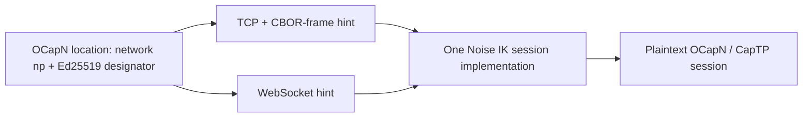

# OCapN Network/Transport Separation

| | |
|---|---|
| **Created** | 2026-02-14 |
| **Updated** | 2026-07-29 |
| **Author** | Kris Kowal (prompted), Kriscendo Bot (prompted) |
| **Status** | In Progress |

## What is the Problem Being Solved?

An OCapN location identifies a network, while a transport only carries that
network's bytes. `@endo/ocapn-noise` already has the beginnings of that
separation: its `.np` network owns the Noise handshake and offers
`provideSession`, and its TCP and WebSocket adapters supply byte streams.
However, `addTransport()` both registers a dial adapter and immediately starts
its listener. A location is then made by flattening every listener's hints.
That makes publication an accidental side effect of registration, and gives a
daemon no explicit, independently managed TCP+CBOR-frame and WebSocket
listening surfaces.

This is the prerequisite for the WebSocket work proposed in
endojs/endo-but-for-bots PR #684. That PR must remain deferred: it must not
invent daemon URL formats or configure a WebSocket listener directly while the
network API cannot publish the same peer's complete, multi-transport location.

## Target Model

An OCapN location names the network and identity; hints name zero or more ways
to reach that identity. For Noise, the network is always `np`, and the
designator is the 32-byte Ed25519 public key rendered as 64 lowercase hex
characters. The legacy `transport: 'np'` field remains on the wire during the
`network` migration, but it is not used to select a byte carrier.

For `.np`, the OCapN session-routing identity is `(network, designator)`, not
the complete serialized location. Hints can change when an endpoint binds,
rebounds, or is withdrawn; including them in `locationToLocationId` would make
one authenticated peer look like several peers and defeat crossed-hello and
session reuse. The client therefore obtains the network's canonical peer ID
from `network: 'np'` plus the designator. Legacy netlayers keep their existing
location serialization until they migrate to this identity rule.



Hints retain the OCapN locator's string-to-string table so they remain
serializable by the existing codec. A key is `<transport-scheme>:<field>`.
The initial registered schemes are:

| Carrier | Scheme | Published hints | Framing |
|---|---|---|---|
| TCP | `tcp+cbor` | `tcp+cbor:host`, `tcp+cbor:port` | One definite-length CBOR byte string per Noise handshake or ciphertext frame |
| WebSocket | `ws` | `ws:url` | One binary WebSocket message per Noise handshake or ciphertext frame |

`tcp+cbor` is deliberately distinct from the current TCP netstring adapter:
the scheme is a wire commitment, not a nickname. The TCP implementation uses
the byte-string framing primitive described by [cbors.md](cbors.md) (now named
`@endo/cbor-frame`), with a bounded inbound frame size. A peer only selects a
transport for which it has both a registered dial adapter and a complete hint
set. It tries matching schemes in the caller-configured preference order; a
failed dial closes its partial stream before the next eligible scheme is tried.

Only one published endpoint per scheme is allowed in a location. Registering
two `ws` listeners must fail rather than silently overwrite `ws:url`. A future
multi-endpoint scheme needs an explicitly specified encoding, rather than an
array smuggled into the string-only hints table.

## Target API

`addTransport` registers a dial adapter only. Listening is a separate,
explicit operation and returns the authority needed to withdraw the associated
hints.

```js
const network = makeOcapnNoiseNetwork({ codec: cborCodec });
const keyId = network.addSigningKeys(signingKeys);

const tcp = makeTcpCborTransport();
const ws = makeWebSocketTransport({ WebSocket, WebSocketServer });
network.addTransport(tcp);
network.addTransport(ws);

const tcpListener = await network.listen(tcp, {
  host: '127.0.0.1',
  port: 3469,
});
const wsListener = await network.listen(ws, {
  host: '127.0.0.1',
  port: 443,
  url: 'wss://peer.example/ocapn-cbor-np',
});

const location = network.locationFor(keyId);
// location.hints === {
//   'tcp+cbor:host': '127.0.0.1',
//   'tcp+cbor:port': '3469',
//   'ws:url': 'wss://peer.example/ocapn-cbor-np',
// }

tcpListener.close(); // withdraws only tcp+cbor hints and listener
wsListener.close(); // withdraws only ws hints and listener
```

The transport and listener contracts are:

```ts
interface OcapnNoiseTransport<ListenOptions> {
  readonly scheme: string;
  connect(hints: Record<string, string>): Promise<ByteStream>;
  listen(
    options: ListenOptions,
    accept: (stream: ByteStream) => void,
  ): Promise<TransportListener>;
  shutdown(): void;
}

interface TransportListener {
  readonly hints: Record<string, string>; // unprefixed and complete
  close(): void;
}

interface OcapnNoiseNetwork {
  addTransport(transport: OcapnNoiseTransport<unknown>): void;
  listen(
    transport: OcapnNoiseTransport<unknown>,
    options: unknown,
  ): Promise<TransportListener>;
  locationFor(keyId: KeyIdHex): OcapnLocation;
}
```

The network prefixes and validates `listener.hints` before publication. A
listener is live only after binding succeeds; a failed bind changes neither the
registered adapters nor any advertised location. `removeTransport` fails while
that transport owns a listener. `shutdown` closes every listener, then every
transport and session. Locations are snapshots: callers publish a newly
obtained location after an endpoint is added, removed, or rebound; existing
sessions continue independently of later hint changes.

Inbound Noise routing is unchanged. Every listener hands its stream to the
same responder path; the cleartext intended-responder-key prefix chooses the
registered signing key. Thus TCP and WebSocket can terminate sessions for the
same `.np` designator without either listener possessing a special identity or
without a transport becoming part of the identity.

## Migration Plan

1. Land or expose the bounded `@endo/cbor-frame` reader/writer from
   [cbors.md](cbors.md), and implement `makeTcpCborTransport`. Keep the
   netstring TCP adapter available under its current scheme; it is not wire
   compatible with `tcp+cbor`.
2. Split the current `OcapnNoiseTransport.listen(handler)` into
   `listen(options, accept)`, and change `addTransport` to registration only.
   Update the mock, TCP, and WebSocket adapters plus their tests. Provide a
   short-lived compatibility helper only if an external consumer still calls
   the old one-step API; do not retain implicit listening in the new API.
3. Add `OcapnNoiseNetwork.listen`, atomic hint aggregation, duplicate-scheme
   rejection, ordered fallback, and lifecycle tests. The core
   `@endo/ocapn` `OcapnNetwork.provideSession` and `inboundSessions` surface is
   already the correct handoff and does not gain transport knowledge. Change its
   `.np` session key to `(network, designator)` so hint publication never
   creates a second session for the same authenticated peer.
4. Migrate all Noise fixtures to obtain locations only after listeners bind.
   Exercise TCP-only, WS-only, and dual-listener peers; verify that a dual
   peer dials a TCP-only and a WS-only peer, that the preferred unreachable
   hint falls back, and that closing one listener removes only its hints.
5. Only then resume PR #684 as a daemon adapter. It creates the TCP+CBOR and
   WebSocket listeners through this API, persists each resolved bind address
   independently, and publishes one serialized `.np` location in the daemon
   peer address. It does not add a transport-specific location format or
   duplicate transport-selection logic in `packages/daemon/src/networks/ocapn.js`.

## Security and Compatibility

Noise IK continues to authenticate the designator regardless of the carrier;
connection hints are untrusted routing suggestions, not identity assertions.
The TCP frame reader must cap declared lengths before allocation, and both
listener adapters must reject non-binary or malformed frames and close the
stream. WebSocket TLS is useful defense in depth but does not replace Noise.

This changes the private, pre-1.0 `@endo/ocapn-noise` embedding API. The OCapN
locator codec remains compatible because the published hints are still string
values and `transport: 'np'` remains present during the `network` migration. It
intentionally creates a new TCP wire scheme: a netstring peer and a `tcp+cbor`
peer must not be treated as interchangeable.

## Test Plan

- Unit-test publication, deterministic hint order, duplicate-scheme rejection,
  bind rollback, listener withdrawal, and adapter removal while listening.
- Run Noise handshake and encrypted message exchange over TCP+CBOR-frame,
  WebSocket, and a mixed pair with only one mutually supported carrier.
- Run crossed-hello and inbound-session tests with opposite transports, proving
  that session deduplication keys on the Noise identity rather than an endpoint.
- Rebind or withdraw an advertised endpoint, then provide a session through the
  newly published location and assert reuse of the existing `.np` session.
- Feed fragmented, oversized, malformed, and text WebSocket frames; assert the
  connection closes without an unbounded allocation or a stuck reader.
- At the daemon layer, once PR #684 resumes, run the shared multiplayer suite
  with TCP only, WebSocket only, and both listeners enabled, including restart
  persistence of both resolved ports.

## Dependencies

| Design | Relationship |
|---|---|
| [cbors.md](cbors.md) | Supplies the TCP CBOR byte-string framing primitive. |
| [ocapn-noise-network.md](ocapn-noise-network.md) | Supplies the Noise IK session, key routing, and transport plugin substrate amended here. |
| [ocapn-noise-session-reconnect.md](ocapn-noise-session-reconnect.md) | Must preserve session ownership and close behavior across every carrier. |
| [ocapn-noise-key-only-session-boundary.md](ocapn-noise-key-only-session-boundary.md) | A relay forwards the framed ciphertext stream to these terminating listeners. |

## Prompt

> Let’s return to PR #684 after OCapN has been refactored such that the Noise
> Protocol Network (`.np`) provides connection hints for multiple transports
> and can listen on both WebSocket and TCP+CBOR-frame ports separately.
