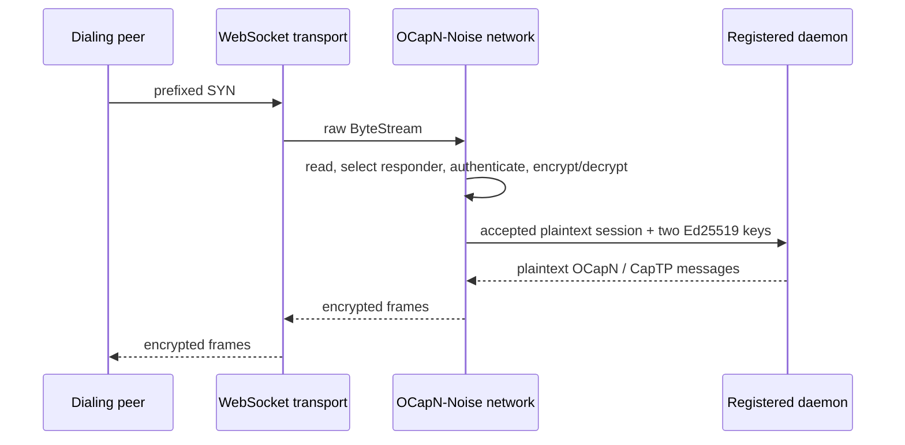

# OCapN-Noise Key-Only Session Boundary

| | |
|---|---|
| **Created** | 2026-07-18 |
| **Author** | Kris Kowal (prompted) |
| **Status** | Proposed |

## What is the Problem Being Solved?

The current gateway WebSocket handler in `packages/gateway/src/ocapn-ws.js`
reads the first Noise frame to discover its cleartext intended-responder key,
uses that key to select a registered daemon, then reconstructs a reader with
`prependFrame` so the daemon-side Noise responder can read the same SYN again.
That makes the gateway a partial implementation of the Noise session
establishment protocol. The temporary reader is a Far-tagged replay adapter
solely to cross the CapTP handoff.

The session boundary belongs below both the gateway and the daemon protocol
consumer. An application should name a peer by its Ed25519 public key and get
an authenticated plaintext session. It must neither construct nor receive a
prefixed SYN, SYNACK, ciphertext frame, encryptor, decryptor, or handshake
state.

## Boundary

The OCapN-Noise network owns the complete lifecycle from a framed transport
stream to an authenticated session. A transport passes a raw `ByteStream`
*down* to the network. The network is the only layer that reads handshake
frames, constructs them, decrypts them, or writes their responses. Above the
network, identity is represented only by raw 32-byte Ed25519 public keys.

The following distinction is intentional. Key provisioning is an
administrative operation: the network's protected identity store still needs a
private signing capability to respond for a registered local key. The
key-only rule governs the **per-session application boundary**. It does not
make private-key provisioning an application session argument, and it does not
put a private key in an accepted-session record.



### Connect down

`runInitiator` already has the correct responsibility split internally: the
network selects its local key, receives `peerEd25519` and a location, creates
the prefixed SYN, and writes it to the transport. Make that split the public
contract rather than an internal accident. The network-facing connect operation
is:

```ts
connect({
  peerEd25519: Uint8Array,
  location: OcapnLocation,
  localKeyId?: KeyIdHex,
}): Promise<OcapnNoiseSession>
```

`provideSession(remote, options)` remains the OCapN-core convenience surface:
it derives `peerEd25519` from the remote locator and delegates to `connect`.
Neither it nor any caller allocates `PREFIXED_SYN_LENGTH`, invokes
`initiatorWriteSyn`, or sees a SYNACK. The result remains a plaintext
`OcapnNoiseSession`, whose `remotePublicKeyBytes` equals the requested public
key after authentication.

### Accept up

Add a network-owned responder registration, keyed by the local public key.
The registration binds a public key already present in the network's protected
local-key store to an application session recipient. The exact capability used
to enroll the private key is deliberately separate from this session API.

```ts
interface OcapnAcceptedSession {
  responderEd25519: Uint8Array;
  initiatorEd25519: Uint8Array;
  reader: Reader<Uint8Array>;
  writer: Writer<Uint8Array>;
  close(): void;
}

interface OcapnSessionRecipient {
  handleOcapnSession(session: OcapnAcceptedSession): Promise<void>;
}

registerResponder(
  responderEd25519: Uint8Array,
  recipient: OcapnSessionRecipient,
): () => void;
```

`handleIncoming` becomes the private implementation of this operation. It
reads the prefixed SYN once, selects both the local signing identity and the
recipient from the intended responder key, completes Noise and the encrypted
identity exchange, then delivers one `OcapnAcceptedSession`. The recipient
does not receive `ByteStream`, `prefixedSyn`, `encrypt`, or `decrypt`.

The `reader` and `writer` in an accepted session carry plaintext OCapN
messages. If the recipient is in another vat, the network exports the session
using the standard session/stream passable surface. It must not manufacture a
special Far replay reader or a writer forwarding adapter. This removes the
gateway's `OcapnReplayReader` dance rather than moving it to a new name.

The recipient is responsible for attaching the plaintext session to its OCapN
or CapTP consumer and for closing it on recipient-side failure. The network
retains responsibility for closing both underlying transport halves on any
handshake or delivery failure.

## Responder Algorithm and Abuse Limits

For every incoming transport stream, the network performs these steps in this
order:

1. Read exactly one prefixed SYN with the existing handshake timeout and exact
   `PREFIXED_SYN_LENGTH` validation.
2. Extract the first 32 bytes only inside the network, resolve the local key
   and recipient, and close an unknown or unregistered identity without
   allocating a Noise instance.
3. Apply the existing `inProgressFull(intendedKeyId)` limit before the IK
   decrypt. This preserves the cheap-prefix denial-of-service gate per local
   identity.
4. Run `responderReadSynWriteSynack`, recover and authenticate
   `initiatorVerifyingKey`, then apply the existing second cap to its hex key.
   This continues to prevent one authenticated peer from spreading work across
   many responder identities.
5. Increment the authenticated initiator's in-progress count, exchange
   encrypted locations, build the plaintext session, and deliver the
   `(intended responder, authenticated initiator)` tag to that responder's
   recipient.
6. On success, record and settle the candidate as today. On any failure,
   including recipient rejection, close the stream and perform the same
   decrement/error settlement as the present `handleIncoming` path.

No unbounded application queue is introduced between authentication and
delivery. A recipient must take ownership synchronously enough for the
network's bounded handshake work to complete, or the network closes the
session. Tests must cover unknown responder, full intended-responder cap,
full authenticated-initiator cap, malformed or timed-out SYN, and recipient
rejection.

## Package Changes

### `@endo/ocapn-noise`

`packages/ocapn-noise/src/network.js` keeps `runInitiator` as the sole SYN
constructor and makes the public `connect` contract explicit. Its listening
path feeds every transport's stream directly to the network-owned accept
operation. `handleIncoming` is not widened with `{ prefixedSyn? }`; that shape
would preserve Noise bytes above the network boundary.

`packages/ocapn-noise/src/types.d.ts` gains public names for the connect
request, accepted-session record, and responder recipient/registration. It
documents `ByteStream` as transport-private input to acceptance and documents
that `OcapnNoiseSession.reader` and `.writer` are plaintext. The existing
`inboundSessions` iterator remains appropriate for an in-process OCapN core.
Registered external recipients use the same authenticated session shape, with
the explicit responder and initiator tags needed for multiplexing.

Every responder must migrate, not just the WebSocket gateway: built-in
transport listeners, test transports, relay registrations, and any direct
caller that currently expects raw Noise frames all register a session
recipient. This is a source-wide handoff change, not a gateway-local patch.

### Daemon and gateway

The daemon-side `handleOcapnSession` exo changes from accepting
`{ reader, writer }` of encrypted wire frames to accepting
`OcapnAcceptedSession`. It receives the chosen responder key and the
authenticated initiator key alongside the plaintext duplex stream, then hands
that session to its OCapN/CapTP session manager.

`packages/gateway/src/ocapn-ws.js` becomes a transport adapter. On WebSocket
upgrade it validates only the generic stream shape and delegates it to the
network acceptor. It no longer reads the first frame, defines
`OCAPN_INTENDED_RESPONDER_PREFIX_LENGTH` or
`OCAPN_PREFIXED_SYN_MIN_LENGTH`, converts a key to hex for routing, looks up a
daemon from a SYN prefix, or defines `prependFrame`. Registration code binds a
daemon recipient to the network's responder-key registration instead.

The gateway consequently terminates the OCapN-Noise network layer for the
identities it serves. This replaces the current ciphertext-relay claim with a
clearer trust boundary: the gateway's network/key-store component needs the
authority to use each responder identity's private signing capability, while
the daemon receives only authenticated plaintext. Deployments that require
the gateway to remain a blind ciphertext relay need a distinct relay design;
they cannot also meet this key-only accepted-session boundary.

## Compatibility and Rollout

The peer wire format does not change. The prefixed SYN remains the same size
and meaning, the SYNACK and encrypted post-handshake frames are unchanged, and
existing peer implementations stay interoperable. This is therefore not a
protocol-version or locator-format change.

It is source and deployment visible. `handleOcapnSession` changes shape,
gateway registrations move from a public-key-to-raw-stream target table to a
public-key-to-session-recipient registration, and all responders must update
together. A mixed local deployment cannot hand a raw stream to a new daemon or
an accepted session to an old daemon. Land the network types and adapters with
compatibility tests, migrate each responder, then remove the old raw-stream
handoff in one coordinated change. Do not support `{ stream, prefixedSyn? }`
as an interim public API.

## Implementation Plan

1. Define and test the `connect`, responder-registration, and accepted-session
   types in `types.d.ts`; exercise both direct transport listeners and a mock
   multiplexing recipient.
2. Refactor `network.js` so its inbound state machine owns selection and
   delivery while preserving its timeout, close, crossed-hello, and two-stage
   in-progress accounting behavior.
3. Migrate all daemon and relay consumers to plaintext
   `handleOcapnSession(session)`, including CapTP attachment and failure
   teardown.
4. Reduce `ocapn-ws.js` to the WebSocket transport adapter, delete the prefix
   constants and `prependFrame`, and replace gateway unit tests with an
   end-to-end assertion that the recipient sees the two keys and plaintext but
   never the SYN.

## Dependencies

| Design | Relationship |
|---|---|
| [ocapn-noise-network](ocapn-noise-network.md) | Existing network, handshake, transport, and session substrate this design narrows at its application boundary. |
| [ocapn-noise-session-reconnect](ocapn-noise-session-reconnect.md) | Session ownership and close behavior must remain compatible with reconnection and crossed-hello settlement. |
| [gateway-package](gateway-package.md) | Its OCapN WebSocket feature and relay description must use the network-owned acceptance model. |

## Open Questions

- What protected key-store or signing-capability arrangement lets a shared gateway network terminate a registered daemon identity without broadening the gateway process's authority beyond the intended deployment model?
- Should a blind ciphertext relay remain a supported deployment role, and if so, what separate relay-to-network interface preserves that role without reintroducing raw SYN handoff to daemons?

## Prompt

Issue [#406](https://github.com/endojs/endo-but-for-bots/issues/406) identified
the gateway SYN replay workaround. The maintainer direction dated 2026-07-18
requires peer authentication and encryption to move into the network layer so
only Ed25519 public keys cross the connect and accepted-session boundaries.
