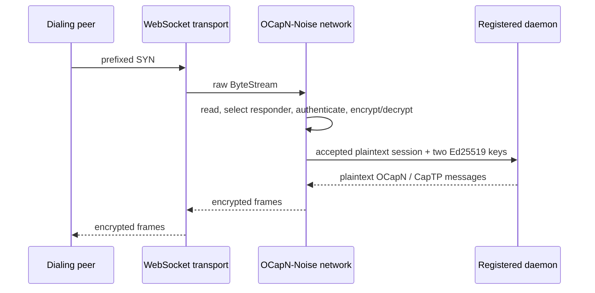

# `noise-protocol-ik-relay`: Key-Routed Noise IK Sessions

| | |
|---|---|
| **Created** | 2026-07-18 |
| **Author** | Kris Kowal (prompted) |
| **Status** | Proposed |

## What is the Problem Being Solved?

The current gateway WebSocket handler in `packages/gateway/src/ocapn-ws.js`
reads the first Noise frame to discover its cleartext intended-responder key,
uses that key to select a registered daemon, then reconstructs a reader with
`prependFrame` so the daemon-side Noise responder can read the same SYN again.
That makes the gateway a partial implementation of the Noise session
establishment protocol. The temporary reader is a Far-tagged replay adapter
solely to cross the CapTP handoff.

This is a general Noise Protocol IK multiplexing problem, not an OCapN problem.
The component that reads the prefixed SYN must select the responder, enforce
admission limits, complete IK, authenticate the initiator, and deliver an
authenticated plaintext duplex session. OCapN is one possible consumer.

## Independent Package Boundary

Create `noise-protocol-ik-relay` as an independent package. It is strictly a
Noise Protocol IK multiplexer: it accepts framed byte streams, selects local
Noise identities by the intended responder's Ed25519 public key, and routes
authenticated plaintext sessions to recipients. It has no dependency on
`@endo/ocapn`, OCapN locators, CapTP, a gateway, or daemon APIs.

Its dependencies are limited to the Noise IK implementation, byte-stream and
promise-kit primitives, passable/exo support, and narrowly scoped key-store and
clock/timeout interfaces. The package must not import an OCapN type merely for
convenience. OCapN code depends on the relay package through an adapter above
this boundary, never the reverse.

The relay owns the complete lifecycle from a framed transport stream to an
authenticated session. A transport passes a raw `ByteStream` *down* to the
relay. The relay is the only layer that reads handshake frames, constructs
them, decrypts them, or writes their responses. Above the relay, identity is
represented only by raw 32-byte Ed25519 public keys.

The following distinction is intentional. Key provisioning is an
administrative operation: the relay's protected identity store still needs a
private signing capability to respond for a registered local key. The
key-only rule governs the **per-session application boundary**. It does not
make private-key provisioning an application session argument, and it does not
put a private key in an accepted-session record.



### Connect down

`runInitiator` already has the correct responsibility split internally: the
network selects its local key, receives `peerEd25519` and a location, creates
the prefixed SYN, and writes it to the transport. Make that split the public
contract rather than an internal accident. The network-facing connect operation
is:

```ts
connect({
  peerEd25519: Uint8Array,
  location: OcapnLocation,
  localKeyId?: KeyIdHex,
}): Promise<OcapnNoiseSession>
```

`provideSession(remote, options)` remains the OCapN-core convenience surface:
it derives `peerEd25519` from the remote locator and delegates to `connect`.
Neither it nor any caller allocates `PREFIXED_SYN_LENGTH`, invokes
`initiatorWriteSyn`, or sees a SYNACK. The result remains a plaintext
`OcapnNoiseSession`, whose `remotePublicKeyBytes` equals the requested public
key after authentication.

### Controller facet and key-routed accept

`makeNoiseProtocolIkRelay` returns a transport-facing relay facet and a separate
controller facet exo. The controller is the only public authority that mutates
the relay's routing tables. It is created with administrative authority to
resolve a registered public key through the protected local-key store;
recipients receive neither that authority nor a signing key.

```ts
interface NoiseIkAcceptedSession {
  responderEd25519: Uint8Array;
  initiatorEd25519: Uint8Array;
  reader: Reader<Uint8Array>;
  writer: Writer<Uint8Array>;
  close(): void;
}

interface NoiseIkSessionRecipient {
  accept(session: NoiseIkAcceptedSession): Promise<void>;
}

interface NoiseProtocolIkRelayController {
  registerResponder(
    responderEd25519: Uint8Array,
    recipient: NoiseIkSessionRecipient,
  ): () => void;
  unregisterResponder(responderEd25519: Uint8Array): void;
}

interface NoiseProtocolIkRelay {
  accept(stream: ByteStream): Promise<void>;
}
```

The implementation realizes `NoiseProtocolIkRelayController` as a controller
facet exo, not a record of mutable callbacks. `registerResponder` validates the
32-byte key, verifies that the protected key store can use that exact local
identity, installs one recipient in the key-to-recipient routing table, and
returns a revoker. Duplicate registration fails rather than silently replacing
a route. Unregistration and a returned revoker are idempotent: they prevent
future acceptance for that key but do not revoke a session already delivered.

The relay's `accept` is deliberately key-routed, not recipient-selected. It
reads the prefixed SYN once, selects both the local signing identity and the
recipient from the intended responder key, completes Noise and the encrypted
identity exchange, then delivers one `NoiseIkAcceptedSession`. The recipient
does not receive `ByteStream`, `prefixedSyn`, `encrypt`, or `decrypt`. There is
no public `accept(stream, prefixedSyn)` overload.

The `reader` and `writer` in an accepted session carry plaintext application
messages. If the recipient is in another vat, the relay exports the session
using the standard session/stream passable surface. It must not manufacture a
special Far replay reader or a writer forwarding adapter. This removes the
gateway's `OcapnReplayReader` dance rather than moving it to a new name.

The recipient is responsible for attaching the plaintext session to its protocol
consumer and for closing it on recipient-side failure. The relay retains
responsibility for closing both underlying transport halves on any handshake or
delivery failure.

## Responder Algorithm and Abuse Limits

For every incoming transport stream, the relay performs these steps in this
order:

1. Read exactly one prefixed SYN with the existing handshake timeout and exact
   `PREFIXED_SYN_LENGTH` validation.
2. Extract the first 32 bytes only inside the relay, resolve the local key
   and recipient, and close an unknown or unregistered identity without
   allocating a Noise instance.
3. Apply the existing `inProgressFull(intendedKeyId)` limit before the IK
   decrypt. This preserves the cheap-prefix denial-of-service gate per local
   identity.
4. Run `responderReadSynWriteSynack`, recover and authenticate
   `initiatorVerifyingKey`, then apply the existing second cap to its hex key.
   This continues to prevent one authenticated peer from spreading work across
   many responder identities.
5. Increment the authenticated initiator's in-progress count, exchange
   encrypted locations, build the plaintext session, and deliver the
   `(intended responder, authenticated initiator)` tag to that responder's
   recipient.
6. On success, record and settle the candidate as today. On any failure,
   including recipient rejection, close the stream and perform the same
   decrement/error settlement as the present `handleIncoming` path.

No unbounded application queue is introduced between authentication and
delivery. A recipient must take ownership synchronously enough for the relay's
bounded handshake work to complete, or the relay closes the
session. Tests must cover unknown responder, full intended-responder cap,
full authenticated-initiator cap, malformed or timed-out SYN, and recipient
rejection.

## Package API and Dependency Direction

The package supplies initiator and responder facilities without naming an OCapN
remote. Its initiator operation accepts a peer public key, a caller-supplied
transport-opening operation, and an optional selected local key identifier. It
returns the same key-tagged plaintext session shape after authentication.

```ts
connect({
  peerEd25519: Uint8Array,
  openTransport: () => Promise<ByteStream>,
  localKeyId?: KeyIdHex,
}): Promise<NoiseIkSession>;
```

`NoiseIkSession` exposes authenticated local and remote Ed25519 keys, plaintext
reader/writer, and close. It does not expose OCapN location exchange as a
semantic type. If encrypted location exchange remains in the wire protocol, the
relay treats it as configuration or an opaque byte-level extension. An OCapN
adapter interprets it as an OCapN location. This keeps the package reusable by a
protocol with no locator.

The package owns its tests, exported types, and dependency declarations.
`@endo/ocapn-noise` may depend on `noise-protocol-ik-relay`; the relay package
must never depend on `@endo/ocapn-noise` to borrow OCapN behavior. Existing
network code becomes an adapter and migration target, not the generic package's
implementation home.

## OCapN Adaptation Above the Relay

`@endo/ocapn-noise` supplies the OCapN-specific adapter above the relay.
`provideSession(remote, options)` derives `peerEd25519` from an OCapN locator,
opens the appropriate transport, calls relay `connect`, and wraps the plaintext
result as `OcapnNoiseSession`. Neither the adapter nor its callers allocate
`PREFIXED_SYN_LENGTH`, call `initiatorWriteSyn`, or observe a SYNACK.

For accepting sessions, the adapter registers an `OcapnSessionRecipient` for
each daemon identity through the controller facet. That recipient accepts a
`NoiseIkAcceptedSession`, validates or interprets OCapN-specific encrypted
location data where necessary, and attaches the plaintext reader and writer to
the OCapN or CapTP session manager. Its OCapN-facing record can preserve
existing names while adding selected responder and authenticated initiator keys.

Every responder must migrate, not just the WebSocket gateway: built-in
transport listeners, test transports, relay registrations, and direct callers
that currently expect raw Noise frames all register a session recipient.

The daemon-side `handleOcapnSession` exo changes from accepting encrypted wire
frames to accepting the OCapN adaptation of `NoiseIkAcceptedSession`.

`packages/gateway/src/ocapn-ws.js` becomes a transport adapter. On WebSocket
upgrade it validates only the generic stream shape and calls relay `accept`. It
no longer reads the first frame, defines intended-responder prefix constants,
converts a prefix to hex for routing, looks up a daemon from a SYN prefix, or
defines `prependFrame`. Registration code binds a daemon recipient through the
relay controller instead.

The gateway process contains the relay and its protected key-store authority for
identities it serves. The daemon receives authenticated plaintext only. A
deployment requiring a blind ciphertext relay is a different topology and needs
a separately designed relay-to-relay interface; it cannot also claim this
key-only accepted-session boundary.

## Compatibility and Rollout

The peer wire format does not change. The prefixed SYN remains the same size
and meaning, the SYNACK and encrypted post-handshake frames are unchanged, and
existing peer implementations stay interoperable. This is therefore not a
protocol-version or locator-format change.

It is source and deployment visible. `handleOcapnSession` changes shape,
gateway registrations move from a public-key-to-raw-stream target table to a
public-key-to-session-recipient registration, and all responders must update
together. A mixed local deployment cannot hand a raw stream to a new daemon or
an accepted session to an old daemon. Land the network types and adapters with
compatibility tests, migrate each responder, then remove the old raw-stream
handoff in one coordinated change. Do not support `{ stream, prefixedSyn? }`
as an interim public API.

## Implementation Plan

1. Create `noise-protocol-ik-relay` with key-store, transport, session,
   controller-facet, and abuse-limit tests that do not import OCapN.
2. Move the generic IK initiator and key-routed responder state machine into the
   package while preserving timeout, close, crossed-hello, and two-stage
   in-progress accounting behavior.
3. Implement the OCapN adapter that translates locator/session semantics above
   the package boundary and registers daemon recipients through the controller.
4. Reduce `ocapn-ws.js` to a transport adapter. Add an end-to-end test that a
   recipient receives two keys and plaintext but never a SYN.

## Dependencies

| Design | Relationship |
|---|---|
| [ocapn-noise-network](ocapn-noise-network.md) | Existing network, handshake, transport, and session substrate this design narrows at its application boundary. |
| [ocapn-noise-session-reconnect](ocapn-noise-session-reconnect.md) | Session ownership and close behavior must remain compatible with reconnection and crossed-hello settlement. |
| [gateway-package](gateway-package.md) | Its OCapN WebSocket feature adapts above the relay instead of owning a raw-SYN accept path. |

## Open Questions

- What protected key-store or signing-capability arrangement lets a shared gateway network terminate a registered daemon identity without broadening the gateway process's authority beyond the intended deployment model?
- Should a blind ciphertext relay remain a supported deployment role, and if so, what separate relay-to-network interface preserves that role without reintroducing raw SYN handoff to daemons?

## Prompt

Issue [#406](https://github.com/endojs/endo-but-for-bots/issues/406) identified
the gateway SYN replay workaround. The maintainer direction dated 2026-07-18
requires peer authentication and encryption to move into the network layer so
only Ed25519 public keys cross the connect and accepted-session boundaries.
