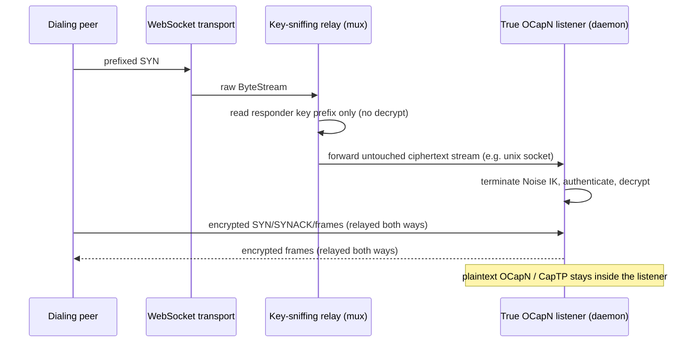

# Key-Sniffing Ciphertext Relay and Terminating OCapN-Noise Listeners

| | |
|---|---|
| **Created** | 2026-07-18 |
| **Updated** | 2026-07-19 |
| **Author** | Kris Kowal (prompted) |
| **Status** | Proposed |

## What is the Problem Being Solved?

The current gateway WebSocket handler in `packages/gateway/src/ocapn-ws.js`
reads the first Noise frame to discover its cleartext intended-responder key,
uses that key to select a registered daemon, then reconstructs a reader with
`prependFrame` so the daemon-side Noise responder can read the same SYN again.
That makes the gateway a partial implementation of the Noise session
establishment protocol. The temporary reader is a Far-tagged replay adapter
solely to cross the CapTP handoff.

The redirection recorded below removes that partial implementation by moving in
the opposite direction from an earlier draft of this design. Rather than pulling
Noise termination *up* into the gateway so the gateway hands daemons an
authenticated plaintext session, we keep Noise termination *at the recipient*
and reduce the gateway to a dumb router. The gateway sniffs only the cleartext
intended-responder public key that already prefixes the SYN, and forwards the
untouched encrypted stream to the true OCapN listener for that key. The gateway
never decrypts, never holds a daemon signing key, and never reconstructs a SYN.

## The Relay Is Dumb (maintainer direction, 2026-07-18)

The routing component — call it the **relay** or **mux** — is deliberately
minimal:

- It reads only the plaintext responder public key that prefixes the SYN.
- It does **not** terminate the Noise protocol and does **not** depend on a
  Noise implementation.
- It forwards the whole encrypted byte stream, unmodified, to the true OCapN
  listener registered for that responder key — routing *closer to the
  recipient* in the network, for example across a unix domain socket.

Noise IK — reading the SYN, authenticating the initiator, decrypting, and
delivering plaintext application messages — belongs to the **true OCapN
listener** (in practice, the daemon that owns the responder identity), never to
the relay. Each listener terminates its own sessions with its own key. Because
the relay never responds for a registered identity, it needs no protected
signing store and no privileged key material at all: a plaintext-key routing
table is its entire authority.

This is a routing boundary, not a session-termination boundary. The relay is a
*ciphertext* relay by construction — the only thing it ever reads in the clear
is the responder key prefix used to pick the next hop. Relays may chain
(relay-to-relay-to-listener); every hop makes the same cheap plaintext-key
routing decision and forwards ciphertext onward.



## Independent Components

The redirection separates the earlier single package into independently useful
components. Applications compose them at their network boundary.

### The relay (dumb ciphertext router)

A small package that accepts framed byte streams, extracts the intended
responder's 32-byte Ed25519 public key from the SYN prefix, selects a
forwarding target from a plaintext key-to-target routing table, and splices the
two byte streams together. It has no dependency on a Noise implementation, on
`@endo/ocapn`, on OCapN locators, on CapTP, or on daemon APIs. Its only inputs
are the framing constant needed to locate the prefix, byte-stream and
promise-kit primitives, passable/exo support, and a narrowly scoped routing
table plus clock/timeout interfaces.

#### Static routing configuration and key-routed forwarding

The relay process starts from a static responder mapping. Each entry maps one
32-byte responder public key to an opaque forwarding target and is validated for
key shape and target resolvability before it becomes live. The generic relay
only requires the target to resolve to a `NoiseRelayTarget` that opens a byte
stream toward the true listener; the OCapN deployment adapter may represent the
target as a daemon name, a local socket path, or another deployment-specific
endpoint. The mapping is configuration, not a public capability API: neither
recipients nor callers receive a way to mutate the routing table, and the relay
holds no local-key or signing authority to leak.

On POSIX deployments, `SIGHUP` is the control-plane operation. The hosting
process reads a replacement mapping, resolves every referenced forwarding
target, and validates duplicate keys and target routes before atomically
publishing the complete new snapshot to the relay. A bad reload leaves the prior
snapshot in service. Existing forwarded streams retain the target and transport
that accepted them; only streams accepted after publication use the replacement
mapping. This gives operators a declarative route file and graceful rotation or
reassignment without a controller facet exposed across vat or process
boundaries. Other hosts provide the same validated, atomic replacement through
their native service-reload mechanism.

```ts
interface NoiseRelayTarget {
  // Opens (or hands over) a duplex byte stream toward the true listener for
  // this responder key — for example a fresh unix-domain-socket connection.
  connect(): Promise<ByteStream>;
}

interface StaticResponderRoute {
  responderEd25519: Uint8Array;
  target: NoiseRelayTarget;
}

interface NoiseRelay {
  accept(stream: ByteStream): Promise<void>;
}
```

The host constructs the relay from a `readonly StaticResponderRoute[]` and
retains its private route-snapshot replacement hook. That hook validates the
complete candidate map and replaces the active immutable snapshot in one step;
it is not exported as a controller exo or handed to recipients. Duplicate keys
fail rather than silently replacing a route. Removing a key prevents future
forwarding for that key but does not tear down a stream already spliced.

The relay's `accept` reads exactly the bytes needed to identify the responder
key prefix, looks up the target, opens the target stream, and forwards
ciphertext in both directions until either side closes. It never allocates a
Noise instance, never decrypts, and never inspects anything past the routing
prefix. An unknown or unregistered responder key is closed cheaply, before any
downstream connection is opened. There is no public `accept(stream,
prefixedSyn)` overload and no plaintext session ever crosses the relay boundary.

The relay retains responsibility for closing both underlying transport halves on
any routing or forwarding failure. It removes the gateway's `OcapnReplayReader`
dance by forwarding the untouched stream — the true listener reads the original
SYN itself — rather than by reconstructing a SYN under a new name.

### The terminating listener (Noise IK responder)

The generic Noise IK responder state machine that reads the prefixed SYN,
selects the local signing identity, runs `responderReadSynWriteSynack`,
authenticates the initiator, exchanges encrypted post-handshake data, and
produces a plaintext duplex session. This is the code the earlier draft placed
inside the relay; it now lives with — and runs in the process of — the true
listener that owns the responder private key. It is the natural home for the
initiator half (`runInitiator`/`connect`) as well, so the same package supplies
both ends of a session without naming an OCapN remote.

```ts
// initiator
connect({
  peerEd25519: Uint8Array,
  openTransport: () => Promise<ByteStream>,
  localKeyId?: KeyIdHex,
}): Promise<NoiseIkSession>;

// responder (runs where the private key lives, behind the relay)
interface NoiseIkListener {
  accept(stream: ByteStream): Promise<NoiseIkSession>;
}

interface NoiseIkSession {
  responderEd25519: Uint8Array;
  initiatorEd25519: Uint8Array;
  reader: Reader<Uint8Array>;
  writer: Writer<Uint8Array>;
  close(): void;
}
```

`NoiseIkSession` exposes authenticated local and remote Ed25519 keys, a
plaintext reader/writer, and close. It does not expose OCapN location exchange
as a semantic type. If encrypted location exchange remains in the wire protocol,
the listener treats it as an opaque byte-level extension; an OCapN adapter
interprets it as a locator. This keeps the responder library reusable by a
protocol with no locator.

### Dependency direction

The relay, the Noise listener, and OCapN are independent protocol components.
The relay depends on neither Noise nor OCapN. The Noise listener depends on the
relay only through the byte-stream network boundary, not by importing its
package. OCapN likewise depends on neither component. An application composes
them by injecting a network layer, such as a Noise-over-WebSocket adapter, into
its OCapN session manager. A build-time dependency between these components
would collapse the intended boundary and is a design regression.

## Responder Algorithm and Abuse Limits

The abuse limits move with the code that can actually spend the work. The relay
performs only the cheap prefix gate; the terminating listener performs the
Noise-bound gates.

Relay, per incoming stream:

1. Read exactly the prefix bytes needed to recover the intended responder key,
   under the existing handshake timeout and `PREFIXED_SYN_LENGTH` framing.
2. Resolve the target from the plaintext key. Close an unknown or unregistered
   identity immediately, without opening a downstream connection.
3. Optionally apply a per-responder-key in-progress forwarding cap
   (`inProgressFull(intendedKeyId)`) to bound fan-in before paying for a
   downstream connection. This preserves the cheap-prefix denial-of-service gate
   per local identity at the routing layer.
4. Open the target stream and splice. Bound the number of concurrently spliced
   streams and close on either side's close or timeout.

Terminating listener, per forwarded stream:

1. Run `responderReadSynWriteSynack`, recover and authenticate
   `initiatorVerifyingKey`, then apply the per-initiator cap to its hex key.
   This continues to prevent one authenticated peer from spreading work across
   many responder identities.
2. Increment the authenticated initiator's in-progress count, exchange
   encrypted locations, build the plaintext session, and hand it to the local
   OCapN/CapTP session manager.
3. On success, record and settle as today. On any failure, close the stream and
   perform the same decrement/error settlement as the present `handleIncoming`
   path.

No unbounded application queue is introduced between authentication and
delivery. Tests must cover, at the relay: unknown responder, full
intended-responder forwarding cap, malformed or timed-out prefix, and target
connect failure; and at the listener: full authenticated-initiator cap,
malformed or timed-out SYN, and session-manager rejection.

## Application Composition

An application chooses its network layer and injects it into OCapN. For example,
an application may pair an OCapN session manager with a Noise-over-WebSocket
adapter. The adapter derives `peerEd25519` from the application's peer
configuration, opens a transport, calls `connect`, and gives the resulting
plaintext stream to the OCapN session manager. OCapN itself does not allocate
`PREFIXED_SYN_LENGTH`, invoke `initiatorWriteSyn`, observe a SYNACK, or import
the relay or listener package.

For accepting sessions, the application's configuration maps each responder key
to a forwarding target toward the process that owns that identity. That process
terminates its forwarded stream with a `NoiseIkListener` bound to its private
key, then injects the plaintext result into its OCapN session manager. The
daemon-side `handleOcapnSession` exo remains an application integration point:
it receives a session after the recipient terminates Noise, rather than after a
gateway reads and reconstructs a SYN.

Every application responder must migrate, not just the WebSocket gateway:
built-in transport listeners, test transports, relay registrations, and direct
callers that currently expect raw Noise frames need an injected network adapter
and a forwarding target that terminates its own stream.

`packages/gateway/src/ocapn-ws.js` becomes a transport-to-relay adapter. On
WebSocket upgrade it validates only the generic stream shape and calls relay
`accept`. It no longer reads the first frame, defines intended-responder prefix
constants for its own use, converts a prefix to hex for daemon lookup, defines
`prependFrame`, or constructs an `OcapnReplayReader`. The gateway host loads the
static daemon-forwarding mapping at startup and replaces it gracefully on
`SIGHUP`. The Node host's controller exo supplies this configuration while
remaining loosely coupled: it does not become a relay facet, and the relay does
not depend on the controller or Node. Because the gateway process no longer
terminates Noise, it holds no daemon key material; the true listener's process
does.

## Compatibility and Rollout

The peer wire format does not change. The prefixed SYN remains the same size and
meaning, the SYNACK and encrypted post-handshake frames are unchanged, and
existing peer implementations stay interoperable. This is not a protocol-version
or locator-format change.

It is source and deployment visible. Gateway routing moves from a
public-key-to-raw-stream-daemon-lookup table to a static
public-key-to-forwarding-target mapping, and the daemon receives a forwarded
stream it terminates itself rather than a pre-terminated plaintext session. Land
the relay and listener packages with compatibility tests, migrate each responder
to a forwarding target that terminates its own stream, then remove the old
gateway-side SYN read and `prependFrame` handoff in one coordinated change. Do
not support a hybrid where the gateway sometimes terminates and sometimes
forwards. Test a valid `SIGHUP` reload, a rejected invalid reload that leaves the
old mapping live, and the continuity of streams forwarded before a reload.

## Prototype in Node, Replace the Data Plane in Rust

Prototype the whole thing in Node to validate the split and the tests, but
prepare for the data plane to be replaced by Rust. The intended end state is a
**parallel Rust crate and JS package** pair, following the precedent already in
this repository — `rust/ocapn_noise` (`ocapn_noise_protocol_facilities`, built
  as a `cdylib`) paired with an independent JS application adapter.

- The **data plane** — the byte-splicing relay and the Noise IK responder/
  initiator state machine — is the part that moves to Rust. It is CPU- and
  I/O-bound, security-sensitive, and benefits from a memory-safe systems
  implementation and the existing Rust Noise stack.
- The **control plane** is the application's configuration: static route
  snapshots, atomic replacement, and abuse-limit configuration. The Node
  controller exo translates its configuration and `SIGHUP` into a validated
  snapshot-replacement message. A Rust relay may accept the same message as a
  bespoke CBOR controller protocol, without acquiring a dependency on that
  controller or on any JS facade.
- The **JS application adapter** may expose its own Exo interfaces for
  application control and session hand-off. Those interfaces remain outside the
  relay and listener packages regardless of whether the data plane is Node or
  Rust underneath.

Design the Node prototype so the JS/Rust seam falls exactly at this control/data
split: the application side never assumes it can reach into data-plane internals
beyond configuration replacement, and the Rust side never assumes a JS-object
routing table. Keeping the seam at the configuration protocol lets the Node
data-plane prototype be swapped for the Rust crate without changing application
adapters or OCapN itself.

## Implementation Plan

1. Create the dumb relay package (static route snapshot, atomic replacement,
   prefix-sniff/splice, and abuse-limit tests) with no Noise dependency and no
   OCapN import.
2. Create/relocate the terminating listener package: the generic IK initiator
   and responder state machine, preserving timeout, close, crossed-hello, and
   two-stage in-progress accounting behavior.
3. Implement application-owned network adapters: dial via listener `connect`,
   place each daemon's forwarding target in the static relay mapping, and inject
   each terminated plaintext stream into the application's OCapN manager.
4. Reduce `ocapn-ws.js` to a transport-to-relay adapter. Add an end-to-end test
   that a forwarded listener terminates Noise and sees two authenticated keys and
   plaintext, while the relay never decrypts and never sees a SYN body.
5. Structure the data plane so it can be replaced by a Rust crate behind a CBOR
   configuration protocol used by the Node controller exo, without coupling the
   relay, listener, or OCapN packages to one another.

## Resolved Decisions

Two questions the earlier draft left open are resolved by the maintainer
direction dated 2026-07-18.

- **Gateway authority to terminate a daemon identity.** The relay does not
  terminate a daemon identity at all, so no protected key-store or signing
  arrangement broadens the gateway process's authority. The relay sees only the
  plaintext responder public key and forwards to the true OCapN listener, which
  terminates Noise with its own key. There is no shared-gateway signing store to
  scope.
- **Whether a blind ciphertext relay is a supported role.** Yes — it is the
  model, not an alternate topology. The relay is dumb: it always forwards
  ciphertext by sniffing the responder key and never decrypts. There is no
  separate key-terminating accept path to reconcile it against.

## Dependencies

| Design | Relationship |
|---|---|
| [ocapn-noise-network](ocapn-noise-network.md) | Existing network, handshake, transport, and session substrate. The terminating listener draws its responder/initiator state machine from here; the relay draws only the SYN-prefix framing constant. |
| [ocapn-noise-session-reconnect](ocapn-noise-session-reconnect.md) | Session ownership and close behavior must remain compatible with reconnection and crossed-hello settlement at the terminating listener. |
| [gateway-package](gateway-package.md) | Its OCapN WebSocket feature becomes a transport-to-relay adapter that forwards ciphertext instead of owning a raw-SYN termination path. |

## Prompt

Issue [#406](https://github.com/endojs/endo-but-for-bots/issues/406) identified
the gateway SYN replay workaround. The maintainer direction dated 2026-07-18
resolves it toward a dumb key-sniffing ciphertext relay: the relay forwards the
untouched encrypted session to the true OCapN listener by the plaintext
responder key, and Noise termination, authentication, and decryption stay with
the recipient. The routing table is static configuration with a validated,
atomic, `SIGHUP`-driven replacement rather than a controller exo. The same
direction calls for prototyping in Node while preparing to replace the data
plane with a Rust crate and a CBOR configuration protocol supplied by a loosely
coupled Node controller exo. OCapN depends on neither the relay nor Noise; an
application injects its network layer, such as Noise over WebSocket.
