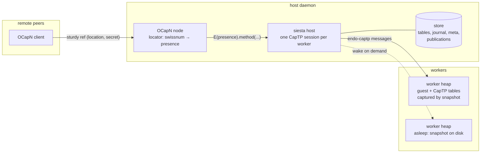

# OCapN Orthogonal Persistence Machine (`@endo/siesta`)

| | |
|---|---|
| **Created** | 2026-07-16 |
| **Updated** | 2026-07-20 |
| **Author** | Aaron Davis (prompted) |
| **Status** | In Progress |

## Status

Phases 1–4 and 6 are landed and hardened; Phase 5 (production Noise
transport) remains; the sections under *Future Work* carry the
accepted plans for resource vats, the non-reifying host, and upgrade
by indirection.

What exists, all verified by tests across three SES configurations:

- **`packages/siesta`** — the host (`makeSiestaHost`), the
  OCapN-serving daemon wrapper (`makeSiestaDaemon`), serializable
  CapTP tables, the deterministic worker shell, filesystem/memory
  stores, and the real XS engine (`makeXsEngine` over
  `rust/siesta-xs-worker`, a minimal runner on the `xsnap` crate; the
  siesta scenarios pass on real XS heap snapshots, including a
  scenario-parity suite — cross-worker links and promises across
  restarts, at-most-once aborts, vat GC with CAS release — so the
  shipped engine is the tested engine). The public
  surface is deliberately narrow — `makeSiestaHost`,
  `makeSiestaDaemon`, `makeXsEngine`, `makeFsStore`,
  `makeTimerResource` — with the deterministic replay engines, the
  memory store, the tables kit, and the worker shell kept internal as
  test doubles and plumbing; the `WorkerEngine` type remains the open
  seam for future JS engines with other heap-snapshot mechanisms.
- **`packages/captp` seams** — `provideImport(slot, iface)` and
  `provideExport(slot, val)` (objects and promises, with resolution
  re-subscription): the restore halves of a resumable CapTP session.
- **Resumable sessions at the export-table layer** — slot counters,
  import descriptors, and durable export descriptions all live in the
  serialized tables record; sessions are resumed, never
  re-established. The tables record is deliberately a c-list
  serialization (see § *A non-reifying host*).
- **Sleepy lifecycle with snapshot-subsumed journals** — absolute
  journal indexing, truncation at every snapshot, restore from
  snapshot plus suffix, a durable delivered-watermark separating
  replayed traffic from never-delivered traffic, and alias-safe
  snapshot release.
- **System resources (stopgap form)** — maker registry, export-time
  descriptions, resume re-instantiation, interning by
  (type, description), the timer resource.
- **Worker controller** — workers create and endow other workers;
  cross-worker object and promise links are durable as
  `worker-import` / `worker-promise` descriptions, re-seated at
  restore without waking anyone.
- **At-most-once host obligations** — answers owed to guest questions
  and resolutions owed on host-origin promise exports are durably
  indexed and rejected by a restarted host via journaled synthetic
  messages; cross-worker promises instead survive restarts through
  their durable links.
- **Crash hardening** (post-ultrareview) — torn-write immunity,
  engine-failure degradation without session aborts, disconnect
  suppression toward workers, unique CAS temp names; see
  § *Crash-consistency envelope*.
- **Vat GC** — `collectVats` mark-and-sweep over the table-layer
  reference graph, retirement as a capability (`retire()` on the
  embedder's worker facade and on the guest-visible `worker-facade`
  resource — the host has no retire-by-id operation) with tombstoned
  links, `unpublish`, and shared-snapshot-ref guarding
  (§ *Garbage collection of vats*).
- **Durable sessions** — `makeDurableNetLayer` wraps any transport
  netlayer with token-identified, sequence-numbered, ack-tracked
  resumable logical connections, so OCapN sessions (and every live
  remote reference in them) survive connection drops between live
  processes; and with the daemon's `resumption` power
  (`durable-sessions.js` + additive `@endo/ocapn` seams), sessions
  survive **daemon restarts**: identity, watermarks, outbound frames,
  and export descriptions persist per resume token, and a successor
  process re-seats every export from the host's capability linkage
  without waking workers. The resume handshake lives entirely at the
  netlayer; no OCapN protocol messages were added
  (§ *Durable OCapN sessions*).
- **Capability-only worker identity** — workers have no names: each
  is identified by a host-generated unguessable id
  (`createWorker({ debugLabel })`, `getWorker(workerId)`), and store
  layout, links, tombstones, publications, and GC all key on the id.
  Debug labels appear only in diagnostics (Design Decision 7).

Historical notes on how Phase 3 was rescoped onto the `xsnap` crate
(skipping the endor supervisor and its broken bundle toolchain) live
in § *The XS engine*.

## What is the Problem Being Solved?

The Endo daemon achieves durability with *explicit* persistence: every
durable object is described by a formula, and workers restart from
formulas rather than resuming from memory.
That model is powerful but heavy: it entangles the daemon with formula
bookkeeping, and guests must be written against the incarnation
lifecycle.

This design prototypes the opposite corner of the space: a **distributed
ocap machine with pure orthogonal persistence and no upgrade**.
Guest state persists because the engine snapshots the whole heap (XS
snapshots, as built for the Rust `endor` supervisor), not because the
guest described itself in formulas.
A guest is an ordinary hardened-JavaScript program; it never observes
suspension, restoration, or host restarts.
Foregoing upgrade is deliberate: snapshot-restore of a heap cannot
tolerate code changes, and accepting that constraint is what makes the
system radically simpler than the daemon.

The pieces this machine composes already exist in the repository:

- **OCapN** (`packages/ocapn`) for the distributed edge: sessions,
  bootstrap `fetch`, and sturdy refs (`(location, secret)` pairs looked
  up in a locator table).
- **endo-captp** (`packages/captp`) for the host–worker edge, with its
  pluggable import/export tables
  (`makeCapTPImportExportTables`, `packages/captp/src/captp.js`).
- **XS snapshots** (`rust/endo/xsnap`): `write_snapshot`/`from_snapshot`,
  `suspend_to_cas`/`resume_from_cas`, and the supervisor suspend/resume
  protocol from [daemon-xs-worker-snapshot](daemon-xs-worker-snapshot.md).

What is missing — and what this design specifies — is the **host**: a
daemon that spins up orthogonally persistent workers, serializes its half
of each worker's CapTP session so both halves survive restarts, exposes
worker exports as sturdy refs over OCapN, and puts idle workers to sleep.

## Design

### Architecture



The host is a *translation layer*: OCapN deliveries land on host-side
CapTP presences, which forward over the host–worker session.
Nothing else flows through the host; it holds no application state of its
own.

### The worker

A worker is one guest heap behind a CapTP endpoint
(`packages/siesta/src/worker-shell.js`):

- one persistent `Compartment` endowed with pure capabilities
  (`E`, `Far`, `harden`);
- a CapTP bootstrap facet whose `evaluate(source)` evaluates a hardened
  JavaScript expression in that compartment and returns its value.

The shell must be **deterministic**: given the same inbound message
sequence it produces the same state and the same outbound messages.
Determinism is what makes journal replay equivalent to snapshot
restoration, and is also required for the XS engine's
snapshot-plus-journal-suffix restoration.
Endowments are therefore limited to pure capabilities; timers, randomness
and I/O reach guests only as capabilities exported by the host (future
work, § *Host-provided system resources*).

### The engine seam

The host takes a `WorkerEngine` power
(`packages/siesta/src/host.js`):

```js
engine.start({ debugName, snapshot, onOutbound })
  // → { deliver(message), snapshot(), terminate() }
```

- `deliver` injects one CapTP message and settles when the worker has
  processed it, including emitting replies.
- `snapshot` captures the guest heap at quiescence and returns an opaque
  durable ref.
- `terminate` ends the incarnation *without notifying the guest* — the
  guest must never observe its own suspension, so the host never sends
  `CTP_DISCONNECT` to a worker.

Three implementations:

1. **Journal replay** (`makeJournalReplayEngine`, implemented) — the
   reference and test engine.
   Every incarnation starts a fresh worker shell; the host replays the
   full journal of previously delivered messages and drops the worker's
   re-emitted replies (the *replay window*).
   `canSnapshot: false` tells the host to retain the whole journal.
2. **Snapshotting replay** (`makeSnapshottingReplayEngine`,
   implemented) — `canSnapshot: true` without an XS build.
   The snapshot ref is the engine's own log of delivered messages: an
   honest implementation of the snapshot contract (an opaque durable
   value that fully reconstructs guest state) that stands in for XS
   heap bytes.
   It exists to exercise the host's full snapshot lifecycle — journal
   truncation at sleep, restore from ref plus journal suffix, release
   of superseded refs — so the XS engine drops into proven host code.
3. **XS snapshots** (remaining) — incarnations are XS machines under
   the `endor` supervisor.
   `snapshot()` maps to `suspend_to_cas` (returning the content hash),
   `start({ snapshot })` to `resume_from_cas`, and `deliver` to the
   CBOR-envelope frames on fd 3/4
   (`rust/endo/src/proc.rs`, `rust/endo/xsnap/src/worker_io.rs`).

### Journal growth and truncation

The journal would grow without bound if the host kept every message
forever; snapshots are what let it forget.
The journal is **absolutely indexed**: entry numbers are stable across
truncation, so a snapshot's recorded `journalLength` always names the
same suffix.
At every sleep on a `canSnapshot` engine the host records
`(snapshotRef, journalLength)` durably and then truncates the journal
prefix the snapshot subsumes (`WorkerStore.truncateJournal`; the
filesystem store rewrites the journal with a base-index header via an
atomic rename).
The previous snapshot ref, now superseded, is handed back to the
engine (`releaseSnapshot`) so engines with external snapshot storage
(a CAS) can drop the corresponding GC root.
Ordering is crash-safe: the new snapshot is durable before the journal
shrinks and before the old snapshot is released, so a crash between
steps only costs disk space.
On the plain journal-replay engine (`canSnapshot: false`) the journal
is the persistence and cannot be dropped; that engine is for tests and
reference, not deployment.

### Resuming, not re-establishing, the host–worker session

Restoring a snapshot revives the worker's CapTP tables exactly as they
were, so the host cannot open a fresh session — slot numbering would
collide with the worker's memory of the old session.
The host therefore persists its half of each session and resumes it:

- **Slot counters** — the host's export and promise counters live in a
  plain-JSON *tables record* plugged into `makeCapTP` via the existing
  `makeCapTPImportExportTables` option
  (`packages/siesta/src/persistent-tables.js`).
  A restarted host never re-mints a slot the worker's snapshot still
  binds to another object.
- **Import descriptors** — `(slot, interface)` pairs for every object
  presence the host imported.
  On restart, `captp.provideImport(slot, iface)` (the new `@endo/captp`
  seam) re-mints each presence *through* `convertSlotToVal`, so identity
  is preserved even when a restored presence is later passed back to its
  worker.
- **The journal** — every message the host delivers to a worker is
  appended to that worker's journal *before* delivery (disk before
  graph).
- **Metadata** — the bootstrap facet's slot, and the engine snapshot ref
  with its journal offset.

Question and answer slots are deliberately *not* persisted.
Snapshots are only taken at quiescence (no questions in flight), and
after a host restart the fresh question counter's reuse of old question
IDs is benign: the worker's stale `answers` entries are simply
overwritten, and the restarted host — having forgotten those questions —
can never pipeline to them.
Promises are transient with **at-most-once** semantics: obligations
the host holds only in memory (answers owed to guest questions,
resolutions owed on promise exports) are durably indexed and rejected
by a restarted host via journaled synthetic messages, so guests see
broken promises rather than hangs. A promise that must survive
restarts should be modeled as an object capability.

### Sturdy refs over OCapN

OCapN's serving path for sturdy refs is
`bootstrap.fetch(swissnum) → locator.get(secret)`
(`packages/ocapn/src/client/sturdyrefs.js`).
The host feeds that locator directly:

- `worker.publish(presence, secret?)` verifies the value is an imported
  object presence, records `(secret → workerId, slot, iface)` durably,
  and sets `locator.set(secret, presence)`.
- On restart, the host re-mints each published presence from its
  recorded slot and rebinds the locator **without waking any worker**.
- A remote `fetch` then returns the presence; the first `op:deliver`
  routed to it crosses into the worker session and wakes the worker.

OCapN sessions survive transport drops when both peers wrap their
netlayers in `makeDurableNetLayer` (§ *Durable OCapN sessions*), but
not yet a daemon restart: a remote peer that outlives a restart
re-enlivens its sturdy refs, which is exactly the durability contract
sturdy refs exist to provide until Layer 2 lands.

### Sleepy workers

Per-worker lifecycle, serialized on one turn queue so wakes never race
sleeps (`packages/siesta/src/host.js`):

- **Awake → asleep.** After `idleTimeoutMs` with no traffic and no
  questions in flight — or on explicit `worker.sleep()` — the host waits
  for quiescence, calls `incarnation.snapshot()` (when the engine can),
  records `(snapshotRef, journalLength)`, and terminates the
  incarnation.
- **Asleep → awake.** Any `rawSend` on the worker's session first runs
  `engine.start` with the recorded snapshot, replays the journal suffix
  inside the replay window, and only then journals and delivers the new
  message.
- The guest observes neither transition.

### Crash-consistency envelope

The prototype's guarantees, from weakest to strongest component:

- Worker state: recovered to the last journaled message (journal replay)
  or the last snapshot plus journaled suffix (XS engine).
- Host tables and meta: written through synchronously via temp-plus-
  atomic-rename on every change, and always ahead of any message that
  depends on them. Journal appends are plain appends; a torn final line
  from a crash mid-append is dropped on the next read (the entry was
  never delivered — the host journals before delivering) and the file
  is repaired before further appends.
- The journal carries a durable **delivered watermark**: entries below
  it were live-delivered (wake replay suppresses the worker's
  re-emitted replies); entries above it — synthetic aborts appended
  while asleep, deliveries that failed at the engine — are delivered as
  fresh traffic on the next wake, so the worker's reactions to them
  reach the host exactly once.
- Engine failures degrade, never poison: a failed wake or delivery
  unwinds the incarnation (the next message retries from the snapshot),
  the un-delivered message waits above the watermark, and
  `CTP_DISCONNECT` is never journaled toward a worker — workers never
  observe disconnects, including their own transport's.
- Snapshot bookkeeping is alias-safe: a superseded snapshot ref is
  released only when it differs from the newly recorded one
  (content-addressed refs collide when the heap is unchanged), and the
  CAS writer uses unique temp names so concurrent snapshotters cannot
  corrupt each other.
- Worker replies in flight when the host dies are lost; because replies
  are re-derivable by replay and questions are transient, this only
  costs the answers to questions nobody remembers asking.

## The XS engine (landed, rescoped)

Rescoped per maintainer direction: **take the `xsnap` crate, skip the
`endor` daemon.**
The endor supervisor is the Rust re-hosting of the endo daemon —
manager bundles, formula SQLite, worker registries — all of which the
siesta host already is; routing siesta workers through it would mean
two overlapping supervisors, and its generated-bundle toolchain is
what was broken.
What siesta needs from the Rust side is only the crate: the XS build
system, the snapshot FFI (`suspend_to_cas`/`resume_from_cas`), and the
promise-job pump.

The landed shape:

- **`rust/siesta-xs-worker`** — a ~250-line binary on the `xsnap`
  crate: one XS machine, one host function (`siestaSend`, plus a
  `siestaTrace` diagnostic channel), newline-delimited ASCII JSON over
  fd 3/4 (`deliver`/`ack` with promise-quiescence per delivery,
  `snapshot` → CAS sha256, restore via `--restore <hash>`).
  Boot scripts and the worker bundle are read from files at runtime —
  no `include_str!` coupling, so the crate's generated-bundle problem
  is reduced to satisfying stubs.
- **`packages/siesta/scripts/bundle-xs-worker.mjs`** — generates
  `dist-xs/boot.js` (xsnap's committed polyfills) and
  `dist-xs/worker-xs.js` (the worker shell + CapTP bundled via
  compartment-mapper), and stubs xsnap's `include_str!` inputs.
- **`makeXsEngine`** (`packages/siesta/src/xs-engine.js`) — the
  `WorkerEngine` adapter: spawn, restore, deliver, snapshot,
  `releaseSnapshot` unlinks the superseded CAS entry.
- **Exit criterion met**: the siesta scenarios pass on real XS heap
  snapshots (`packages/siesta/test/xs-engine.test.js`), skipped
  automatically when the binary or bundles are absent.

Build: `yarn workspace @endo/siesta build:xs-bundles`, then
`cargo build --release -p siesta-xs-worker` (needs the `c/moddable`
submodule).

Findings that shaped the implementation, for future engine authors:

- `Machine::eval` segfaults on a script whose completion value is an
  object; the evaluator wrapper pins a primitive completion.
- XS's native `Compartment` takes an options bag, not the SES shim's
  endowments-first signature; the worker shell assigns endowments onto
  `compartment.globalThis`, which is portable to both.
- The ses shim's `repairIntrinsics` fails on XS — and is the wrong
  tool there anyway: XS implements Hardened JavaScript natively
  (`mxLockdown`). `siesta-xs-worker` registers the engine's own
  `fx_harden`/`fx_lockdown` as the `harden`/`lockdown` globals
  (exactly as `xst` does; both join the snapshot callback table), the
  polyfills' freeze-based harden shim steps aside, and the boot
  script ends with `lockdown()`. Guests see frozen shared intrinsics
  (verified by a probe test that fails to add a property to
  `Array.prototype`), so isolation holds per-machine, per-compartment,
  and through the intrinsics.
- All JSON crossing the pipe and the host-function boundary is
  ASCII-escaped, making CESU-8/UTF-8/C-string encodings coincide.

## Future Work

### The worker controller: workers creating workers

Per maintainer direction, a worker can create and endow other workers:
the host exposes a **worker controller** into a controlling worker,
and endowments flow from that worker's own heap.

Two built-in resource types (registered alongside the embedder's
makers):

- `worker-controller` — `createWorker(debugLabel?)` makes a fresh
  worker under a generated id and returns its facade.
- `worker-facade` — scoped to one worker:
  `evaluate(source, names, values)` evaluates in it with endowments.

```js
// In the controlling worker's guest code:
const child = await E(controller).createWorker('child');
const childRoot = await E(child).evaluate(source, ['shared'], [shared]);
```

`shared` here is an object in the controlling worker's heap; the host
imports it from that session and re-exports it into the child's — the
host as pure translation layer, worker to worker.

Durability composes at the export-table layer: the host records which
worker session each presence was imported from, so a cross-worker
export is described as `{ kind: 'worker-import', workerId, slot }`
and re-seated at resume via `captp.provideImport` on the origin
worker's session — **without waking either worker**. Controller and
facade objects are themselves described resources. Export seating is
two-phase at host startup so cross-worker descriptions can name
runtimes constructed later (including cycles). The test
(`packages/siesta/test/worker-controller.test.js`) restarts the host
with both workers asleep and shows one pull on the child's sturdy
name waking the child, crossing to the parent, and waking it too.

### Host-provided system resources (Phase 4, landed)

Workers need timers, network, storage, and other host capabilities.
The shape, now implemented: the host exports capability objects into
the worker session, and — because host exports are *not* inside any
snapshot — each such export is re-instantiable from a durable
description.
That is a formula by another name, but — per maintainer direction —
it lives **at the export-table layer**: the serialized tables record's
export descriptors carry the durable description
(`TablesRecord.exports[slot].description`, recorded by the persistent
tables' `describeExport` power the moment a resource is exported),
and the tables kit's `restoreExports` rebuilds each described export
at resume, seated through `captp.provideExport`. One serialized
artifact — the session tables — carries everything needed to resume
the host's half. Never visible to guests.
`makeSiestaHost({ resources })` supplies the maker registry;
`host.makeResource(type, description)` mints instances; endowments
reach guests via `worker.evaluate(source, names, values)`.
A host that resumes a worker without the maker its exports need fails
loudly at construction rather than dangling the worker's presences.

Timers came first, as `makeTimerResource`: a pending `delay` gives the
host a reason to wake a sleeping worker with no inbound traffic (the
resolution message routes through the session's ordinary wake path),
and because every timer result is a journaled CapTP reply, replay
reproduces recorded time rather than consulting the clock — host
nondeterminism does not infect worker determinism.
Network and storage resources remain future work, as does the
attenuation story (per-worker scoping of descriptions).

Resource requests are **at-most-once**: the host records outstanding
guest question IDs durably and a restarted host rejects them with
journaled synthetic answers (delivered lazily by suffix replay, waking
nobody). Guests must treat a broken resource promise as "retry or
give up", exactly as they would a broken remote promise.

Promise **resolutions** split by origin, per maintainer direction.
Within one host lifetime, a promise resolving while its importer
sleeps simply wakes the worker — `CTP_RESOLVE` rides the ordinary
send path, whether the resolver is the host or another worker.
Across a host restart:

- **Cross-worker promises survive.** A promise imported from worker
  A's session and exported into worker B's is described durably in
  B's export table as `{ kind: 'worker-promise', workerId: A,
  slot }` — the promise analogue of a `worker-import` link. At
  restore, the host re-mints A's promise import (whose settler will
  receive A's eventual `CTP_RESOLVE`) and re-seats it into B's
  session via `captp.provideExport`, which re-attaches the resolution
  subscription toward B. Neither worker wakes; when A eventually
  resolves, the resolution flows A → host → B as if the restart never
  happened. A fulfilled link's description is cleared when its
  `CTP_RESOLVE` is journaled, so later restarts do not re-seat dead
  links.
- **Host-origin promises abort.** A promise whose resolution
  subscription existed only in host memory (a host resource's
  deferred, with no worker origin) is a lost obligation; the host
  durably records its unresolved promise exports per worker and a
  restarted host rejects the undescribed ones the same lazy,
  wake-free way as stale answers.

### Toward resource vats

Direction, per maintainer guidance: **the host should do nothing but
forward between guest vats** — no application behavior in the host
vat. The `resources` registry is the thin boundary stopgap for effects
that must touch the OS; the endgame is *resource vats*.

The substrate already permits this: a durability regime is an
**engine** property behind the `WorkerEngine` seam, invisible to the
host. A device-style vat runs on an engine whose `snapshot()` returns
the vat's own *manually serialized* state (and whose restore re-arms
external effects such as OS timers), while ordinary vats stay
orthogonally persistent on heap snapshots. The worker controller's
cross-worker durable links (`worker-import` export descriptions) then
connect ordinary vats to resource vats with no host-side Far objects
at all; the host remains a translation layer between sessions.

The painful part — acknowledged, and the reason this is future work —
is the durability-regime seam itself: a manually persistent vat must
express its obligations (pending timer wakeups, open connections) in
its serialized state and reconcile them at restore, which is exactly
the discipline orthogonal persistence exists to spare application
authors. Keeping that discipline confined to a few resource vats,
rather than the host or ordinary guests, is the point of the design.

### A non-reifying host (comms-vat analysis)

In Agoric liveslots terminology, the host today plays *liveslots*, not
*comms*: worker exports become host-side presences and handled
promises, and a cross-worker message pays two marshal round-trips plus
presence allocation. A comms-vat-style host would keep only c-lists
(slot-to-slot translation tables) and forward messages by rewriting
their slots arrays, never reifying values or interpreting bodies.

Cost-benefit, per maintainer request:

- **What reification costs**: double marshal per hop; a pinned
  presence per imported object per session (host heap grows with the
  union of live worker graphs); the entire
  `provideImport`/`provideExport`/origins/re-subscription machinery,
  which is the reified simulation of a c-list; and marshal-decoding
  attacker-shaped capdata inside the trusted host.
- **What it buys**: the prototype's existence — E/captp/marshal
  provide routing, pipelining, and promise plumbing for free, versus
  the comms vat's notorious complexity (promise retirement, c-list GC,
  resolution races). And the host's edges still need real values: the
  OCapN locator, the resource registry, the controller facets, the
  embedder API. Resource vats remove most of that need; the OCapN edge
  crosses codecs, so bodies must be re-encoded there regardless.
- **Transparency of a later switch**: workers cannot observe whether
  the host reifies — same messages, same slots. The migration hazard
  is slot-binding continuity with existing snapshots, and the
  persisted tables record *is already a c-list serialization*: a
  quiescent-restart migration adopts it as the routing table
  (questions and answers are transient at quiescence). This is the
  payoff of keeping durability at the export-table layer. The
  invariant to preserve: durable semantics must never depend on
  host-side object identity beyond what the tables encode.

**Verdict**: not worth it on the current map — at prototype scale the
dominant term is comms-vat complexity risk, not marshal overhead.
Crossover comes with high-volume worker-to-worker traffic, large live
graphs, TCB minimization, and especially Phase 6: durable OCapN
sessions want persisted session tables anyway, where "persist c-lists
and route" decisively beats "persist tables and resurrect presences."
Sequencing: resource vats first (removing the host's need for
values), then the non-reifying core with or after Phase 6.
Worker-to-worker slot forwarding could land alone as an incremental
step, since both sides share the captp wire format and need no codec
translation.

### Upgrade without breaking orthogonality

Every production orthogonal-persistence system has eventually bolted
on an upgrade mechanism that breaks the purity: ICP canisters upgrade
code in place against stable memory, with pre/post-upgrade hooks and a
schema discipline the application carries forever; Agoric vats upgrade
against `baggage`, forcing every durable object into upgrade-aware
kinds. In both, the coupling exists because the **unit of durable
identity is the stateful code instance** — clients hold references to
the canister or vat itself, so new code must inhabit the old identity,
so state must survive a code swap, so the persistence layer must learn
about versions.

Per maintainer direction, siesta refuses that coupling with one more
level of indirection, in the spirit of the endo daemon's pet store:
make the durable unit of identity a **name binding**, and keep vats
pure, immortal-code, and disposable.

**The name hub.** A durable table of `name → (workerId, slot)`
bindings — a generalization of what `publications` already is (the
locator's `swissnum → presence` is a name binding whose consumers are
remote). Three grades of consumer:

1. **Sturdy refs** already resolve through it: rebinding a swissnum to
   a successor vat's export is client-transparent today.
2. **Cross-vat grants** gain a new export-descriptor kind:
   `{ kind: 'named', name }`. Where a `worker-import` link pins the
   origin `(workerId, slot)` forever, a named link resolves through
   the name hub **per delivery** (the seated value is a host-side
   forwarder; in the non-reifying host, a c-list indirection). The
   granting vat chooses at grant time: direct link for EQ-stable
   identity, named link for upgradability. This choice mirrors the
   petname/edge-name distinction and cannot be papered over: behavior
   swap behind a stable reference is the *point* of a named link, so
   `===`-style identity across an upgrade is deliberately not
   preserved.
3. **The embedder and guests** rebind through an explicit capability
   (`nameHub.rebind(name, presence)`), grantable like any resource.

**Upgrade, decomposed.** With names in place, upgrade is not a
mechanism of the persistence layer at all:

1. Instantiate the successor vat — fresh heap, new code, ordinary
   orthogonal persistence. (The worker controller already does this.)
2. Migrate state by **ordinary ocap messages**: the predecessor
   exports its state to the successor in an explicit, app-designed,
   testable handoff conversation
   (`E(successor).adopt(await E(predecessor).exportState())`). No
   stable-memory schema, no baggage: the migration protocol is just
   protocol, versioned by the apps that speak it.
3. Rebind the names. Every named edge everywhere — sturdy refs and
   cross-vat grants — re-routes atomically at the table layer, without
   waking a single vat: importers' heaps hold their local slots; only
   the host-side resolution changes.
4. Retire the predecessor (vat GC below).

The persistence machinery never learns what a version is. Snapshots
stay pure heap images; the journal stays a message log; upgrade lives
entirely in the name hub and in application-level handoff protocols.
The cost, stated honestly: apps that want upgradability must design
for handoff (arguably lighter than designing for baggage, and only
paid by vats that opt in), and identity discontinuity across upgrade
is visible to anyone comparing references rather than names.

### Garbage collection of vats

**Landed for the current implementation** (per maintainer direction,
ahead of the name hub, which is still under consideration):
`host.collectVats({ keep })` is the mark-and-sweep below;
`worker.retire()` — a capability on the embedder's facade and on the
guest-visible `worker-facade` resource, not a host retire-by-id
operation — is explicit retirement with tombstoned
inbound links (a dead `RetiredWorkerLink` presence for object links, a
rejected promise for promise links — live holders reject immediately
via session abort, restarted holders reject via the tombstone
descriptors); `host.unpublish(secret)` removes locator roots; and both
sweep and superseded-ref release go through a shared-ref guard so a
content-addressed snapshot shared by identical sibling heaps is only
released with its last user (`packages/siesta/test/vat-gc.test.js`,
including cycle collection of a mutually-linked parent and child).
When the name hub lands, `named` edges join the same graph.

Vat-level GC comes before object-level GC because the table layer
already contains the whole vat-reference graph as plain data —
collectible without waking anything:

- **Nodes**: workers.
- **Roots**: name-hub bindings and publications (the locator), plus
  embedder pins.
- **Edges**: durable export descriptions in each session's tables
  record — `worker-import` and `worker-promise` link the exporting
  session's worker to the origin worker; `named` edges root through
  the name hub's current target.

**Collector**: mark from roots over the tables records, sweep
unmarked workers — delete the worker directory (tables, journal,
meta) and release its CAS snapshot. Cycles between unreferenced vats
collect naturally under mark-and-sweep. Run at host start and on
demand; the traversal reads only table data, so sleeping vats stay
asleep and live vats are untouched. Transient in-session state
(questions, undescribed promise exports) never keeps a vat alive: it
is either in-memory (dies with the host) or subject to the
at-most-once abort machinery.

**Explicit retirement** (`retire()`, a capability on the worker
facade rather than a host-level retire-by-id operation): severs
inbound edges by rewriting them to tombstone
descriptors — dead presences whose deliveries reject, reusing the
at-most-once rejection shape — then sweeps. Retirement is the
completion of upgrade: after rebinding, the predecessor's remaining
direct (non-named) inbound edges are precisely the references whose
holders chose EQ-stability over upgradability, and tombstoning them
is the honest expression of that choice.

**Two known sub-problems**:

- **CAS refcounting**: snapshots are content-addressed per host, so
  two workers with identical heaps share a CAS entry, and both
  vat-sweep and superseded-ref release must refcount by hash rather
  than unlink unconditionally (today's release could delete a
  sibling's identical live snapshot — noted in Known Gaps).
- **Edge staleness**: a vat stays reachable while any other vat's
  tables carry a durable link to it, even if the importing guest has
  long dropped the presence inside its heap. Trimming those edges
  needs object-level GC inside sessions (captp `gcImports` with
  journaled drops) or lease/expiry policy on names — the follow-up
  layer, deliberately after vat-level GC.

### Durable OCapN sessions

Durable remote references across restarts are a primary goal of this
machine, and they imply durable OCapN sessions. OCapN itself has no
session-resumption message, so per maintainer direction the
handshake/resume machinery lives at the **netlayer level**, beneath
the OCapN codec, in two layers:

**Layer 1 (landed): transport resumption.**
`packages/siesta/src/durable-netlayer.js` (`makeDurableNetLayer`)
wraps a base transport netlayer with resumable logical connections:

- each logical connection is identified by an unguessable resume
  token minted by the originator;
- every OCapN frame rides in an envelope with a per-direction
  sequence number; each side retains unacknowledged frames and acks
  receipt (`hello` / `resume` / `welcome` / `f` / `ack` / `bye`);
- on socket death neither side's OCapN layer is told: the originator
  reconnects and sends `resume { token, rcv }`, the acceptor replies
  `welcome { rcv }`, and each side retransmits the frames the other
  lacks. The session layer sees one long-lived connection, so its
  tables, presences, and promises survive the drop.

This makes live remote references survive connection failures between
two live processes (`test/durable-netlayer.test.js`), including calls
issued while disconnected and drops that race in-flight deliveries.
Prototype limits: retransmit buffers are unbounded until acked, and
an acceptor parks a dropped logical connection indefinitely.

**Layer 2 (landed): daemon-restart survival.** A daemon restart
loses the daemon's in-memory `Ocapn` instance, so resumption rebuilds
it from durable state
(`packages/siesta/src/durable-sessions.js` plus the `resumption`
power in the durable netlayer; `test/durable-sessions.test.js` shows
a live counter presence surviving single and repeated daemon
restarts, and a call issued while the daemon is down completing
against the successor). The implementation mirrors the host–worker
session treatment:

- persist per remote session, keyed by resume token: the session
  identity (the peer's public key, location, and location signature,
  and the derived session id — so the resumed session *is* the old
  session, not a lookalike; the daemon side mints fresh session keys
  on resume, so cross-restart third-party handoffs remain future
  work), the received/sent frame watermarks, and an outbound frame
  journal (acks truncate it, exactly like worker journals);
- describe the session's **exports** durably at the export-table
  layer: a daemon-side OCapN export is (almost always) a presence
  imported from some worker session, so its description is the
  existing `{ workerId, slot }` link shape — publications generalized
  from `o+0`-reachable to any export position. Restoring seats each
  export at its recorded position without waking workers;
- re-mint **imports** (client-side objects) lazily from their slots;
  identity beyond the session is not yet load-bearing;
- reject in-flight **answers** owed at the crash with the at-most-once
  discipline the worker sessions already use, rather than re-executing
  deliveries (replaying inbound frames is NOT an option: op:deliver
  replay would re-invoke worker methods);
- `@endo/ocapn` seams (the analogue of the `provideImport` /
  `provideExport` seams landed in `@endo/captp`), all additive and
  inert for netlayers that do not provide durability:
  `handlers.resumeSession(connection, identity)` constructs an active
  session from injected identity instead of a fresh handshake
  (returning a deliberately narrow `{ restoreExport }` surface);
  `makeOcapn({ sessionHooks })` observes session establishment (with
  durable identity fields) and export-slot assignment;
  `referenceKit.restoreLocalExport` re-seats an export at a recorded
  position and advances the position counter. The netlayer drives
  resumption via its `resume` preamble; no new OCapN protocol
  messages, and the full ocapn test suite passes unchanged (the
  api-surface snapshot gained only the new seam types).

Layer 2's crash-consistency envelope: the received watermark is
persisted before dispatch (at-most-once — a crash between the two
loses that frame's effects rather than double-executing them), and
outbound frames are persisted before the wire so a persisted ack can
never name a frame the successor cannot replay. Store-and-forward
netlayers get their persistence requirement met by the same outbound
frame journal. A crash with a non-quiescent worker (a question owed
forever) also restarts cleanly: the journal already holds everything,
so clean shutdown is an optimization, not a correctness requirement
(`test/durable-sessions.test.js`).

**Session identity is fully durable.** The session's own private key
persists in the session record and a resumed session re-signs as
itself: same session id, same keys, byte-identical across restarts
(verified by test), so pre-restart third-party-handoff signatures
keep verifying.

**Resolver obligations are durable.** OCapN's wire protocol expresses
promise subscriptions through per-session resolver objects; their
meaning was previously a memory-only `.then` chain. The daemon now
persists each obligation as a row — (peer's resolver slot) → (durable
target: a promise export position, or an answer position) — via the
`onPendingResolver` / `onResolverSettled` session hooks, and the
resumed session re-attaches them: promise targets re-subscribe the
peer's resolver to the restored durable promise (a worker resolving
after the restart reaches the waiting client), and answer targets
reject at-most-once (the computation died with the process — a
rejection, never a hang). These rows are exactly the durable
subscription table a comms-vat daemon needs; only the execution
(reified re-attachment vs. table-driven routing) is interim — see
§ *Protocol unification*.

Remaining gaps: no session GC for parked sessions; a *client-origin*
promise passed into a worker is still at-most-once across restarts
(its worker-session export lacks an `ocapn-promise` description — the
cross-layer link § *Protocol unification* addresses); and local
answer positions are not restored (a peer pipelining onto a
pre-restart answer errors rather than hangs).

[ocapn-noise-session-reconnect](ocapn-noise-session-reconnect.md) is
the related design for the Noise netlayer; both layers here are
transport-agnostic and should compose with it.

### Protocol unification: OCapN end-to-end (accepted, in progress)

Per maintainer direction, Option B below is accepted: the machine
unifies on the OCapN wire protocol end-to-end, chosen by end result
(one protocol, one durability regime), not effort.

**Landed (unification phase 1 — the wire substrate):**

- `@endo/ocapn` enablers, all additive: portable entropy (Web Crypto
  instead of `node:crypto`, unblocking XS bundling — the client+codec
  graph now has no Node-only imports), `provideSession` may decline a
  location by resolving undefined (fall through to the handshake
  path, enabling hybrid routing networks), and a `shouldHandoff`
  relay policy (see below).
- `packages/siesta/src/pipe-network.js` — the host↔worker OCapN
  network over a trusted byte duct: no wire handshake at all; both
  ends derive BOTH (authority-free) identities deterministically from
  the worker id and fabricate the same fully-authenticated session
  independently via `provideSession`. Deterministic identity makes
  worker sessions restart-stable by construction.
- `packages/siesta/src/worker-peer.js` — the OCapN-native worker
  shell: the persistent Compartment behind a full OCapN peer; the
  evaluate facet is fetched from the worker's own locator (swissnum
  `shell`) through the session bootstrap.
- `packages/siesta/src/routing-network.js` — one daemon client fronts
  both transports: `siesta-pipe` locations resolve to worker ducts
  (handshake-free), everything else falls back to the durable TCP
  netlayer, in a single session manager.
- **Relay, not handoff**: passing a worker import onward to a TCP
  peer triggered OCapN's third-party handoff, directing the peer to
  connect to the worker's (deliberately unreachable) pipe location.
  The new `shouldHandoff` policy lets the daemon re-export
  pipe-origin grants as its own objects and proxy deliveries — the
  comms-vat stance. Handoffs between genuinely reachable peers are
  unchanged (default policy).
- End-to-end test (`test/worker-peer.test.js`): a TCP OCapN client's
  calls route TCP → daemon → pipe → worker heap through the daemon's
  single client, with identity preserved and worker promises
  resolving across the pipe.

**Recorded rationale — the weighed options:**

**Option A — comms-vat daemon over the existing two protocols.**
Keep endo-captp inside, OCapN outside; make settlement routing
table-driven (the durable subscription rows above), and add the
mirror description kinds (`ocapn-promise`, `ocapn-import`,
`ocapn-resolver`) to worker-session export tables so client-origin
capabilities passed into workers survive restarts. Reaches full
promise durability in both directions. What it cannot reach: the
daemon translates between two marshal formats (captp JSON marshal vs.
OCapN syrup/cbor passables) and two slot schemes forever, and it
carries two durability regimes side by side — the worker-session
journal/tables machinery AND the durable-session machinery — the
regime seam the maintainer has repeatedly flagged as the painful
kind.

**Option B — OCapN end-to-end.** Workers speak the OCapN p2p wire
protocol to the host over a trusted pipe netlayer; the daemon becomes
an OCapN relay: one protocol, one marshal format, one session model.

- **One durability mechanism.** The host side of every worker session
  becomes a durable OCapN session — the exact machinery that just
  landed (session records, frame journals, watermarks, resumption).
  The worker's half lives in the guest heap, snapshot-covered, the
  same property the captp shell has today. The bespoke worker
  journal/tables layer in `host.js` is eventually subsumed.
- **Comms-vat routing becomes natural.** With one protocol, the
  daemon forwards deliveries and settlements by rewriting c-list
  positions between pairwise sessions; sleeping workers wake because
  the forwarded message lands in their session journal — promise
  wake and promise durability fall out of one mechanism.
- **Worker-side profile.** The worker runs a reduced OCapN client:
  a pipe netlayer (fd 3/4, no crypto handshake — the pipe is the
  trust boundary, via the `provideSession`-style network seam so no
  ed25519 runs in the guest's critical path), no grantTracker or
  handoff machinery (workers connect only to their host; third-party
  handoff remains daemon-mediated), sturdy-ref minting daemon-side.
  Costs: the OCapN client + codec in the XS bundle (larger than the
  captp shell), and porting the worker bootstrap/evaluate facet onto
  the OCapN bootstrap.
- **End state.** Everything is an OCapN peer; the daemon is a relay
  with durable sessions, a locator, and worker lifecycle (snapshots,
  GC). This is also the shortest honest path to the non-reifying
  host (§ *A non-reifying host*): frame forwarding with slot
  rewriting is only possible when both edges speak the same wire
  format.

**Remaining phases** (the plan of record):

1. ~~Pipe network + worker-peer shell + routing network + relay
   policy~~ (landed, above).
2. ~~XS worker-peer bundle~~ (landed): the OCapN worker peer runs in
   the real XS machine. `src/worker-peer-xs.js` is the bundle entry
   (`dist-xs/worker-peer.js`, built by `scripts/bundle-xs-worker.mjs`
   alongside the captp shell it will replace); binary OCapN frames
   ride the existing NDJSON duct base64-encoded in
   `{ t: 'f', b64 }` envelopes, after a `{ t: 'init', workerId }`
   first message (pipe identity derives from the worker id, so the
   peer cannot boot before it). No Node-only modules remain in the
   bundled graph (verified: zero `require` in the bundle output;
   the deterministic pipe identities avoid `getRandomValues` in the
   guest). The end-to-end test
   (`test/worker-peer-xs.test.js`) drives `siesta-xs-worker` through
   `makeXsEngine`: the host's live OCapN session continues across a
   heap snapshot → process kill → restore, with counter state,
   presence identity, and a pre-snapshot promise all carrying over —
   the orthogonal-persistence property, now over the unified
   protocol. Bundling note: dual-build noble packages without
   `"type": "module"` need `commonjsLanguageForExtension:
   { js: 'mjs' }` because the always-on `import` condition selects
   their ESM files.
3. Host worker sessions become durable OCapN sessions: the durable
   netlayer's logical-connection machinery (frame journal, watermarks,
   resumption) carries the pipe transport too, with one policy
   difference — worker frames are retained until a *snapshot* commits,
   not until acked, so a worker restored from its last snapshot
   replays the tail exactly as today's journal suffix does. Sleep =
   park + snapshot; wake = resume. The bespoke captp worker
   journal/tables layer in `host.js` is then subsumed.
4. Comms-vat settlement routing replaces reified re-attachment; the
   durable subscription rows landed in layer 2 are already the right
   schema.
5. Retire the captp worker layer (the `@endo/captp` seams remain for
   their other consumers), and re-point vat GC and the worker
   controller at session records.

Option A (comms vat over two protocols) was weighed and remains the
fallback if the XS OCapN client proves too heavy; the durable schema
landed so far is identical under both, so no persisted state is
thrown away either way.

### Also deferred

- **Object-level GC.** `gcImports` is off on the host side and the
  worker holds its exports forever; a distributed-GC pass over
  sleeping workers needs the refcounting messages to be journaled and
  replayed consistently. Vat-level GC (§ *Garbage collection of
  vats*) deliberately comes first.
- **Snapshot compaction cadence**, metering
  ([daemon-xs-worker-metering](daemon-xs-worker-metering.md)), and
  multi-tenant scheduling.
- **Cross-version snapshots** (explicitly out of scope: upgrade is by
  indirection and succession, never by mutating a snapshot's code —
  § *Upgrade without breaking orthogonality*).

## Dependencies

| Design | Relationship |
|---|---|
| [daemon-xs-worker-snapshot](daemon-xs-worker-snapshot.md) | Provides the XS snapshot/suspend/resume substrate the production engine adapts. |
| [ocapn-noise-session-reconnect](ocapn-noise-session-reconnect.md) | The within-session reconnect layer that durable OCapN sessions (future work) would extend. |
| [ocapn-network-transport-separation](ocapn-network-transport-separation.md) | The netlayer seam through which the daemon takes its transport power. |
| [daemon-xs-worker-metering](daemon-xs-worker-metering.md) | Metering for XS incarnations, applicable unchanged. |

## Phased Implementation

1. **Phase 1 (landed): captp resume seam.** `provideImport` on
   `makeCapTP`, with identity-preservation tests. (`provideExport`,
   its mirror, landed with Phase 4.)
2. **Phase 2 (landed): host prototype.** `@endo/siesta`: persistent
   tables, journal, sleepy lifecycle, publications, OCapN daemon
   wrapper, journal-replay engine; end-to-end restart tests over the
   TCP-testing netlayer.
3. **Phase 3 (landed): XS engine.** The host's snapshot lifecycle
   (absolute journal indexing, truncation at every snapshot point,
   restore from ref plus suffix including crash recovery,
   superseded-ref release) proven first on
   `makeSnapshottingReplayEngine`, then the exit criterion met on real
   XS snapshots via `rust/siesta-xs-worker` + `makeXsEngine`
   (§ *The XS engine*). The lockdown follow-up landed via XS's
   native Hardened JavaScript (see § *The XS engine*).
4. **Phase 4 (landed): system resources.** Durable host exports at the
   export-table layer per § *Host-provided system resources*: maker
   registry, export-time description recording in the tables record,
   resume-time re-instantiation via `provideExport`, evaluate
   endowments, the timer resource, and the worker controller with
   durable cross-worker links (§ *The worker controller*).
5. **Phase 5: production transport.** Noise netlayer with persisted
   signing keys, giving stable locations for sturdy refs.
6. **Phase 6 (landed): durable OCapN sessions.** Layer 1
   (netlayer-level transport resumption, `makeDurableNetLayer`) and
   Layer 2 (daemon-restart survival: persisted session identity,
   export descriptions, and outbound journals, plus additive
   session-resumption seams in `@endo/ocapn`); see
   § *Durable OCapN sessions*.
7. **Phase 7: names and vat GC.** The name hub (§ *Upgrade without
   breaking orthogonality*): first-class rebindable name bindings as a
   description kind resolved per delivery, generalizing publications;
   upgrade-by-rebinding lands on it. Vat-level mark-and-sweep over the
   table-layer reference graph plus explicit retirement
   (§ *Garbage collection of vats*). These two ship together because
   retirement is what makes upgrade complete (the predecessor vat must
   be collectible) and names are what make retirement safe (inbound
   edges route through rebindable bindings, not dead slots).
8. **Phase 8: resource vats.** Move timers (and future network and
   storage) behind the engine seam as manually persistent device vats
   (§ *Toward resource vats*), shrinking the host's reified surface to
   the OCapN edge and the embedder API.
9. **Phase 9: the non-reifying host.** After Phases 7–8 remove the
   host's need for edge values, swap the reifying core for c-list
   routing per § *A non-reifying host*, adopting the persisted tables
   records as the routing tables at a quiescent restart.
   Worker-to-worker slot forwarding may land earlier as an incremental
   step. Naturally paired with Phase 6, whose durable sessions want
   persisted c-lists anyway.

## Design Decisions

1. **Resume the worker session; never re-establish it.** A restored
   heap remembers the old session, so the host persists counters and
   import descriptors and re-mints presences with `provideImport`.
   The alternative — reset both halves and re-fetch by name — would
   forfeit true snapshot restoration and force a registry protocol on
   every guest.
2. **`provideImport` lands in `@endo/captp` rather than being simulated
   in siesta.** Re-minting outside `convertSlotToVal` would break value
   identity when a restored presence is passed back to its worker; the
   seam is five lines in the right place versus a standing correctness
   bug in the wrong one.
3. **Journal in the host, replay window in the host.** Engines stay
   dumb (`start/deliver/snapshot/terminate`); the same journaling and
   suffix-replay logic serves both the replay engine (full journal) and
   the XS engine (suffix since snapshot).
4. **Quiescence-only snapshots; questions and promises are transient.**
   Avoids persisting settler state and makes question-ID reuse after a
   host restart provably benign.
5. **Sleep is invisible to guests.** No `CTP_DISCONNECT` toward
   workers, ever; termination without notification is what makes the
   persistence orthogonal.
6. **No upgrade.** Snapshots pin code; a "new version" of a guest is a
   new worker.
   This is the simplification that separates siesta from the daemon.
7. **No worker names.** Workers are identified by host-generated
   unguessable ids; a user-chosen name space would be ambient authority
   (any holder of the host could reach any worker by guessing a
   string) and would smuggle in the make-or-find ambiguity that the
   name hub is designed to own at a higher layer. `createWorker`
   accepts a `debugLabel` that appears only in diagnostics; store
   layout, cross-worker link descriptions, tombstones, publications,
   and GC all key on the id.

## Known Gaps and TODOs

- [x] ~~XS engine adapter.~~ Landed as `rust/siesta-xs-worker` +
      `makeXsEngine` after the rescope onto the `xsnap` crate.
- [x] ~~No SES lockdown inside XS workers.~~ Landed via XS's native
      Hardened JavaScript: the runner installs `fx_harden` /
      `fx_lockdown` as globals and the boot script calls `lockdown()`
      after the polyfills; a probe test verifies guests see frozen
      shared intrinsics.
- [x] ~~Host exports to workers are not durable.~~ Landed as Phase 4:
      export descriptions live in the serialized tables record and are
      re-instantiated at resume via `captp.provideExport`; cross-worker
      links are described as `worker-import` and re-seated without
      waking either worker.
- [x] ~~Journal growth is unbounded.~~ Landed with the Phase 3 host
      side: snapshots subsume and truncate the journal prefix on every
      sleep (§ *Journal growth and truncation*). Still true on the
      plain journal-replay engine, whose journal *is* the persistence.
- [x] ~~A worker-to-host call in flight across a host restart hangs.~~
      Resolved with **at-most-once abort semantics**, per maintainer
      direction: the host durably records outstanding guest question
      IDs (`WorkerMeta.pendingGuestQuestions`) and a restarted host
      journals synthetic rejection `CTP_RETURN`s for them — appended
      without waking the worker; the next wake's suffix replay delivers
      them to the snapshot-preserved settlers, so the guest sees an
      ordinary broken promise. The host never re-executes a guest's
      request; re-execution-grade durability belongs in resource vats
      (§ *Toward resource vats*).
- [ ] The TCP-testing netlayer mints per-boot locations, so restart
      tests re-derive the location; stable locations arrive with the
      Noise netlayer and persisted keys (Phase 5).
- [ ] No metering or scheduling; a hostile guest can spin forever.
- [x] ~~CAS snapshot refs are not refcounted.~~ Both superseded-ref
      release and the vat sweep now release a ref only when no current
      snapshot uses it.
- [x] ~~Nothing deletes a worker.~~ `collectVats` (mark-and-sweep from
      publication roots over durable links, awake workers pinned) and
      facade `retire()` (explicit, capability-held, with tombstoned
      inbound links) landed;
      `named` edges join the graph when the name hub lands.

## Prompt

> build on ocapn and xs/xsnap to prototype an distributed ocap machine
> with pure orthogonal persistence (no upgrade). a host daemon connects
> via ocapn and can be instructed to spin up orthogonal persistence
> workers. workers communicate via endo-captp to the host and their
> exported objects can be exposed as sturdy refs over ocapn via the
> host. the idea is to make a simpler version of endo daemon with
> orthogonal persistence guests. the host-side will need to serialize
> it's import export tables for each worker so they and host can survive
> restarts. exposing system resources to the workers via the host is
> left as future work but covered in the design doc. the host will
> mostly provide a translational layer between workers and remotes.
> workers should be made to be "sleepy" and be snapshotted and closed
> when idle. eventually we will want durable ocapn sessions that can be
> resumed after restart, but this may require heavy ocapn rewrite
