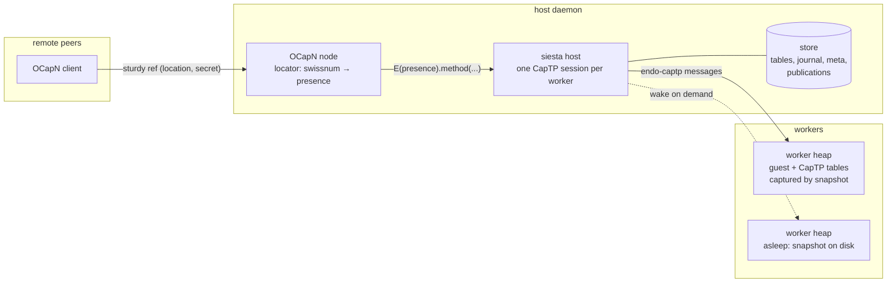

# OCapN Orthogonal Persistence Machine (`@endo/siesta`)

| | |
|---|---|
| **Created** | 2026-07-16 |
| **Author** | Aaron Davis (prompted) |
| **Status** | In Progress |

## Status

A working prototype landed alongside this document:

- `packages/siesta` — the host (`makeSiestaHost`), the OCapN-serving
  daemon wrapper (`makeSiestaDaemon`), serializable CapTP tables
  (`makePersistentTablesKit`), the deterministic worker shell
  (`makeWorkerShell`), the journal-replay reference engine
  (`makeJournalReplayEngine`), and filesystem/memory stores.
- `packages/captp` — a new `provideImport(slot, iface)` method on the
  object returned by `makeCapTP`, the restore half of a resumable CapTP
  session (with tests in `packages/captp/test/provide-import.test.js`).
- Tests demonstrate the exit criteria end to end: worker state and
  publications survive host restarts (memory and fs stores), sturdy refs
  minted from `(location, secret)` remain live across daemon restarts,
  and sleeping workers wake transparently for local or remote calls
  (`packages/siesta/test/`).

The XS-engine adapter (§ *The XS engine*) is not yet implemented; the
prototype runs on the journal-replay engine.

## What is the Problem Being Solved?

The Endo daemon achieves durability with *explicit* persistence: every
durable object is described by a formula, and workers restart from
formulas rather than resuming from memory.
That model is powerful but heavy: it entangles the daemon with formula
bookkeeping, and guests must be written against the incarnation
lifecycle.

This design prototypes the opposite corner of the space: a **distributed
ocap machine with pure orthogonal persistence and no upgrade**.
Guest state persists because the engine snapshots the whole heap (XS
snapshots, as built for the Rust `endor` supervisor), not because the
guest described itself in formulas.
A guest is an ordinary hardened-JavaScript program; it never observes
suspension, restoration, or host restarts.
Foregoing upgrade is deliberate: snapshot-restore of a heap cannot
tolerate code changes, and accepting that constraint is what makes the
system radically simpler than the daemon.

The pieces this machine composes already exist in the repository:

- **OCapN** (`packages/ocapn`) for the distributed edge: sessions,
  bootstrap `fetch`, and sturdy refs (`(location, secret)` pairs looked
  up in a locator table).
- **endo-captp** (`packages/captp`) for the host–worker edge, with its
  pluggable import/export tables
  (`makeCapTPImportExportTables`, `packages/captp/src/captp.js`).
- **XS snapshots** (`rust/endo/xsnap`): `write_snapshot`/`from_snapshot`,
  `suspend_to_cas`/`resume_from_cas`, and the supervisor suspend/resume
  protocol from [daemon-xs-worker-snapshot](daemon-xs-worker-snapshot.md).

What is missing — and what this design specifies — is the **host**: a
daemon that spins up orthogonally persistent workers, serializes its half
of each worker's CapTP session so both halves survive restarts, exposes
worker exports as sturdy refs over OCapN, and puts idle workers to sleep.

## Design

### Architecture



The host is a *translation layer*: OCapN deliveries land on host-side
CapTP presences, which forward over the host–worker session.
Nothing else flows through the host; it holds no application state of its
own.

### The worker

A worker is one guest heap behind a CapTP endpoint
(`packages/siesta/src/worker-shell.js`):

- one persistent `Compartment` endowed with pure capabilities
  (`E`, `Far`, `harden`);
- a CapTP bootstrap facet whose `evaluate(source)` evaluates a hardened
  JavaScript expression in that compartment and returns its value.

The shell must be **deterministic**: given the same inbound message
sequence it produces the same state and the same outbound messages.
Determinism is what makes journal replay equivalent to snapshot
restoration, and is also required for the XS engine's
snapshot-plus-journal-suffix restoration.
Endowments are therefore limited to pure capabilities; timers, randomness
and I/O reach guests only as capabilities exported by the host (future
work, § *Host-provided system resources*).

### The engine seam

The host takes a `WorkerEngine` power
(`packages/siesta/src/host.js`):

```js
engine.start({ workerName, snapshot, onOutbound })
  // → { deliver(message), snapshot(), terminate() }
```

- `deliver` injects one CapTP message and settles when the worker has
  processed it, including emitting replies.
- `snapshot` captures the guest heap at quiescence and returns an opaque
  durable ref.
- `terminate` ends the incarnation *without notifying the guest* — the
  guest must never observe its own suspension, so the host never sends
  `CTP_DISCONNECT` to a worker.

Two implementations:

1. **Journal replay** (`makeJournalReplayEngine`, implemented) — the
   reference and test engine.
   Every incarnation starts a fresh worker shell; the host replays the
   full journal of previously delivered messages and drops the worker's
   re-emitted replies (the *replay window*).
   `canSnapshot: false` tells the host to retain the whole journal.
2. **XS snapshots** (future) — incarnations are XS machines under the
   `endor` supervisor.
   `snapshot()` maps to `suspend_to_cas` (returning the content hash),
   `start({ snapshot })` to `resume_from_cas`, and `deliver` to the
   CBOR-envelope frames on fd 3/4
   (`rust/endo/src/proc.rs`, `rust/endo/xsnap/src/worker_io.rs`).
   With real snapshots the host still journals, but replays only the
   suffix since the last snapshot, and may truncate the prefix.

### Resuming, not re-establishing, the host–worker session

Restoring a snapshot revives the worker's CapTP tables exactly as they
were, so the host cannot open a fresh session — slot numbering would
collide with the worker's memory of the old session.
The host therefore persists its half of each session and resumes it:

- **Slot counters** — the host's export and promise counters live in a
  plain-JSON *tables record* plugged into `makeCapTP` via the existing
  `makeCapTPImportExportTables` option
  (`packages/siesta/src/persistent-tables.js`).
  A restarted host never re-mints a slot the worker's snapshot still
  binds to another object.
- **Import descriptors** — `(slot, interface)` pairs for every object
  presence the host imported.
  On restart, `captp.provideImport(slot, iface)` (the new `@endo/captp`
  seam) re-mints each presence *through* `convertSlotToVal`, so identity
  is preserved even when a restored presence is later passed back to its
  worker.
- **The journal** — every message the host delivers to a worker is
  appended to that worker's journal *before* delivery (disk before
  graph).
- **Metadata** — the bootstrap facet's slot, and the engine snapshot ref
  with its journal offset.

Question and answer slots are deliberately *not* persisted.
Snapshots are only taken at quiescence (no questions in flight), and
after a host restart the fresh question counter's reuse of old question
IDs is benign: the worker's stale `answers` entries are simply
overwritten, and the restarted host — having forgotten those questions —
can never pipeline to them.
Promise imports are likewise transient; a promise that must survive
restarts should be modeled as an object capability.

### Sturdy refs over OCapN

OCapN's serving path for sturdy refs is
`bootstrap.fetch(swissnum) → locator.get(secret)`
(`packages/ocapn/src/client/sturdyrefs.js`).
The host feeds that locator directly:

- `worker.publish(presence, secret?)` verifies the value is an imported
  object presence, records `(secret → workerName, slot, iface)` durably,
  and sets `locator.set(secret, presence)`.
- On restart, the host re-mints each published presence from its
  recorded slot and rebinds the locator **without waking any worker**.
- A remote `fetch` then returns the presence; the first `op:deliver`
  routed to it crosses into the worker session and wakes the worker.

OCapN sessions themselves remain ephemeral (see
§ *Durable OCapN sessions*): a remote peer that reconnects re-enlivens
its sturdy refs, which is exactly the durability contract sturdy refs
exist to provide.

### Sleepy workers

Per-worker lifecycle, serialized on one turn queue so wakes never race
sleeps (`packages/siesta/src/host.js`):

- **Awake → asleep.** After `idleTimeoutMs` with no traffic and no
  questions in flight — or on explicit `worker.sleep()` — the host waits
  for quiescence, calls `incarnation.snapshot()` (when the engine can),
  records `(snapshotRef, journalLength)`, and terminates the
  incarnation.
- **Asleep → awake.** Any `rawSend` on the worker's session first runs
  `engine.start` with the recorded snapshot, replays the journal suffix
  inside the replay window, and only then journals and delivers the new
  message.
- The guest observes neither transition.

### Crash-consistency envelope

The prototype's guarantees, from weakest to strongest component:

- Worker state: recovered to the last journaled message (journal replay)
  or the last snapshot plus journaled suffix (XS engine).
- Host tables: written through synchronously on every counter or
  descriptor change, and always ahead of any message that depends on
  them.
- Worker replies in flight when the host dies are lost; because replies
  are re-derivable by replay and questions are transient, this only
  costs the answers to questions nobody remembers asking.

## The XS engine (build plan)

The `endor` substrate already implements the hard parts
([daemon-xs-worker-snapshot](daemon-xs-worker-snapshot.md), Phases 1–2):
`Machine::write_snapshot`/`from_snapshot`,
`suspend_to_cas`/`resume_from_cas`, `SuspendedWorker`, and the
supervisor's suspend/resume verbs.
The adapter work is:

1. Bundle the worker shell (`@endo/siesta/src/worker-shell.js`) as the
   XS machine's bootstrap, wired to the fd 3/4 envelope transport.
2. Implement `WorkerEngine` over the supervisor's spawn/suspend/resume
   control verbs; `snapshot()` returns the CAS hash.
3. Adopt snapshot-time journal truncation and CAS GC roots
   (the ephemeral-CAS-GC-root bookkeeping flagged as remaining work in
   daemon-xs-worker-snapshot).

## Future Work

### Host-provided system resources

Workers eventually need timers, network, storage, and other host
capabilities.
The shape: the host exports capability objects into the worker session,
and — because host exports are *not* inside any snapshot — each such
export must be re-instantiable from a durable description.
That is a formula by another name, but scoped to the host's export table
only: a small `(slot → resource description)` map per worker, hydrated at
resume, never visible to guests.
The persistent tables already record export descriptors; what is missing
is the re-instantiation registry and the attenuation story.
Timers deserve first attention, since a sleeping worker with a pending
`E(timer).wakeAt(t)` gives the host a reason to wake it without inbound
traffic.

### Durable OCapN sessions

Today a host restart severs live OCapN sessions; remote peers keep
durability only through sturdy refs.
[ocapn-noise-session-reconnect](ocapn-noise-session-reconnect.md) gets
partway there: it keeps one *CapTP session* alive across TCP transport
instances, but both sides keep their session tables in memory.
Sessions that survive a *process restart* additionally require:

- persisting the OCapN session's import/export/answer tables (the same
  treatment `@endo/siesta` gives its worker sessions, applied inside
  `packages/ocapn/src/client/ocapn.js`, whose tables are currently
  session-scoped and in-memory);
- stable node identity (persisted signing keys) and a session-resumption
  handshake that authenticates "same peer, new process";
- replay/idempotence discipline for deliveries in flight at the crash,
  per the reconnect design's § *Replay idempotence*.

This is a heavy revision of the OCapN client's session model and is
explicitly out of scope here; sturdy refs are the durability boundary
until it lands.

### Also deferred

- **GC.** `gcImports` is off on the host side and the worker holds its
  exports forever; a distributed-GC pass over sleeping workers needs the
  refcounting messages to be journaled and replayed consistently.
- **Snapshot compaction cadence**, metering
  ([daemon-xs-worker-metering](daemon-xs-worker-metering.md)), and
  multi-tenant scheduling.
- **Cross-version snapshots** (explicitly out of scope: no upgrade).

## Dependencies

| Design | Relationship |
|---|---|
| [daemon-xs-worker-snapshot](daemon-xs-worker-snapshot.md) | Provides the XS snapshot/suspend/resume substrate the production engine adapts. |
| [ocapn-noise-session-reconnect](ocapn-noise-session-reconnect.md) | The within-session reconnect layer that durable OCapN sessions (future work) would extend. |
| [ocapn-network-transport-separation](ocapn-network-transport-separation.md) | The netlayer seam through which the daemon takes its transport power. |
| [daemon-xs-worker-metering](daemon-xs-worker-metering.md) | Metering for XS incarnations, applicable unchanged. |

## Phased Implementation

1. **Phase 1 (landed): captp resume seam.** `provideImport` on
   `makeCapTP`, with identity-preservation tests.
2. **Phase 2 (landed): host prototype.** `@endo/siesta`: persistent
   tables, journal, sleepy lifecycle, publications, OCapN daemon
   wrapper, journal-replay engine; end-to-end restart tests over the
   TCP-testing netlayer.
3. **Phase 3: XS engine.** The adapter in § *The XS engine*; the
   exit criterion is the existing siesta test suite passing unmodified
   on XS incarnations with real snapshots.
4. **Phase 4: system resources.** Durable host exports (timer first),
   per § *Host-provided system resources*.
5. **Phase 5: production transport.** Noise netlayer with persisted
   signing keys, giving stable locations for sturdy refs.
6. **Phase 6: durable OCapN sessions.** Gated on the OCapN session-model
   revision; tracked as future work.

## Design Decisions

1. **Resume the worker session; never re-establish it.** A restored
   heap remembers the old session, so the host persists counters and
   import descriptors and re-mints presences with `provideImport`.
   The alternative — reset both halves and re-fetch by name — would
   forfeit true snapshot restoration and force a registry protocol on
   every guest.
2. **`provideImport` lands in `@endo/captp` rather than being simulated
   in siesta.** Re-minting outside `convertSlotToVal` would break value
   identity when a restored presence is passed back to its worker; the
   seam is five lines in the right place versus a standing correctness
   bug in the wrong one.
3. **Journal in the host, replay window in the host.** Engines stay
   dumb (`start/deliver/snapshot/terminate`); the same journaling and
   suffix-replay logic serves both the replay engine (full journal) and
   the XS engine (suffix since snapshot).
4. **Quiescence-only snapshots; questions and promises are transient.**
   Avoids persisting settler state and makes question-ID reuse after a
   host restart provably benign.
5. **Sleep is invisible to guests.** No `CTP_DISCONNECT` toward
   workers, ever; termination without notification is what makes the
   persistence orthogonal.
6. **No upgrade.** Snapshots pin code; a "new version" of a guest is a
   new worker.
   This is the simplification that separates siesta from the daemon.

## Known Gaps and TODOs

- [ ] XS engine adapter (Phase 3).
- [ ] Host exports to workers are not durable: a worker that retains a
      host capability across a host restart will find its slot dead
      (`hasExport` fails). Blocked on the durable-export registry
      (Phase 4).
- [ ] The TCP-testing netlayer mints per-boot locations, so restart
      tests re-derive the location; stable locations arrive with the
      Noise netlayer and persisted keys (Phase 5).
- [ ] Journal growth is unbounded on the replay engine; truncation
      needs `canSnapshot`.
- [ ] No metering or scheduling; a hostile guest can spin forever.

## Prompt

> build on ocapn and xs/xsnap to prototype an distributed ocap machine
> with pure orthogonal persistence (no upgrade). a host daemon connects
> via ocapn and can be instructed to spin up orthogonal persistence
> workers. workers communicate via endo-captp to the host and their
> exported objects can be exposed as sturdy refs over ocapn via the
> host. the idea is to make a simpler version of endo daemon with
> orthogonal persistence guests. the host-side will need to serialize
> it's import export tables for each worker so they and host can survive
> restarts. exposing system resources to the workers via the host is
> left as future work but covered in the design doc. the host will
> mostly provide a translational layer between workers and remotes.
> workers should be made to be "sleepy" and be snapshotted and closed
> when idle. eventually we will want durable ocapn sessions that can be
> resumed after restart, but this may require heavy ocapn rewrite
