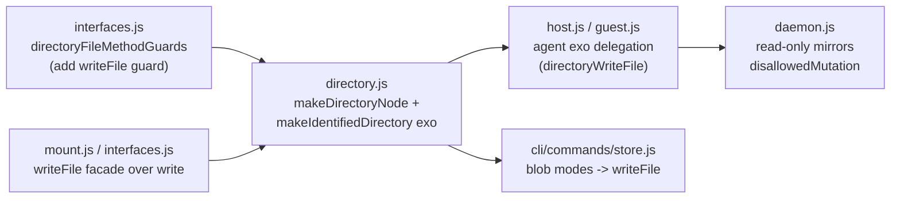

# `endo store` drives `writeFile` on ordinary `EndoDirectory`

| | |
|---|---|
| **Created** | 2026-07-15 |
| **Author** | Kris Kowal (prompted) |
| **Status** | Not Started |
| **Source** | Follow-up requested in [endojs/endo-but-for-bots#658 comment](https://github.com/endojs/endo-but-for-bots/pull/658#issuecomment-4977137707) |

## What is the Problem Being Solved?

PR [#658](https://github.com/endojs/endo-but-for-bots/pull/658) added the
CLI verbs `endo ls` / `endo cat` / `endo write` that traverse a **mount**
and mutate it through the mount exo's own `writeText` / `writeBytes`
methods. The maintainer's follow-up:

> Mounts are not, or should not, be special as name hubs with regard to
> supporting `writeFile`: that method should exist on ordinary
> `EndoDirectory`.

Today the write surface is asymmetric:

- An **ordinary `EndoDirectory`** can create a file entry only through
  `writeText(name, string)` (text only) or through the agent-level
  `storeBlob(readerRef, name)` (bytes, but reached on the host/guest, not
  on the directory itself).
- A **mount** additionally carries `write` / `writeText` / `writeBytes`
  that stream bytes into a live host-filesystem path.

So "write a file's bytes to a named location" is a first-class directory
operation for mounts but a second-class one for ordinary directories,
reachable only as `storeBlob` on the agent. The directive is to make the
directory the uniform surface: add a bytes-shaped `writeFile` method to
`EndoDirectory` (the sibling of the existing `writeText`), and have
`endo store`'s blob modes drive it. A mount then stops being special: it
is simply a name hub that also happens to carry the same method, reached
transparently through path delegation.

## Background: the existing `writeText` precedent

`EndoDirectory.writeText` (`packages/daemon/src/directory.js`, the
`writeText` binding in `makeDirectoryNode`) already establishes the exact
shape this design generalizes:

```js
const writeText = async (petNameOrPath, content) => {
  const namePath = namePathFrom(petNameOrPath);
  if (namePath.length < 2) {
    // single segment: create a readable-blob, bind the pet name
    const bytes = bytesFromText(content);
    const readerRef = bytesReaderFromIterator([bytes]);
    const tasks = makeDeferredTasks();
    tasks.push(identifiers =>
      storeIdentifier(namePath, identifiers.readableBlobId));
    await formulateReadableBlob(readerRef, tasks);
    return;
  }
  // multi-segment: delegate to the tail name hub (e.g. a mount)
  const { hub, name } = await lookupTailNameHub(namePath);
  await E(hub).writeText(name, content);
};
```

`writeFile` is the byte-stream analog: identical control flow, but its
content parameter is a **passable bytes reader** (`PassableBytesReader`,
the `streamBase64`-bearing remotable returned by
`bytesReaderFromIterator`) rather than a `string`, so binary content of any
size streams into the content-address store rather than materializing as
a JavaScript string. The single-segment branch is byte-for-byte what the
agent's `storeBlob` already does; the multi-segment branch delegates to
the tail hub's `writeFile` instead of `writeText`.

## Design

### 1. New method `EndoDirectory.writeFile`

Signature (daemon-internal, over CapTP):

```
writeFile(
  petNameOrPath: string | string[],
  readerRef: PassableBytesReader,
): Promise<void>
```

Behavior, mirroring `writeText`:

- **Single-segment name** (`['photo']`): formulate a `readable-blob` from
  `readerRef` and bind the pet name via `storeIdentifier(namePath,
  readableBlobId)`. This is exactly the `storeBlob` code path
  (`formulateReadableBlob(readerRef, tasks)` with a deferred
  `storeIdentifier` task); `storeBlob` becomes a thin caller of the same
  primitive rather than a parallel implementation.
- **Multi-segment path** (`['proj', 'src', 'index.js']`): resolve the
  prefix to the tail name hub with `lookupTailNameHub`, then call
  `E(hub).writeFile(name, readerRef)`. When the prefix resolves to a
  **mount**, the bytes land in the mount's confined filesystem, honoring
  its `readOnly` and symlink-confinement guarantees. When the prefix
  resolves to a **nested `EndoDirectory`**, the tail directory's own
  `writeFile` binds a `readable-blob` leaf there.

`readerRef` is a `PassableBytesReader` (a remotable exposing
`streamBase64`), so the guard is `M.remotable()` and the content streams
rather than buffering into a passable string. This is the same object type
the CLI already builds with `bytesReaderFromIterator(makeNodeReader(...))`
for `storeBlob`.

### 2. Mounts carry the same named byte-write surface

`EndoMount` currently has the generic `write(path, value)` method, which
accepts both readable blobs and readable trees. Its `writeBytes` method is
on `EndoMountFile`, not on `EndoMount`, so calling `writeBytes` on a tail
name hub would not work. Add `writeFile(path, readerRef)` to `EndoMount` as
the byte-only facade over `write(path, readerRef)`. It retains the same
streaming, scratch-then-rename, `assertWritable`, parent-creation, and
confinement behavior as `write`.

That alias is what makes `writeFile` a uniform tail-hub operation: ordinary
directories recursively call their own method, and mounts use their named
byte-write facade. The generic mount `write` remains available for its
distinct readable-tree operation.

### 3. `endo store` drives `writeFile`

`packages/cli/src/commands/store.js` today routes its **blob** modes
(`--path`, `--stdin`) to `E(agent).storeBlob(readerRef, parsedName)`.
Rewire those modes to `E(agent).writeFile(parsedName, readerRef)`.

Because the agent delegates its name-hub surface to its directory (the
same `directoryWriteText` delegation already present in `host.js` /
`guest.js`), and because the directory resolves the tail hub, the **same
command** transparently writes into a mount when the name path is rooted
at a mount:

```
endo store --path ./photo.png --name photos/cat     # readable-blob entry
endo store --stdin --name proj/src/index.js         # writes into mount "proj"
```

No mount-specific CLI verb is needed: `endo store` is the single entry
point, and mount-vs-directory is decided by name resolution inside the
daemon rather than by the CLI choosing a verb. This is the CLI-surface
counterpart of "mounts are not special" (contrast PR #658's dedicated
`endo write <mount>` verb, which this subsumes for the blob case).

The **value** modes (`--text`, `--json`, `--bigint`, `--text-stdin`,
`--json-stdin`) continue to drive `storeValue`, which marshals a passable
value rather than writing file bytes; those are a different axis and are
out of scope here (see the `cli-store-verb-text-modes` design, which names
the same blob-vs-value distinction).

### 4. Touchpoints (the `writeText` mirror set)

Adding `writeFile` mirrors every place `writeText` is wired, so the diff
is mechanical and its completeness is checkable by grepping for
`writeText`:



- **`packages/platform/src/fs/interfaces.js`** (`directoryFileMethodGuards`,
  re-exported through `packages/daemon/src/interfaces.js`): add
  `writeFile: M.call(NameOrPathShape, M.remotable()).returns(M.promise())`.
- **`packages/daemon/src/directory.js`**: implement `writeFile` in
  `makeDirectoryNode`'s method bag and expose it on the
  `makeIdentifiedDirectory` exo record (alongside `writeText`). Refactor
  the shared single-segment blob-write into one helper that both
  `writeFile` and the agents' `storeBlob` call.
- **`packages/daemon/src/mount.js` / `interfaces.js`**: add
  `EndoMount.writeFile(path, readerRef)` as the byte-only facade over
  `write(path, readerRef)`, with the same `M.remotable()` guard. This is
  separate from `EndoMountFile.writeBytes(readerRef)`, which writes a file
  handle that has already been looked up.
- **`packages/daemon/src/host.js` / `guest.js`**: expose `writeFile` on the
  agent exos via the same delegation as `writeText: directoryWriteText`
  (add `writeFile: directoryWriteFile`), and add the `writeFile` guard to
  `HostInterface` / `GuestInterface`. Re-point `storeBlob` at the shared
  helper.
- **`packages/daemon/src/daemon.js`**: add `writeFile: disallowedMutation`
  to each read-only directory mirror (the two `disallowedMutation` records
  that already list `writeText`).
- **`packages/daemon/src/help-text-data.js`**: add help text for
  `writeFile` (and regenerate `help.md`).
- **`packages/daemon/src/types.d.ts`**: add `writeFile(petNamePath: string
  | string[], readerRef: ERef<PassableBytesReader>): Promise<void>` to the
  `EndoDirectory` (and agent) interfaces.

## Behavior and error cases

- **Overwrite / rebind.** Writing a single-segment name that already binds
  a `readable-blob` rebinds the pet name to a new content-addressed
  formula (a new immutable blob), exactly as `writeText` and `storeBlob`
  do today; the previous blob is unpinned and becomes eligible for GC per
  the `daemon-content-store-gc` design. Directory entries are never
  mutated in place; only mount-backed writes mutate a live file.
- **Read-only.** Writing through a read-only mount rejects at the mount
  boundary (`assertWritable`, "Mount is read-only"). Writing through a
  read-only directory attenuation rejects via the daemon's
  `disallowedMutation` mirror. No bytes reach disk or the content store in
  either rejection.
- **Confinement.** Mount-bound writes remain subject to the mount's
  `realpath`-based containment checks; a path whose segments escape the
  mount root is rejected exactly as for the mount exo's own `write`.
- **Missing intermediate segments.** For a mount tail, parent directories
  are created as needed (the mount's `write`/`writeBytes` calls
  `makePath`). For an ordinary nested `EndoDirectory` tail, intermediate
  path segments are **not** auto-created (directories have no `makePath`);
  a write to `a/b/leaf` where `a/b` is not an existing directory rejects
  at name resolution, matching today's `writeText` behavior. (See Open
  questions on whether to auto-create.)
- **Empty / zero-byte input.** A zero-length reader produces a valid empty
  `readable-blob`, consistent with `storeBlob`.

## Compatibility and migration

- **Additive.** `writeFile` is a new method; no existing method changes
  signature. Existing `writeText`, `storeBlob`, `storeValue`, and the
  PR #658 mount verbs keep working.
- **`endo store` behavior is preserved** for single-segment names: the
  produced formula (a `readable-blob`) and the resulting pet-name binding
  are identical whether the blob modes call `storeBlob` (today) or
  `writeFile` (after). The only observable change is that a **multi-segment
  name rooted at a mount** now writes into the mount instead of failing or
  creating a mis-scoped entry.
- **`storeBlob` retained.** The agent-level `storeBlob` remains as a
  compatibility alias delegating to the shared helper; whether to
  deprecate it is an Open question. No saved-data migration is required:
  the on-disk formula shapes (`readable-blob`, pet-store bindings) are
  unchanged.
- **PR #658's `endo write <mount>` verb.** This design subsumes the blob
  case of that verb through `endo store`. Whether `endo write` is retired,
  kept as a shorthand, or narrowed is left to the
  `cli-store-verb-text-modes` reshape; this design does not remove it.

## Dependencies

| Design | Relationship |
|---|---|
| [daemon-mount](daemon-mount.md) | Provides the mount exo whose new `writeFile` facade delegates to its existing generic `write`; PR #658 (Phase 6) is the precipitating change. |
| [cli-store-verb-text-modes](cli-store-verb-text-modes.md) | Names the same blob-vs-value axis; the reshaped `--blob` source mode is the CLI surface that would drive `writeFile`. Align the two before CLI-flag changes land. |
| [daemon-content-store-gc](daemon-content-store-gc.md) | Governs GC of the superseded blob when a single-segment name is rewritten. |

## Verification plan

- **Unit (daemon).** Extend the directory tests to cover `writeFile` on a
  plain directory: single-segment write creates a `readable-blob`, the pet
  name resolves to it, and `endo cat`-equivalent read-back
  (`iterateBytesReader`) reproduces the exact input bytes (including a
  binary, non-UTF-8 payload and a zero-byte payload). Assert rewrite
  rebinds to a new formula id.
- **Unit (mount delegation).** With a real on-disk mount (mirroring
  `packages/cli/test/mount-path-cli.test.js`), assert that a multi-segment
  `writeFile` through a mounted directory lands bytes on the backing
  filesystem and that a read-only mount rejects with no file created.
- **Unit (nested directory delegation).** Create a nested ordinary
  `EndoDirectory`, write a binary bytes reader through a multi-segment
  path, and read the resulting `readable-blob` back. This proves the
  tail-hub recursion does not assume that every tail is a mount.
- **CLI end-to-end.** Spin up an isolated daemon; assert `endo store
  --path <bin> --name x` then `endo cat x` round-trips bytes, and that
  `endo store --stdin --name <mount>/sub/file` writes into the mount
  (cross-checked against the backing filesystem). Assert value modes still
  route to `storeValue` unchanged.
- **Grep-completeness check.** After implementation, `grep -rn writeText
  packages/daemon/src` and confirm a matching `writeFile` at each
  touchpoint listed above (the mirror set is the completeness invariant).

## Open questions

- Should the agent-level `storeBlob` be **deprecated** in favor of
  `writeFile`, or retained indefinitely as an alias? If deprecated, over
  what window, and does the CLI keep any `storeBlob` caller?
- For a multi-segment write whose tail is an ordinary nested
  `EndoDirectory` (not a mount), should intermediate path segments be
  **auto-created** (a directory-level `makePath` analog), or continue to
  reject as today's `writeText` does? Auto-creation would make directories
  behave more like mounts; rejecting keeps directory mutation explicit.
- Does `writeFile` belong on the agent (`EndoHost` / `EndoGuest`) surface
  as well as `EndoDirectory`, or only on the directory with the agent
  reaching it through its directory? (The current `storeBlob` lives on the
  agent; `writeText` is delegated onto the agent exo. Consistency suggests
  delegating `writeFile` onto the agent too, which is what §3 proposes.)
- Interaction with the `cli-store-verb-text-modes` reshape: should this
  design wait on that reshape's `--blob` flag, or land the daemon-side
  `writeFile` first and let the CLI-flag reshape adopt it? Landing the
  daemon method first is lower-risk; confirm ordering with the maintainer.
- Should `writeFile` accept a raw byte array (`M.arrayOf(...)`) in addition
  to a streaming `ReadableBlob` remotable, for small in-memory writes, or
  is the streaming remotable the sole accepted shape (as `storeBlob` uses
  today)?

## Prompt

> Please post a follow-up design job for `endo store` to drive
> `writeFile`. Mounts are not, or should not, be special as name hubs with
> regard to supporting `writeFile`: that method should exist on ordinary
> `EndoDirectory`.

Originating comment:
[endojs/endo-but-for-bots#658](https://github.com/endojs/endo-but-for-bots/pull/658#issuecomment-4977137707)
(2026-07-15).
