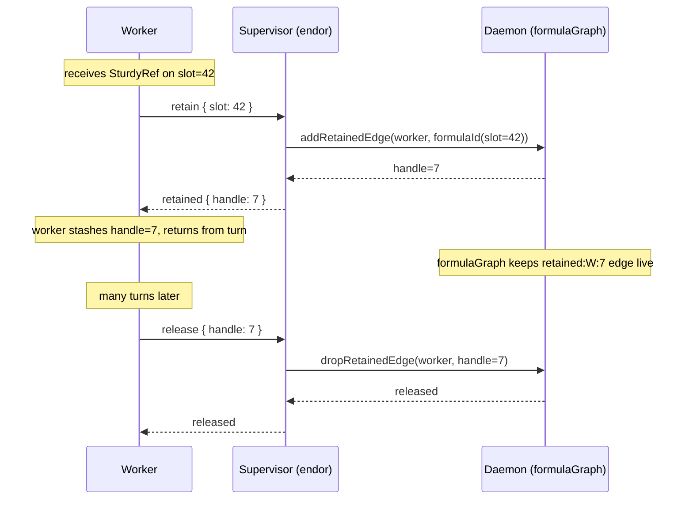
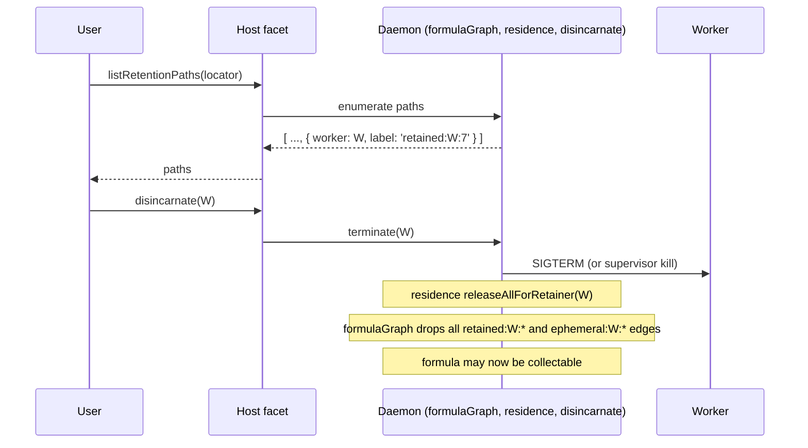

# SturdyRefs in `@endo/pass-style` with `endor`-Syscall Retention

| | |
|---|---|
| **Created** | 2026-06-23 |
| **Author** | endolinbot (prompted) |
| **Status** | Proposed |

## Summary

This is **design 2 of 2** in a pair of competing plans for landing
SturdyRef support in `@endo/pass-style` and threading sturdy refs
through the daemon's pet-name-path surface.
The sibling design (the `FinalizationRegistry` plan) lets workers
hold SturdyRefs in their own JavaScript heap and uses GC observation
on the daemon side to expose the user's revocation surface.
This plan rejects worker-local SturdyRef retention entirely.
Workers receive SturdyRefs only as transient values during a single
delivery; any retention beyond the current turn is performed by the
daemon on the worker's behalf, mediated by a new
`retain` / `release` pair in the `endor` worker syscall surface.
The user's agency over revocation falls out of the daemon-side
retention table directly, the same way it already does for pet names.

The competing plan is on branch `design/sturdy-refs-pass-style`
(or its equivalent) and will be linked once the parallel designer
lands.

## What is the Problem Being Solved?

The maintainer's directive on PR #500 comment `4775973308` describes
three needs that have to be solved together:

1. **`@endo/pass-style` learns about SturdyRefs.**
   A SturdyRef is an opaque object similar to a presence that must be
   registered with `HandledPromise` and that corresponds to an OCapN
   locator (`peer + swiss-num`).
   The on-wire form is already specified in the OCapN spec
   (`ocapn-sturdyref` tagged record carrying a peer locator and a
   swiss number); pass-style needs a category for it so `passStyleOf`
   has an answer and so marshaling layers can route it.
   Today `@endo/ocapn` shims this by using a `tagged` value with tag
   `'ocapn-sturdyref'` and a side WeakMap (`sturdyRefDetails`), with
   `ocapnPassStyleOf` upgrading the answer from `'tagged'` to
   `'sturdyref'`.
   That shim is the thing this design promotes to a real
   pass-style category.

2. **CapTP and OCapN box and unbox SturdyRefs.**
   A SturdyRef is a passable, not a wire-format primitive.
   The marshaling layer is responsible for boxing on send and
   unboxing on receive.
   OCapN exposes (via the bootstrap object) the closely-held
   capability to associate a SturdyRef with its locator
   (mint) or to reveal the locator for a SturdyRef
   (decompose).
   On other CapTP transports the same role is played by an explicit
   side-channel; the pass-style category is the same.

3. **Any daemon agent method that accepts a pet-name-path also
   accepts a SturdyRef.**
   This is the second-stage payoff.
   A confined guest or subagent that should never see a locator (the
   long-lived authority granting access to the capability) can still
   refer to a formula by holding an opaque SturdyRef.
   No host pet name need be allocated.

The retention dilemma is the third leg.
The maintainer's hard invariant is that the user retains agency:
the user must be able to **mention any retention root and force
disincarnation, reincarnation, or revocation-by-deletion for any
formula with a living reference**.
For pet names this works because the user owns the name; for a
SturdyRef held inside a worker's JS heap, the user has no anchor
to point at.
The maintainer surfaces two options:

- **Option A (the sibling design).**
  Workers retain SturdyRefs as ordinary JS values.
  The daemon uses `FinalizationRegistry` to observe when the
  worker's heap actually drops a SturdyRef, and projects that into
  the user's revocation surface as "worker X is keeping this
  formula alive".

- **Option B (this design).**
  Workers cannot retain ephemeral references to formulas at all.
  The daemon ephemerally retains any reference returned by an agent
  method until it is collected, reveals those ephemeral retention
  roots to the user, and exposes a new `endor` worker syscall
  (`retain` / `release`) so a worker can ask the daemon to extend
  the retention beyond a single turn.

The maintainer's broader framing:
*"Not having to explicitly manage retention is a virtue of
ocap-kernel, and revocation-by-deletion is the virtue of the
daemon. We should strive to avoid taking the advantages of either
approach with the disadvantages of the other."*
The composition this design proposes is the subject of its own
section below.

## Background

### The OCapN locator (parsed representation)

Per the OCapN spec section *Sturdyref Locator* (held at
`kriscendobot/ocapn` commit `f7005c12`, the snapshot the journal
indexes), a sturdyref carries a peer locator and a swiss number.
The peer locator carries a designator, a transport (also called
network), and an optional hashmap of hints; two peer locators are
the same peer if and only if designator and transport match.
The swiss number is a string identifying the object at that peer.

The package `@endo/ocapn` already shapes the parsed peer locator
as the `OcapnLocation` typedef in
`src/codecs/components.js`:

```typescript
type OcapnLocation = {
  type: 'ocapn-peer';
  designator: string;
  transport: string;       // legacy field
  network?: string;        // replaces transport during migration
  hints: false | Record<string, string>;
};
```

This design adopts that shape verbatim and proposes that
`@endo/pass-style` re-exports the locator typedef (or a structurally
equivalent narrowing of it) so non-OCapN marshaling layers do not
have to take a runtime dependency on `@endo/ocapn` just to name the
type.
The exported brand `OcapnLocation` (or its renamed equivalent) is
treated as a `copyRecord` at the pass-style layer, deep-frozen,
and compared by structural equality.
The on-wire serialization of the locator is owned by OCapN, not by
pass-style; pass-style only knows the parsed shape.

The swiss number is a string in the spec.
The current `@endo/ocapn` implementation already supports two
runtime types for it (a printable ASCII string or a `Uint8Array`
of arbitrary bytes, the second case present for interop with
Spritely Goblins' 24-byte random secrets).
This design narrows the **passable** representation to `string`
(per the spec) and treats the byte-array case as an
implementation-internal extension owned by `@endo/ocapn`'s
sturdyref tracker, not part of the pass-style surface.

### What `@endo/pass-style` currently knows

`passStyleOf` returns one of:
`'undefined' | 'null' | 'boolean' | 'number' | 'bigint' | 'string'
| 'byteArray' | 'symbol' | 'copyArray' | 'copyRecord' | 'tagged'
| 'remotable' | 'error' | 'promise'`.
The helper machinery in `passStyle-helpers.js` reads a `PASS_STYLE`
symbol off the value (or a `Symbol.toStringTag` on the
tag-record prototype) and dispatches by a `HelperTable` keyed on
the style name.
Adding a new style means adding a new helper that recognises the
value, refusing to pass-style any value that is not a properly
constructed SturdyRef, and slotting into `passStyleOf`'s table.

The closest existing precedent is `'remotable'`: a passable whose
runtime payload (its identity) is what the marshaler turns into a
wire slot.
A SturdyRef is similarly identity-bearing but, unlike a presence,
it carries a **resolvable** identity (the locator) rather than a
slot established at session bootstrap.

### `HandledPromise` registration

`@endo/eventual-send`'s `makeHandledPromise` keeps a
`presenceToHandler` `WeakMap` and a `presenceToPromise` `WeakMap`;
when a presence is registered with `HandledPromise.resolve(p)` or
created via `new HandledPromise(executor, handler)`, those maps are
populated.
The maintainer's framing is that a SturdyRef must be registered with
`HandledPromise` so that `E(sturdyRef).foo()` does the right thing.
This design treats `HandledPromise` registration as the
**boxing layer's responsibility on inbound unbox** (per the next
subsection).
The pass-style layer does not call into eventual-send.

### How the OCapN codec already boxes SturdyRefs

`@endo/ocapn/src/codecs/ocapn-pass-style.js`:

```js
export const ocapnPassStyleOf = value => {
  if (isSturdyRef(value)) {
    return 'sturdyref';
  }
  // ... handoff cases ...
  return passStyleOf(value);
};
```

`@endo/ocapn/src/client/sturdyrefs.js`:
the tracker mints a SturdyRef via `makeTagged('ocapn-sturdyref',
undefined)` and squirrels `{ location, secret }` away in a
`WeakMap`.
The on-wire codec reads `(peer, swiss-num)` and asks the tracker
to materialise a SturdyRef in the receiving world; the secret
is **not** a property on the object.
The closely-held bootstrap capability `enlivenSturdyRef` resolves
a SturdyRef to either a local capability (via `locator.get(secret)`)
or a remote reference (via `provideSession(location)` and
`getRemoteBootstrap().fetch(secret)`).

This design promotes that shim by:

- Moving the `PASS_STYLE` answer for sturdyrefs from
  `ocapnPassStyleOf` (an OCapN-specific upgrade of the answer)
  into `passStyleOf` itself.
- Replacing the side-`WeakMap` carrier with a real pass-style
  category that names its content (`location`, optionally a
  `swissNum` projection that the closely-held capability is the
  only path to).
- Keeping the close-held nature of the secret: even when pass-style
  knows about the category, **the secret is not a property the
  worker can read**; reveal goes through the OCapN-provided
  capability.

### Daemon: where pet-name-paths land today

The host facets accept pet-name-paths in many places: `lookup`,
`identify`, `locate`, `write`, `remove`, `move`, `makeDirectory`,
`makeUnconfined`'s `petNamePaths` array, `evaluate`'s
`codeNames`/`petNamePaths` (`host.js` line 361 onward), and so on.
The canonical entry shape is `(string | string[])` per segment.
`writeLocator` already accepts either a locator string or a raw
formula identifier and internalises it before delegating to
`write` (see `daemon-locator-reference.md` § Writing).
This design proposes the symmetric extension on the **read** side:
any of those methods that today accept a pet-name-path also
accept a SturdyRef.

The internal resolution is:
`SturdyRef -> { location, swissNum }` (via the closely-held capability
that OCapN provides to the daemon at construction time)
`-> formulaIdentifier` (via the daemon's existing `internalizeLocator`
flow for local-peer locators, or a remote peer connection for
non-local ones).
Crucially, this rewriting happens **at the daemon's outer surface**
(the facet boundary), not inside the worker.
A guest or worker never sees the swiss number.

### The `endor` worker protocol today

`endor` is the unified Rust daemon binary (per
`designs/daemon-endor-architecture.md`).
The on-wire envelope between daemon and worker is the four-element
CBOR array `[handle, verb, payload, nonce]`, framed as a CBOR byte
string (see `packages/daemon/src/envelope.js` and
`bus-daemon-node-powers.js`).
Existing daemon-to-supervisor control verbs (Rust crate side):
`ready`, `listen-path`, `spawn`, `list`, `suspend`, `suspended`.
Existing supervisor-to-daemon and daemon-to-worker verbs:
`spawned`, `error`, `deliver`, `exited`.

The protocol is asymmetric in spirit but symmetric in mechanism:
both directions use the same envelope shape; the verb namespace
is partitioned by who sends which verb.
The CapTP traffic between daemon and worker rides inside
`deliver` envelopes.
A new **worker-to-daemon syscall** therefore needs:

- A reserved verb name in the worker-originating namespace.
- A payload shape (CBOR map).
- A response envelope shape (also CBOR map; the daemon answers via
  `deliver` or via a dedicated response verb keyed by `nonce`).

This design proposes two new worker-originating verbs:
`retain` and `release` (described in *Endor syscall surface* below).

### Existing retention machinery

The pieces already in the daemon that this design composes with:

- `formulaGraph` (see `packages/daemon/src/graph.js`) is the
  union-find retention graph already used for cross-peer GC.
  Retention edges have labels (`pet:<name>`, internal field names,
  `retention` for cross-peer, `transient` for short-lived pins).
- `pin` / `unpinTransient` in `DaemonCore` are the internal
  primitives for short-lived pins.
- `residence.js` already tracks per-CapTP-connection retention
  (`retain` / `release` keyed by `retainerId` + `retaineeId` +
  `retaineeIncarnation = CapTP slot`).
  When `deleteExport(slot)` runs, a `release` event fires and the
  worker's hold drops.
  This is the canonical hook for the design's daemon-side
  bookkeeping.

This design's claim is that a SturdyRef returned to a worker rides
the *existing* residence-tracker machinery for as long as the worker
holds the CapTP slot, and the new syscall extends that to longer
lifetimes when the worker explicitly asks.

## Design

### Pass-style integration

#### A new pass-style category, `'sturdyRef'`

A sixth marker style, joining `'remotable'` and `'tagged'`.
Construction is gated through a maker (`makeSturdyRef`) supplied by
`@endo/pass-style`:

```js
import { makeSturdyRef, passStyleOf } from '@endo/pass-style';
const sturdyRef = makeSturdyRef(location);
passStyleOf(sturdyRef); // 'sturdyRef'
```

A SturdyRef value has:

- `[PASS_STYLE]: 'sturdyRef'` on a tag-record prototype, mirroring
  the way remotables work.
- `[Symbol.toStringTag]: 'SturdyRef'`.
- A non-enumerable `location` accessor returning the deep-frozen
  parsed `OcapnLocation`.
  (The accessor shape, rather than a data property, lets the
  helper assert that the prototype's own descriptor is the only
  source of `location`.)

The secret (swiss number) is **not** a property.
The SturdyRef object on its own is not enough to mint a CapTP
reference; the closely-held capability (next subsection) is.

This shape composes with `makeExo` and pattern-matchers (`M.kind`
gains an entry for `'sturdyRef'`) without surprise.

#### Helper: `SturdyRefHelper`

A new file `packages/pass-style/src/sturdyRef.js` adding:

```js
export const SturdyRefHelper = harden({
  styleName: 'sturdyRef',
  canBeValid: (candidate, reject) => { /* tag-record check */ },
  assertValid: (candidate, passStyleOfRecur) => {
    // 1. tag-record is structurally a SturdyRef tag-record.
    // 2. The location passes a passable-location check
    //    (copyRecord with the right keys, designator/transport/
    //    optional network/hints).
    // 3. The location is hardened (deep-frozen).
  },
});
```

This helper joins `CopyArrayHelper`, `CopyRecordHelper`,
`TaggedHelper`, `RemotableHelper`, and the others in
`passStyleOf.js`'s helper table.

#### Interface guards

`@endo/patterns` gains a matcher `M.sturdyRef()` that admits any
SturdyRef.
A SturdyRef can appear anywhere a `Passable` may today.
Method guards that want to accept a SturdyRef where they previously
took a pet-name-path use a sum:

```js
M.or(M.arrayOf(M.string()), M.string(), M.sturdyRef())
```

(or a named alias `M.petNamePathOrSturdyRef()`, defined once in
the daemon's `interfaces.js`).

#### Boxing and unboxing across marshaling layers

Pass-style does **not** marshal.
The mechanism is:

- **On send (boxing).**
  The marshaler asks `passStyleOf(value)`.
  When the answer is `'sturdyRef'`, the marshaler asks the
  layer's *sturdyref dispatcher* for a wire representation.
  For OCapN, the dispatcher inspects the locator and either
  emits the `ocapn-sturdyref` tagged record (peer + swiss-num)
  directly (when the locator is to a peer the session can reach)
  or rejects (when the locator is unreachable).
  For non-OCapN CapTP layers (the legacy `@endo/captp` over a
  single transport), the dispatcher uses an out-of-band
  side-channel reveal-locator capability that the session
  acquires at construction time.

- **On receive (unboxing).**
  The wire form (`ocapn-sturdyref(peer, swiss-num)` for OCapN, the
  equivalent for other layers) is handed to the layer's
  sturdyref *enlivener*, which:
  1. constructs a SturdyRef via `makeSturdyRef(parsedLocation)`,
  2. records `{ swissNum }` in the layer's side-table keyed by
     SturdyRef identity,
  3. registers the SturdyRef with the layer's `HandledPromise`
     (so `E(sturdyRef).foo()` routes through the layer's handler,
     which knows how to fetch the underlying CapTP reference on
     first send),
  4. returns the SturdyRef to the application.

The closely-held capability OCapN supplies to the daemon is the
*identity* of the layer's sturdyref dispatcher and enlivener.
The capability provides two operations:

- `associate(sturdyRef, location) -> swissNum?` (mint side):
  returns the swiss number bound to a SturdyRef the daemon
  already holds, or undefined if not bound.
- `reveal(sturdyRef) -> { location, swissNum }` (decompose side):
  returns the closely-held tuple for a SturdyRef the holder is
  authorised to inspect.

Workers never see this capability; the daemon does.

### Daemon: SturdyRef as pet-name-path substitute

Every daemon agent method whose signature today accepts
`...petNamePath` (or `petNameOrPath: string | string[]`) gains an
overload that accepts a SturdyRef in place of the pet-name-path:

| Method | Today | After |
|---|---|---|
| `lookup(...path)` | `name -> value` | `name | sturdyRef -> value` |
| `identify(...path)` | `name -> id` | `name | sturdyRef -> id` |
| `locate(...path)` | `name -> locator` | `name | sturdyRef -> locator` |
| `reverseLookup(value)` | `value -> name[]` | unchanged |
| `reverseIdentify(id)` | `id -> name[]` | unchanged |
| `reverseLocate(locator)` | `locator -> name[]` | unchanged |
| `list(...path)` | `name -> name[]` | `name | sturdyRef -> name[]` |
| `listIdentifiers(...path)` | unchanged on path side | sturdyRef allowed where leaf is a directory |
| `listLocators(...path)` | unchanged | sturdyRef allowed |
| `write(path, id)` | `(name, id) -> void` | unchanged (write target is still a pet-name) |
| `writeLocator(path, locOrId)` | accepts locator or id | additionally accepts SturdyRef |
| `remove(...path)` | `name -> void` | unchanged (removal is by name) |
| `move(src, dst)` | both pet-name-paths | unchanged (rename is by name) |
| `makeUnconfined(spec, opts)` | `petNamePaths: (string|string[])[]` | each entry may be a SturdyRef |
| `evaluate(...)` | `petNamePaths` | each entry may be a SturdyRef |

The internal flow at the facet boundary is:

1. The facet receives a `SturdyRef | string | string[]` argument.
2. If it is a SturdyRef, the facet asks the daemon's
   `revealSturdyRef` capability (an alias of the closely-held
   capability above, scoped to the host's authority) for
   `{ location, swissNum }`.
3. The locator is internalised via the existing
   `internalizeLocator` flow.
   For a locator pointing at a local peer, the result is a
   local `FormulaIdentifier`.
   For a locator pointing at a remote peer, the result is the
   already-existing remote formula representation (a
   `remote`-typed formula identifier).
4. From here the facet's existing pet-name-path code path
   applies, with the SturdyRef having been resolved to a
   formula identifier.

The reverse methods (`reverseIdentify`, `reverseLocate`,
`reverseLookup`) do **not** gain SturdyRef forms.
A pet name is a one-way affordance from the user's namespace; a
SturdyRef has no name (that is the point).
`reverseLocate(locator)` is the existing answer to "what
SturdyRef-shaped questions can the user ask".

### Retention semantics: workers hold nothing; the daemon holds for them

This is the design's distinguishing choice.

**Rule 1 (no worker-local retention).**
A SturdyRef returned to a worker as the result of an agent
method (`lookup`, `evaluate`, `makeUnconfined`, an `E(...).foo()`
return value, a CapTP slot delivery) lives only for the duration
of the current delivery's task.
The worker can use the SturdyRef inside that turn (it can call
`E(sturdyRef).foo()`, hand it back to the daemon as an argument,
embed it in a copyRecord it returns) but cannot stash it in a
module-scope variable and expect to find it later.

Mechanically: the CapTP slot the worker received the SturdyRef on
is *not* held open after the turn ends.
`residence.js`'s `deleteExport(slot)` fires at end-of-turn for
turn-scoped exports, which calls
`residenceWatcher.release(...)` and drops the daemon's
bookkeeping for that worker's hold on that SturdyRef.

**Rule 2 (the daemon retains ephemerally on the worker's behalf).**
When the daemon hands a SturdyRef to a worker, the daemon also
records, in `formulaGraph`, an internal retention edge labelled
`ephemeral:<workerId>:<turn-id>` from the *worker*'s graph node
to the SturdyRef's underlying formula.
This edge lives only as long as the turn.
On turn end, the edge is removed.
This is exactly the lifecycle of `transientRoots` today, but
keyed by `(worker, turn)` rather than by an in-flight host
operation.
The retention edge is visible to the user via the existing
`listRetentionPaths` API (from `daemon-retention-paths.md`); the
label `ephemeral:` is the disambiguator that lets the user
distinguish "the worker has an in-turn handle" from "the worker
has explicitly retained".

**Rule 3 (the `retain` / `release` syscall extends retention).**
A worker that wants to keep a SturdyRef alive across turns
issues an `endor` syscall (next subsection).
The syscall returns an opaque *retention handle* (a small
integer, scoped to the worker).
While the handle is held, the daemon maintains an explicit
retention edge labelled `retained:<workerId>:<handle>` in
`formulaGraph`.
The edge is visible to the user the same way pet-name edges are.
When the worker calls `release(handle)`, the edge drops.
When the worker dies (exit, crash, kill), all the worker's
retention edges drop.
When the user disincarnates the worker (the existing
`disincarnate` flow), the same happens.

The handle is not a passable.
The worker cannot send a retention handle over CapTP; it is a
syscall-namespace token.
Cross-worker handoff of a SturdyRef therefore goes via the
SturdyRef itself (which is a passable), not via the retention
handle, and each receiving worker that wants to keep the
SturdyRef alive issues its own `retain` syscall.

This composition has the property the maintainer asked for:

- **The "no explicit retention management" virtue
  (ocap-kernel-style).**
  *Within a turn*, the worker writes idiomatic JS and never
  calls `retain` or `release`.
  The daemon's ephemeral retention is automatic.
  This is most of the day-to-day worker code.
- **The "revocation-by-deletion" virtue (daemon-style).**
  Every retained SturdyRef appears in `listRetentionPaths` with
  a `retained:<workerId>:<handle>` or `ephemeral:<workerId>:<turn>`
  label.
  The user, exercising agency, can mention a worker as the
  retention root and force disincarnation, reincarnation, or
  revocation-by-deletion of any formula the worker retains.

The "disadvantage of each" the maintainer warned about:

- The ocap-kernel disadvantage in our context is that
  `FinalizationRegistry` makes formula lifetime depend on
  worker-VM GC timing (nondeterministic, against the explicit-
  reachability design, discouraged under SES).
  This design avoids it: the worker has no autonomous retention
  mechanism, so there is no GC timing question.
- The daemon disadvantage is that every retention requires an
  explicit name in the user's namespace, mutating the user's
  namespace just to express "this worker has a handle".
  This design avoids it: the retention edges are
  `retained:<workerId>:<handle>` and `ephemeral:<workerId>:<turn>`,
  not pet names.
  The user's namespace is untouched.

The disadvantage that *remains* and that this design accepts:
the worker has to issue an explicit syscall to retain across
turns.
This is the conscious tradeoff.
Idle workers and short-lived caplets pay no syscall cost.
Long-lived workers that want to cache a remote SturdyRef are
the only ones who write `retain` / `release`.
The design's claim is that this is the right place to put the
explicit-management burden.

### `endor` syscall surface

The `endor` envelope protocol gains two new worker-originating
verbs.
The verb namespace partition is preserved: workers send these
to the supervisor (handle 0); the supervisor responds via the
existing nonce-keyed mechanism.

#### `retain`

```
Envelope: { handle: 0, verb: 'retain', payload: <CBOR>, nonce: <N> }
Payload (CBOR map):
  "slot": text             // the CapTP slot the worker received
                           // the SturdyRef on (in the worker's
                           // current CapTP session)
Response: { handle: 0, verb: 'retained', payload: <CBOR>, nonce: <N> }
Response payload (CBOR map):
  "handle": uint           // the retention handle, opaque to the
                           // worker, valid until released
Error response: { handle: 0, verb: 'error', payload: <CBOR>, nonce: <N> }
Error payload (CBOR map):
  "message": text
```

Semantics:
the worker asks the supervisor to retain whatever is currently
at the named CapTP slot, on the worker's behalf, for an
indefinite duration.
The supervisor looks up the slot, finds the underlying formula
(via the residence-tracker's existing slot-to-formula map),
adds a `retained:<workerId>:<handle>` edge in `formulaGraph`,
and returns the handle.

The slot must currently be live in the worker's CapTP session
(not yet `deleteExport`'d).
If the slot is unknown or the value is not a SturdyRef (or not a
retainable category, when this design later extends), the
supervisor returns `error`.

#### `release`

```
Envelope: { handle: 0, verb: 'release', payload: <CBOR>, nonce: <N> }
Payload (CBOR map):
  "handle": uint           // the handle previously returned by retain
Response: { handle: 0, verb: 'released', payload: <CBOR>, nonce: <N> }
Response payload: {}       // no body
```

Semantics:
the supervisor drops the `retained:<workerId>:<handle>` edge.
The underlying formula may now be eligible for collection if no
other retention edge holds it.

If the handle is unknown (already released or never issued),
the supervisor responds with `released` anyway; release is
idempotent.

#### Syscall lifecycle invariants

- A `retain` slot must be a SturdyRef slot (or, in a follow-up
  extension, a remotable/presence slot).
  Other passable kinds cannot be retained by syscall; they ride
  on pass-by-copy semantics and have no identity to retain.
- A worker's syscalls are scoped to that worker.
  The handle namespace is per-worker; handle `7` issued by
  worker A and handle `7` issued by worker B are independent.
- On worker exit (any reason), the supervisor performs a bulk
  release of all that worker's handles.
  This is the same mechanism residence.js already uses
  (`releaseAllForRetainer` on `closed.then(...)`).
- The user's `disincarnate(workerId)` already terminates the
  worker, which triggers the bulk release.
  No new user-facing surface is needed for this case.

The protocol carries no payload beyond the slot/handle integer.
This keeps the syscall narrow and the on-wire shape stable;
the on-wire shape lives outside the SES boundary so additions
need explicit version negotiation.

### Sequence diagrams

#### Turn-scoped retention (no syscall, the common case)

```mermaid
sequenceDiagram
    participant U as User
    participant H as Host facet
    participant D as Daemon (formulaGraph + residence)
    participant W as Worker

    U->>H: E(host).lookup('alice', 'foo')
    H->>D: identify(['alice', 'foo']) -> formulaId
    D-->>H: formulaId
    H->>D: pin transient root (existing flow)
    H-->>U: SturdyRef-or-presence (delivered via CapTP)
    Note over D,W: residence records retain(worker, formulaId, slot)
    Note over D: formulaGraph gains ephemeral:W:turn edge
    Note over W: turn ends; slot is GC'd by deleteExport
    Note over D,W: residence release(worker, formulaId, slot)
    Note over D: formulaGraph drops ephemeral:W:turn edge
```

#### Cross-turn retention (syscall path)



#### User-side revocation



### Migration / staged adoption

The change lands in five cuts.
Each cut is independently mergeable; the cuts share a
chronological order but are not all in one PR.

| Cut | Change | Risk |
|---|---|---|
| 1 | Add `'sturdyRef'` to `@endo/pass-style` with `SturdyRefHelper`, `makeSturdyRef`, and a passing test suite. No daemon change. `@endo/ocapn` continues to use its `tagged`-with-WeakMap shim; nothing else has to migrate yet. | Low. Internal-only addition. |
| 2 | `@endo/ocapn` migrates from `tagged`-with-WeakMap to the new pass-style category. `ocapnPassStyleOf` collapses to `passStyleOf`. Existing tests stay green. | Low. One package, well-covered. |
| 3 | Daemon's existing pet-name-path-accepting methods grow the `M.or(M.petNamePath(), M.sturdyRef())` guard. Initially they reject `M.sturdyRef()` at the facet (returning a "not yet implemented" error), so the guard ships before the resolution does. | Low. Type-surface only. |
| 4 | Daemon `revealSturdyRef` closely-held capability lands; the facets actually resolve SturdyRefs to formula identifiers and dispatch. Per-method tests prove `lookup`/`identify`/`locate`/`evaluate`/`makeUnconfined` all accept SturdyRefs. Existing pet-name-path-only callers are unaffected. | Medium. Touches every facet; per-method coverage matters. |
| 5 | `endor` `retain` / `release` syscall lands. Supervisor exposes the new verbs. Worker-side helper `syscall.retain(slot)` / `syscall.release(handle)` ships in the worker bootstrap. Formula-graph gains `retained:`/`ephemeral:` labels with `listRetentionPaths` rendering them. | Medium-high. Crosses the SES boundary and adds bytes to the on-wire envelope verb set. |

Existing formulas with petname-only retention are untouched: pet
names continue to be retention roots; existing pet-name-path
callers continue to work; the SturdyRef path is purely additive
on the input side.

### Failure modes and tradeoffs

#### Worker crashes mid-retain (before issuing release)

The retention handle is per-worker.
On worker death, the supervisor's existing
`releaseAllForRetainer` flow drops every `retained:<worker>:*` edge.
The crash is therefore safe by construction: a worker cannot
leak retention by dying.

#### Daemon restarts

The retention table is **ephemeral**.
A worker's retention handles do not survive a daemon restart;
neither does the worker (workers are terminated on shutdown, then
reincarnated from their formula on next start).
After restart, the reincarnated worker's first turns produce
ordinary turn-scoped retention again; if the worker needs a long-
lived SturdyRef across restarts, it has to re-acquire it on
reincarnation, which is the same shape as how presences are
re-acquired today.
Persistent retention (a SturdyRef whose retention crosses daemon
restart) is **not** in scope.
The persistent equivalent is a pet name (write the locator under a
name via `writeLocator`); the user already has that affordance.

#### Worker calls `release(handle)` on a handle it never had

Idempotent no-op (returns `released`).
This matches the residence-tracker pattern.

#### A syscall races with the slot's `deleteExport`

If a worker issues `retain` for a slot the worker's own
end-of-turn has already deleted (this can happen if the syscall
is queued behind the turn's CapTP outbox flush), the supervisor
returns `error` with a message indicating the slot is no longer
live.
The worker has to re-fetch the SturdyRef (re-issue the call that
produced it) and try again.
This is documented in the worker SDK; the worker-side helper
ought to `retain` before yielding the turn if it knows it needs
cross-turn retention.

#### Worker holds a SturdyRef *and* calls a daemon method that resolves it

This is the central design payoff.
The worker passes the SturdyRef as an argument; the facet
recognises `passStyleOf === 'sturdyRef'`, resolves to a
formula identifier, and dispatches.
No swiss number ever crosses into the worker.

#### Two workers retain the same formula via separate handles

`formulaGraph` carries one edge per `(worker, handle)`.
Both edges hold; the formula stays alive as long as either does;
each `release` is independent.
The user sees two paths in `listRetentionPaths`.

### Composition with the maintainer's framing

The maintainer's framing was that we should not take the
disadvantages of either approach while seeking each's virtue.

- **Implicit retention (ocap-kernel virtue).**
  This design sources implicit retention from the *daemon's*
  ephemeral retention, not from worker-VM GC.
  For the common case (a worker is handed a SturdyRef in a
  turn and uses it in the same turn), no explicit retain/release
  is needed.
  The worker writes JS as if the daemon were holding the
  reference for it, because it is.
- **Revocation-by-deletion (daemon virtue).**
  This design preserves it in full.
  Every retention edge is named (`pet:<name>`,
  `ephemeral:<worker>:<turn>`, or `retained:<worker>:<handle>`),
  shows up in `listRetentionPaths`, and is a target for
  disincarnation / reincarnation / revocation.
  The user mentions a worker as the retention root and the
  retention drops.

The disadvantage of ocap-kernel that we explicitly *do not* take:
formula lifetime never depends on JS GC timing.
The retention edges are bookkeeping; the worker's heap is opaque
to the daemon.
A formula is collectable when no `formulaGraph` edge holds it,
which is a determined-by-bookkeeping question, not a question
about when the VM happens to run GC.

The disadvantage of the daemon that we explicitly *do not* take:
the user's pet-name namespace is not polluted by retention.
A worker can retain N formulas without minting N pet names.

The disadvantage we *do* accept: the worker writes an explicit
syscall for cross-turn retention.
This design's claim is that this is the right tradeoff because
cross-turn retention is a long-lived choice the worker is
deliberately making, and an explicit primitive is the right shape
for a deliberate choice.

## Comparison points with the alternative plan

The sibling design (`design/sturdy-refs-pass-style` or
equivalent) lets workers retain SturdyRefs as ordinary JS values
and uses `FinalizationRegistry` on the daemon side to observe
worker-VM drop events.
Concrete points where the two diverge:

| Question | This design | Alternative (FinalizationRegistry) |
|---|---|---|
| Where does a worker hold a SturdyRef across turns? | The worker holds a numeric *handle*; the SturdyRef object itself is turn-scoped and `deleteExport`'d at end-of-turn. | The worker holds the SturdyRef object itself, in a module-scope variable, set, weakmap, or similar. |
| How does the daemon know the worker is still holding it? | The daemon's `formulaGraph` carries an explicit `retained:<worker>:<handle>` edge that the worker created via syscall. | The daemon registers the SturdyRef with a `FinalizationRegistry` on the worker side and observes the registry's drop callbacks over CapTP. |
| How does the daemon know the worker no longer holds it? | The worker issues `release(handle)`, or the worker dies. | The worker's VM eventually GCs the SturdyRef and the registry callback fires (whenever the VM runs GC). |
| How long is "between worker stops holding and daemon notices"? | Microseconds. Bounded by the syscall round-trip. | Indefinite. Bounded only by the worker VM's GC scheduling. |
| What does `listRetentionPaths` show? | Explicit edges keyed by `retained:<worker>:<handle>` and `ephemeral:<worker>:<turn>`. The user sees exactly what the worker explicitly retained. | An edge keyed by the worker. The "what does this worker hold" answer is approximate until the next GC pass. |
| Cost of "no retention" code path | Zero. Workers that don't retain across turns issue no syscalls. | Each SturdyRef costs a FinalizationRegistry entry on creation, regardless of whether the worker keeps it. |
| Cost of "retention" code path | One `retain` syscall, one eventual `release` syscall. | Zero explicit cost, paid back as GC observation overhead. |
| Compatibility with `lockdown` discouragement of `FinalizationRegistry` | No `FinalizationRegistry` needed; the design works under arbitrary SES taming. | Requires `FinalizationRegistry` to be left available under `lockdown`, which is a posture this codebase has historically discouraged for determinism. |
| What happens if the worker is buggy and forgets to release? | Retention edge persists until worker termination; the user can mention the worker as the retention root and revoke. The bug shows up as a retention path visible to the user. | Retention persists until the worker VM happens to GC; the user can mention the worker and revoke. The bug is invisible (looks like "the VM hasn't GC'd yet"). |
| What happens if the worker is buggy and releases the wrong handle? | The wrong handle's retention drops. The right one stays alive. Each handle is independent. | Not applicable. |
| `endor` protocol surface added | Two new verbs (`retain`, `release`) plus their responses. | Likely a new verb for the FinalizationRegistry drop notification, depending on how the alternative is structured. |
| Worker SDK surface added | A `syscall.retain(slot)` / `syscall.release(handle)` pair, exposed only to worker-side capability code. | None on the SDK; `FinalizationRegistry` is the surface. |
| Reincarnation behaviour | Reincarnated worker starts with no handles; the worker's `provideGuest`-style boot code re-acquires whatever it needs. | Reincarnated worker re-registers SturdyRefs with the registry on boot; same shape, but the registry callbacks are the audit trail. |
| Revocation lag | Bounded by syscall round-trip. | Bounded by worker GC. |
| Posture | "The daemon owns retention; workers ask explicitly when they want extension." | "Workers own retention; the daemon observes via VM hooks." |

The decision is therefore a posture choice between
*explicit-and-narrow* (this design) and *implicit-and-wide* (the
alternative).
Both preserve the user's revocation-by-deletion agency; they
differ in determinism and in whether `FinalizationRegistry` is
in the dependency chain.

## Test plan

Pass-style:

- `passStyleOf(makeSturdyRef(location)) === 'sturdyRef'`.
- A SturdyRef survives `harden` and `passStyleOf` is idempotent.
- A SturdyRef whose location is not a valid `OcapnLocation` fails
  `assertValid`.
- A SturdyRef can be embedded in a `copyRecord`, a `copyArray`,
  and a `CopyTagged` payload (a SturdyRef-bearing record passes
  `passStyleOf`).
- The pattern matcher `M.sturdyRef()` admits SturdyRefs and
  rejects presences, copyRecords, and tagged values that look
  like SturdyRefs.

OCapN integration:

- `@endo/ocapn` round-trips a SturdyRef minted by `makeSturdyRef`
  across a session and back to a SturdyRef whose `location`
  deeply equals the original.
- The receiving side's SturdyRef is registered with the
  receiver's `HandledPromise`; `E(sturdyRef).foo()` reaches the
  remote target.
- `ocapnPassStyleOf` collapses to `passStyleOf` with no behaviour
  change for SturdyRefs.

Daemon facets:

- `E(host).lookup(sturdyRef)` resolves to the same value as
  `E(host).lookup(petName)` when both point at the same formula.
- `E(host).identify(sturdyRef)` returns the formula identifier.
- `E(host).locate(sturdyRef)` returns a locator equal to the
  SturdyRef's original locator (round-trip invariant).
- `E(host).makeUnconfined(spec, { petNamePaths: [sturdyRef] })`
  threads through.
- A confined guest that received a SturdyRef can pass it back to
  the host as an argument; the host facet resolves it; the guest
  never sees the swiss number.

Endor syscall:

- `retain(slot)` returns a handle; the formula stays alive after
  end-of-turn.
- `release(handle)` drops the retention; the formula becomes
  collectable when no other edge holds it.
- A worker crash drops all the worker's retentions; the formulas
  become collectable.
- `disincarnate(worker)` triggers the same release.
- `release(unknownHandle)` is idempotent.
- Two workers each retain the same formula via distinct handles;
  releasing one keeps the formula alive; releasing both lets it
  collect.

Retention surface:

- `listRetentionPaths(locator)` shows `retained:<worker>:<handle>`
  edges and `ephemeral:<worker>:<turn>` edges with the correct
  labels.
- `followRetentionPaths(locator)` emits a delta when a `retain`
  syscall lands, and another when the matching `release` runs.

## Acceptance criteria

- `@endo/pass-style` exports a SturdyRef pass-style category with
  a maker, a helper, a pattern, and full tests.
- `@endo/ocapn` no longer needs `ocapnPassStyleOf` for SturdyRefs.
- Every daemon facet method that today accepts a pet-name-path
  also accepts a SturdyRef (per the table in *Daemon: SturdyRef as
  pet-name-path substitute*).
- The `endor` envelope protocol gains two new worker-originating
  verbs, with documented payload and response shapes.
- `formulaGraph` carries `ephemeral:<worker>:<turn>` and
  `retained:<worker>:<handle>` edges, both surfaced through
  `listRetentionPaths` and `followRetentionPaths`.
- The user can revoke any SturdyRef-rooted retention by mentioning
  the worker as the retention root and disincarnating it.
- No `FinalizationRegistry` is introduced on the daemon or worker
  side; SES `lockdown` posture is unchanged.

## Open questions

- Should the syscall surface admit retention for **any** passable
  category whose identity is recoverable (presences, promises),
  not just SturdyRefs?
  The minimal shape this design proposes is "SturdyRefs only";
  generalising broadens the syscall's responsibility and the
  retention surface in `listRetentionPaths`.
  The maintainer's framing on PR #500 mentioned implicit
  ephemeral retention for "any reference returned by an agent
  method", which suggests yes for the ephemeral half; the
  cross-turn syscall is the question.
- Is the worker-facing handle a per-worker small integer or a
  globally-unique opaque bytestring?
  The on-wire CBOR encoding accepts either; the implementation
  cost is similar.
  A small integer is more debuggable; a bytestring is harder to
  guess if the syscall surface is ever exposed to less-trusted
  code.
- Does `retain` on a non-SturdyRef slot (a presence, a copy-data
  value) reject, or does the syscall generalise?
  The minimal shape rejects.
  The "everything an agent method returns is ephemerally retained"
  framing suggests the syscall ought to generalise; this design
  defers that to a follow-up to keep the first landing narrow.
- Should the `ephemeral:<worker>:<turn>` edge be visible to the
  user in `listRetentionPaths`, or hidden as noise?
  Visible gives the user maximum information; hidden reduces
  visual clutter when most workers are doing routine work.
  Possibly behind a flag.
- Per the maintainer's framing on PR #500, an alternative
  daemon design ephemerally retains "any reference returned by an
  agent method ... until it is collected".
  In the worker-VM-GC reading, that means worker-VM GC drives
  daemon-side release.
  This design rereads "collected" as "the CapTP slot is
  `deleteExport`'d", which is end-of-turn for non-retained slots.
  Is the rereading faithful to the framing?
  (This is the central question the maintainer's response will
  resolve.)

## Dependencies

| Design | Relationship |
|---|---|
| [daemon-locator-reference](daemon-locator-reference.md) | Source of the locator format and the `internalize`/`externalize` flow this design reuses. |
| [daemon-locator-terminology](daemon-locator-terminology.md) | Source of the *Peer Key* / *Formula Address* terminology in flight. |
| [daemon-retention-paths](daemon-retention-paths.md) | Source of the `listRetentionPaths` and `followRetentionPaths` surface this design extends with new edge labels. |
| [daemon-cross-peer-gc](daemon-cross-peer-gc.md) | Establishes the `formulaGraph` retention edges this design composes with. |
| [daemon-endor-architecture](daemon-endor-architecture.md) | Source of the `endor` envelope protocol this design extends with `retain` / `release`. |
| [retention-path-notation](retention-path-notation.md) | Source of the edge-label notation `pet:<name>`, which this design extends with `ephemeral:<worker>:<turn>` and `retained:<worker>:<handle>`. |
| (sibling, to be linked) | `design/sturdy-refs-pass-style` (the FinalizationRegistry plan competing with this one). |

## Prompt

This design was produced from the maintainer's directive on
`endojs/endo-but-for-bots#500` comment `4775973308` (2026-06-23):

> Please dispatch designers to produce a pair of competing plans to
> address the same problem.
>
> First, we need pass-style to support sturdy refs. Please look for
> relevant issues in Endo to inform the design. A sturdy ref is an
> opaque object, similar to a presence, that must be registered with
> HandledPromise, that corresponds to an OCapN locator. We'll need to
> design the parsed representation of a locator. A CapTP
> implementation including OCapN will be responsible for boxing and
> unboxing SturdyRefs. OCapN will in turn be responsible for providing
> the closely-held capability to either associate a SturdyRef with its
> locator or reveal the locator for a SturdyRef. SturdyRefs will be
> serialized in band in all of the supported marshaling layers,
> notably as already specified for OCapN.
>
> Then, it will naturally follow that a SturdyRef can be used as a
> place-holder for a pet-name, without having to designate a name.
> Any daemon agent method that currently accepts a pet-name-path
> should also be able to accept a sturdy-ref. This allows a confined
> guest or subagent, who should never see a locator, to refer to a
> formula without naming it.
>
> However, then we have a dilemma for the formula retention semantics
> of sturdyrefs. The hard invariant is that the user must have agency,
> specifically agency to revoke access to any locally housed value.
> So, it must be possible for the user to mention any retention root
> and force disincarnation, reincarnation, or revocation by deletion
> for any formula with a living reference. Not having a name for a
> reference becomes a problem. So, we have two options: we can either
> identify every worker that is holding a SturdyRef that has not been
> garbage collected (with FinalizationRegistry) such that the user can
> exercise their agency by disincarnating the worker that holds the
> SturdyRef or a live value. Or, we do not allow workers to retain
> ephemeral references to formulas and provide another mechanism for
> temporarily retaining a sturdyref.
>
> The tension in this design exercise is potentially the crux between
> the ocap-kernel and petname-formula-daemon design spaces. Not having
> to explicitly manage retention is a virtue of ocap-kernel, and
> revocation-by-deletion is the virtue of the daemon. We should
> strive to avoid taking the advantages of either approach with the
> disadvantages of the other. It may make sense to investigate an
> alternative daemon design that ephemerally retains any reference
> returned by an agent method to implicitly until it is collected,
> and compensate for this obligation by revealing the ephemeral
> worker retention roots. This would in turn entail an obligation for
> the `endor` worker protocol to provide a "syscall" for retaining
> and releasing references.

This is **design 2 of 2** in the resulting pair.
The sibling pursues the FinalizationRegistry option; this one
pursues the syscall option with daemon-side ephemeral retention.
