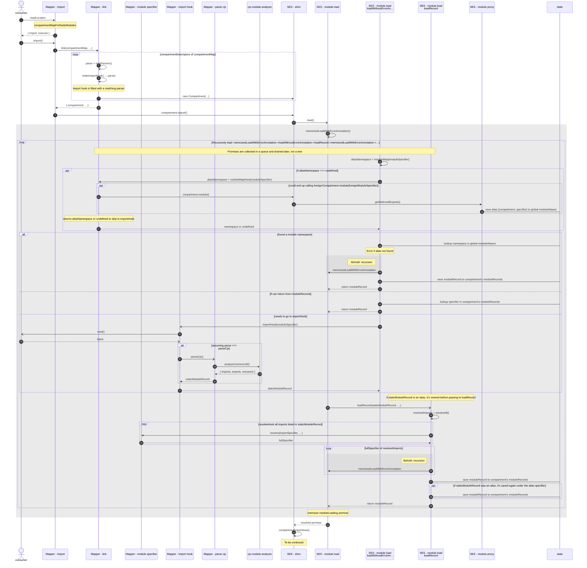

# A mental model of compartment mapper

```mermaid
sequenceDiagram
    autonumber

    actor consumer

    participant cm_import as Mapper - import
    link cm_import: import.js @ https://github.com/endojs/endo/blob/master/packages/compartment-mapper/src/import.js
    participant cm_link as Mapper - link
    link cm_link: link.js @ https://github.com/endojs/endo/blob/master/packages/compartment-mapper/src/link.js
    participant cm_spec as Mapper - module specifier
    link cm_spec: node-module-specifier.js @ https://github.com/endojs/endo/blob/master/packages/compartment-mapper/src/node-module-specifier.js
    participant cm_hook as Mapper - import hook
    link cm_hook: import-hook.js @ https://github.com/endojs/endo/blob/master/packages/compartment-mapper/src/import-hook.js
    participant cm_cjs as Mapper - parse cjs
    link cm_cjs: parse-cjs.js @ https://github.com/endojs/endo/blob/master/packages/compartment-mapper/src/parse-cjs.js
    
    participant cjsma as cjs-module-analyzer
    link cjsma: index.js @ https://github.com/endojs/endo/blob/master/packages/cjs-module-analyzer/index.js


    participant ses_shim as SES - shim
    link ses_shim: compartment-shim.js @ https://github.com/endojs/endo/blob/master/packages/ses/src/compartment-shim.js 
    participant ses_m_load as SES - module load
    link ses_m_load: module-load.js @ https://github.com/endojs/endo/blob/master/packages/ses/src/module-load.js 
    participant ses_m_load_lwe as SES - module load <br>loadWithoutErrorAn...
    link ses_m_load_lwe: module-load.js @ https://github.com/endojs/endo/blob/master/packages/ses/src/module-load.js 
    participant ses_m_load_re as SES - module load <br>loadRecord
    link ses_m_load_re: module-load.js @ https://github.com/endojs/endo/blob/master/packages/ses/src/module-load.js 
    %% participant ses_m_link as SES - module link
    %% link ses_m_link: module-link.js @ https://github.com/endojs/endo/blob/master/packages/ses/src/module-link.js 
    %% participant ses_m_instance as SES - module instance
    %% link ses_m_instance: module-instance.js @ https://github.com/endojs/endo/blob/master/packages/ses/src/module-instance.js 
    participant ses_m_proxy as SES - module proxy
    link ses_m_proxy: module-proxy.js @ https://github.com/endojs/endo/blob/master/packages/ses/src/module-proxy.js 

    participant weakmaps as state

    consumer ->> cm_import: loadLocation
    note over cm_import: compartmentMapForNodeModules
    cm_import -->> consumer: { import: execute }
    consumer ->> cm_import: import()
    cm_import ->> cm_link: link(compartmentMap, …)
    loop compartmentDescriptors of compartmentMap 
      cm_link ->> cm_link: parse = mapParsers()
      cm_link ->> cm_link: makeImportHook(…, parse)
      note over cm_link: import hook is fitted with a matching parser
      cm_link ->> ses_shim: new Compartment(…)
    end
    cm_link -->> cm_import: { compartment, …}

    cm_import ->> ses_shim: compartment.import()
    ses_shim -) ses_m_load: load() 
    rect rgb(234, 234, 234)
      ses_m_load -) ses_m_load: memoizedLoadWithErrorAnnotation()
      loop Recursively load: memoizedLoadWithErrorAnnotation->loadWithoutErrorAnnotation->loadRecord->memoizedLoadWithErrorAnnotation->…
        note over ses_m_load_re,cm_link: Promises are collected in a queue and drained later, not a tree
          ses_m_load_lwe ->> ses_m_load_lwe: aliasNamespace = moduleMap[moduleSpecifier]
          opt if aliasNamespace === undefined
            ses_m_load_lwe ->> cm_link: aliasNamespace = moduleMapHook(moduleSpecifier)
            opt could end up calling foreignCompartment.module(foreignModuleSpecifier);
              cm_link ->> ses_shim: conpartment.module()
              ses_shim ->> ses_m_proxy: getDeferredExports()
              ses_m_proxy -> weakmaps: save alias {compartment, specifier} to global moduleAliases
            end
            note over cm_link: returns aliasNamespace or undefined to skip to importHook
            cm_link -->> ses_m_load_lwe: namespace or undefined
          end
        alt found a module namespace
          ses_m_load_lwe -> weakmaps: lookup namespace in global moduleAliases
          note over ses_m_load_lwe: Error if alias not found
          rect rgb(222,222,222)
            note left of ses_m_load_lwe: Behold: recursion
            ses_m_load_lwe ->> ses_m_load: memoizedLoadWithErrorAnnotation
          end
          ses_m_load_lwe -> weakmaps: save moduleRecord to compartment's moduleRecords
          ses_m_load_lwe --) ses_m_load: return moduleRecord
        else if can return from moduleRecords
          ses_m_load_lwe -> weakmaps: lookup specifier in compartment's moduleRecords
          ses_m_load_lwe --) ses_m_load: return moduleRecord
        else needs to go to importHook
          ses_m_load_lwe -) cm_hook: importHook(moduleSpecifier)
          cm_hook -) consumer: read()
          consumer --) cm_hook: bytes
          alt assuming parse === parseCjs
              cm_hook -) cm_cjs: parseCjs()
              cm_cjs ->> cjsma: analyzeCommonJS()
              cjsma -->> cm_cjs: { imports, exports, reexports }
              cm_cjs -->> cm_hook: staticModuleRecord
          end
          cm_hook -->> ses_m_load_lwe: staticModuleRecord
        end
        note over ses_m_load_re: if staticModuleRecord is an alias, it's rewired before passing to loadRecord
        ses_m_load -) ses_m_load_re: loadRecord(staticModuleRecord, …)
        ses_m_load_re ->> ses_m_load_re: resolvedImports = resolveAll()
        loop resolveHook all imports listed in staticModuleRecord 
          ses_m_load_re ->> cm_spec: resolve(importSpecifier, …)
          cm_spec -->> ses_m_load_re: fullSpecifier
        end
        loop fullSpecifier of resolvedImports
          rect rgb(222,222,222)
            note left of ses_m_load_re: Behold: recursion
            ses_m_load_re ->> ses_m_load: memoizedLoadWithErrorAnnotation
          end
        end
        ses_m_load_re -> weakmaps: save moduleRecord to compartment's moduleRecords
        opt if staticModuleRecord was an alias, it's saved again under the alias specifier
          ses_m_load_re -> weakmaps: save moduleRecord to compartment's moduleRecords
        end
        ses_m_load_re --) ses_m_load: return moduleRecord
      end
      note over ses_m_load: memoize moduleLoading promise
    end
    ses_m_load --) ses_shim: resolved promise
    ses_shim ->> ses_shim: compartmentImportNow()
    note over ses_shim: To be continued
```