# Compartment Mapper Architecture

This document provides a comprehensive technical analysis of `@endo/compartment-mapper`, a package that enables secure, sandboxed execution of Node.js-style applications using the SES (Secure ECMAScript) `Compartment` abstraction.

## Table of Contents

1. [Overview](#overview)
2. [Core Concepts](#core-concepts)
3. [Package Exports](#package-exports)
4. [Execution Workflows](#execution-workflows)
5. [Compartment Map Structure](#compartment-map-structure)
6. [Module System](#module-system)
7. [Key Components](#key-components)
8. [Data Flow Diagrams](#data-flow-diagrams)
9. [Policy Support](#policy-support)
10. [SES Integration: Module Loading & Execution](#ses-integration-module-loading--execution)

---

## Overview

The **Compartment Mapper** is a build tool and runtime that:

1. **Discovers** package dependencies by traversing `node_modules` directories
2. **Constructs** a _compartment map_ describing how to isolate each package in its own `Compartment`
3. **Links** compartments together, allowing controlled module sharing
4. **Executes** or **archives** applications in a sandboxed environment

This enables the _Principle of Least Authority (POLA)_: each package runs with only the capabilities explicitly granted to it, mitigating prototype pollution and supply chain attacks.

### What is a Compartment?

A **Compartment** (from the SES proposal) is an isolated JavaScript execution environment with:

- Its own `globalThis` object
- Its own module namespace
- Shared frozen intrinsics (like `Array`, `Object`) with other compartments
- No ambient authority by default (no `fetch`, `fs`, etc.)

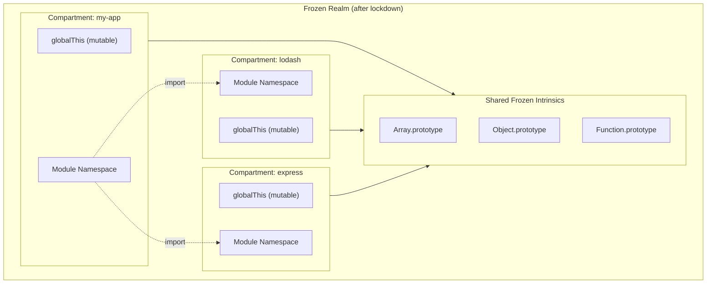

---

## Core Concepts

### Compartment Map

A **compartment map** is a JSON manifest describing:

- **Entry point**: The starting compartment and module
- **Compartments**: One per package, with its location, module mappings, and parsers
- **Module links**: How modules from one compartment are exposed to another
- **Scopes**: Fallback rules for resolving unspecified imports

### Languages/Parsers

The mapper supports multiple module languages:

| Language       | Description                            |
| -------------- | -------------------------------------- |
| `mjs`          | ECMAScript Modules (ESM)               |
| `cjs`          | CommonJS modules                       |
| `json`         | JSON modules                           |
| `text`         | UTF-8 text files (export as `default`) |
| `bytes`        | Binary files (export as `Uint8Array`)  |
| `pre-mjs-json` | Pre-compiled ESM (for archives)        |
| `pre-cjs-json` | Pre-compiled CJS (for archives)        |

**Custom Parsers:** Applications can define custom parsers for additional languages via `moduleTransforms` or `parserForLanguage`. For example, a "node-native" parser could interpret the `bytes` language as a Node.js native addon (`.node` files), enabling controlled loading of native extensions within the compartment system.

### Powers

The compartment mapper accepts "powers" that abstract filesystem operations:

```typescript
type ReadPowers = {
  read: (location: string) => Promise<Uint8Array>;
  canonical: (location: string) => Promise<string>;
  computeSha512?: (bytes: Uint8Array) => string;
  fileURLToPath?: (location: string | URL) => string;
  pathToFileURL?: (path: string) => URL;
  requireResolve?: (from: string, specifier: string, options?) => string;
};
```

---

## Package Exports

The package exposes multiple entry points via `package.json` `exports`:

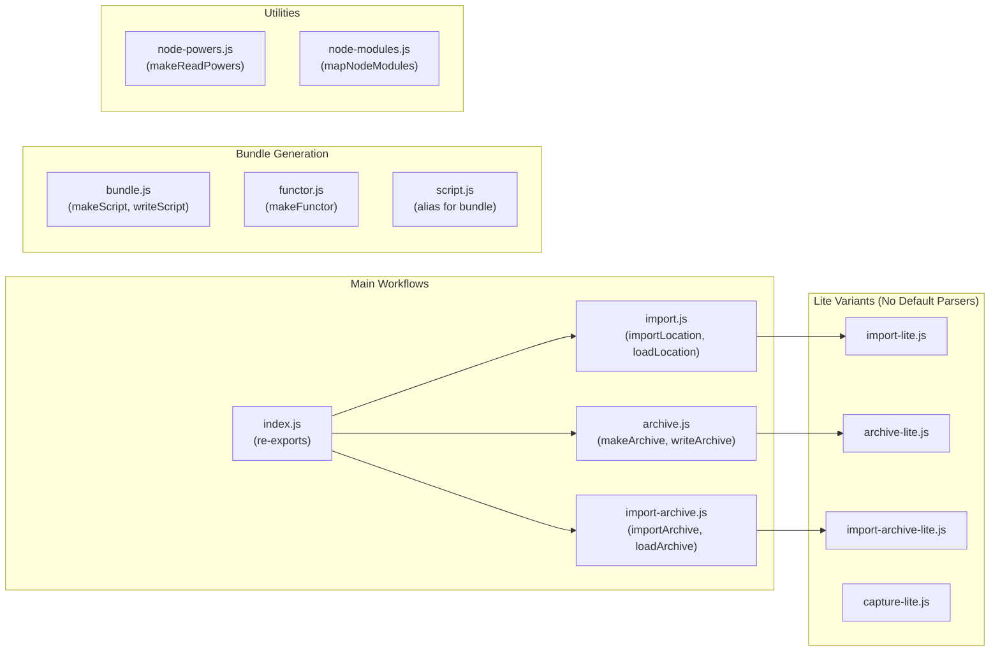

### Entry Point Summary

| Entry Point              | Purpose                                       |
| ------------------------ | --------------------------------------------- |
| `index.js`               | Main entry, re-exports common functions       |
| `import.js`              | Load and execute from filesystem              |
| `import-lite.js`         | Same, but requires explicit parsers           |
| `archive.js`             | Create zip archives of applications           |
| `archive-lite.js`        | Same, but requires explicit parsers           |
| `import-archive.js`      | Execute from zip archives                     |
| `import-archive-lite.js` | Same, but requires explicit parsers           |
| `bundle.js`              | Generate self-contained JavaScript bundles    |
| `functor.js`             | Generate bundles as callable functors         |
| `script.js`              | Alias for `bundle.js`                         |
| `node-powers.js`         | Create `ReadPowers` from Node.js `fs`         |
| `node-modules.js`        | Generate compartment maps from `node_modules` |

---

## Execution Workflows

The compartment mapper supports several workflows, each building on shared internals:

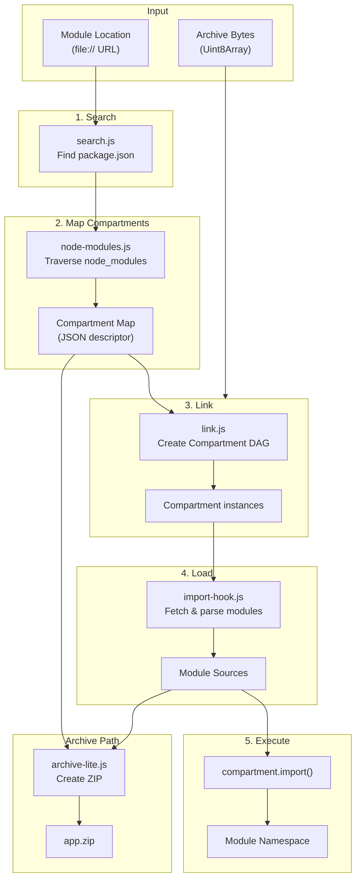

### Workflow: `importLocation`

Load and execute an application directly from the filesystem:

```javascript
import { importLocation } from '@endo/compartment-mapper';

const { namespace } = await importLocation(read, moduleLocation, {
  globals: { console },
  modules: { fs },
});
```

**Execution flow:**

1. `search()` - Find the nearest `package.json`
2. `mapNodeModules()` - Build compartment map from `node_modules`
3. `loadFromMap()` - Link compartments
4. `compartment.import()` - Execute entry module

### Workflow: `writeArchive` / `importArchive`

Create a portable archive for deployment:

```javascript
import { writeArchive, importArchive } from '@endo/compartment-mapper';

// Create archive
await writeArchive(write, read, 'app.zip', moduleLocation);

// Later, execute from archive
const { namespace } = await importArchive(read, 'app.zip', {
  globals: { console },
});
```

**Archive structure:**

```
app.zip
├── compartment-map.json    # Manifest
├── my-app-v1.0.0/         # Compartment directory
│   ├── index.js           # Module file
│   └── utils.js
├── lodash-v4.17.21/
│   └── lodash.js
└── ...
```

### Workflow: `makeScript`

Generate a self-contained JavaScript bundle:

```javascript
import { makeScript } from '@endo/compartment-mapper/script.js';

const script = await makeScript(readPowers, moduleLocation, {
  sourceUrlPrefix: 'bundle/',
});

// Evaluate in any environment
const namespace = eval(script);
```

---

## Compartment Map Structure

A compartment map is a JSON object describing the application topology. The base types are `CompartmentMapDescriptor` and `CompartmentDescriptor`, with specialized sub-types for different stages of the pipeline:

### Compartment Map Variants

| Type                               | Produced By              | Consumed By                                                              | Purpose                                            |
| ---------------------------------- | ------------------------ | ------------------------------------------------------------------------ | -------------------------------------------------- |
| `PackageCompartmentMapDescriptor`  | `mapNodeModules()`       | `link()`, `bundle()`, `capture()`, `archive()`, `digestCompartmentMap()` | Full package metadata from filesystem traversal    |
| `FileCompartmentMapDescriptor`     | Archive extraction       | `link()`                                                                 | Simplified structure for archive loading           |
| `DigestedCompartmentMapDescriptor` | `digestCompartmentMap()` | Archive storage                                                          | Minimal structure with content hashes for archives |

The most common flow is:


### Base Structure

```typescript
type CompartmentMapDescriptor = {
  tags: string[]; // Build conditions (e.g., "import", "browser")
  entry: {
    compartment: string; // Entry compartment name
    module: string; // Entry module specifier
  };
  compartments: Record<string, CompartmentDescriptor>;
};

type CompartmentDescriptor = {
  name: string; // Package name
  label: string; // Display label (e.g., "lodash-v4.17.21")
  location: string; // Base URL for modules
  modules: Record<string, ModuleDescriptor>;
  scopes: Record<string, ScopeDescriptor>;
  parsers: Record<string, string>; // Extension → language
  types: Record<string, string>; // Specifier → language override
  policy?: PackagePolicy; // Security policy
};
```

`PackageCompartmentDescriptor` extends `CompartmentDescriptor` with additional fields like `version` and `sourceDirname`. `DigestedCompartmentDescriptor` strips out transient fields (`scopes`, `parsers`, `types`, `retained`) that aren't needed after archival.

### Module Configurations

Module configurations describe how to resolve a module specifier. The `ModuleConfiguration` union type includes four variants:

| Type                             | Key Field               | Purpose                                                 | Created By                          |
| -------------------------------- | ----------------------- | ------------------------------------------------------- | ----------------------------------- |
| `CompartmentModuleConfiguration` | `compartment`, `module` | Redirect to a module in another compartment             | `mapNodeModules()`, `moduleMapHook` |
| `FileModuleConfiguration`        | `location`, `parser`    | Reference a file within the compartment                 | `importHook`, `digest`              |
| `ExitModuleConfiguration`        | `exit`                  | Reference a built-in/exit module (e.g., `fs`, `crypto`) | `mapNodeModules()`                  |
| `ErrorModuleConfiguration`       | `deferredError`         | Defer an error until the module is actually imported    | `mapNodeModules()`                  |

All configurations extend `BaseModuleConfiguration`:

```typescript
interface BaseModuleConfiguration {
  deferredError?: string; // Error message to throw on import
  retained?: true; // Whether this module was actually used
  __createdBy?: string; // Debug: which stage created this config
}
```

**Configuration examples:**

```typescript
// Redirect to another compartment's module
const compartmentConfig: CompartmentModuleConfiguration = {
  compartment: 'file:///project/node_modules/lodash/',
  module: './lodash.js',
};

// Reference a file (used in archives)
const fileConfig: FileModuleConfiguration = {
  location: './src/utils.js',
  parser: 'mjs',
  sha512: 'abc123...', // Content hash for integrity
};

// Exit module (built-in or provided by host)
const exitConfig: ExitModuleConfiguration = {
  exit: 'fs',
};

// Deferred error (e.g., missing optional dependency)
const errorConfig: ErrorModuleConfiguration = {
  deferredError: "Cannot find module 'optional-dep'",
};
```

### Example Compartment Map

```json
{
  "tags": ["import", "endo"],
  "entry": {
    "compartment": "file:///project/",
    "module": "./src/index.js"
  },
  "compartments": {
    "file:///project/": {
      "name": "my-app",
      "label": "$root$",
      "location": "file:///project/",
      "modules": {
        "lodash": {
          "compartment": "file:///project/node_modules/lodash/",
          "module": "./lodash.js"
        }
      },
      "scopes": {
        "lodash": {
          "compartment": "file:///project/node_modules/lodash/"
        }
      },
      "parsers": {
        "js": "mjs",
        "json": "json"
      }
    },
    "file:///project/node_modules/lodash/": {
      "name": "lodash",
      "label": "lodash-v4.17.21",
      "location": "file:///project/node_modules/lodash/",
      "modules": {},
      "scopes": {},
      "parsers": {
        "js": "cjs",
        "json": "json"
      }
    }
  }
}
```

---

## Module System

### Parser Pipeline

Each parser transforms source bytes into a module record:

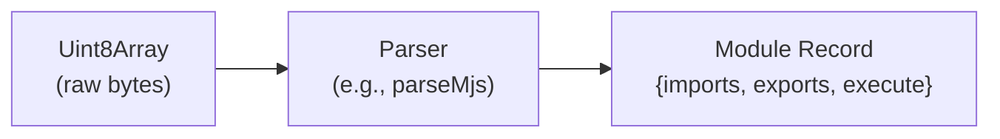

### ESM Parser (`parse-mjs.js`)

```javascript
const parseMjs = (bytes, specifier, sourceUrl, packageLocation, options) => {
  const source = textDecoder.decode(bytes);
  const record = new ModuleSource(source, { sourceUrl });
  return { parser: 'mjs', bytes, record };
};
```

The `ModuleSource` constructor (from `@endo/module-source`) analyzes the source code and produces a record with:

- `imports`: Array of imported specifiers
- `exports`: Array of exported names
- `__syncModuleProgram__`: Transformed source for evaluation

### CJS Parser (`parse-cjs.js`)

```javascript
const parseCjs = (bytes, specifier, location, packageLocation, options) => {
  const source = textDecoder.decode(bytes);
  const { requires, exports, reexports } = analyzeCommonJS(source, location);

  const execute = (env, compartment, resolvedImports) => {
    const functor = compartment.evaluate(
      `(function (require, exports, module, __filename, __dirname) { ${source} })`,
    );
    functor.call(
      moduleExports,
      require,
      moduleExports,
      module,
      filename,
      dirname,
    );
  };

  return { parser: 'cjs', bytes, record: { imports, exports, execute } };
};
```

CJS parsing uses `@endo/cjs-module-analyzer` to statically analyze `require()` calls, then wraps the source in a functor for later execution.

### Heuristic Imports

CJS modules have `heuristicImports: true` because `require()` calls are detected statically but may be:

- Conditionally executed
- Dynamic (computed specifiers)
- Shadowed by local `require` bindings

When heuristic imports fail to resolve, errors are _deferred_ until execution rather than thrown immediately.

---

## Key Components

### `node-modules.js` - Compartment Map Generation

This module traverses `node_modules` to build a compartment map:

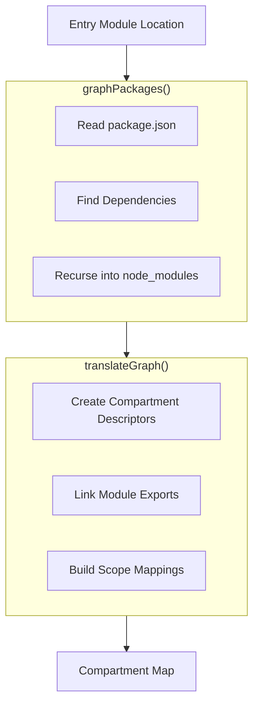

Key functions:

- `mapNodeModules(readPowers, moduleLocation, options)` - Main entry point
- `graphPackages()` - Build dependency graph by reading `package.json` files
- `translateGraph()` - Convert graph to compartment map format
- `findPackage()` - Locate packages in `node_modules` directories

### `link.js` - Compartment Assembly

Creates the compartment DAG from a compartment map:

```javascript
const { compartment, compartments, pendingJobsPromise } = link(compartmentMap, {
  makeImportHook,
  parserForLanguage,
  globals,
  modules,
  transforms,
});
```

For each compartment descriptor:

1. Create a `Compartment` instance
2. Configure `resolveHook` for module resolution
3. Configure `importHook` for loading modules
4. Configure `moduleMapHook` for cross-compartment links
5. Attenuate globals per policy

### `import-hook.js` - Module Loading

Provides `importHook` implementations for loading modules:

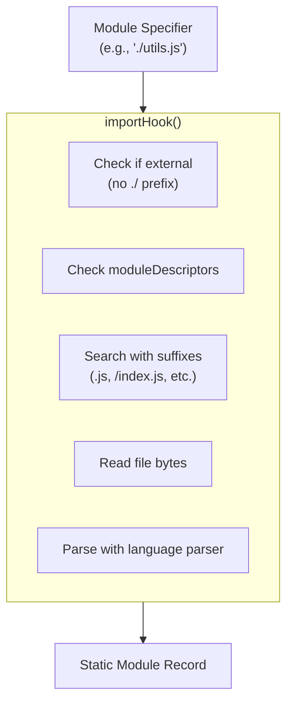

The import hook:

1. Handles exit modules (built-ins) via `exitModuleImportHook`
2. Resolves module specifiers using Node.js conventions (adding `.js`, `/index.js`)
3. Reads module bytes from the filesystem
4. Parses using the appropriate language parser
5. Records sources for archival

### `bundle.js` - Script Generation

Generates self-contained JavaScript bundles:

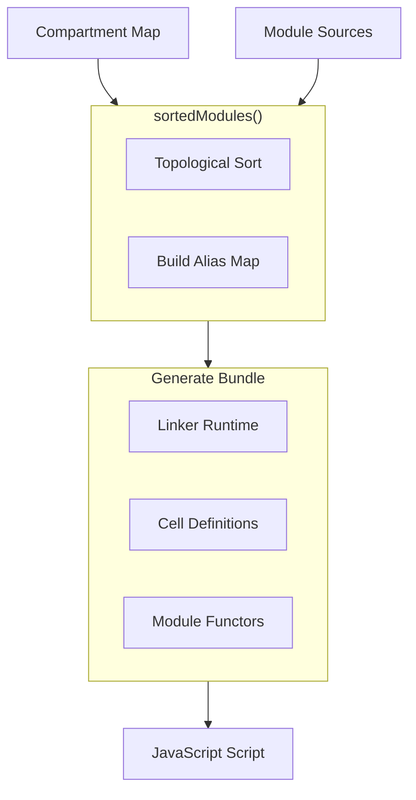

Bundle structure:

```javascript
(linkerRuntime => options => {
  // Cell allocation for module exports
  const cells = [
    /* ... */
  ];

  // Module namespace proxies
  const namespaces = cells.map(c => Object.create(null, c));

  // Execute modules in topological order
  functors[0](cells[0] /* imports */);
  functors[1](cells[1] /* imports */);

  return cells[cells.length - 1]['*'].get();
})([
  // Module functors
  function () {
    /* module 0 source */
  },
  function () {
    /* module 1 source */
  },
])();
```

---

## Data Flow Diagrams

### Complete `importLocation` Flow

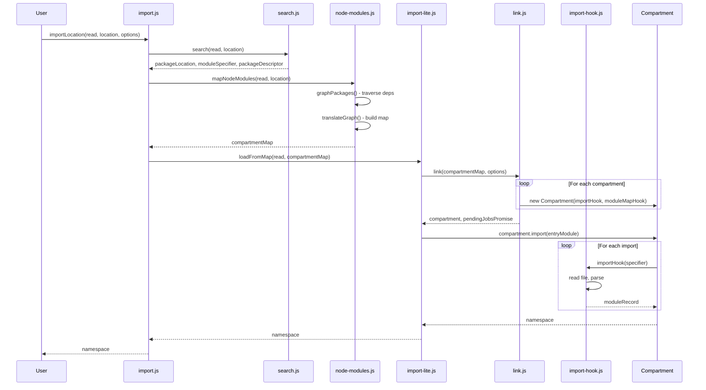

### Archive Creation and Execution

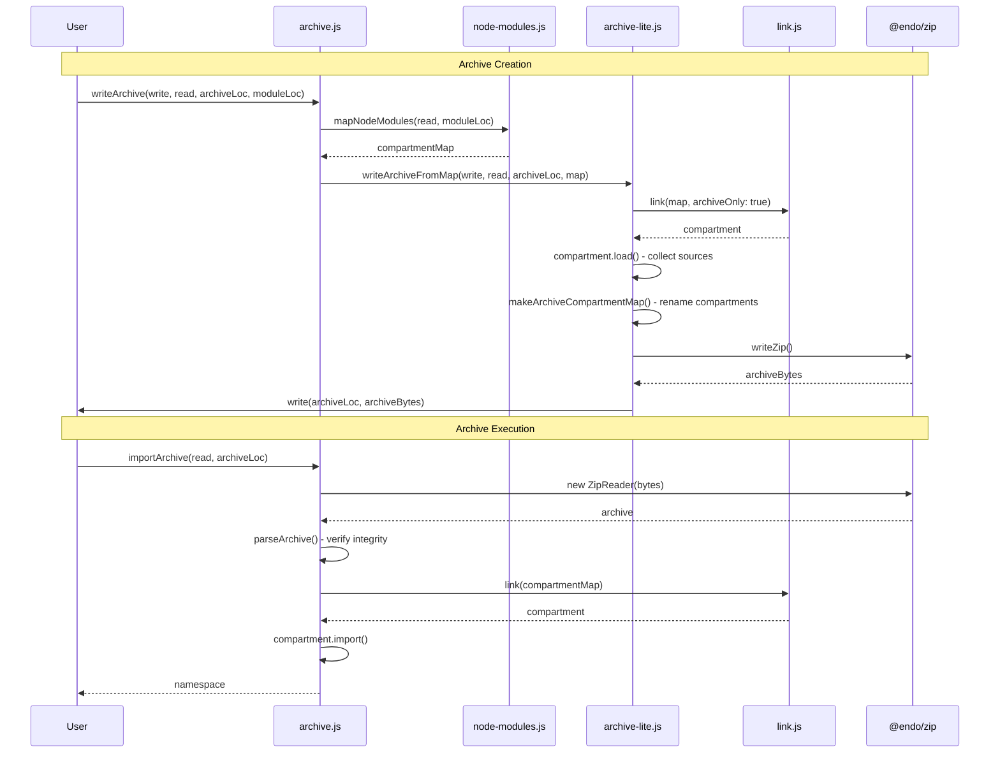

---

## Policy Support

The compartment mapper supports security policies (compatible with LavaMoat):

```json
{
  "resources": {
    "lodash": {
      "globals": {
        "console": true
      },
      "packages": {
        "lodash.isequal": true
      }
    }
  }
}
```

Policies enable:

- **Global attenuation**: Limit which globals a package can access
- **Package access control**: Limit which dependencies are visible
- **Module attenuation**: Transform module exports before exposure

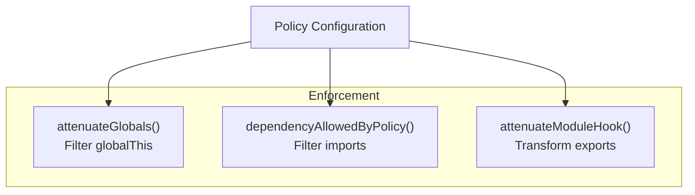

---

## SES Integration: Module Loading & Execution

This section details the control flow between `@endo/compartment-mapper` and `ses` when loading and executing modules. Understanding this interaction is crucial for debugging module loading issues and extending the compartment mapper.

### Overview: The Three Phases

Module execution occurs in three distinct phases:

```mermaid
%%{init: {"fontFamily": "monospace"}}%%
flowchart LR
    subgraph Phase1["1. Load Phase (async)"]
        direction TB
        loadA["Fetch module sources"]
        loadB["Parse to module records"]
        loadC["Recursively load dependencies"]
    end

    subgraph Phase2["2. Link Phase (sync)"]
        direction TB
        linkA["Instantiate modules"]
        linkB["Wire up imports/exports"]
        linkC["Create module instances"]
    end

    subgraph Phase3["3. Execute Phase (sync)"]
        direction TB
        execA["Apply transforms"]
        execB["Evaluate module code"]
        execC["Populate exports"]
    end

    Phase1 --> Phase2 --> Phase3
```

### `compartment.import()` Flow

When you call `compartment.import(specifier)`, control flows between compartment-mapper and SES:

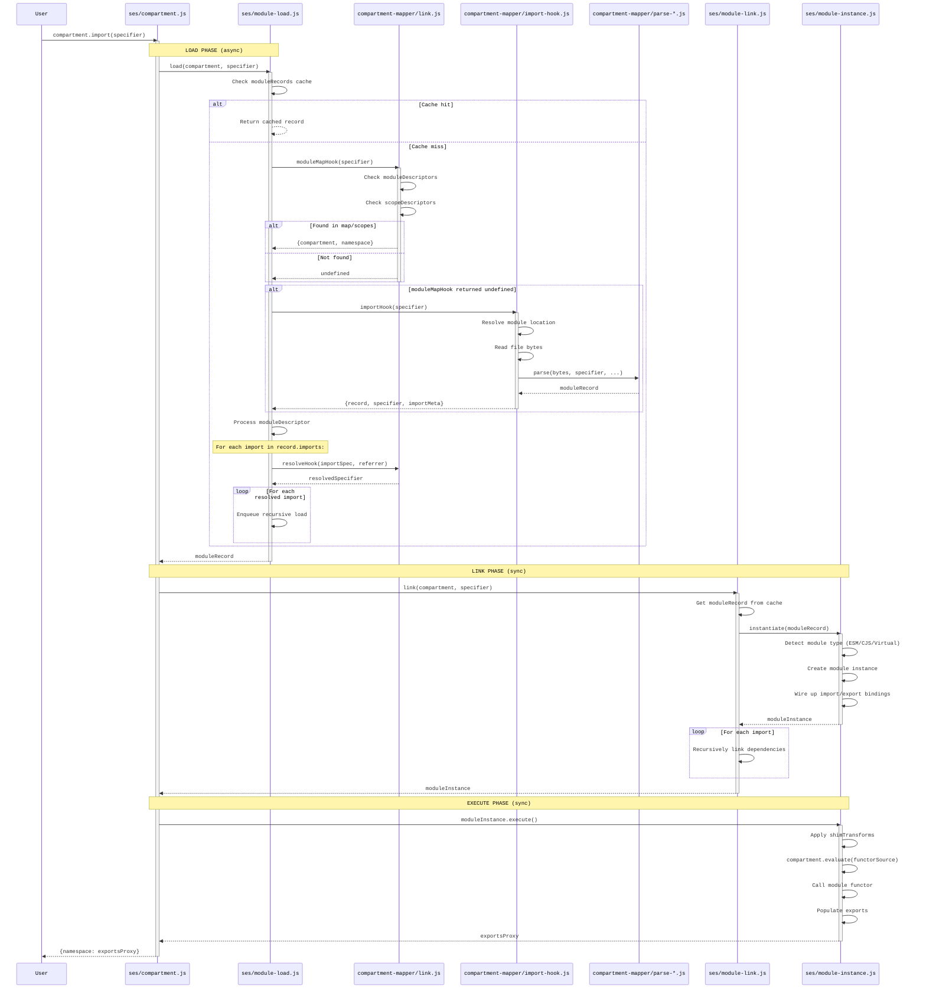

### `compartment.load()` Flow

The `load()` method performs only the Load phase, without linking or executing:

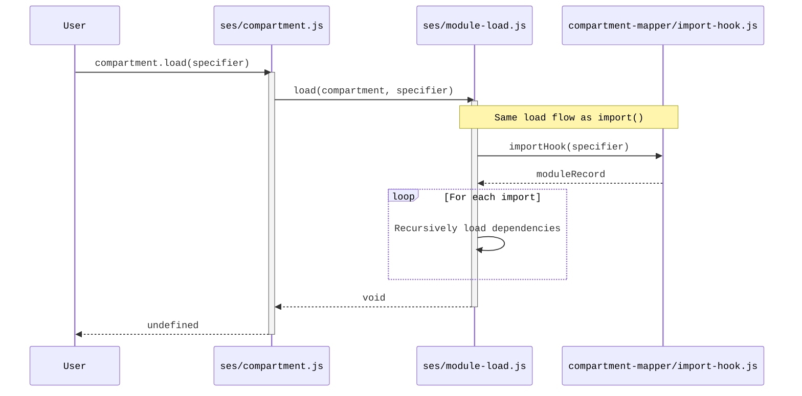

This is useful for:

- Pre-loading modules before execution
- Archive creation (collecting sources without executing)
- Validating that all dependencies can be resolved

### Hook Invocation Details

The compartment-mapper provides four hooks to SES via `link.js`:

#### 1. `resolveHook(importSpecifier, referrerSpecifier) → fullSpecifier`

**Purpose:** Resolve relative import specifiers to absolute specifiers.

**When called:** During the Load phase, for each `import` statement in a module.

**Implementation:** Provided by `node-module-specifier.js`, handles Node.js resolution conventions.

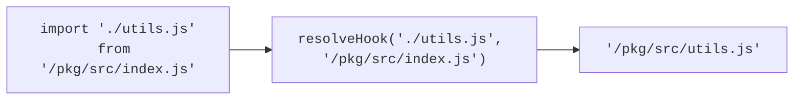

#### 2. `moduleMapHook(moduleSpecifier) → ModuleDescriptor | undefined`

**Purpose:** Redirect imports to different compartments or modules based on the compartment map.

**When called:** During the Load phase, before `importHook`, for each module specifier.

**Implementation:** Created by `makeModuleMapHook()` in `link.js`.

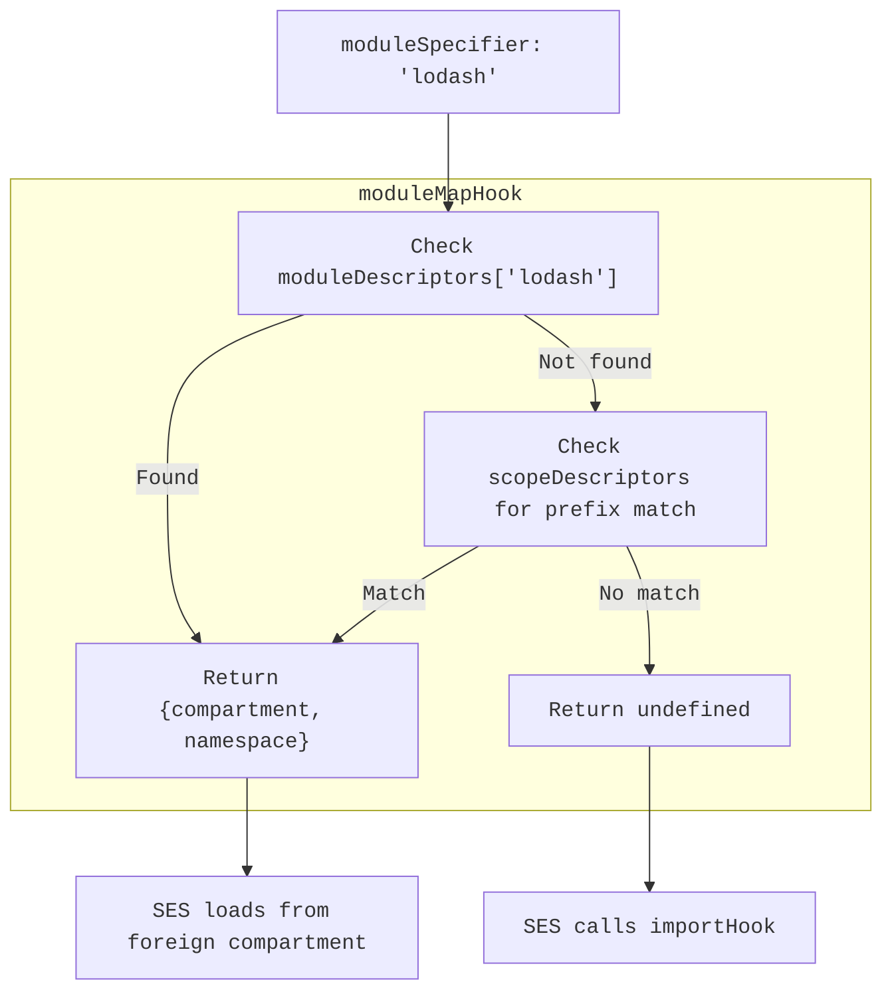

**Key behaviors:**

- Checks `moduleDescriptors` first (explicit mappings)
- Falls back to `scopeDescriptors` (prefix-based redirects)
- Returns `undefined` to fall through to `importHook`
- **Side effect:** Writes discovered mappings back to `moduleDescriptors` for archival

#### 3. `importHook(moduleSpecifier) → Promise<ModuleDescriptor>`

**Purpose:** Load module source code from the filesystem or other source.

**When called:** During the Load phase, when `moduleMapHook` returns `undefined`.

**Implementation:** Created by `makeImportHook()` in `import-hook.js`.

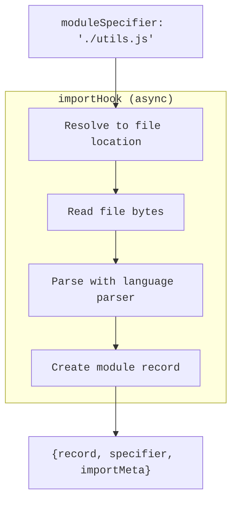

**The returned descriptor can be:**

- `{record: ModuleSource}` - Pre-parsed module
- `{source: string}` - Source code to parse
- `{namespace: string}` - Re-export from same compartment
- `{compartment, namespace}` - Re-export from different compartment

#### 4. `importNowHook(moduleSpecifier) → ModuleDescriptor`

**Purpose:** Synchronous variant of `importHook` that enables dynamic `require()` calls in CJS modules.

**When called:** During synchronous import operations triggered by CJS `require()` at runtime.

**Implementation:** Created by `makeImportNowHook()` in `import-hook.js`.

### `importHook` vs `importNowHook`: Key Differences

The two hooks serve fundamentally different use cases:

| Aspect                 | `importHook`            | `importNowHook`                                                      |
| ---------------------- | ----------------------- | -------------------------------------------------------------------- |
| **Synchronicity**      | Async (returns Promise) | Sync (returns directly)                                              |
| **Primary Use**        | ESM `import` statements | CJS `require()` calls                                                |
| **Absolute Paths**     | Not supported           | Supported via `findRedirect()`                                       |
| **Required Powers**    | `ReadPowers`            | `ReadNowPowers` (adds `maybeReadNow`, `isAbsolute`, `fileURLToPath`) |
| **Parser Requirement** | Any parser              | Must have `isSyncParser` flag                                        |
| **Async Transforms**   | Supported               | Not supported                                                        |

#### When `importNowHook` is Created

`importNowHook` is **only created** when all these conditions are met:

1. `ReadNowPowers` are provided (synchronous filesystem access)
2. All parsers are synchronous (`isSyncParser` flag present)
3. No asynchronous module transforms are configured

If these conditions aren't met, `importNowHook` throws an error:

```javascript
throw new Error(
  'Dynamic requires are only possible with synchronous parsers ' +
    'and no asynchronous module transforms in options',
);
```

#### Why `importNowHook` Matters for CJS

CommonJS modules frequently use dynamic paths with `require()`:

```javascript
const path = require('path');
const configPath = path.resolve('./config.json');
const config = require(configPath); // Absolute path!
```

Only `importNowHook` can handle this because:

1. **It's synchronous** - `require()` is blocking and cannot await
2. **It handles absolute paths** - Uses `findRedirect()` to search up the directory tree and find which compartment owns the absolute path

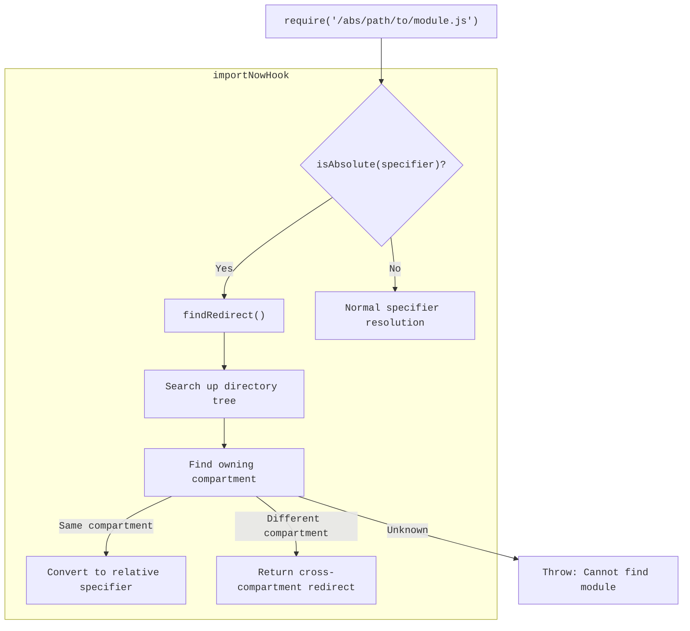

#### Hook Selection in SES

SES's `module-load.js` uses `selectImplementation()` to choose between hooks:

- **Async loading** (`load()`): Prefers `importHook`, falls back to `importNowHook`
- **Sync loading** (`loadNow()`): Prefers `importNowHook`, falls back to `importHook` (which will fail if called)

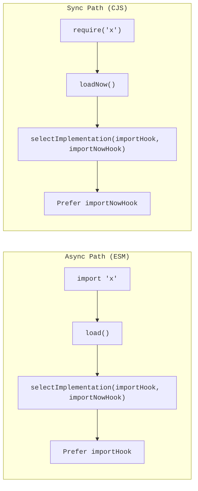

#### Error Handling Differences

Both hooks use deferred errors for heuristically-discovered imports (CJS `require` calls found by parser scanning):

- **Heuristic imports**: Error deferred until module execution
- **Strict imports** (ESM): Error thrown immediately

However, `importNowHook` has additional immediate error cases:

- Absolute path not within any known compartment → immediate error
- Absolute path traverses to filesystem root → immediate error
- Policy denies the import → immediate error

#### If Your Compartment Map Only Contains ESM

If all your modules are ES modules (no CJS), you don't need `importNowHook`:

- ESM `import` is always async, so `importHook` suffices
- No dynamic `require()` calls to handle
- You can use async parsers and transforms freely

The `importNowHook` is specifically for supporting the **synchronous, dynamic nature of CommonJS `require()`**.

### Hook Invocation Order

Within a single module load:

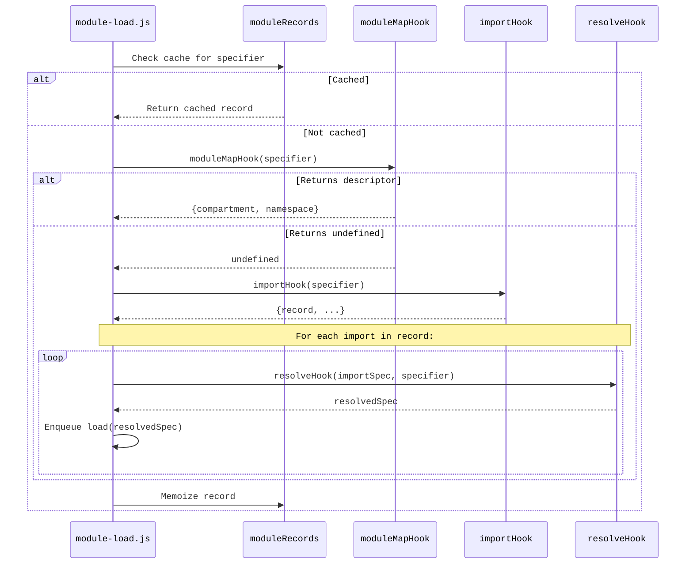

### Transform Application

Transforms modify source code before evaluation. They're applied during the Execute phase:

```mermaid
%%{init: {"fontFamily": "monospace"}}%%
flowchart TB
    subgraph "Transform Chain"
        source["Module source code"]
        local["localTransforms<br/>(per-evaluation)"]
        global["globalTransforms<br/>(compartment-wide)"]
        shim["shimTransforms<br/>(compartment-mapper specific)"]
        mandatory["mandatoryTransforms<br/>(SES security)"]
        final["Transformed source"]
    end

    source --> local --> global --> shim --> mandatory --> final

    subgraph "Mandatory (always last)"
        reject1["rejectHtmlComments()"]
        reject2["rejectImportExpressions()"]
    end

    mandatory --> reject1
    mandatory --> reject2
```

**Transform types in compartment-mapper:**

| Transform              | Set In           | Purpose                              |
| ---------------------- | ---------------- | ------------------------------------ |
| `transforms`           | `link()` options | General source transforms            |
| `__shimTransforms__`   | `link()` options | SES-specific module transforms       |
| `moduleTransforms`     | Parser options   | Language-specific transforms (async) |
| `syncModuleTransforms` | Parser options   | Language-specific transforms (sync)  |

**When transforms run:**

```mermaid
%%{init: {"fontFamily": "monospace"}}%%
sequenceDiagram
    participant Instance as module-instance.js
    participant Evaluator as safe-evaluator.js
    participant Transforms as transforms.js

    Instance->>Instance: Prepare functor source

    Instance->>Evaluator: compartment.evaluate(source, {transforms})

    Evaluator->>Transforms: applyTransforms(source, allTransforms)

    loop For each transform
        Transforms->>Transforms: transform(source) → source
    end

    Note over Transforms: Mandatory transforms applied LAST

    Transforms-->>Evaluator: transformedSource
    Evaluator->>Evaluator: eval(transformedSource)
    Evaluator-->>Instance: functor
```

### Module Types and Their Execution

SES handles different module types differently during instantiation:

```mermaid
%%{init: {"fontFamily": "monospace"}}%%
flowchart TB
    record["moduleRecord"]

    record --> check{"Check moduleSource type"}

    check -->|"has syncModuleProgram"| esm["ESM Module"]
    check -->|"has execute()"| virtual["Virtual Module"]
    check -->|"neither"| error["TypeError"]

    subgraph "ESM Execution"
        esm --> makeInst["makeModuleInstance()"]
        makeInst --> evalFunctor["Evaluate functor"]
        evalFunctor --> callFunctor["Call functor with imports/exports"]
    end

    subgraph "Virtual Execution"
        virtual --> makeVirtual["makeVirtualModuleInstance()"]
        makeVirtual --> callExecute["Call execute(exports, compartment, resolvedImports)"]
    end

    subgraph "CJS (via Virtual)"
        cjs["CJS Module"] --> wrapCjs["Wrap in execute()"]
        wrapCjs --> virtual
    end
```

### Complete Example: Loading a Module with Dependencies

```mermaid
%%{init: {"fontFamily": "monospace"}}%%
sequenceDiagram
    participant App
    participant SES
    participant CM as compartment-mapper

    App->>SES: compartment.import('./app.js')

    Note over SES,CM: Load ./app.js
    SES->>CM: moduleMapHook('./app.js')
    CM-->>SES: undefined
    SES->>CM: importHook('./app.js')
    CM-->>SES: {record: AppModule, imports: ['lodash']}

    Note over SES,CM: Resolve 'lodash' import
    SES->>CM: resolveHook('lodash', './app.js')
    CM-->>SES: 'lodash'

    Note over SES,CM: Load lodash
    SES->>CM: moduleMapHook('lodash')
    CM-->>SES: {compartment: lodashCompartment, namespace: '.'}

    Note over SES,CM: Load lodash in its compartment
    SES->>CM: [lodash compartment].importHook('.')
    CM-->>SES: {record: LodashModule}

    Note over SES: Link phase
    SES->>SES: instantiate(AppModule)
    SES->>SES: instantiate(LodashModule)
    SES->>SES: Wire lodash exports to app imports

    Note over SES: Execute phase
    SES->>SES: Execute LodashModule (dependency first)
    SES->>SES: Execute AppModule

    SES-->>App: {namespace: appExports}
```

---

## Summary

The Compartment Mapper provides a complete solution for:

1. **Discovery**: Automatic traversal of Node.js package structures
2. **Isolation**: Each package in its own `Compartment` sandbox
3. **Linking**: Controlled module sharing between compartments
4. **Portability**: Archives for deployment without filesystem access
5. **Security**: Policy-based capability attenuation

This enables defense-in-depth against supply chain attacks while maintaining compatibility with the Node.js ecosystem.
