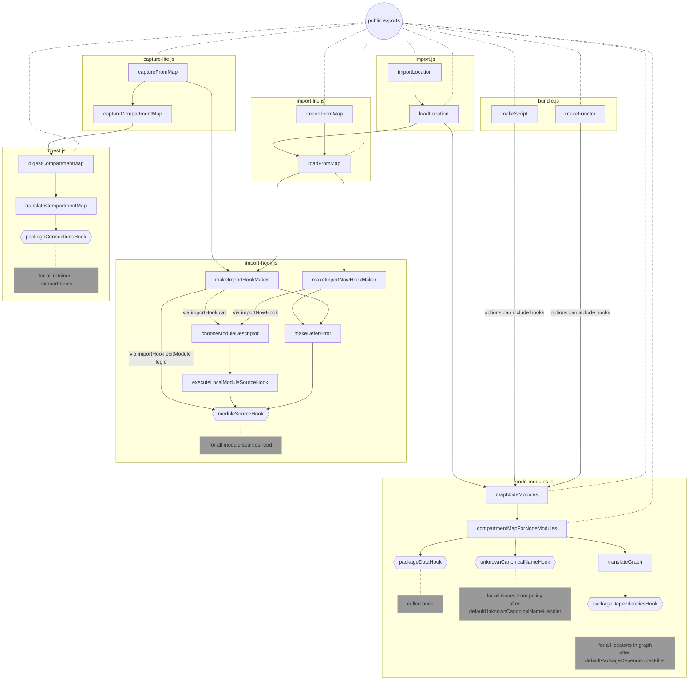
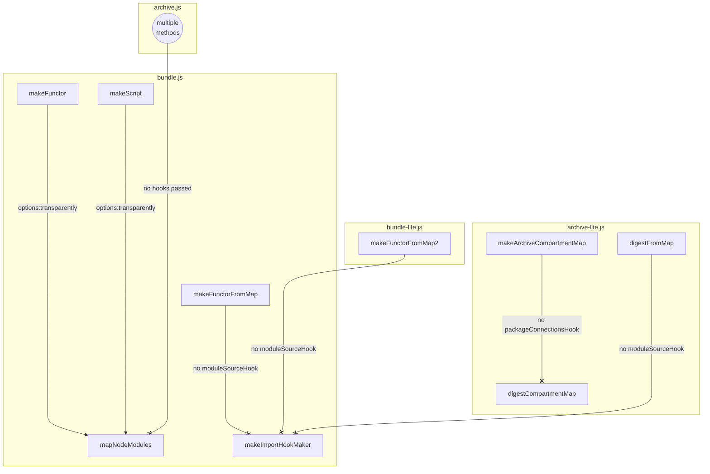

# Review of compartment-mapper hooks

| Hook Name                 | Description                                                                           |
|-------------------------- | --- |
| `packageDataHook`         | Receives all found package descriptors data before graph translation.                                   |
| `packageDependenciesHook` | Allows dynamic mutation of dependencies during node_modules graph translation.              |
| `unknownCanonicalNameHook`| Called when the policy references unknown canonical names, can suggest typos/similar names. |
| `moduleSourceHook`        | Invoked when a module source is created.                                             |
| `packageConnectionsHook`  | Surfaces connections during digest. (ignored in archiving)                                               |

[Type declarations for the hooks](./types/external.ts)

Bundle and Archive bits of the diagram that don't use hooks

These are calling the functions accepting hooks but don't pass them

> [TODO]
> copy-paste this to the main diagram whenever the connections are made.

