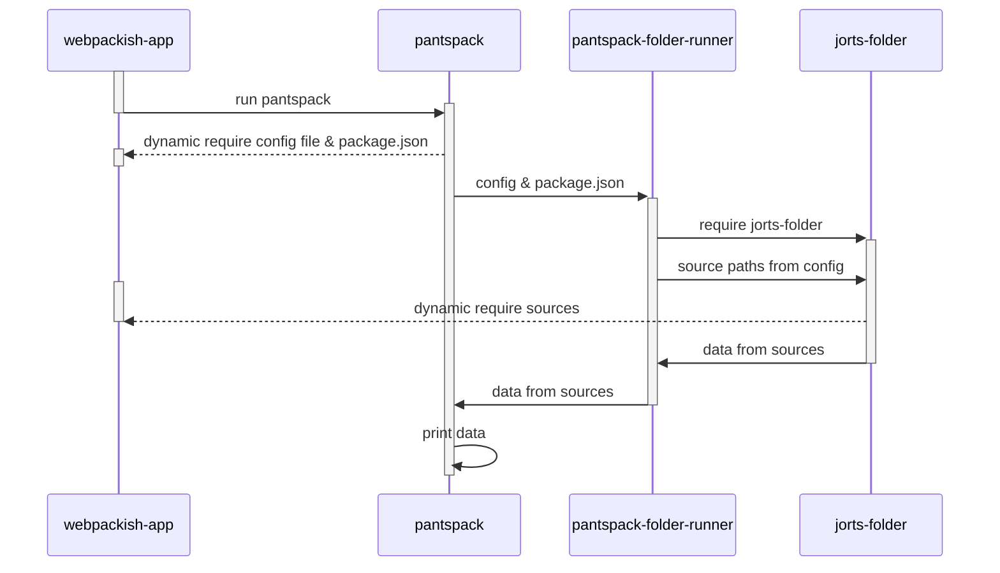

# fixtures-dynamic-ancestor

This is a fixture which approximates the dynamic requires used in `webpack`.

This sequence diagram approximates how this works:



The main "app" is `webpackish-app`, which contains a [`pantspack.config.js`](./node_modules/webpackish-app/pantspack.config.js) file. This file specifies the _name_ of a "folder", which is `jorts-folder`. `jorts-folder`  _is not_ loaded directly by `pantspack.config.js`.

`webpackish-app` uses `pantspack` to "build" itself.  Its `build` script:

```sh
node ../pantspack/pantspack.js --config pantspack.config.js
```

`pantspack` reads the `pantspack.config.js` file (and its nearest `package.json`) and hands this information off to `pantspack-folder-runner`.

`pantspack-folder-runner` sees `jorts-folder` mentioned and must dynamically require it. It then provides the necessary data to `jorts-folder`, which resolves and dynamically requires "source" `.jorts.js` files within `webpackish-app`.

The aim of this whole endeavor is to enable this: `webpackish-app` does not know anything about `pantspack-folder-runner` and does not actually require `jorts-folder` directly, yet its `Compartment` must allow `jorts-folder` to reach in to `webpackish-app` and dynamically require `.jorts.js` files.
