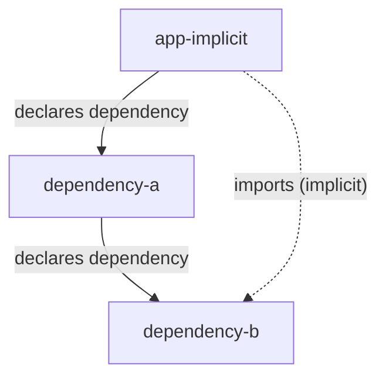

# fixtures-module-source-hook

Fixtures for testing the behavior of `moduleSourceHook` when called against various project configurations.

## `app-implicit` — Implicit (Transitive) Dependency

Tests what happens when a package imports a dependency it does _not_ directly declare in its own `package.json`—a transitive dependency that's only reachable through an intermediary.

`app-implicit` declares `dependency-a` as a direct dependency, and `dependency-a` in turn declares `dependency-b`. However, `app-implicit`'s `index.js` imports from `dependency-b` directly—a package it does not list in its own `dependencies`. In a flat `node_modules` layout (as used by these fixtures), `dependency-b` is resolvable despite not being a direct dependency.

The expectation is that `dependency-b` is loaded as an exit module from `app-implicit`.
