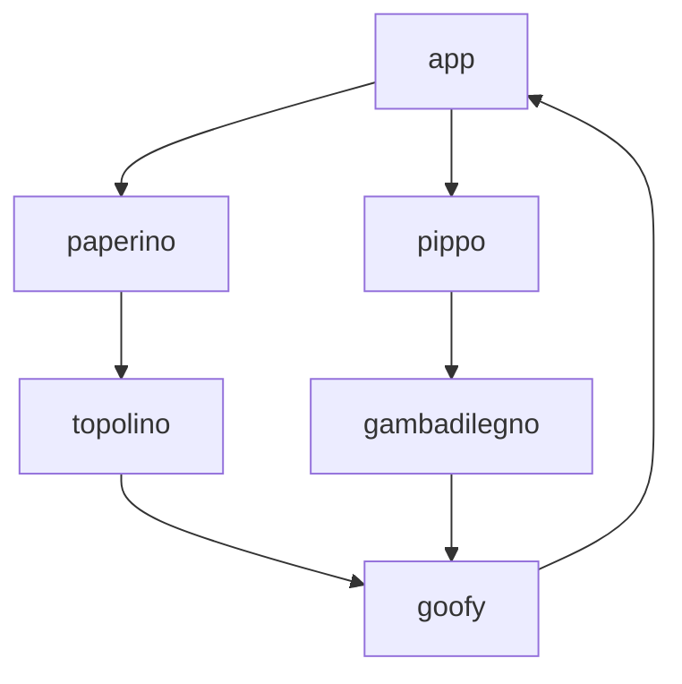

This is like [fixtures-shortest-path](../fixtures-shortest-path/README.md) but contains a cycle on the entry:

```mermaid
graph TD
    app --> paperino
    app --> pippo
    paperino --> topolino
    pippo --> gambadilegno
    topolino --> goofy
    gambadilegno --> goofy
    goofy --> app
```
