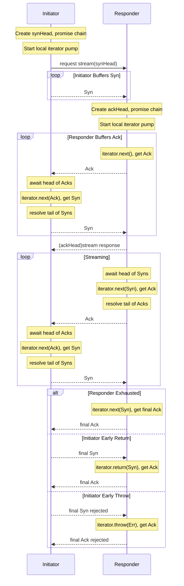

# Design Document for `@endo/exo-stream`

## Protocol Overview

The exo-stream protocol provides non-lossy streams of passable data, with control flow,
such that the producer does not overwhelm the consumer.

The exo-stream protocol uses bidirectional promise chains for streaming over CapTP.
By default, the protocol is fully synchronized and just as chatty as naive protocols,
suitable for deliberate synchronization. With a buffer value in excess of 1, promise
chain nodes propagate via CapTP before the event loop yields to I/O, keeping the
responder busy while the initiator consumes values:

1. **Initiator** creates a "synchronization" promise chain and holds its resolver
2. **Initiator** calls `stream(synHead)` passing the synchronization chain head
3. **Responder** creates an "acknowledgement" promise chain and holds its resolver
4. **Responder** returns the acknowledgement chain head directly
5. **Initiator** sends synchronization messages by resolving nodes on the synchronization chain
6. **Responder** awaits synchronization messages, then produces values on the acknowledgement chain

Both sides hold their resolvers locally. No resolvers cross the wire.

## Terminology

- **Initiator**: The side that starts streaming (creates synchronization chain,
  iterates remotely)
- **Responder**: The side that provides values (wraps a local async iterator),
- **Synchronization chain**: Promise chain from initiator to responder,
- **Acknowledgement chain**: Promise chain from responder to initiator.

Streams come in the **Reader** and **Writer** flavors that vary only
in usage, because the protocol is symmetric.

- For a **Reader**, the **Initiator** is the **Consumer** and the **Responder**
  is the **Producer**.
- For a **Writer**, the **Initiator** is the **Producer** and the **Responder**
  is the **Consumer**.
- We leave a void in the terminology for configurations where neither or both
  parties send data.
  **Duplex** passable streams are best modeled with a pair of unentangled
  reader and writer, even if they share a duplex connection for purposes of
  transport.

## Protocol Flow



### Bytes Stream Flow

1. **Responder** (`streamBytesIterator`):
   - Takes `AsyncIterator<Uint8Array>`
   - Encodes each chunk to base64
   - Creates exo with `streamBase64()` method

2. **Initiator** (`iterateBytesStream`):
   - Creates synchronize chain
   - Calls `streamBase64(synHead)` to get acknowledge chain head
   - Sends synchronizes to induce production
   - Decodes base64 to Uint8Array

3. **Transmission over CapTP**:
   - Synchronizes flow: initiator → responder (via synchronize promise chain)
   - Acknowledges flow: responder → initiator (via acknowledge promise chain)
   - CapTP transmits resolved nodes opportunistically

## Why E.get() Pipelining Works

When an Exo method returns a Promise, `E()` normally "flattens" it—waiting for
the Promise to resolve.
However, we avoid this issue by using `E.get()` to pipeline property access on
the promise:

```javascript
// We pipeline through the promise:
let nodePromise = E(streamRef).stream(synHead);  // No await yet
// ...later in next():
const value = await E.get(node).value;           // Pipeline property access
nodePromise = node.promise;                      // Get next node
```

This allows the initiator to immediately start resolving synchronization nodes
without waiting for the acknowledge chain to resolve first, avoiding datalock.

## Migration Path for Bytes Streams

The `streamBase64()` method exists to support graceful migration:

1. **Current**: `streamBase64()` yields base64 strings
2. **Future**: When CapTP supports binary, implement `stream()` yielding `Uint8Array`
3. **Migration**: 
   - Responders implement both `stream()` and `streamBase64()`
   - Initiators elect to migrate from using `iterateBytesStream()` to `iterateStream()`.
   - Eventually `streamBase64()` can be deprecated

This allows bytes-streamable Exos to evolve without breaking existing initiators.
