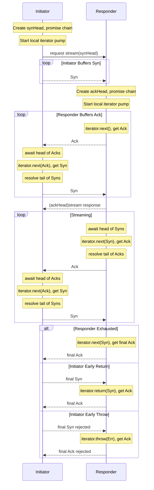

# Design Document for `@endo/exo-stream`

## Protocol Overview

The exo-stream protocol provides non-lossy streams of passable data, with control flow,
such that the producer does not overwhelm the consumer.

The exo-stream protocol uses bidirectional promise chains for streaming over CapTP.
By default, the protocol is fully synchronized (buffer=0), requiring a full round-trip
for each value — no better than a naive request-response protocol, but suitable for
deliberate synchronization. With a buffer value in excess of 0, promise chain nodes
propagate via CapTP before the event loop yields to I/O, keeping the responder busy
while the initiator consumes values:

1. **Initiator** creates a "synchronization" promise chain and holds its resolver
2. **Initiator** calls `stream(synHead)` passing the synchronization chain head
3. **Responder** creates an "acknowledgement" promise chain and holds its resolver
4. **Responder** returns the acknowledgement chain head directly
5. **Initiator** sends synchronization messages by resolving nodes on the synchronization chain
6. **Responder** awaits synchronization messages, then produces values on the acknowledgement chain

Both sides hold their resolvers locally. No resolvers cross the wire.

## Terminology

- **Initiator**: The side that starts streaming (creates synchronization chain,
  iterates remotely)
- **Responder**: The side that provides values (wraps a local async iterator),
- **Synchronization chain**: Promise chain from initiator to responder,
- **Acknowledgement chain**: Promise chain from responder to initiator.

Streams come in the **Reader** and **Writer** flavors that vary only
in usage, because the protocol is symmetric.

- For a **Reader**, the **Initiator** is the **Consumer** and the **Responder**
  is the **Producer**.
  Data flows from responder to initiator on the acknowledgement chain.
  The synchronization chain carries `undefined` for flow control.
  When the initiator calls `return(value)` to close early, the final
  synchronization node carries that argument value to the responder. If the
  responder is backed by a JavaScript iterator with a `return(value)` method,
  it forwards the argument and uses the iterator’s returned value as the final
  acknowledgement. Otherwise, it terminates with the original argument value.
- For a **Writer**, the **Initiator** is the **Producer** and the **Responder**
  is the **Consumer**.
  Data flows from initiator to responder on the synchronization chain.
  The acknowledgement chain carries `undefined` (flow control only). When the
  initiator calls `return(value)` to close early, the final syn node carries that
  argument value. If the responder is backed by a JavaScript iterator with a
  `return(value)` method, it forwards the argument and uses the iterator’s
  returned value as the terminal ack; otherwise it terminates with the original
  argument value.
- We leave a void in the terminology for configurations where neither or both
  parties send data.
  **Duplex** passable streams are best modeled with a pair of unentangled
  reader and writer, even if they share a duplex connection for purposes of
  transport.

## Module Structure

Reader and writer modules are duals of each other — symmetric in structure,
mirrored in data flow direction.

### Reader Modules

| Module | Function | Role |
|--------|----------|------|
| `reader-pump.js` | `makeReaderPump(iterator, options?)` | Core responder pump. Pulls from local iterator, produces ack data chain. |
| `reader-from-iterator.js` | `readerFromIterator(iterator, options?)` | Responder: wraps local iterator as `PassableReader` Exo. |
| `iterate-reader.js` | `iterateReader(readerRef, options?)` | Initiator: converts remote `PassableReader` to local `AsyncIterableIterator`. |

### Writer Modules

| Module | Function | Role |
|--------|----------|------|
| `writer-pump.js` | `makeWriterPump(iterator, options?)` | Core responder pump. Pushes received data to local sink iterator, produces ack flow-control chain. |
| `writer-from-iterator.js` | `writerFromIterator(iterator, options?)` | Responder: wraps local sink iterator as `PassableWriter` Exo. |
| `iterate-writer.js` | `iterateWriter(writerRef, options?)` | Initiator: returns a local writer iterator that sends values via `next(value)`. |

### Bytes Reader Modules

| Module | Function | Role |
|--------|----------|------|
| `bytes-reader-from-iterator.js` | `bytesReaderFromIterator(bytesIterator, options?)` | Responder: wraps `AsyncIterator<Uint8Array>` as `PassableBytesReader` Exo (base64 encoding). |
| `iterate-bytes-reader.js` | `iterateBytesReader(bytesReaderRef, options?)` | Initiator: converts remote `PassableBytesReader` to local `AsyncIterableIterator<Uint8Array>` (base64 decoding). |

### Bytes Writer Modules

| Module | Function | Role |
|--------|----------|------|
| `bytes-writer-from-iterator.js` | `bytesWriterFromIterator(iterator, options?)` | Responder: wraps local sink iterator as `PassableBytesWriter` Exo (base64 decoding on receive). |
| `iterate-bytes-writer.js` | `iterateBytesWriter(bytesWriterRef, options?)` | Initiator: returns a local bytes writer iterator that sends `Uint8Array` via `next(value)`. |

## Protocol Flow



### Reader Flow

For a Reader, the synchronization chain carries `undefined` for flow control,
except that when the initiator calls `return(value)` to close early, the final
synchronization node carries that argument value to the responder. If the
responder is backed by a JavaScript iterator with a `return(value)` method, it
forwards the argument and uses the iterator’s returned value as the final
acknowledgement. Otherwise, it terminates with the original argument value. The
acknowledgement chain carries `TRead` (data):

- **Responder** (`readerFromIterator`): wraps a local `AsyncIterator<TRead>`,
  pulls values and sends them on the ack chain.
- **Initiator** (`iterateReader`): sends `undefined` syn nodes to request values,
  receives data on the ack chain.

### Writer Flow

For a Writer, the synchronization chain carries `TWrite` (data). When the
initiator calls `return(value)` to close early, the final syn node carries that
argument value. If the responder is backed by a JavaScript iterator with a
`return(value)` method, it forwards the argument and uses the iterator’s
returned value as the terminal ack; otherwise it terminates with the original
argument value. The acknowledgement chain carries `undefined` (flow control):

- **Responder** (`writerFromIterator`): wraps a local sink iterator,
  receives data on the syn chain and pushes to the iterator via `iterator.next(value)`.
- **Initiator** (`iterateWriter`): returns a local writer iterator; each
  `next(value)` sends data on the syn chain and uses `undefined` ack nodes for
  flow control.

### Bytes Reader Flow

1. **Responder** (`bytesReaderFromIterator`):
   - Takes `AsyncIterator<Uint8Array>`
   - Encodes each chunk to base64
   - Creates Exo with `streamBase64()` method

2. **Initiator** (`iterateBytesReader`):
   - Creates synchronize chain
   - Calls `streamBase64(synHead)` to get acknowledge chain head
   - Sends synchronizes to induce production
   - Decodes base64 to Uint8Array

3. **Transmission over CapTP**:
   - Synchronizes flow: initiator → responder (via synchronize promise chain)
   - Acknowledges flow: responder → initiator (via acknowledge promise chain)
   - CapTP transmits resolved nodes opportunistically

### Bytes Writer Flow

1. **Initiator** (`iterateBytesWriter`):
   - Returns a local bytes writer iterator
   - Encodes each chunk to base64
   - Sends base64 strings on the synchronize chain via `next(value)`

2. **Responder** (`bytesWriterFromIterator`):
   - Creates Exo with `streamBase64()` method
   - Receives base64 strings on the synchronize chain
   - Decodes base64 to Uint8Array
   - Pushes decoded bytes to local sink iterator

3. **Transmission over CapTP**:
   - Synchronizes flow: initiator → responder (base64 strings via synchronize promise chain)
   - Acknowledges flow: responder → initiator (flow control via acknowledge promise chain)
   - CapTP transmits resolved nodes opportunistically

## Why E.get() Pipelining Works

When an Exo method returns a plain copy-data Promise (not a remotable),
`E()` waits for the Promise to resolve before sending.
We use `E.get()` to pipeline property access on the promise, avoiding this:

```javascript
// We pipeline through the promise:
let nodePromise = E(streamRef).stream(synHead);  // No await yet
// ...later in next():
const value = await E.get(node).value;           // Pipeline property access
nodePromise = node.promise;                      // Get next node
```

This allows the initiator to immediately start resolving synchronization nodes
without waiting for the acknowledge chain to resolve first, avoiding datalock.

## Migration Path for Bytes Streams

The `streamBase64()` method exists to support graceful migration:

1. **Current**: `streamBase64()` yields base64 strings
2. **Future**: When CapTP supports binary, implement `stream()` yielding `Uint8Array`
3. **Migration**:
   - Responders implement both `stream()` and `streamBase64()`
   - Initiators elect to migrate from `iterateBytesReader()` to `iterateReader()`,
     and from `iterateBytesWriter()` to `iterateWriter()`.
   - Eventually `streamBase64()` can be deprecated

This allows bytes-streamable Exos to evolve without breaking existing initiators.
