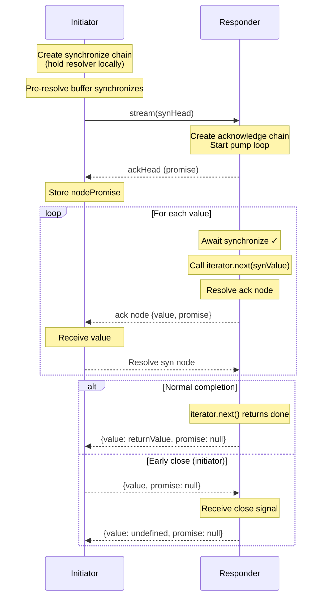

# OCapN Stream Protocol Specification

**Status:** Draft
**Version:** 0.1.0  
**Authors:** Kris Kowal
**Date:** 2026-01-01

## Abstract

This document specifies a protocol for transmitting asynchronous iteration
sequences over CapTP (Capability Transport Protocol). The protocol enables
streaming of values between distributed objects with built-in
flow control, early termination, and bidirectional value passing.

## Introduction

### Motivation

Asynchronous iterators are a fundamental abstraction for streaming data in
JavaScript and other capability-safe environments. When bridging async
iterators across CapTP, naive approaches suffer from:

1. **Round-trip latency**: Traditional iterator protocols require a round-trip
   per item (`next()` → value → `next()` → value → ...)
2. **No flow control**: Responders may overwhelm initiators
3. **Complex lifecycle**: Managing iterator cleanup across network boundaries

This protocol addresses these issues through bidirectional promise chains
that enable pipelining, flow control, and clean termination semantics.

### Design Goals

- **Pipelining**: Promise chain nodes propagate via CapTP before the event loop yields to I/O, avoiding unnecessary round-trips
- **Flow control**: Initiator-driven synchronization prevents responder overrun
- **Bidirectional values**: Support for `next(value)` semantics (generator protocol)
- **Clean termination**: Both normal completion and early close
- **Capability-safe**: All components are passable over CapTP
- **Graceful migration**: Separate methods for different encodings allow evolution

### Terminology

- **Initiator**: The side that starts streaming (creates synchronization chain, iterates remotely)
- **Responder**: The side that provides values (wraps a local async iterator)
- **Synchronization chain**: Promise chain from initiator to responder.
- **Acknowledgement chain**: Promise chain from responder to initiator.
- **Stream node**: A node in either promise chain

Streams come in **Reader** and **Writer** flavors that vary only in usage (the
protocol is symmetric):

- For a **Reader**, the **Initiator** is the **Consumer** and the **Responder**
  is the **Producer**
- For a **Writer**, the **Initiator** is the **Producer** and the **Responder**
  is the **Consumer**

## Data Structures

### Stream Node

Like `IteratorResult`, `StreamNode` is a discriminated union:

```typescript
// Yield node - carries a value and continues the chain
interface StreamYieldNode<Y, R = undefined> {
  value: Y;
  promise: Promise<StreamNode<Y, R>>;
}

// Return node - final node with return value
interface StreamReturnNode<R = undefined> {
  value: R;
  promise: null;
}

// Discriminated union
type StreamNode<Y = undefined, R = undefined> =
  | StreamYieldNode<Y, R>
  | StreamReturnNode<R>;
```

**Fields:**
- `value`: The carried value (yield or return)
- `promise`: Promise resolving to the next node, or `null` for final node

The `promise` field discriminates between yield nodes (continues) and return nodes (terminates).
Both the synchronize chain and acknowledge chain use this structure.

### Stream Interface

A stream capability exposes the following interface:

```typescript
interface PassableStream {
  stream(synchronizes: ERef<StreamNode>): Promise<StreamNode>;
  yieldPattern(): Pattern | undefined;
  returnPattern(): Pattern | undefined;
}

// Where ERef<T> = T | PromiseLike<T>
// Pattern is from @endo/patterns - a structure for runtime type validation
```

**Methods:**
- `stream(synchronizes)`: Initiates streaming; accepts either a `StreamNode` or `Promise<StreamNode>` for the synchronize chain head; returns the acknowledge chain head
- `yieldPattern()`: Returns the pattern for validating yielded values (optional)
- `returnPattern()`: Returns the pattern for validating the return value (optional)

## Protocol Flow

### Initialization

1. Initiator creates the synchronize chain by creating a promise kit
2. Initiator optionally pre-resolves N synchronize nodes (buffering)
3. Initiator calls `stream(synHead)` on the responder
4. Responder creates the acknowledge chain and returns its head
5. Responder starts the pump loop

### Initiator Algorithm

```
function initiate(streamRef, buffer = 1):
    // Create synchronize chain
    let {promise: synHead, resolve: synResolve} = promiseKit()
    
    // Pre-synchronize 'buffer' values
    for i in 0..buffer:
        let {promise, resolve} = promiseKit()
        synResolve({value: undefined, promise})
        synResolve = resolve
    
    // Get acknowledge chain head
    let nodePromise = streamRef.stream(synHead)
    
    // Iteration loop
    while true:
        let node = await nodePromise

        if node.promise === null:
            // Stream ended - this is the return value
            return node.value

        yield node.value
        
        // Send synchronize for next value
        let {promise, resolve} = promiseKit()
        synResolve({value: synValue, promise})
        synResolve = resolve
        
        nodePromise = node.promise
```

### Responder Algorithm

```
function respond(iterator, synchronizes):
    // Create acknowledge chain
    let {promise: ackHead, resolve: ackResolve} = promiseKit()
    
    // Pump loop (runs asynchronously)
    async function pump():
        let synPromise = synchronizes
        
        while true:
            let synNode = await synPromise
            
            if synNode.promise === null:
                // Initiator signaled close
                ackResolve({value: undefined, promise: null})
                return
            
            // Produce next value, passing synchronize value to iterator
            let result = await iterator.next(synNode.value)
            
            let {promise, resolve} = promiseKit()
            ackResolve({
                value: result.value,
                promise: result.done ? null : promise
            })
            ackResolve = resolve
            
            if result.done:
                return
            
            synPromise = synNode.promise
    
    pump()
    return ackHead
```

### Sequence Diagram



## Termination Semantics

### Normal Completion

When the iterator is exhausted:

1. Responder receives `{done: true, value}` from `iterator.next()`
2. Responder resolves ack node with `{value, promise: null}`
3. Initiator receives node with `promise === null`
4. The `value` is the iterator's return value

### Early Close (Initiator-Initiated)

When the initiator wants to stop iteration:

1. Initiator resolves synchronize node with `{value, promise: null}`
2. Responder receives synchronize with `promise === null`
3. Responder resolves ack node with `{value: undefined, promise: null}`
4. Responder may call `iterator.return()` for cleanup

### Early Close (Responder-Initiated)

When the responder wants to stop iteration early (e.g., resource exhaustion, internal error
that shouldn't propagate as rejection):

1. Responder resolves ack node with `{value: returnValue, promise: null}`
2. Initiator receives node with `promise === null`
3. Initiator treats this as normal completion with the return value
4. Synchronize chain becomes orphaned (no further awaits)

This is structurally identical to normal completion—the responder simply sends a return
node before the underlying iterator is exhausted. For errors that should propagate,
see Error Propagation below.

### Immediate Close

To close without receiving any values:

1. Initiator passes `{value: undefined, promise: null}` as synchronizes
2. Responder immediately resolves ack with `{value: undefined, promise: null}`
3. Iterator is never started

**Important:** The synchronize chain must always start with a node, not `null`. The
`promise: null` within the node signals close, not a null node itself.

### Error Propagation

When the iterator throws:

1. Responder catches the error from `iterator.next()`
2. Responder rejects the acknowledge chain promise
3. Initiator receives rejection when awaiting the node
4. Error propagates through normal promise rejection

## Flow Control

### Buffering

The initiator can prepare a chain of pre-synchronized nodes and send them
immediately, which will pipeline to the responder with the initial `stream`
invocation.
This should induce the responder to advance some iterations before the consumer
requests them and overcome some amount of round-trip latency.

Similarly, the responder can presume to advance some number of nodes initially,
appending to the acknowledgement chain before receiving synchronization messages.

This should allow the producer to advance ahead of the consumer, by the total
buffering arranged by the producer and consumer.

### Backpressure

Initiator controls the pace:

1. Initiator only resolves synchronize when ready for next value
2. Responder blocks on synchronize promise
3. Natural backpressure through promise chain

## 6. Bidirectional Values

### 6.1 Generator Protocol Support

The protocol supports the full generator protocol:

- `next(value)`: Synchronize node's `value` field passes to `iterator.next(value)`
- `return(value)`: Synchronize node with `promise: null` signals return
- `throw(error)`: Initiator rejects synchronize promise to signal error

### 6.2 Use Cases

- Coroutine-style communication
- Request-response within a stream
- Cooperative multitasking

